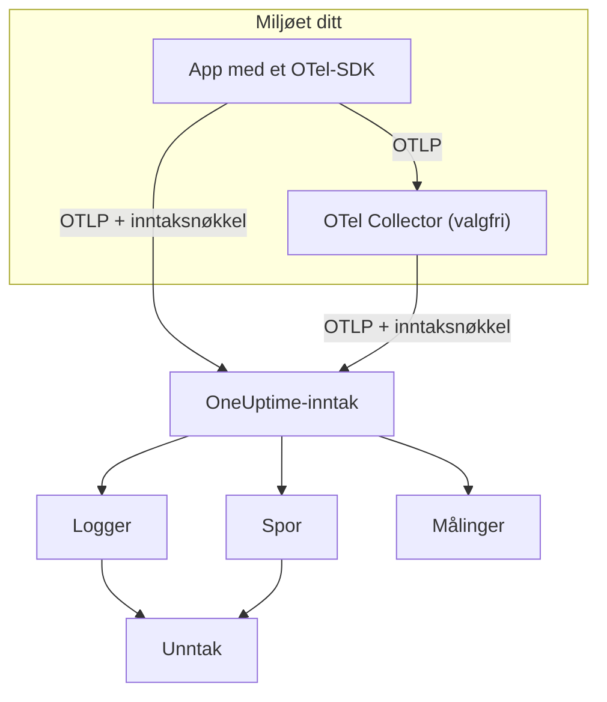

# OpenTelemetry

OneUptime tar imot logger, målinger og traces over OpenTelemetry Protocol (OTLP). Pek et hvilket som helst OpenTelemetry-SDK, eller en OpenTelemetry Collector, mot OneUptime med en inntaksnøkkel, så dukker dataene dine opp under **Logger**, **Spor**, **Målinger** og **Unntak**. Denne siden får en tjeneste til å sende data på noen få minutter, og går deretter gjennom endepunktene, grensene og feilene du trenger i produksjon.

:::cards
- [Hurtigstart](#hurtigstart): Opprett en nøkkel, sett fire miljøvariabler og legg til SDK-et.
- [Bruk en Collector](#send-gjennom-en-opentelemetry-collector): Legg til OneUptime som eksportør i en collector du allerede kjører.
- [Endepunkter og grenser](#endepunkter-og-grenser): URL-er, porter, kodinger, størrelsesgrenser og statuskoder.
- [Feilsøking](#feilsøking): Hva du skal sjekke når ingen data kommer frem.
:::

## Slik fungerer det

Applikasjonen din eksporterer OTLP rett til OneUptime, eller til en OpenTelemetry Collector som sender det videre. Hver forespørsel har inntaksnøkkelen din i headeren `x-oneuptime-token`, og OneUptime bruker nøkkelen til å finne prosjektet ditt.



- **Tjenester opprettes for deg.** Ressursattributtet `service.name` (satt med `OTEL_SERVICE_NAME`) gir navn til tjenesten dataene dine hører til. OneUptime oppretter tjenesten første gang den sender, og viser den under **Produkter → Tjenester**.
- **Feil blir til unntak.** Unntakshendelser på spans, og unntak som er registrert i logger, grupperes i saker under **Unntak** — se [Unntak fra logger](#unntak-fra-logger).

## Før du begynner

- Et OneUptime-prosjekt der du kan opprette inntaksnøkler: prosjekteiere og -administratorer kan det, og det kan alle med tillatelsen **Create Telemetry Ingestion Key**.
- En applikasjon du kan legge til et OpenTelemetry-SDK i, eller en OpenTelemetry Collector.
- Utgående HTTPS (port 443) fra applikasjonen eller collectoren til `oneuptime.com`, eller til din egen OneUptime-vert.

> [!NOTE]
> På OneUptime Cloud faktureres telemetri per GB som tas inn. Et prosjekt på Free-planen trenger en betalingsmetode før det kan sende telemetri — dialogen som oppretter nøkkelen, viser prisene.

## Hurtigstart

:::steps
### Opprett en inntaksnøkkel

1. Gå til **Produkter → Prosjektinnstillinger**.
2. Åpne **Telemetri og APM** i sidemenyen, og velg **Inntaksnøkler**.
3. Klikk på **Opprett ingestion-nøkkel**. Dialogen fyller inn et navn og velger nøkkeltypen **Server**, som en applikasjon eller en collector sender med. Gi den nytt navn om du vil, og klikk deretter på **Opprett ingestion-nøkkel**.


Den nye nøkkelen åpnes på sin egen side. Kopier **Hemmelig nøkkel** — det er tokenet du sender som `x-oneuptime-token`.


### Sett OpenTelemetry-miljøvariablene

Alle OpenTelemetry-SDK-er leser de samme standard miljøvariablene, så dette steget er likt i alle språk.

| Miljøvariabel | Verdi | Hva den gjør |
| --- | --- | --- |
| `OTEL_EXPORTER_OTLP_ENDPOINT` | `https://oneuptime.com/otlp` | Hvor det sendes. SDK-et legger selv til `/v1/traces`, `/v1/metrics` og `/v1/logs`. |
| `OTEL_EXPORTER_OTLP_HEADERS` | `x-oneuptime-token=YOUR_ONEUPTIME_INGESTION_KEY` | Sender inntaksnøkkelen din med hver forespørsel. |
| `OTEL_EXPORTER_OTLP_PROTOCOL` | `http/protobuf` | OTLP over HTTP. Noen SDK-er bruker gRPC som standard, som bruker et annet endepunkt. |
| `OTEL_SERVICE_NAME` | `my-service` | Tjenesten dataene dine vises under i OneUptime. |

```bash
export OTEL_EXPORTER_OTLP_ENDPOINT="https://oneuptime.com/otlp"
export OTEL_EXPORTER_OTLP_HEADERS="x-oneuptime-token=YOUR_ONEUPTIME_INGESTION_KEY"
export OTEL_EXPORTER_OTLP_PROTOCOL="http/protobuf"
export OTEL_SERVICE_NAME="my-service"
```

Selvhostet? Bytt ut `https://oneuptime.com` med URL-en til OneUptime-instansen din, for eksempel `https://oneuptime.example.com/otlp`. For å merke unntak med et miljø setter du også `OTEL_RESOURCE_ATTRIBUTES` til `deployment.environment=production`.

### Legg til OpenTelemetry i appen din

Velg språket ditt. Hvert oppsett leser miljøvariablene over, så verken endepunkt eller nøkkel står i koden din.

:::tabs
@tab Node.js
Installer SDK-et, de automatiske instrumenteringene og OTLP/HTTP-eksportørene:

```bash
npm install @opentelemetry/sdk-node @opentelemetry/auto-instrumentations-node \
  @opentelemetry/exporter-trace-otlp-proto @opentelemetry/exporter-metrics-otlp-proto \
  @opentelemetry/exporter-logs-otlp-proto @opentelemetry/sdk-metrics @opentelemetry/sdk-logs
```

Opprett SDK-et i en egen fil:

```javascript title="instrumentation.js"
const { NodeSDK } = require("@opentelemetry/sdk-node");
const { getNodeAutoInstrumentations } = require("@opentelemetry/auto-instrumentations-node");
const { OTLPTraceExporter } = require("@opentelemetry/exporter-trace-otlp-proto");
const { OTLPMetricExporter } = require("@opentelemetry/exporter-metrics-otlp-proto");
const { OTLPLogExporter } = require("@opentelemetry/exporter-logs-otlp-proto");
const { PeriodicExportingMetricReader } = require("@opentelemetry/sdk-metrics");
const { BatchLogRecordProcessor } = require("@opentelemetry/sdk-logs");

// The exporters read OTEL_EXPORTER_OTLP_ENDPOINT and OTEL_EXPORTER_OTLP_HEADERS.
const sdk = new NodeSDK({
  traceExporter: new OTLPTraceExporter(),
  metricReader: new PeriodicExportingMetricReader({
    exporter: new OTLPMetricExporter(),
  }),
  logRecordProcessors: [new BatchLogRecordProcessor(new OTLPLogExporter())],
  instrumentations: [getNodeAutoInstrumentations()],
});

sdk.start();
```

Last den inn før applikasjonskoden:

```bash
node --require ./instrumentation.js app.js
```
@tab Python
Installer OpenTelemetry-distribusjonen og eksportøren, og deretter instrumenteringene for bibliotekene appen din bruker:

```bash
pip install opentelemetry-distro opentelemetry-exporter-otlp
opentelemetry-bootstrap -a install
```

Start appen gjennom `opentelemetry-instrument`. Den eksporterer traces, målinger og logger; logging-variabelen sender også poster skrevet med Pythons `logging`-modul:

```bash
OTEL_PYTHON_LOGGING_AUTO_INSTRUMENTATION_ENABLED=true opentelemetry-instrument python app.py
```
@tab Go
Legg til SDK-et og OTLP/HTTP-eksportørene:

```bash
go get go.opentelemetry.io/otel go.opentelemetry.io/otel/sdk go.opentelemetry.io/otel/sdk/metric \
  go.opentelemetry.io/otel/exporters/otlp/otlptrace/otlptracehttp \
  go.opentelemetry.io/otel/exporters/otlp/otlpmetric/otlpmetrichttp
```

Opprett tracer- og meter-providerne når programmet starter:

```go title="main.go"
package main

import (
	"context"
	"log"

	"go.opentelemetry.io/otel"
	"go.opentelemetry.io/otel/exporters/otlp/otlpmetric/otlpmetrichttp"
	"go.opentelemetry.io/otel/exporters/otlp/otlptrace/otlptracehttp"
	sdkmetric "go.opentelemetry.io/otel/sdk/metric"
	sdktrace "go.opentelemetry.io/otel/sdk/trace"
)

func main() {
	ctx := context.Background()

	// Both exporters read OTEL_EXPORTER_OTLP_ENDPOINT and OTEL_EXPORTER_OTLP_HEADERS.
	traceExporter, err := otlptracehttp.New(ctx)
	if err != nil {
		log.Fatal(err)
	}
	tracerProvider := sdktrace.NewTracerProvider(sdktrace.WithBatcher(traceExporter))
	defer tracerProvider.Shutdown(ctx)
	otel.SetTracerProvider(tracerProvider)

	metricExporter, err := otlpmetrichttp.New(ctx)
	if err != nil {
		log.Fatal(err)
	}
	meterProvider := sdkmetric.NewMeterProvider(
		sdkmetric.WithReader(sdkmetric.NewPeriodicReader(metricExporter)),
	)
	defer meterProvider.Shutdown(ctx)
	otel.SetMeterProvider(meterProvider)

	// Your application code.
}
```

Providerne henter `OTEL_SERVICE_NAME` fra miljøet. For logger legger du til `otlploghttp` med en loggbro som `otelslog`; den leser de samme variablene.
@tab Java
Last ned OpenTelemetrys Java-agent og koble den til applikasjonen din. Ingen kodeendringer er nødvendige:

```bash
curl -L -O https://github.com/open-telemetry/opentelemetry-java-instrumentation/releases/latest/download/opentelemetry-javaagent.jar
java -javaagent:opentelemetry-javaagent.jar -jar my-app.jar
```

Agenten instrumenterer vanlige rammeverk og biblioteker, og eksporterer traces, målinger og logger skrevet gjennom Logback eller Log4j.
@tab .NET
Legg til OpenTelemetry-pakkene for ASP.NET Core:

```bash
dotnet add package OpenTelemetry.Extensions.Hosting
dotnet add package OpenTelemetry.Exporter.OpenTelemetryProtocol
dotnet add package OpenTelemetry.Instrumentation.AspNetCore
dotnet add package OpenTelemetry.Instrumentation.Http
```

Registrer OpenTelemetry ved oppstart. `UseOtlpExporter()` sender traces, målinger og logger, og leser variablene `OTEL_EXPORTER_OTLP_*`:

```csharp title="Program.cs"
using OpenTelemetry;
using OpenTelemetry.Metrics;
using OpenTelemetry.Trace;

var builder = WebApplication.CreateBuilder(args);

builder.Services.AddOpenTelemetry()
    .WithTracing(tracing => tracing
        .AddAspNetCoreInstrumentation()
        .AddHttpClientInstrumentation())
    .WithMetrics(metrics => metrics
        .AddAspNetCoreInstrumentation()
        .AddHttpClientInstrumentation())
    .WithLogging()
    .UseOtlpExporter();

var app = builder.Build();
app.Run();
```

Bruker du Serilog? Se [Serilog](/docs/telemetry/serilog) for å sende loggene derfra til OneUptime.
:::

### Sjekk at data kommer frem

Spør OneUptime om den godtar nøkkelen din:

```bash
curl -i -H "x-oneuptime-token: YOUR_ONEUPTIME_INGESTION_KEY" \
  https://oneuptime.com/otlp/v1/validate
```

En nøkkel som virker, returnerer `200` med `"valid": true`. Alt annet returnerer `401` med en melding om hva som er galt — ukjent, deaktivert eller utløpt.

Kjør deretter appen og bruk den i et minutt. Åpne **Produkter → Tjenester**: Tjenesten din står der under navnet du satte i `OTEL_SERVICE_NAME`, med logger, traces, målinger og unntak. **Produkter → Logger**, **Produkter → Spor** og **Produkter → Målinger** viser de samme dataene på tvers av alle tjenester.
:::

:::details Send en testlogg uten SDK
OTLP/HTTP godtar også JSON, så du kan sende en logg med `curl`. `severityNumber` med verdien `9` gjør den til en informasjonslogg:

```bash
curl -i https://oneuptime.com/otlp/v1/logs \
  -H "Content-Type: application/json" \
  -H "x-oneuptime-token: YOUR_ONEUPTIME_INGESTION_KEY" \
  -d '{
    "resourceLogs": [{
      "resource": {
        "attributes": [
          { "key": "service.name", "value": { "stringValue": "my-service" } }
        ]
      },
      "scopeLogs": [{
        "logRecords": [{
          "severityNumber": 9,
          "body": { "stringValue": "Hello from curl" }
        }]
      }]
    }]
  }'
```

En `200` betyr at loggen ble godtatt. Den vises under **Produkter → Logger** innen noen sekunder, i tjenesten `my-service`.
:::

## Send gjennom en OpenTelemetry Collector

Kjør en collector når du allerede har en, når du vil samle, filtrere eller berike data på ett sted, eller for å holde inntaksnøkkelen utenfor applikasjonene dine. Appene dine eksporterer til collectoren, og bare collectoren snakker med OneUptime.

:::steps
### Legg til OneUptime som eksportør

Legg til en `otlphttp`-eksportør som peker mot OneUptime, og send hver pipeline gjennom den:

```yaml title="otel-collector-config.yaml"
receivers:
  otlp:
    protocols:
      grpc:
        endpoint: 0.0.0.0:4317
      http:
        endpoint: 0.0.0.0:4318

processors:
  batch: {}

exporters:
  otlphttp:
    endpoint: https://oneuptime.com/otlp
    headers:
      x-oneuptime-token: YOUR_ONEUPTIME_INGESTION_KEY

service:
  pipelines:
    traces:
      receivers: [otlp]
      processors: [batch]
      exporters: [otlphttp]
    metrics:
      receivers: [otlp]
      processors: [batch]
      exporters: [otlphttp]
    logs:
      receivers: [otlp]
      processors: [batch]
      exporters: [otlphttp]
```

Behold eksportørens standardinnstillinger: Den sender protobuf komprimert med gzip, og OneUptime godtar begge deler. Ikke sett en `Content-Type`-header på eksportøren — OneUptime velger dekoder ut fra den headeren, så en JSON-innholdstype foran protobuf-byte ødelegger inntaket.

### Kjør collectoren

:::tabs
@tab Docker
```bash
docker run -d --name otel-collector \
  -p 4317:4317 -p 4318:4318 \
  -v "$(pwd)/otel-collector-config.yaml:/etc/otelcol-contrib/config.yaml" \
  otel/opentelemetry-collector-contrib:latest
```
@tab Linux
```bash
otelcol-contrib --config otel-collector-config.yaml
```
:::

Collectoren lytter etter OTLP på port `4317` (gRPC) og `4318` (HTTP), portene SDK-er sender til som standard.

### Pek appene dine mot collectoren

Sett `OTEL_EXPORTER_OTLP_ENDPOINT` i applikasjonene dine til collectoren, for eksempel `http://localhost:4318`, og fjern `OTEL_EXPORTER_OTLP_HEADERS` — collectoren legger til nøkkelen. Behold `OTEL_SERVICE_NAME` i hver applikasjon.

Dataene kommer frem i OneUptime akkurat som i hurtigstarten. Hvis ikke, står det i collectorens egen logg hvorfor — se [Feilsøking](#feilsøking).
:::

Eksporterer du allerede til en annen leverandør? Legg til `otlphttp`-eksportøren ved siden av den eksisterende, og før opp begge under `exporters` i hver pipeline for å sende til begge mens du sammenligner. For også å samle inn vertsmålinger og loggfiler, se veiledningen [Host OpenTelemetry Collector](/docs/telemetry/host-otel-collector).

## Endepunkter og grenser

| Innstilling | OTLP/HTTP (anbefalt) | OTLP/gRPC |
| --- | --- | --- |
| Endepunkt | `https://oneuptime.com/otlp` | `https://oneuptime.com:443` |
| Autentisering | Headeren `x-oneuptime-token` | Metadata `x-oneuptime-token` |
| Koding | Protobuf (`application/x-protobuf`) eller JSON (`application/json`) | Protobuf |
| Komprimering | Ingen, `gzip`, `deflate` eller `zstd` | Ingen eller `gzip` |
| Forespørselsstørrelse | Opptil 4 MB per forespørsel på `/otlp` | Opptil 4 MB per melding |

Over HTTP har hvert signal sin egen sti under endepunktet. SDK-er og collectoren legger den til for deg; sett den selv bare når et verktøy ber om en fullstendig URL.

| Signal | OTLP/HTTP-URL |
| --- | --- |
| Traces | `https://oneuptime.com/otlp/v1/traces` |
| Målinger | `https://oneuptime.com/otlp/v1/metrics` |
| Logger | `https://oneuptime.com/otlp/v1/logs` |
| Profiler | `https://oneuptime.com/otlp/v1/profiles` |

For kontinuerlig profilering sender de fleste profilere i stedet til det Pyroscope-kompatible endepunktet — se [Kontinuerlig profilering](/docs/telemetry/profiles). En collector som eksporterer OTLP-profiler, må sette eksportørens `profiles_endpoint` til `https://oneuptime.com/otlp/v1/profiles`, fordi den som standard sender profiler til en utviklingssti som OneUptime ikke betjener.

### OTLP over gRPC

OneUptime tilbyr OTLP/gRPC på samme vert som webappen, på port 443 over TLS. Sett `OTEL_EXPORTER_OTLP_PROTOCOL` til `grpc` og `OTEL_EXPORTER_OTLP_ENDPOINT` til `https://oneuptime.com:443`, og send den samme headeren `x-oneuptime-token`. I en collector bruker du eksportøren `otlp` med `endpoint: oneuptime.com:443` og de samme `headers`.

På en selvhostet installasjon når gRPC bare OneUptime over HTTPS: En ukryptert HTTP-tilkobling (h2c) avvises. Hvis instansen din leveres over vanlig HTTP, bruk OTLP/HTTP.

To av innstillingene til en nøkkel gjelder bare OTLP/HTTP: **Requests Per Minute Limit** og **Pinned Service Name**. Data sendt over gRPC beholder `service.name` de ble sendt med, og telles ikke mot grensen.

### Svar

OneUptime svarer på en eksport så snart dataene står i kø, og dataene vises noen sekunder senere.

| Svar | gRPC-status | Betydning | Hva du gjør |
| --- | --- | --- | --- |
| `200` | `OK` | Godtatt. | Ingenting. |
| `401` | `UNAUTHENTICATED` | Nøkkelen mangler, er ukjent eller utløpt. | Sammenlign verdien av `x-oneuptime-token` med nøkkelens **Hemmelig nøkkel**. |
| `402` | `PERMISSION_DENIED` | Bare OneUptime Cloud: Prosjektet er på Free-planen og har ingen betalingsmetode. | Legg til en under **Prosjektinnstillinger → Fakturering og fakturaer → Fakturering**. |
| `413` | — | Forespørselen er større enn størrelsesgrensen. | Send mindre batcher. |
| `415` | — | `Content-Encoding` støttes ikke. | Bruk `gzip`, `deflate` eller `zstd`, eller ingen komprimering. |
| `422` | `PERMISSION_DENIED` | Nøkkelen er deaktivert, eller det er en nettlesernøkkel som brukes utenfor de tillatte origins. | Aktiver nøkkelen igjen, eller send med en servernøkkel. |
| `429` | — | Nøkkelens **Requests Per Minute Limit** er nådd. | Ingenting først: Eksportører prøver igjen etter `Retry-After`-tiden. Hev grensen hvis det fortsetter. |
| `503` | `UNAVAILABLE` | OneUptime starter opp, eller inntakskøen er utilgjengelig. | Ingenting: OTLP-eksportører prøver selv på nytt ved `503`. |

`401`, `402`, `413`, `415` og `422` er permanente feil for OTLP-eksportører: Eksportøren forkaster batchen og logger feilen i stedet for å prøve igjen.

### Omstarter og oppgraderinger

Mens OneUptime starter på nytt eller oppgraderes, svarer den på eksporter med `503` og `Retry-After: 5` til den er klar, og eksportørene sender dem igjen. Eksportøren i en collector fortsetter som standard å prøve igjen i fem minutter (`retry_on_failure`) og holder det den ikke fikk sendt i sin `sending_queue`, så la begge være slått på. Tiden da OneUptime ikke tok imot data, blir aldri holdt mot serverne, vertene eller andre ressurser: se [Når OneUptime ikke mottar data](/docs/monitor/when-oneuptime-is-not-receiving#ved-oppstart).

### Inntaksnøkler

Siden til hver nøkkel, under **Prosjektinnstillinger → Telemetri og APM → Inntaksnøkler**, har disse innstillingene:

| Innstilling | Hva den gjør |
| --- | --- |
| **Nøkkeltype** | **Server** (standard) for applikasjoner, collectorer og agenter. **Browser** for nøkler som leveres i en nettside: bare skriving, og godtas bare fra dens **Allowed Origins**. Den kan ikke endres etter at nøkkelen er opprettet. |
| **Allowed Origins** | Nett-origins en nettlesernøkkel virker fra, for eksempel `https://app.example.com`. Ignoreres på en servernøkkel. |
| **Pinned Service Name** | Når den er satt, erstatter den `service.name` på alt som sendes med denne nøkkelen over OTLP/HTTP. |
| **Aktivert** | Slå den av for straks å slutte å godta data sendt med nøkkelen, uten å slette den. |
| **Utløper** | Etter denne datoen avvises nøkkelen. Tom betyr at den aldri utløper. |
| **Requests Per Minute Limit** | Det høyeste antallet OTLP/HTTP-forespørsler per minutt som godtas med nøkkelen, på tvers av alle klienter som bruker den. Tom betyr ingen grense på en servernøkkel og 6 000 på en nettlesernøkkel. |
| **Last Used At** | Når data sist ble godtatt med nøkkelen. Bruk den til å finne nøkler som trygt kan roteres eller slettes. |

**Tilbakestill hemmelig nøkkel** på nøkkelens side erstatter hemmeligheten. Alle applikasjoner og collectorer som sender med den gamle, avvises til du oppdaterer dem.

## Selvhostet OneUptime

Alt på denne siden fungerer på samme måte mot din egen installasjon. Bruk OneUptime-URL-en din overalt der denne siden skriver `https://oneuptime.com`:

- `OTEL_EXPORTER_OTLP_ENDPOINT` er `https://YOUR-ONEUPTIME-HOST/otlp`, eller `http://YOUR-ONEUPTIME-HOST/otlp` hvis du leverer OneUptime over vanlig HTTP.
- Den medfølgende ingressen godtar forespørsler på opptil 4 MB på `/otlp`. En proxy du kjører foran OneUptime, kan ha en lavere grense — ingress-nginx setter `proxy-body-size` til 1 MB som standard —, så hev den også for `/otlp`, ellers får eksportører `413`.
- Hvis `DISABLE_TELEMETRY_INGESTION=true` er satt, godtar OneUptime alle eksporter og lagrer ingenting. Sjekk dette først når en selvhostet instans ikke viser noen data i det hele tatt.

## Unntak fra logger

OneUptime finner unntak i **logs** og samler dem i den samme visningen **Unntak** som feil fra traces mater. Hver logg hører allerede til en tjeneste eller vert, så unntaket tilskrives den. Unntak fra logger og traces deler gruppering etter fingeravtrykk, slik at en feil som rapporteres av både en trace og en logg, blir én sak.

En logg kan bli et unntak på to måter:

| Gjenkjenning | Logger det gjelder | Slik fungerer det |
| --- | --- | --- |
| **Unntaksattributter** (anbefalt) | Alle logger | En loggpost med OpenTelemetry-attributtet `exception.type`, `exception.message` eller `exception.stacktrace` blir direkte et unntak. De fleste loggintegrasjoner setter dem når du logger et unntak: Logback- og Log4j-appendere, Serilog, Pythons logging-instrumentering. Det er presist og virker i alle språk. |
| **Stakksporing i brødteksten** | Error- og fatal-logger uten trace-ID og span-ID | OneUptime søker gjennom de første 16 KB av brødteksten etter en stakksporing fra JavaScript, Python, Java, Go, Ruby, C#/.NET eller PHP, og henter type, melding og rammer fra den. En logg skrevet inne i et span hoppes over, fordi spannet selv rapporterer unntaket. |

Søket i brødteksten passer for logger i ren tekst som rå stdout, journald eller syslog som en collector leser. En stakksporing over flere linjer må komme frem som én loggpost, så slå på sammenslåing av flere linjer i collectoren — se veiledningen [Host OpenTelemetry Collector](/docs/telemetry/host-otel-collector).

Gjenkjenningen er på som standard. På en selvhostet installasjon slår du den av ved å sette `TELEMETRY_LOG_EXCEPTION_EXTRACTION_ENABLED=false` på tjenesten `app` — og også på `worker` hvis du kjører Helm-chartets dedikerte worker.

## Feilsøking

:::details Ingen data vises, og eksportøren logger `401`
Nøkkelen mangler, er ukjent eller utløpt. Sjekk at `OTEL_EXPORTER_OTLP_HEADERS` er `x-oneuptime-token=` etterfulgt av nøkkelens **Hemmelig nøkkel**, uten anførselstegn eller mellomrom i verdien, og at nøkkelen hører til prosjektet du ser på. Valideringsforespørselen i [Sjekk at data kommer frem](#sjekk-at-data-kommer-frem) forteller hvilket tilfelle det er.
:::

:::details Eksportøren logger `422`
Nøkkelen er deaktivert, eller det er en nettlesernøkkel. Slå **Aktivert** på igjen i nøkkelens innstillinger, eller opprett en **Server**-nøkkel: En nettlesernøkkel godtas bare fra en nettside på en av de tillatte origins.
:::

:::details Eksportøren logger `402`
Prosjektet er på OneUptime Clouds Free-plan og har ingen betalingsmetode, og telemetri faktureres etter bruk. Legg til en betalingsmetode under **Prosjektinnstillinger → Fakturering og fakturaer → Fakturering**, så godtas eksporter igjen.
:::

:::details Eksportøren logger `404`
SDK-et sender til feil sti. `OTEL_EXPORTER_OTLP_ENDPOINT` må slutte på `/otlp`, uten skråstrek til slutt og uten `/v1/...` — det legger SDK-et til. Hvis du setter en signalspesifikk variabel som `OTEL_EXPORTER_OTLP_TRACES_ENDPOINT`, forventer den hele URL-en, for eksempel `https://oneuptime.com/otlp/v1/traces`.
:::

:::details Ingenting skjer, og SDK-et logger tilkoblingsfeil
SDK-et eksporterer sannsynligvis over gRPC til et HTTP-endepunkt, eller til `localhost`. Sett `OTEL_EXPORTER_OTLP_PROTOCOL=http/protobuf`, eller bruk gRPC-endepunktet beskrevet i [OTLP over gRPC](#otlp-over-grpc). Sjekk også at prosessen faktisk ser miljøvariablene — i en container må du sette dem på containeren, ikke i skallet ditt.
:::

:::details Collectoren logger `Exporting failed` med `413`
En batch er større enn størrelsesgrensen. Gjør batchene mindre, for eksempel med `send_batch_max_size: 1000` på prosessoren `batch`. Hvis du selvhoster bak din egen proxy, sjekk også grensen for body-størrelse i den proxyen.
:::

:::details Data havner under feil tjeneste, eller under Unknown Service
Tjenesten kommer fra ressursattributtet `service.name`. Sett `OTEL_SERVICE_NAME` i hver applikasjon. Hvis nøkkelen har en **Pinned Service Name**, arkiveres hver OTLP/HTTP-eksport med den nøkkelen under det navnet i stedet.
:::

## Neste steg

:::cards
- [Søkesyntaks](/docs/telemetry/search-syntax): Filtrer logger, traces, målinger og unntak i utforskerne.
- [Loggpipelines](/docs/telemetry/log-pipelines): Tolk og berik logger når de kommer inn.
- [Loggmonitor](/docs/monitor/logs-monitor): Få varsel når samsvarende logger dukker opp.
- [Host OpenTelemetry Collector](/docs/telemetry/host-otel-collector): Samle inn vertsmålinger og loggfiler med en collector.
:::
