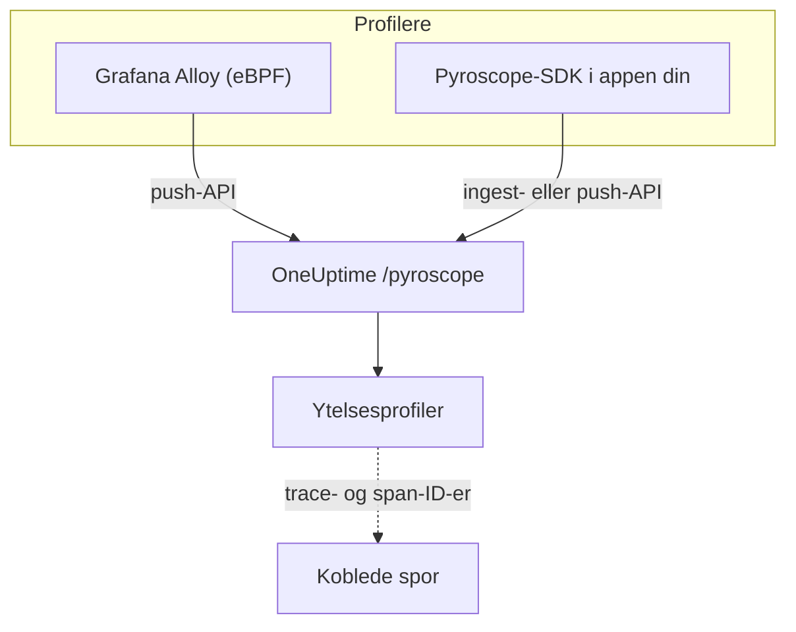

# Kontinuerlig profilering

Kontinuerlig profilering viser hva applikasjonen din bruker CPU-tid og minne på, funksjon for funksjon. OneUptime tilbyr et **Pyroscope-kompatibelt inntaks-API**, så alt som kan sende til en Pyroscope-server (eBPF-profileren i Grafana Alloy eller et Pyroscope-SDK for språket ditt) kan sende til OneUptime, og du leser resultatet som flammegrafer ved siden av loggene, målingene og sporene dine.

:::cards
- [Send profiler](#send-profiler): Grafana Alloy med eBPF, eller et Pyroscope-SDK i appen din.
- [Inntaksendepunkt](#inntaksendepunkt): Basis-URL-en og de tre måtene å gi nøkkelen på.
- [Kontroller at det virker](#kontroller-at-det-virker): Sjekk nøkkelen, siden og opplastingsstatusen.
- [Utforsk profiler](#utforsk-profiler-i-oneuptime): Flammegrafer, toppfunksjoner, sammenligninger og lenker til spor.
:::

## Slik fungerer det

En profiler tar stikkprøver av prosessene dine og laster opp en profil med noen sekunders mellomrom til OneUptimes endepunkt `/pyroscope`, med inntaksnøkkelen din. OneUptime lagrer hver profil under tjenesten den nevner, og tegner den som en flammegraf under **Ytelsesprofiler**.



## Før du begynner

Du trenger en telemetri-inntaksnøkkel av typen **Server**. Hvis du ikke har en ennå:

:::steps
### Åpne inntaksnøklene

Gå til **Produkter → Prosjektinnstillinger**, åpne **Telemetri og APM** i sidemenyen, og velg **Inntaksnøkler**.


### Opprett en nøkkel

Klikk på **Opprett ingestion-nøkkel**. Dialogen har allerede fylt ut nøkkelens navn og valgt **Server** (den typen nøkkel en applikasjon eller en collector sender med), så klikk på **Opprett ingestion-nøkkel** for å opprette den, eller gi den et nytt navn først.

### Kopier hemmeligheten

Den nye nøkkelen åpnes på sin egen side. Kopier **Hemmelig nøkkel**: det er inntakstokenet som eksemplene nedenfor kaller `YOUR_ONEUPTIME_INGESTION_TOKEN`.


:::

## Inntaksendepunkt

| Innstilling | Verdi |
| --- | --- |
| Basis-URL (adressen til Pyroscope-serveren) | `https://oneuptime.com/pyroscope` |
| Autentiseringsheader | `x-oneuptime-token: YOUR_ONEUPTIME_INGESTION_TOKEN` |

Klienter legger sin egen sti til basis-URL-en (`/ingest` for de fleste Pyroscope-SDK-er, `/push.v1.PusherService/Push` for Grafana Alloy og .NET-SDK-et fra v0.14), så du konfigurerer alltid bare basis-URL-en, uten skråstrek på slutten.

OneUptime leser inntakstokenet fra hvilken som helst av disse; bruk det klienten din støtter:

| Metode | Når du bruker den |
| --- | --- |
| Header `x-oneuptime-token` | Klienter som lar deg legge til egne headere. |
| `Authorization: Bearer <token>` | SDK-er med et alternativ `authToken` / `auth_token`: det er det de sender. |
| HTTP Basic-autentisering, med tokenet som **passord** (valgfritt brukernavn) | Klienter som bare tilbyr bruker og passord for Basic-autentisering. |

> [!NOTE]
> Drifter du OneUptime selv? Erstatt `https://oneuptime.com` med din egen vert, for eksempel `https://YOUR-ONEUPTIME-HOST/pyroscope`.

## Støttede profilformater

| Format | Sendes av | Støttet |
| --- | --- | --- |
| pprof (binær protobuf, eventuelt gzip-komprimert) | Pyroscope-SDK-er for Go, Node.js og .NET; Grafana Alloy | Ja |
| Folded / collapsed tekst | Pyroscope-SDK-er for Python, Ruby og Rust (deres standard opplastingsformat) | Ja |
| JFR (Java Flight Recorder) | Pyroscope Java-agent | Ikke ennå: bruk Grafana Alloy for Java-tjenester |

## Send profiler

Grafana Alloy profilerer hver prosess på en vert uten kodeendringer og er den anbefalte måten å starte på. Et Pyroscope-SDK kjører i stedet inne i applikasjonen din.

:::tabs
@tab Grafana Alloy
[Grafana Alloy](https://grafana.com/docs/alloy/latest/) samler med eBPF inn CPU-profiler fra hver prosess på en Linux-vert: ingen agent i applikasjonen og ingen kodeendringer. Det virker for Go, Rust, C/C++, Java, Python, Ruby, PHP, Node.js og .NET.

Opprett Alloy-konfigurasjonen:

```hcl title="alloy-config.alloy"
discovery.process "all" {
  refresh_interval = "60s"
}

discovery.relabel "alloy_profiles" {
  targets = discovery.process.all.targets

  rule {
    action       = "replace"
    source_labels = ["__meta_process_exe"]
    target_label  = "service_name"
  }
}

pyroscope.ebpf "default" {
  targets    = discovery.relabel.alloy_profiles.output
  forward_to = [pyroscope.write.oneuptime.receiver]

  collect_interval = "15s"
  sample_rate      = 97
}

pyroscope.write "oneuptime" {
  endpoint {
    url = "https://oneuptime.com/pyroscope"
    headers = {
      "x-oneuptime-token" = "YOUR_ONEUPTIME_INGESTION_TOKEN",
    }
  }
}
```

Kjør det med Docker. eBPF trenger en privilegert container med vertens PID-navnerom:

```yaml title="docker-compose.yml"
services:
  alloy:
    image: grafana/alloy:latest
    privileged: true
    pid: host
    volumes:
      - ./alloy-config.alloy:/etc/alloy/config.alloy
      - /proc:/proc:ro
      - /sys:/sys:ro
    command:
      - run
      - /etc/alloy/config.alloy
```

Eller kjør det direkte på verten:

```bash
alloy run alloy-config.alloy
```

Relabel-regelen gir hver profils tjeneste navnet på prosessens kjørbare fil.
@tab Go
Go-SDK-et laster opp pprof. Pek serveradressen på OneUptimes basis-URL, og gi inntakstokenet som auth-token:

```go
import "github.com/grafana/pyroscope-go"

pyroscope.Start(pyroscope.Config{
    ApplicationName: "my-service",
    ServerAddress:   "https://oneuptime.com/pyroscope",
    AuthToken:       "YOUR_ONEUPTIME_INGESTION_TOKEN",
    ProfileTypes: []pyroscope.ProfileType{
        pyroscope.ProfileCPU,
        pyroscope.ProfileAllocObjects,
        pyroscope.ProfileAllocSpace,
        pyroscope.ProfileInuseObjects,
        pyroscope.ProfileInuseSpace,
        pyroscope.ProfileGoroutines,
    },
})
```
@tab Node.js
Node.js-SDK-et laster opp pprof:

```javascript
const Pyroscope = require("@pyroscope/nodejs");

Pyroscope.init({
  serverAddress: "https://oneuptime.com/pyroscope",
  appName: "my-service",
  authToken: "YOUR_ONEUPTIME_INGESTION_TOKEN",
});

Pyroscope.start();
```
@tab Python
Python-SDK-et laster opp folded tekst:

```python
import pyroscope

pyroscope.configure(
    application_name="my-service",
    server_address="https://oneuptime.com/pyroscope",
    auth_token="YOUR_ONEUPTIME_INGESTION_TOKEN",
)
```
@tab .NET
Pyroscope .NET-profileren er en innebygd CLR-profiler: den trenger ingen kodeendringer og slås helt på med miljøvariabler. Last ned utgivelsen for imaget ditt fra [pyroscope-dotnet releases](https://github.com/grafana/pyroscope-dotnet/releases) (`glibc` eller `musl` for Alpine, `x86_64` eller `aarch64`), og last den inn i kjøretiden:

```dockerfile title="Dockerfile"
FROM alpine:3.20 AS pyroscope-profiler
ARG PYROSCOPE_DOTNET_VERSION=1.5.1
ADD https://github.com/grafana/pyroscope-dotnet/releases/download/pyroscope-${PYROSCOPE_DOTNET_VERSION}/pyroscope.${PYROSCOPE_DOTNET_VERSION}-glibc-x86_64.tar.gz /tmp/pyroscope.tar.gz
RUN mkdir -p /pyroscope && tar -xzf /tmp/pyroscope.tar.gz -C /pyroscope

FROM mcr.microsoft.com/dotnet/aspnet:10.0
# ... your application ...
COPY --from=pyroscope-profiler /pyroscope /pyroscope
ENV CORECLR_ENABLE_PROFILING=1
ENV CORECLR_PROFILER={BD1A650D-AC5D-4896-B64F-D6FA25D6B26A}
ENV CORECLR_PROFILER_PATH=/pyroscope/Pyroscope.Profiler.Native.so
ENV LD_PRELOAD=/pyroscope/Pyroscope.Linux.ApiWrapper.x64.so
ENV LD_LIBRARY_PATH=/pyroscope
```

Pek den deretter på OneUptime, for eksempel i Kubernetes- / Helm-miljøet ditt:

```bash
PYROSCOPE_APPLICATION_NAME=my-service
PYROSCOPE_PROFILING_ENABLED=1
PYROSCOPE_SERVER_ADDRESS=https://oneuptime.com/pyroscope
PYROSCOPE_BASIC_AUTH_USER=oneuptime
PYROSCOPE_BASIC_AUTH_PASSWORD=YOUR_ONEUPTIME_INGESTION_TOKEN
```

Inntakstokenet hører hjemme i passordet for Basic-autentisering. Brukernavnet kan være en hvilken som helst ikke-tom verdi, men profileren sender ingen påloggingsinformasjon i det hele tatt med mindre begge er satt. For å sende tokenet som header i stedet setter du `PYROSCOPE_HTTP_HEADERS={"x-oneuptime-token":"YOUR_ONEUPTIME_INGESTION_TOKEN"}`.

Hvordan tokenet gis, avhenger av profilerens utgivelse. 1.5 og nyere ignorerer `PYROSCOPE_AUTH_TOKEN`, så hvis du oppgraderer fra en eldre utgivelse og beholder den innstillingen, avvises hver opplasting med `401`:

| pyroscope-dotnet-utgivelse | Laster opp til | Tokeninnstilling |
| --- | --- | --- |
| v0.13 og eldre | `/pyroscope/ingest` | `PYROSCOPE_AUTH_TOKEN` |
| v0.14 til 1.4 | `/pyroscope/push.v1.PusherService/Push` | `PYROSCOPE_AUTH_TOKEN` |
| 1.5 og nyere | `/pyroscope/push.v1.PusherService/Push` | `PYROSCOPE_BASIC_AUTH_USER=oneuptime` og `PYROSCOPE_BASIC_AUTH_PASSWORD=<token>` (begge må være satt), eller `PYROSCOPE_HTTP_HEADERS={"x-oneuptime-token":"<token>"}` |

Utgivelser før 1.0 er tagget `v<version>-pyroscope` i stedet for `pyroscope-<version>` (for eksempel `https://github.com/grafana/pyroscope-dotnet/releases/download/v0.13.0-pyroscope/pyroscope.0.13.0-glibc-x86_64.tar.gz`); profilerens GUID og filnavnene er de samme i alle utgivelser.

CPU-profilering er på som standard. Profilering av veggklokketid, allokeringer, unntak og låsekonflikter er valgfritt: sett `PYROSCOPE_PROFILING_WALLTIME_ENABLED`, `PYROSCOPE_PROFILING_ALLOCATION_ENABLED`, `PYROSCOPE_PROFILING_EXCEPTION_ENABLED` eller `PYROSCOPE_PROFILING_LOCK_ENABLED` til `true`. Statiske etiketter hører hjemme i `PYROSCOPE_LABELS` (`key:value,key:value`).

Profileren laster opp hvert 15. sekund og komprimerer **ikke** opplastingene, så en travel tjeneste kan sende flere MB per opplasting. OneUptimes egen ingress tar imot opptil 16 MB på `/pyroscope`; står en annen proxy foran OneUptime (for eksempel ingress-nginx, der standardverdien for `proxy-body-size` er 1 MB), må du også heve størrelsesgrensen der for `/pyroscope`, ellers avvises store opplastinger med `413` før de når OneUptime.
@tab Java
Pyroscope Java-agenten laster opp profiler i JFR-format, som OneUptime ikke tar inn ennå. Profiler heller Java-tjenester med Grafana Alloy (fanen **Grafana Alloy**): det fanger JVM-CPU-profiler uten agent eller kodeendringer.
:::

**Ruby** og **Rust** fungerer som Go, Node.js og Python: installer [Pyroscope-SDK-et for språket ditt](https://grafana.com/docs/pyroscope/latest/configure-client/), og sett serveradressen til `https://oneuptime.com/pyroscope` med inntakstokenet som auth-token (eller, hvis SDK-versjonen din bare tilbyr Basic-autentisering, som passord for Basic-autentisering).

## Støttede profiltyper

En pprof kan deklarere flere sampletyper; hver opplastet profil lagres under én av dem: CPU-tid (`cpu` i nanosekunder) hvis den har det, ellers veggklokketid, ellers byte i bruk og deretter allokerte byte, ellers den første typen den deklarerer. Alle typer lagres og kan vises; typene nedenfor får egen gruppering, enheter og etiketter i OneUptime:

| Profiltype | Vises som | Enhet |
| --- | --- | --- |
| `cpu`, `samples` | CPU-tid | nanosekunder |
| `wall` | Veggklokketid | nanosekunder |
| `inuse_space`, `alloc_space`, `heap` | Minne (byte) | byte |
| `inuse_objects`, `alloc_objects` | Minne (antall objekter) | antall |
| `mutex`, `contention`, `block` | Låsekonflikt | nanosekunder |
| `goroutine` | Goroutines (Go) | antall |

Alt annet (for eksempel en egendefinert sampletype) vises under "Annet" med sitt rå navn.

## Kontroller at det virker

:::steps
### Sjekk tokenet ditt

Inntaksendepunktene svarer `401` på et manglende eller ugyldig token, men de fleste profilere viser det ikke noe sted der du ser det (.NET-profileren logger for eksempel bare HTTP-svar på debugnivå). Spør valideringsendepunktet direkte:

```bash
curl -i -H "x-oneuptime-token: YOUR_ONEUPTIME_INGESTION_TOKEN" \
  https://oneuptime.com/otlp/v1/validate
```

Et gyldig token gir `200` med `{"valid": true, ...}`, og `keyType` må være `Server`: en nettlesernøkkel er også gyldig, men kan ikke sende profiler. Et ukjent, tilbakekalt, deaktivert eller utløpt token gir `401`.

### Åpne profilsiden

Gå til **Produkter → Ytelsesprofiler** i OneUptime-dashbordet. Med Alloys innsamlingsintervall på 15 sekunder (eller SDK-enes opplastingsintervall på 10 til 15 sekunder) vises de første profilene og flammegrafene deres innen et minutt eller to etter at agenten har startet.

### Sjekk tjenesten

Profiler knyttes til telemetritjenesten som SDK-ets `application_name` / `appName` / `PYROSCOPE_APPLICATION_NAME` nevner (eller navnet på prosessens kjørbare fil med Alloys relabel-regel ovenfor).

### Fortsatt ingenting? Se på opplastingsstatusen

For .NET-profileren setter du `DD_TRACE_DEBUG=1` på applikasjonen i ett minutt: da logger den en linje `PyroscopePprofSink <status>` for hver opplasting. `200` betyr at OneUptime tok imot den; `401` er tokenet; `404` betyr som regel at `PYROSCOPE_SERVER_ADDRESS` mangler suffikset `/pyroscope`; `413` betyr at en proxy foran OneUptime avviste opplastingen på grunn av størrelsen (se fanen **.NET** under [Send profiler](#send-profiler)). Drifter du OneUptime selv, registrerer tilgangsloggen til ingressen (nginx) samme status for hver forespørsel til `/pyroscope`.
:::

## Utforsk profiler i OneUptime

**Produkter → Ytelsesprofiler** åpner en oversikt over hvor tiden går i tjenestene dine, og **Alle profiler** viser hver opplasting. Velg hva du vil analysere: **Alt**, **CPU-tid**, **Minne** eller **Låser**, eller en bestemt type som **Veggklokketid** eller **Goroutines**.

Siden for en profil har tre visninger:

| Visning | Hva den viser |
| --- | --- |
| **Flammegraf** | Hver stolpe er en funksjon i kallstakken, og bredden er proporsjonal med tiden eller ressursene den brukte. Klikk på en funksjon for å zoome inn og se hvem som kaller den, og hvem den kaller. |
| **Top functions** | Profilens funksjoner, sortert etter egen eller total tid. **Only my code** skjuler biblioteksrammer. |
| **Diff vs. baseline** | Profilen sammenlignet med en tidligere periode (**vs. for 1 time siden**, **vs. i går** eller **vs. forrige uke**), med funksjonene under **Most regressed** og **Most improved**. |

**Download pprof** lagrer profilen for lokale verktøy som `go tool pprof`.

### Sammenkobling med spor

Når en profil har trace- og span-ID-er (for eksempel som sample-etiketter `trace_id` / `span_id`), kan du gå rett fra et tregt span i et spor til den tilsvarende CPU- eller minneprofilen for å forstå nøyaktig hvilken kode som kjørte, og **Open linked trace** går den andre veien.

Fanen **Profil** for et span inneholder også samplene som er knyttet til spans som ligger under det, fordi profilere ofte tilskriver en forespørsels CPU-tid et underordnet span i stedet for selve forespørselsspanet.

## Dataoppbevaring

Profiler oppbevares like lenge som prosjektets telemetri: **Prosjektinnstillinger → Telemetri og APM → Dataoppbevaring** setter **Standard oppbevaring (dager)**, 15 dager med mindre du endrer det. Data slettes automatisk når oppbevaringsperioden er over. Abonnementer med unntak for oppbevaring kan også beholde profiler lenger eller kortere enn annen telemetri, eller sette oppbevaring per tjeneste på tjenestens side **Innstillinger**.

## Neste trinn

:::cards
- [Profil-overvåking](/docs/monitor/profiles-monitor): Få varsel på profilene tjenestene dine sender, etter antall og type.
- [OpenTelemetry](/docs/telemetry/open-telemetry): Send sporene profilene dine kobles til.
- [Kubernetes-agent](/docs/telemetry/kubernetes-agent): Profiler en hel klynge med agentens eBPF-profiler.
:::
