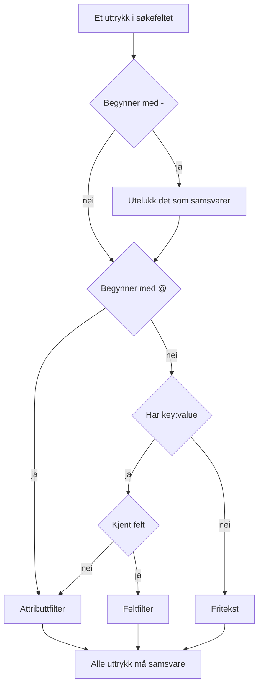

# Søkesyntaks

Søkefeltet over utforskerne for logger, spor, målinger og unntak snakker ett spørrespråk. En spørring er en liste med filtre adskilt av mellomrom, og **alle filtre må samsvare**: det finnes ingen underforstått OR mellom filtre. Bruk denne siden som oppslagsverk mens du søker.

:::cards
- [De to typene filter](#de-to-typene-filter): Innebygde felt, attributter og fritekst.
- [Samsvar mot verdier](#samsvar-mot-verdier): Jokertegn, "inneholder", sammenligninger og lister.
- [Utelukking](#utelukking): Snu et hvilket som helst filter med en `-` foran.
- [Felt per signal](#felt-per-signal): Hva du kan filtrere på i hver utforsker.
:::

## Slik leses en spørring

```text
severity:error @platform.team:a* -@http.method:GET timeout
```

Det leses som: logger på nivå error der attributtet `platform.team` begynner med `a`, der attributtet `http.method` ikke er `GET`, og der meldingen nevner `timeout`.

| Uttrykk | Type | Samsvarer med |
| --- | --- | --- |
| `severity:error` | Felt | Loggens alvorlighetsgrad er Error. |
| `@platform.team:a*` | Attributt | Attributtet `platform.team` begynner med `a`. |
| `-@http.method:GET` | Utelukket attributt | Attributtet `http.method` er alt annet enn `GET`. |
| `timeout` | Fritekst | Meldingen inneholder `timeout`. |

Hvert uttrykk adskilt av mellomrom leses for seg, og deretter kombineres alle med AND:



## De to typene filter

| Form | Filtrerer | Eksempel |
| --- | --- | --- |
| `field:value` | Et innebygd felt i signalet | `severity:error` |
| `@attribute:value` | Et OpenTelemetry-attributt på raden | `@http.status_code:500` |
| løse ord | Meldingen (logger), span-navnet (spor), målingsnavnet (målinger) eller unntaksmeldingen (unntak) | `connection refused` |

En løs `key:value` der nøkkelen ikke er et kjent felt, behandles som et attributt, så `k8s.pod:api-0` og `@k8s.pod:api-0` betyr det samme. Prefikset `@` betyr alltid "søk i attributtene", med ett unntak: i unntaksutforskeren filtrerer `@type:`, `@service:`, `@env:` og `@class:` fortsatt de feltene.

Tekst som bare tilfeldigvis inneholder et kolon, forblir tekst: `https://example.com` og `12:30` søkes som ord og leses ikke som filtre.

## Samsvar mot verdier

Alt i denne tabellen fungerer på alle attributter og på de fleste innebygde felt; [Felt per signal](#felt-per-signal) nevner feltene som leser en verdi enklere.

| Du skriver | Samsvarer med |
| --- | --- |
| `@k:abc` | nøyaktig `abc` |
| `@k:a*` | alt som begynner med `a`: `abc`, `alpha` |
| `@k:*c` | alt som slutter med `c` |
| `@k:a*c` | begynner med `a` og slutter med `c` |
| `@k:a?c` | `?` er nøyaktig ett tegn: `abc`, `axc`, men ikke `ac` |
| `@k:*` | attributtet finnes og er ikke tomt |
| `@k:~abc` | inneholder `abc` hvor som helst |
| `@k:!abc` | alt unntatt `abc` |
| `@k:>100` | større enn 100. Også `>=`, `<`, `<=` |
| `@k:(a OR b)` | en av de to verdiene. `@k:[a, b]` er det samme |
| `@k:(a* OR b*)` | ett av de to mønstrene |

Samsvar med jokertegn og "inneholder" skiller ikke mellom store og små bokstaver; nøyaktig samsvar gjør det, fordi det sammenligner med verdien nøyaktig slik den ble lagret.

### Verdier med mellomrom

Sett verdien i doble anførselstegn:

```text
name:"SELECT wp_options"
@k8s.container.name:"my container"
```

Anførselstegn beskytter **mellomrom**, ikke jokertegn: `@k:"a b*"` samsvarer fortsatt med alt som begynner med `a b`.

### `*`, `?` og andre tegn bokstavelig

En omvendt skråstrek gjør neste tegn bokstavelig:

| Du skriver | Samsvarer med |
| --- | --- |
| `@k:a\*b` | nøyaktig `a*b` |
| `@k:\~abc` | nøyaktig `~abc` |
| `@k:\>5` | nøyaktig `>5` |

Verdier som inneholder `%` eller `_`, trenger ingen escaping: de er alltid bokstavelige.

## Utelukking

En `-` foran snur et hvilket som helst filter, også dem ovenfor:

| Du skriver | Samsvarer med |
| --- | --- |
| `-severity:debug` | alt unntatt debug |
| `-@platform.team:a*` | alt der `platform.team` **ikke** begynner med `a`, også rader helt uten `platform.team` |
| `-@k:*` | attributtet mangler eller er tomt |
| `-@k:(a OR b)` | ingen av de to verdiene |
| `-@k:>100` | 100 eller mindre |
| `-@k:~abc` | inneholder ikke `abc` |

I sporutforskeren utelukker `-` bare attributter. `-status:error` leses som tekst som søkes etter i span-navn, og finner ingenting; spør heller etter verdiene du vil ha, for eksempel `status:(ok OR unset)`.

## Felt per signal

Feltnavn skiller ikke mellom store og små bokstaver: `statusMessage:` og `statusmessage:` er samme felt.

### Logger

| Felt | Aliaser | Merknader |
| --- | --- | --- |
| `severity` | `level` | `fatal`, `error`, `warning` (eller `warn`), `info` (eller `information`), `debug`, `trace`, `unspecified`, med valgfrie store og små bokstaver |
| `service` | | Tjenestenavn, skrevet fullt ut, med valgfrie store og små bokstaver |
| `trace` | | Trace-ID |
| `span` | | Span-ID |
| `message` | `msg`, `log`, `body` | Logglinjen. Løse ord søker også i den |

### Spor

Sporfelt tar en vanlig verdi eller en liste som `status:(ok OR unset)`, og `duration` tar også `>` og `<`. Jokertegn, `~`, `!` og en `-` foran virker her bare på attributter.

| Felt | Merknader |
| --- | --- |
| `service` | Tjenestenavn |
| `name` | Span-navn. Én verdi samsvarer med en hvilken som helst del av det. Løse ord søker også i det |
| `status` | `ok`, `error`, `unset` (unset = Ingen feilstatus angitt, OpenTelemetry-standarden) |
| `kind` | `server`, `client`, `producer`, `consumer`, `internal` |
| `duration` | Millisekunder: `duration:>500`, `duration:<200` eller en nøyaktig verdi |
| `statusMessage` | Teksten i statusmeldingen. Én verdi samsvarer med en hvilken som helst del av den |
| `hasException` | `true` eller `false` |
| `trace`, `span` | ID-er |

### Målinger

| Felt | Merknader |
| --- | --- |
| `name` | Målingsnavn. En vanlig verdi samsvarer med en hvilken som helst del av det, så `name:http.server` finner `http.server.request.duration`. Løse ord søker også i det |
| `service` | Tjenestenavn. En vanlig verdi samsvarer med en hvilken som helst del av det |

### Unntak

| Felt | Aliaser | Merknader |
| --- | --- | --- |
| `type` | `exceptionType` | Unntakstype, f.eks. `type:TypeError` |
| `env` | `environment` | Miljø, fra ressursattributtet `deployment.environment` |
| `service` | | Tjenestenavn. En vanlig verdi samsvarer med en hvilken som helst del av det |
| `class` | `errorClass` | Hvem sin feil det er: `code-fault`, `user-error`, `expected-denial`, `infrastructure` eller `unknown` |

Løse ord søker i unntaksmeldingen.

Utforskeren **Security Events** bruker samme språk med egne felt, som `severity`, `tactic` og `user`: se [Security Events](/docs/telemetry/security-events).

## Kombinere filtre

Filtre kombineres med AND. Du kan skrive `AND` mellom dem, og det endrer ingenting:

```text
severity:error service:api          # both must hold
severity:error AND service:api      # identical
```

Det finnes ingen OR og ingen NOT **mellom** filtre: `OR` og `NOT` som står der, hoppes over, så `NOT severity:debug` betyr det samme som `severity:debug`. Utelukk med en `-` foran (`-severity:debug`), og bruk listeformen for å treffe en av to verdier for samme nøkkel:

```text
@http.method:(GET OR POST)
```

To filtre på samme nøkkel kombineres med AND; slik skriver man et intervall eller et mønster med to ender:

```text
@http.status_code:>=500 @http.status_code:<=599
@k:a* @k:*z
```

## Brikker og søkefeltet

Trykk på Enter ved et uttrykk `key:value` bruker det, som regel som en brikke over resultatene. En brikke bærer verdien nøyaktig slik den ble skrevet, så et jokertegn forblir et jokertegn. Et uttrykk som en brikke ikke kan bære, for eksempel en utelukket `-key:value`, blir værende i søkefeltet og filtrerer derfra. Et klikk på en verdi i fasettsidepanelet legger til samme type brikke, med verdien escapet: en lagret verdi som tilfeldigvis inneholder `*`, filtrerer på akkurat den verdien, ikke som et mønster.

Brikker er en del av den lagrede visningen og av sidens URL, så et filter overlever en ny innlasting, et bokmerke og en delt lenke.

## Greit å vite

- Attributt**nøkler** sammenlignes uten å skille mellom store og små bokstaver for filtre med jokertegn, "inneholder", prefiks og suffiks, så du trenger ikke huske om den ble tatt inn som `requestId` eller `requestid`.
- Et filter `-@k:...` samsvarer også med rader som aldri har hatt attributtet: en rad helt uten `platform.team` begynner selvsagt ikke med `a`.
- Numeriske sammenligninger virker på attributtverdier som er lagret som tekst; en verdi som ikke er et tall, oppfyller aldri en sammenligning.

## Neste trinn

:::cards
- [Zoome inn på et tidsintervall](/docs/telemetry/charts-and-time-ranges): Snevre inn utforskerne til øyeblikket som betyr noe.
- [Loggpipelines](/docs/telemetry/log-pipelines): Gjøre deler av en logglinje om til søkbare attributter.
- [Logg-overvåking](/docs/monitor/logs-monitor): Få varsel når loggene du søker etter dukker opp.
- [OpenTelemetry](/docs/telemetry/open-telemetry): Sende logger, målinger og spor som kan søkes i.
:::
