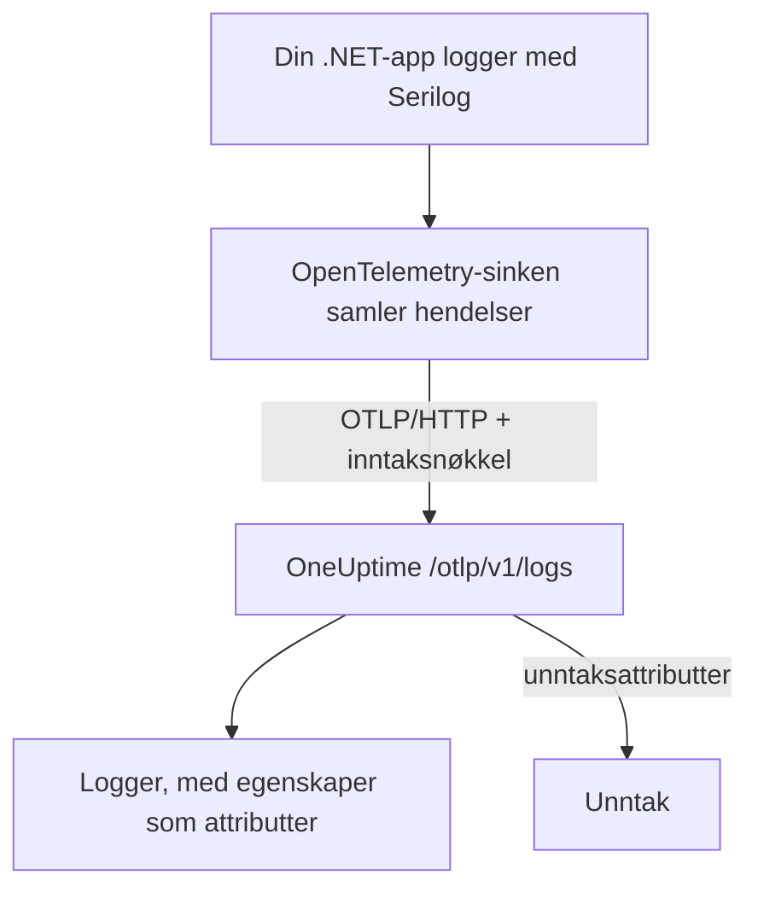

# Serilog (.NET)

[Serilog](https://serilog.net) er det mest brukte biblioteket for strukturert logging i .NET. Med den offisielle sinken [`Serilog.Sinks.OpenTelemetry`](https://github.com/serilog/serilog-sinks-opentelemetry) sendes hver hendelse som applikasjonen din logger gjennom Serilog, til OneUptime over OpenTelemetry Protocol (OTLP), og den blir søkbar under **Produkter → Logger** med sine strukturerte egenskaper, alvorlighetsgrad og kobling til traces.

Du trenger ingen OneUptime-spesifikk pakke: Sinken snakker med det samme OTLP-endepunktet som OneUptime tilbyr for alle OpenTelemetry-data. Dette fungerer for konsollapper, worker services, ASP.NET Core-apper og alt annet som kjører på .NET.

:::cards
- [Sett opp sinken](#sett-opp-sinken): Installer to pakker, og konfigurer dem i kode eller i `appsettings.json`.
- [Unntak](#unntak): Loggede unntak blir til issues under Unntak.
- [Feilsøking](#feilsøking): Hva du sjekker når ingen logger kommer frem.
:::

## Slik fungerer det



Sinken samler logghendelser og sender dem i bakgrunnen. Hver navngitte egenskap blir en attributt på loggen, og et unntak som logges med Serilog, kommer frem med attributtene OneUptime gjør om til et issue.

## Før du begynner

- Et OneUptime-prosjekt. I OneUptime Cloud faktureres telemetri per inntatt GB – se [priser](https://oneuptime.com/pricing) – og et prosjekt på Free-planen trenger en betalingsmetode før det kan sende telemetri.
- En .NET-applikasjon som bruker, eller kan bruke, Serilog.
- En inntaksnøkkel for telemetri som loggene dine autentiseres med. Hvis du ikke har en:

:::steps
### Åpne inntaksnøklene

Gå til **Produkter → Prosjektinnstillinger**, åpne **Telemetri og APM** i sidemenyen, og velg **Inntaksnøkler**.


### Opprett en nøkkel

Klikk på **Opprett ingestion-nøkkel**. Dialogen har allerede fylt inn navnet på nøkkelen og valgt **Server** – den typen nøkkel en applikasjon eller en collector sender med – så klikk på **Opprett ingestion-nøkkel** for å opprette den, eller gi den nytt navn først.

### Kopier hemmeligheten

Den nye nøkkelen åpnes på sin egen side. Kopier **Hemmelig nøkkel**: Det er `YOUR_TELEMETRY_INGESTION_TOKEN` i eksemplene nedenfor.


:::

## Det du trenger fra OneUptime

| Innstilling | Verdi |
| ------------- | ------------------------------------------------------------ |
| OTLP-endepunkt | `https://oneuptime.com/otlp` |
| Auth-header | `x-oneuptime-token: YOUR_TELEMETRY_INGESTION_TOKEN` |
| Tjenestenavn | Navnet tjenesten din skal vises under, f.eks. `my-service` |

> [!NOTE]
> Hoster du OneUptime selv? Erstatt `https://oneuptime.com/otlp` med `https://YOUR-ONEUPTIME-HOST/otlp` (eller `http://...` hvis du ikke terminerer TLS). Alt annet er likt.

Når protokollen er satt til `HttpProtobuf`, legger sinken til stien `/v1/logs` på endepunktet, så den endelige URL-en den sender til, er `https://oneuptime.com/otlp/v1/logs`. Du oppgir bare basisendepunktet `/otlp`.

## Sett opp sinken

:::steps
### Installer NuGet-pakkene

Legg Serilog og OpenTelemetry-sinken til i prosjektet ditt:

```bash
dotnet add package Serilog
dotnet add package Serilog.Sinks.OpenTelemetry
```

Hvis du konfigurerer sinken fra `appsettings.json`, legger du også til `Serilog.Settings.Configuration`. For ASP.NET Core-apper legger du til `Serilog.AspNetCore`, som kobler Serilog til verten og request-pipelinen:

```bash
dotnet add package Serilog.Settings.Configuration
dotnet add package Serilog.AspNetCore
```

### Konfigurer sinken

Pek sinken mot OTLP-endepunktet ditt i OneUptime, sett protokollen til `HttpProtobuf`, send inntakstokenet ditt som header, og merk loggene med et `service.name`. Konfigurer den i kode, i `appsettings.json` eller i ASP.NET Core-verten:

:::tabs
@tab I kode
```csharp title="Program.cs"
using Serilog;
using Serilog.Sinks.OpenTelemetry;

Log.Logger = new LoggerConfiguration()
    .MinimumLevel.Information()
    .Enrich.FromLogContext()
    .WriteTo.Console() // optional: keep local logs too
    .WriteTo.OpenTelemetry(options =>
    {
        // Base OTLP endpoint. The sink appends /v1/logs automatically.
        options.Endpoint = "https://oneuptime.com/otlp";
        options.Protocol = OtlpProtocol.HttpProtobuf;

        // Authenticate with your OneUptime telemetry ingestion token.
        options.Headers = new Dictionary<string, string>
        {
            ["x-oneuptime-token"] = "YOUR_TELEMETRY_INGESTION_TOKEN"
        };

        // Identify your service in OneUptime.
        options.ResourceAttributes = new Dictionary<string, object>
        {
            ["service.name"] = "my-service",
            ["deployment.environment"] = "production"
        };
    })
    .CreateLogger();

try
{
    Log.Information("Application starting up");
    // ... your application code ...
}
finally
{
    // Flush any buffered logs before the process exits.
    Log.CloseAndFlush();
}
```
@tab appsettings.json
Legg innstillingene for sinken i `appsettings.json`:

```json title="appsettings.json"
{
  "Serilog": {
    "Using": ["Serilog.Sinks.OpenTelemetry"],
    "MinimumLevel": "Information",
    "WriteTo": [
      {
        "Name": "OpenTelemetry",
        "Args": {
          "endpoint": "https://oneuptime.com/otlp",
          "protocol": "HttpProtobuf",
          "headers": {
            "x-oneuptime-token": "YOUR_TELEMETRY_INGESTION_TOKEN"
          },
          "resourceAttributes": {
            "service.name": "my-service",
            "deployment.environment": "production"
          }
        }
      }
    ]
  }
}
```

Bygg deretter loggeren fra konfigurasjonen:

```csharp title="Program.cs"
using Serilog;
using Microsoft.Extensions.Configuration;

IConfiguration configuration = new ConfigurationBuilder()
    .AddJsonFile("appsettings.json")
    .Build();

Log.Logger = new LoggerConfiguration()
    .ReadFrom.Configuration(configuration)
    .CreateLogger();
```
@tab ASP.NET Core
For ASP.NET Core (minimal hosting, .NET 6 og nyere) bruker du `Serilog.AspNetCore`, slik at Serilog erstatter standardloggeren og også fanger opp logger fra rammeverket og fra requester:

```csharp title="Program.cs"
using Serilog;
using Serilog.Sinks.OpenTelemetry;

var builder = WebApplication.CreateBuilder(args);

builder.Host.UseSerilog((context, services, configuration) =>
{
    configuration
        .ReadFrom.Configuration(context.Configuration)
        .Enrich.FromLogContext()
        .WriteTo.OpenTelemetry(options =>
        {
            options.Endpoint = "https://oneuptime.com/otlp";
            options.Protocol = OtlpProtocol.HttpProtobuf;
            options.Headers = new Dictionary<string, string>
            {
                ["x-oneuptime-token"] = "YOUR_TELEMETRY_INGESTION_TOKEN"
            };
            options.ResourceAttributes = new Dictionary<string, object>
            {
                ["service.name"] = "my-service"
            };
        });
});

var app = builder.Build();

// Logs one summary event per HTTP request.
app.UseSerilogRequestLogging();

app.MapGet("/", () => "Hello World");
app.Run();
```
:::

> [!IMPORTANT]
> Sinken samler logghendelser og sender dem asynkront. Kall alltid `Log.CloseAndFlush()` (eller frigjør loggeren) før applikasjonen avsluttes, ellers kan den siste bunken med logger gå tapt. I ASP.NET Core ordner `Serilog.AspNetCore` dette for deg ved en ryddig nedstengning.

> [!TIP]
> Hold tokenet utenfor versjonskontroll. Hent det fra en miljøvariabel eller et hemmelighetslager, og legg det inn i konfigurasjonen ved oppstart, i stedet for å committe det til `appsettings.json`.

### Skriv logger

Bruk Serilog som vanlig. Strukturerte egenskaper bevares og blir søkbare attributter i OneUptime:

```csharp
Log.Information("Order {OrderId} placed by {CustomerId} for {Amount:C}",
    orderId, customerId, amount);

Log.Warning("Payment gateway slow: {LatencyMs}ms", latencyMs);
```

Hver navngitte egenskap (`OrderId`, `CustomerId`, `Amount`, `LatencyMs`) sendes som en attributt på loggen, så du kan filtrere og søke på dem i utforskeren **Produkter → Logger**.

### Sjekk at loggene kommer frem

Kjør applikasjonen, og skriv noen logghendelser. Etter noen sekunder vises de under **Produkter → Logger**, og på siden til tjenesten din under **Produkter → Tjenester** – tjenesten har navnet fra `service.name` du satte (`my-service`). De strukturerte egenskapene er tilgjengelige som filtre.
:::

## Unntak

Når du logger et unntak med Serilog, legger sinken OpenTelemetry-attributtene `exception.type`, `exception.message` og `exception.stacktrace` til loggposten:

```csharp
try
{
    ProcessPayment();
}
catch (Exception ex)
{
    Log.Error(ex, "Failed to process payment for order {OrderId}", orderId);
}
```

OneUptime gjenkjenner disse attributtene og samler feilen i et issue under **Unntak**, etter fingeravtrykk og knyttet til riktig tjeneste. En feil som både et trace og en logg rapporterer, slås sammen til ett issue. Se [Unntak fra logger](/docs/telemetry/open-telemetry#unntak-fra-logger) for hvordan gjenkjenningen fungerer.

## Kobling til traces

Er applikasjonen også instrumentert med OpenTelemetry .NET SDK for traces, får Serilog-hendelser som sendes innenfor et aktivt span, automatisk gjeldende `TraceId` og `SpanId` (det er en del av sinkens standard `IncludedData`). Da kan OneUptime koble en logglinje direkte til tracet den skjedde i, og du kan hoppe fra en logg til requesten rundt den og tilbake.

Vil du også sende traces og metrikker, kan du se .NET-oppsettet i [hurtigstarten for OpenTelemetry](/docs/telemetry/open-telemetry#hurtigstart).

## Feilsøking

:::details Ingen logger vises
Sjekk verdien av `x-oneuptime-token`, og bekreft at den hører til prosjektet du ser på. Kontroller at endepunktet er `https://oneuptime.com/otlp` (bare basisstien – ikke legg til `/v1/logs` selv). For å se hvorfor sinken feiler, slår du på Serilogs egen feilutskrift ved oppstart med `Serilog.Debugging.SelfLog.Enable(Console.Error)`: Den viser statuskoden OneUptime svarer med.
:::

:::details Logger vises først når appen avsluttes, eller de siste loggene mangler
Sørg for at `Log.CloseAndFlush()` kjører ved nedstengning. Sinken samler hendelser, så bufrede logger går tapt hvis prosessen drepes uten flush.
:::

:::details 401 Unauthorized, og ingenting tas inn
Nøkkelen mangler, er ukjent eller utløpt. Bekreft at headernavnet er nøyaktig `x-oneuptime-token`, og at verdien er nøkkelens **Hemmelig nøkkel**.
:::

:::details 402 eller 422, og ingenting tas inn
`402`: I OneUptime Cloud er prosjektet på Free-planen og har ingen betalingsmetode. Legg til en under **Prosjektinnstillinger → Fakturering og fakturaer → Fakturering**. `422`: Nøkkelen er deaktivert, eller det er en nettlesernøkkel. Slå **Aktivert** på igjen i nøkkelens innstillinger, eller opprett en **Server**-nøkkel.
:::

:::details Loggene kommer under feil tjenestenavn
Sett `service.name` i `ResourceAttributes` (kode) eller `resourceAttributes` (appsettings.json). Uten det lagres loggene dine under plassholdernavnet sinken sender i stedet, og ikke under navnet på tjenesten din.
:::

:::details Tilkoblingsfeil mot en selvhostet instans
Sørg for at protokollen passer med skjemaet til endepunktet ditt (`https://` eller `http://`), og at OneUptime-verten din kan nås fra applikasjonen.
:::

Har du spørsmål eller trenger hjelp, kan du skrive til oss på support@oneuptime.com.

## Neste steg

:::cards
- [OpenTelemetry](/docs/telemetry/open-telemetry): Send også traces og metrikker fra .NET.
- [Loggpipelines](/docs/telemetry/log-pipelines): Tolk og berik loggene når de kommer inn.
- [Logg-overvåking](/docs/monitor/logs-monitor): Varsle når samsvarende logger dukker opp.
- [Søkesyntaks](/docs/telemetry/search-syntax): Filtrer på Serilog-egenskapene dine.
:::
