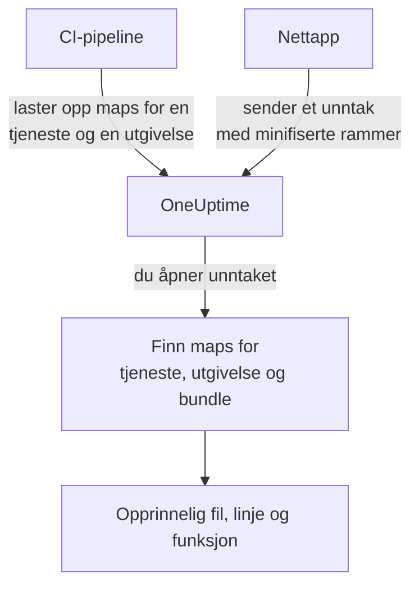

# Source maps

Last opp source maps fra frontend-bygget ditt til OneUptime, så viser nettleserunntak under **Unntak** de opprinnelige filnavnene, linjene og funksjonene dine i stedet for de minifiserte. Denne siden er for frontend-utviklere som allerede sender nettlesertelemetri til OneUptime.

:::cards
- [Slik fungerer koblingen](#slik-fungerer-koblingen): Tjenestenavn, utgivelse og bundlefil.
- [Last opp source maps](#last-opp-source-maps): Én `curl`-forespørsel fra CI.
- [Grenser](#grenser): Størrelser, antall og innstillingene for egen drift.
- [Se oppløste stakkspor](#se-oppløste-stakkspor): Slik ser en oppløst ramme ut.
:::

## Oversikt

Produksjonsbundler for frontend er minifiserte, så et nettleserunntak som fanges via OpenTelemetry-web-SDK-et, kommer inn med stakkrammer som disse:

```text
TypeError: Cannot read properties of undefined (reading 'id')
    at e.onSelect (https://app.example.com/assets/main.a8f1b2.js:1:48291)
```

Last opp source maps fra bygget ditt til OneUptime, så løser unntaksdashbordet opp de rammene til den opprinnelige filen, linjen og funksjonsnavnet, og når mappen ble bygget med `sourcesContent`, til de omkringliggende linjene i den opprinnelige kildekoden din.

Maps lastes opp til OneUptime via et autentisert API og **hentes aldri fra nettstedet ditt**, så du kan (og bør) fortsette å bygge med `hidden-source-map` (webpack) eller `sourcemap: 'hidden'` (Vite / Rollup) og aldri publisere `.map`-filene ved siden av bundlene dine.



## Slik fungerer koblingen

En source map lagres under tre nøkler:

| Nøkkel | Må samsvare med |
|---|---|
| Tjenestenavn | OpenTelemetry-ressursattributtet `service.name` som nettappen din sender telemetri med |
| Tjenesteversjon | Ressursattributtet `service.version` (utgivelses-ID-en din) |
| Bundlesti | Den minifiserte filen mappen ble generert for, f.eks. `main.a8f1b2.js` |

Når du åpner et unntak, slår OneUptime opp mappene som er lastet opp for unntakets tjeneste og utgivelse, kobler hver stakkramme til en bundle etter filnavn (stisuffikser går fint: `main.a8f1b2.js` samsvarer med `https://app.example.com/assets/main.a8f1b2.js`) og løser opp den minifiserte linjen og kolonnen via mappen. Oppløsningen skjer først når unntaket vises, aldri under inntaket, så en map som lastes opp noen minutter *etter* den første feilen i en ny utgivelse, gjelder likevel med tilbakevirkende kraft.

## Før du begynner

- En telemetri-inntaksnøkkel av typen **Server**, fra **Prosjektinnstillinger → Telemetri og APM → Inntaksnøkler**. Se [Opprett en inntaksnøkkel](/docs/telemetry/open-telemetry#opprett-en-inntaksnøkkel).
- En nettapp som allerede sender unntak til OneUptime med OpenTelemetry-web-SDK-et: se [Nettleseroppsett](/docs/rum/browser-setup).
- Et bygg som skriver source maps, med `sourcesContent` (standard i de fleste bundlere) hvis du vil ha kodeutdrag rundt hver ramme.

## Last opp source maps

:::steps
### Send `service.version` med telemetrien din

Nettappen din må sende `service.version`, og det må være den samme strengen du laster opp mappene med:

```javascript
import { resourceFromAttributes } from "@opentelemetry/resources";

const resource = resourceFromAttributes({
  "service.name": "my-web-app",
  "service.version": "1.4.2", // same value you upload maps with
});
```

En hvilken som helst stabil utgivelses-ID fungerer (en semantisk versjon, en git-commit-SHA, et byggnummer), så lenge den opplastede `serviceVersion` og ressursattributtet `service.version` er den samme strengen.

### Last opp mappene etter hvert produksjonsbygg

Last opp fra CI, med inntaksnøkkelen i headeren `x-oneuptime-token`:

```bash
curl --fail -X POST "https://oneuptime.com/source-maps/v1/upload" \
  -H "x-oneuptime-token: YOUR_TELEMETRY_INGESTION_KEY" \
  -F "serviceName=my-web-app" \
  -F "serviceVersion=1.4.2" \
  -F "sourcemap=@dist/assets/main.a8f1b2.js.map" \
  -F "sourcemap=@dist/assets/vendor.9c3d4e.js.map"
```

For installasjoner i egen drift erstatter du `oneuptime.com` med OneUptime-verten din. `Authorization: Bearer YOUR_KEY` godtas som alternativ til headeren `x-oneuptime-token`.

### Kontroller opplastingen

En vellykket opplasting returnerer en JSON-body med de lagrede mappene, så CI kan sjekke den. Mappene står også på tjenestens side **Source Maps** i OneUptime.
:::

Et typisk CI-trinn laster opp hver map bygget har laget:

```bash
VERSION="$(git rev-parse --short HEAD)"

find dist -name "*.js.map" -print0 | while IFS= read -r -d '' map; do
  curl --fail -X POST "https://oneuptime.com/source-maps/v1/upload" \
    -H "x-oneuptime-token: $ONEUPTIME_INGESTION_KEY" \
    -F "serviceName=my-web-app" \
    -F "serviceVersion=$VERSION" \
    -F "sourcemap=@$map"
done
```

### Regler for opplasting

- Bundlestien til hver opplastet fil er filnavnet uten den avsluttende `.map`: `main.a8f1b2.js.map` blir `main.a8f1b2.js`. Følger ikke navnet på map-filen din den konvensjonen, laster du opp én fil per forespørsel og sender med et eksplisitt felt `bundlePath`.
- En ny opplasting av samme bundle for samme tjeneste og versjon erstatter den forrige mappen, så nye forsøk fra CI er trygge.
- Filene må være JSON etter [source map v3](https://tc39.es/ecma426/) (det enhver moderne bundler lager; indekserte maps med `sections` støttes også).
- Har operatøren av installasjonen din i egen drift slått av telemetri-inntak (`DISABLE_TELEMETRY_INGESTION`), returnerer opplastinger et tomt vellykket svar, og ingenting lagres, samme oppførsel som alle telemetri-inntaksendepunkter har i den modusen. En ekte opplasting returnerer alltid en JSON-body med de lagrede mappene, så CI kan skille de to.

## Grenser

Hver `.map`-fil kan være opptil 50 MB, men ingressen begrenser også **hele forespørselens body** til 50 MB, så last opp store maps én per forespørsel. Opptil 50 filer godtas per forespørsel, og én utgivelse (tjeneste + versjon) kan totalt inneholde høyst 1000 maps; en opplasting som ville gå over det, avvises med en melding som nevner grensen. Et bygg som lager flere maps enn én forespørsel godtar, sender ganske enkelt flere forespørsler: opplastinger for samme utgivelse legges sammen.

Installasjoner i egen drift kan endre disse. Alle fem er vanlige miljøvariabler, og Helm-chartet gjør dem tilgjengelige under `sourceMaps` i `values.yaml`:

| `values.yaml` | Miljøvariabel | Standard |
| --- | --- | --- |
| `sourceMaps.maxMapsPerRelease` | `SOURCE_MAP_MAX_MAPS_PER_RELEASE` | `1000` |
| `sourceMaps.maxFilesPerRequest` | `SOURCE_MAP_MAX_FILES_PER_REQUEST` | `50` |
| `sourceMaps.maxFileSizeBytes` | `SOURCE_MAP_MAX_FILE_SIZE_BYTES` | `52428800` |
| `sourceMaps.maxBytesPerResolve` | `SOURCE_MAP_MAX_BYTES_PER_RESOLVE` | `536870912` |
| `sourceMaps.retentionDays` | `SOURCE_MAP_RETENTION_DAYS` | `90` |

`maxMapsPerRelease` er den du hever hvis bygget ditt vokser forbi standarden; den begrenser bare lagringens form, fordi oppløsningen begrenses av `maxBytesPerResolve` og ikke av hvor mange maps en utgivelse har. `maxFilesPerRequest` og `maxFileSizeBytes` kan bare **senkes**: multipart-bodyen tolkes før forespørselen er autentisert, så de felles takene over dem er det en ikke-autentisert kaller holdes til, og en større verdi snevres inn i stedet for å brukes.

## Se oppløste stakkspor

Åpne et hvilket som helst unntak under **Unntak** i dashbordet. Rammer som er løst opp via en source map, viser merket **Source mapped** og det opprinnelige funksjonsnavnet og filplasseringen; en utvidet ramme viser det opprinnelige kodeutdraget (når mappen har `sourcesContent`) ved siden av den minifiserte plasseringen.

Opplastede maps for en tjeneste kan gjennomgås og slettes under **Produkter → Tjenester → tjenesten din → Source Maps**, som viser utgivelse, bundle, størrelse og opplastingstidspunkt for hver map.

## Oppbevaring

Source maps oppbevares i 90 dager etter opplasting og slettes deretter automatisk. En map er bare nyttig så lenge unntak fra utgivelsen ligger innenfor oppbevaringsperioden for telemetrien din, så denne perioden varer godt lenger enn unntakene den gjør lesbare. Last opp mappene for en utgivelse på nytt hvis du trenger dem igjen.

## Sikkerhet

- Maps lastes opp via et autentisert endepunkt og lagres i OneUptime-prosjektet ditt: de hentes aldri fra nettstedet ditt, så skjulte source maps forblir skjulte.
- Det rå innholdet i en map (som inneholder den opprinnelige kildekoden din når den er bygget med `sourcesContent`) kan bare leses tilbake av prosjekteiere og administratorer og av alle med tillatelsen **Read Telemetry Source Map**. Andre teammedlemmer ser bare de oppløste rammene og de få kodelinjene rundt hvert krasjsted for unntak de allerede har tilgang til.
- Sletting av en tjeneste sletter source maps for den.

## Feilsøking

:::details Rammene er fortsatt minifiserte
Unntakets utgivelse har ingen samsvarende maps. Sjekk at `service.version` som appen din sender, er nøyaktig den `serviceVersion` du lastet opp med, at `serviceName` samsvarer med `service.name`, og at det er lastet opp en map for den bundlefilen: tjenestens side **Source Maps** viser utgivelse og bundle for hver map.
:::

:::details Opplastingen avvises fordi en map er for stor
En enkelt map kan være opptil 50 MB, og hele forespørselen også. Last opp store maps én per forespørsel, slik CI-løkken ovenfor gjør.
:::

## Neste trinn

:::cards
- [Nettleseroppsett](/docs/rum/browser-setup): Send nettleserspor og -unntak med OpenTelemetry-web-SDK-et.
- [Unntak-overvåking](/docs/monitor/exceptions-monitor): Få varsel når nye unntak dukker opp.
- [OpenTelemetry](/docs/telemetry/open-telemetry): Endepunkter, nøkler og grenser for all telemetri.
:::
