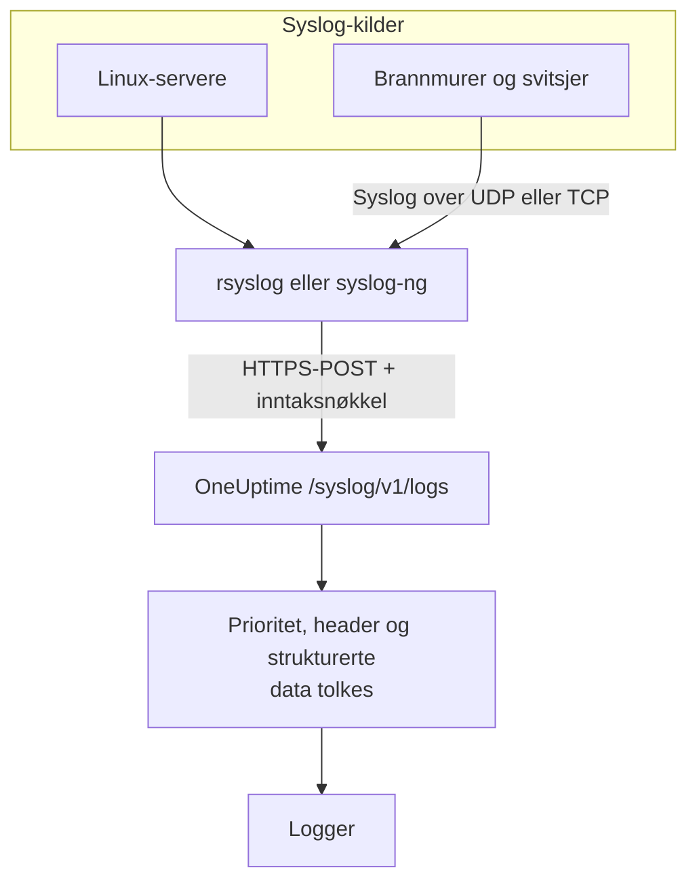

# Syslog

OneUptime tar imot syslog over HTTPS. Send RFC 5424- eller RFC 3164-meldinger til `/syslog/v1/logs` med inntaksnøkkelen din, og hver av dem blir en søkbar logg, med prioritet, facility, alvorlighetsgrad, vert, applikasjon og strukturerte data som attributter. Bruk det til å videresende fra rsyslog, syslog-ng eller et hvilket som helst relé som kan gjøre HTTP-requester.

:::cards
- [Send en testmelding](#send-en-testmelding): Én enkelt `curl`-request.
- [Videresend fra rsyslog](#videresend-fra-rsyslog): Send alt en server eller et relé tar imot.
- [Uttrukne attributter](#uttrukne-attributter): Hva OneUptime henter ut av hver melding.
- [Feilsøking](#feilsøking): Avviste requester og uventede tjenester.
:::

## Slik fungerer det



OneUptime svarer så snart meldingene er lest fra requesten, og tolker og lagrer dem et øyeblikk senere. Meldingsteksten blir værende i logginnholdet; alt annet blir attributter.

> [!TIP]
> Nettverksenheter som du overvåker med en OneUptime-probe, kan sende syslog direkte til proben over UDP, uten relé – loggene vises da på enheten i OneUptime. Se [Guider per nettverksleverandør](/docs/monitor/network-vendor-guides).

## Før du begynner

- **Et OneUptime-prosjekt** – i OneUptime Cloud faktureres telemetri per inntatt GB, og et prosjekt på Free-planen trenger en betalingsmetode før det kan sende telemetri.
- **Inntaksnøkkel for telemetri** – opprett en **Server**-nøkkel under **Produkter → Prosjektinnstillinger → Telemetri og APM → Inntaksnøkler**, og kopier **Hemmelig nøkkel**. Du sender den i headeren `x-oneuptime-token`.
- **Syslog-videresender** – et hvilket som helst verktøy som kan sende HTTP POST-requester (for eksempel `curl`, `rsyslog` via `omhttp` eller `syslog-ng` med sin HTTP-destinasjon).
- **Tjenestenavn (valgfritt)** – sett headeren `x-oneuptime-service-name` for å samle innkommende logger under en bestemt telemetritjeneste. Uten den faller OneUptime tilbake på syslog-`APP-NAME`, vertsnavnet eller `Syslog`.

## Endepunkt

```http
POST https://oneuptime.com/syslog/v1/logs
```

| Header | Påkrevd | Verdi |
| --- | --- | --- |
| `x-oneuptime-token` | Ja | Inntaksnøkkelen din. |
| `Content-Type` | Ja, for JSON-innhold | `application/json` |
| `x-oneuptime-service-name` | Nei | Tjenesten loggene hører til. |
| `Content-Encoding` | Nei | `gzip`, for komprimert innhold. |

Erstatt `oneuptime.com` med din egen vert hvis du hoster OneUptime selv.

## Innholdet i requesten

Send en JSON-nyttelast med en matrise `messages`. Både RFC 5424 og RFC 3164 (BSD) støttes, og du kan blande dem i samme request:

```json
{
  "messages": [
    "<34>1 2025-03-02T14:48:05.003Z web-01 nginx 7421 ID47 [env@32473 host=\"web-01\"] 502 on /api/login",
    "<13>Feb  5 17:32:18 db-01 postgres[2419]: connection received from 10.0.0.12"
  ]
}
```

### Støttede innholdsformater

| Innhold | Slik sender du det |
| --- | --- |
| Et JSON-objekt med en matrise `messages` | `Content-Type: application/json` – anbefalt. |
| En JSON-matrise med meldinger | `Content-Type: application/json`. |
| Et JSON-objekt med én `message` | `Content-Type: application/json`. En verdi med flere linjer leses som flere meldinger. |
| Meldinger skilt med linjeskift | Komprimert med gzip og sendt med `Content-Encoding: gzip`. |

Ren tekst som ikke er komprimert med gzip, blir ikke lest, og requesten avvises med `400`. Innhold som er komprimert med gzip, leses alltid som meldinger skilt med linjeskift, så ikke komprimer JSON-innhold. Hold hver request under 1 MB: Ingressen i OneUptime hever ikke standardgrensen i nginx for requestinnhold på dette endepunktet.

## Send en testmelding

```bash
curl \
  -X POST https://oneuptime.com/syslog/v1/logs \
  -H "Content-Type: application/json" \
  -H "x-oneuptime-token: YOUR_TELEMETRY_KEY" \
  -H "x-oneuptime-service-name: production-web" \
  -d '{
    "messages": [
      "<34>1 2025-03-02T14:48:05.003Z web-01 nginx 7421 ID47 [env@32473 host=\"web-01\"] 502 on /api/login"
    ]
  }'
```

En `200` betyr at meldingen ble tatt imot. Åpne **Produkter → Logger**: Loggen vises i tjenesten `production-web` med innholdet `502 on /api/login`, alvorlighetsgraden `Error` og attributtene under [Uttrukne attributter](#uttrukne-attributter).

## Videresend fra rsyslog

rsyslog sender til OneUptime med HTTP-utdatamodulen sin, `omhttp`.

:::steps
### Sørg for at `omhttp` er tilgjengelig

Konfigurasjonen nedenfor laster den med `module(load="omhttp")`. Hvis rsyslog melder at modulen ikke kan lastes, installerer du pakken som leverer `omhttp` for distribusjonen din.

### Legg til OneUptime-destinasjonen

Opprett `/etc/rsyslog.d/oneuptime.conf`. Malen bygger hver melding om til en RFC 5424-linje og pakker den inn i JSON-innholdet OneUptime forventer:

```text title="/etc/rsyslog.d/oneuptime.conf"
module(load="omhttp")

template(name="OneUptimeJson" type="string"
         string="{\"messages\":[\"<%PRI%>1 %TIMESTAMP:::date-rfc3339% %HOSTNAME% %APP-NAME% %PROCID% %MSGID% - %msg:::json%\"]}")

action(
  type="omhttp"
  server="oneuptime.com"
  serverport="443"
  usehttps="on"
  restpath="syslog/v1/logs"
  httpheaders=[
    "x-oneuptime-token: YOUR_TELEMETRY_KEY",
    "x-oneuptime-service-name: rsyslog-demo"
  ]
  template="OneUptimeJson"
)
```

`restpath` tar stien uten innledende skråstrek. `omhttp` sender som standard en JSON-`Content-Type`, og det er akkurat det denne malen lager.

### Sjekk konfigurasjonen, og start rsyslog på nytt

```bash
sudo rsyslogd -N1
sudo systemctl restart rsyslog
```

`rsyslogd -N1` validerer konfigurasjonen uten å starte rsyslog. Etter omstarten vises nye meldinger under **Produkter → Logger** i tjenesten `rsyslog-demo`.
:::

Handlingen videresender hver melding rsyslog håndterer – lokale programmer, systemd-journalen når rsyslog leser den, og alt den tar imot fra nettverket.

### Videresend syslog fra nettverksenheter

Brannmurer, svitsjer og andre apparater sender ofte bare syslog over UDP eller TCP. Pek dem mot et rsyslog-relé, og la reléet videresende over HTTPS. Legg til en lytter i konfigurasjonen til reléet, før `action`:

```text title="/etc/rsyslog.d/oneuptime.conf"
module(load="imudp")
input(type="imudp" port="514")
```

Sett `x-oneuptime-service-name` til et navn som `perimeter-firewall`, eller fjern headeren slik at loggene fra hver enhet grupperes etter vertsnavnet. Mange apparater skriver meldingen som `key=value`-par; en [Key=Value Parser](/docs/telemetry/log-pipelines#keyvalue-parser) gjør dem om til attributter.

:::details Send i bunker i stedet for én request per melding
rsyslog kan samle meldinger og komprimere dem med gzip, noe OneUptime leser som meldinger skilt med linjeskift. Erstatt malen og handlingen med:

```text title="/etc/rsyslog.d/oneuptime.conf"
template(name="OneUptimeLine" type="string"
         string="<%PRI%>1 %TIMESTAMP:::date-rfc3339% %HOSTNAME% %APP-NAME% %PROCID% %MSGID% - %msg%")

action(
  type="omhttp"
  server="oneuptime.com"
  serverport="443"
  usehttps="on"
  restpath="syslog/v1/logs"
  httpheaders=["x-oneuptime-token: YOUR_TELEMETRY_KEY"]
  template="OneUptimeLine"
  batch="on"
  batch.format="newline"
  compress="on"
)
```

Behold `compress="on"`: OneUptime leser meldinger skilt med linjeskift bare fra innhold som er komprimert med gzip.
:::

### Andre videresendere

- **syslog-ng** – bruk HTTP-destinasjonen dens med samme URL, samme headere og samme JSON-innhold.
- **Fluent Bit** – ta imot syslog med `syslog`-inputen i Fluent Bit, og videresend den som alle andre logger. Se [Fluent Bit](/docs/telemetry/fluentbit).

## Uttrukne attributter

OneUptime legger automatisk til disse attributtene på hver loggpost:

| Attributt | Verdi | Fra testmeldingen |
| --- | --- | --- |
| `syslog.priority` | Prioriteten, `<PRI>` | `34` |
| `syslog.facility.code`, `syslog.facility.name` | Facility, ut fra prioriteten | `4`, `security` |
| `syslog.severity.code`, `syslog.severity.name` | Alvorlighetsgraden, ut fra prioriteten | `2`, `critical` |
| `syslog.version` | RFC 5424-versjonen | `1` |
| `syslog.hostname` | `HOSTNAME` | `web-01` |
| `syslog.appName` | `APP-NAME`, eller RFC 3164-taggen | `nginx` |
| `syslog.processId` | `PROCID` | `7421` |
| `syslog.messageId` | `MSGID` | `ID47` |
| `syslog.structured.raw` | De strukturerte RFC 5424-dataene, slik de ble sendt | `[env@32473 host="web-01"]` |
| `syslog.structured.*` | Hver parameter i de strukturerte dataene, flatet ut | `syslog.structured.env_32473.host` = `web-01` |
| `syslog.raw` | Den opprinnelige meldingen, for sporbarhet | hele linjen |

Disse attributtene blir søkbare i utforskeren **Produkter → Logger** – for eksempel `@syslog.severity.name:error` eller `@syslog.hostname:web-01`. Se [Søkesyntaks](/docs/telemetry/search-syntax).

Selve meldingen blir værende i logginnholdet. Brannmurer som Sophos XGS og Fortinet FortiGate skriver den som `key=value`-par (`log_component="IPSec" con_name="HQ-Branch1" status="Terminated"`); legg til en **Key=Value Parser**-prosessor i en [loggpipeline](/docs/telemetry/log-pipelines#keyvalue-parser) for å gjøre også disse parene om til attributter.

### Alvorlighetsgrad

| Syslog-alvorlighetsgrad | Kode | Alvorlighetsgrad i OneUptime |
| --- | --- | --- |
| Emergency, Alert | `0`, `1` | `Fatal` |
| Critical, Error | `2`, `3` | `Error` |
| Warning | `4` | `Warning` |
| Notice, Informational | `5`, `6` | `Information` |
| Debug | `7` | `Debug` |
| Ingen prioritet i meldingen | — | `Unspecified` |

En melding uten tidsstempel lagres med tidspunktet OneUptime mottok den.

### Tjeneste

Hver logg lagres under en telemetritjeneste, som OneUptime oppretter første gang den sender. Tjenesten er den første tilgjengelige av:

1. headeren `x-oneuptime-service-name`;
2. meldingens `APP-NAME` (eller tagg);
3. meldingens vertsnavn;
4. `Syslog`.

## Feilsøking

:::details HTTP 401
Nøkkelen mangler, er ukjent eller utløpt. Sjekk at headeren `x-oneuptime-token` inneholder **Hemmelig nøkkel** for en inntaksnøkkel i prosjektet som skal motta loggene.
:::

:::details HTTP 402 eller 422
`402`: I OneUptime Cloud er prosjektet på Free-planen og har ingen betalingsmetode. Legg til en under **Prosjektinnstillinger → Fakturering og fakturaer → Fakturering**. `422`: Nøkkelen er deaktivert, eller det er en nettlesernøkkel. Slå **Aktivert** på igjen i nøkkelens innstillinger, eller opprett en **Server**-nøkkel.
:::

:::details HTTP 400, eller ingen logger vises
Bekreft at innholdet i requesten faktisk inneholder syslog-linjer, som JSON med `Content-Type: application/json`. Tomt innhold – og ren tekst som ikke er komprimert med gzip – avvises med HTTP 400.
:::

:::details HTTP 413
Requesten er større enn ingressen godtar. Send færre meldinger per request.
:::

:::details Loggene kommer under et uventet tjenestenavn
Sett `x-oneuptime-service-name` for å overstyre standardgjenkjenningen, som bruker `APP-NAME` og deretter vertsnavnet.
:::

## Neste steg

:::cards
- [Loggpipelines](/docs/telemetry/log-pipelines): Gjør `key=value`-meldinger om til attributter.
- [Opptaksregler for logger](/docs/telemetry/log-recording-rules): Gjør tallene i syslog-en din om til metrikker.
- [Logg-overvåking](/docs/monitor/logs-monitor): Varsle når samsvarende syslog-meldinger kommer inn.
:::
