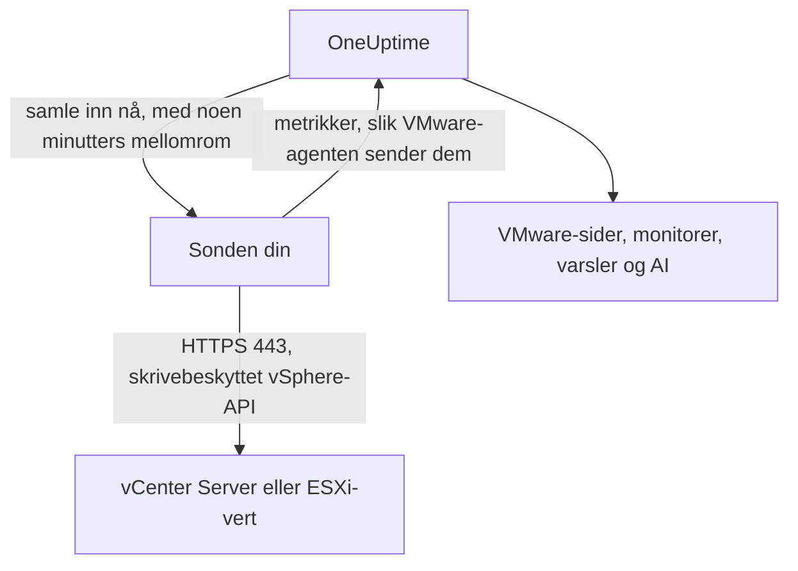

# VMware uten agent

Overvåk en vCenter Server, eller en frittstående ESXi-vert, uten å installere noe: skriv inn vCenters adresse og en skrivebeskyttet konto i OneUptime, velg sonden som når den, og sonden samler inn de samme dataene som [VMware-agenten](/docs/telemetry/vmware). Det finnes ingen agent å installere, oppgradere eller holde i gang, og ingen egen maskin å klargjøre.

:::cards
- [Før du begynner](#før-du-begynner): En sonde som når vCenter, og en skrivebeskyttet konto.
- [Koble til en vCenter](#koble-til-en-vcenter): Fire felt, en test og et navn.
- [Feilsøking](#feilsøking): Hva hver melding betyr, og hva som retter den.
:::

## Slik fungerer det

Med noen minutters mellomrom logger sonden på vCenter med kontoen du lagret, leser inventaret, ytelsestellerne og vSAN-statistikken, og sender dem til OneUptime. De kommer nøyaktig slik VMware-agentens gjør, så hver VMware-side, hver [VMware-monitor](/docs/monitor/vmware-monitor), hver varselmal og OneUptime AI leser dem på samme måte. Sonden beholder vCenter-økten sin mellom innsamlingene, så vCenters hendelseslogg ikke fylles med pålogginger.

## Sonde eller agent?

| | En sonde (denne siden) | VMware-agenten |
|---|---|---|
| Hva du kjører | En sonde du allerede kjører, eller en ny | Agenten, på en egen maskin |
| Hvor kontoen lagres | Kryptert i OneUptime, sendes bare til sonden | I agentens `.env`-fil |
| Hva den må nå | vCenter på TCP 443, fra sonden | vCenter på TCP 443, fra agenten |
| Største vCenter | Omtrent 48 MiB metrikker per innsamling | Ingen grense |
| ESXi-syslog og AI-agenten | Ikke inkludert | Inkludert |

Begge sender de samme dataene. Du kan bytte en vCenter fra den ene til den andre når som helst på siden **Innstillinger** for den.

## Før du begynner

- **En sonde som kan nå vCenter på TCP 443.** Dette er vanligvis en [egendefinert sonde](/docs/probe/custom-probe) i vCenters nettverk. På OneUptime Cloud mottar de delte sondene aldri et vCenter-passord, så legg til en egen sonde. På en selvhostet instans kan også instansens egne sonder samle inn.
- **En vSphere-bruker med rollen Read-Only** på det øverste vCenter-objektet, med **Propagate to children** avkrysset. Følg [Opprett den skrivebeskyttede vSphere-brukeren](/docs/telemetry/vmware#create-the-read-only-vsphere-user): kontoen er den samme som agenten bruker.

> [!IMPORTANT]
> Uten **Propagate to children** logger brukeren på, men ser ingenting, og sonden melder at kontoen ikke kan lese vCenters inventar.

## Koble til en vCenter

:::steps
### Åpne vCenter-listen
Åpne **VMware → Alle vCenter** i OneUptime, og klikk på **Koble til vCenter**.

### Skriv inn adressen og kontoen
Skriv inn adressen du åpner vSphere Client på, for eksempel `https://vcsa.example.com`, brukernavnet med domenet, for eksempel `oneuptime@vsphere.local`, og passordet. Velg sonden som når vCenter.

### Test tilkoblingen
Klikk på **Test tilkoblingen** i neste trinn. Sonden logger på, leser det kontoen kan se, og logger av, og resultatet forteller hvor mange datasentre, klynger, verter, virtuelle maskiner og datalagre den fant.

### Stol på vCenters sertifikat
vCenter bruker som standard et sertifikat fra sin egen utsteder, som sonden ikke stoler på. Testen viser da sertifikatet: sammenlign fingeravtrykket med vCenters eget, og klikk deretter på **Stol på dette sertifikatet**.

### Gi navn og koble til
Navnet er som standard vCenters vertsnavn. Klikk på **Koble til vCenter** for å lagre.
:::

**Oversikt** for vCenter-en viser et kort **Datainnsamling**. Det viser **Kontrollerer** fram til den første innsamlingen, som starter innen ett minutt, deretter **Samler inn**, og inventaret fylles ut.

## Sertifikater

Sonden hopper aldri over sertifikatkontrollen. Hver tilkobling fullfører et fullstendig TLS-håndtrykk, og deretter:

- uten et klarert sertifikat må vCenters sertifikat komme fra en utsteder som sondens maskin stoler på, for adressen du skrev inn;
- med et klarert sertifikat må vCenter presentere nøyaktig det sertifikatet, kjent igjen på SHA-256-fingeravtrykket. Ingenting annet godtas, ikke engang et offentlig klarert sertifikat.

For å kontrollere et fingeravtrykk åpner du vSphere Client under **Administration → Certificates → Certificate Management**, eller kjører `openssl s_client -connect vcsa.example.com:443 </dev/null | openssl x509 -noout -fingerprint -sha256` fra sondens maskin.

Når vCenters sertifikat fornyes, stopper innsamlingen med **vCenters sertifikat er endret**, og det nye sertifikatet vises. Ingenting sendes til vCenter før du stoler på det, på siden **Oversikt** eller **Innstillinger** for vCenter-en.

## Det lagrede passordet

Passordet er kryptert og kan bare skrives: ingen kan lese det tilbake, og API-et returnerer det aldri. Det sendes bare til sonden som samler inn vCenter-en, og den holder det i minnet.

Et lagret passord sendes bare noensinne til adressen, gjennom sonden og til sertifikatet det ble skrevet inn for. Endres adressen, sonden eller det klarerte sertifikatet, må passordet skrives inn på nytt, så ingen som kan redigere vCenter-en, kan sende det et annet sted. Stoler du på sertifikatet sonden fant på den lagrede adressen, beholdes det.

## Bytt mellom agenten og en sonde

Åpne siden **Innstillinger** for vCenter-en. Kortet **Datainnsamling** tilbyr **Samle inn med en sonde** for en vCenter som agenten sender, og **Bruk VMware-agenten** for en som en sonde samler inn. Bytte til agenten glemmer det lagrede passordet.

> [!WARNING]
> Stopp VMware-agenten så snart sondens første innsamling lykkes. Mens begge kjører, kommer hver metrikk to ganger.

## Referanse

| Innstilling | Standard | Merknader |
|---|---|---|
| Innsamlingsintervall | 2 minutter | Fra 1 til 60 minutter. Samle inn fra en stor vCenter sjeldnere for å skåne den. |
| Samtidige innsamlinger | 4 per sonde | En innsamling som er tregere enn intervallet sitt, hoppes over og stables aldri. |
| Største innsamling | Omtrent 48 MiB | Større vCenter-er trenger VMware-agenten. |
| Tilkoblingstest | 90 sekunder til start | En test som ingen sonde plukker opp i tide, eller som varer lenger enn 2 minutter, besvares som mislykket. |

## Feilsøking

:::details vCenters sertifikat er ikke klarert
vCenter presenterer et sertifikat fra sin egen utsteder. Sammenlign fingeravtrykket som vises, med vCenters sertifikat, og klikk deretter på **Stol på dette sertifikatet**.
:::

:::details vCenter avviste påloggingen
Bruk hele brukernavnet med domenet, for eksempel `oneuptime@vsphere.local`, og kontroller passordet og at kontoen ikke er låst. Endre dem med **Rediger tilkobling** på siden **Innstillinger** for vCenter-en.
:::

:::details Brukeren kan ikke lese vCenters inventar
Gi brukeren rollen Read-Only på det øverste vCenter-objektet, med **Propagate to children** avkrysset.
:::

:::details Sonden får ikke svar fra vCenter
Sondens nettverk kan ikke nå vCenter på TCP 443. Tillat trafikken gjennom brannmuren, eller velg en sonde i vCenters nettverk.
:::

:::details Sonden plukket ikke opp dette
Sonden er frakoblet, eller kjører en OneUptime-versjon som er eldre enn VMware-innsamling. Kontroller at den er tilkoblet i tabellen **Egendefinerte probes**, og oppdater den.
:::

:::details Denne vCenter er for stor til å samles inn av en sonde
Metrikkene er større enn én opplasting fra en sonde kan være. Bruk [VMware-agenten](/docs/telemetry/vmware) for denne vCenter-en.
:::

## Neste trinn

:::cards
- [VMware-monitor](/docs/monitor/vmware-monitor): Varsler om verter, virtuelle maskiner, datalagre og klynger.
- [Egendefinert sonde](/docs/probe/custom-probe): Kjør en sonde i vCenters nettverk.
- [VMware-agent](/docs/telemetry/vmware): Samle inn en vCenter med agenten i stedet.
:::
