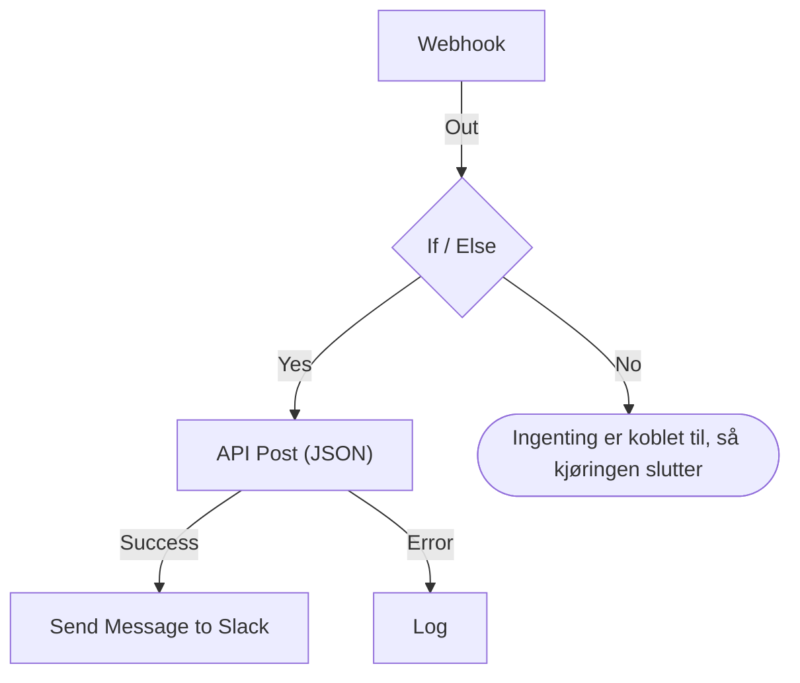

# Opprette en arbeidsflyt

Du bygger en arbeidsflyt i dens **Bygger**: et lerret der du legger til blokker, kobler dem sammen og fyller ut innstillingene deres. Denne siden viser hvordan du oppretter en arbeidsflyt, [legger til blokker](#legg-til-blokker), [kobler](#koble-sammen-blokker) og [konfigurerer](#konfigurer-en-blokk) dem, [sender verdier mellom dem](#bruk-verdier-fra-tidligere-blokker) og [slår arbeidsflyten på](#slå-den-på).

For å opprette en arbeidsflyt åpner du **Arbeidsflyter** og klikker på **Opprett arbeidsflyt**. Dialogen **Opprett en arbeidsflyt** spør først hvordan du vil starte, og deretter om et navn. En mal som trenger egne innstillinger, som en Slack-webhook-URL, ber om dem i et ekstra trinn og lagrer dem som arbeidsflytvariabler, slik at du kan endre dem senere uten å redigere arbeidsflyten.

Velg hvordan du vil begynne:

- **Start fra bunnen**, øverst i dialogen, gir deg et tomt lerret. De fleste arbeidsflyter starter her.
- **Eller start fra en mal** viser noen få **Anbefalt** maler. For de andre velger du en kategori ved siden av søkefeltet, som **Hendelser**, **Monitorer** eller **Jira**, eller **Alle maler**, eller du skriver i **Søk i maler…**. Hvert ord du skriver, må passe.

Klikk på en mal for å se hva den gjør: triggeren, blokkene den består av, og innstillingene den vil spørre om. Klikk deretter på **Bruk denne malen**, eller dobbeltklikk på malen. I søkefeltet velger piltastene en mal, og **Enter** bruker den. `/` tar deg tilbake til søkefeltet.

Arbeidsflyter opprettes avslått, så ingenting kjører før du slår dem på. En ny arbeidsflyt åpnes i **Bygger**, lerretet der du designer den.

## Lerretet

En arbeidsflyt fra bunnen åpnes med én enkelt stiplet blokk med teksten **Choose what starts this workflow**. Den blokken er utgangspunktet — klikk på den for å velge en trigger. En arbeidsflyt som er opprettet fra en mal, åpnes med blokkene allerede på plass.

Hver arbeidsflyt har nøyaktig én **trigger** øverst. Alt annet er en **komponent** som gjør noe. For å bytte trigger sletter du den: den stiplede plassholderen kommer tilbake på plassen dens, og et klikk på den lar deg velge en annen. Når du sletter en blokk, slettes linjene dens også, så koble den nye triggeren til den første blokken igjen.

Endringer lagres automatisk. En pille i verktøylinjen følger med på det: **Lagrer…** mens endringen er på vei, deretter **Lagret**, eller **Kunne ikke lagre** hvis det ikke lyktes. Lerretet har ingen lagreknapp og ikke noe eget publiseringstrinn.

## Legg til blokker

| For å legge til        | Klikk på                                                       | Panel som åpnes               |
| ---------------------- | -------------------------------------------------------------- | ----------------------------- |
| Triggeren              | Den stiplede plassholderblokken                                | **Add Trigger**               |
| Enhver annen blokk     | **Legg til komponent**, i verktøylinjen over lerretet          | **Legg til komponent**        |

Begge panelene åpnes på blokkene de fleste arbeidsflyter bruker, under **Popular**, etterfulgt av de øvrige innebygde blokkene. Under **OneUptime resources** klikker du på en ressurs som **Hendelse** for å se hva du kan gjøre med den; **Browse all resources** viser alle. Eller søk: skriv noen ord, som `create incident`, så kommer det beste treffet først. Trykk på `/` for å hoppe til søkefeltet, på piltastene for å gå gjennom resultatene og på **Enter** for å legge til den uthevede blokken. Et klikk på en blokk legger den til.

En ny blokk havner under den nederste blokken på lerretet, og en ny trigger tar plassen til den stiplede blokken øverst. Den nye blokken er merket, og hvis den havner utenfor synsfeltet, ruller lerretet akkurat nok til å vise den. Innstillingene åpnes ikke av seg selv: klikk på blokken når du er klar til å konfigurere den. Inntil de påkrevde innstillingene er fylt ut, står det **Click to set up** på den.

Dra blokkene dit du vil; lerretet fester dem til et rutenett underveis. Plasseringene lagres, så neste person ser det samme oppsettet som du etterlot.

## Det som er på en blokk

| Felt                                  | Hva det gjør                                                                                                                                                                                                                                                                                                  |
| ------------------------------------- | ------------------------------------------------------------------------------------------------------------------------------------------------------------------------------------------------------------------------------------------------------------------------------------------------------------- |
| **Identifier** (under **ID**)         | Den korte ID-en som vises på blokken, som `log-1`. Det er slik andre blokker viser til denne, så hvis du gir den nytt navn, slutter alle `{{local.components.…}}`-referanser som peker på den, å virke. Blokkens overskrift er komponentens eget navn og kan ikke endres.                                    |
| **Innstillinger**                     | Det blokken trenger for å gjøre jobben sin — en URL, en Slack-kanal, en meldingstekst. Valgfrie felt er merket **(Valgfritt)**; alt annet er påkrevd. En av/på-bryter har ingen av delene, fordi den alltid har en verdi. Mindre brukte innstillinger er foldet sammen under **Flere felt**, der overskriften nevner dem og viser de som er fylt ut. |
| **Input**                             | Punktet på den øverste kanten, der linjer fra tidligere blokker kommer inn. Triggere har ikke noe — ingenting kjører før dem.                                                                                                                                                                                  |
| **Outputs**                           | Punktene langs den nederste kanten, med etiketter rett over, der linjer går ut til de neste blokkene. Mange blokker har separate utganger **Success** og **Error**, slik at du kan håndtere begge tilfellene.                                                                                               |

## Koble sammen blokker

Dra fra et punkt nederst på én blokk ned til punktet øverst på den neste. Linjen du trekker, avgjør hva som kjører etterpå.

- Kobler du fra **Success**, kjører den neste blokken bare når den forrige lyktes.
- Kobler du fra **Error**, kjører den neste blokken bare når den forrige mislyktes.
- Kobler du ikke en utgang, stopper den veien bare.

Du kan koble én utgang til flere blokker. Alle kjører — men etter hverandre, i én kø, ikke parallelt. Ikke regn med rekkefølgen mellom grenene, og ikke regn med at de overlapper i tid.

Hver blokk kjører høyst én gang per kjøring. En linje som fører til en blokk som allerede har kjørt — tilbake opp på lerretet eller fra en annen gren etter at den første nådde den — stopper kjøringen med en feil, slik at en arbeidsflyt ikke kan gå i ring.

## Konfigurer en blokk

Klikk på en blokk for å åpne innstillingene i en dialog, eller gå til den med **Tab** og trykk på **Enter**. Fyll ut innstillingene, og klikk på **Lagre**.

Hver innstilling har det inndatafeltet verdien krever:

| Innstillingen inneholder                         | Du får                                                                         |
| ------------------------------------------------ | ------------------------------------------------------------------------------ |
| Ord: en melding, en prompt, en verdi som skal logges | Et felt som vokser mens du skriver. **Enter** starter en ny linje.         |
| En kort verdi: en URL, en ID, en emnelinje       | Én linje.                                                                      |
| Kode eller HTML                                  | En kodeeditor.                                                                 |
| JSON                                             | En JSON-editor.                                                                |
| På eller av                                      | En bryter med navnet ved siden av. Klikk på bryteren eller navnet for å bytte den. |

Dialogen åpnes ved det du sannsynligvis kom for. For en **Webhook**-trigger er det URL-en, med en knapp **Kopier URL**, metodene den godtar, og en eksempelforespørsel. For en **Manual**-trigger er det hvordan arbeidsflyten startes. Enhver annen blokk åpnes ved innstillingene sine. En blokk uten innstillinger har ingen del **Innstillinger** i det hele tatt.

Under det, ovenfra og ned:

- **ID**, **Inputs** og **Outputs**, side om side — blokkens identifikator, hvor den nås fra, og hva som kjører etter den.
- **Returns** — dataene denne blokken gir videre til senere trinn. Hver verdi viser den nøyaktige referansen som leser den, med en knapp for å kopiere den.
- **How to use** — hva blokken gjør i én setning, trinnene for å konfigurere den, et eksempel å kopiere og feilene folk ofte gjør. Eksempelet er bygget ut fra arbeidsflyten din: det bruker ID-en til denne blokken og triggerens verdier der det setter data inn i en melding. **Learn more** åpner den lengre forklaringen, og lenkene går til den fullstendige veiledningen. Hver blokk har en, og knappen **How to use** øverst i dialogen hopper rett dit.

Bunnen inneholder:

- **Slett** — fjern denne blokken. Den spør først og nevner blokken med type og identifikator, som **Send Email (send-email-2)**, slik at du vet hvilken av flere like blokker som forsvinner.
- **Run just this step** — kjør bare denne ene blokken, uten resten av arbeidsflyten. Verdier den ville ha lest fra andre trinn, kommer tomme frem, og alt den sender, skriver eller sletter, skjer på ekte. Den hopper over alle betingelser før blokken, så bare personer som har lov til å redigere arbeidsflyten, kan bruke den.

### Bruk verdier fra tidligere blokker

De fleste innstillinger kan bruke en verdi fra en tidligere blokk eller en variabel — slik flyter data fra én blokk til den neste. Hver slik innstilling har en knapp **{ }** i enden. Den åpner en liste over verdiene du kan bruke: hver tidligere blokk med navnet sitt, med hver verdi den returnerer — hva den heter, hva den inneholder og typen —, deretter arbeidsflytens variabler og de globale. Søk i listen, velg en med musen eller med piltastene og **Enter**, så settes verdien inn der markøren står.

I innstillingen vises en verdi som en brikke, som **Webhook › Request Body**. Hold musen over den for å se referansen den står for, `{{local.components.webhook-1.returnValues.request-body}}`, som er det som lagres. Markøren hopper over en brikke i ett hopp, **Backspace** fjerner den helt, og kopierer du den, kopieres referansen. Kjenner du syntaksen, kan du skrive `{{` i stedet: den samme listen åpnes under innstillingen og snevres inn mens du skriver.

- **Bare verdier som vil finnes, tilbys.** Det er triggeren og blokkene som kjører før denne. En blokk som kjører senere, har ennå ingen utdata. Inntil en blokk er koblet til, vises bare triggerens verdier, og listen sier det.
- **En post åpnes på feltene sine.** En Find One- eller On Create-blokk returnerer en hel post. Velg den for å se feltene, med de som blokkens **Select Fields** leser, først. En JSON-verdi eller et sett med headere åpnes på et felt der du skriver en sti, som `title` eller `alerts[0].status`.
- **Når en blokk har kjørt, vet listen hva som er i verdiene dens.** Hver verdi sier hva den inneholdt i den siste kjøringen — `"production"` eller `3 fields` —, og en JSON-verdi eller et sett med headere åpnes på feltene den hadde, hvert med innholdet sitt. Fra en Webhooks **Request Body** velger du altså **incident.title** i stedet for å skrive en sti. Søk finner også disse feltene: skriv `title`, eller `{{` og begynnelsen av en sti. Feltene til en post viser også hva de inneholdt. Feltene kommer fra den siste kjøringen, så et felt som en senere forespørsel utelater, er tomt i den kjøringen. En verdi som ser ut som en hemmelighet, som en `Authorization`-header, et token eller et passord, vises uten innholdet sitt.
- **En Webhook som ennå ikke har mottatt en forespørsel, sier det** øverst i verdiene sine, med **Copy test request**: en `curl`-kommando som sender `{"message": "Hello"}` til arbeidsflytens webhook-URL. Kjør den i en terminal mens listen er åpen, så dukker feltene i forespørselen opp i den så snart kjøringen den starter, er ferdig, vanligvis i løpet av noen sekunder. Arbeidsflyten må være aktivert, ellers avvises forespørselen. Bare personer som har lov til å se webhook-URL-en, får knappen. En Incoming Email-trigger som ennå ikke har mottatt en e-post, sier det samme sted; send en e-post til adressen dens, så dukker headerne og vedleggene opp på samme måte.
- **Kodeeditorer har Insert value i verktøylinjen.** I JSON legger den til anførselstegnene en verdi trenger inne i et dokument. **Run Custom JavaScript** leser verdier gjennom sine **Arguments**, så koden har ingen velger.
- **Tall, passord, brytere og datoer beholder sin egen kontroll,** med **{ }** ved siden av. En valgt verdi erstatter kontrollen, og **abc** går tilbake til å skrive.

En brikke blir oransje når det den leser, ikke finnes: en blokk som har fått nytt navn eller er slettet, en verdi blokken ikke returnerer, en blokk som kjører senere, eller en variabel som ikke finnes. Verktøytipset sier hvilken. Se [Variabler](/docs/workflows/variables) for referansesyntaksen.

## Kontroller mens du bygger

Bygger kontrollerer hele grafen hver gang du endrer den, og melder det den finner, i en pille i verktøylinjen. Klikk på pillen for å åpne **Problems with this workflow**, som viser hvert problem og tar deg til blokken det gjelder. På lerretet står det **Click to set up** på en blokk der påkrevde innstillinger fortsatt er tomme, og en blokk med et annet problem har et merke i hjørnet: rødt for en feil, oransje for en advarsel. Hold musen over merket for å lese hva som er galt.

Den fanger opp feilene som ellers er usynlige til en kjøring går galt:

- en arbeidsflyt uten trigger;
- to blokker med samme ID, eller en ID med punktum i;
- en blokk som ingenting er koblet til;
- en påkrevd innstilling som er latt stå tom;
- ugyldig JSON;
- mellomrom inne i `{{ }}`;
- referanser til et trinn eller en returverdi som ikke finnes.

Én ting kan den ikke kontrollere: om et variabelnavn finnes. Innstillingene til en blokk kan — en referanse til en variabel som ikke finnes, vises der som en oransje brikke. Alle andre steder viser en variabel med nytt navn seg først i kjøringens logg.

## Din første arbeidsflyt

Den raskeste måten å bli kjent med lerretet på er en arbeidsflyt med to blokker som du starter manuelt:

:::steps
1. Klikk på den stiplede plassholderblokken, og klikk deretter på **Manual** i panelet **Add Trigger**.
2. Klikk på **Legg til komponent**, og klikk deretter på **Logg** under **Popular**. Den nye blokken havner under triggeren. Koble triggerens punkt **Execute** ned til inngangspunktet på Log-blokken.
3. Klikk på Log-blokken, der det står **Click to set up**, og skriv `Hello from ` i **Value**. Klikk på **{ }**, og klikk deretter på **JSON** under **Manual**. Innstillingen viser **Manual › JSON** og lagrer `{{local.components.manual-1.returnValues.value}}`. `manual-1` er triggerens **Identifier**, som vises på triggerblokken. Klikk på **Lagre**.
4. Slå på **Aktivert** øverst i Bygger. En deaktivert arbeidsflyt kan ikke kjøres i det hele tatt, heller ikke manuelt; hopper du over dette, ber **Kjør arbeidsflyt** deg slå den på først.
5. Tilbake i **Bygger** klikker du på **Kjør arbeidsflyt**, skriver `{ "name": "Ada" }` i feltet **JSON**, klikker på **Run Workflow Manually** og bekrefter med **Run**.
6. Et panel **Arbeidsflytkjøring** åpnes av seg selv og følger kjøringen. Loggen viser `Value:` etterfulgt av `Hello from { "name": "Ada" }`.
:::

Den syklusen — legg til, koble, konfigurer, kjør, les loggen — er slik du bygger hver arbeidsflyt.

> [!TIP]
> JSON som skrives inn i **Kjør arbeidsflyt**, kommer frem til Manual-triggeren som teksten du skrev. For å lese et felt i den, som `name`, legger du til en **Text to JSON**-blokk, setter triggerens **JSON** i **Text** på den og leser feltet fra den blokkens **JSON**: `{{local.components.text-to-json-1.returnValues.json.name}}`.

## Slå den på

Nye arbeidsflyter starter deaktivert, og det samme gjør enhver arbeidsflyt du dupliserer eller importerer. Mens en arbeidsflyt er slått av, sier Bygger det over lerretet, med en knapp **Slå på arbeidsflyt**.

Bryteren **Aktivert** sitter øverst i **Bygger**, ved siden av **Legg til komponent** og **Kjør arbeidsflyt**. Den finnes også på arbeidsflytens side **Oversikt**, der kortet **Arbeidsflytdetaljer** viser gjeldende tilstand som en grønn pille **Aktivert** eller en rød pille **Deaktivert**: klikk på **Rediger arbeidsflyt**, og åpne **Flere felt**. Bare personer som har lov til å redigere arbeidsflyten, kan slå den på eller av; alle andre ser bryteren nedtonet.

En deaktivert arbeidsflyt kan ikke kjøre i det hele tatt, uansett hvordan den startes:

| Startet av                                                 | Mens arbeidsflyten er slått av                                                                                                                                                            |
| ---------------------------------------------------------- | ----------------------------------------------------------------------------------------------------------------------------------------------------------------------------------------- |
| Triggeren: en tidsplan, en OneUptime-begivenhet eller en e-post | Ignorert.                                                                                                                                                                            |
| **Kjør arbeidsflyt** eller **Run just this step**          | Bygger spør i stedet **Slå på denne arbeidsflyten?**. **Slå på og kjør** (eller **Slå på og kjør trinn**) slår arbeidsflyten på og kjører deretter det du ba om, med verdiene du ga.      |
| Et kall til webhook-URL-en                                 | Avvist med HTTP 400 og "This workflow is turned off, so it can't run. Turn it on with the Enabled switch at the top of its Builder, then try again."                                          |
| En annen arbeidsflyts **Execute Workflow**-blokk           | Den blokken tar veien **Error**, og feilen nevner arbeidsflyten den kalte.                                                                                                                |

Rekkefølgen er altså: bygg den, test den med **Kjør arbeidsflyt**, les kjøringens logg, og slå **Aktivert** av igjen hvis du ikke er klar for at triggeren skal utløses. For å teste én blokk uten å kjøre alt bruker du **Run just this step** i innstillingene til den blokken.

For å sette en arbeidsflyt på pause uten å slette den slår du av **Aktivert**. Ingen nye kjøringer starter. En kjøring som er i gang, gjør seg ferdig, men en som venter ved en **Sleep**-blokk, avbrytes når den våkner, og registreres som en feil.

## Rydd opp

- Dra blokker for å flytte dem. Oppsettet lagres.
- For å slette en linje drar du en av endene bort fra punktet og slipper den på et tomt sted på lerretet.
- For å slette en blokk klikker du på den og bruker **Slett** nederst i innstillingsdialogen. Å merke en blokk eller en linje og trykke på Backspace fjerner den også.
- Det finnes ingen måte å duplisere én enkelt blokk på. **Dupliser Arbeidsflyt** på arbeidsflytens side **Innstillinger** kopierer alt. Navnet på kopien er fylt ut og nummerert forbi prosjektets arbeidsflyter ("Nightly Sync" kopieres som "Nightly Sync 2"), og kopien åpnes, deaktivert.
- Plasser blokkene ovenfra og ned, slik at de leses i den retningen de kjører — inngangen er på den øverste kanten, utgangene på den nederste, så flyten naturlig går nedover.

## Neste trinn

:::cards
- [Triggere](/docs/workflows/triggers): De fem måtene en arbeidsflyt kan starte på.
- [Komponenter](/docs/workflows/components): Alle blokkene du kan legge til, med innstillingene og utgangene deres.
- [Variabler](/docs/workflows/variables): Flytt data mellom blokker, og hold hemmeligheter utenfor dem.
- [Kjøringer](/docs/workflows/runs-and-logs): Sjekk hva hver kjøring gjorde, trinn for trinn.
:::
