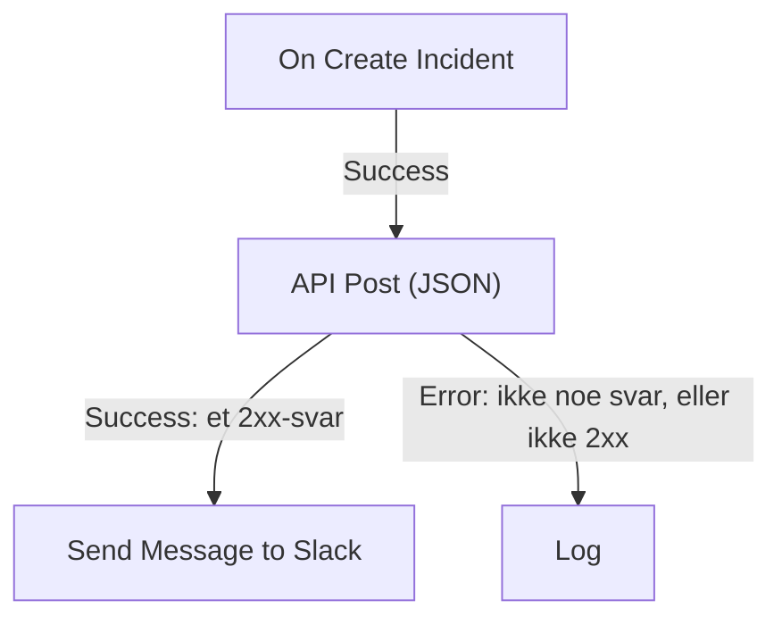

# Arbeidsflyt-komponenter

Komponenter er blokkene du legger til etter triggeren. Hver gjør én ting — sender en melding, kaller et API, sjekker en betingelse, endrer en OneUptime-post — og tar deretter én av utgangene sine til blokkene som er koblet til den. Denne siden er katalogen: hva hver blokk trenger, hva den returnerer, og når den tar hver utgang.

Du trenger sjelden å ha den åpen mens du bygger. Innstillingene til hver blokk slutter med **How to use**: hva blokken gjør, trinnene for å konfigurere den, et eksempel bygget ut fra din egen arbeidsflyt og feilene folk ofte gjør. Se [Opprette en arbeidsflyt](/docs/workflows/authoring) om å legge til og koble sammen blokker.

:::cards
- [Send en melding](#slack): Slack, Microsoft Teams, Discord, Telegram, IRC og e-post.
- [Kall et API](#api): Send en forespørsel til et hvilket som helst HTTP-API, og les svaret.
- [Legg til logikk](#conditions): Forgren på en verdi, omform data, vent eller logg.
- [Arbeid med OneUptime-poster](#oneuptime-datakomponenter): Finn, opprett, oppdater og slett monitorer, hendelser og mer.
:::

## Hvilken komponent bør jeg bruke?

| For å …                                                       | Bruk                                                              |
| ------------------------------------------------------------- | ----------------------------------------------------------------- |
| Poste i et chatverktøy                                        | [Slack](#slack), [Microsoft Teams](#microsoft-teams), [Discord](#discord), [Telegram](#telegram) eller [IRC](#irc) |
| Sende en e-post gjennom din egen e-postserver                 | [Email](#email)                                                   |
| Kalle et hvilket som helst annet API eller din egen tjeneste  | [API](#api)                                                       |
| Oppsummere, klassifisere eller skrive utkast til tekst        | [Generate Text with AI](#generate-text-with-ai)                   |
| Ta den ene eller den andre veien avhengig av en verdi         | [Conditions](#conditions)                                         |
| Omforme data mellom to blokker                                | [JSON](#json) eller [Custom Code](#custom-code)                   |
| Vente før neste blokk                                         | [Sleep](#sleep)                                                   |
| Starte en annen arbeidsflyt                                   | [Execute Workflow](#execute-workflow)                             |
| Lese eller endre hendelser, monitorer og andre poster         | [OneUptime-datakomponenter](#oneuptime-datakomponenter)           |

En dedikert blokk slår en generell: Slack-blokken kjenner grensene til Slack, og en postblokk kjenner feltene til posten, så du får tydeligere feil og logger enn fra en **API**-blokk som gjør den samme jobben.

## Slik fungerer hver blokk

En blokk kjører når blokken før den tar utgangen som er koblet til den. Den leser innstillingene sine, gjør jobben sin og tar deretter én av utgangene sine. Bare blokkene som er koblet til den utgangen, kjører etterpå.



- **Innstillinger** er det du fyller ut. Innstillinger merket **(Valgfritt)** kan stå tomme. Mindre brukte innstillinger er foldet sammen under **Flere felt**.
- **Outputs** er punktene på den nederste kanten. De fleste blokker har **Success** og **Error**; [Conditions](#conditions) har **Yes** og **No**.
- **Returns** er verdiene en blokk gir videre til senere blokker, som et API sin **Response Body**. En senere blokk leser en med `{{local.components.<block ID>.returnValues.<value ID>}}`; knappen **{ }** i en innstilling setter den inn for deg. Se [Variabler](/docs/workflows/variables#komponentutdata-data-fra-tidligere-blokker).

En blokk som tar **Error**, får ikke kjøringen til å mislykkes: kjøringen følger veien **Error**, eller slutter der hvis ingenting er koblet til den. En påkrevd innstilling som er latt stå tom, eller en innstilling som aldri kan virke, stopper derimot kjøringen med en feil.

## API

Gjør en HTTP-forespørsel til en hvilken som helst URL. Det finnes én blokk per metode: **API Get (JSON)**, **API Post (JSON)**, **API Put (JSON)**, **API Patch (JSON)** og **API Delete (JSON)**.

| Innstilling         | Hva den gjør                                                                                                                         |
| ------------------- | ------------------------------------------------------------------------------------------------------------------------------------ |
| **URL**             | Adressen som skal kalles, `http` eller `https`.                                                                                      |
| **Request Body**    | JSON-en som skal sendes. Vanligvis er det bare `POST`-, `PUT`- og `PATCH`-forespørsler som trenger en.                              |
| **Request Headers** | Headere som skal sendes med, som en API-nøkkel. Under **Flere felt**. Verdiene deres er skjult i kjøringens logg.                    |

| Utgang      | Når                                                                                            |
| ----------- | ---------------------------------------------------------------------------------------------- |
| **Success** | Serveren svarte med en 2xx-status.                                                             |
| **Error**   | Forespørselen mislyktes: serveren kunne ikke nås, eller den svarte med en annen status.        |

Uansett returnerer blokken **Response Status**, **Response Headers** og **Response Body**, pluss **Error** med årsaken når den mislyktes. Les et felt i et JSON-svar ved å legge navnet til referansen, som i `{{local.components.api-get-1.returnValues.response-body.id}}`.

Omdirigeringer følges ikke, så pek blokken mot adressen som svarer. Forespørsler sendes fra OneUptime: en URL som peker til en privat nettverksadresse, avvises med mindre en administrator av en selvhostet installasjon tillater det, og kjøringen stopper med årsaken. Se [Utgående nettverkstilgang](/docs/workflows/configuration#utgående-nettverkstilgang).

## AI

### Generate Text with AI

Generer ett tekstsvar ut fra en prompt og valgfri JSON-kontekst. Blokken bruker prosjektets standard-LLM-leverandør, eller installasjonens globale leverandør når prosjektet ikke har noen. Leverandører konfigureres sentralt under **Prosjektinnstillinger → KI → LLM-leverandører**; nøklene og endepunktene deres er aldri innstillinger på blokken.

| Innstilling               | Hva den gjør                                                                                                                                                      |
| ------------------------- | ----------------------------------------------------------------------------------------------------------------------------------------------------------------- |
| **System Instructions**   | Valgfri veiledning om modellens rolle, tone og begrensninger.                                                                                                    |
| **Prompt**                | Oppgaven. Den sendes nøyaktig slik du skriver den, så Markdown går fint, og den kan inneholde variabler og verdier fra tidligere blokker.                          |
| **Context**               | Valgfri JSON som du bevisst sender med. Den legges til etter en tydelig markør for slutten av meldingen og behandles som upålitelige data.                         |
| **Temperature**           | Under **Flere felt**. Variasjon fra `0` til `1`; standardverdien er `0.2`, for forutsigbar automatisering. Nåværende Claude-modeller, Opus 4.7 og nyere og alle Claude 5-modeller, velger sin egen sampling: OneUptime utelater **Temperature** fra forespørslene deres, så den har ingen virkning på dem. |
| **Maximum Output Tokens** | Under **Flere felt**. Fra `1` til `4096`; standardverdien er `1024`.                                                                                             |

System Instructions, Prompt og den serialiserte Context er til sammen begrenset til 50 000 tegn. Et bilde som er innebygd i dem som base64, som et skjermbilde fra en syntetisk monitor i beskrivelsen av en hendelse, erstattes av en kort merknad som `[image omitted: PNG, 340 KB]` før de måles, fordi modellen leser tekst, ikke bilder. Kjøringens logg sier hva som ble utelatt. Forespørselen til leverandøren varer høyst 60 sekunder og forsøkes én gang. Høyst tre AI-forespørsler fra arbeidsflyter kan kjøre samtidig per prosjekt.

Den returnerer **Response** (den genererte teksten), **Provider** og **Model** (det som svarte), **Total Tokens** og **Completion Tokens** (forbruket slik leverandøren rapporterte det), **LLM Log ID** (kallets oppføring i AI-loggene) og **Error**.

Koble **Success** til blokkene som bruker svaret, og **Error** til en reserveløsning: feil i validering, tilgang, leverandør, budsjett, fakturering og tidsavbrudd tar alle den veien. Blokken sender ingen verktøy, så modellen kan ikke selv spørre OneUptime, kalle API-er eller endre data.

> [!WARNING]
> Modellens utdata er upålitelig tekst. Gå gjennom den før den når kunder, og la aldri fri AI-tekst alene avgjøre en destruktiv handling. Se [AI-komponenter](/docs/workflows/configuration#ai-komponenter) for hva som sendes til leverandøren, hva som logges, og hva det koster.

## Slack

Post en melding i en Slack-kanal via en innkommende webhook.

| Innstilling                    | Hva den gjør                                                                                                                                                                                                 |
| ------------------------------ | ------------------------------------------------------------------------------------------------------------------------------------------------------------------------------------------------------------ |
| **Slack Incoming Webhook URL** | Webhooken for kanalen det skal postes i. Den må begynne med `https://hooks.slack.com/services/`. Slacks veiledning for å [opprette en](https://api.slack.com/messaging/webhooks) tar noen minutter.          |
| **Message Text**               | Teksten som skal sendes. Den sendes nøyaktig slik du skriver den, så bruk Slacks egen formatering: `*bold*`, `_italic_`, `~strikethrough~` og `<https://example.com|a link>`. En tekst som er lengre enn én Slack-seksjon (3000 tegn), sendes som flere; utover ti seksjoner kuttes den og slutter med "… (truncated — see OneUptime for the full text)". |

**Success** utløses når Slack tok imot meldingen, og **Error** når Slack avviste den, med Slacks årsak i **Error**. Disse blokkene poster gjennom webhooken i innstillingene sine, ikke gjennom prosjektets Slack-tilkobling.

## Microsoft Teams

Post en melding i en Microsoft Teams-kanal. Blokken heter **Send Message to Teams**.

| Innstilling                    | Hva den gjør                                                                                                                                                                                                                                  |
| ------------------------------ | --------------------------------------------------------------------------------------------------------------------------------------------------------------------------------------------------------------------------------------------- |
| **Teams Incoming Webhook URL** | Webhooken for kanalen det skal postes til, en `https`-URL på `office.com`, `office365.com`, `logic.azure.com` eller `environment.api.powerplatform.com`. Microsofts veiledning viser hvordan du [oppretter en med Teams Workflows](https://support.microsoft.com/en-us/teams/apps-service/create-incoming-webhooks-with-workflows-for-microsoft-teams). |
| **Message Text**               | Teksten som skal sendes. En melding som er større enn det en innkommende webhook tar imot (omtrent 12 000 tegn, målt slik den sendes), kuttes og slutter med "… (truncated — see OneUptime for the full text)".                                |

## Discord

Post en melding i en Discord-kanal via en innkommende webhook.

| Innstilling                      | Hva den gjør                                                                                                                                       |
| -------------------------------- | -------------------------------------------------------------------------------------------------------------------------------------------------- |
| **Discord Incoming Webhook URL** | Webhooken for kanalen, en `https`-URL på `discord.com` eller `discordapp.com`.                                                                     |
| **Message Text**                 | Teksten som skal sendes. En melding på mer enn 2000 tegn, Discords grense, kuttes og slutter med "… (truncated — see OneUptime for the full text)". |

## Telegram

Send en melding til en Telegram-chat med en bot.

| Innstilling            | Hva den gjør                                                                                                                                       |
| ---------------------- | -------------------------------------------------------------------------------------------------------------------------------------------------- |
| **Telegram Bot Token** | Tokenet BotFather ga boten din, som `123456789:ABCdef…`. Et token i en hvilken som helst annen form stopper kjøringen, uten at tokenet skrives i loggen. |
| **Chat ID**            | Chatten det skal postes i: ID-en, eller en kanals `@username`. Legg først boten til i gruppen eller kanalen. For å skrive til en person må personen ha startet en chat med boten. |
| **Message Text**       | Teksten som skal sendes. En melding på mer enn 4096 tegn, Telegrams grense, kuttes og slutter med "… (truncated — see OneUptime for the full text)". |

Når Telegram avviser meldingen, utløses **Error** med Telegrams årsak.

## IRC

Post en melding i en IRC-kanal på et hvilket som helst IRC-nettverk: Libera.Chat, OFTC eller din egen server. IRC har ingen webhooker, så blokken kobler seg selv til serveren, går inn i kanalen, sender meldingen og forlater den igjen.

| Innstilling      | Hva den gjør                                                                                                                                                                                                                                       |
| ---------------- | -------------------------------------------------------------------------------------------------------------------------------------------------------------------------------------------------------------------------------------------------- |
| **IRC Server**   | Vertsnavnet til serveren, som `irc.libera.chat`. Bare navnet: ingen `ircs://` og ingen port.                                                                                                                                                       |
| **Channel**      | Kanalen det skal postes i, som `#ops`. Det må være en kanal: et kallenavn som skrives her, avvises i stedet for å få en privat melding.                                                                                                             |
| **Message Text** | Teksten som skal sendes. Hver linje sendes som sin egen IRC-melding, og en lang linje deles slik at den passer. En melding sendes som høyst 15 IRC-linjer: en lengre kuttes, og den siste linjen sier det. IRC har ingen Markdown, så teksten sendes slik den er skrevet; IRCs egne formateringskoder, som fet skrift og farger, virker. |

Under **Flere felt**:

| Innstilling                              | Hva den gjør                                                                                                                                                                                                       |
| ---------------------------------------- | ------------------------------------------------------------------------------------------------------------------------------------------------------------------------------------------------------------------ |
| **Nickname**                             | Hvem meldingen er fra. Standard er `OneUptime`. Er kallenavnet opptatt, prøver blokken det med en understrek eller et tall lagt til, og deretter med et slikt tegn i stedet for de siste tegnene, for en server som ikke tar et lengre kallenavn. |
| **Port**                                 | Porten til serveren. Standard er `6697`, eller `6667` med **Disable TLS** slått på.                                                                                                                                |
| **Disable TLS**                          | Blokken kobler til over TLS og sjekker sertifikatet til serveren. Slå dette på bare for en server som ikke tilbyr TLS; et eventuelt passord sendes da ukryptert. For å stole på et sertifikat fra din egen sertifikatutsteder setter en selvhostet installasjon i stedet `NODE_EXTRA_CA_CERTS`. |
| **Channel Key**                          | Nøkkelen til en kanal som har en (modus `+k`).                                                                                                                                                                     |
| **Send Without Joining**                 | Poster uten å gå inn i kanalen, slik at kanalen ikke ser blokken komme og gå. Virker bare der kanalen tar imot meldinger utenfra (ingen modus `+n`).                                                               |
| **Server Password**                      | Et passord som serveren eller bounceren din ber om ved tilkobling.                                                                                                                                                 |
| **SASL Username** og **SASL Password**   | Logg inn på kontoen din på nettverk som bruker SASL, som Libera.Chat, som krever det for tilkoblinger fra visse sky- og VPN-adresser. Fyll ut begge eller ingen.                                                    |

**Success** utløses når serveren har tatt imot hver linje. Blokken sjekker det ved å be serveren svare på en ping etter den siste linjen: en server svarer i rekkefølge, så en eventuell avvisning av meldingen kommer først. En bouncer som ZNC svarer selv på pingen, så blokken lytter et sekund lenger etter svaret fra nettverket bak den.

**Error** utløses når serveren ikke kan nås, avviser tilkoblingen, kallenavnet, et passord eller kanalen, eller avviser meldingen. Den gir videre årsaken, med serverens egne ord der den ga dem. En manglende **IRC Server**, **Channel** eller **Message Text**, eller en innstilling som aldri kunne virke, stopper derimot kjøringen.

Hver kjøring av blokken er sin egen tilkobling, og IRC-nettverk begrenser hvor ofte én adresse kan koble til: en rekke meldinger kan avvises med en årsak som "Reconnecting too fast", og tar **Error** som enhver annen avvisning. For en arbeidsflyt som kan utløses mange ganger i minuttet, samler du det den har å si, i én melding, eller sender det gjennom din egen server.

Oppbevar passordene i [hemmelige globale variabler](/docs/workflows/variables#globale-variabler), og bruk variabelen i innstillingen; de er skjult i kjøringenes logger uansett. Tilkoblinger til loopback- (`localhost`, `127.0.0.1`), link-local- og skymetadata-adresser avvises. I OneUptime Cloud avvises også en server på en privat nettverksadresse, eller et navn som peker til en. Selvhostede installasjoner kan nå en IRC-server på sitt eget nettverk, med mindre `DATA_SOURCE_BLOCK_PRIVATE_ADDRESSES` er satt til `true`.

## Email

Send en e-post gjennom en SMTP-server som du angir på blokken. Blokken heter **Send Email**.

| Innstilling                             | Hva den gjør                                                                                          |
| --------------------------------------- | ----------------------------------------------------------------------------------------------------- |
| **From Email**                          | Avsenderen, for eksempel `Alerts <alerts@company.com>`.                                               |
| **To Email**                            | Mottakerens adresse. Skill flere adresser med komma eller semikolon.                                  |
| **Subject**                             | Emnelinjen.                                                                                           |
| **Email Body**                          | Meldingen, sendt som HTML.                                                                            |
| **SMTP HOST** og **SMTP Port**          | E-postserveren det skal kobles til.                                                                   |
| **SMTP Username** og **SMTP Password**  | Valgfrie. Fyll ut begge eller ingen.                                                                  |
| **Use Implicit TLS**                    | Slå på for implisitt TLS, vanligvis på port 465. La den være av for STARTTLS, vanligvis på port 587.   |

**Success** utløses når SMTP-serveren tok imot meldingen. **Error** utløses når SMTP-verten avvises, serveren ikke kan nås, eller den avviser meldingen, og gir videre feilmeldingen. En manglende **To Email**, **From Email**, **SMTP HOST** eller **SMTP Port** stopper derimot kjøringen.

Blokken kobler seg direkte til serveren i innstillingene sine. Den bruker ikke prosjektets [SMTP](/docs/emails/smtp)-innstillinger eller OneUptimes egen e-postserver, og e-postene den sender, vises ikke i varslingsloggene. For å sjekke hva den gjorde, ser du på arbeidsflytens [Kjøringer](/docs/workflows/runs-and-logs).

Tilkoblinger til loopback- (`localhost`, `127.0.0.1`), link-local- og skymetadata-adresser avvises. I OneUptime Cloud avvises også en SMTP-vert på en privat nettverksadresse, eller et navn som peker til en. Selvhostede installasjoner kan nå en e-postserver på sitt eget nettverk, med mindre `DATA_SOURCE_BLOCK_PRIVATE_ADDRESSES` er satt til `true`. En avvist vert tar utgangen **Error**, og ingenting sendes.

## Custom Code

Kjør noen linjer JavaScript når de andre blokkene ikke kan gjøre det du trenger. Blokken heter **Run Custom JavaScript**.

| Innstilling         | Hva den gjør                                                                                                                         |
| ------------------- | ------------------------------------------------------------------------------------------------------------------------------------ |
| **JavaScript Code** | Koden din. Det den returnerer med `return`, blir blokkens **Value**. Den kan bruke `await`.                                         |
| **Arguments**       | Et JSON-objekt med verdier til koden, som leser dem som `args`. Sett variabler og verdier fra tidligere blokker her; selve koden kan ikke lese dem. |

```json title="Arguments"
{ "title": "{{local.components.incident-on-create-1.returnValues.model.title}}" }
```

```javascript title="JavaScript Code"
const words = args.title.split(" ");

return {
  shortTitle: words.slice(0, 5).join(" "),
  wordCount: words.length,
};
```

En senere blokk leser den korte tittelen som `{{local.components.javascript-1.returnValues.returnValue.shortTitle}}`.

Koden kjører i en sandkasse med `args`, `console.log` (skrevet til kjøringens logg), `axios` for HTTP-forespørsler, `crypto` og `sleep`. Den har ikke noe filsystem og ingen prosess, og forespørslene dens følger de samme adressereglene som API-blokken. Den har 5 sekunder som standard; en selvhostet installasjon endrer det med `WORKFLOW_SCRIPT_TIMEOUT_IN_MS`.

**Success** utløses med den returnerte **Value**, og **Error** når koden kaster en feil eller går tom for tid, med meldingen i **Error**. For tyngre skript bruker du heller en [Runbook](/docs/runbooks/index).

## JSON

Konverter mellom tekst og JSON, eller kombiner to JSON-objekter.

| Blokk            | Tar                                      | Returnerer                                                                                                 |
| ---------------- | ---------------------------------------- | ---------------------------------------------------------------------------------------------------------- |
| **JSON to Text** | **JSON**, et objekt                      | **Text**: objektet som en streng. Nyttig når neste blokk forventer tekst.                                  |
| **Text to JSON** | **Text**, som kan gå over flere linjer   | **JSON**: det tolkede objektet, slik at du kan lese feltene. Bruk den på JSON som kom som tekst.            |
| **Merge JSON**   | **JSON 1** og **JSON 2**                 | **JSON**: ett objekt med nøklene fra begge. Der begge har en nøkkel, vinner **JSON 2**.                     |

**Text to JSON** tar **Error** når teksten ikke er JSON. En manglende inndata, eller en inndata til **Merge JSON** som ikke er et objekt, stopper kjøringen.

## Conditions

Forgren på en sammenligning. I panelet **Legg til komponent** heter denne blokken **If / Else**, under **Popular**.

Innstillingene leses som en setning: **Hvis** *verdi som skal sjekkes* *sammenligning* *verdi det sammenlignes med*, fortsett på **Yes**, ellers på **No**. Under innstillingene leses betingelsen tilbake med ord, slik at du kan se at den sier det du mener. På lerretet viser blokken også betingelsen sin, for eksempel *Hvis environment is equal to “production”*.

| Innstilling        | Hva den gjør                                                                                                                             |
| ------------------ | ---------------------------------------------------------------------------------------------------------------------------------------- |
| **Value to check** | Vanligvis en verdi fra en tidligere blokk. Trykk på **{ }** i feltet for å velge en, eller skriv `{{`.                                   |
| **Comparison**     | Hvordan det skal sammenlignes, med ord. Sammenligningene står nedenfor.                                                                  |
| **Compare with**   | Det som skal sammenlignes med, skrevet eller valgt på samme måte. **er tom**, **er ikke tom**, **is true** og **is false** bruker det ikke. |
| **Compare as**     | Foldet bort under sammenligningen: **Text**, **Antall** eller **True / False**. Velg **Text** for å sortere datoer skrevet `2026-10-01`, eller **Antall** for å gjøre `200` og `200.0` like. |

Sammenligningene:

- **is equal to** og **is not equal to**;
- for tekst: **inneholder**, **inneholder ikke**, **starter med** og **slutter med**;
- for tall: **er større enn**, **is greater than or equal to**, **er mindre enn** og **is less than or equal to**;
- **er tom** og **er ikke tom**, som sjekker om verdien i det hele tatt er der;
- **is true** og **is false**.

Tallsammenligningene sammenligner tall, og tekstsammenligningene sammenligner tekst, så du trenger sjelden **Compare as**. Slik sammenlignes verdiene:

- Som tekst teller store og små bokstaver: `Error` er ikke `error`.
- Som tall teller tekst som ikke er et tall, som `0`. Innstillingene gjør oppmerksom på en slik skrevet verdi.
- Som sann eller usann teller bare `true` som sann.
- **er tom** oppfylles av ingenting i det hele tatt, blank tekst, en tom liste eller et tomt objekt, eller en verdi den tidligere blokken ikke hadde, som et felt webhooken ikke sendte. `0` og `false` er verdier, så de er ikke tomme.

**Yes** kjører når betingelsen er oppfylt, og **No** når den ikke er det. Blokker som ble satt opp før innstillingene fikk disse navnene, kjører nøyaktig som før. Ett gammelt valg tilbys ikke lenger: å sammenligne en verdi som **Null** eller **Undefined**, som ignorerte hva verdien inneholdt. En blokk som fortsatt bruker det, sier det når du åpner den; velg **er tom** for å sjekke etter en manglende verdi.

## Sleep

Sett kjøringen på pause før neste blokk, for å gi et annet system et øyeblikk til å ta igjen eller for å følge opp senere.

**Days**, **Hours**, **Minutes** og **Seconds** legges sammen. Den lengste ventetiden er 30 dager: en lengre kuttes til 30 dager, og kjøringens logg sier det.

Mens den venter, legges kjøringen til side med status **Venter** og plukkes opp igjen når tiden er ute, så en lang ventetid holder ingenting opp. En kjøring der arbeidsflyten i mellomtiden ble slått av eller arkivert, avbrytes når den våkner.

## Log

Skriv en verdi til kjøringens logg. Den endrer ingenting andre steder, noe som gjør den til den enkleste måten å se hva en verdi inneholdt.

**Value** er det som skal skrives. Den kan gå over flere linjer og inneholde verdier fra tidligere blokker, som `{{local.components.webhook-1.returnValues.request-body}}`. Blokken tar **Out** når den er ferdig.

## Execute Workflow

Start en annen arbeidsflyt i samme prosjekt. Arbeidsflyten din fortsetter uten å vente på at den andre blir ferdig.

| Innstilling   | Hva den gjør                                                                                                                              |
| ------------- | ----------------------------------------------------------------------------------------------------------------------------------------- |
| **Workflow**  | Arbeidsflyten som skal startes. Den må være aktivert og, for å ta imot argumenter, ha en **Manual**-trigger.                              |
| **Arguments** | JSON som skal sendes med. Manual-triggeren i den andre arbeidsflyten gir hver nøkkel videre som en verdi for seg: med `{"customerId": "42"}` leser den `{{local.components.manual-1.returnValues.customerId}}`. |

**Out** utløses så snart den andre arbeidsflyten står i kø. **Error** utløses når det ikke går: den finnes ikke, er slått av eller arkivert, eller å starte den ville gitt en løkke.

Bruk den til å dele felles logikk: bygg en «post i hendelseskanalen»-arbeidsflyt én gang, og start den fra hver arbeidsflyt som trenger den. En kjede av arbeidsflyter som starter hverandre, kan ikke gå i ring tilbake til seg selv og er høyst 10 ledd dyp. Se [Konfigurasjon og sikkerhet](/docs/workflows/configuration#grense-for-å-kalle-andre-arbeidsflyter).

## OneUptime-datakomponenter

For hver type post i OneUptime (monitorer, hendelser, varsler, statussider, vaktpolicyer og mange flere) har panelet **Legg til komponent** disse komponentene: under **OneUptime resources** klikker du på posttypen (**Browse all resources** har de som ikke vises), eller du søker etter navnet på typen. Hver tittel genereres ut fra posttypen, så settet for Monitor lyder:

| Komponent                | Hva den gjør                                                                   |
| ------------------------ | ------------------------------------------------------------------------------ |
| **Find One Monitor**     | Leser én post som samsvarer med spørringen.                                    |
| **Find Many Monitors**   | Leser en liste med poster som samsvarer med spørringen.                        |
| **Create One Monitor**   | Legger til én post ut fra et JSON-objekt.                                      |
| **Create Many Monitors** | Legger til flere poster ut fra en JSON-matrise.                                |
| **Update One Monitor**   | Bruker dataene som skal skrives, på én samsvarende post.                       |
| **Update Many Monitors** | Bruker dataene som skal skrives, på samsvarende poster, opptil **Limit**.      |
| **Delete One Monitor**   | Sletter én samsvarende post.                                                   |
| **Delete Many Monitors** | Sletter samsvarende poster, opptil **Limit**.                                  |

Det samme settet gir deg tre triggere — **On Create Monitor**, **On Update Monitor** og **On Delete Monitor**. Se [Triggere](/docs/workflows/triggers#oneuptime-begivenhetstriggere).

En type tilbyr bare komponentene modellen dens tillater. En skrivebeskyttet type har de to Find-komponentene og ingenting annet, så finner du ikke **Delete One Monitor** i panelet, tillater ikke den typen det.

Slik leser og endrer en arbeidsflyt OneUptime-data. For eksempel kan en webhook fra CI-verktøyet ditt bruke **Create One Incident** til å åpne en hendelse med detaljene om feilen.

Disse komponentene handler som Project Admin for prosjektet til arbeidsflyten: det en Project Admin ikke har lov til, eller som planen din ikke inkluderer, avvises, og kjøringens logg sier hvorfor. Se [Hva arbeidsflyttrinn kan gjøre](/docs/workflows/configuration#hva-arbeidsflyttrinn-kan-gjøre).

### Erklær en hendelse ut fra en mal

**Create One Incident** kan erklære hendelsen ut fra en av [hendelsesmalene](/docs/incidents/settings#hendelsesmaler) dine: velg den under **Incident Template**, trinnets første innstilling. Malen fyller ut alle feltene **JSON Object** utelater — tittelen, beskrivelsen, alvorlighetsgraden, starttilstanden, monitorene og andre ressurser, vaktpolicyene, etikettene, statussidene og de egendefinerte feltene — og eierne av malen blir eierne av hendelsen. Alt du angir i **JSON Object**, går foran malens, også tilstanden, så med en valgt mal trenger **JSON Object** bare det som skal være annerledes, og kan stå tomt.

Hendelsen registrerer malen den ble erklært ut fra, i `createdIncidentTemplateId`. Den kolonnen setter OneUptime selv: et trinn som sender den i **JSON Object**, avvises, og kjøringsloggen viser deg til **Incident Template**. En mal fra et annet prosjekt, eller en som er slettet, får trinnet til å ta utgangen **Error**, og på en plan som ikke inkluderer hendelsesmaler, avvises trinnet med planen som kreves. Se [Slik brukes en mal](/docs/incidents/settings#slik-brukes-en-mal).

## Arbeide med poster

Hvert felt på en datakomponent bruker postens egne **kolonne**navn — de samme navnene som API-et, ikke etikettene i dashbordets skjema. ID-kolonnen er `_id`. Stavemåten `id` godtas som alias overalt der du kan skrive et kolonnenavn, men `_id` er det en post returnerer, så det er det du skal lese på vei ut:

```json
{ "_id": "00000000-0000-0000-0000-000000000000" }
```

**Query** avgjør hvilke poster komponenten jobber med. Nøkler er kolonner, verdier er det som skal samsvare:

```json
{ "monitorType": "Website", "isEnabled": true }
```

En spørring er alltid begrenset til prosjektet arbeidsflyten kjører i. Du kan ikke nå et annet prosjekts poster, og du trenger ikke selv legge prosjektet til i spørringen.

**JSON Object** på Create One, **JSON Array** på Create Many og **Data (JSON Object)** på Update-komponentene bærer feltene som skal skrives, med de samme nøklene:

```json
{ "name": "Checkout API", "monitorType": "Website" }
```

En nøkkel som ikke er en kolonne, ignoreres i stedet for å bli avvist — kjøringens logg nevner de som ble droppet, så se der når et felt ikke lander. **Select Fields**, på Find-komponentene og triggerne, bruker de samme kolonnenøklene med verdien `true`: `{"_id": true, "name": true}`.

**Egendefinerte felt** er én kolonne, `customFields`, som rommer verdien til hvert egendefinerte felt under navnet på feltet. Update-komponentene endrer bare de egendefinerte feltene du nevner, og alle andre beholder verdien sin:

```json
{ "customFields": { "Notification Count": 1 } }
```

setter **Notification Count** og lar de andre egendefinerte feltene på posten være som de var. Sett et egendefinert felt til `null` for å tømme det, eller sett selve `customFields` til `null` for å tømme alle. To arbeidsflyter som oppdaterer forskjellige egendefinerte felt på samme post i samme øyeblikk, lander begge. Det gjelder bare Update-komponentene: OneUptime-API-et skriver `customFields` i sin helhet, så en forespørsel til det må ha med hvert egendefinerte felt du vil beholde.

Du skriver sjelden disse nøklene selv. I komponentens innstillinger viser **Add a field** (eller **Add a condition** på en spørring) modellens kolonner etter navn, med typen verdi hver tar. Søk etter navn, etter kolonnenøkkel eller etter hva feltet gjør, og trykk på **Enter** for å legge til det beste treffet. Ved oppretting kommer feltene posten ikke kan opprettes uten, først, deretter modellens hovedfelt (de den fyller ut selv hvis du utelater dem) og så resten.

Felt som OneUptime fyller ut selv, tilbys ikke når du skriver en post: postens `_id`, **Opprettet den**, **Oppdatert den**, **Created by User**, slugger, postnumre og varslingsstatuser. Hvem som opprettet, arkiverte eller løste en post, og når, er aldri noe en arbeidsflyt setter: en post som en arbeidsflyt oppretter, er opprettet av ingen, en verdi en arbeidsflyt sender for et av de feltene ved siden av andre felt, ignoreres, og en Update som ikke sender noe annet, mislykkes med en melding som nevner dem. En oppdatering tilbyr bare felt som kan endres etter at en post finnes. En spørring tilbyr fortsatt ID-en, tidsstemplene og **Created by User**, fordi de er nyttige å filtrere på. **Deleted At** tilbys ingen steder: poster slettes helt, så det er alltid tomt.

**Skip** og **Limit** er to tallfelt på Find Many, Update Many og Delete Many, under **Flere felt** — `Skip: 0` med `Limit: 100` tar de første hundre treffene. **Limit** er `10` som standard, og på Update Many og Delete Many begrenser den hvor mange poster som faktisk skrives, ikke bare hvor mange som kommer tilbake. Så `Items Deleted: 10` betyr at ti poster ble slettet, ikke at ti samsvarte. Øk **Limit** når du vil endre mer enn ti.

**Success** og **Error** sier om spørringen kjørte, ikke hva den fant. En spørring som ikke samsvarer med noe, returnerer `0` og går likevel ut via **Success** — det er ikke en feil. For å forgrene på om noe samsvarte, leser du det returnerte antallet i en **If / Else**-blokk.

## Neste trinn

:::cards
- [Variabler](/docs/workflows/variables): Send verdier mellom blokker, og hold hemmeligheter utenfor dem.
- [Kjøringer](/docs/workflows/runs-and-logs): Se hva hver blokk mottok og returnerte i en kjøring.
- [Konfigurasjon og sikkerhet](/docs/workflows/configuration): Grenser, tillatelser og hva trinn kan gjøre.
:::
