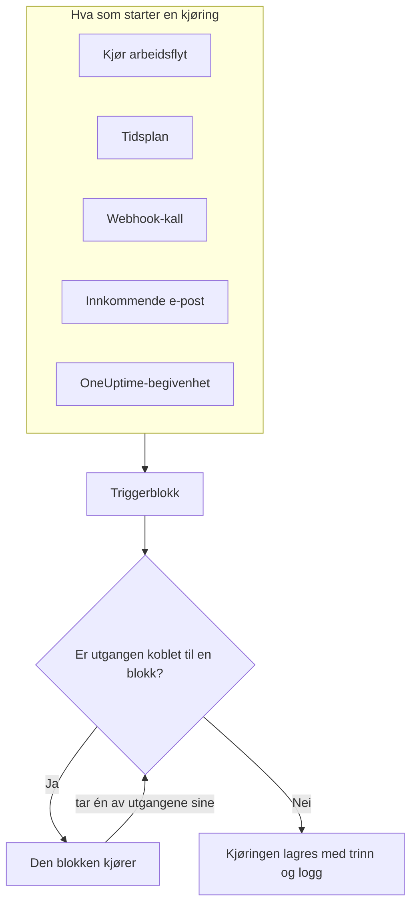
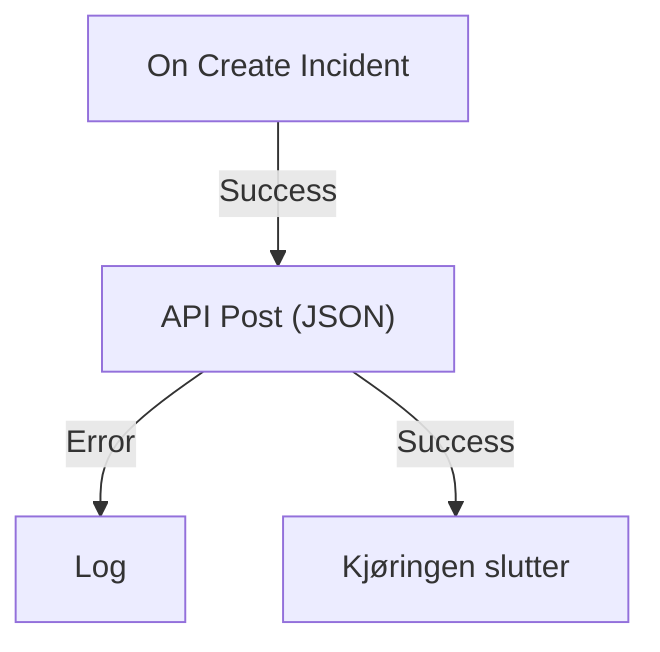

# Oversikt over arbeidsflyter

Arbeidsflyter automatiserer arbeid i OneUptime uten kode. Du setter blokker på et lerret, kobler dem sammen, og arbeidsflyten kjører av seg selv hver gang triggeren utløses: en hendelse opprettes, en tidsplan forfaller, et annet verktøy kaller en URL, eller det kommer en e-post. Bruk dem til å koble OneUptime til resten av stakken din og til å ta seg av den rutinemessige oppfølgingen mens du jobber med selve problemet.

:::cards
- [Opprette en arbeidsflyt](/docs/workflows/authoring): Opprett en arbeidsflyt, og legg deretter til, koble sammen og sett opp blokkene på lerretet.
- [Triggere](/docs/workflows/triggers): Start en arbeidsflyt manuelt, etter en tidsplan, fra en webhook, en e-post eller en OneUptime-begivenhet.
- [Komponenter](/docs/workflows/components): Alle blokkene du kan legge til, fra API-kall til OneUptime-poster.
- [Kjøringer](/docs/workflows/runs-and-logs): Se hva hver kjøring gjorde, trinn for trinn.
:::

## Slik fungerer en arbeidsflyt

Hver arbeidsflyt har tre deler:

1. **En trigger** — det som starter arbeidsflyten: en manuell kjøring, en tidsplan, et webhook-kall, en innkommende e-post eller en begivenhet i OneUptime, som en ny hendelse. Hver arbeidsflyt har nøyaktig én.
2. **Komponenter** — det arbeidsflyten gjør: sende en melding, kalle et API, sjekke en betingelse, opprette eller oppdatere en OneUptime-post.
3. **Koblinger** — linjene du trekker fra én blokk til den neste. De avgjør hva som kjører etter hva.

Når triggeren utløses, starter OneUptime en **kjøring**. Hver blokk avslutter med å ta én av utgangene sine, som **Success** eller **Error**, **Yes** eller **No**, og bare blokkene som er koblet til den utgangen, kjører etterpå. Er ingen blokk koblet til utgangen en blokk tok, slutter den veien der. Kjøringen lagres med status, veien den tok, og det hver blokk mottok og returnerte.



Du bygger alt dette visuelt på et lerret. De fleste arbeidsflyter trenger ingen kode i det hele tatt; når én gjør det, kjører en **Run Custom JavaScript**-blokk noen linjer JavaScript.

## Hva du kan bruke arbeidsflyter til

- **Koble OneUptime til de andre verktøyene dine** — post i Slack, Microsoft Teams, Discord, Telegram eller IRC, opprett Jira-saker, eller send en forespørsel til et hvilket som helst API i stakken din.
- **Reager på det som skjer i OneUptime** — når en hendelse opprettes, gi beskjed i riktig kanal og åpne en sak automatisk.
- **Kjør jobber etter en tidsplan** — hvert femte minutt, hver natt, hver mandag morgen.
- **Ta imot data utenfra** — la andre systemer starte en arbeidsflyt ved å kalle URL-en dens eller sende e-post til adressen dens.
- **Gjenbruk felles automatisering** — bygg den én gang, og start den fra en hvilken som helst annen arbeidsflyt med en **Execute Workflow**-blokk.

## Sentrale begreper

| Begrep              | Hva det betyr                                                                                                  |
| ------------------- | -------------------------------------------------------------------------------------------------------------- |
| **Arbeidsflyt**     | Hele automatiseringen: et navn, et lerret med blokker og en bryter for å slå den på eller av.                  |
| **Trigger**         | Den første blokken. Den avgjør når arbeidsflyten kjører. Hver arbeidsflyt har nøyaktig én.                    |
| **Komponent**       | Enhver annen blokk: den sender en melding, gjør en forespørsel, sjekker en betingelse eller endrer en post.    |
| **Utgang**          | Et punkt nederst på en blokk, som **Success** eller **Error**. Linjer derfra fører til de neste blokkene.       |
| **Kjøring**         | Én utførelse av arbeidsflyten, lagret med status, tidsstempler og det hver blokk gjorde.                       |
| **Global variabel** | En verdi, som en API-nøkkel, som du lagrer én gang og bruker i alle arbeidsflytene i prosjektet.               |

## Før du begynner

- **En plan som inkluderer arbeidsflyter.** I OneUptime Cloud krever arbeidsflyter planen **Growth** eller høyere, og hver plan tillater et antall kjøringer hver 30. dag — se [Plangrenser](/docs/workflows/configuration#plangrenser). Selvhostede installasjoner uten fakturering har ingen av grensene.
- **Tillatelse til å bygge.** Å opprette og endre arbeidsflyter krever **Workflow Admin**, **Project Admin** eller **Project Owner**, eller en egendefinert rolle med de tilsvarende tillatelsene. En **Workflow Member** kan åpne arbeidsflyter og kjøre dem manuelt, men ikke endre dem. Se [Tillatelser](/docs/workflows/configuration#tillatelser).

## Hvor du finner arbeidsflyter i OneUptime

Åpne **Produkter** i topplinjen, og velg **Arbeidsflyter** under **Dashbord og automatisering**. Menyen der inneholder:

- **Arbeidsflyter** — listen over arbeidsflytene dine. Opprett en ny, eller åpne en eksisterende.
- **Globale variabler** — verdier som alle arbeidsflytene dine deler.
- **Logger → Kjøringer** — kjøringshistorikken for alle arbeidsflytene i prosjektet ditt.
- **Innstillinger → Etikettregler** og **Eierregler** — sett etiketter på nye arbeidsflyter og tildel eierne deres automatisk.
- **Avansert → Arkivert** — arbeidsflyter du har arkivert. De kjører aldri og er utelatt fra listen; fjern dem fra arkivet herfra. Se [Arkivere en arbeidsflyt](/docs/workflows/configuration#å-arkivere-en-arbeidsflyt).
- **Utvikler** — hvordan du administrerer arbeidsflyter med Terraform, API-et eller en AI-assistent.

Åpne én arbeidsflyt, så inneholder dens egen meny:

- **Oversikt** — navn, beskrivelse, etiketter og bryteren **Aktivert**.
- **Bygger** — lerretet der du designer arbeidsflyten, med bryteren **Aktivert** øverst.
- **Arbeidsflytvariabler** — verdier som bare gjelder denne ene arbeidsflyten.
- **Logger → Kjøringer** — hver kjøring av denne arbeidsflyten, med detaljer.
- **Eiere** — personene og teamene som er ansvarlige for arbeidsflyten.
- **Utvikler** — hvordan du administrerer denne arbeidsflyten med Terraform, API-et eller en AI-assistent.
- **Innstillinger** — dupliser, eksporter og arkiver.

**Innstillinger** ligger i menyens del **Avansert** sammen med **Revisjonslogger** og **Slett arbeidsflyt**. **Avansert** og **Utvikler** starter sammenfoldet, i denne menyen og i alle andre, slik at sidene du bruker hver dag, kommer først. Klikk på navnet til en del for å vise sidene i den. Den folder seg ut av seg selv når du er på en av dem.

## Bygg din første arbeidsflyt

Hver arbeidsflyt blir til på samme måte:

:::steps
1. **Opprett** — velg et utgangspunkt, og gi deretter arbeidsflyten et navn. Se [Opprette en arbeidsflyt](/docs/workflows/authoring).
2. **Velg en trigger** — manuell, planlagt, webhook, innkommende e-post eller en begivenhet fra OneUptime. Se [Triggere](/docs/workflows/triggers).
3. **Legg til komponenter** — sett handlinger på lerretet, og koble dem sammen. Se [Komponenter](/docs/workflows/components).
4. **Slå den på** — slå på **Aktivert** øverst i **Bygger**. En deaktivert arbeidsflyt kan ikke kjøre i det hele tatt, heller ikke manuelt.
5. **Test** — klikk på **Kjør arbeidsflyt** i **Bygger**, og følg kjøringen mens den skjer.
:::

Eksempelet nedenfor følger disse trinnene for en ekte arbeidsflyt.

## Eksempel: send nye hendelser til en webhook

Denne arbeidsflyten sender et JSON-sammendrag av hver ny hendelse til en URL du velger — et saksbehandlingssystem, et datavarehus, alt som tar imot en webhook — og skriver årsaken i kjøringens logg når forespørselen mislykkes.



> [!TIP]
> Malen **Forward new incidents to another system** bygger den samme arbeidsflyten for deg. Du finner den under **Hendelser** når du oppretter en arbeidsflyt.

:::steps
### Opprett arbeidsflyten

Åpne **Arbeidsflyter**, og klikk på **Opprett arbeidsflyt**. Klikk på **Start fra bunnen**, gi arbeidsflyten navnet `Send new incidents to a webhook`, og klikk på **Opprett arbeidsflyt**.

Den nye arbeidsflyten åpnes i **Bygger**, slått av.

### Legg til triggeren

Klikk på den stiplede blokken **Choose what starts this workflow**, og klikk deretter på **On Create Incident** under **Popular** i panelet **Add Trigger**.

Triggeren tar plassen til den stiplede blokken. ID-en på den, `incident-on-create-1`, er det senere blokker viser til den med.

### Velg feltene til hendelsen

Klikk på triggeren. Under **Select Fields** krysser du av for feltene forespørselen skal ha med, som tittelen og beskrivelsen, og klikker på **Lagre**.

Triggeren sender den nye hendelsen videre med disse feltene. Et felt du ikke velger, kommer tomt frem.

### Legg til API-blokken

Klikk på **Legg til komponent**, og klikk deretter på **API Post (JSON)** under **Popular**. Dra fra triggerens punkt **Success** ned til det øverste punktet på den nye blokken.

### Fyll ut forespørselen

Klikk på API-blokken, der det står **Click to set up**. Skriv endepunktet ditt i **URL**. Skriv JSON-en som skal sendes, i **Request Body**, bruk **{ }** til å sette inn feltene til hendelsen der du trenger dem, og klikk på **Lagre**.

```json title="Request Body"
{
  "id": "{{local.components.incident-on-create-1.returnValues.model._id}}",
  "title": "{{local.components.incident-on-create-1.returnValues.model.title}}",
  "description": "{{local.components.incident-on-create-1.returnValues.model.description}}"
}
```

Hver `{{…}}`-referanse erstattes med verdien fra hendelsen når arbeidsflyten kjører. Se [Variabler](/docs/workflows/variables) for syntaksen.

### Fang opp feil

Klikk på **Legg til komponent**, og klikk deretter på **Logg**. Koble API-blokkens punkt **Error** til den, og sett Log-blokkens **Value** til `Could not send the incident: {{local.components.api-post-1.returnValues.error}}`.

En forespørsel som mislykkes — en URL som ikke kan nås, eller et svar som ikke er 2xx — tar nå denne veien, og kjøringens logg sier hvorfor.

### Slå den på

Slå på **Aktivert** øverst i **Bygger**.

### Test den

Klikk på **Kjør arbeidsflyt**, skriv inn **Hendelse-ID** for en hendelse i dette prosjektet, klikk på **Run Workflow Manually**, og bekreft med **Run**.

Et panel **Arbeidsflytkjøring** åpnes og følger kjøringen. Åpne trinnet **API Post (JSON)** for å se bodyen det sendte, og svaret det fikk.
:::

Fra nå av starter hver ny hendelse i prosjektet en kjøring. Du finner dem alle under arbeidsflytens [Kjøringer](/docs/workflows/runs-and-logs).

> [!NOTE]
> Forespørselen sendes fra OneUptime. I OneUptime Cloud må URL-en kunne nås fra internett. En selvhostet installasjon avviser private nettverksadresser med mindre en administrator tillater dem — se [Utgående nettverkstilgang](/docs/workflows/configuration#utgående-nettverkstilgang).

## Slik passer arbeidsflyter inn i resten av OneUptime

- **Monitorer** oppdager problemet. **Hendelser** og **varsler** registrerer det. **Arbeidsflyter** reagerer på det.
- **Runbooks** er beredskapsprosedyrer teamet ditt går gjennom ved en hendelse, et varsel eller et vedlikehold: manuelle trinn, godkjenninger og skript, med mennesker involvert. Arbeidsflyter kjører uten tilsyn. Bruk en [runbook](/docs/runbooks/index) når en person må ta beslutninger underveis, og en arbeidsflyt når hvert trinn er automatisk.
- **Arbeidsområdetilkoblinger** kobler et prosjekt til Slack og Microsoft Teams for hendelseskanaler og varslinger. Arbeidsflytenes Slack- og Microsoft Teams-blokker bruker dem ikke: hver blokk poster via sin egen innkommende webhook-URL.

## Neste trinn

:::cards
- [Opprette en arbeidsflyt](/docs/workflows/authoring): Jobb med lerretet, blokkene og innstillingene deres.
- [Variabler](/docs/workflows/variables): Send data mellom blokker, og hold hemmeligheter utenfor arbeidsflytene dine.
- [Konfigurasjon og sikkerhet](/docs/workflows/configuration): Tillatelser, grenser og sikkerhet før du går live.
:::
