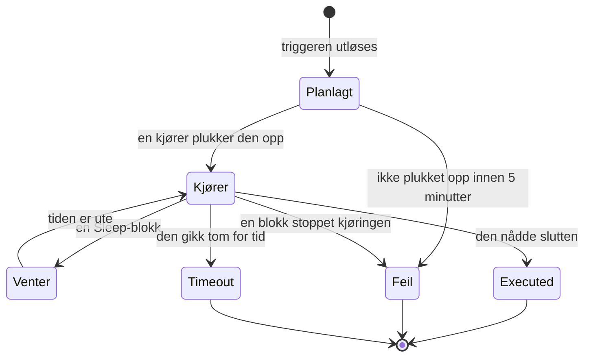

# Arbeidsflyt-kjøringer

Hver gang en arbeidsflyt kjører, lagrer OneUptime en oversikt over hva som skjedde — når den kjørte, om den lyktes, og hva hver blokk mottok og returnerte. Den oversikten kalles en **kjøring**. Med kjøringer bekrefter du at en arbeidsflyt fungerte, finner feil i en som ikke gjorde det, og ser tilbake på tidligere aktivitet.

:::cards
- [Status for en kjøring](#status-for-en-kjøring): Hva Planlagt, Venter, Executed og de andre statusene betyr.
- [Les en kjøring](#les-en-kjøring): Følg veien en kjøring tok, blokk for blokk.
- [Feilsøking](#feilsøking): En arbeidsflyt som ikke kjørte, en blokk som aldri kjørte, en verdi som kom tom frem.
:::

## Hvor du finner dem

| Side                                                 | Hva du ser                                                                                         |
| ---------------------------------------------------- | -------------------------------------------------------------------------------------------------- |
| **Arbeidsflyter → Logger → Kjøringer**               | Hver kjøring av hver arbeidsflyt i prosjektet. Filtrer på arbeidsflytnavn, status og tid.          |
| **Arbeidsflyt → Logger → Kjøringer**                 | Bare kjøringene til denne ene arbeidsflyten. Her finnes et filter **Kjøre-ID** i stedet for et arbeidsflytfilter. |
| **Én enkelt kjøring**                                | Åpnes med knappen **Vis logger** på raden til en kjøring — selve radene er ikke klikkbare.         |

Starter du en kjøring fra **Bygger**, åpnes den samme visningen **Arbeidsflytkjøring**, som allerede følger kjøringen, slik at du kan se den skje i stedet for å måtte lete etter den etterpå.

## Status for en kjøring

| Status                              | Hva den betyr                                                                                                                                                                                                                                                         |
| ----------------------------------- | --------------------------------------------------------------------------------------------------------------------------------------------------------------------------------------------------------------------------------------------------------------------- |
| **Planlagt**                        | Triggeren ble utløst, og kjøringen står i kø for en kjører. Vanligvis en brøkdel av et sekund. En kjøring som fortsatt er planlagt etter 5 minutter, mislykkes: ingenting plukket den opp.                                                                          |
| **Kjører**                          | Arbeidsflyten er i gang.                                                                                                                                                                                                                                              |
| **Venter**                          | Kjøringen står parkert ved en **Sleep**-blokk og fortsetter av seg selv. Den holder ingen worker mens den venter.                                                                                                                                                    |
| **Executed**                        | Kjøringen nådde slutten uten å mislykkes. Det er suksesstatusen: pillen sier **Executed**, ikke «Vellykket».                                                                                                                                                          |
| **Feil**                            | En blokk stoppet kjøringen. Brukes også når en kjøring i kø aldri blir plukket opp, når gjenopptakelsen av en sovende kjøring går tapt, når et tidsplanuttrykk ikke kan løses opp, og når arbeidsflyten ble slått av eller arkivert mens kjøringen ventet ved en **Sleep**-blokk. |
| **Timeout**                         | Kjøringen tok lengre tid enn tillatt: 2 minutter som standard. Se [Hvor lenge en kjøring kan vare](/docs/workflows/configuration#hvor-lenge-en-kjøring-kan-vare).                                                                                                          |
| **Execution Exceeded Current Plan** | Prosjektet har brukt opp arbeidsflytkjøringene sine for de siste 30 dagene, eller abonnementet er ubetalt. Kjøringen registreres, men utføres ikke. Bare OneUptime Cloud.                                                                                           |

En blokk som tar utgangen **Error** — en API-blokk som fikk en 4xx, for eksempel — får ikke kjøringen til å mislykkes. Blokkene som er koblet til **Error**, kjører, og kjøringen slutter likevel som **Executed**. Selve trinnet tegnes i rødt, slik at du finner det.

## Les en kjøring

Klikk på **Vis logger** på en kjøring for å åpne den. Visningen **Arbeidsflytkjøring** har to faner, **Trinn** og **Full Log**.

### Fanen Trinn

Veien kjøringen tok, med ett nummerert kort per blokk, i den rekkefølgen de kjørte. Uten at du åpner noe, viser hvert kort:

- Blokkens tittel og ID, om den er merket **Vellykket** eller **Mislyktes**, og hvor lang tid den tok.
- Hvilken utgang den tok, med navnet lerretet gir den, og hvor den førte: nummeret og navnet på neste trinn, eller en merknad om at ingenting er koblet til den, så kjøringen eller den grenen sluttet der. Et trinn den førte til, men som aldri kjørte, sier **(did not run)**. Utgangen Error tegnes i rødt; Yes og No er bare veien kjøringen gikk. Hold musen over navnet på utgangen for å se hva den betyr.
- Feilen til trinnet, hvis det mislyktes, og eventuelle advarsler om det — for eksempel en `{{…}}`-referanse som ble oppløst til ingenting.

Åpne et kort for å se to blokker med detaljer:

| Blokk        | Hva den viser                                                                                                                                                                                                   |
| ------------ | --------------------------------------------------------------------------------------------------------------------------------------------------------------------------------------------------------------- |
| **Received** | Innstillingene blokken fikk, etter navn og i den rekkefølgen innstillingslisten har dem, etter at alle variabler ble fylt ut. En innstilling som viser til et annet trinn eller en variabel, viser referansen ved siden av verdien den ble til, og **Did not resolve** når den ble til ingenting. |
| **Returned** | Det den produserte, med ID-en til hver verdi (den siste delen av en `returnValues`-referanse). Lister og objekter vises med innrykk.                                                                            |

Mislykkede trinn, trinn med en advarsel og det eneste trinnet i en kjøring starter åpne. Telleren på fanen **Trinn** blir rød når noe mislyktes, og oransje når et trinn har en advarsel.

Noen kjøringer leses annerledes:

- **En test av ett trinn.** En kjøring som ble startet med **Run just this step**, sier **Only this step ran** øverst. Trinnene før det kjørte ikke, så verdier det leser fra dem, mangler (forvent en advarsel **Did not resolve** for dem), og trinnene etter det sier **(not run in this test)**. Bruk **Kjør arbeidsflyt** for å prøve hele veien.
- **En kjøring som stoppet mellom trinn.** Stoppet kjøringen av en grunn som ikke noe trinn forklarer — den gikk tom for tid mellom to trinn, eller den mislyktes før det første trinnet —, slutter veien med **The run stopped here** og årsaken.
- **En sovende kjøring.** En kjøring som venter ved en **Sleep**-blokk, slutter med **Sleeping** og tidspunktet den fortsetter av seg selv; trinnene etter Sleep sier **(not run yet)**.

ID-en under tittelen til hvert trinn er nøyaktig det som skal stå i en `{{local.components.<id>.returnValues.…}}`-referanse, noe som gjør dette til den raskeste måten å få en referanse riktig på.

Verdiene som vises, er det blokken mottok etter at variablene ble fylt ut, og før blokken gjorde noe med dem, med to unntak: hemmeligheter og felt som blokken merker som sensitive, skjules, og en verdi på mer enn 4000 tegn kuttes med "… (truncated)". En kjøring beholder de siste 100 trinnene sine; en lang eller ofte gjenopptatt kjøring viser en oransje merknad der de tidligere ble droppet. Kjøringer som ble registrert før navnene på utgangene ble lagret, viser utgangen med ID-en, uten hvor den førte.

### Fanen Full Log

Den rå loggen linje for linje, slik kjøreren skrev den, inkludert alt blokkene logget selv, som verdien til en **Log**-blokk eller et skripts `console.log`. Bruk den når fanen Trinn ikke forklarer feilen.

## Kopier og last ned en kjøring

Øverst i visningen **Arbeidsflytkjøring**, ved siden av lukkeknappen, legger **Kopier logg** hele **Full Log** på utklippstavlen, klar til å limes inn i en chat eller en sak. **Last ned** lagrer kjøringen som en fil:

| Nedlasting                              | Dette får du                                                                                                                                                                                                                           |
| --------------------------------------- | -------------------------------------------------------------------------------------------------------------------------------------------------------------------------------------------------------------------------------------- |
| **Last ned logg**                       | En `.txt`-fil med hele loggen nøyaktig slik kjøreren skrev den, uansett lengde, under en kort overskrift: navnet og ID-en til arbeidsflyten, ID-en til kjøringen, statusen og når den ble planlagt, startet og fullført.               |
| **Last ned kjøring som JSON**           | En `.json`-fil med de samme opplysningene som data, trinnene fanen **Trinn** viser (hva hvert trinn mottok og returnerte, og hvilken utgang det tok), og loggen som en liste med linjer. Trinnene har samme form som API-et returnerer `stepTrace` for en kjøring i, og som i fanen **Trinn** er det de siste 100 i kjøringen. Loggen er alltid fullstendig. |

De samme to nedlastingene finnes i menyen **⋯** for hver kjøring i begge listene over kjøringer, slik at du kan lagre en kjøring uten å åpne den. En kjøring du startet fra **Bygger**, kan kopieres eller lastes ned mens den fortsatt pågår; du får det den har logget så langt.

Filene får navn etter arbeidsflyten, kjøringen og når den startet, i UTC, slik at en mappe med dem sorteres etter arbeidsflyt og deretter tid: `nightly-sync-run-<run id>-2026-09-30T10-00-01.txt`.

En nedlasting inneholder ingenting du ikke allerede kunne lese i kjøringen. Hemmeligheter og felt som en blokk merker som sensitive, skjules når kjøringen registreres, så de er skjult i filen også, og alle som kan åpne en kjøring, kan laste den ned.

## Feilsøking

:::details Arbeidsflyten min kjørte ikke
1. Sørg for at arbeidsflyten er **Aktivert**: bryteren sitter øverst i **Bygger**, som sier det over lerretet når arbeidsflyten er slått av. Nye arbeidsflyter starter deaktivert, og en deaktivert arbeidsflyt avviser alle kjøringer — også manuelle. Et webhook-kall til den får HTTP 400 med en melding om hvordan du slår den på.
2. For en OneUptime-begivenhetstrigger bekrefter du at begivenheten faktisk skjedde: åpne posten, og sjekk historikken. En **On Update**-trigger med **Listen on** utløses bare når ett av de feltene endret seg.
3. For en webhook-trigger bekrefter du at det andre systemet sender til riktig URL. De fleste verktøy logger når de sender en webhook — sjekk der.
4. For en tidsplantrigger bekrefter du at cron-uttrykket stemmer med tidspunktet du forventer. Tidsplaner kjører i UTC.

Vises kjøringen, med statusen **Execution Exceeded Current Plan**, har prosjektet brukt alle arbeidsflytkjøringene sine for de siste 30 dagene, eller abonnementet er ubetalt. Loggen til kjøringen nevner antallet og grensen i planen din. Dette gjelder bare OneUptime Cloud.
:::

:::details En senere blokk kjørte aldri
En blokk som ikke kjører, er vanligvis et koblingsproblem. Åpne **Bygger**, og sjekk:

- Er utgangen til den tidligere blokken koblet til inngangen til denne blokken?
- Tok den tidligere blokken en annen utgang enn du forventet — **Error** i stedet for **Success**, eller **No** i stedet for **Yes**? Fanen **Trinn** sier hvilken utgang den tok, og hvor den førte, eller at ingenting er koblet til den.
:::

:::details En verdi kom tom frem, eller som {{…}}-tekst
Åpne kjøringen, og se på trinnet. En referanse som ikke ble oppløst, fremheves på selve trinnet som en advarsel, og innstillingen dens i blokken **Received** er merket **Did not resolve**.

- Ser du den bokstavelige teksten `{{local.components.…}}`, ble ikke referansen oppløst. Vanligvis er det en skrivefeil i komponent-ID-en eller ID-en til returverdien — husk at det er blokkens **Identifier**, ikke navnet som står på den. Sjekk også stavemåten til selve `local.components`: `{{local.componets.api-get-1.returnValues.response-body}}` sendes som bokstavelig tekst, og kjøringen melder likevel **Executed**. Var kjøringen en test med **Run just this step**, kjørte ikke den tidligere blokken i det hele tatt — kjør hele arbeidsflyten i stedet.
- Ser du **Empty text**, kjørte den tidligere blokken, men produserte ikke det feltet.

Den samme advarselen står i fanen **Full Log** som en linje som begynner med `Warning:`.
:::

:::details Det virker når jeg kjører den manuelt, men ikke fra triggeren
Åpne **Bygger**, klikk på **Kjør arbeidsflyt**, og fyll ut feltene til triggeren med verdier som ligner det den ekte triggeren sender. Sammenlign deretter **Received**-verdiene i den kjøringen med verdiene i den ekte kjøringen, side om side. Forskjellen ligger vanligvis i navnet eller typen til ett enkelt felt.
:::

## Å kjøre en arbeidsflyt på nytt

Det finnes ingen knapp for å «prøve denne kjøringen på nytt». Gamle kjøringer kjøres aldri på nytt automatisk, fordi bivirkningene deres — Slack-meldinger, API-kall, saker — kanskje ikke er trygge å gjenta. For å gjøre arbeidet på nytt retter du arbeidsflyten og lar neste ekte trigger starte den, eller du åpner **Bygger** og klikker på **Kjør arbeidsflyt** med de samme verdiene.

## Hvor lenge tas kjøringer vare på?

I OneUptime Cloud tas kjøringer vare på i **30 dager** og slettes deretter — derfor sier begge listene over kjøringer at de dekker de siste 30 dagene. Selvhostede installasjoner tar vare på kjøringer til du sletter dem; kjører en arbeidsflyt svært ofte og roter til historikken din, slår du den av eller sletter den.

Kjøringer som ble registrert før sporing av trinn kom, har ikke noe innhold i **Trinn** og viser bare **Full Log**.

## Neste trinn

:::cards
- [Konfigurasjon og sikkerhet](/docs/workflows/configuration): Tidsgrenser, plangrenser og hva som skjules i loggene.
- [Variabler](/docs/workflows/variables): Referansesyntaksen blokkene dine bruker.
- [Komponenter](/docs/workflows/components): Hva hver blokk returnerer, og når den tar hver utgang.
:::
