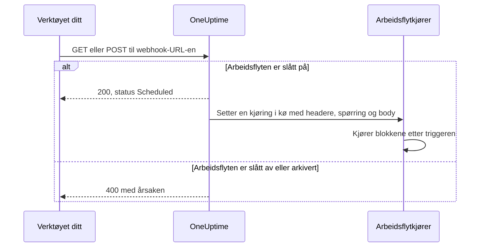
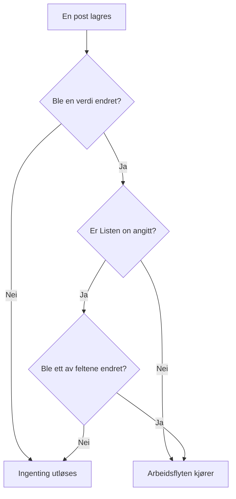

# Arbeidsflyt-triggere

En trigger er den første blokken i en arbeidsflyt — den avgjør når arbeidsflyten kjører. Hver arbeidsflyt har nøyaktig én trigger. Du velger mellom fem typer.

:::cards
- [Manuell](#manual): Start arbeidsflyten fra Bygger eller fra en annen arbeidsflyt.
- [Tidsplan](#schedule): Kjør den etter en gjentakende tidsplan, skrevet som et cron-uttrykk.
- [Webhook](#webhook): La et annet system starte den ved å kalle en URL.
- [Innkommende e-post](#incoming-email): Start den med hver e-post som sendes til dens egen adresse.
- [OneUptime-begivenhetstriggere](#oneuptime-begivenhetstriggere): Reager når en post opprettes, oppdateres eller slettes.
:::

For å legge til triggeren klikker du på den stiplede blokken **Choose what starts this workflow** på lerretet til en ny arbeidsflyt. For å endre den sletter du triggerblokken, og den stiplede blokken kommer tilbake. Se [Opprette en arbeidsflyt](/docs/workflows/authoring#legg-til-blokker).

## Hvilken trigger bør jeg bruke?

| Hvis du vil …                                  | Velg                        |
| ---------------------------------------------- | --------------------------- |
| Klikke på en knapp for å kjøre arbeidsflyten   | **Manual**                  |
| Kjøre etter en gjentakende tidsplan            | **Tidsplan**                |
| La et annet system sende inn data              | **Webhook**                 |
| Starte ut fra en e-post                        | **Incoming Email**          |
| Reagere på noe i OneUptime                     | **OneUptime-begivenhet**    |

En arbeidsflyt kan bare ha én trigger. Trenger du to måter å starte den samme automatiseringen på, bygger du den felles logikken i en arbeidsflyt med en **Manual**-trigger og starter den fra to tynne «innpaknings»-arbeidsflyter med en **Execute Workflow**-blokk.

## Manual

Kjør arbeidsflyten når du vil: klikk på **Kjør arbeidsflyt** på siden **Bygger**, fyll ut triggerens **JSON**, klikk på **Run Workflow Manually**, og bekreft med **Run**. En annen arbeidsflyt kan også starte den med en **Execute Workflow**-blokk.

Bra for: automatisering med ett klikk som du vil ha en knapp for, som «roter denne nøkkelen» eller «send et testvarsel», og logikk du deler mellom arbeidsflyter.

**Returns**: **JSON** — det kjøringen ble startet med.

- Fra **Kjør arbeidsflyt** er det JSON-en du skrev, som tekst. For å lese et felt i den sender du den først gjennom en **Text to JSON**-blokk.
- Fra en **Execute Workflow**-blokk er hver nøkkel i blokkens **Arguments** en verdi for seg. Med `{"customerId": "42"}` leser en senere blokk `{{local.components.manual-1.returnValues.customerId}}`, der `manual-1` er ID-en til Manual-triggeren.

## Schedule

Kjør arbeidsflyten etter en gjentakende tidsplan. Angi hvor ofte i **Schedule at**: velg en av **Common schedules**, skriv et **Custom cron**-uttrykk, eller velg en **Variabel** som inneholder et. Under feltet beskrives tidsplanen med ord, sammen med **Next runs**.

Bra for: opprydding om natten, synkronisering hver time, ukentlige rapporter.

Tidene er i UTC, så regn om fra din egen tidssone når du velger timen. De fem delene av et cron-uttrykk er minuttet, timen, dagen i måneden, måneden og ukedagen:

| Uttrykk       | Kjører                                 |
| ------------- | -------------------------------------- |
| `*/5 * * * *` | Hvert 5. minutt.                       |
| `0 * * * *`   | Hver hele time.                        |
| `0 0 * * *`   | Hver dag ved midnatt UTC.              |
| `0 9 * * 1-5` | Hver ukedag kl. 9:00 UTC.              |
| `0 9 * * 1`   | Hver mandag kl. 9:00 UTC.              |

Ingenting planlegges mens arbeidsflyten er slått av. En tidsplan med **Variabel** leser en arbeidsflytvariabel eller en global variabel, som `{{local.variables.schedule}}`. Blir den ikke til et gyldig cron-uttrykk, planlegges ikke arbeidsflyten, og en mislykket kjøring i listen over kjøringer sier hvorfor.

For å teste arbeidsflyten uten å vente på tidsplanen klikker du på **Kjør arbeidsflyt** i **Bygger**: det starter en kjøring med en gang.

## Webhook

OneUptime gir arbeidsflyten sin egen URL. Alt som kaller URL-en, starter arbeidsflyten og sender med headerne, spørringsparameterne og bodyen i forespørselen.

Bra for: å ta imot data i OneUptime fra et annet verktøy — CI/CD-tilbakekall, varsler fra annen overvåking, registreringer i CRM-et ditt.

For å få URL-en klikker du på Webhook-triggeren på lerretet. URL-en står øverst i innstillingene, med en knapp **Kopier URL**, metodene den godtar, og en `curl`-kommando du kan lime inn i en terminal for å prøve den:

```bash
curl -X POST "https://oneuptime.example.com/workflow/trigger/<secret key>" \
  -H "Content-Type: application/json" \
  -d '{"message": "Hello"}'
```

URL-en godtar både `GET` og `POST`. Den som kaller, får en rask kvittering, `{"status": "Scheduled"}` — selve arbeidsflyten kjører i bakgrunnen, så den som kaller, ser aldri hva den gjør. Et kall til en arbeidsflyt som er slått av eller arkivert, avvises med HTTP 400 og årsaken.



**Returns**:

| Verdi                    | Hva den inneholder                                                                                                     |
| ------------------------ | ---------------------------------------------------------------------------------------------------------------------- |
| **Request Headers**      | Hver header i forespørselen, etter navn med små bokstaver, som `content-type`.                                         |
| **Request Query Params** | Spørringsparameterne i URL-en, etter navn.                                                                             |
| **Request Body**         | Bodyen den som kalte, sendte. En JSON-body, sendt med `Content-Type: application/json`, kan leses felt for felt.       |

Les ett enkelt felt ved å legge navnet til referansen, som i `{{local.components.webhook-1.returnValues.request-body.message}}`.

Når en forespørsel har kommet, vet verdivelgeren i hver blokk etter triggeren hva som var i den: den viser feltene i bodyen, headerne og spørringsparameterne, hvert med innholdet sitt, slik at du kan velge `incident.title` i stedet for å skrive en sti. Inntil da sier den at ingen forespørsel har kommet, og tilbyr **Copy test request**, en `curl`-kommando til URL-en; feltene dukker opp så snart kjøringen forespørselen starter, er ferdig. Se [Bruk verdier fra tidligere blokker](/docs/workflows/authoring#bruk-verdier-fra-tidligere-blokker).

For å teste arbeidsflyten uten det andre verktøyet klikker du på **Kjør arbeidsflyt** i **Bygger** og skriver inn headere, spørringsparametere og en body.

### Hold URL-en privat

Den siste delen av URL-en er arbeidsflytens hemmelige nøkkel, og alle som har URL-en, kan starte arbeidsflyten. Derfor er nøkkelen skjult til du klikker på **Vis**, og **Kopier URL** kopierer hele URL-en uten å vise den.

Lekker URL-en, klikker du på **Tilbakestill URL** på samme sted: arbeidsflyten får en ny URL, og den gamle slutter å virke med en gang, så oppdater alt som kaller den. Bare personer som har lov til å redigere arbeidsflyten, kan se eller tilbakestille URL-en — se [Webhook-sikkerhet](/docs/workflows/configuration#webhook-sikkerhet).

> [!WARNING]
> Behandle URL-en som et passord. Alle som har den, kan starte arbeidsflyten din uten å logge inn.

## Incoming Email

OneUptime gir arbeidsflyten sin egen e-postadresse. Hver e-post som sendes til den adressen, starter arbeidsflyten og sender e-posten med: hvem som sendte den, hvem den var til, emnet, teksten og HTML-en, headerne og navnene på eventuelle vedlegg.

Bra for: å handle på e-post fra systemer som ikke kan kalle en webhook — varsler fra eldre overvåkingsverktøy, statusmeldinger fra en leverandør, rapporten en nattlig jobb sender ut.

For å få adressen klikker du på Incoming Email-triggeren på lerretet. Adressen står øverst i innstillingene, med en knapp **Kopier adresse**. Gi den til det som skal starte arbeidsflyten: et verktøy som bare kan sende e-post, varslingsinnstillingene til en leverandør eller en videresendingsregel i din egen postkasse.

Hver e-post starter sin egen kjøring. E-posten når arbeidsflyten uansett om adressen står i Til eller Kopi, er en blindkopi eller nås gjennom en videresendingsregel. En e-post som nevner adressen to ganger, starter én kjøring.

**Returns**:

| Verdi           | Hva den inneholder                                                                                       |
| --------------- | -------------------------------------------------------------------------------------------------------- |
| **From**        | Avsenderens adresse.                                                                                     |
| **To**          | Alle e-posten var adressert til, på én linje, som `ops@example.com, oncall@example.com`.                 |
| **CC**          | Alle e-posten ble sendt som kopi til, på én linje.                                                       |
| **Subject**     | Emnelinjen.                                                                                              |
| **Body**        | Ren tekst-versjonen av e-posten.                                                                         |
| **HTML Body**   | HTML-en i e-posten, når den har noe. Body og HTML Body kuttes hver ved 1 MB.                             |
| **Headers**     | Hver header i e-posten, etter navn med små bokstaver, som `message-id`.                                  |
| **Attachments** | Navn, type og størrelse på hvert vedlegg. Selve filene lagres ikke.                                      |
| **Received At** | Når OneUptime mottok e-posten.                                                                           |

Når en e-post har kommet, vet verdivelgeren i hver blokk etter triggeren hva som var i den: den viser hver header og hvert vedlegg e-posten hadde, med innholdet, slik at du kan velge `headers.message-id` i stedet for å skrive en sti. Inntil da sier den at ingen e-post har nådd adressen ennå. Se [Bruk verdier fra tidligere blokker](/docs/workflows/authoring#bruk-verdier-fra-tidligere-blokker).

For å prøve arbeidsflyten uten å sende en e-post klikker du på **Kjør arbeidsflyt** på siden **Bygger** og fyller ut en avsender, et emne og en body. Verdiene du utelater, kommer tomme frem.

E-post starter bare arbeidsflyten mens den er slått på. E-post til en arbeidsflyt som er slått av, ignoreres, og det samme gjør e-post til en arbeidsflyt der triggeren ikke lenger er Incoming Email.

### Hold adressen privat

Delen av adressen før `@` inneholder arbeidsflytens hemmelige nøkkel, og alle som har adressen, kan starte arbeidsflyten. Derfor er nøkkelen skjult til du klikker på **Vis**, og **Kopier adresse** kopierer hele adressen uten å vise den.

Lekker adressen, klikker du på **Tilbakestill adresse** på samme sted: arbeidsflyten får en ny adresse, og e-post til den gamle ignoreres fra da av, så gi den nye til alt som sender e-post til arbeidsflyten. Bare personer som har lov til å redigere arbeidsflyten, kan se eller tilbakestille adressen — se [Sikkerhet for innkommende e-post](/docs/workflows/configuration#sikkerhet-for-innkommende-e-post).

> [!WARNING]
> Hvem som helst kan sette en hvilken som helst avsender på en e-post, så **From** er ikke noe bevis på hvem som sendte den. Sjekk noe bare den ekte avsenderen vet, før et trinn gjør noe viktig.

> [!NOTE]
> På en selvhostet installasjon mottar OneUptime e-post gjennom en leverandør av innkommende e-post som administratoren din konfigurerer — se [SendGrid Inbound Email](/docs/self-hosted/sendgrid-inbound-email). Inntil da har triggeren ingen adresse, og innstillingene sier det.

## OneUptime-begivenhetstriggere

Nesten alt i OneUptime — monitorer, hendelser, varsler, planlagte vedlikehold, statussider, vaktpolicyer, team — kan starte en arbeidsflyt. Hver tilbyr opptil tre begivenheter:

- **On Create** — utløses når en ny legges til.
- **On Update** — utløses når en endres. Å lagre en post med verdiene den allerede har, som et skjema lagret uten endringer eller en bryter sendt slik den allerede står, er ikke en endring og utløser den ikke.
- **On Delete** — utløses når en slettes.

Slik bygger du «når X skjer i OneUptime, gjør Y» uten å måtte sjekke ting i en løkke.

**On Update** kan begrenses til noen felt med **Listen on**: da utløses den bare når en oppdatering endrer ett av dem, til en hvilken som helst verdi — å slå av en bryter eller tømme et felt teller med.



**On Create** og **On Update** sender posten videre til neste blokk, med feltene du velger i triggerens **Select Fields**. For eksempel sender triggeren **Incident → On Create** den nye hendelsen videre, slik at neste blokk kan lese tittelen, beskrivelsen, alvorlighetsgraden eller et hvilket som helst annet felt du har valgt, som `{{local.components.incident-on-create-1.returnValues.model.title}}`. Et felt du ikke valgte, kommer tomt frem.

**On Delete** sender bare ID-en til den slettede posten videre: posten er borte når arbeidsflyten kjører, så de andre feltene kan ikke leses.

For å teste en begivenhetstrigger uten å vente på begivenheten klikker du på **Kjør arbeidsflyt** i **Bygger** og skriver inn ID-en til en eksisterende post, som en **Hendelse-ID**. Kjøringen leser den posten med feltene du valgte.

### Begivenhetene team bruker mest

| Ressurs                                   | Hva team bruker den til                                                                   |
| ----------------------------------------- | ----------------------------------------------------------------------------------------- |
| **Hendelse**                              | Reagere når en hendelse erklæres, oppdateres (kvittert, løst) eller slettes.               |
| **Varsel**                                | De samme tre begivenhetene, for varsler.                                                  |
| **Overvåking**                            | Reagere når en monitor legges til, redigeres eller fjernes.                               |
| **Planlagt Vedlikehold Hendelse**         | Kunngjøre et vedlikeholdsvindu automatisk når det planlegges.                             |
| **Statusside Abonnent**                   | Ønske velkommen en person som abonnerer på en statusside.                                 |
| **Vaktpolicy**                            | Synkronisere endringer i policyen med et annet vaktsystem.                                |

I panelet **Add Trigger** ligger de under **OneUptime resources**: klikk på ressursen og deretter på triggeren. **Browse all resources** har dem alle, og søkefeltet finner en trigger ut fra noen få ord, som `incident created`.

## Neste trinn

:::cards
- [Komponenter](/docs/workflows/components): Handlingene du legger til etter triggeren.
- [Variabler](/docs/workflows/variables): Les i senere blokker det triggeren sendte med.
- [Kjøringer](/docs/workflows/runs-and-logs): Bekreft at triggeren ble utløst, og se hva den hadde med seg.
:::
