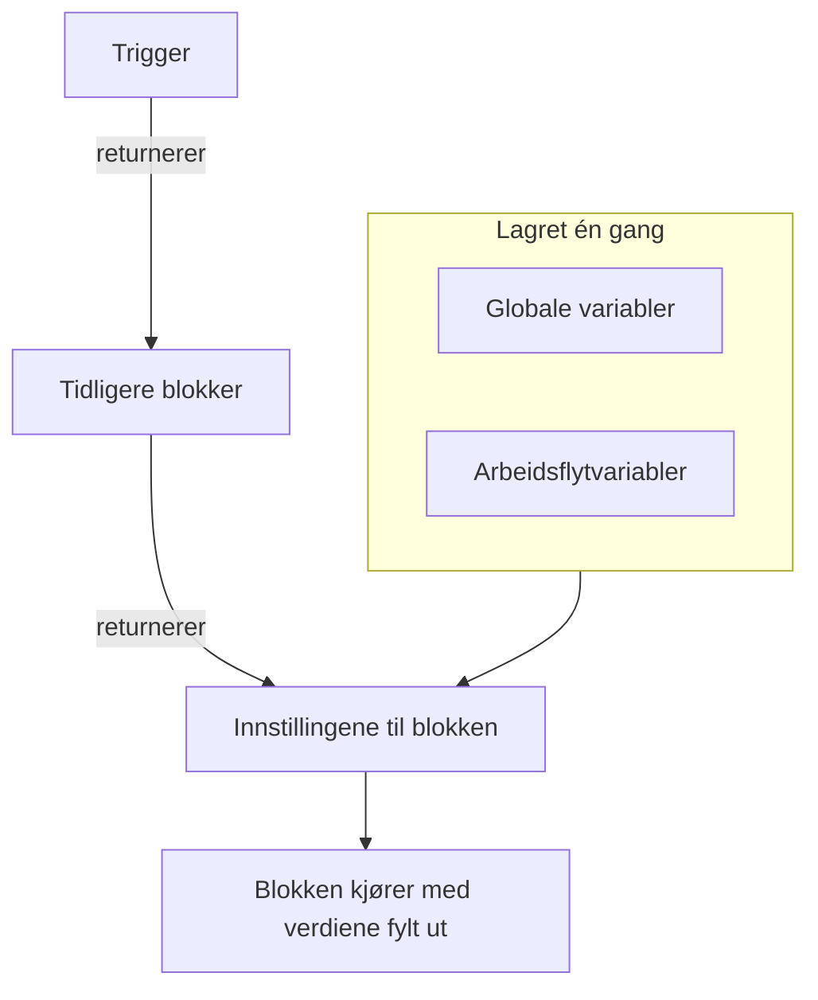
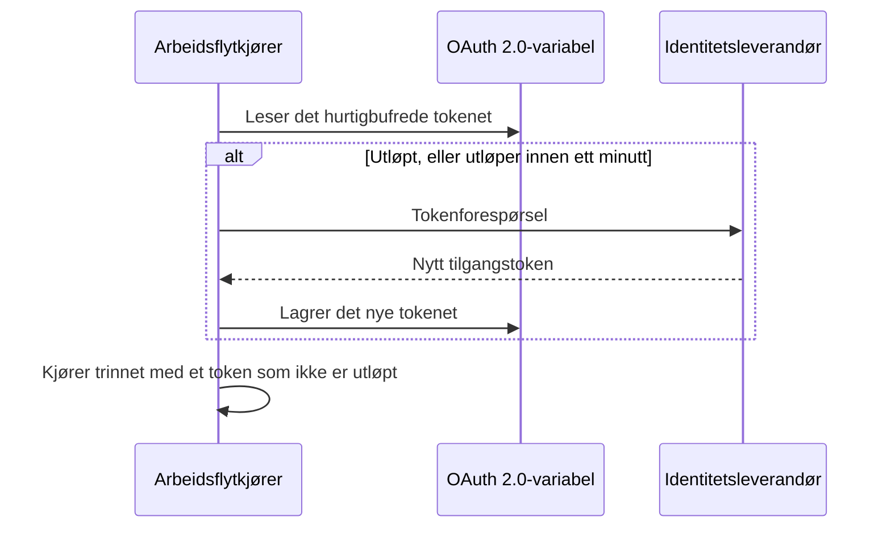

# Arbeidsflyt-variabler

Variabler er måten data beveger seg gjennom en arbeidsflyt på: fra triggeren til den første blokken, fra én blokk til den neste, og fra verdier du lagrer én gang, til hver blokk som trenger dem. En innstilling på en blokk leser en verdi med en referanse i doble krøllparenteser, og kjøreren fyller den ut rett før blokken kjører.

| Verdi                          | Hvor den kommer fra                                                  | Slik leser en blokk den                               |
| ------------------------------ | -------------------------------------------------------------------- | ----------------------------------------------------- |
| **Global variabel**            | Lagret under **Arbeidsflyter → Globale variabler**                   | `{{global.variables.NAME}}`                          |
| **Arbeidsflytvariabel**        | Lagret på siden **Arbeidsflytvariabler** til én arbeidsflyt          | `{{local.variables.NAME}}`                           |
| **Verdien fra en tidligere blokk** | Det triggeren eller en tidligere blokk returnerte i denne kjøringen | `{{local.components.BLOCK_ID.returnValues.VALUE_ID}}` |



Du skriver sjelden en referanse. Klikk på **{ }** i enden av en innstilling, eller skriv `{{` i den, og velg verdien fra en liste. Se [Bruk verdier fra tidligere blokker](/docs/workflows/authoring#bruk-verdier-fra-tidligere-blokker).

## Globale variabler

Verdier for hele prosjektet som du lagrer én gang og gjenbruker i hver arbeidsflyt: API-nøkler, URL-er, kanalnavn — alt du ikke vil kopiere inn i ti forskjellige arbeidsflyter.

:::steps
### Åpne de globale variablene

Gå til **Arbeidsflyter → Globale variabler**, og klikk på **Opprett Workflow Variabel**.

### Gi variabelen et navn

Fyll ut i trinnet **Variabel**:

- **Navn** — det du viser til den med. Minst to tegn, ingen mellomrom, og bare bokstaver, tall, bindestreker og understreker. `UPPER_SNAKE_CASE` er en god vane, fordi det skiller seg ut i blokkene dine.
- **Beskrivelse** — valgfri fritekst som minner deg om hva den er til.

Klikk på **Neste**.

### Gi den en verdi

Fyll ut i trinnet **Verdi**:

- **Innhold** — selve verdien. Det er et felt for lang tekst, så verdier over flere linjer fungerer.
- **Hemmelighet** — når den er slått på, fjernes verdien fra kjøringslogger og trinnspor.

Klikk på **Opprett Workflow Variabel**. For å endre navnet eller beskrivelsen før det klikker du på **Variabel** i listen over trinn ved siden av skjemaet (vises på brede skjermer); det du skrev i begge trinnene, beholdes.
:::

Bruk en global variabel i en hvilken som helst arbeidsflyt med:

```text
{{global.variables.NAME}}
```

Har du for eksempel lagret PagerDuty-nøkkelen din som `PAGERDUTY_KEY`, kan enhver blokk bruke den som `{{global.variables.PAGERDUTY_KEY}}` — editoren lagrer referansen, og arbeidsflytens logging fjerner den oppløste hemmelige verdien.

Listen viser navnet og beskrivelsen til hver variabel. Klikk på **Vis** i en rad for å åpne siden til variabelen. Den viser om variabelen er statisk eller OAuth 2.0, og det er her du gjør alt det andre:

| Knapp                                      | Hva den gjør                                                                                                                                     |
| ------------------------------------------ | ------------------------------------------------------------------------------------------------------------------------------------------------ |
| **Rediger Variabel**                       | Endrer navnet, beskrivelsen og — for en statisk variabel som ennå ikke er hemmelig — hemmelighetsmarkeringen. Når en variabel først er hemmelig, forblir den hemmelig. |
| **Update Content**                         | Erstatter en statisk verdi. Det lagrede innholdet kan ikke leses tilbake, så du skriver den nye verdien i sin helhet.                            |
| **Use in Workflows**                       | Viser den nøyaktige referansen du skal lime inn i blokkene dine, med en kopieringsknapp.                                                         |
| **Slett Workflow Variabel**                | Sletter den etter å ha bedt deg bekrefte. Bekreftelsen nevner variabelen, slik at du kan sjekke at det er den riktige.                            |

For i stedet å opprette en variabel for et **OAuth 2.0-tilgangstoken** åpner du menyen **Mer** (**⋯**) ved siden av **Opprett Workflow Variabel** og velger **Create OAuth 2.0 Variable**. OAuth 2.0-variabler har [sin egen del](#oauth-20-variabler-tokener-som-fornyer-seg-selv) nedenfor. Typen til en variabel kan ikke endres etter at den er lagret.

Du kan også oppdatere en variabel via API-et, som er beskrevet [nederst på denne siden](#å-oppdatere-en-variabel-fra-en-arbeidsflyt). Globale variabler og arbeidsflytvariabler er en funksjon i planen Growth.

## Lokale arbeidsflytvariabler

Variabler som hører til én arbeidsflyt, administrert under **Arbeidsflytvariabler** i menyen til den arbeidsflyten. De fungerer på samme måte som globale variabler: **Opprett Workflow Variabel** oppretter en statisk variabel, menyen **Mer** (**⋯**) oppretter en OAuth 2.0-variabel, og **Vis** åpner siden til en variabel. Vis til dem med:

```text
{{local.variables.NAME}}
```

Bruk en for en verdi som bare den arbeidsflyten trenger, som Slack-webhook-URL-en til en mal. Maler som ber om innstillinger, lagrer dem som arbeidsflytvariabler, slik at du kan endre dem senere uten å redigere blokkene.

## OAuth 2.0-variabler (tokener som fornyer seg selv)

Et bearer-token som er limt inn i en statisk variabel, virker til det utløper, vanligvis innen en time. Deretter mislykkes hver kjøring som bruker det, med `401 Unauthorized`, til noen limer inn et nytt. En variabel for et **OAuth 2.0-tilgangstoken** lagrer det OAuth-tokenutvekslingen trenger, i stedet for selve tokenet, og OneUptime holder tokenet oppdatert.

Du bruker den nøyaktig som enhver annen variabel:

```http
Authorization: Bearer {{global.variables.CRM_API_TOKEN}}
```

### Slik forblir tokenet gyldig



- Første gang en arbeidsflyt bruker variabelen, ber OneUptime tokenendepunktet til identitetsleverandøren din om et tilgangstoken og lagrer det.
- Før hvert trinn som viser til variabelen, sjekker kjøreren tokenet. Er det utløpt, eller utløper det innen det neste minuttet, hentes et nytt før trinnet kjører. Komponenten får alltid et token som ikke er utløpt, uansett hvor lenge variabelen har ligget ubrukt, og hvor lenge kjøringen har pågått.
- Bare trinn som faktisk viser til variabelen, utløser en fornyelse. En kjøring som aldri bruker en variabel, henter aldri tokenet dens og mislykkes ikke fordi den leverandøren er nede.
- Når mange kjøringer trenger et nytt token samtidig, henter én av dem det, og de andre bruker det.
- Sier ikke leverandøren når et token utløper (ingen `expires_in`, og tokenet er ikke et JWT med en `exp`-claim), henter OneUptime et nytt én gang per kjøring og deler det mellom trinnene i den kjøringen.

### Tildelingstyper

| Tildelingstype                 | Bruk den til                                                                                                                                                                                                                                        |
| ------------------------------ | --------------------------------------------------------------------------------------------------------------------------------------------------------------------------------------------------------------------------------------------------- |
| **Client Credentials**         | OneUptime logger inn som applikasjonen din. Det vanlige valget for server-til-server-API-er som Microsoft Graph, API-ene til Auth0 eller Okta, eller en intern tjeneste bak Keycloak.                                                            |
| **Oppdateringstoken**          | Delegert tilgang på vegne av en bruker. Godkjenn applikasjonen én gang (for eksempel i OAuth-playgrounden til leverandøren din eller med Postman), og lim inn refresh-tokenet du får. OneUptime veksler det inn i tilgangstokener og lagrer hvert nye refresh-token hvis leverandøren din roterer dem. En offentlig klient uten klienthemmelighet fungerer også. |

### Opprett en

**Create OAuth 2.0 Variable** spør om én ting per trinn:

1. **Variabel**: navnet arbeidsflyter viser til den med, og en beskrivelse.
2. **Leverandør**: velg **Identitetsleverandør**, så fyller OneUptime ut **Token-URL**:

   | Identitetsleverandør | Token-URL som fylles ut |
   |---|---|
   | Microsoft Entra ID | `https://login.microsoftonline.com/{tenant-id}/oauth2/v2.0/token` |
   | Google | `https://oauth2.googleapis.com/token` |
   | Okta | `https://{your-domain}/oauth2/default/v1/token` |
   | Auth0 | `https://{your-domain}/oauth/token` |

   Erstatt delen i krøllparenteser med din egen verdi, som katalog-ID-en (tenant) eller Okta-domenet ditt. Skjemaet går ikke videre så lenge URL-en fortsatt har en. For enhver annen leverandør velger du **Annen leverandør** og angir tokenendepunktet selv. Velg deretter **Tildelingstype**. Velger du Google, velges **Oppdateringstoken**, fordi OAuth-klientene til Google ikke kan bruke Client Credentials. Leverandøren fyller bare ut skjemaet; den lagres ikke med variabelen.
3. **Påloggingsinformasjon**: **Klient-ID** og **Klienthemmelighet** for applikasjonen du registrerte hos leverandøren, og for tildelingstypen Refresh Token **Oppdateringstoken**. En offentlig klient med tildelingstypen Refresh Token kan la klienthemmeligheten stå tom.
4. **Avansert**, alt valgfritt:
   - **Omfang**: skilt med mellomrom. La det stå tomt for å få standardomfangene til leverandøren. For Client Credentials krever Microsoft Entra ID et omfang som slutter på `/.default` (som `https://graph.microsoft.com/.default`), og Okta krever et egendefinert omfang.
   - **Ekstra parametere**: ekstra skjemafelt for tokenforespørselen, som `audience` for Auth0 (påkrevd for Client Credentials) eller `resource` for Azure AD v1. Alle som kan lese variabelen, kan lese dem, så ikke legg hemmeligheter her.
   - **Klientautentisering**: om klient-ID og hemmelighet sendes i en HTTP Basic-header (standard) eller i bodyen til forespørselen. Svarer leverandøren din `invalid_client`, prøver du den andre.

Under noen felt legger skjemaet til en hjelpelinje for leverandøren du valgte, for eksempel hvor Microsoft Entra ID viser tenant-ID-en din, og at klienthemmeligheten er hemmelighetens **Value**, ikke **Secret ID**.

Når du lagrer en ny OAuth 2.0-variabel, henter OneUptime det første tokenet med en gang og forteller deg hva leverandøren svarte. En skrivefeil i hemmeligheten eller URL-en viser seg da, ikke timer senere i en mislykket kjøring. Å hente et token skriver til variabelen, så det krever tillatelse til å redigere arbeidsflytvariabler; kan du opprette variabler, men ikke redigere dem, er det den første arbeidsflytkjøringen som bruker variabelen, som henter tokenet.

Siden til variabelen (klikk på **Vis** i raden) har et kort **OAuth 2.0 Settings**. **Rediger innstillinger** går gjennom de samme trinnene **Leverandør** (token-URL), **Påloggingsinformasjon** (klient-ID) og **Avansert** (omfang, ekstra parametere, klientautentisering). **Neste** går videre, og **Lagre endringer** er på det siste trinnet. Hvert trinn er allerede fylt ut, så trinnlisten ved siden av skjemaet åpner hvilket som helst av dem: endre én innstilling på trinnet sitt, åpne så det siste trinnet, og lagre. Tildelingstypen er fast når den er lagret.

### Kortet Tilgangstoken

Kortet **Tilgangstoken** på siden til en OAuth 2.0-variabel viser en av disse statusene:

| Status                     | Hva den betyr                                                                                                                        |
| -------------------------- | ------------------------------------------------------------------------------------------------------------------------------------ |
| **Valid**                  | Det hurtigbufrede tokenet har ennå ikke utløpt.                                                                                      |
| **Utløpt**                 | Normalt for en variabel som ingen arbeidsflyt har brukt i det siste. Den neste kjøringen som bruker den, henter et nytt token.        |
| **Ikke hentet ennå**       | Det er ikke hentet noe token siden variabelen ble opprettet, eller innstillingene ble endret.                                        |
| **No expiry reported**     | Leverandøren sa ikke når tokenet utløper, så hver kjøring henter et nytt.                                                            |
| **Refresh failed**         | Det siste forsøket på å hente et token mislyktes. Årsaken fra leverandøren vises i sin helhet, med når det skjedde. Den neste vellykkede fornyelsen fjerner den. |

**Oppdater nå**, under statusen, henter et nytt token med en gang. Bruk den til å sjekke nye innstillinger uten å kjøre en arbeidsflyt. **Update Credentials**, på kortet **OAuth 2.0 Settings**, erstatter klienthemmeligheten eller refresh-tokenet og henter deretter et token med dem. Endrer du en innstilling (token-URL, klient-ID, omfang og så videre), forkastes det hurtigbufrede tokenet, slik at den neste kjøringen henter et med de nye innstillingene.

### Når leverandøren sier nei

Trinnet som trengte tokenet, mislykkes før det kjører, og kjøringens logg nevner variabelen og siterer svaret fra leverandøren, for eksempel `Could not get an OAuth 2.0 access token for {{global.variables.CRM_API_TOKEN}}: The token endpoint refused the request (HTTP 400): invalid_grant - Token has been expired or revoked.` Den samme årsaken vises på kortet **Tilgangstoken** til variabelen. `invalid_grant` på en Refresh Token-variabel betyr nesten alltid at selve refresh-tokenet er utløpt eller tilbakekalt, og **Update Credentials** er løsningen.

Mislykkes fornyelsen mens det hurtigbufrede tokenet faktisk ennå ikke er utløpt (det var bare innenfor marginen på ett minutt), fortsetter trinnet med det hurtigbufrede tokenet, og loggen sier det.

### Sikkerhet

- OAuth 2.0-variabler er alltid hemmelige. Tilgangstokenet erstattes med `[REDACTED]` i kjøringslogger og trinnspor, også et token som ble byttet ut midt i en kjøring.
- Klienthemmeligheten, refresh-tokenet og tilgangstokenet er kryptert i databasen og kan aldri leses tilbake via API-et eller dashbordet. **Oppdater nå** forteller når det nye tokenet utløper, aldri tokenet.
- Token-URL-en må være `http` eller `https`. Forespørsler til loopback-, link-local- og skymetadata-adresser avvises. I OneUptime Cloud avvises også private nettverksadresser. Selvhostede installasjoner kan nå en identitetsleverandør på sitt eget nettverk. OneUptime følger ikke omdirigeringer ved tokenforespørsler, så pek Token-URL-en mot adressen endepunktet faktisk svarer på. En tokenforespørsel gir opp etter 20 sekunder.

### Bytt et eksisterende statisk token til OAuth 2.0

Typen til en variabel er fast når den er lagret. Slett den statiske variabelen, og opprett en OAuth 2.0-variabel med **samme navn**. Arbeidsflyter viser til variabler etter navn, så de tar i bruk den nye uten noen endring.

## Komponentutdata (data fra tidligere blokker)

Hver trigger og hver komponent kan produsere utdata under en kjøring. Sett inn en referanse med knappen **{ }** i en innstilling, eller ved å skrive `{{` i den, i stedet for å skrive den ut — det setter inn de nøyaktige ID-ene kjøreren forventer, og viser verdien som en brikke som nevner blokken og verdien.

Du kan også starte fra blokken som produserer verdien: innstillingene dens viser hver utdata under **Returns**, med den nøyaktige referansen og en knapp for å kopiere den.

Vis til utdataene fra en tidligere blokk slik:

```text
{{local.components.COMPONENT_ID.returnValues.FIELD_ID}}
```

`COMPONENT_ID` er blokkens **Identifier** — den korte ID-en som vises på blokken, ikke navnet som står på den. Nye blokker får en som `api-get-1`, og du kan gi den nytt navn i delen **ID** til blokken. Gir du den nytt navn, slutter alle referanser som allerede peker på den, å virke, på samme måte som når du gir en variabel nytt navn. `FIELD_ID` er ID-en til verdien, og en sti etter den leser et felt i en JSON-verdi.

| Etter en blokk som …                                      | Les                                                                                    |
| --------------------------------------------------------- | -------------------------------------------------------------------------------------- |
| En **API**-blokk med ID-en `lookup-user`                  | Statuskoden: `{{local.components.lookup-user.returnValues.response-status}}`. Bodyen: `{{local.components.lookup-user.returnValues.response-body}}`. |
| En **Run Custom JavaScript**-blokk med ID-en `transform`  | Det den returnerte: `{{local.components.transform.returnValues.returnValue}}`.         |
| En **On Create Incident**-trigger med ID-en `incident-on-create-1` | Tittelen på hendelsen: `{{local.components.incident-on-create-1.returnValues.model.title}}`. Posttriggere returnerer én verdi, `model`, som du går ned i. |

Blokkverdier finnes bare under den gjeldende kjøringen. Hver ny kjøring starter på nytt.

## Hvor variabler virker

Nesten alle tekstfelt tar imot variabler:

- URL-en på en API-blokk.
- Meldingsteksten på Slack, Teams, Discord, Telegram, IRC, Email.
- Emnet og bodyen i en e-post.
- Headere og felt i bodyen (inne i strengverdier).
- Begge sider av en **If / Else**-blokk.

I JSON-felt — **Data (JSON Object)**, **Query** og **Select Fields** på postkomponentene, **Request Body** på en API-blokk, **Arguments** på **Run Custom JavaScript** — fylles en referanse ut etter hvor den står:

- **Innenfor anførselstegn er det tekst.** `{"title": "Down: {{local.components.ci-webhook.returnValues.request-body.service}}"}` setter verdien inn i strengen. Anførselstegn, omvendte skråstreker og linjeskift i verdien escapes, slik at JSON-en forblir gyldig og verdien forblir én streng.
- **Alene er det selve verdien.** `{"customFields": {{local.components.transform.returnValues.returnValue}}}` setter inn hele objektet, en liste forblir en liste, og et tall forblir et tall. Tekst som selv er JSON — `5`, `true` eller et objekt som en blokk returnerte som JSON-tekst — settes inn som den verdien. All annen tekst settes inn som en streng.

En referanse innenfor anførselstegnene til en nøkkel er også tekst. Må du bygge en struktur dynamisk, bygger du den med en **Run Custom JavaScript**-blokk og sender utdataene videre til neste blokk.

**Run Custom JavaScript**-blokken får ikke variabler automatisk — ingenting injiseres i sandkassen. Sett `{{global.variables.NAME}}` (eller en hvilken som helst komponentreferanse) i JSON-feltet **Arguments** på blokken; de verdiene settes inn før skriptet kjører, og kommer frem som `args`.

## Å gå gjennom lister

I et tekstfelt kan du gjenta et stykke tekst for hvert element i en liste med `{{#each path}}…{{/each}}`. Inne i blokken leser `{{property}}` fra det gjeldende elementet, `{{@index}}` er posisjonen fra 0, og `{{this}}` er selve elementet i lister med enkle verdier. Navn inne i en `{{#each}}`-blokk trimmes, så ekstra mellomrom gjør ingen skade der — i motsetning til alle andre steder.

For eksempel viser denne **Message Text** hvert varsel en webhook sendte:

```text title="Message Text"
{{#each local.components.ci-webhook.returnValues.request-body.alerts}}
- {{@index}}: {{name}} is {{status}}
{{/each}}
```

## Eksempler

### Bygg en nyttelast fra en webhook

En webhook kommer med en body som `{ "service": "checkout", "status": "failed" }`. For å gjøre den om til en OneUptime-hendelse:

1. En **Webhook**-trigger med ID-en `ci-webhook`.
2. En **If / Else**-blokk: **Value to check** er feltet `status` i webhookens Request Body (`{{local.components.ci-webhook.returnValues.request-body.status}}`), **Comparison** er **is equal to**, og **Compare with** er `failed`.
3. Fra grenen **Yes** en **Create One Incident**-blokk med:
   - Tittel: `CI build failed: {{local.components.ci-webhook.returnValues.request-body.service}}`
   - Beskrivelse: `See {{local.components.ci-webhook.returnValues.request-body.url}} for the logs.`

### Bruk en hemmelighet i et API-kall

En arbeidsflyt som kaller PagerDuty:

1. Lagre `PAGERDUTY_KEY` som en hemmelig global variabel.
2. Sett headeren `Authorization` på **API**-blokken til `Token token={{global.variables.PAGERDUTY_KEY}}`.

Nøkkelen holdes utenfor arbeidsflyten og loggene.

### Lenk sammen to API-kall

Det første kallet gir deg en ID som det andre trenger:

1. **API**-komponenten `lookup-order`: i **URL**, etter `/orders?email=`, bruker du **{ }** til å sette inn JSON-en til den manuelle triggeren med stien `email`.
2. **API**-komponenten `cancel-order`: `POST /orders/{{local.components.lookup-order.returnValues.response-body.id}}/cancel`.

Mislykkes `lookup-order`, utløses utgangen **Error** i stedet for **Success**. Koble den til en Email- eller Slack-blokk, slik at feil ikke går upåaktet hen.

## Å oppdatere en variabel fra en arbeidsflyt

Et vanlig mønster er å rotere påloggingsinformasjon etter en tidsplan: hente et nytt token fra en tredjepart og så lagre det tilbake i variabelen, slik at neste kjøring bruker det. Gjør det med en **API**-blokk som kaller OneUptime-API-et.

Er påloggingsinformasjonen et OAuth 2.0-tilgangstoken, trenger du ikke bygge dette selv. En [OAuth 2.0-variabel](#oauth-20-variabler-tokener-som-fornyer-seg-selv) henter og fornyer tokenet av seg selv.

Send `PUT /api/workflow-variable/<variable-id>` med en `ApiKey`-header og — det er her folk går i fella — feltene du vil endre, **pakket inn i et `data`-objekt**:

```json title="Request Body"
{
  "data": {
    "content": "{{local.components.get-token.returnValues.response-body.access_token}}"
  }
}
```

En flat body uten `data`-innpakningen avvises med en 400. Send bare feltene du faktisk vil endre; `name` og `description` kan holdes utenfor nyttelasten.

API-nøkkelen må ha **Edit Workflow Variables**. Det kreves ingen lesetillatelse — oppdateringen leser ikke raden tilbake.

To ting å passe på:

- **Ikke gi nytt navn til en variabel du viser til.** `name` er en del av `{{local.variables.NAME}}`. Endrer du det, blir alle eksisterende referanser uoppløste, og en uoppløst referanse sendes videre som bokstavelig tekst — se [Feller](#feller).
- **En variabel kan skrives på denne måten, men aldri leses tilbake.** `content` er bare skrivbar via API-et for alle variabler, hemmelige eller ikke. Det er det som gjør en variabel til et trygt sted å parkere et token som roteres. Markerer du den som hemmelig, holdes verdien i tillegg utenfor kjøringslogger og trinnspor.

## Feller

- **Bruk { } (eller skriv `{{`).** Det setter inn de nøyaktige komponent-, returverdi- og variabel-ID-ene kjøreren forventer, og tilbyr bare verdier som finnes når blokken kjører.
- **Variabelnavn skiller mellom store og små bokstaver.** `{{global.variables.MyKey}}` og `{{global.variables.mykey}}` er forskjellige.
- **En referanse som ikke kan oppløses, blir stående som den er, og blir ikke tom.** Å vise til noe som ikke finnes, er ikke en feil, og det gir deg heller ikke en tom streng: krøllparentesene sendes videre som de er, så `{{local.components.api-get-1.returnValues.body}}` med en feilstavet trinn-ID havner ordrett i Slack-meldingen, URL-en eller bodyen i forespørselen din, og kjøringen melder likevel **Executed**. Fanen **Trinn** for kjøringen viser en advarsel på trinnet som nevner hver referanse som slapp gjennom, og merker innstillingen den sto i, med **Did not resolve**; kjøringens logg har den samme advarselslinjen.
- **Problempanelet kan ikke sjekke variabelnavn.** Det markerer komponentreferanser det ikke kan matche — en ukjent trinn-ID, en ukjent returverdi, en ugyldig rot — før du lagrer. Det kan ikke se om en variabel finnes. Innstillingene til en blokk kan: en referanse til en manglende variabel vises der som en oransje brikke. Ellers fanges en variabel med nytt navn bare opp av kjøringens logg.
- **Mellomrom inne i krøllparentesene trimmes ikke.** `{{ local.variables.NAME }}` er et annet oppslag enn `{{local.variables.NAME}}` og oppløses aldri. Det eneste unntaket er inne i en `{{#each}}`-blokk, der navn trimmes.

## Neste trinn

:::cards
- [Komponenter](/docs/workflows/components): Hva hver blokk trenger og returnerer.
- [Kjøringer](/docs/workflows/runs-and-logs): Se hvilken verdi hver referanse ble til i en kjøring.
- [Konfigurasjon og sikkerhet](/docs/workflows/configuration#hemmeligheter): Hold hemmeligheter utenfor blokker, eksporter og logger.
:::
