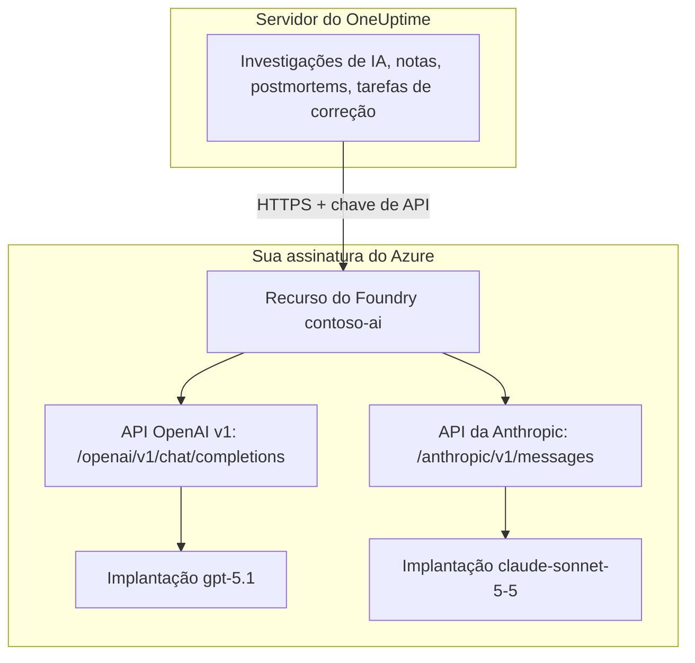

# Microsoft Foundry e Azure OpenAI

Execute os recursos de IA do OneUptime em modelos que você implanta no Microsoft Foundry (antigo Azure AI Foundry) ou no Azure OpenAI. O OneUptime envia cada solicitação direto ao seu recurso, na sua assinatura do Azure, então os prompts e as respostas são processados pela implantação que você escolheu, onde você escolheu. Esta página leva você de uma assinatura vazia a um provedor funcionando: o recurso do Azure, a implantação do modelo, o endpoint e a chave, as configurações do OneUptime, a rede e o que fazer quando uma solicitação falha.

:::cards
- [Configurar o Azure](#configurar-o-microsoft-foundry): Criar um recurso, implantar um modelo, copiar o endpoint e a chave.
- [Conectar o OneUptime](#conectar-o-oneuptime): Quatro campos nas configurações do projeto e depois o botão Testar.
- [Auto-hospedado](#configurar-uma-instância-auto-hospedada-com-variáveis-de-ambiente): Um provedor para todos os projetos, a partir de variáveis de ambiente.
- [Solução de problemas](#solução-de-problemas): 401, 403, uma implantação que falta, uma api-version.
:::

## Como funciona

O OneUptime chama o seu recurso do Foundry por HTTPS a partir do servidor do OneUptime, nunca do navegador das pessoas. Cada solicitação leva uma das chaves de API do recurso e indica a implantação que deve respondê-la.



Um único tipo de provedor, **Azure OpenAI / Microsoft Foundry**, cobre todas as implantações do recurso. A URL base diz ao OneUptime qual API chamar:

| Modelo que você implanta | API que o OneUptime chama | URL base |
| --- | --- | --- |
| Modelos da OpenAI, como GPT-5.1 e GPT-4.1 | OpenAI v1 chat completions | `https://contoso-ai.openai.azure.com/openai/v1` |
| Foundry Models com chat completions, como DeepSeek e Grok | OpenAI v1 chat completions | `https://contoso-ai.services.ai.azure.com/openai/v1` |
| Claude | Anthropic Messages | `https://contoso-ai.services.ai.azure.com/anthropic` |

> [!IMPORTANT]
> Os recursos de IA do OneUptime chamam ferramentas: enquanto trabalham, consultam seus monitores, incidentes e telemetria. Implante um modelo que ofereça suporte a chamadas de ferramentas (function calling). O botão **Testar** do provedor verifica isso para você.

## Antes de começar

Você precisa de uma assinatura do Azure, de uma função que permita criar e ler o recurso e de uma função do OneUptime que possa adicionar provedores LLM.

| Para | O que você precisa no Azure |
| --- | --- |
| Criar o recurso | **Owner** ou **Contributor** no grupo de recursos, ou **Foundry Account Owner** |
| Implantar um modelo | **Owner** ou **Contributor** no grupo de recursos, ou **Foundry Owner** ou **Foundry Account Owner** no recurso. O Claude também exige permissão para assinar ofertas do Azure Marketplace |
| Ler as chaves do recurso | Uma função com `Microsoft.CognitiveServices/accounts/listKeys/action`, como **Owner**, **Contributor** ou **Cognitive Services Contributor** |

O próprio OneUptime não precisa de nenhuma função do Azure. Uma chave dá sozinha acesso a todas as implantações do recurso, sem verificação de função, então trate-a como uma senha.

No OneUptime, adicionar um provedor a um projeto exige **Project Owner**, **Project Admin**, **Project Member**, **Settings Admin**, **Settings Member** ou **Create LLM**. Em vez disso, uma instância auto-hospedada pode registrar um provedor para todos os projetos a partir de variáveis de ambiente, o que exige acesso ao servidor.

## Configurar o Microsoft Foundry

:::steps
### Criar um recurso

No [portal do Foundry](https://ai.azure.com), crie um recurso do Foundry ou escolha um que você já tenha. Um recurso do Azure OpenAI funciona da mesma forma. Anote o nome do recurso: ele é a primeira parte do endpoint, como `contoso-ai` em `https://contoso-ai.openai.azure.com`.

Escolha uma região que ofereça o modelo desejado. Por enquanto, deixe o acesso de rede do recurso aberto para todas as redes; [Requisitos de rede](#requisitos-de-rede) explica quando e como fechá-lo.

### Implantar um modelo

No portal do Foundry, selecione **Discover**, depois **Models**, e escolha um modelo, por exemplo `gpt-5.1` ou `claude-sonnet-5-5`. Selecione **Deploy** e depois **Custom settings**:

- **Deployment name**: o Foundry preenche com o nome do modelo. O OneUptime pede a implantação por esse nome, então anote-o exatamente.
- **Deployment type**: decide onde os prompts são processados. Veja [Onde seus dados são processados](#onde-seus-dados-são-processados).

Selecione **Deploy** e aguarde até o status da implantação ser **Succeeded**.

### Copiar o endpoint e uma chave

No [portal do Azure](https://portal.azure.com), abra o recurso e depois **Resource Management** > **Keys and Endpoint**. Copie o **Endpoint** e a **KEY 1**. Guarde a **KEY 2** para a rotação: mude o OneUptime para ela e depois gere de novo a **KEY 1**.

No portal do Foundry, a mesma chave está na guia **Details** da implantação, ao lado do seu **Target URI**.
:::

:::details Prefere a linha de comando?
As mesmas etapas com a CLI do Azure. `--model-version` recebe uma versão que o catálogo de modelos lista para o modelo.

```bash
az cognitiveservices account create \
  --name contoso-ai --resource-group oneuptime-ai \
  --kind AIServices --sku S0 --location eastus2 \
  --custom-domain contoso-ai

az cognitiveservices account deployment create \
  --name contoso-ai --resource-group oneuptime-ai \
  --deployment-name gpt-5.1 \
  --model-name gpt-5.1 --model-version <version> --model-format OpenAI \
  --sku-name GlobalStandard --sku-capacity 50

# KEY 1
az cognitiveservices account keys list \
  --name contoso-ai --resource-group oneuptime-ai \
  --query key1 --output tsv
```

Com `--custom-domain contoso-ai`, o endpoint do recurso é `https://contoso-ai.openai.azure.com`.
:::

## Conectar o OneUptime

:::steps
### Abrir os provedores LLM

Vá para **Configurações do projeto** > **IA** > **Provedores LLM** e clique em **Criar: Provedor LLM**.

### Dar nome ao provedor

Em **Informações básicas**, digite um **Nome**, como `Azure gpt-5.1`, e, se quiser, uma **Descrição**. Clique em **Próximo**.

### Preencher as configurações do provedor

| Campo | O que digitar |
| --- | --- |
| **Provedor LLM** | **Azure OpenAI / Microsoft Foundry** |
| **Chave de API** | **KEY 1** ou **KEY 2** do recurso |
| **Nome do Modelo** | O nome da implantação, exatamente como o Foundry o mostra, como `gpt-5.1` |
| **URL base** | O endpoint do recurso com `/openai/v1`, como `https://contoso-ai.openai.azure.com/openai/v1`. Para o Claude: `https://contoso-ai.services.ai.azure.com/anthropic` |

**Definir como padrão**, em **Mais campos**, está ativado: os recursos de IA usam o provedor padrão do projeto. Clique em **Criar: Provedor LLM**.

### Testar a conexão

Clique em **Testar** na linha do provedor. Um provedor que funciona responde "Connection successful. The LLM provider responded to a test prompt and used tool calling." Se o teste falhar, a mensagem diz o que o Azure respondeu e o que mudar; veja [Solução de problemas](#solução-de-problemas).
:::

O provedor pronto, como exemplo:

```text
Nome: Azure gpt-5.1
Provedor LLM: Azure OpenAI / Microsoft Foundry
Chave de API: <KEY 1 de contoso-ai>
Nome do Modelo: gpt-5.1
URL base: https://contoso-ai.openai.azure.com/openai/v1
```

A partir de agora, os recursos de IA do projeto usam esta implantação. No OneUptime Cloud, as solicitações deles não são pagas com os créditos de IA do projeto: o Azure as cobra na sua assinatura.

## Formatos da URL base

O OneUptime aceita o endpoint nas formas em que os portais do Azure e do Foundry o mostram, e envia cada solicitação ao endereço ao lado. Prefira as curtas: a URL base comporta até 100 caracteres.

| URL base | As solicitações vão para |
| --- | --- |
| `https://contoso-ai.openai.azure.com` | `https://contoso-ai.openai.azure.com/openai/v1/chat/completions` |
| `https://contoso-ai.openai.azure.com/openai/v1` | `https://contoso-ai.openai.azure.com/openai/v1/chat/completions` |
| `https://contoso-ai.services.ai.azure.com/openai/v1` | `https://contoso-ai.services.ai.azure.com/openai/v1/chat/completions` |
| `https://contoso-ai.openai.azure.com/openai/deployments/gpt-4o` | `https://contoso-ai.openai.azure.com/openai/deployments/gpt-4o/chat/completions?api-version=2024-10-21` |
| `https://contoso-ai.services.ai.azure.com/anthropic` | `https://contoso-ai.services.ai.azure.com/anthropic/v1/messages` |

- **A API v1** (`/openai/v1`) é a API atual da Microsoft. Ela não precisa de `api-version`, usa o nome da implantação como modelo e atende igualmente os modelos da OpenAI e os outros Foundry Models. Use-a para provedores novos.
- **Uma URL de implantação** (`/openai/deployments/<name>`) indica ela mesma a implantação, e o Azure segue esse nome em vez do **Nome do Modelo**. O OneUptime adiciona `api-version=2024-10-21`, a menos que a URL base tenha a sua própria `api-version`. Provedores salvos assim continuam funcionando como antes.
- **O Target URI de uma implantação**, colado inteiro do portal do Foundry, também funciona, desde que caiba em 100 caracteres.
- **Claude**: o Foundry atende o Claude somente pela API Anthropic Messages, no caminho `/anthropic` do recurso. O OneUptime a chama com a mesma chave. O tipo de provedor **Anthropic** também chega até ela, com a mesma URL base.

## Configurar uma instância auto-hospedada com variáveis de ambiente

Em uma instância auto-hospedada, as variáveis `GLOBAL_LLM_PROVIDER_*` registram na inicialização um provedor LLM global, que todo projeto sem provedor próprio usa, incluindo as tarefas de correção com IA. O provedor próprio de um projeto sempre vem primeiro.

```bash
GLOBAL_LLM_PROVIDER_TYPE=AzureOpenAI
GLOBAL_LLM_PROVIDER_NAME=Azure gpt-5.1
GLOBAL_LLM_PROVIDER_BASE_URL=https://contoso-ai.openai.azure.com/openai/v1
GLOBAL_LLM_PROVIDER_MODEL_NAME=gpt-5.1
GLOBAL_LLM_PROVIDER_API_KEY=<KEY 1 of contoso-ai>
```

:::tabs
@tab Docker Compose
Adicione as variáveis ao `config.env` e inicie o OneUptime de novo do mesmo jeito que você o iniciou:

```bash
(export $(grep -v '^#' config.env | xargs) && docker compose up --remove-orphans -d)
```
@tab Kubernetes
Guarde a chave em um Secret e passe as variáveis com o `extraEnv` global do chart:

```bash
kubectl create secret generic azure-foundry \
  --namespace oneuptime --from-literal=api-key='<KEY 1 of contoso-ai>'
```

```yaml title="values.yaml"
extraEnv:
  - name: GLOBAL_LLM_PROVIDER_TYPE
    value: AzureOpenAI
  - name: GLOBAL_LLM_PROVIDER_NAME
    value: Azure gpt-5.1
  - name: GLOBAL_LLM_PROVIDER_BASE_URL
    value: https://contoso-ai.openai.azure.com/openai/v1
  - name: GLOBAL_LLM_PROVIDER_MODEL_NAME
    value: gpt-5.1
  - name: GLOBAL_LLM_PROVIDER_API_KEY
    valueFrom:
      secretKeyRef:
        name: azure-foundry
        key: api-key
```

Depois execute `helm upgrade` com esses valores.
:::

O provedor acompanha as variáveis: alterá-las o atualiza na próxima inicialização, e remover `GLOBAL_LLM_PROVIDER_TYPE` o exclui. Se faltar a chave ou a URL base para este tipo, o log de inicialização avisa. Veja [Provedores LLM](/docs/ai/llm-provider) para cada variável e cada tipo de provedor.

## Requisitos de rede

O servidor do OneUptime abre conexões HTTPS, na porta 443, para o nome de host do recurso, como `contoso-ai.openai.azure.com` ou `contoso-ai.services.ai.azure.com`. Libere esse tráfego de saída no seu firewall ou proxy.

- **OneUptime Cloud** chega ao recurso pela internet, então o recurso precisa aceitar tráfego público. Para manter o recurso fora da internet, auto-hospede o OneUptime.
- **Auto-hospedado, endpoint privado**: coloque o recurso atrás de um endpoint privado em uma rede virtual que o servidor do OneUptime alcance, e vincule a ela as zonas DNS privadas `privatelink.openai.azure.com`, `privatelink.services.ai.azure.com` e `privatelink.cognitiveservices.azure.com`, para que o nome de host de sempre do recurso seja resolvido para o endereço privado. A URL base continua a mesma.
- **Endereços privados**: uma instância auto-hospedada se conecta a endereços privados, a menos que `DATA_SOURCE_BLOCK_PRIVATE_ADDRESSES=true` esteja definido. Um provedor LLM global se conecta a eles em qualquer caso.
- **Regras de rede do recurso**: em **Networking** do recurso, **Selected networks and private endpoints** bloqueia todo o resto. Uma solicitação recusada por uma regra falha com 403.

## Onde seus dados são processados

O tipo de implantação que você escolhe ao implantar o modelo decide onde o Azure processa os prompts do OneUptime e as respostas do modelo. Os dados armazenados em repouso ficam na geografia do Azure do recurso.

| Tipo de implantação | Prompts e respostas são processados |
| --- | --- |
| Global Standard, Global Provisioned | Em qualquer região do Azure |
| Data Zone Standard, Data Zone Provisioned | Somente dentro da zona de dados: Estados Unidos, União Europeia ou Ásia-Pacífico |
| Standard, Regional Provisioned | Dentro da geografia do Azure do recurso |

As implantações do Claude são **Hosted on Azure** ou **Hosted on Anthropic**. Escolha **Hosted on Azure** para manter prompts e respostas dentro do Azure. Veja os [tipos de implantação](https://learn.microsoft.com/en-us/azure/foundry/foundry-models/concepts/deployment-types) da Microsoft para mais detalhes.

## Exemplo de solicitação e resposta

Para verificar uma implantação fora do OneUptime, envie a ela com `curl` a solicitação que o OneUptime envia:

:::tabs
@tab OpenAI v1 API
```bash
curl https://contoso-ai.openai.azure.com/openai/v1/chat/completions \
  -H "Content-Type: application/json" \
  -H "api-key: $AZURE_API_KEY" \
  -d '{
    "model": "gpt-5.1",
    "messages": [
      { "role": "user", "content": "Reply with the word: OK" }
    ]
  }'
```

A resposta, resumida:

```json
{
  "id": "chatcmpl-7R1nGnsXO8n4oi9UPz2f3UHdgAYMn",
  "object": "chat.completion",
  "model": "gpt-5.1",
  "choices": [
    {
      "index": 0,
      "finish_reason": "stop",
      "message": { "role": "assistant", "content": "OK" }
    }
  ],
  "usage": { "prompt_tokens": 12, "completion_tokens": 2, "total_tokens": 14 }
}
```
@tab Anthropic API
```bash
curl https://contoso-ai.services.ai.azure.com/anthropic/v1/messages \
  -H "Content-Type: application/json" \
  -H "x-api-key: $AZURE_API_KEY" \
  -H "anthropic-version: 2023-06-01" \
  -d '{
    "model": "claude-sonnet-5-5",
    "max_tokens": 1024,
    "messages": [
      { "role": "user", "content": "Reply with the word: OK" }
    ]
  }'
```

A resposta, resumida:

```json
{
  "id": "msg_01XFDUDYJgAACzvnptvVoYEL",
  "type": "message",
  "role": "assistant",
  "model": "claude-sonnet-5-5",
  "content": [{ "type": "text", "text": "OK" }],
  "stop_reason": "end_turn",
  "usage": { "input_tokens": 14, "output_tokens": 4 }
}
```
:::

As solicitações do próprio OneUptime levam mais: as instruções dele, a conversa, as ferramentas que o modelo pode chamar e um limite de tokens. Da resposta, ele lê o texto, as chamadas de ferramentas, por que o modelo parou e o uso de tokens, que **Configurações do projeto** > **IA** > **Registros de IA** lista para cada solicitação. Os **Parâmetros adicionais** do provedor são acrescentados a cada solicitação.

## Microsoft Entra ID e recursos sem chave

O OneUptime entra no recurso com uma das chaves de API dele. Entrar com o Microsoft Entra ID, como entidade de serviço ou identidade gerenciada, ainda não é suportado.

Se a sua organização desativa o acesso por chave em recursos de IA (`disableLocalAuth`), as solicitações falham com `AuthenticationTypeDisabled`. Permita o acesso por chave no recurso que o OneUptime usa, ou coloque o Azure API Management na frente:

1. Importe a implantação do recurso no API Management como uma API do Azure OpenAI. O API Management passa então a entrar no recurso com a própria identidade gerenciada.
2. Defina `api-key` como nome do cabeçalho da chave de assinatura da API.
3. No OneUptime, defina a **URL base** como o endereço da API no API Management para a implantação, como `https://contoso-apim.azure-api.net/aoai/openai/deployments/gpt-5.1`, com a `api-version` de que a implantação precisa, como em qualquer URL de implantação. Defina a **Chave de API** como uma chave de assinatura do API Management.

Os modelos do Claude que aceitam somente o Microsoft Entra ID, como o Claude Mythos, ainda não podem ser usados.

## Solução de problemas

O OneUptime coloca no início do erro o que mudar e, em seguida, a resposta do próprio Azure. O botão **Testar** mostra o erro inteiro; os **Registros de IA** guardam os primeiros 490 caracteres.

:::details "Azure did not accept the API key" (401)
A chave está errada, foi gerada de novo ou pertence a outro recurso. Copie de novo a **KEY 1** em **Keys and Endpoint** do recurso que a URL base indica e cole-a em **Chave de API**.
:::

:::details "Key-based authentication is turned off for this resource" (403)
O Azure respondeu `AuthenticationTypeDisabled`: o recurso só aceita o Microsoft Entra ID. Veja [Microsoft Entra ID e recursos sem chave](#microsoft-entra-id-e-recursos-sem-chave).
:::

:::details "Azure refused the request" (403)
Uma regra de rede do recurso barrou a solicitação. Confira as configurações de **Networking** do recurso com os [requisitos de rede](#requisitos-de-rede).
:::

:::details "This resource has no deployment named ..." (404)
O Azure respondeu `DeploymentNotFound`. Defina o **Nome do Modelo** como o nome da implantação exatamente como o portal do Foundry o lista. Uma implantação criada nos últimos minutos talvez ainda não esteja pronta. Se a URL base for uma URL de implantação, o nome a conferir é o que vem depois de `/openai/deployments/`.
:::

:::details "Azure found nothing at this address" (404)
A URL base não leva a nenhuma API do Azure OpenAI. Use o endpoint do recurso com `/openai/v1`, como `https://contoso-ai.openai.azure.com/openai/v1`. O endpoint de inferência de modelos do SDK Azure AI Inference, já desativado (`/models`), não é uma: use `/openai/v1` no mesmo recurso.
:::

:::details "This model needs api-version ... or later" (400)
Uma URL de implantação pede `api-version=2024-10-21`, a menos que indique outra, e modelos mais novos, como a série o e o GPT-5, recusam versões tão antigas. Mude a URL base para a API v1, `https://contoso-ai.openai.azure.com/openai/v1`, com o nome da implantação como **Nome do Modelo**. Ou adicione à URL base a versão que o Azure indica, como `?api-version=2024-12-01-preview`.
:::

:::details "Azure's v1 API takes no dated api-version" (400)
A URL base termina em `/openai/v1` e também tem uma `api-version` com data. Remova a `api-version` da URL base.
:::

:::details "URL base não pode ter mais de 100 caracteres."
Um Target URI com a sua `api-version` costuma ser mais longo. Use o endpoint do recurso com `/openai/v1` e coloque o nome da implantação em **Nome do Modelo**.
:::

:::details "...could not be reached" ou "...host name could not be resolved"
O servidor do OneUptime não conseguiu se conectar ao recurso. No OneUptime Cloud, o recurso precisa ser acessível pela internet. Em uma instância auto-hospedada, verifique se o servidor resolve o nome de host do recurso, pela zona DNS privada no caso de um endpoint privado, e se o HTTPS de saída é permitido.
:::

:::details Solicitações demais (429)
A cota de tokens por minuto da implantação acabou. Os recursos de IA esperam e tentam de novo, até dez tentativas em cerca de cinco minutos, antes de relatar a falha; o botão **Testar** desiste antes. Aumente a cota da implantação no portal do Foundry ou mude-a para outro tipo de implantação.
:::

## Próximos passos

:::cards
- [Provedores LLM](/docs/ai/llm-provider): Todos os tipos de provedor e como um projeto escolhe um.
- [AI SRE](/docs/ai/ai-sre): Investigações que rodam com este provedor.
- [Ask AI](/docs/ai/ask-ai): Perguntas sobre o seu sistema, respondidas no painel.
:::
