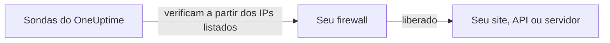

# Endereços IP

As sondas do OneUptime Cloud verificam seus sites, APIs e servidores a partir de um conjunto fixo de endereços IP. Se houver um firewall ou uma lista de permissões na frente do que você monitora, libere esses endereços para que as verificações cheguem.



## Endereços IP a liberar

Libere no seu firewall o tráfego destes endereços:

{{IP_WHITELIST}}

> [!NOTE]
> Esses endereços podem mudar. O OneUptime avisa com antecedência quando isso acontece. Para se manter atualizado sem acompanhar os anúncios, [busque a lista](#buscar-a-lista-de-forma-programática) sempre que atualizar seu firewall.

## Buscar a lista de forma programática

A mesma lista é servida como JSON, sem precisar de chave de API, para que um script mantenha as regras do seu firewall em dia:

```bash
curl -s https://oneuptime.com/ip-whitelist
```

```json
{
  "ipWhitelist": ["<list of IPs>"]
}
```

`ipWhitelist` é um array com um endereço por item. Para imprimir um endereço por linha, por exemplo para alimentar um script de firewall:

```bash
curl -s https://oneuptime.com/ip-whitelist | jq -r '.ipWhitelist[]'
```

## OneUptime auto-hospedado

Na sua própria instância, esta página e o endpoint `/ip-whitelist` mostram os endereços da configuração `IP_WHITELIST` da instância, uma lista separada por vírgulas. Informe os endereços a partir dos quais suas próprias sondas enviam as verificações.

:::tabs
@tab Kubernetes
Defina o valor `ipWhitelist` do chart Helm:

```yaml title="values.yaml"
ipWhitelist: "203.0.113.1,203.0.113.2"
```
@tab Docker Compose
O `config.env` não repassa essa configuração ao app. Adicione-a ao ambiente do serviço `app` em um `docker-compose.override.yml` ao lado do `docker-compose.yml` e inicie o OneUptime novamente:

```yaml title="docker-compose.override.yml"
services:
  app:
    environment:
      IP_WHITELIST: "203.0.113.1,203.0.113.2"
```
:::

Quando nada está definido, esta página mostra **No IP addresses configured.** e o endpoint retorna um array `ipWhitelist` vazio.

## Próximos passos

:::cards
- [Sondas personalizadas](/docs/probe/custom-probe): Executar uma sonda dentro da sua própria rede em vez de abrir o firewall.
- [Criar um monitor](/docs/monitor/create-monitor): Começar a verificar um site, uma API ou um servidor.
:::
