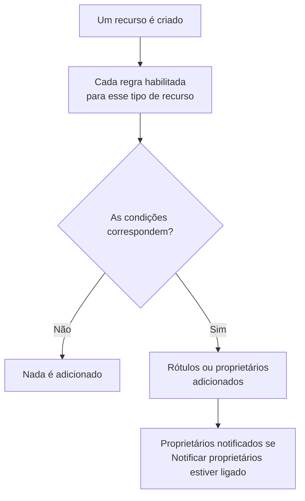

# Regras de rótulos e proprietários

As regras de rótulos e as regras de proprietários organizam seus recursos por você. Uma **regra de rótulos** adiciona rótulos a cada recurso novo que corresponde a ela, e uma **regra de proprietários** adiciona usuários e equipes como proprietários: assim, um novo incidente de banco de dados recebe o rótulo _Banco de dados_ e pertence à equipe de banco de dados sem que ninguém precise se lembrar disso.

:::cards
- [Criar uma regra](#criar-uma-regra): Duas etapas: com o que a regra corresponde e, depois, o que ela adiciona.
- [Herdar rótulos e proprietários](#herdar-rótulos-e-proprietários): Repassar o que os monitores, hosts e serviços de um evento carregam.
- [Quando as regras são executadas](#quando-as-regras-são-executadas): Recursos novos, e **Run Now** para os que você já tem.
:::

## Como funciona

As regras são executadas quando um recurso é criado. Cada regra habilitada verifica suas condições no recurso novo, e cada regra que corresponde adiciona o que adiciona.

Os rótulos e os proprietários servem para filtrar e agrupar recursos, definem quem o OneUptime avisa sobre eles e o que alcançam as [permissões restritas por rótulos ou aos próprios recursos](/docs/permissions/index). As regras os mantêm consistentes sem que ninguém precise se lembrar.

## Onde encontrar as regras

Todo produto com rótulos e proprietários tem as duas regras em suas **Configurações** (em incidentes, alertas e manutenção programada, em **Regras**): monitores, incidentes e episódios de incidente, alertas e episódios de alerta, eventos de manutenção programada, páginas de status, serviços, hosts, clusters Kubernetes, hosts Docker, clusters Docker Swarm, hosts Podman, clusters Proxmox, vCenters VMware, clusters Ceph, storage arrays, bancos de dados, filas, frotas de IoT, funções serverless, recursos de nuvem, aplicações RUM, dashboards, políticas de plantão, escalas de plantão, políticas de chamadas recebidas, workflows, runbooks, dispositivos de rede e SLOs.

Por exemplo, as regras de rótulos de monitores ficam em **Monitores → Configurações → Regras de Rótulos**, e as de incidentes em **Incidentes → Regras → Regras de Rótulos**. **Configurações** e **Regras** começam recolhidas no menu lateral: clique no título da seção para abri-la. As páginas de incidentes e de alertas têm uma aba **Incident Rules** (ou **Alert Rules**) e uma aba **Episode Rules**.

## Criar uma regra

Todas as regras de rótulos e de proprietários são criadas do mesmo jeito, em duas etapas.

:::steps
### Abrir a lista de regras

Abra a página **Regras de Rótulos** ou **Regras de proprietário** do produto e clique no botão de criação, que leva o nome da regra, por exemplo **Criar: Monitor Label Rule**.

### Escolher com o que a regra corresponde

Na etapa **Corresponder**, clique em **Adicionar condição** para cada condição que o recurso precisa cumprir. Com duas ou mais, escolha **Corresponder a todas** ou **Corresponder a qualquer**. Uma regra sem condições corresponde a qualquer recurso novo.

### Escolher o que a regra adiciona

Na etapa **Rótulos**, escolha os **Rótulos a Adicionar**. Numa regra de proprietários, a etapa é **Proprietários**: **Adicionar proprietário** abre uma única lista de pessoas e equipes.

O **Nome** é preenchido a partir do que você escolhe (_Adicionar Production_, _Adicionar Platform como proprietários_) e acompanha suas escolhas até você digitar um nome próprio. Uma regra que só herda recebe, em vez disso, o nome daquilo de que herda (veja abaixo).

### Conferir os campos recolhidos

**Mais campos** contém a **Descrição** opcional e, numa regra de proprietários, **Notificar proprietários**, que vem ligado por padrão: os proprietários que uma regra adiciona recebem a mesma notificação "você foi adicionado como proprietário" que um proprietário adicionado à mão. Desligue para adicionar proprietários sem avisá-los.

### Salvar a regra

Na última etapa, clique de novo no botão com o nome da regra, por exemplo **Criar: Monitor Label Rule**. A regra começa habilitada, e a lista a mostra com uma etiqueta verde **Habilitado**.
:::

Uma regra nova precisa adicionar algo: pelo menos um rótulo (ou proprietário) ou, numa regra de incidente, alerta ou manutenção programada, algo que ela herde (veja abaixo). Para pausar uma regra sem excluí-la, desligue **Habilitado** no formulário de edição; a lista passa a mostrar uma etiqueta vermelha **Desabilitado**.

### Seja qual for a forma de criar a regra

O mesmo vale para uma regra criada pela API, pelo Terraform, por um workflow ou por uma [importação de regras de rótulos](/docs/configuration/label-rule-import-export): o OneUptime recusa uma regra nova que não adiciona nada, com uma mensagem que indica os campos a preencher. Essas mensagens estão em inglês em todos os idiomas.

| Regra | Mensagem |
| --- | --- |
| Regra de rótulos | This label rule adds nothing. Choose at least one label in Labels to Add. |
| Regra de rótulos de incidente, alerta ou manutenção programada | This label rule adds nothing. Choose at least one label in Labels to Add, or turn on an Inherit Labels switch. |
| Regra de proprietários | This owner rule adds nothing. Choose at least one user or team in Owner Users or Owner Teams. |
| Regra de proprietários de incidente, alerta ou manutenção programada | This owner rule adds nothing. Choose at least one user or team in Owner Users or Owner Teams, or turn on an Inherit Owners switch. |

- **API**: defina `labelsToAdd` (ou `ownerUsers` / `ownerTeams`) com pelo menos um registro do projeto, ou um dos interruptores `inheritLabelsFrom…` (`inheritOwnersFrom…`) da regra como `true`, um booleano JSON.
- **Terraform**: um recurso de regra de rótulos ou de proprietários que não adiciona nada falha no `terraform apply` com a mensagem acima. Dê a ele `labels_to_add` (ou `owner_users` / `owner_teams`) ou ligue um dos seus interruptores de herança.

As regras que você já tem não são alteradas: veja [Editar uma regra](#editar-uma-regra).

## Herdar rótulos e proprietários

As regras de incidentes, alertas e manutenção programada também podem repassar o que carregam os recursos afetados por um evento. Em **Rótulos a Adicionar** (ou **Proprietários**), a seção recolhida **Herdar Rótulos** (ou **Herdar Proprietários**) contém seis interruptores:

- **Herdar Rótulos dos Monitores**: cada rótulo dos monitores do incidente também é adicionado ao incidente. Um alerta tem um único monitor, então numa regra de alertas o interruptor é **Herdar Rótulos do Monitor** (e numa regra de proprietários de alertas, **Herdar Proprietários do Monitor**).
- **Herdar Rótulos dos Hosts**, **Herdar Rótulos dos Clusters Kubernetes**, **Herdar Rótulos dos Hosts Docker**, **Inherit Labels From Podman Hosts** e **Herdar Rótulos dos Serviços** fazem o mesmo com esses recursos.

As regras de proprietários têm os mesmos seis interruptores para proprietários (**Herdar Proprietários dos Monitores** e assim por diante). Enquanto nenhum interruptor estiver ligado, a seção recolhida explica para que serve; numa regra que herda, ela se abre sozinha. As regras de episódios não têm interruptores de herança.

Uma regra que herda pode deixar **Rótulos a Adicionar** (ou **Proprietários**) vazio: ela adiciona o que herda. Uma regra assim recebe o nome daquilo de que herda:

| Interruptores ligados | Nome |
| --- | --- |
| **Herdar Rótulos dos Monitores** | _Herdar rótulos de: monitores_ |
| **Herdar Rótulos dos Monitores** e **Herdar Rótulos dos Hosts** | _Herdar rótulos de: monitores, hosts_ |
| **Herdar Rótulos do Monitor**, numa regra de alertas | _Herdar rótulos de: monitor_ |

O nome acompanha os interruptores até você escolher um rótulo (aí a regra passa a ter o nome dos seus rótulos) ou digitar um nome próprio.

## Editar uma regra

O formulário de edição de uma regra tem as mesmas duas etapas e acrescenta o interruptor **Habilitado**. Ele não exige o que a regra adiciona: uma regra salva antes de o OneUptime pedir isso (pela API, pelo Terraform, por uma importação ou pelo formulário antigo) pode não adicionar nada, e uma edição pode retirar tudo o que uma regra adiciona.

Uma regra assim ainda pode ser renomeada, desligada ou excluída, também pela API e pelo Terraform. A lista marca uma regra que não adiciona nada com **Não adiciona nada** ao lado do status, e a página da própria regra faz o mesmo. Edite-a para escolher o que ela adiciona, ou exclua-a.

## Quando as regras são executadas

Toda regra habilitada é executada quando um recurso é criado, pelo dashboard ou pela API, e cada regra que corresponde adiciona o que adiciona:

- Se várias regras corresponderem, todas adicionam seus rótulos e proprietários.
- Uma regra nunca remove nada: nem rótulos ou proprietários que alguém adicionou à mão, nem os que ela mesma adicionou.
- Uma regra desabilitada não faz nada.

Uma regra escrita hoje vale para os recursos criados depois dela. Para aplicá-la aos que você já tem, use **Run Now**: veja [Executar regras em recursos existentes](/docs/configuration/run-rules-now). As regras de rótulos também podem ser copiadas entre projetos: veja [Importar e exportar regras de rótulos](/docs/configuration/label-rule-import-export).

## Próximos passos

:::cards
- [Executar regras em recursos existentes](/docs/configuration/run-rules-now): Aplicar uma regra aos recursos que você já tem.
- [Importar e exportar regras de rótulos](/docs/configuration/label-rule-import-export): Copiar regras de rótulos entre projetos em JSON.
- [Configurações e automação de incidentes](/docs/incidents/settings): As outras regras que um incidente pode executar.
- [Regras de rótulos e proprietários de SLOs](/docs/slo/label-and-owner-rules): Com o que correspondem as regras de SLOs.
:::
