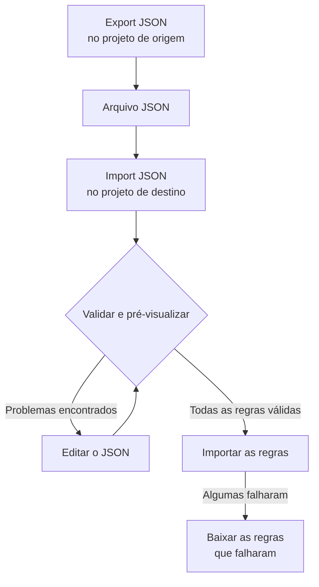

# Importar e exportar regras de rótulos

Copie regras de rótulos entre projetos, ou crie muitas de uma vez, como um arquivo JSON. Toda página **Regras de Rótulos** tem as ações **Export JSON** e **Import JSON** no menu **Mais opções** (**⋯**), inclusive em incidentes, alertas, monitores e dispositivos de rede. A única exceção é o VMware: as regras de rótulos de vCenter não têm nenhuma das duas.



## Exportar regras

Abra **Mais opções** e selecione **Export JSON** para baixar todas as regras desse tipo no projeto atual. A exportação inclui as regras de outras páginas da tabela e ignora os filtros da tabela.

O arquivo mantém de cada regra o estado de habilitação, as condições, os rótulos a adicionar e as opções de herança de rótulos. Os IDs de projeto, os IDs de regra e os campos de auditoria ficam de fora.

Os rótulos, monitores e severidades vinculados são escritos com o nome exato. Uma importação não os cria: eles já precisam existir no projeto de destino.

## Importar regras

:::steps
### Abrir Import JSON

Abra a página **Regras de Rótulos** do projeto de destino e selecione **Mais opções → Import JSON**.

### Adicionar o arquivo

Envie um arquivo de exportação JSON ou cole o conteúdo dele.

### Validar e pré-visualizar

Selecione **Validate and preview**. Cada regra é verificada antes de qualquer uma ser criada, e os recursos referenciados precisam existir no projeto de destino com nomes únicos e correspondentes.

### Revisar a pré-visualização

Confira os nomes das regras, o estado, os rótulos e as condições. Um lote grande é mostrado uma página por vez. Para corrigir algo, selecione **Edit JSON** e valide de novo.

### Importar

Selecione o botão de importação, que conta as regras (por exemplo **Import 2 rules**), e mantenha a janela aberta até os resultados aparecerem.
:::

As importações adicionam regras novas e mantêm as existentes, então importar o mesmo arquivo de novo cria outra cópia. As permissões normais de criação e a validação do servidor valem para cada regra.

Se algumas regras falharem, selecione **Download failed rules** para salvar só essas linhas, corrija-as e importe esse arquivo de novo. Se uma solicitação expirar, confira a lista de regras antes de tentar de novo: o servidor pode ter salvado a regra antes de a resposta se perder.

## Criar um lote em JSON

Exporte uma regra existente para ter um exemplo do seu tipo de recurso e depois edite ou adicione entradas no array `items`. Este exemplo cria duas regras de rótulos de monitores. Os rótulos `Production` e `Infrastructure` já precisam existir no projeto de destino.

```json title="monitor-label-rules.json"
{
  "fileType": "oneuptime-label-rules",
  "schemaVersion": 1,
  "resourceType": "MonitorLabelRule",
  "items": [
    {
      "name": "Production API monitors",
      "description": "Label production API monitors automatically",
      "isEnabled": true,
      "monitorNamePattern": "^api-prod-",
      "monitorLabels": [],
      "labelsToAdd": ["Production"]
    },
    {
      "name": "Database monitors",
      "isEnabled": false,
      "monitorNamePattern": "^database-",
      "labelsToAdd": ["Infrastructure"]
    }
  ]
}
```

| Campo | O que contém |
| --- | --- |
| `fileType` | Sempre `oneuptime-label-rules`. |
| `schemaVersion` | Sempre `1`. |
| `resourceType` | O tipo de regra que o arquivo contém, como `MonitorLabelRule`. |
| `items` | As regras, um objeto para cada uma. Um arquivo precisa de pelo menos uma. |

Use booleanos JSON para `isEnabled`, texto para os padrões e arrays de nomes para os recursos vinculados.

Estes casos interrompem o lote inteiro antes da etapa de importação: padrões inválidos, campos desconhecidos, nomes ausentes e referências ambíguas. O mesmo vale para uma regra que não adiciona nada (um `labelsToAdd` vazio e, numa regra de incidente, alerta ou manutenção programada, nenhum interruptor `inheritLabelsFrom…` como `true`), porque o OneUptime se recusa a criá-la (veja [Regras de rótulos e proprietários](/docs/configuration/label-and-owner-rules#seja-qual-for-a-forma-de-criar-a-regra)). Uma exportação pode conter uma regra assim se ela foi salva antes dessa verificação; dê a ela um rótulo ou retire-a do arquivo antes de importar.

> [!NOTE]
> Arquivos e JSON colado são limitados a 10 MB.

## Copiar entre tipos de recurso

Mantenha o `resourceType` original no arquivo e abra **Import JSON** na página de destino. Os padrões compatíveis de nome ou título principal, os padrões de descrição e os rótulos pré-requisito são mapeados para os campos do destino, e a pré-visualização lista esses mapeamentos para você revisar. As referências a severidades de incidentes e alertas são comparadas com os nomes de severidade do destino.

Condições ou ações que o destino não suporta bloqueiam a importação. Por exemplo, uma regra de incidente restrita a monitores específicos não pode ser copiada para as regras de dispositivos de rede sem editar essas condições.

> [!WARNING]
> As regras de rótulos de dispositivos de rede e de SLOs aceitam curingas além de expressões regulares. Uma transferência entre essas regras e outros tipos de regra recusa padrões que contêm `*` ou espaços nas pontas, porque eles correspondem de outra forma lá. Edite esses padrões para o destino ou mantenha a regra no mesmo tipo de recurso. As regras de rótulos de dispositivos de rede e de SLOs podem trocar qualquer padrão entre si, porque correspondem da mesma forma.

## Próximos passos

:::cards
- [Regras de rótulos e proprietários](/docs/configuration/label-and-owner-rules): Com o que uma regra de rótulos corresponde e o que ela adiciona.
- [Executar regras em recursos existentes](/docs/configuration/run-rules-now): Aplicar as regras importadas aos recursos que você já tem.
:::
