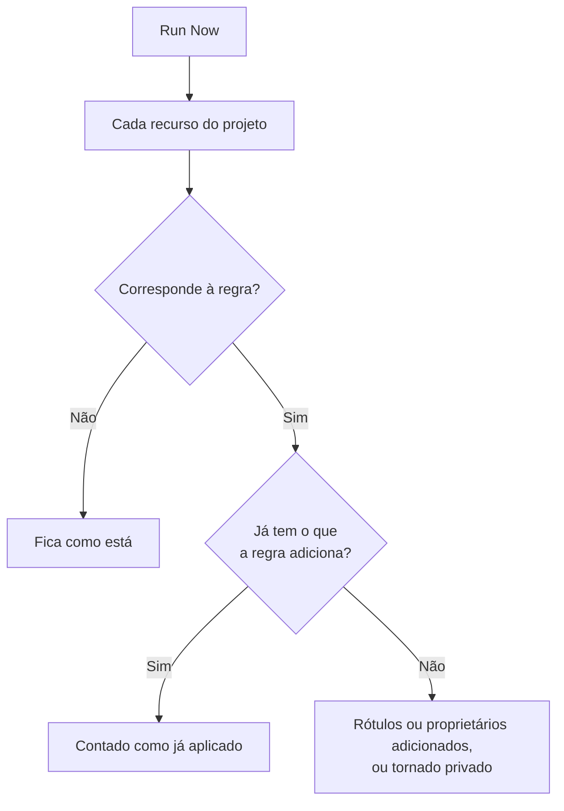

# Executar regras em recursos existentes

As regras de rótulos, de proprietários e de privacidade são executadas automaticamente quando um recurso é **criado**. Por isso, uma regra escrita hoje não muda nada nos monitores, incidentes ou hosts que você já tem. **Run Now** fecha essa lacuna: aplica uma regra a cada recurso que já existe no projeto.

## Quais regras podem ser executadas

- **Regras de Rótulos** e **Regras de proprietário**, para cada recurso que as tem: monitores, incidentes, episódios de incidente, alertas, episódios de alerta, eventos de manutenção programada, páginas de status, serviços, hosts, clusters Kubernetes, hosts Docker, clusters Docker Swarm, hosts Podman, clusters Proxmox, vCenters VMware, clusters Ceph, storage arrays, bancos de dados, filas, frotas de IoT, funções serverless, recursos de nuvem, aplicações RUM, dashboards, políticas de plantão, escalas de plantão, políticas de chamadas recebidas, workflows, runbooks, dispositivos de rede e SLOs.
- **Regras de privacidade**, para incidentes, alertas, episódios de incidente e episódios de alerta.
- **Monitor Rules** numa página de status. Elas já ressincronizam a página sempre que uma regra é salva; executar uma ressincroniza a página na hora.
- **Monitor Rules** num SLO. Elas já ressincronizam o SLO sempre que uma regra é salva; executar uma ressincroniza na hora os monitores do SLO. Veja [Monitores e regras de monitor](/docs/slo/monitor-rules).

As regras que executam uma ação em vez de descrever um recurso (**Regras de Plantão**, **Regras de runbook**, **Regras de remediação automática** e **Regras de agrupamento**) não podem ser executadas sobre registros existentes. Executá-las acionaria pessoas, rodaria runbooks, iniciaria correções ou reorganizaria episódios de incidentes que já terminaram.

## Antes de começar

Para executar uma regra você precisa de permissão para editar a regra **e** para editar os recursos que ela altera: por exemplo, uma regra de rótulos de monitores exige tanto a permissão de edição de regras de rótulos de monitores quanto a de edição de monitores. As regras de proprietários exigem também permissão para adicionar proprietários. As regras de monitores de uma página de status ou de um SLO exigem só permissão para editar a regra.

> [!IMPORTANT]
> Uma permissão restrita a certos rótulos, ou aos recursos dos quais você é proprietário, não basta: uma execução pode alterar todos os recursos do projeto. As listas de bloqueio das equipes valem como em qualquer outro lugar, e um bloqueio restrito a alguns rótulos também conta: uma execução alteraria os recursos que têm esses rótulos, então um bloqueio com rótulos sobre a edição dos recursos que uma regra altera recusa a execução.

As regras de uma rede pedem o mesmo quando você as executa sobre os dispositivos que já tem. **Run Now** de uma regra de atribuição de site ou de rótulos de dispositivo exige permissão para editar a regra e **Edit Network Device**. **Dry Run** e **Run Rule** de uma regra de importação automática exigem permissão para editar a regra, **Create Network Device** e, quando a regra tem um modelo de monitor, **Create Monitor**. Cada uma precisa abranger o projeto inteiro. Veja [Importar automaticamente com regras de importação automática](/docs/monitor/network-device-monitor#importing-automatically-with-auto-import-rules).

## Executar uma regra

:::steps
### Abrir a lista de regras

Abra a página de regras, por exemplo **Monitores → Configurações → Regras de Rótulos**.

### Selecionar Run Now

Abra o menu **⋯** no fim da linha da regra e selecione **Run Now**, ou selecione **Visualizar** e depois **Run Now** na página da regra. Uma caixa de diálogo diz o que a execução vai fazer.

### Decidir se avisa os novos proprietários

Numa regra de proprietários, escolha se quer **Notify the owners this run adds**. A opção vem desligada por padrão e só tem efeito quando a própria regra tem **Notificar proprietários** ligado. Um proprietário é avisado uma vez para cada recurso ao qual é adicionado.

### Disparar a regra

Selecione **Run Rule** e mantenha a caixa de diálogo aberta. Num projeto grande, a caixa de diálogo mostra até onde a execução chegou.

### Ler o relatório

Quando a execução termina, a caixa de diálogo informa com quantos recursos a regra correspondeu, quantos alterou e quantos já tinham o que a regra adiciona.
:::

## Executar várias regras

Selecione regras na tabela, abra o menu de ações em massa e escolha **Run Now**. As regras selecionadas são executadas uma depois da outra.

- Os proprietários adicionados por uma execução em massa nunca são avisados. Para avisá-los, execute uma única regra.
- Uma regra que não pode ser executada (por exemplo, porque está desabilitada) aparece com o motivo, e as outras regras são executadas mesmo assim.

## O que uma execução faz

- **Ela só adiciona.** Rótulos são adicionados, proprietários são adicionados, recursos se tornam privados. Nada é removido e nada se torna público, então executar uma regra de novo é seguro: a segunda execução informa que tudo já estava aplicado.
- **Cada recurso do projeto é avaliado**, inclusive incidentes e alertas resolvidos.
- **Os proprietários existentes são ignorados**, nunca adicionados duas vezes.
- **Só os rótulos do seu projeto são adicionados.** Um rótulo que a regra cita e que não é mais um dos rótulos do seu projeto é ignorado, e os outros rótulos da regra são adicionados mesmo assim. O mesmo vale quando uma regra é executada num recurso novo.
- **A regra é aplicada da mesma forma que na criação**, inclusive os rótulos e proprietários herdados dos monitores, hosts e serviços de um incidente. Quando o recurso tem um feed de atividade, o feed registra qual regra o alterou.
- **Regras desabilitadas não são executadas.** Habilite a regra primeiro.
- **As regras de monitores das páginas de status** adicionam os monitores com que correspondem e removem os que adicionaram antes e com que não correspondem mais. Os monitores adicionados à mão à página nunca são alterados.
- **Uma única execução abrange até 100.000 recursos.** Num projeto maior, a execução para e avisa; execute a regra de novo para continuar.

## Próximos passos

:::cards
- [Regras de rótulos e proprietários](/docs/configuration/label-and-owner-rules): Escrever as regras que uma execução aplica.
- [Importar e exportar regras de rótulos](/docs/configuration/label-rule-import-export): Trazer antes regras de rótulos de outro projeto.
- [Configurações e automação de incidentes](/docs/incidents/settings): As regras de incidentes, inclusive as de privacidade.
:::
