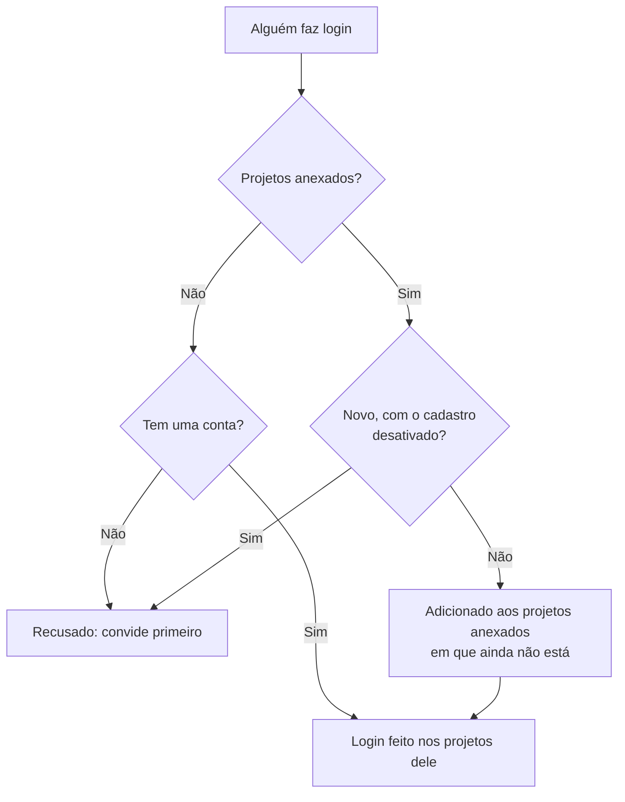

# SSO global

O SSO global permite que um **administrador da instância** do OneUptime (administrador mestre) configure **uma única vez**, no nível da instância, um provedor de identidade SAML 2.0 ou OpenID Connect (OIDC) e o conecte a qualquer projeto do servidor. Em vez de cada proprietário de projeto configurar o próprio provedor de identidade, um administrador mestre configura um que atende a instância inteira.

> [!NOTE]
> O SSO global, incluindo o interruptor "Require SSO for Login" para a instância inteira, faz parte de todas as edições do OneUptime: toda instância auto-hospedada o tem, inclusive a Community Edition, e ele não precisa de licença. É administração da instância, portanto não se aplica ao OneUptime Cloud. Consulte [Edição Enterprise](/docs/self-hosted/enterprise) para ver o que cada edição inclui.

:::cards
- [Configurar um provedor](#configurar-o-sso-global): Criá-lo, dar ao seu provedor de identidade as URLs do OneUptime e testá-lo.
- [Como os usuários fazem login](#como-os-usuários-fazem-login): Só membros existentes, ou recém-chegados adicionados aos projetos que você anexa.
- [Impor o SSO](#impor-o-sso): Exigir SSO em um projeto ou na instância inteira.
- [Desligar um provedor](#desligar-ou-excluir-um-provedor): O que termina e quais alterações o OneUptime recusa.
:::

## SSO global e SSO de projeto

|                     | SSO de projeto                                        | SSO global                                            |
| ------------------- | ----------------------------------------------------- | ----------------------------------------------------- |
| Configurado por     | Proprietário/administrador do projeto (Configurações do projeto) | Administrador mestre da instância (Admin Dashboard) |
| Escopo              | Um único projeto                                      | A instância inteira, conectável a qualquer projeto    |
| Resultado do login  | Acesso a esse único projeto                           | Acesso a todos os projetos que o usuário alcança      |

Para o provedor próprio de um único projeto, veja [SSO](/docs/identity/sso).

## Configurar o SSO global

:::steps
### Abrir a lista de provedores

:::tabs
@tab SAML
Faça login como administrador mestre e abra o Admin Dashboard com **Configurações de admin** no seu menu de usuário. Depois vá para **Configurações** > **Autenticação** > **Global SSO**.
@tab OpenID Connect
Faça login como administrador mestre e abra o Admin Dashboard com **Configurações de admin** no seu menu de usuário. Depois vá para **Configurações** > **Autenticação** > **Global OIDC**.
:::

### Criar o provedor

:::tabs
@tab SAML
- Clique em **Create Global SSO**.
- Informe um **Nome**, a **Sign On URL** e o **Issuer** do seu provedor de identidade, e cole o **Public Certificate**. Todo o resto já vem preenchido em **Mais campos**: o **Signature Method** (`RSA-SHA256`), o **Digest Method** (`SHA256`) e uma descrição (`Sign in with` seguido do nome). Altere-os apenas se o seu IdP exigir. Ao salvar, abre-se a página do provedor.
@tab OpenID Connect
- Clique em **Create Global OIDC**.
- Informe um **Nome**, a **Issuer URL**, o **Client ID** e o **Client Secret** do app que você registrou no seu IdP. Colar a URL de descoberta do IdP em **Issuer URL** também funciona. Todo o resto já vem preenchido em **Mais campos**: a **Discovery URL** (o emissor seguido de `/.well-known/openid-configuration`), os **Scopes** (`openid email profile`), os nomes das declarações `email` e `name`, e uma descrição (`Sign in with` seguido do nome). Altere-os apenas se o seu IdP exigir. Ao salvar, abre-se a página do provedor.
:::

### Copiar as URLs do OneUptime para o seu provedor de identidade

:::tabs
@tab SAML
Na página do provedor, o cartão **Identity Provider URLs** mostra a **ACS URL (Assertion Consumer Service / Reply URL)** e o **Issuer (Entity ID)**. Cole os dois no seu provedor de identidade (Okta, Microsoft Entra ID, OneLogin, JumpCloud e outros).
@tab OpenID Connect
Na página do provedor, o cartão **Identity Provider URL** mostra a **Redirect URI (Callback URL)**. Adicione-a às URIs de redirecionamento permitidas do seu provedor de identidade.
:::

### Ligar o provedor

Um provedor novo começa desligado. Clique em **Edit Configuration** na página do provedor e ative **Habilitado**.

Ligar um provedor global apenas adiciona uma opção "Sign in with SSO" na página de login — ele nunca impõe o SSO nem bloqueia ninguém, então é seguro ligá-lo, testá-lo e desligá-lo de novo se precisar.

### Testar o provedor

Use o link do cartão **Test this SSO provider** (**Test this OIDC provider** no OpenID Connect) para fazer um login completo pelo seu provedor de identidade. Você não precisa anexar nenhum projeto antes: o teste faz o seu login nos projetos dos quais você já faz parte. O provedor precisa estar ligado para o link funcionar.
:::

## Como os usuários fazem login

O comportamento de um provedor global depende de você anexar projetos a ele ou não:

- **Nenhum projeto anexado (todos os projetos / convite primeiro):** os usuários podem fazer login com o provedor e acessar **qualquer projeto do qual já sejam membros**. Usuários novos **não** são criados automaticamente — o usuário precisa ser convidado para um projeto primeiro. Use isso para um SSO de toda a empresa quando as associações são gerenciadas em outro lugar.

- **Projetos anexados (provisionamento automático):** Abra o provedor e use a tabela **Attached Projects** para anexar um ou mais projetos, cada um com um conjunto de equipes padrão. Os usuários que fazem login são **provisionados automaticamente** nesses projetos e adicionados às equipes padrão no primeiro login. Um projeto que você anexa começa com a equipe de membros dele; escolha outras equipes se os recém-chegados devem começar com outro acesso. Adicione um projeto + equipes por vez para construir a lista; para alterar um anexo, exclua-o e adicione-o novamente.

Quem já é membro de um projeto anexado mantém as equipes que tem lá.

Dois interruptores do provedor mudam isso. Os dois começam desligados, recolhidos em **Mais campos**:

| Interruptor | O que faz quando ligado |
| --- | --- |
| **Disable Sign Up with SSO** | As pessoas precisam ser convidadas para um projeto antes de poderem fazer login com este provedor, mesmo quando há projetos anexados. Ninguém novo é criado no primeiro login. |
| **Restrict to Attached Projects** | Fazer login com este provedor atende à exigência de SSO apenas nos projetos anexados a ele, então pessoas que já fizeram login podem perder o acesso a outros projetos. Quando desligado, atende à exigência em todos os projetos de que a pessoa faz parte, e os projetos anexados só decidem onde os recém-chegados são adicionados. |

## Impor o SSO

Configurar um provedor global não obriga ninguém a usá-lo; o login com senha continua funcionando. Para exigir SSO, ligue a exigência em um projeto ou na instância inteira:

- **Por projeto:** um projeto pode exigir SSO e, opcionalmente, um provedor *específico* (de projeto ou global). Veja [Exigir SSO no seu projeto](/docs/identity/sso#exigir-sso-no-seu-projeto).
- **Na instância inteira:** **Admin** > **Configurações** > **Autenticação** tem um interruptor **Exigir SSO para login** que impõe o SSO a todos os usuários da instância. Ele pede confirmação antes de ligar e salva assim que você confirma. Os administradores mestres continuam isentos para nunca ficarem sem acesso.

Ligar **Exigir SSO para login** exige um provedor de SSO que faça o login das pessoas, para que ninguém fique sem acesso por causa disso:

- Para a instância inteira, cada projeto que não exige SSO por conta própria precisa de um: um dos provedores SAML ou OIDC dele que esteja ligado, ou um provedor global ligado que faça login nele. Enquanto um projeto não tiver nenhum, ligar o interruptor é recusado, e a mensagem indica os projetos (ou, quando são muitos, os primeiros e quantos são). Ligue primeiro um provedor global, ou um provedor nesses projetos. Um projeto que exige um provedor específico precisa desse: enquanto ele estiver desligado, excluído ou não fizer login no projeto, a mensagem indica esse projeto à parte — ligue primeiro esse provedor ou exija outro lá.
- Para um projeto, o mesmo é pedido a esse projeto, e ao provedor que ele exige quando exige um.
- Um salvamento que envia **Exigir SSO para login** ligado quando ele já está ligado — junto com outras configurações ou pela API — é verificado da mesma forma, para a instância ou para um projeto, assim como um que indica o provedor que um projeto já exige.
- Para um projeto novo, que ainda não tem provedor próprio: enquanto a instância exigir SSO, criar um projeto exige um provedor global ligado que faça login em todos os projetos; caso contrário, ninguém, nem quem o criou, conseguiria abri-lo. Sem ele, a criação de um projeto é recusada, e a mensagem pede que um administrador do servidor ligue um. Administradores mestres continuam podendo criar projetos. Um projeto criado com **Exigir SSO para login** já ligado precisa do mesmo, não importa quem o cria.

Desligar nunca é recusado.

## Desligar ou excluir um provedor

Desligar um provedor global, excluí-lo ou restringi-lo aos projetos anexados encerra os logins que ele concedeu onde ele não faz mais login. Onde o SSO é exigido, quem fez login com ele precisa fazer login com SSO de novo na próxima solicitação, as páginas que tem abertas deixam de receber atualizações ao vivo na hora, e um cliente MCP que alguém conectou depois de fazer login com ele deixa de funcionar no projeto.

Ligar o provedor de novo não traz esses logins de volta: as pessoas fazem login com ele de novo. Um provedor que já estava desligado quando você atualizou conta como desligado na atualização.

Um novo certificado ou client secret, outras URLs ou um novo nome mantêm todos com o login feito.

### Todo projeto que exige SSO mantém uma forma de entrar

Um projeto que exige SSO, por conta própria ou porque a instância inteira exige, sempre mantém um provedor com que as pessoas conseguem fazer login nele. Por isso, estas alterações são recusadas enquanto deixariam um projeto assim sem nenhum provedor, ou tirariam dele o provedor que exige:

- desligar um provedor global, excluí-lo ou restringi-lo aos projetos anexados;
- em um provedor restrito aos projetos anexados: anexar o primeiro projeto (até lá ele faz login em todos os projetos), desligar um anexo, movê-lo para outro projeto ou provedor, ou removê-lo.

A mensagem indica os projetos, ou os primeiros e quantos são. Ligue primeiro outro provedor para eles, um próprio ou um global, ou desligue lá **Exigir SSO para login**. Um projeto que exige exatamente este provedor é indicado à parte: exija primeiro outro provedor lá ou desligue **Exigir SSO para login**.

As alterações que permitem a um provedor fazer o login de mais pessoas — ligá-lo ou ligar um anexo, retirar a restrição — nunca são recusadas. Elas chegam a todos os servidores de aplicação na hora, como desligar **Exigir SSO para login**: as pessoas podem fazer login com o provedor imediatamente. Só quando outra alteração do mesmo provedor é salva nesse mesmo instante um servidor de aplicação pode levar até um minuto para acompanhar.

Duas alterações sobre quem pode fazer login são verificadas uma depois da outra. Se outra estiver sendo salva no mesmo momento e demorar mais que o normal — ligar **Exigir SSO para login** na instância inteira lê todos os projetos —, uma alteração é recusada com "Another change to who can sign in with SSO is being saved. Try again in a moment.": salve-a de novo. Um projeto criado nesse momento também espera pela alteração e, se esperar demais, é recusado com "The server's SSO settings are being changed. Create the project again in a moment."

## Solução de problemas

:::details "You must be invited to a project on this OneUptime instance before you can sign in with SSO"
A pessoa ainda não tem conta no OneUptime, e o provedor não cria uma: ou não há projetos anexados a ele, ou **Disable Sign Up with SSO** está ligado. Convide-a para um projeto ou anexe um projeto ao provedor.
:::

:::details "This SSO provider does not grant access to any project you are a member of"
**Restrict to Attached Projects** está ligado, e a pessoa não é membro de nenhum projeto anexado ao provedor. Anexe um dos projetos dela ou adicione-a a um projeto anexado.
:::

:::details "You are not a member of any project on this OneUptime instance"
A pessoa tem conta, mas não pertence a nenhum projeto, e o provedor não tem onde adicioná-la. Convide-a para um projeto ou anexe ao provedor um projeto com equipes padrão.
:::

:::details "Issuer URL does not match"
Em um provedor SAML, o emissor na resposta do seu provedor de identidade não é o **Issuer** salvo no provedor. Copie-o de novo do seu provedor de identidade; os dois precisam corresponder exatamente.
:::

## Próximos passos

:::cards
- [SSO](/docs/identity/sso): Configurar o provedor SAML ou OIDC próprio de um projeto.
- [SCIM](/docs/identity/scim): Deixe seu provedor de identidade adicionar e remover pessoas automaticamente.
- [Usuários, equipes e permissões](/docs/permissions/index): O que as equipes em que os recém-chegados entram permitem que eles façam.
:::
