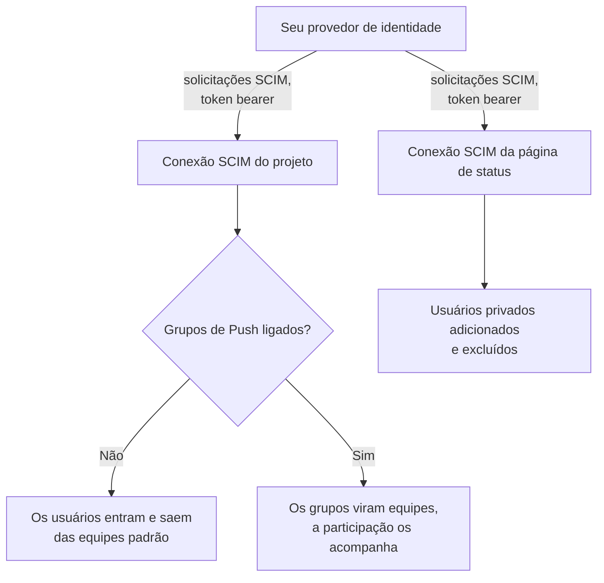
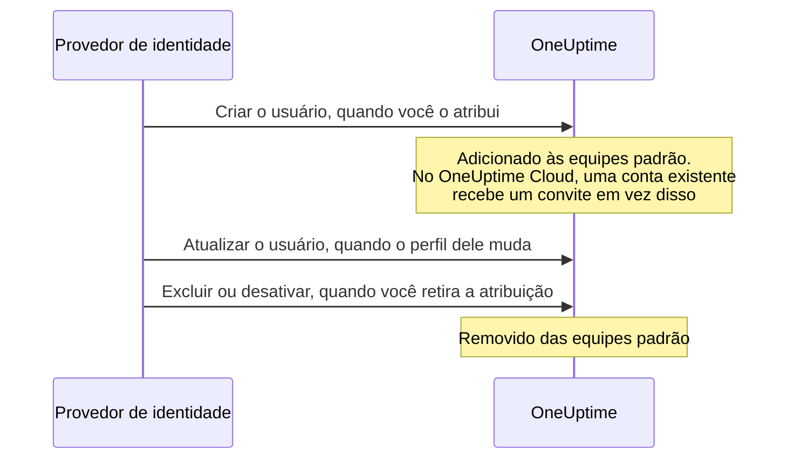

# SCIM

O SCIM (System for Cross-domain Identity Management) provisiona e desprovisiona pessoas automaticamente. Seu provedor de identidade (IdP) — Microsoft Entra ID, Okta ou qualquer outro sistema SCIM 2.0 — adiciona pessoas aos seus projetos do OneUptime e às páginas de status privadas quando você as atribui, e as remove quando você retira a atribuição.

> [!NOTE]
> **Edição:** o SCIM faz parte da Enterprise Edition do OneUptime. No OneUptime Cloud, ele está disponível a partir do plano **Scale**. As instalações auto-hospedadas precisam da imagem da Enterprise Edition e de uma licença. Consulte [Edição Enterprise](/docs/self-hosted/enterprise). Sem uma licença válida (após o teste de 14 dias, ou 30 dias depois que uma licença expira), as solicitações SCIM são recusadas até que uma licença seja ativada.

:::cards
- [Configurar o SCIM de projeto](#configurar-o-scim-de-projeto): Criar uma conexão e dar ao seu IdP a URL e o token dela.
- [Configurar o SCIM de página de status](#configurar-o-scim-de-página-de-status): Provisionar os usuários privados de uma página de status.
- [Conectar seu provedor de identidade](#configurar-seu-provedor-de-identidade): Passo a passo para o Microsoft Entra ID e o Okta.
- [Perguntas frequentes](#perguntas-frequentes): Usuários existentes, desprovisionamento, alterações de email.
:::

## Como funciona

Seu provedor de identidade chama o endpoint SCIM do OneUptime, autenticado com um token bearer, sempre que você atribui, altera ou retira a atribuição de alguém. O que a solicitação altera depende de onde a conexão está:



A integração com o SCIM oferece estes benefícios:

- **Provisionamento automático de usuários**: os usuários são criados no OneUptime quando são atribuídos no seu IdP.
- **Desprovisionamento automático de usuários**: os usuários são removidos do OneUptime quando a atribuição deles é retirada no seu IdP.
- **Sincronização de atributos de usuário**: as informações dos usuários ficam iguais no seu IdP e no OneUptime.
- **Gestão centralizada de acesso**: o acesso ao OneUptime é gerenciado a partir do seu sistema de gestão de identidade atual.

O SCIM e o [SSO](/docs/identity/sso) são independentes: o SCIM decide quem está em um projeto, o SSO como as pessoas fazem login. A maioria das organizações usa os dois.

## SCIM para projetos

O SCIM de projeto permite que provedores de identidade gerenciem os membros das equipes nos projetos do OneUptime.

### Configurar o SCIM de projeto

Só um proprietário do projeto pode adicionar ou alterar a conexão SCIM de um projeto, ou ver ou redefinir o token bearer dela: por meio do SCIM, seu provedor de identidade pode adicionar pessoas a qualquer equipe do projeto.
:::steps
1. **Abrir as configurações do projeto**

   - Abra seu projeto no OneUptime
   - Vá para **Configurações do projeto** > **Segurança** > **SCIM**

2. **Definir as configurações do SCIM**

   - Informe um **Nome**. **Equipes Padrão** começa com a equipe de membros do seu projeto: os usuários novos são adicionados a essas equipes
   - Em **Mais campos**, **Provisionar usuários automaticamente** (adicionar usuários quando são atribuídos no seu IdP) e **Desprovisionar usuários automaticamente** (remover usuários quando a atribuição deles é retirada no seu IdP) estão ligados, e **Habilitar grupos de push** está desligado. Altere-os lá se precisar
   - Salve. A caixa de diálogo com a **SCIM Base URL** e o **Bearer Token** para a configuração do seu IdP abre na hora

3. **Configurar seu provedor de identidade**

   - Use a **SCIM Base URL** da caixa de diálogo. No OneUptime Cloud, ela é `https://oneuptime.com/identity/scim/v2/<scim-id>`; uma instalação auto-hospedada mostra o próprio host
   - Configure a autenticação por token bearer com o **Bearer Token** da caixa de diálogo
   - Mapeie os atributos de usuário (o email é obrigatório). [Configurar seu provedor de identidade](#configurar-seu-provedor-de-identidade) traz os detalhes para o Microsoft Entra ID e o Okta
:::

Para ver as URLs de novo, selecione **Ver URLs do SCIM** na linha da conexão. **Redefinir token Bearer** substitui o token; atualize seu provedor de identidade com o novo.

### Como um usuário de projeto é provisionado



Quem já tinha uma conta do OneUptime entra depois de aceitar o convite no OneUptime Cloud (veja as [perguntas frequentes](#perguntas-frequentes)). O acesso concedido por equipes que não são as equipes padrão da conexão não é alterado.

## SCIM para páginas de status

O SCIM de página de status permite que provedores de identidade provisionem e desprovisionem os usuários privados de páginas de status, que podem acessar as páginas de status privadas.

### Configurar o SCIM de página de status

:::steps
1. **Abrir as configurações da página de status**

   - Abra **Páginas de status** e selecione sua página de status
   - Vá para **Segurança** > **SCIM**

2. **Definir as configurações do SCIM**

   - Informe um **Nome**. Em **Mais campos**, **Provisionar usuários automaticamente** (adicionar usuários privados quando são atribuídos no seu IdP) e **Desprovisionar usuários automaticamente** (excluir usuários privados quando a atribuição deles é retirada no seu IdP) estão ligados. Altere-os lá se precisar
   - Salve. A caixa de diálogo com a **SCIM Base URL** e o **Bearer Token** para a configuração do seu IdP abre na hora

3. **Configurar seu provedor de identidade**

   - Use a **SCIM Base URL** da caixa de diálogo. No OneUptime Cloud, ela é `https://oneuptime.com/identity/status-page-scim/v2/<scim-id>`
   - Configure a autenticação por token bearer com o token fornecido
   - Mapeie os atributos de usuário (o email é obrigatório)
:::

Para ver as URLs de novo, selecione **Mostrar URLs de endpoint SCIM** na linha da conexão.

O SCIM de página de status só aceita usuários. Ele não aceita grupos nem o provisionamento de grupos.

### Como um usuário privado é provisionado

```mermaid title="A vida de um usuário privado com o SCIM de página de status"
sequenceDiagram
    participant IdP as Provedor de identidade
    participant O as OneUptime
    IdP->>O: Criar o usuário, quando você o atribui
    Note over O: O usuário privado pode acessar<br/>a página de status privada
    IdP->>O: Excluir, ou definir active como false
    Note over O: Usuário privado e as<br/>sessões dele excluídos
```

> [!WARNING]
> O desprovisionamento exclui de forma permanente o usuário privado da página de status e todas as sessões dele nessa página de status. Se o usuário for atribuído de novo mais tarde, ele é provisionado como um novo usuário privado. Quando **Desprovisionar usuários automaticamente** está desligado, as atualizações que definem `active` como `false` são ignoradas e as solicitações DELETE são recusadas.

## Configurar seu provedor de identidade

Cada provedor abaixo começa criando uma conexão SCIM de projeto no OneUptime e depois conecta seu provedor de identidade a ela.

### Microsoft Entra ID (antes Azure AD)

O Microsoft Entra ID oferece gestão de identidade de nível empresarial com provisionamento SCIM. Você precisa de:

- Um tenant do Microsoft Entra ID com licença Premium P1 ou P2 (necessária para o provisionamento automático).
- Um projeto do OneUptime no plano **Scale** ou superior no OneUptime Cloud.
- Acesso de administrador ao Microsoft Entra ID e ao OneUptime.

:::steps
#### Criar a conexão SCIM para o Entra ID

1. Faça login no seu painel do OneUptime
2. Vá para **Configurações do projeto** > **Segurança** > **SCIM**
3. Clique em **Criar: SCIM**
4. Informe um nome descritivo (por exemplo, "Microsoft Entra ID Provisioning")
5. Confira as opções:
   - **Equipes Padrão**: começa com a equipe de membros do seu projeto; os usuários novos são adicionados a essas equipes
   - **Provisionar usuários automaticamente** e **Desprovisionar usuários automaticamente**: ligados, em **Mais campos**
   - **Habilitar grupos de push**: em **Mais campos**; ligue se quiser gerenciar a participação nas equipes com grupos do Entra ID
6. Salve a configuração
7. Copie a **SCIM Base URL** e o **Bearer Token** da caixa de diálogo que abrir — você vai precisar deles no Entra ID

#### Criar um aplicativo empresarial no Entra ID

1. Entre no [Microsoft Entra admin center](https://entra.microsoft.com)
2. Vá para **Identity** > **Applications** > **Enterprise applications**
3. Clique em **+ New application** e depois em **+ Create your own application**
4. Informe um nome (por exemplo, "OneUptime")
5. Selecione **Integrate any other application you don't find in the gallery (Non-gallery)** e clique em **Create**

#### Conectar o Entra ID ao OneUptime

1. No seu aplicativo empresarial do OneUptime, vá para **Provisioning** e clique em **Get started**
2. Defina **Provisioning Mode** como **Automatic**
3. Em **Admin Credentials**, defina **Tenant URL** como a **SCIM Base URL** do OneUptime (por exemplo, `https://oneuptime.com/identity/scim/v2/<scim-id>`) e **Secret Token** como o **Bearer Token**
4. Clique em **Test Connection** para verificar a configuração e depois em **Save**

#### Mapear os atributos de usuário no Entra ID

1. Na seção Provisioning, clique em **Mappings** e depois em **Provision Azure Active Directory Users**
2. Configure os mapeamentos de atributos abaixo, remova os que não precisar e clique em **Save**:

| Atributo do Azure AD                                          | Atributo SCIM do OneUptime     | Obrigatório  |
| ------------------------------------------------------------- | ------------------------------ | ------------ |
| `userPrincipalName`                                           | `userName`                     | Sim          |
| `mail`                                                        | `emails[type eq "work"].value` | Recomendado  |
| `displayName`                                                 | `displayName`                  | Recomendado  |
| `givenName`                                                   | `name.givenName`               | Opcional     |
| `surname`                                                     | `name.familyName`              | Opcional     |
| `Switch([IsSoftDeleted], , "False", "True", "True", "False")` | `active`                       | Recomendado  |

#### Mapear os grupos no Entra ID (opcional)

Se você ligou **Habilitar grupos de push** no OneUptime:

1. Volte a **Mappings** e clique em **Provision Azure Active Directory Groups**
2. Defina **Enabled** como **Yes**
3. Configure os mapeamentos de atributos abaixo e clique em **Save**:

| Atributo do Azure AD | Atributo SCIM do OneUptime |
| -------------------- | -------------------------- |
| `displayName`        | `displayName`              |
| `members`            | `members`                  |

#### Atribuir usuários e grupos no Entra ID

1. No seu aplicativo empresarial do OneUptime, vá para **Users and groups**
2. Clique em **+ Add user/group**, selecione os usuários e grupos a provisionar no OneUptime e clique em **Assign**

#### Iniciar o provisionamento no Entra ID

1. Vá para **Provisioning** > **Overview** e clique em **Start provisioning**
2. O ciclo de provisionamento inicial começa; a primeira sincronização pode levar até 40 minutos
3. Acompanhe os erros nos **Provisioning logs**. As pessoas que você atribuiu aparecem nas equipes do projeto no OneUptime
:::

### Okta

O Okta oferece uma gestão de identidade flexível com suporte a SCIM. Você precisa de:

- Um tenant do Okta com provisionamento (o recurso Lifecycle Management).
- Um projeto do OneUptime no plano **Scale** ou superior no OneUptime Cloud.
- Acesso de administrador ao Okta e ao OneUptime.

:::steps
#### Criar a conexão SCIM para o Okta

1. Faça login no seu painel do OneUptime
2. Vá para **Configurações do projeto** > **Segurança** > **SCIM**
3. Clique em **Criar: SCIM**
4. Informe um nome descritivo (por exemplo, "Okta Provisioning")
5. Confira as opções:
   - **Equipes Padrão**: começa com a equipe de membros do seu projeto; os usuários novos são adicionados a essas equipes
   - **Provisionar usuários automaticamente** e **Desprovisionar usuários automaticamente**: ligados, em **Mais campos**
   - **Habilitar grupos de push**: em **Mais campos**; ligue se quiser gerenciar a participação nas equipes com grupos do Okta
6. Salve a configuração
7. Copie a **SCIM Base URL** e o **Bearer Token** da caixa de diálogo que abrir — você vai precisar deles no Okta

#### Criar ou abrir o aplicativo do Okta

No Okta Admin Console, vá para **Applications** > **Applications**:

- Se você já usa o Okta para o SSO do OneUptime, abra esse aplicativo.
- Caso contrário, clique em **Create App Integration**, selecione **SAML 2.0**, dê o nome "OneUptime" e conclua a configuração SAML (veja [SSO](/docs/identity/sso)).

#### Ativar o provisionamento SCIM no Okta

1. No seu aplicativo do OneUptime, vá para a aba **General**
2. Na seção **App Settings**, clique em **Edit**, selecione **SCIM** em **Provisioning** e clique em **Save**
3. Aparece uma nova aba **Provisioning**

#### Conectar o Okta ao OneUptime

1. Na aba **Provisioning**, clique em **Integration**, depois em **Configure API Integration**, e marque **Enable API integration**
2. Configure o seguinte:
   - **SCIM connector base URL**: a **SCIM Base URL** do OneUptime (por exemplo, `https://oneuptime.com/identity/scim/v2/<scim-id>`)
   - **Unique identifier field for users**: `userName`
   - **Supported provisioning actions**: Import New Users and Profile Updates, Push New Users, Push Profile Updates e, se você usa provisionamento por grupos, Push Groups
   - **Authentication Mode**: **HTTP Header**
   - **Authorization**: o **Bearer Token** do OneUptime. O OneUptime espera o cabeçalho `Authorization: Bearer <token>`; se o Okta já mostrar a palavra Bearer antes do campo, informe só o token
3. Clique em **Test API Credentials** para verificar a conexão e depois em **Save**

#### Escolher o que o Okta provisiona

1. Na aba **Provisioning**, clique em **To App** e depois em **Edit**
2. Ative **Create Users**, **Update User Attributes** e **Deactivate Users** e clique em **Save**

#### Mapear os atributos de usuário no Okta

Role até **Attribute Mappings** e confira estes mapeamentos. Remova os que não precisar:

| Atributo do Okta   | Atributo SCIM do OneUptime      | Direção          |
| ------------------ | ------------------------------- | ---------------- |
| `userName`         | `userName`                      | Do Okta para o app |
| `user.email`       | `emails[primary eq true].value` | Do Okta para o app |
| `user.firstName`   | `name.givenName`                | Do Okta para o app |
| `user.lastName`    | `name.familyName`               | Do Okta para o app |
| `user.displayName` | `displayName`                   | Do Okta para o app |

#### Enviar grupos do Okta (opcional)

Se você ligou **Habilitar grupos de push** no OneUptime:

1. Vá para a aba **Push Groups** e clique em **+ Push Groups**
2. Selecione **Find groups by name** ou **Find groups by rule**
3. Procure e selecione os grupos a enviar e clique em **Save**

#### Atribuir pessoas no Okta

1. Vá para a aba **Assignments**
2. Clique em **Assign** > **Assign to People** ou **Assign to Groups**, selecione quem provisionar, clique em **Assign** para cada um e depois em **Done**

#### Verificar o provisionamento no Okta

1. Vá para **Reports** > **System Log** no Okta Admin Console e filtre pelo seu aplicativo do OneUptime
2. Confira se os eventos de provisionamento foram bem-sucedidos e se as pessoas aparecem nas equipes do projeto no OneUptime
:::

### Outros provedores de identidade

A implementação SCIM do OneUptime segue a especificação SCIM v2.0 e funciona com qualquer provedor de identidade compatível:

| Configuração | Valor |
| --- | --- |
| SCIM Base URL | A **SCIM Base URL** do OneUptime: `https://oneuptime.com/identity/scim/v2/<scim-id>` para um projeto, ou `https://oneuptime.com/identity/status-page-scim/v2/<scim-id>` para uma página de status |
| Autenticação | Token HTTP Bearer |
| Identificador único do usuário | `userName`, que precisa ser um endereço de email válido |
| Operações | GET, POST, PUT, PATCH e DELETE para Users, no SCIM de projeto e de página de status. Groups só são aceitos no SCIM de projeto. |

## Referência da API SCIM

Os caminhos são relativos à **SCIM Base URL** da conexão.

| Endpoint                 | Métodos                 | Descrição                                                 |
| ------------------------ | ----------------------- | --------------------------------------------------------- |
| `/ServiceProviderConfig` | GET                     | Recursos do servidor SCIM                                 |
| `/Schemas`               | GET                     | Esquemas de recursos disponíveis                          |
| `/ResourceTypes`         | GET                     | Tipos de recursos disponíveis                             |
| `/Users`                 | GET, POST               | Listar e criar usuários                                   |
| `/Users/{id}`            | GET, PUT, PATCH, DELETE | Gerenciar um usuário                                      |
| `/Groups`                | GET, POST               | Listar e criar grupos/equipes (só SCIM de projeto)        |
| `/Groups/{id}`           | GET, PUT, PATCH, DELETE | Gerenciar um grupo (só SCIM de projeto)                   |
| `/Bulk`                  | POST                    | Várias operações em uma única solicitação                 |

O que o `/ServiceProviderConfig` informa:

| Recurso | Suportado |
| --- | --- |
| PATCH | Sim |
| Bulk | Sim, até 1.000 operações e 1 MB por solicitação |
| Filtro | Sim, até 200 resultados |
| Ordenação | Sim |
| Alteração de senha | Não |
| ETag | Não |
| Autenticação | Token HTTP Bearer |

Um grupo criado pelo seu provedor de identidade vira uma equipe com o mesmo nome no projeto; se já existir uma equipe com esse nome, ela é usada em vez de criar uma nova.

:::details Esquema de usuário do SCIM
```json
{
  "schemas": ["urn:ietf:params:scim:schemas:core:2.0:User"],
  "userName": "user@example.com",
  "name": {
    "givenName": "John",
    "familyName": "Doe",
    "formatted": "John Doe"
  },
  "displayName": "John Doe",
  "emails": [
    {
      "value": "user@example.com",
      "type": "work",
      "primary": true
    }
  ],
  "active": true
}
```
:::

:::details Esquema de grupo do SCIM
```json
{
  "schemas": ["urn:ietf:params:scim:schemas:core:2.0:Group"],
  "displayName": "Engineering Team",
  "members": [
    {
      "value": "user-id-here",
      "display": "user@example.com"
    }
  ]
}
```
:::

## Planos e licenças

No OneUptime Cloud, o SCIM precisa do plano **Scale**. Uma instalação auto-hospedada precisa da Enterprise Edition e de uma licença, como diz a nota no topo desta página.

### Abaixo do plano Scale

No OneUptime Cloud, o provisionamento SCIM só funciona por completo enquanto o projeto estiver no **Scale** ou acima. Abaixo dele — depois que um teste do Scale termina ou o plano é reduzido —, as conexões SCIM do projeto, e as das páginas de status dele, apenas removem pessoas, então quem sai continua perdendo o acesso:

- **Continua funcionando:** desativar um usuário (`active` definido como `false`, em uma conexão configurada para remover as pessoas que desativa), excluir um usuário, remover membros de um grupo (o `Remove` do Entra ID em `members` com os membros como valor, o `remove` do Okta em `members[value eq "..."]`, ou substituir os membros por alguns dos que o grupo já tem), excluir um grupo e uma solicitação `Bulk` feita só de `DELETE`s. As consultas também são respondidas — listar e filtrar usuários e grupos, o que os provedores de identidade fazem antes de remover alguém —, mas abaixo do plano uma consulta nunca cria ninguém.
- **Recusado:** criar um usuário ou um grupo, reativar um usuário (`active` definido como `true` para alguém que a conexão adicionaria de volta a uma das equipes dela), adicionar alguém a um grupo em que a pessoa não está, e alterar só o email ou o nome de um usuário ou o nome de um grupo. Uma solicitação que adiciona qualquer pessoa é recusada por inteiro, mesmo que também remova pessoas, porque um `PATCH` do SCIM é tudo ou nada. A recusa é um `402` com um erro no formato SCIM, que seu provedor de identidade mostra: `SCIM provisioning needs the Scale plan. This project's plan does not include it, so its SCIM connections can only remove people: requests that add or change people or groups are refused. The connections are kept: upgrade the project to Scale in Project Settings > Billing and they work fully again.` Cada recusa também aparece nos registros SCIM da conexão.
- **Uma remoção que também altera um perfil** — uma desativação que envia um novo email ou nome, ou uma atualização de grupo que remove membros e renomeia o grupo — é aplicada e mantém o email, o nome ou o nome do grupo como estão. Os provedores de identidade reenviam o que veem diferente, então uma alteração recusada uma vez volta nas solicitações seguintes, e uma remoção nunca espera pelo plano. Uma desativação em uma conexão que não remove as pessoas que desativa (desprovisionamento automático desligado, ou grupos enviados no lugar) não remove ninguém, então um novo email ou nome enviado junto é recusado como uma alteração isolada.
- **Uma solicitação que não altera nada é respondida normalmente** — o `PUT` do Okta de um usuário como ele está, com `active` definido como `true`, para alguém que já está em todas as equipes da conexão; adicionar alguém a um grupo em que já está; um email reenviado com outras maiúsculas e minúsculas; atributos que o OneUptime não guarda, como um cargo ou um departamento. O usuário privado de uma página de status está na página ou não está, então `active` definido como `true` nunca o altera.

Nada é excluído. Mude para o plano **Scale** e as conexões voltam a funcionar por completo como estão, com o mesmo token bearer e nada para configurar de novo no seu provedor de identidade; uma mudança de plano vale em até um minuto. Os provedores de identidade continuam chamando no próprio ritmo: o Okta lista as recusas entre os erros de provisionamento, e o Entra ID as mostra nos registros de provisionamento e pode colocar em quarentena um trabalho que falha repetidamente, o que deixa as sincronizações — inclusive as remoções — em cerca de uma por dia. Reinicie o provisionamento lá depois de mudar de plano, para que as pessoas adicionadas nesse meio-tempo sejam provisionadas.

Abaixo do **Scale**, **Configurações do projeto** > **Segurança** > **SCIM**, e a página **SCIM** de uma página de status, listam as conexões abaixo da oferta do plano (**Conexões SCIM ainda configuradas**) e informam que elas apenas removem pessoas. Exclua uma conexão para removê-la. Adicionar uma conexão, alterar uma ou substituir o token bearer dela requer o **Scale**. A lista não mostra os tokens bearer, e só os proprietários do projeto podem ler um token, em qualquer plano.

## Solução de problemas

Comece pela aba **Registros** de **Configurações do projeto** > **Segurança** > **SCIM** (ou da página **SCIM** da página de status). Ela lista as solicitações SCIM que seu provedor de identidade enviou, com o status delas, e **Ver detalhes** mostra a solicitação e o que o OneUptime respondeu.

:::details Entra ID: Test Connection falha
Confira se **Tenant URL** é exatamente a **SCIM Base URL** que o OneUptime mostra, e se **Secret Token** é o **Bearer Token** atual. Depois de **Redefinir token Bearer**, o token antigo deixa de funcionar.
:::

:::details Okta: o teste das credenciais da API falha, ou as solicitações recebem 401 Unauthorized
Confira a **SCIM connector base URL** e o token. O OneUptime lê o cabeçalho `Authorization: Bearer <token>`, então garanta que a palavra Bearer seja enviada exatamente uma vez. Se o token foi perdido ou vazou, selecione **Redefinir token Bearer** no OneUptime e atualize o Okta.
:::

:::details Os usuários não são provisionados
Confira se os usuários estão atribuídos ao aplicativo no seu provedor de identidade, se o provisionamento está ligado lá e se os mapeamentos de atributos estão corretos. No Entra ID, os **Provisioning logs** mostram cada erro; no Okta, o **System Log**.
:::

:::details Usuários duplicados no Okta
Garanta que `userName` seja único e corresponda ao endereço de email do usuário.
:::

:::details Falhas ao enviar grupos
Confira se os grupos existem no seu provedor de identidade e têm os membros certos, e se **Habilitar grupos de push** está ligado no OneUptime.
:::

:::details As alterações do Entra ID demoram a chegar
O Entra ID provisiona no próprio ritmo: a primeira sincronização pode levar até 40 minutos, e as seguintes acontecem mais ou menos a cada 40 minutos. Um trabalho que o Entra ID colocou em quarentena sincroniza com menos frequência; corrija os erros nos **Provisioning logs** dele e reinicie-o.
:::

## Perguntas frequentes

:::details O que acontece quando um usuário é desprovisionado?
O desprovisionamento pode ser pedido com uma solicitação DELETE ou definindo `active` como `false` em uma atualização PUT/PATCH:

- **SCIM de projeto**: com **Desprovisionar usuários automaticamente** ligado, o usuário é removido das equipes padrão configuradas nas definições do SCIM, enquanto a conta do OneUptime dele é mantida. O acesso concedido por outras equipes não é afetado. Quando os grupos de push estão ligados, a participação nas equipes é gerenciada pelo provisionamento de grupos.
- **SCIM de página de status**: com **Desprovisionar usuários automaticamente** ligado, o usuário privado da página de status e todas as sessões dele nessa página de status são excluídos de forma permanente. Isso não exclui uma conta de usuário de projeto do OneUptime separada.
:::

:::details Posso usar o SCIM sem SSO?
Sim, o SCIM e o SSO são recursos independentes. Você pode usar o SCIM para provisionar usuários e deixar que eles façam login com as senhas do OneUptime ou com qualquer outro método de autenticação.
:::

:::details Como lidar com usuários que já existem no OneUptime?
Quando o SCIM tenta criar um usuário que já existe (correspondendo por email), o OneUptime não cria um usuário duplicado. O que acontece em seguida depende de onde o OneUptime é executado:

- **Auto-hospedado**: o usuário existente é adicionado imediatamente às equipes padrão configuradas (ou à equipe do grupo, com grupos de push).
- **OneUptime Cloud**: Uma conta do OneUptime pertence à pessoa, não a um projeto específico, então o SCIM não pode tornar alguém membro do seu projeto por conta própria. Em vez disso, o usuário existente é **convidado** para as equipes e recebe o email de convite habitual. Ele entra quando aceita os convites em **Convites do projeto** no OneUptime, ou quando confirma o single sign-on (SSO) do seu projeto pelo email que o OneUptime envia no primeiro login com SSO. Até lá, ele aparece como pendente. O mesmo vale quando um grupo adiciona um usuário existente que ainda não é membro do seu projeto.

Usuários que o próprio SCIM cria e usuários que são membros do seu projeto são adicionados imediatamente em ambos os casos. Confirmar o SSO do seu projeto torna alguém membro, então essa pessoa também é adicionada imediatamente; quem saiu do seu projeto desde então é convidado novamente.
:::

:::details O SCIM pode alterar o endereço de email ou o nome de um usuário?
O endereço de email de uma conta do OneUptime é o que a pessoa usa para fazer login em todos os projetos dos quais faz parte, e é para onde vão os links de redefinição de senha. Por isso:

- **OneUptime Cloud**: O SCIM nunca altera um endereço de email. Uma solicitação que alteraria um é recusada com um erro SCIM `400` do tipo `mutability`, e nada dessa solicitação é aplicado; seu provedor de identidade mostra o motivo. Peça ao usuário que altere o endereço no próprio perfil do OneUptime. Uma solicitação que repete o endereço que a conta já tem não é uma alteração e é bem-sucedida.
- **Auto-hospedado**: o SCIM altera o endereço de email apenas de um usuário que entrou neste projeto, não pertence a nenhum outro projeto e não é administrador do OneUptime. Qualquer outra alteração é recusada da mesma forma.

Os nomes seguem a mesma regra em todos os casos: o SCIM atualiza o nome apenas de um usuário que entrou neste projeto, não pertence a nenhum outro projeto e não é administrador do OneUptime. Para qualquer outra pessoa, o nome permanece como está e o restante da solicitação ainda é bem-sucedido.
:::

:::details Qual é a diferença entre as equipes padrão e os grupos de push?
- **Equipes Padrão**: todos os usuários provisionados via SCIM são adicionados às mesmas equipes predefinidas
- **Grupos de Push**: a participação nas equipes é gerenciada pelo seu provedor de identidade, permitindo que usuários diferentes fiquem em equipes diferentes de acordo com os grupos do IdP de que fazem parte
:::

:::details Com que frequência a sincronização acontece?
Isso depende do seu provedor de identidade:

- **Microsoft Entra ID**: a sincronização inicial pode levar até 40 minutos; as seguintes acontecem a cada 40 minutos
- **Okta**: quase em tempo real para a maioria das operações, com sincronizações completas periódicas
:::

## Próximos passos

:::cards
- [SSO](/docs/identity/sso): Deixe as pessoas que o SCIM provisiona fazerem login com seu provedor de identidade.
- [Usuários, equipes e permissões](/docs/permissions/index): O que as equipes padrão permitem que os usuários novos façam.
- [SSO global](/docs/identity/global-sso): Um único provedor de identidade para todos os projetos de uma instância auto-hospedada.
:::
