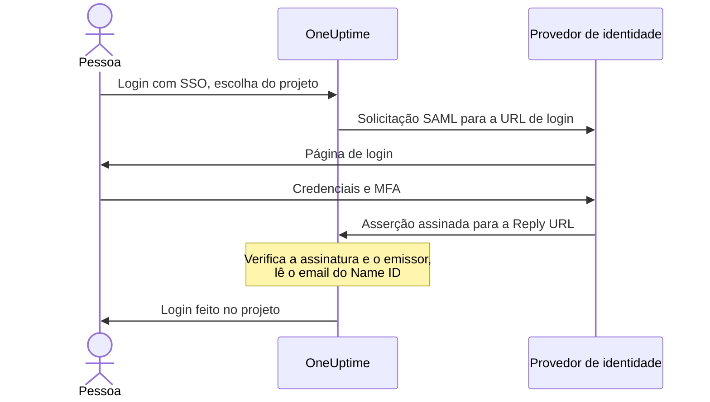

# SSO

O single sign-on (SSO) permite que as pessoas do seu projeto façam login no OneUptime com o provedor de identidade (IdP) da sua organização, via SAML 2.0 ou OpenID Connect. Você gerencia acesso, senhas e autenticação multifator em um só lugar, e pode exigir SSO de todos no projeto.

> [!NOTE]
> **Edição:** o SSO, incluindo "Require SSO for login", faz parte de todas as edições do OneUptime: as instalações auto-hospedadas o têm na Community Edition, sem precisar de licença. No OneUptime Cloud, ele está disponível a partir do plano **Scale**. Consulte [Edição Enterprise](/docs/self-hosted/enterprise) para ver o que cada edição inclui.

:::cards
- [Configurar um provedor SAML](#configurar-o-sso): Criá-lo no OneUptime e dar duas URLs ao seu IdP.
- [Guias de provedores de identidade](#guias-de-provedores-de-identidade): Keycloak, Microsoft Entra ID e Okta, passo a passo.
- [OpenID Connect](#openid-connect-oidc): Fazer login por meio de um app OIDC.
- [Exigir SSO](#exigir-sso-no-seu-projeto): Tornar o SSO a única forma de entrar no projeto.
:::

## Como funciona o login SAML

Um provedor SAML conecta um projeto a um aplicativo no seu provedor de identidade. Quem faz login escolhe o projeto na página **Login com SSO** do OneUptime, faz login no seu IdP e volta com a sessão iniciada.



O OneUptime lê apenas algumas informações da asserção que seu IdP envia:

| Da asserção | O que o OneUptime faz com isso |
| --- | --- |
| Assinatura | Verifica com o **Certificado público** do provedor. A resposta deve ser assinada e não pode estar criptografada. |
| Issuer | Deve corresponder exatamente ao **Emissor** do provedor. |
| Name ID | O endereço de email da pessoa. Deve ser um endereço de email válido. |
| `http://schemas.microsoft.com/identity/claims/displayname` | O nome da pessoa, usado quando o OneUptime cria a conta dela. Opcional. |

Quem faz login pela primeira vez entra nas **Equipes** do provedor, que decidem o que a pessoa pode fazer: veja [Funções e equipes dos usuários de SSO](#funções-e-equipes-dos-usuários-de-sso).

> [!NOTE]
> No OneUptime Cloud, na primeira vez que alguém faz login no projeto com um dos provedores SAML ou OIDC dele, o OneUptime envia um link por email em vez de fazer o login. A pessoa abre o link, confirma que o single sign-on do projeto pode fazer o login dela e continua. O link vale por 24 horas. Isso acontece uma vez por projeto, e de novo se a pessoa sair do projeto e voltar. As instalações auto-hospedadas fazem o login imediatamente.

## Configurar o SSO

Você precisa de permissão para adicionar provedores de SSO — **Project Owner**, **Project Admin** ou **Create Project SSO** — e, no OneUptime Cloud, do plano **Scale**. Para o lado do seu provedor de identidade, veja os [guias de provedores de identidade](#guias-de-provedores-de-identidade).

:::steps
1. **Abrir as configurações do projeto**

   - Abra seu projeto no OneUptime
   - Vá para **Configurações do projeto** > **Segurança** > **SSO**

2. **Criar a configuração de SSO**

   - Clique em **Criar: SSO**
   - Informe um **Nome** para a configuração de SSO (por exemplo, "Keycloak SAML" ou "Okta SAML")
   - Informe a **URL de login** do seu provedor de identidade
   - Informe o **Emissor** (Entity ID) do seu provedor de identidade
   - Cole o **Certificado público** do seu provedor de identidade
   - Na etapa **Login**, **Equipes** começa com a equipe de membros do seu projeto: quem faz login pela primeira vez entra nessas equipes. Só são aceitas equipes para as quais você poderia convidar alguém: uma equipe que dá mais acesso do que você tem é indicada em **Equipes**
   - Todo o resto já vem preenchido em **Mais campos**: o **Método de assinatura** (`RSA-SHA256`), o **Método de digest** (`SHA256`) e uma descrição ("Sign in with" seguido do nome). Altere-os apenas se o seu provedor de identidade exigir

3. **Obter os metadados de SSO do OneUptime**
   - Ao salvar, abre-se a caixa de diálogo **SSO Configuration**. Você pode abri-la de novo com o botão **Ver configuração SSO**
   - Copie o **Identifier (Entity ID)**, como `https://oneuptime.com/<project-id>/<provider-id>` — ele é necessário na configuração do seu IdP
   - Copie a **Reply URL (Assertion Consumer Service URL)**, como `https://oneuptime.com/identity/idp-login/<project-id>/<provider-id>` — ela é necessária na configuração do seu IdP
   - Um provedor novo começa desligado. Quando seu IdP tiver esses dois valores, edite o provedor e ative **Habilitado**

4. **Testar o provedor**
   - Abra o link do cartão **Test Single Sign On (SSO)** e escolha o provedor na página que abrir. Você é levado à página de login do seu provedor de identidade e volta ao OneUptime com o login feito
   - Quando funcionar, você pode [exigir SSO](#exigir-sso-no-seu-projeto) no projeto
:::

## Guias de provedores de identidade

Escolha seu provedor de identidade. Cada guia obtém os valores do IdP, cria o provedor no OneUptime e depois dá ao IdP o **Identifier (Entity ID)** e a **Reply URL** do OneUptime.

:::tabs
@tab Keycloak
O Keycloak é uma solução de código aberto bastante usada para gestão de identidade e acesso. Você precisa de uma instância do Keycloak em execução com um realm, e de acesso de administrador ao Keycloak e ao OneUptime.

:::steps
1. **Reunir os valores do seu realm**

   - **URL de login**: `https://<your-keycloak-domain>/auth/realms/<your-realm>/protocol/saml`
   - **Emissor**: `https://<your-keycloak-domain>/auth/realms/<your-realm>`
   - **Certificado**: o certificado de assinatura do realm. Abra `https://<your-keycloak-domain>/auth/realms/<your-realm>/protocol/saml/descriptor` e copie o valor de `X509Certificate`, ou abra **Realm settings** > **Keys** e clique em **Certificate** na chave RS256

   O Keycloak 17 e versões posteriores servem essas URLs sem o prefixo `/auth`. Coloque o certificado entre as próprias linhas, assim:

   ```text
   -----BEGIN CERTIFICATE-----
   MIICnzCCAYcCBgFyPZ8QFzANBgkqhkiG.......
   -----END CERTIFICATE-----
   ```

2. **Criar o provedor no OneUptime**

   Vá para **Configurações do projeto** > **Segurança** > **SSO**, clique em **Criar: SSO** e preencha:
   - **Nome**: um nome descritivo (por exemplo, `my-project-oneuptime`)
   - **URL de login** e **Emissor**: os valores acima
   - **Certificado público**: o certificado, entre as próprias linhas `BEGIN CERTIFICATE` e `END CERTIFICATE`
   - **Método de assinatura** e **Método de digest**: já definidos em **Mais campos** (`RSA-SHA256` e `SHA256`)

   Salve e copie o **Identifier (Entity ID)** e a **Reply URL (Assertion Consumer Service URL)** da caixa de diálogo que abrir.

3. **Criar o cliente do Keycloak**

   No Keycloak, abra **Clients** no seu realm e crie um cliente, ou edite um existente:
   - **Client Protocol** (tipo de cliente): `saml`
   - **Client ID**: o **Identifier (Entity ID)** do OneUptime
   - **Root URL** e **Valid Redirect URIs**: a URL do seu OneUptime
   - **Assertion Consumer Service POST Binding URL**: a **Reply URL (Assertion Consumer Service URL)** do OneUptime

4. **Ajustar as configurações do cliente**

   - Defina **Name ID Format** como `email` e ative **Force Name ID Format**, para que o Keycloak sempre envie o email como Name ID
   - Na aba **Keys** do cliente, desative **Client signature required** (em **Signing keys config**): o OneUptime não assina suas solicitações

5. **Ativar o provedor e testá-lo**

   No OneUptime, edite o provedor e ative **Habilitado**; depois abra o link do cartão **Test Single Sign On (SSO)** e escolha o provedor. Você deve ser levado à página de login do Keycloak e voltar ao OneUptime.
:::
@tab Microsoft Entra ID
O Microsoft Entra ID (antes Azure AD / Active Directory) é o serviço de identidade em nuvem da Microsoft. Você precisa de um tenant que dê suporte a aplicativos empresariais com SSO SAML, e de acesso de administrador ao Entra ID e ao OneUptime.

:::steps
1. **Criar um aplicativo empresarial no Entra ID**

   - Entre no [Microsoft Entra admin center](https://entra.microsoft.com)
   - Vá para **Identity** > **Applications** > **Enterprise applications**, clique em **+ New application** e depois em **+ Create your own application**
   - Informe um nome (por exemplo, "OneUptime"), selecione **Integrate any other application you don't find in the gallery (Non-gallery)** e clique em **Create**

2. **Copiar os valores SAML do Entra ID**

   - No aplicativo, vá para **Single sign-on** e selecione **SAML**
   - Em **SAML Certificates**, baixe o **Certificate (Base64)**, abra o arquivo em um editor de texto e copie o conteúdo
   - Em **Set up OneUptime**, copie a **Login URL** e o **Microsoft Entra Identifier** (**Azure AD Identifier** em tenants mais antigos)

3. **Criar o provedor no OneUptime**

   Vá para **Configurações do projeto** > **Segurança** > **SSO**, clique em **Criar: SSO** e preencha:
   - **Nome**: um nome descritivo (por exemplo, `Azure AD SAML`)
   - **URL de login**: a **Login URL**
   - **Emissor**: o **Microsoft Entra Identifier**
   - **Certificado público**: o certificado Base64, incluindo as linhas `BEGIN CERTIFICATE` e `END CERTIFICATE`
   - **Método de assinatura** e **Método de digest**: já definidos em **Mais campos** (`RSA-SHA256` e `SHA256`)

   Salve e copie o **Identifier (Entity ID)** e a **Reply URL (Assertion Consumer Service URL)** da caixa de diálogo que abrir.

4. **Dar ao Entra ID as URLs do OneUptime**

   Em **Basic SAML Configuration**, clique em **Edit** e defina:
   - **Identifier (Entity ID)**: o **Identifier (Entity ID)** do OneUptime
   - **Reply URL (Assertion Consumer Service URL)**: a **Reply URL** do OneUptime

   Clique em **Save**.

5. **Enviar o email como Name ID**

   Em **Attributes & Claims**, clique em **Edit**:
   - Defina **Unique User Identifier (Name ID)** como o endereço de email do usuário: `user.mail`, ou `user.userprincipalname` quando esse for o endereço de email
   - Defina o **Name identifier format** como `Email address`
   - Opcionalmente, adicione uma declaração chamada `http://schemas.microsoft.com/identity/claims/displayname` com o atributo de origem `user.displayname`, para que contas novas recebam o nome da pessoa. O OneUptime ignora as outras declarações

6. **Atribuir usuários e grupos**

   Em **Users and groups** do aplicativo, clique em **+ Add user/group**, selecione os usuários e grupos que terão acesso por SSO e clique em **Assign**.

7. **Ativar o provedor e testá-lo**

   No OneUptime, edite o provedor e ative **Habilitado**; depois abra o link do cartão **Test Single Sign On (SSO)** e escolha o provedor. Você deve ser levado à página de login da Microsoft e voltar ao OneUptime.
:::
@tab Okta
O Okta é uma plataforma de identidade muito usada, com SSO SAML. Você precisa de uma organização do Okta com acesso de administrador, e de acesso de administrador ao OneUptime.

:::steps
1. **Criar um aplicativo SAML no Okta**

   - No Okta Admin Console, vá para **Applications** > **Applications** e clique em **Create App Integration**
   - Selecione **SAML 2.0** e clique em **Next**, informe "OneUptime" como **App name** e clique em **Next**
   - O Okta pede as URLs do OneUptime antes de mostrar as dele. Por enquanto, informe o endereço do seu OneUptime (por exemplo `https://oneuptime.com`) como **Single sign-on URL** e como **Audience URI (SP Entity ID)**: você substitui as duas na etapa 4
   - Defina **Name ID format** como `EmailAddress` e **Application username** como `Email`
   - Clique em **Next**, selecione **I'm an Okta customer adding an internal app** e clique em **Finish**

2. **Copiar os valores SAML do Okta**

   Na aba **Sign On** do aplicativo, em **SAML Signing Certificates**, encontre o certificado ativo:
   - Clique em **Actions** > **View IdP metadata** e copie a **URL de login** (Identity Provider Single Sign-On URL) e o **Emissor** (Identity Provider Issuer)
   - Clique em **Actions** > **Download certificate**, abra o arquivo `.cert` em um editor de texto e copie o conteúdo

3. **Criar o provedor no OneUptime**

   Vá para **Configurações do projeto** > **Segurança** > **SSO**, clique em **Criar: SSO** e preencha:
   - **Nome**: um nome descritivo (por exemplo, `Okta SAML`)
   - **URL de login** e **Emissor**: os valores do Okta
   - **Certificado público**: o certificado, incluindo as linhas `BEGIN CERTIFICATE` e `END CERTIFICATE`
   - **Método de assinatura** e **Método de digest**: já definidos em **Mais campos** (`RSA-SHA256` e `SHA256`)

   Salve e copie o **Identifier (Entity ID)** e a **Reply URL (Assertion Consumer Service URL)** da caixa de diálogo que abrir.

4. **Dar ao Okta as URLs do OneUptime**

   Na aba **General** do aplicativo, clique em **Edit** em **SAML Settings** e em **Next**, e defina:
   - **Single sign-on URL**: a **Reply URL (Assertion Consumer Service URL)** do OneUptime
   - **Audience URI (SP Entity ID)**: o **Identifier (Entity ID)** do OneUptime

   Opcionalmente, adicione uma declaração de atributo chamada `http://schemas.microsoft.com/identity/claims/displayname` com o valor `user.firstName + " " + user.lastName`, para que contas novas recebam o nome da pessoa. Clique em **Next** e depois em **Finish**.

5. **Atribuir pessoas**

   Na aba **Assignments**, clique em **Assign** > **Assign to People** ou **Assign to Groups**, selecione quem terá acesso por SSO, clique em **Assign** para cada um e depois em **Done**.

6. **Ativar o provedor e testá-lo**

   No OneUptime, edite o provedor e ative **Habilitado**; depois abra o link do cartão **Test Single Sign On (SSO)** e escolha o provedor. Você deve ser levado à página de login do Okta e voltar ao OneUptime.
:::
@tab Outro
O SSO do OneUptime usa SAML 2.0 e funciona com qualquer provedor de identidade compatível:

:::steps
1. Obtenha a **URL de login** (o endpoint de SSO dele), o **Emissor** (o Entity ID dele) e o **Certificado público** (o certificado de assinatura X.509 dele) do seu provedor de identidade. Se o seu IdP só os mostra depois que um aplicativo existe, crie o aplicativo com o endereço do seu OneUptime como URLs provisórias.
2. No OneUptime, crie o provedor com esses valores e copie o **Identifier (Entity ID)** e a **Reply URL (Assertion Consumer Service URL)** da caixa de diálogo **SSO Configuration** (ou de **Ver configuração SSO**).
3. No aplicativo SAML do seu provedor de identidade, defina a **Assertion Consumer Service URL / Reply URL** e o **Entity ID / Audience URI** com os valores do OneUptime, e o **Name ID Format** como endereço de email.
4. O **Método de assinatura** (`RSA-SHA256`) e o **Método de digest** (`SHA256`) já estão definidos em **Mais campos**; altere-os apenas se o seu provedor de identidade assinar de outra forma
5. Ative **Habilitado** no provedor e teste-o com o link do cartão **Test Single Sign On (SSO)**.
:::
:::

## OpenID Connect (OIDC)

Um projeto também pode fazer login por meio de um provedor OpenID Connect, como Google Workspace, Okta, Microsoft Entra ID, Auth0 ou Keycloak. Você precisa de permissão para adicionar provedores OIDC (**Project Owner**, **Project Admin** ou **Create Project OIDC**) e, no OneUptime Cloud, do plano **Scale**.

:::steps
1. Registre no seu provedor de identidade um app (um cliente OIDC) que possa usar o fluxo authorization code com PKCE, e copie a **URL do Emissor**, o **Client ID** e o **Client Secret** dele.
2. No OneUptime, vá para **Configurações do projeto** > **Segurança** > **OIDC** e clique em **Criar: OIDC**.
3. Informe um **Nome** (o que as pessoas veem na página de login), a **URL do Emissor**, o **Client ID** e o **Client Secret**. Você também pode colar a URL de descoberta do provedor em **URL do Emissor**.
4. Na etapa **Login**, **Equipes** começa com a equipe de membros do seu projeto: quem faz login pela primeira vez entra nessas equipes. Todo o resto já vem preenchido em **Mais campos**: a **URL de descoberta** (o emissor seguido de `/.well-known/openid-configuration`), os **Escopos** (`openid email profile`), os nomes das declarações `email` e `name`, e uma descrição ("Sign in with" seguido do nome). Altere-os apenas se o seu provedor exigir. Só são aceitas equipes para as quais você poderia convidar alguém: uma equipe que dá mais acesso do que você tem é indicada em **Equipes**.
5. Salve. A caixa de diálogo **OIDC Configuration** abre com a **Redirect URI**: adicione-a às URIs de redirecionamento permitidas do seu app. Um provedor novo começa desligado, então depois edite-o e ative **Habilitado**.
6. Use o link do cartão **Test OpenID Connect (OIDC)** para fazer login pelo provedor antes de exigir SSO no projeto.
:::

## Funções e equipes dos usuários de SSO

O OneUptime não mapeia funções nem grupos do seu provedor de identidade. O que alguém pode fazer depende das equipes em que está: um provedor adiciona os recém-chegados às **Equipes** dele, e você gerencia as equipes e suas permissões no OneUptime, como descreve [Usuários, equipes e permissões](/docs/permissions/index). Para manter a participação nas equipes alinhada ao seu provedor de identidade, use o [SCIM](/docs/identity/scim).

As equipes de um provedor decidem o que as pessoas que fazem login com ele podem fazer, por isso um provedor só é salvo com equipes para as quais quem o salva poderia convidar alguém. Cada salvamento as verifica de novo: um provedor cujas equipes dão mais acesso do que você tem só pode ser alterado por alguém cujo acesso as cubra, como um proprietário do projeto. Provedores salvos antes dessa verificação continuam fazendo o login das pessoas nas equipes deles. Quem pode editar um provedor sempre pode desativá-lo, para que ele possa ser interrompido na hora.

## Exigir SSO no seu projeto

Configurar um provedor não impede ninguém de fazer login com senha. Para que o SSO seja a única forma de entrar no projeto, use o interruptor **Exigir SSO para login** em **Configurações do projeto** > **Segurança** > **SSO**, abaixo dos seus provedores:

:::steps
1. Teste primeiro o seu provedor com o link do cartão **Test Single Sign On (SSO)**.
2. Ative **Exigir SSO para login**. O OneUptime pede confirmação antes de salvar: a partir daí, todos no projeto, inclusive você, precisam fazer login com SSO para abri-lo, e quem fez login com senha fica sem acesso ao projeto até fazer login com SSO.
3. Clique em **Exigir SSO** para confirmar. O interruptor salva na hora; não há um botão de salvar separado.
:::

Ativar **Exigir SSO para login** exige um provedor que faça o login das pessoas no projeto: um dos provedores SAML ou OIDC dele que esteja ligado, ou um provedor global ligado que faça login no projeto. Sem nenhum, o OneUptime recusa e pede que você primeiro ative um provedor para o projeto e o teste. Se você escolher um provedor que o projeto exige, ele precisa ser um desses, e o mesmo é pedido quando você exige outro provedor depois.

Um salvamento que envia **Exigir SSO para login** ligado quando ele já está ligado, ou que indica o provedor que o projeto já exige, é verificado da mesma forma — a API, o Terraform e outras ferramentas costumam enviar todas as configurações a cada salvamento. Assim, enquanto o projeto não tiver nenhum provedor que faça login, ou se o provedor exigido tiver sido desligado desde então, esse salvamento é recusado com as mesmas palavras, não importa o que mais ele altere: primeiro ligue um provedor, exija outro ou desligue **Exigir SSO para login**.

Um projeto novo segue a mesma regra. Ele ainda não tem provedor próprio, então criá-lo com **Exigir SSO para login** já ligado — só um administrador mestre pode — exige um provedor global ligado que faça login em todos os projetos, e sem ele a criação é recusada com as mesmas palavras. Crie o projeto, configure e teste o provedor dele e depois ligue o interruptor.

Enquanto o servidor inteiro exigir SSO (**Admin** > **Configurações** > **Autenticação** > **Exigir SSO para login**), criar qualquer projeto também exige um provedor global assim; caso contrário, ninguém, nem quem o criou, conseguiria abrir o projeto. Sem ele, a criação de um projeto é recusada, e a mensagem pede que um administrador do servidor ligue um. Administradores mestres continuam podendo criar projetos.

Desligar **Exigir SSO para login** salva assim que você muda o interruptor e deixa os membros voltarem com a senha na hora — a menos que alguém o ligue de novo nesse mesmo instante; nesse caso, um servidor de aplicação pode levar até um minuto para acompanhar. Podem alterá-lo os proprietários e administradores do projeto e os membros com a permissão **Edit Project**; os demais veem o interruptor bloqueado, com a permissão de que precisariam.

> [!NOTE]
> No OneUptime Cloud, exigir SSO requer o plano **Scale**, e desligar funciona em qualquer plano. Abaixo do Scale, **Configurações do projeto** > **Segurança** > **SSO** mostra a oferta do plano; um projeto que um teste do Scale deixou exigindo SSO também encontra ali **Exigir SSO para login**, abaixo da oferta, para poder desligá-lo. Ligá-lo de novo requer o **Scale**.

## Desligar ou excluir um provedor

| O que você altera | Pessoas que fizeram login com o provedor |
| --- | --- |
| Desligá-lo ou excluí-lo | Fazem login com SSO de novo na próxima solicitação, onde o SSO é exigido |
| Um novo certificado ou client secret, outras URLs, um novo nome ou outras equipes | Continuam com o login feito |
| Ligá-lo | Podem fazer login com ele na hora |

Desligar ou excluir um provedor SAML ou OIDC encerra os logins que ele concedeu. Em um projeto que exige SSO, por conta própria ou porque o servidor inteiro exige:

- Quem fez login com ele precisa fazer login com SSO de novo na próxima solicitação, e as páginas que tem abertas deixam de receber atualizações ao vivo na hora.
- Um cliente MCP que alguém conectou depois de fazer login com ele deixa de funcionar no projeto. Conecte-o de novo depois de fazer login com SSO.
- Ligar o provedor de novo não traz esses logins de volta: as pessoas fazem login com ele de novo.

Alterar qualquer outra coisa em um provedor mantém todos com o login feito: um novo certificado ou client secret, outras URLs, um novo nome ou outras equipes. Os logins foram verificados quando foram feitos, e o próximo login usa as novas configurações.

Enquanto o projeto exigir SSO, o OneUptime mantém uma forma de entrar: você não pode desligar nem excluir o último provedor com que as pessoas conseguem fazer login no projeto, contando os provedores globais que fazem login nele, nem o provedor que o projeto exige. Desligue primeiro **Exigir SSO para login**.

Ligar um provedor permite fazer login com ele na hora.

Quando o servidor inteiro exige SSO (**Admin** > **Configurações** > **Autenticação** > **Exigir SSO para login**), cada projeto mantém uma forma de entrar da mesma maneira, mesmo um que não exige SSO por conta própria: ligue primeiro outro provedor para ele.

Os provedores globais seguem a mesma regra: uma alteração em um deles, ou nos projetos anexados a ele, que deixaria sem provedor um projeto que exige SSO é recusada, indicando o projeto. Veja [SSO global](/docs/identity/global-sso#desligar-ou-excluir-um-provedor).

Onde nem o projeto nem o servidor exigem SSO, desligar um provedor impede novos logins com ele. Quem já fez login continua com o login feito, assim como quem fez login com senha.

## Provedores que ficam abaixo do plano Scale

Um provedor SAML ou OIDC que um projeto ainda tem continua fazendo o login das pessoas depois que um teste do Scale termina ou o plano é reduzido. Por isso, abaixo do Scale, as páginas **SSO** e **OIDC** listam os provedores do projeto abaixo da oferta (**Provedores SAML ainda configurados**, **Provedores OIDC ainda configurados**):

- **Desativar** interrompe um provedor na hora. O OneUptime pergunta antes.
- **Excluir** remove o provedor.

Adicionar um provedor, alterar um ou ligá-lo de novo requer o **Scale**. Quem pode fazer cada coisa é o mesmo que no Scale: desligar um provedor exige permissão para editá-lo, e excluí-lo, permissão para excluí-lo.

Enquanto o projeto ainda exigir SSO, as páginas **SSO** e **OIDC** dele também mostram **Exigir SSO para login**: desligue-o antes de desligar o último provedor. Até lá, o último provedor com que as pessoas conseguem fazer login não pode ser desligado nem excluído, para que ninguém fique sem acesso ao projeto.

As páginas **SSO** e **OIDC** de uma página de status listam os provedores dela da mesma forma. Enquanto a página de status ainda exigir SSO, as duas páginas também mostram **Exigir SSO para login**: desligue-o antes de desligar os provedores dela, ou os usuários privados dela não conseguirão fazer login de jeito nenhum.

## Solução de problemas

:::details "SSO Config not found"
O provedor está desligado, ou o link é de um provedor que não existe mais. Um provedor novo começa desligado: edite-o e ative **Habilitado**.
:::

:::details "No teams added."
A pessoa ainda não está no projeto, e o provedor não tem **Equipes** em que colocá-la. Edite o provedor e escolha pelo menos uma equipe, como a equipe de membros do seu projeto.
:::

:::details "Issuer URL does not match"
O emissor na asserção do seu IdP não é o **Emissor** do provedor. Copie-o de novo do seu IdP — a URL do realm do Keycloak, o **Microsoft Entra Identifier** ou o Identity Provider Issuer do Okta — para que os dois correspondam exatamente.
:::

:::details O login falha com um erro de assinatura ou de certificado
Cole o certificado de assinatura atual do IdP em **Certificado público**, incluindo as linhas `BEGIN CERTIFICATE` e `END CERTIFICATE`. No Entra ID, baixe o certificado **Base64**, não o bruto; no Okta, o certificado de assinatura ativo; no Keycloak, o certificado do realm certo.
:::

:::details "Encrypted SAML Responses are not supported"
O OneUptime não descriptografa asserções. Desative a criptografia de asserções do aplicativo no seu IdP, para que ele envie uma asserção assinada e não criptografada.
:::

:::details "SAML response did not include a valid email address"
O OneUptime lê o endereço de email do Name ID. Defina o Name ID como o email do usuário: **Name ID Format** `email` com **Force Name ID Format** no Keycloak, o **Unique User Identifier (Name ID)** no Entra ID, ou **Name ID format** `EmailAddress` e **Application username** `Email` no Okta. O endereço precisa corresponder à conta do OneUptime da pessoa.
:::

:::details Entra ID: AADSTS700016
O **Identifier (Entity ID)** no Entra ID não corresponde ao do OneUptime. Copie-o de novo de **Ver configuração SSO**; os dois valores precisam ser idênticos.
:::

:::details Okta: 404 ou uma audiência que não corresponde
A **Single sign-on URL** no Okta precisa ser exatamente a **Reply URL** do OneUptime, e a **Audience URI**, exatamente o **Identifier (Entity ID)** do OneUptime. Confira se as duas substituíram os valores provisórios.
:::

:::details O usuário não está atribuído ao aplicativo
O Entra ID e o Okta só fazem o login de pessoas atribuídas ao aplicativo. Atribua o usuário, ou um grupo de que ele faça parte.
:::

:::details Keycloak: loop de redirecionamento
Confira se **Valid Redirect URIs** e **Assertion Consumer Service POST Binding URL** estão definidos como acima, no cliente do realm certo.
:::

## Próximos passos

:::cards
- [SSO global](/docs/identity/global-sso): Um único provedor de identidade para todos os projetos de uma instância auto-hospedada.
- [SCIM](/docs/identity/scim): Deixe seu provedor de identidade adicionar e remover pessoas automaticamente.
- [Usuários, equipes e permissões](/docs/permissions/index): O que as equipes em que os recém-chegados entram permitem que eles façam.
:::
