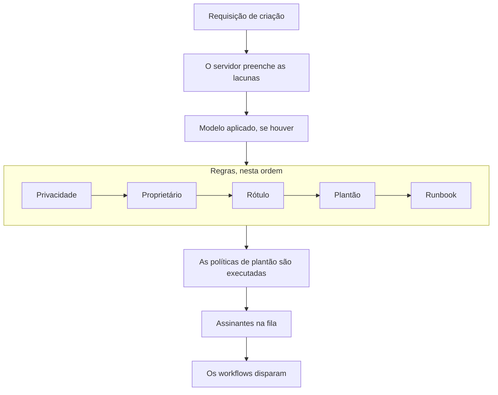

# Declarar um incidente

Declarar um incidente cria o registro a partir do qual sua equipe trabalha: ele recebe um número, uma severidade e um estado inicial, suas políticas de plantão acionam pessoas e — a menos que você diga o contrário — os assinantes da página de status ficam sabendo. Esta página percorre as cinco formas de declarar um, campo a campo, e o que acontece no momento em que ele passa a existir.

:::cards
- [Declarar um manualmente](#declarar-um-manualmente): O formulário em três etapas, campo a campo.
- [Declarar a partir de um modelo](#declarar-a-partir-de-um-modelo): O mesmo tipo de incidente, preenchido toda vez.
- [Declarar a partir dos critérios de um monitor](#declarar-automaticamente-a-partir-dos-critérios-de-um-monitor): Deixe uma verificação com falha abri-lo para você.
- [Declarar pela API](#declarar-pela-api): A partir do seu próprio código, de um script ou de outra ferramenta.
:::

## Cinco formas de declarar um incidente

Um incidente entra no OneUptime de cinco formas, e todas terminam no mesmo lugar: uma linha na tabela `Incident` com uma severidade, um estado atual e uma lista de recursos afetados. A única diferença é quem preenche os campos — você às 3 da manhã, um modelo salvo, os critérios de um monitor, seu próprio código chamando a API, ou alguém de fora da sua equipe preenchendo um formulário.

| Se você quer…                                                       | Escolha                                                                     |
| ------------------------------------------------------------------- | --------------------------------------------------------------------------- |
| Abrir um incidente manualmente, preenchendo tudo                    | O assistente **Declarar incidente**                                         |
| Abrir um tipo de incidente recorrente com os campos já preenchidos  | **Criar a partir de modelo**                                                |
| Abrir um automaticamente quando as verificações de um monitor falham | Um filtro de critérios de monitor com **Quando os filtros corresponderem, declarar um incidente.** |
| Abrir um a partir do seu próprio código, de um script ou de outra ferramenta | `POST /api/incident`                                               |
| Deixar pessoas de fora da sua equipe relatarem um problema por um link | Um [formulário](/docs/forms/index)                                       |

As cinco gravam o mesmo modelo, então um incidente aberto por uma sonda é exatamente igual a um aberto manualmente por um respondedor — exceto por algumas colunas de controle que o servidor define nos automáticos. As integrações também o gravam: o [Huntress](/docs/integrations/huntress) abre um incidente para cada relatório de incidente que seu SOC envia.

> [!TIP]
> Você também pode declarar um incidente a partir de alertas: **Declarar incidente** em uma lista de alertas, no cabeçalho de um alerta ou na página **Incidentes vinculados** de um alerta abre o mesmo assistente, preenchido a partir dos alertas, e os vincula ao novo incidente. Uma caixa no formulário, marcada por padrão, também confirma os alertas, para que parem de escalar. Veja [Alertas vinculados](/docs/incidents/linked-alerts).

## Declarar um manualmente

O formulário **Declarar novo incidente** pede um incidente em três etapas — **Detalhes do incidente**, **Recursos afetados** e **Plantão e funções** — e depois mostra um resumo para revisão. Quando seu projeto pede alguns dos seus campos personalizados de incidente na criação, uma quarta etapa, **Detalhes**, vem logo depois de **Recursos afetados**.

:::steps
1. Abra **Incidentes → Todos os incidentes** e clique em **Declarar incidente** no canto superior direito da lista **Incidentes**. O formulário abre em **Detalhes do incidente**.
2. Informe um **Título** e escolha uma **Severidade do incidente**. O resto do formulário é opcional.
3. Clique em **Próximo** para percorrer as etapas restantes, preenchendo o que você já sabe: monitores e outros recursos, políticas de plantão, funções.
4. Leia o resumo e clique em **Declarar incidente**. Você cai no novo incidente, e o **Incidente Feed** dele começa a registrar.
:::

Só a primeira etapa tem campos obrigatórios, mais qualquer campo personalizado que seus administradores marcaram como **Obrigatório na criação**, que a etapa **Detalhes** pede. Cada etapa antes do resumo tem um simples **Próximo**, e **Declarar incidente** fica no resumo, a última etapa. Com pressa, preencha **Detalhes do incidente** e pressione **Próximo** nas outras etapas sem preenchê-las: anexar recursos, adicionar políticas de plantão e atribuir funções também podem esperar pelas páginas do próprio incidente. Pressionar **Enter** em um campo também avança; isso nunca declara antes do resumo.

> [!TIP]
> As opções de que a maioria dos incidentes nunca precisa aguardam sob um cabeçalho **Mais campos** no fim da etapa, recolhido; clique nele para abri-las. Enquanto está recolhido, o cabeçalho nomeia o que há dentro e mostra cada opção definida, com seu valor — definida por um modelo, por exemplo, ou por um alerta privado a partir do qual você está declarando — e ele se abre sozinho quando algo dentro dele precisa de correção. O resumo lista uma dessas opções só quando ela está definida — exceto **Notificar assinantes da página de status**, que ele sempre lista, com quem será notificado.

**A partir da página de um recurso.** **Declarar incidente** na aba **Incidentes** de um monitor, de um host, de um serviço, de um cluster ou da maioria dos outros recursos abre o mesmo formulário com esse recurso já escolhido em **Recursos afetados**, então um título e uma severidade bastam, e o incidente aparece na aba de onde você partiu.

:::details Quais páginas de recurso oferecem isso e o que elas escolhem
**Declarar incidente** na aba **Incidentes** de um monitor, de um host, de um cluster Kubernetes, Proxmox, Ceph ou Docker Swarm, de um host Docker ou Podman, de um vCenter, de um storage array, de uma frota IoT, de um banco de dados ou de um serviço abre o mesmo assistente com esse recurso já escolhido em **Recursos afetados** (um monitor em **Monitores**, qualquer outra coisa em **Outros recursos afetados**), antes de qualquer coisa que um modelo adicione. **Criar a partir de modelo** nessa aba também mantém o recurso. A trilha de navegação volta pela aba do recurso e, depois de declarado, você cai no novo incidente, como a partir da lista de incidentes.

A aba **Incidentes** de um item do inventário escolhe o host, o serviço ou o cluster Kubernetes para o qual o item aponta, e a trilha de navegação volta pela aba desse recurso. **Criar alerta** na aba **Alertas** de um recurso funciona do mesmo jeito: a partir de um monitor, ele preenche o **Monitor** do alerta; a partir de qualquer outro, **Outros recursos afetados**.

O recurso é buscado com as suas próprias permissões: se você não puder lê-lo, ou ele tiver sido excluído, o formulário simplesmente abre sem nada escolhido.
:::

### Etapa 1 — Detalhes do incidente

- **Título** — obrigatório. O resumo de uma linha que todos verão na lista, no Slack e (se o incidente estiver visível) na sua página de status. Texto de exemplo: `Incident Title`.
- **Severidade do incidente** — obrigatória. Uma das severidades configuradas para o seu projeto; projetos novos são criados com **Critical Incident**, **Major Incident** e **Minor Incident**.
- **Descrição** — opcional, escrita em Markdown. É o campo que aparece na página de status, então escreva-o para os clientes, e não para a sua equipe. Uma imagem que você colocar nele é mostrada a todos enquanto o incidente estiver visível nas páginas de status, e só aos membros do seu projeto enquanto estiver oculto. Você pode editá-la depois em **Descrição** no menu lateral do incidente.

Em **Mais campos**:

- **Declarado Em** — começa no momento em que você abriu a página. É o horário a partir do qual toda duração do incidente é medida, então retroceda-o se estiver registrando algo que começou antes.
- **Estado Inicial** — opcional, e vazio no início. Deixado vazio, o incidente começa no estado marcado com `isCreatedState`, que projetos novos criam como **Identified** — ou no estado inicial do modelo, quando você declara a partir de um modelo. Escolha um estado posterior só quando estiver registrando um incidente que já tinha passado desse ponto, confirmado ou resolvido. Um incidente assim não aciona ninguém — veja [Declarado já confirmado ou resolvido](#declarado-já-confirmado-ou-resolvido).
- **Rótulos** — opcionais. Os rótulos agrupam incidentes relacionados para que você possa filtrar por eles, e uma equipe cujas permissões são restritas a rótulos só vê os incidentes que levam um dos seus rótulos.
- **Incidente privado** — caixa de seleção, desativada por padrão (`isPrivate`). Um incidente privado só é visível para seus usuários proprietários, os membros das suas equipes proprietárias, os administradores e os proprietários do projeto — e fica oculto de todas as páginas de status, independentemente de qualquer outra configuração, incluindo as páginas de status a que está limitado. A lista de incidentes os marca com uma etiqueta vermelha **Private**.

> [!NOTE]
> **Alertas e episódios também começam no estado que você escolher.** **Criar alerta**, e **Criar episódio** nas listas de episódios de incidentes e de alertas, têm o mesmo **Estado Inicial** em **Mais campos**. Deixado vazio, o alerta ou o episódio começa no estado de criação do projeto. Escolha um estado posterior para registrar um que já estava confirmado ou resolvido: ele começa nesse estado, sua linha do tempo de estados começa com ele, e um episódio registrado como resolvido conta como resolvido imediatamente. Seus proprietários não são avisados desse primeiro estado à parte, e os assinantes da página de status de um episódio de incidente ficam sabendo dele uma vez, quando o episódio é criado. Um alerta ou episódio registrado assim não aciona ninguém, como acontece com um incidente: veja [Declarado já confirmado ou resolvido](#declarado-já-confirmado-ou-resolvido). Pela API, a mesma escolha é `currentAlertStateId` ou `currentIncidentStateId` — veja [Referência da API OneUptime](/docs/api-reference/api-reference).

:::details Escrever no editor Markdown
A descrição — assim como as notas, a causa raiz, a remediação e os campos personalizados de texto formatado — é escrita no editor Markdown. Ele abre no modo visual, que mostra o texto formatado; **Markdown** na barra de ferramentas muda para o modo Markdown, que mostra o código-fonte Markdown, e **Visual** volta. Em uma lista, **Aumentar recuo** e **Diminuir recuo** na barra de ferramentas, ou Tab e Shift+Tab, aninham um item sob o de cima e o tiram de novo; onde não há nada sob o qual aninhar, e fora de uma lista, Tab passa para o próximo campo como de costume. No modo visual, **Bloco de código**, **Tabela** e **Lista de tarefas** no meio ou no fim de uma linha dividem a linha no cursor e colocam o novo bloco em linhas próprias — também na borda de uma palavra em negrito, de um link ou de um código em linha, sem deixar formatação vazia para trás — e **Lista de tarefas** em um item de lista adiciona sua tarefa à lista desse item, e não como subtarefa. No modo Markdown, **Bloco de código** e **Tabela** são inseridos no cursor, então comece antes uma nova linha para eles, **Lista de tarefas** transforma a linha do cursor em uma tarefa, e **Lista numerada** numera cada nível de uma lista aninhada a partir de 1. A barra de ferramentas cabe em uma linha: os formulários com o editor abrem em uma caixa de diálogo larga, então na maioria das telas todos os botões cabem, e onde não cabem — em um celular, ou em uma janela estreita — os botões que não cabem ficam em **Mais formatação** (**⋯**) no fim da barra, na mesma ordem, e cada um que você escolher ali é inserido onde estava o cursor. Nas telas mais estreitas, o interruptor **Markdown** também vai para lá.

**Desfazer.** No modo visual, Ctrl+Z (Cmd+Z no Mac) desfaz suas alterações uma a uma, da mais recente para a mais antiga — o que você digitou e também as edições do próprio editor: um recuo aumentado ou diminuído, um bloco que ele inseriu em uma linha, uma colagem formatada ou em bloco — e Ctrl+Shift+Z (Cmd+Shift+Z) ou Ctrl+Y as refaz na mesma ordem. No modo Markdown, Ctrl+Z desfaz um recuo aumentado ou diminuído, a alteração de um botão de lista e uma colagem formatada, mas não o que os botões **Bloco de código**, **Tabela** e **Linha horizontal** inserem.

**Colar nele.** Colar do Word, do Google Docs ou de uma página do OneUptime — a descrição de outro incidente, por exemplo — mantém as listas e o aninhamento delas, os links e a formatação, e os marcadores `•` colados viram uma lista de verdade. Links que são só um ícone, como a âncora ao lado de um título no GitHub, são deixados de fora. No modo visual, código ou uma citação colados em uma linha viram um bloco próprio, dividindo a linha, e uma lista colada em um item de lista se junta à lista desse item em vez de se aninhar nele — colada no item vazio que o Enter deixa, ela ocupa o lugar desse item — enquanto um bloco de código, uma citação ou uma tabela colados em um item ficam dentro dele. No modo Markdown, o que a colagem transforma em blocos — código, uma citação, uma lista, um título, vários parágrafos — vai para linhas próprias, com uma linha em branco de cada lado, quando cai no meio de uma linha, e uma lista colada no fim da linha de um item de lista, ou depois de um `- ` solto, se junta a essa lista no recuo do item; Markdown copiado como texto simples é inserido no cursor exatamente como está. Qualquer coisa que você colar dentro de um bloco de código fica exatamente como foi copiada. Colar sobre uma seleção que abrange vários itens, parágrafos ou células de tabela a substitui, como digitar faria. No modo visual, uma colagem ou o botão **Código** sobre células de tabela mantém todas as células e colunas, uma colagem não deixa para trás marcador, citação ou bloco de código vazios, e quando a seleção termina dentro de um bloco de código, só o resto dessa linha de código se junta ao texto.

**Copiar de uma nota.** Um bloco de código copiado de uma nota ou de uma descrição volta a ser colado como bloco de código na sua linguagem, assim como uma de suas linhas copiada com a quebra de linha, como um clique triplo a copia no Chrome, no Edge e no Safari. Uma palavra ou parte de uma linha copiada de um bloco de código é colada como código em linha. No Chrome, no Edge e no Safari, linhas copiadas de uma visualização de código desenhada como tabela — a aba YAML de um recurso Kubernetes, os frames do stack trace de uma exceção — são coladas como texto simples, com o recuo mantido.
:::

### Etapa 2 — Recursos afetados

Os monitores vêm primeiro, sozinhos, porque as páginas de status enxergam um incidente pelos seus monitores, e o status para o qual os monitores mudam fica logo abaixo deles.

- **Monitores** — uma caixa de busca que anexa os monitores afetados pelo incidente; sua aba **Rótulos** adiciona de uma vez todo monitor com um rótulo. Uma página de status mostra um incidente, e avisa seus assinantes sobre ele, quando lista um dos monitores do incidente, então são eles que decidem quais páginas de status ficam sabendo (`monitors` no incidente).
- **Alterar status do monitor para** — opcional, e mostrado só quando há pelo menos um monitor escolhido. Escolhe um status de monitor que é aplicado a todo monitor anexado a este incidente, para que declarar o incidente e marcar os monitores como degradados seja uma ação só, e não duas. Declarar a partir de um modelo que define um começa com o status do modelo, mostrado assim que você escolhe um monitor. Sem monitor escolhido, nenhum status é salvo, nem o do modelo; remova o último monitor e o campo some até você escolher outro, o que traz sua escolha de volta. O status de um monitor é compartilhado por todas as páginas de status que o listam, então, com páginas de status escolhidas em **Mais campos**, o formulário lembra você de que a mudança também aparece nas páginas que você não escolheu.
- **Outros recursos afetados** — uma segunda caixa de busca para todo o resto que o incidente afeta: hosts, clusters Kubernetes, hosts Docker e Podman, clusters Proxmox, Ceph e Docker Swarm, vCenters, storage arrays, frotas IoT, bancos de dados e serviços — tudo, além dos monitores, que o cartão **Recursos afetados** do próprio incidente oferece. Por baixo, essas são relações separadas no incidente (`hosts`, `kubernetesClusters`, `dockerHosts`, `podmanHosts`, `services` e outras), mas o formulário as junta em um único seletor.

Um monitor pode dizer o que ele vigia — **Monitor → Visão geral → Recursos Vinculados**, os mesmos tipos de recursos de **Outros recursos afetados**. Escolha um monitor assim e aquilo a que ele está vinculado é adicionado na hora a **Outros recursos afetados**, e uma linha abaixo do campo nomeia o que foi adicionado. Remova o que você não quiser antes de declarar: nada é adicionado de novo para esse monitor enquanto você continuar no formulário, e remover o monitor mantém o que ele adicionou. O mesmo acontece quando um monitor vem de um modelo ou da página a partir da qual você declarou, e em **Criar alerta** e **Schedule Maintenance**.

O cartão **Recursos afetados** do incidente pergunta do mesmo jeito quando você o edita depois: **Monitores**, **Alterar status do monitor para** assim que houver um monitor, e então **Outros recursos afetados**. Salvar um incidente sem nenhum monitor mantém o status que ele tinha.

Em **Mais campos**:

- **Limitar a estas páginas de status** — opcional. Deixado vazio, o incidente aparece em todas as páginas de status que listam seus monitores, e avisa os assinantes delas. Escolha páginas aqui e só as escolhidas entre essas são usadas; a aba **Rótulos** adiciona de uma vez toda página com um rótulo. O formulário avisa quando uma página escolhida não lista nenhum dos monitores do incidente, e quando o incidente é privado, o que o oculta de todas as páginas de status. Veja [Uma página de status por público](/docs/status-pages/one-status-page-per-audience).
- **Notificar assinantes da página de status** — caixa de seleção, ativada por padrão. Controla se os assinantes são notificados sobre a criação do incidente (`shouldStatusPageSubscribersBeNotifiedOnIncidentCreated`). Recolhê-la em **Mais campos** não muda nada do que ela faz: ela continua começando marcada, e o resumo sempre a lista. Abaixo dela, e de novo no resumo antes do envio, **Will notify** lista as páginas de status que serão avisadas, com uma contagem de assinantes «até» por canal, e as páginas que não serão avisadas e por quê. Quando ninguém será avisado (nenhum monitor anexado, nenhuma página de status lista os monitores, ou as páginas ainda não têm assinantes), não mostra nada, e só avisa quando o motivo é o escopo de páginas de status do incidente. No resumo, **Pré-visualização**, ao lado de **Sim**, mostra o e-mail que os assinantes de cada uma dessas páginas de status receberão, e **Enviar teste para mim** o envia para o e-mail da sua própria conta; veja [Assinantes e comunicados](/docs/status-pages/subscribers#incidentes). Desative-a para ruído interno que você ainda quer registrar. O incidente fica então silencioso por padrão: novas notas públicas nele, e a caixa de diálogo de mudança de estado da página de visão geral (**Confirmar**, **Resolver** ou a escolha de outro estado), começam com sua própria caixa **Notificar assinantes da página de status** desmarcada. O formulário manual da página **Linha do tempo de estado** e a ação em massa **Alterar estado** da lista de incidentes continuam começando com ela marcada.

> [!IMPORTANT]
> **Anexe monitores mesmo quando parecer redundante.** A ligação entre um incidente e uma página de status passa pelos monitores do incidente: uma página de status mostra um incidente, e avisa seus assinantes sobre ele, quando um dos seus recursos é um dos monitores do incidente. **Limitar a estas páginas de status** só pode estreitar essa lista, nunca ampliá-la, e uma página de status com **Mostrar apenas incidentes limitados a esta página** ativado mostra só os incidentes limitados a ela. Um incidente sem monitores anexados não avisa nenhum assinante de página de status. Veja [Recursos e grupos da página de status](/docs/status-pages/resources-and-groups).

O indicador **Should be visible on status page?** (`isVisibleOnStatusPage`) não está no assistente; ele é true por padrão. Altere-o depois em **Configurações** no menu lateral do incidente, onde ele se chama **Visível na página de status**.

**Declarar oculto e publicar depois.** Um incidente que está oculto das páginas de status ao ser criado não avisa nenhum assinante, e seu status de notificação diz **Ignorado: oculto nas páginas de status**. Quando você depois ativa **Visível na página de status**, o formulário de edição oferece **Notificar os assinantes de que este incidente foi criado**, para que a rotina — declarar oculto, descobrir quem foi afetado e só então publicar — ainda os avise. A opção começa marcada enquanto o incidente não está resolvido e desmarcada depois que ele é resolvido, para que publicar um incidente antigo para registro não o anuncie como novo. Ela só é oferecida quando o incidente foi declarado com **Notificar assinantes da página de status** ativado e não é privado — então não para um incidente relatado por um [formulário](/docs/forms/on-submit), que é declarado oculto e com ela desativada. Pela API, envie `"miscDataProps": {"notifySubscribersOfIncidentCreatedOnPublish": true}` com a atualização que define `isVisibleOnStatusPage` como `true`, ou volte você mesmo `subscriberNotificationStatusOnIncidentCreated` para `Pending`. Um post-mortem publicado enquanto o incidente estava oculto não precisa de caixa nenhuma: ativar **Visível na página de status** o envia uma vez, como descrito em [Assinantes e comunicados](/docs/status-pages/subscribers#incidentes).

### Detalhes — seus campos personalizados de incidente

Esta etapa só aparece quando pelo menos um campo personalizado de incidente tem **Mostrar na criação** ativado em **Incidentes → Configurações → Campos personalizados** — ou, quando você declara a partir de um modelo, quando os **Campos personalizados na criação** do modelo pedem um. Ela pede esses campos, na **Ordem** deles — a ordem em que são arrastados nessa página de configurações — com a entrada que o tipo pede: uma lista suspensa, um número, uma data, um interruptor sim/não, texto longo, ou texto formatado no editor Markdown. Ela também é omitida para quem não pode ler os campos personalizados de incidente do projeto: no OneUptime Cloud, é preciso o plano **Growth** ou superior, e uma função que possa ver os campos personalizados de incidente.

- Um campo marcado como **Obrigatório na criação** precisa ser preenchido antes que você possa declarar. Um campo sim/não obrigatório — uma confirmação, por exemplo — precisa estar ativado.
- Um 0 ou um interruptor deixado desativado é uma resposta, e é salvo como tal.
- Um campo cujo valor é copiado de um campo personalizado de monitor não é perguntado depois que o incidente tem um monitor, porque o valor é copiado do monitor quando o incidente é criado.
- Declarar a partir de um modelo começa a etapa com os valores do modelo, e os valores do modelo para campos que a etapa não pergunta são mantidos como estão. Um valor que você apaga na etapa continua apagado. Um valor do modelo que não cabe mais no seu campo — uma opção de lista suspensa removida desde então — é deixado de fora, em vez de recusar o incidente.
- Declarar a partir de um modelo também segue os **Campos personalizados na criação** do modelo. Um campo que ele marca como **Obrigatório** ou **Opcional** é perguntado mesmo quando o projeto não o mostra na criação, um campo que ele marca como **Oculto** não é perguntado — o valor do modelo para ele ainda se aplica — e um campo deixado em **Padrão** segue seus próprios **Mostrar na criação** e **Obrigatório na criação**. Veja [Campos personalizados na criação](/docs/incidents/settings#campos-personalizados-na-criação).

**Obrigatório na criação** é verificado só pelo painel, assim como os **Campos personalizados na criação** de um modelo. Incidentes criados por monitores, pela API, pelo Slack, pelo Microsoft Teams ou pela IA podem deixar um campo vazio, e todo campo continua opcional depois na página **Campos personalizados** do incidente, então corrigir um valor no meio de uma interrupção nunca exige todos os outros. Veja [Campos personalizados](/docs/incidents/settings#campos-personalizados) para os tipos de campo e as configurações.

### Etapa 3 — Plantão e funções

- **Política de plantão** — uma seleção múltipla das políticas de plantão a executar quando este incidente for criado. Corresponde a `onCallDutyPolicies` no incidente.
- **Atribuir funções do incidente** — quem assume cada função que seu projeto define, um cartão por função. Uma função marcada como **Principal** que você deixa vazia é sua: você a assume quando o incidente é declarado, e o resumo diz isso. Uma função que aceita uma só pessoa diz isso assim que tem uma; uma função que aceita várias mantém seu seletor.

Este é o único lugar em que uma política de plantão é anexada diretamente a um incidente. As severidades não carregam política de plantão — a severidade é um rótulo, e só influencia o acionamento como *critério de correspondência* dentro de uma regra de plantão. As regras configuradas em **Incidentes → Regras → Regras de Plantão** adicionam suas políticas ao que você escolher aqui; o conjunto final que é executado é a união das duas, sem duplicatas. Um incidente declarado em um estado posterior não executa nenhuma — veja [Declarado já confirmado ou resolvido](#declarado-já-confirmado-ou-resolvido).

As funções em si são configuradas em **Incidentes → Configurações → Funções de incidente**. Um projeto novo tem uma, Comandante do incidente; adicione ali Respondedor, Responsável pela comunicação ou o que mais seu processo precisar. Se você não escolher ninguém como Comandante do incidente, você se torna ele quando o incidente é declarado.

## Declarar a partir de um modelo

Se você vive declarando o mesmo tipo de incidente — o mesmo padrão de título, a mesma severidade, a mesma política de plantão — salve-o uma vez como modelo e depois declare a partir dele:

:::steps
1. Na lista **Incidentes**, clique em **Criar a partir de modelo** (o botão com contorno ao lado de **Declarar incidente**). Uma caixa de diálogo **Criar incidente a partir de modelo** se abre, com uma lista suspensa **Selecionar Modelo de Incidente**.
2. Escolha um modelo. O formulário de criação abre preenchido.
3. Altere o que for diferente desta vez, e então percorra as etapas e declare como de costume.
:::

Se seu projeto ainda não tem modelos, você recebe em vez disso uma caixa de diálogo **No Incident Templates**, com um botão **Create Template** que leva você a **Incidentes → Configurações → Modelos de incidentes**.

Os modelos são criados com seu próprio assistente de quatro etapas — **Informações do modelo**, **Detalhes do incidente**, **Recursos afetados**, **Plantão** — mais as etapas **Campos personalizados** e **Campos personalizados na criação** depois de **Recursos afetados** quando seu projeto tem campos personalizados de incidente. O **Estado Inicial do Incidente**, os **Proprietários** e os **Rótulos** do modelo ficam em **Mais campos** no fim de **Detalhes do incidente**. **Recursos afetados** pergunta como o formulário de declaração — **Monitores**, depois **Alterar status do monitor para**, depois **Outros recursos afetados**, com **Limitar a estas páginas de status** em **Mais campos** — exceto que um modelo sempre pergunta o status do monitor: ele também se aplica aos monitores escolhidos quando um incidente é declarado a partir do modelo. Estes são os campos:

| Campo                                   | Propósito                                              |
| --------------------------------------- | ------------------------------------------------------ |
| **Nome do modelo**                      | Como o modelo é identificado no seletor.               |
| **Descrição do modelo**                 | Uma nota para o seu eu do futuro sobre quando usá-lo.  |
| **Título**                              | O título preenchido no incidente.                      |
| **Descrição**                           | A descrição em Markdown preenchida no incidente.       |
| **Severidade do incidente**             | A severidade preenchida no incidente.                  |
| **Estado Inicial do Incidente**         | O estado em que os incidentes deste modelo começam. Deixado vazio, o estado inicial de costume. Um incidente que começa confirmado ou resolvido não aciona ninguém. |
| **Monitores**                           | Os monitores a anexar.                                 |
| **Alterar status do monitor para**      | O status de monitor a aplicar aos monitores do incidente, incluindo os escolhidos quando ele é declarado. |
| **Outros recursos afetados**            | Os hosts, clusters e serviços a anexar.                |
| **Limitar a estas páginas de status**   | As páginas de status a que o incidente é limitado.     |
| **Política de plantão**                 | As políticas a executar quando o incidente é criado.   |
| **Proprietários**                       | As pessoas e equipes proprietárias dos incidentes criados a partir deste modelo, escolhidas de uma única lista. |
| **Rótulos**                             | Os rótulos aplicados ao incidente.                     |
| **Campos personalizados**               | Os valores dos campos personalizados do incidente.     |
| **Campos personalizados na criação**    | Quais campos personalizados a etapa **Detalhes** pede, e quais precisam ser preenchidos. |

Algumas regras rápidas:

- Os modelos não são editáveis pela lista de modelos — você cria um e depois o abre para alterá-lo.
- Um modelo só preenche um campo que você deixou vazio. Na página de criação, o modelo é aplicado como um preenchimento que você pode sobrescrever; no servidor — para um formulário que declara a partir de um modelo — um campo só é preenchido a partir do modelo quando a requisição deixou esse campo `undefined`. O que quem chamou forneceu sempre vence.
- A etapa **Detalhes** segue os **Campos personalizados na criação** do modelo, como [descrito acima](#detalhes-seus-campos-personalizados-de-incidente).
- Os valores dos campos personalizados são mesclados campo a campo. Os valores de um modelo preenchem os campos personalizados com os quais o incidente não foi declarado; um valor definido na etapa **Detalhes**, ou enviado nos `customFields` da requisição, sempre vence — `0`, `false` e `null` incluídos. Um campo copiado de um campo personalizado de monitor continua pegando o valor do monitor.
- Os valores dos campos personalizados de um modelo existente ficam no cartão **Campos personalizados** dele, ao lado dos outros cartões.
- Os **Proprietários** do modelo são adicionados depois que os canais do Slack e do Microsoft Teams do incidente existem, então uma regra de notificação que convida os proprietários do incidente para um canal novo também os convida. Declarar a partir de um modelo no painel os adiciona sem a notificação «você foi adicionado»; um [formulário](/docs/forms/on-submit) com um modelo os notifica, e segura a notificação **Incidente criado** do incidente até que eles sejam adicionados, para que ela chegue a eles e não aos proprietários do projeto.

## Declarar automaticamente a partir dos critérios de um monitor

A maioria dos incidentes não deveria precisar de uma pessoa para digitá-los. Os critérios de um monitor podem declarar um no momento em que um filtro corresponde:

:::steps
1. Abra o monitor, escolha **Critérios** no menu lateral dele e clique em **Edit Monitoring Criteria**. (Um monitor novo pede os mesmos critérios enquanto você o cria.)
2. No filtro de critérios que deve declarar, ative **Quando os filtros corresponderem, declarar um incidente.** Aparece uma seção **Criar incidente** com um botão **Adicionar incidente** — um filtro de critérios pode declarar mais de um incidente.
3. Preencha os campos do incidente (abaixo) e salve. Na próxima vez que o filtro corresponder, o incidente é declarado e aciona suas políticas de plantão.
:::

Cada entrada de incidente tem:

- **Título do Incidente** — aceita modelos; o texto de exemplo sugere algo como `{{monitorName}} is down`.
- **Gravidade** — obrigatória.
- **Descrição do incidente** — também aceita modelos.
- **Plantão → Políticas de plantão** — as políticas executadas quando este incidente é criado.
- **Funções de incidente** — quem assume cada função no incidente, escolhido nos mesmos cartões de **Atribuir funções do incidente** do formulário de declaração, um por função. Mostrado quando seu projeto tem funções de incidente.
- **Propriedade e rótulos → Proprietários** (pessoas e equipes, escolhidas de uma única lista), **Rótulos**.
- **Mais campos → Resolver incidente automaticamente** (resolve o incidente automaticamente quando os critérios deixam de corresponder), **Mostrar incidente na página de status**, **Incidente privado** e **Notas de remediação**.

Para a lista completa de marcadores `{{variable}}` que você pode usar no título, na descrição e nas notas de remediação, veja [Modelos de incidentes e alertas](/docs/monitor/incident-alert-templating).

Os incidentes criados assim são marcados pelo servidor: `isCreatedAutomatically` é definido, `createdCriteriaId` registra qual filtro de critérios disparou, e `createdByProbe` registra qual sonda o viu. Todo o resto neles se comporta exatamente como em um incidente declarado manualmente.

Um incidente que um monitor declara é vinculado ao que o monitor vigia: tudo o que sua configuração nomeia (o host de um monitor de host, o cluster de um monitor Kubernetes, os serviços de um monitor de logs) e tudo em seus **Recursos Vinculados**. A configuração de um monitor de site ou de API não nomeia nenhuma infraestrutura, então vincule-o ao cluster, aos hosts ou ao banco de dados por trás do site: seus incidentes passam então a aparecer nas páginas desses recursos, o OneUptime AI pode investigá-los ali, e a correção por IA do cluster ou do recurso pode agir sobre eles (veja [AI SRE](/docs/ai/ai-sre#which-incidents-a-clusters-fixes-act-on)). Os alertas que um monitor cria são vinculados do mesmo jeito.

## Declarar pela API

O modelo de incidente expõe um endpoint CRUD padrão, então `POST /api/incident` cria um. Autentique-se com uma chave de API gerada em **Configurações do projeto → Avançado → Chaves de API**, enviada no cabeçalho `apikey` — a chave identifica o projeto, então você não precisa passar um id de projeto à parte.

```bash
curl -X POST https://oneuptime.com/api/incident \
  -H "apikey: $ONEUPTIME_API_KEY" \
  -H "Content-Type: application/json" \
  -d '{
    "data": {
      "title": "Checkout latency above SLO",
      "description": "Investigating elevated p99 latency on the checkout service.",
      "incidentSeverityId": "<incident-severity-id>"
    }
  }'
```

Campos úteis do corpo da requisição:

| Campo                    | Obrigatório | Observações                                                                                                                                                                                                                                 |
| ------------------------ | ----------- | ------------------------------------------------------------------------------------------------------------------------------------------------------------------------------------------------------------------------------------------- |
| `title`                  | Sim         | O título do incidente.                                                                                                                                                                                                                      |
| `incidentSeverityId`     | Sim         | Uma das severidades do seu projeto. O servidor verifica se ela pertence ao mesmo projeto da chave de API, e rejeita a requisição se não pertencer.                                                                                        |
| `declaredAt`             | Não         | Opcional aqui, embora o formulário o exija. Omita-o e o servidor usa o horário atual.                                                                                                                                                       |
| `currentIncidentStateId` | Não         | O estado em que começar; omitido, o estado de criação. Verificado em relação ao projeto da chave de API, como a severidade. A mesma verificação vale para o status de monitor por trás de **Alterar status do monitor para**.            |
| `statusPages`            | Não         | Os ids das páginas de status a que limitar o incidente, todas do mesmo projeto. Omita-o para alcançar todas as páginas de status que listam os monitores do incidente. `isScopedToStatusPages` é derivado dele, e um valor que você enviar para ele é ignorado. Veja [Uma página de status por público](/docs/status-pages/one-status-page-per-audience). |
| `customFields`           | Não         | Os valores dos campos personalizados do incidente, indexados pelo nome de cada campo. Cada valor que você enviar precisa caber no seu campo — um número para um campo **Número**, uma das opções para uma **Lista suspensa (seleção única)** — senão a requisição é recusada com um erro `400` que nomeia o campo. **Obrigatório na criação** não é verificado aqui. Veja [Valores de campos personalizados pela API](/docs/incidents/settings#valores-de-campos-personalizados-pela-api). |

Uma chave de API não pode declarar a partir de um modelo: uma requisição que envia `createdIncidentTemplateId` é recusada. O próprio OneUptime define essa coluna, para incidentes relatados por um [formulário](/docs/forms/on-submit) e para a etapa **Create One Incident** de um workflow, que declara a partir do modelo escolhido em sua configuração **Incident Template** (veja [Componentes de workflow](/docs/workflows/components)). Para declarar a partir de um modelo pela API, leia o modelo em `/api/incident-templates` e envie os valores dele na requisição.

Os endpoints relacionados são `/api/incident-state`, `/api/incident-severity` e `/api/incident-state-timeline`. A [referência da API](/reference) gerada tem os formatos exatos de requisição e resposta de cada um, incluindo como campos de relação, como os monitores, são expressos.

## Relatar por um formulário

O quinto caminho de entrada é para pessoas de fora da sua equipe. Um formulário é uma página que você compartilha como link: qualquer pessoa que o tenha pode relatar um problema sem uma conta do OneUptime, e cada envio declara um incidente. Você monta o que o formulário pergunta — um título, uma descrição, uma severidade, monitores, campos personalizados, perguntas próprias — e decide como as respostas viram o incidente: uma severidade padrão, um modelo de incidente a partir do qual declarar, e monitores, rótulos, políticas de plantão e proprietários a adicionar sempre.

Os incidentes relatados assim são declarados ocultos das páginas de status, com **Notificar assinantes da página de status** desativado, para que um respondedor faça a triagem antes que algo fique público, e uma nota privada registra quem os relatou. Os formulários são um produto próprio, em **Formulários** no menu **Produtos**, e também podem agendar eventos de manutenção; veja [Formulários](/docs/forms/index).

## Números e prefixos de incidentes

Todo incidente recebe um número sequencial de um contador do projeto, atribuído pelo servidor na criação. Duas colunas o guardam: `incidentNumber` (o inteiro puro) e `incidentNumberWithPrefix` (o que você realmente vê). Sem prefixo configurado, o valor exibido é `#42`.

:::steps
1. Vá em **Incidentes → Configurações → Prefixo do número** e clique em **Atualizar**.
2. Digite o prefixo em **Prefixo de número de incidente**. O campo mostra uma prévia do número enquanto você digita: `INC-` o transforma em `INC-42`. Deixe-o vazio para manter o `#` padrão.
3. Clique em **Salvar alterações**. Os incidentes declarados a partir de agora recebem o novo prefixo; os incidentes existentes mantêm seus números.
:::

A mesma caixa de diálogo tem **Prefixo de número de episódio de incidente** para a numeração dos episódios. [Prefixos de número](/docs/incidents/settings#prefixos-de-número) lista as regras que um prefixo segue.

O número aparece como a primeira coluna da lista de incidentes, leva ao incidente e aparece como **Número do incidente** na **Visão geral** do incidente.

## O que acontece no momento em que um incidente é declarado

A chamada de criação faz mais do que gravar uma linha:



Na ordem:

1. **O servidor preenche as lacunas.** `declaredAt` assume agora por padrão, o estado atual assume por padrão o estado `isCreatedState` do projeto, e o número do incidente e o número com prefixo são atribuídos a partir do contador do projeto.
2. **Um modelo é aplicado**, quando um formulário ou a etapa **Create One Incident** de um workflow declara o incidente a partir de um (`createdIncidentTemplateId`) — preenchendo só os campos que quem chamou deixou indefinidos; um estado nomeado por quem chamou vence o do modelo. Já o painel aplica um modelo no formulário, antes de a requisição ser enviada.
3. **As regras de privacidade são executadas**, marcando o incidente como privado quando uma regra que corresponde diz isso. É o primeiro mecanismo de regras a ser executado, então tudo o que vem depois vê a configuração de privacidade correta.
4. **As regras de proprietário são executadas**, adicionando os usuários e equipes proprietários que as regras correspondentes nomeiam.
5. **As regras de rótulos são executadas**, adicionando os rótulos que correspondem ao incidente.
6. **As regras de plantão são executadas.** Toda regra habilitada em **Incidentes → Regras → Regras de Plantão** cujos critérios correspondem adiciona suas políticas ao incidente. Não há ordem de prioridade nem curto-circuito — todas as regras correspondentes disparam e as políticas são deduplicadas.
7. **As regras de runbook são executadas**, anexando e iniciando os runbooks correspondentes. Veja [Runbooks](/docs/runbooks/index).
8. **As políticas de plantão são executadas.** Cada política do incidente — escolhida no assistente, herdada de um modelo ou adicionada por uma regra — é executada em paralelo com o tipo de evento `IncidentCreated`. A falha de uma política não interrompe as outras. Uma política arquivada não aciona ninguém: seu log de execução no incidente diz que ela não foi executada porque a política está arquivada. Um incidente declarado já confirmado ou resolvido não executa nenhuma; veja [Declarado já confirmado ou resolvido](#declarado-já-confirmado-ou-resolvido) abaixo.
9. **Os assinantes entram na fila**, se **Notificar assinantes da página de status** ficou ativado e o incidente está visível na página de status. O envio é feito por uma tarefa em segundo plano, não dentro da sua requisição, e vai para as páginas de status que o incidente alcança: as que listam seus monitores, estreitadas por **Limitar a estas páginas de status**, e sem as páginas que só mostram incidentes limitados a elas quando ele não está limitado. Uma página de status arquivada não envia nada. O progresso aparece como **Status de notificação do assinante** na **Visão geral** do incidente: o que foi enviado e o que falhou em cada página de status, e **Tentar novamente** ou **Reenviar** depois de concluído. Veja [Assinantes e comunicados](/docs/status-pages/subscribers).
10. **Os workflows disparam.** O gatilho **On Create Incident** inicia qualquer workflow construído sobre ele. Veja [Visão geral dos workflows](/docs/workflows/index).

A partir daí o incidente está ativo: ele conta para o selo **Incidentes ativos** no menu lateral de Incidentes (qualquer estado acima do seu estado resolvido conta como ativo), aparece nas páginas de status que trazem um dos seus monitores (só nas escolhidas, se você o limitou), e sua **Linha do tempo de estado** começa a registrar.

### Declarado já confirmado ou resolvido

Escolher um **Estado Inicial** posterior — no formulário, pelo **Estado Inicial do Incidente** de um modelo, ou com `currentIncidentStateId` pela API, pelo Terraform ou por um workflow — registra um incidente de que alguém já está cuidando, ou que já acabou. Ele não é tratado como uma nova emergência:

```mermaid title="O que um novo incidente desencadeia, pelo estado em que começa"
flowchart TB
    start{"Estado inicial"} -->|"Estado de criação, o padrão"| live["Tratado como novo: aciona o plantão"]
    start -->|"Confirmado ou além"| acked["Registrado: não aciona ninguém"]
    start -->|"Resolvido ou além"| over["Registrado como encerrado"]
    over --> quiet["Sem agrupamento, runbooks, IA, canal nem SLA"]
```

- **No seu estado confirmado ou além** — **Confirmado**, ou qualquer estado colocado abaixo dele em **Incidentes → Configurações → Estado do incidente** — nenhuma política de plantão é executada, então ninguém é acionado. O incidente ainda lista suas políticas, as que você escolheu e as que as regras de plantão adicionam, e seu feed diz por quê em uma linha: _No one was paged. This incident was created already acknowledged, so its on-call policy **Primary** was not run._ Seu SLA, se uma regra lhe der um, já começa como respondido. Todo o resto abaixo é executado como em qualquer incidente novo.
- **No seu estado resolvido ou além** — **Resolvido**, ou qualquer estado colocado abaixo dele — o incidente acabou, então, além disso, nada que responde a um incidente em andamento é executado:
  - ele não é agrupado em um episódio, o que poderia acionar de novo;
  - nenhuma regra de runbook e nenhuma regra de remediação automática age sobre ele;
  - o OneUptime AI não o investiga — o cartão **AI Investigation** dele diz que ele foi criado já resolvido, e **Ask OneUptime AI** abaixo dele continua respondendo perguntas sobre ele;
  - nenhum canal do Slack ou do Microsoft Teams é criado para ele;
  - seus monitores mantêm o status e continuam sendo monitorados, diga o que disser **Alterar status do monitor para**;
  - nenhum SLA é iniciado para ele.
- **O que ainda acontece:** as regras de privacidade, de proprietário, de rótulos e de plantão são executadas, seus proprietários são adicionados e avisados de que ele foi criado, a entrada **Incidente criado** é gravada no feed dele e publicada nos canais do Slack e do Microsoft Teams que suas regras nomeiam, e os assinantes da página de status são avisados quando **Notificar assinantes da página de status** está ativado e o incidente aparece na página de status deles. Um incidente que já acabou ainda é novidade para eles.

Alertas, episódios de alertas e episódios de incidentes seguem a mesma regra: o que é criado já confirmado não aciona ninguém, e o que é criado resolvido também não é agrupado, remediado nem investigado pela IA, e não ganha canal próprio. Um incidente ou alerta no estado de criação — o padrão, e o de todo incidente que um monitor abre — desencadeia tudo como antes.

## Solução de problemas

:::details Declarar falha e pede um estado de criação de incidentes
Se seu projeto não tem nenhum estado com o indicador `isCreatedState`, a chamada de criação falha e pede que você adicione um estado de criação de incidentes nas configurações. Normalmente isso só acontece em um projeto cujos estados foram muito editados — veja [Estados e severidades de incidentes](/docs/incidents/states-and-severities).
:::

:::details O incidente foi declarado, mas nenhum assinante da página de status ficou sabendo
Verifique, nesta ordem: **Notificar assinantes da página de status** estava ativado; o incidente tem pelo menos um monitor anexado, e uma página de status lista esse monitor; o incidente está visível nas páginas de status e não é privado; e a página não ficou de fora por **Limitar a estas páginas de status**. O **Status de notificação do assinante** na **Visão geral** do incidente diz qual desses pontos o impediu.
:::

:::details A etapa Detalhes com nossos campos personalizados não aparece
A etapa só aparece quando um campo tem **Mostrar na criação** ativado, ou os **Campos personalizados na criação** de um modelo pedem um, e só para quem pode ler os campos personalizados de incidente do projeto — no OneUptime Cloud, isso exige o plano **Growth** ou superior.
:::

## Onde ler em seguida

:::cards
- [Estados e severidades de incidentes](/docs/incidents/states-and-severities): O que os indicadores de estado fazem e como adicionar os seus.
- [Notas, responsáveis e feed de incidentes](/docs/incidents/notes-owners-and-feed): Notas públicas, notas privadas, proprietários e o feed de atividades.
- [Configurações e automação de incidentes](/docs/incidents/settings): Modelos, campos personalizados, funções, regras e gatilhos de workflow.
- [Assinantes e comunicados](/docs/status-pages/subscribers): Quem fica sabendo do incidente que você acabou de declarar.
:::
