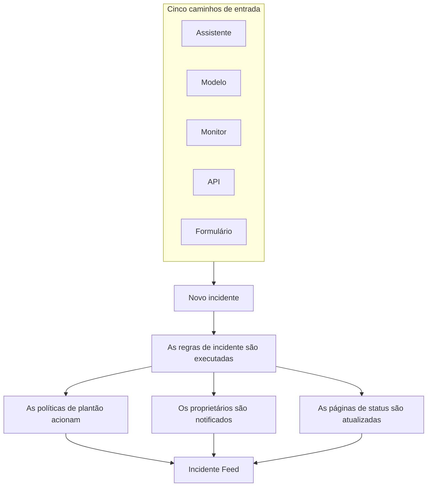
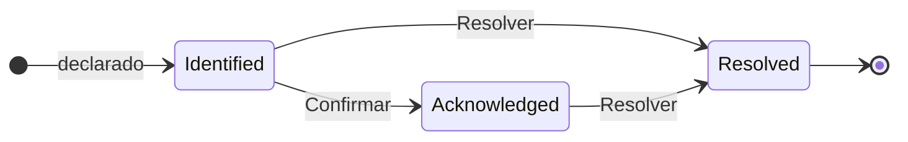

# Visão geral dos incidentes

Um incidente é o registro a partir do qual sua equipe trabalha quando algo quebra: o que está afetado, quão grave é, em que ponto está a resposta, de quem ele é e tudo o que é anotado pelo caminho. Declarar um aciona a escala de plantão certa, avisa os proprietários e — se você quiser — coloca a interrupção na sua página de status, para que os clientes saibam que você já está cuidando disso.

:::cards
- [Declarar um incidente](/docs/incidents/declaring-incidents): Manualmente, a partir de um modelo, de um monitor, pela API ou por um formulário.
- [Estados e severidades de incidentes](/docs/incidents/states-and-severities): O ciclo de vida, e o que fazem a confirmação e a resolução.
- [Notas, responsáveis e feed de incidentes](/docs/incidents/notes-owners-and-feed): Atualizações para os clientes e para sua equipe, e quem fica sabendo delas.
- [Alertas vinculados](/docs/incidents/linked-alerts): Ligue os alertas que uma interrupção gerou ao incidente que os explica.
- [Configurações e automação de incidentes](/docs/incidents/settings): Modelos, campos personalizados, funções, medições e regras.
:::

## Visão rápida

- **Um produto próprio** — abra **Incidentes** no menu **Produtos** da barra superior; a lista fica em `/dashboard/{projectId}/incidents`.
- **Três estados iniciais** — **Identified**, **Confirmado** e **Resolvido** são criados para todo projeto novo. Você pode adicionar os seus; os três iniciais podem ser renomeados e recoloridos, mas nunca excluídos.
- **Três severidades iniciais** — **Critical Incident**, **Major Incident** e **Minor Incident**. Uma severidade é um rótulo com uma cor e uma ordem — ela não tem comportamento próprio.
- **Cinco caminhos de entrada** — o assistente **Declarar incidente**, **Criar a partir de modelo**, uma regra de critérios de monitor, `POST /api/incident`, ou um [formulário](/docs/forms/index) que qualquer pessoa com o link pode preencher.
- **Numerados por projeto** — cada incidente recebe um número de incidente de um contador do projeto, exibido com o prefixo do seu projeto: `INC-42` em um projeto novo, ou `#42` sem prefixo.
- **Dois tipos de notas** — notas privadas (notas internas) para sua equipe, notas públicas para os assinantes da página de status.
- **Alertas se vinculam a incidentes** — vincule os alertas que fazem parte de um incidente, ou declare um incidente direto a partir de alertas — de uma lista de alertas ou da página de um alerta — e confirme-os ao fazer isso. Veja [Alertas vinculados](/docs/incidents/linked-alerts).
- **As configurações ficam em Incidentes, não em Configurações do projeto** — estados, severidades, modelos, campos personalizados e os mecanismos de regras ficam todos em **Incidentes → Configurações** e **Incidentes → Regras**.

## Como funciona

Você pode declarar um incidente manualmente às 3 da manhã, ou deixar que um monitor o declare no momento em que seus critérios corresponderem. De um jeito ou de outro, o incidente é o mesmo objeto, com o mesmo ciclo de vida e o mesmo histórico escrito no final.

### 1. Ele é declarado

Cinco caminhos levam ao mesmo objeto:

- **Manualmente** — na lista de incidentes, clique em **Declarar incidente**. Isso abre o assistente **Declarar novo incidente**, em três etapas: **Detalhes do incidente**, **Recursos afetados**, **Plantão e funções**. A primeira etapa pede um título, uma severidade e uma descrição, e o que a maioria dos incidentes nunca precisa fica recolhido em **Mais campos**. Só a primeira etapa pede algo que você precisa responder: **Próximo** percorre o resto, e **Declarar incidente** fica no resumo no final.
  - **A partir de alertas** — **Declarar incidente** em uma seleção de alertas, ou no cabeçalho de um alerta, abre o mesmo assistente, preenchido a partir dos alertas, vincula-os ao novo incidente e, a menos que você desmarque a caixa, confirma-os para que parem de escalar — veja [Alertas vinculados](/docs/incidents/linked-alerts).
- **A partir de um modelo** — clique em **Criar a partir de modelo** e escolha um **Incidente Modelo** salvo. Os modelos preenchem título, descrição, severidade, estado inicial, recursos, políticas de plantão, proprietários e rótulos.
- **A partir de um monitor** — uma regra de critérios de monitor com a opção «declarar um incidente» ativada cria o incidente automaticamente no momento em que seus filtros correspondem. Os títulos e as descrições ali aceitam modelos `{{variable}}`.
- **Pela API** — `POST /api/incident` com uma chave de API. O servidor preenche para você `declaredAt`, o estado de criação e o número do incidente.
- **Por um formulário** — alguém de fora da sua equipe preenche um formulário que você compartilhou como link, sem uma conta do OneUptime. O incidente é declarado oculto das páginas de status, a partir do modelo de incidente do formulário, se ele tiver um. Veja [Formulários](/docs/forms/index).

As integrações também abrem incidentes: o [Huntress](/docs/integrations/huntress) transforma cada relatório de incidente que seu SOC envia em um incidente, que aciona as políticas de plantão que você escolher. Veja [Declarar um incidente](/docs/incidents/declaring-incidents) para o passo a passo campo a campo.

### 2. As pessoas certas ficam sabendo

Na criação, o OneUptime executa a automação que você configurou: regras de privacidade, regras de proprietário, regras de rótulos, regras de plantão e regras de runbook. Todas as políticas de plantão anexadas ao incidente — manualmente, a partir de um modelo ou incluídas por uma regra de plantão que corresponde — são executadas em paralelo.

Os proprietários são notificados nos canais que cada um ativou em **Configurações do usuário → Configurações de notificação**: e-mail, SMS, chamada de voz, push, WhatsApp, Telegram, Slack, Microsoft Teams ou webhook. Se um incidente não tiver nenhum proprietário, a notificação recai sobre os proprietários do projeto em vez de se perder.

Se o incidente estiver visível em uma página de status e as notificações aos assinantes estiverem ativadas, os assinantes também são avisados: os assinantes de cada página de status que lista um dos seus monitores, ou apenas os das páginas às quais você o limitou. Veja [Uma página de status por público](/docs/status-pages/one-status-page-per-audience) para dar a cada público a sua própria página de status.

> [!NOTE]
> As notificações são enviadas por uma tarefa agendada que roda a cada minuto, então espere até cerca de um minuto de atraso em vez de um envio instantâneo.

### 3. Sua equipe trabalha nele

Os respondedores confirmam o incidente, anexam os recursos afetados, vinculam os alertas que fazem parte dele, executam runbooks, atribuem funções do incidente e anotam o que vão descobrindo — notas privadas para a equipe, notas públicas para os clientes, além das páginas **Causa raiz** e **Remediação** quando o quadro fica mais claro. Tudo o que fazem vai para o **Incidente Feed** na página **Visão geral**.

### 4. Ele é resolvido

Clicar em **Resolver** move o incidente para o estado resolvido, registra isso na linha do tempo de estados, para o relógio de duração, devolve os monitores que ele retém e tira o incidente da seção ativa de qualquer página de status em que ele aparecia. Nada mais precisa mudar para isso acontecer — uma página de status mostra apenas incidentes em um estado acima do estado resolvido. Veja [O que a resolução faz](/docs/incidents/states-and-severities#o-que-a-resolução-faz).

Depois disso, você pode escrever um post-mortem e, se quiser, publicá-lo na página de status.

## Termos-chave

Um punhado de palavras aparece em todas as outras páginas desta seção. Esclareça-as primeiro.

| Termo                        | O que significa                                                                                                                                     |
| ---------------------------- | --------------------------------------------------------------------------------------------------------------------------------------------------- |
| **Incidente**                | O registro em si — título, descrição, severidade, estado atual, recursos afetados e tudo o que é escrito nele durante a resposta.                    |
| **Estado do incidente**      | Em que ponto do ciclo de vida o incidente está. Uma linha do projeto com nome, cor e `order`, mais os indicadores que lhe dão significado.          |
| **Severidade do incidente**  | Quão grave ele é. Uma linha do projeto com nome, cor e `order`. Pura classificação — nada no produto trata uma severidade de forma especial.        |
| **Número do incidente**      | Um contador por projeto exibido como `#42`, ou, com um prefixo que você configura, como `INC-42`.                                                    |
| **Recursos afetados**        | Os monitores, hosts, clusters Kubernetes, hosts Docker, serviços e demais infraestrutura que você anexa ao incidente.                                |
| **Nota pública**             | Uma atualização escrita para quem lê a página de status e para os assinantes. Ela aparece na linha do tempo da página de status.                    |
| **Nota privada**             | Uma nota interna (o modelo `IncidentInternalNote`) para a equipe que está respondendo. Ela nunca chega a uma página de status.                       |
| **Proprietário**             | Um usuário ou uma equipe responsável pelo incidente. Os proprietários são notificados quando ele é criado, quando notas são publicadas e quando o estado muda. |
| **Incidente Feed**           | A linha do tempo de atividades somente de acréscimo na **Visão geral** do incidente, que registra mudanças de estado, notas, mudanças de proprietários, execuções de regras e notificações. |
| **Linha do tempo de estado** | O registro de em qual estado o incidente esteve, quando e por quanto tempo — com o status de notificação dos assinantes de cada transição.           |
| **Alerta vinculado**         | Um alerta vinculado ao incidente como parte da sua resposta. Um alerta pode ser vinculado a mais de um incidente, e mantém seu próprio estado.        |

## Os três estados que o OneUptime cria para cada projeto

Quando um projeto é criado, o OneUptime cria exatamente três estados de incidente, nesta ordem:

| Estado            | Ordem | Cor                   | O que significa                                                           |
| ----------------- | ----- | --------------------- | ------------------------------------------------------------------------- |
| **Identified**    | 1     | Vermelho (`#fd625e`)  | O estado em que cai um incidente recém-criado. É o estado de criação.     |
| **Confirmado**    | 2     | Amarelo (`#ffbf53`)   | Alguém assumiu o incidente e está trabalhando nele.                       |
| **Resolvido**     | 3     | Verde (`#2ab57d`)     | O incidente acabou. É a resolução que o tira da sua página de status.     |

Os nomes são só rótulos — o que realmente determina o comportamento são três booleanos na linha do estado: `isCreatedState`, `isAcknowledgedState` e `isResolvedState`. Espera-se que apenas um estado por projeto tenha cada indicador.

Essa distinção importa mais do que parece:

- `isCreatedState` decide onde um incidente novo começa. Se nenhum estado for escolhido explicitamente na criação, o OneUptime procura o estado de criação do projeto e o usa.
- `isAcknowledgedState` e `isResolvedState` marcam o estado confirmado e o estado resolvido. A posição do estado de um incidente em relação a eles determina os botões **Confirmar** e **Resolver** no cabeçalho do incidente, os dois blocos de estatísticas da **Visão geral** do incidente e o contador **Incidentes ativos** no menu lateral: um incidente no estado confirmado ou em qualquer estado posterior está confirmado, e um no estado resolvido ou em qualquer estado posterior está resolvido.
- **Incidentes ativos** é definido unicamente como «o estado atual fica acima do estado resolvido». Um estado personalizado que você adiciona acima do estado resolvido é, portanto, ativo; um que você coloca depois conta como resolvido, assim como o próprio estado resolvido.

> [!NOTE]
> O primeiro estado inicial se chama **Identified**, embora várias descrições dentro do produto ainda o chamem de estado de criação («created»). Se você estiver procurando «Created» na lista de estados do seu projeto, é a linha chamada **Identified**.

Você pode adicionar seus próprios estados em **Incidentes → Configurações → Estado do incidente**. Um estado novo é adicionado logo acima do estado resolvido, e você reordena as linhas arrastando-as; a coluna **Conta como** mostra como conta um incidente em cada estado — não confirmado, confirmado ou resolvido. Os três estados marcados levam a etiqueta **Integrado**: eles mantêm sua ordem e não podem ser excluídos, mas você pode renomeá-los, recolori-los e movê-los, e é por isso que a interface lê os nomes dos estados de forma dinâmica.

A ordem é aplicada, não é decorativa: um incidente não pode passar para um estado que fica antes, na ordem, do seu estado atual. Todos os detalhes estão em [Estados e severidades de incidentes](/docs/incidents/states-and-severities).

## As três severidades que o OneUptime cria para cada projeto

Todo projeto novo também recebe três severidades:

| Severidade            | Ordem | Cor                   | O que significa                                            |
| --------------------- | ----- | --------------------- | ---------------------------------------------------------- |
| **Critical Incident** | 1     | Bordô (`#b70400`)     | Impacto muito alto nos clientes, exigindo resposta imediata. |
| **Major Incident**    | 2     | Vermelho (`#fd625e`)  | Impacto significativo, que geralmente exige resposta imediata. |
| **Minor Incident**    | 3     | Amarelo (`#ffbf53`)   | Impacto baixo, geralmente tratado no horário de trabalho.  |

As severidades têm `name`, `description`, `color` e `order`, e nada mais. Não há indicadores, e nenhum trecho de código trata «Critical Incident» de forma diferente de qualquer outra linha. A severidade é como as pessoas fazem a triagem, e está disponível como critério de correspondência quando você escreve regras de plantão — mas escolher uma severidade não aciona, por si só, ninguém.

Edite ou adicione severidades em **Incidentes → Configurações → Severidade do incidente**. As descrições iniciais completas estão em [Estados e severidades de incidentes](/docs/incidents/states-and-severities).

## Onde os incidentes ficam no painel

Abra **Incidentes** no menu **Produtos** da barra superior. Seu menu lateral é organizado em seções:

| Seção                     | O que você faz ali                                                                                                                                                         |
| ------------------------- | -------------------------------------------------------------------------------------------------------------------------------------------------------------------------- |
| **Visão geral**           | **Todos os incidentes** e **Incidentes ativos** — este último leva um selo vermelho com a contagem de incidentes em um estado acima do estado resolvido.                    |
| **Episódios**             | Os episódios de incidente, um recurso de agrupamento separado com suas próprias páginas.                                                                                   |
| **IA**                    | **Insights**, **Registros**, **Configurações**: o que o OneUptime AI aprendeu com seus incidentes e tudo o que fez por eles, e o que pode fazer por conta própria — com as regras sobre quais incidentes investiga e corrige. Veja [AI SRE](/docs/ai/ai-sre). |
| **Espaço de trabalho**    | Os espaços de chat que este projeto conectou: **Slack**, **Microsoft Teams** ou ambos, cada um com suas regras de notificação para incidentes. Se nenhum estiver conectado, contém **Conectar Slack ou Teams**, uma página que mostra os dois e como conectá-los. |
| **Integrações**           | Ferramentas que abrem incidentes por conta própria: **Huntress**, cujos relatórios de incidente viram incidentes que acionam o plantão. Veja [Huntress](/docs/integrations/huntress). |
| **Regras**                | Os mecanismos de regras: **Regras de agrupamento**, **Regras de Plantão**, **Regras de proprietário**, **Regras de runbook**, **Regras de privacidade**, **Regras de Rótulos**, **Regras de SLA**, **Reminder Rules**. |
| **Configurações**         | **Estado do incidente**, **Severidade do incidente**, **Modelos de incidentes**, **Modelos de notas**, **Modelos de post-mortem**, **Campos personalizados**, **Funções de incidente**, **Medições**, **Alertas vinculados**, **Prefixo do número**. |

**Visão geral** e **Episódios** ficam abertas; **IA**, **Espaço de trabalho**, **Integrações**, **Regras**, **Configurações** e **Desenvolvedores** ficam recolhidas por padrão, para que o menu abra nas listas que você usa todos os dias. Clique no título de uma seção para expandi-la e encontrar as páginas a que o resto desta documentação se refere; uma seção também se abre sozinha sempre que você está em uma de suas páginas. A configuração de incidentes não fica nas configurações do projeto; ela vive toda aqui.

A lista de incidentes mostra **Número do incidente**, **Título**, **Estado**, **Gravidade**, **Recursos afetados**, **Declarado**, **Duração**, **Rótulos** e **Proprietários**, com uma ação em massa **Alterar estado** para encerrar vários de uma vez.

## O que cada página de um incidente mostra

Abra um incidente e o menu lateral dele agrupa suas páginas assim:

| Seção do menu lateral | Páginas                                                                                   |
| --------------------- | ----------------------------------------------------------------------------------------- |
| **Visão geral**       | **Visão geral**, **Linha do tempo de estado**, **SLA**                                    |
| **Investigação**      | **Descrição**, **Causa raiz**, **Remediação**, **Runbooks**, **Post-mortem**, **Alertas vinculados** |
| **Equipe**            | **Funções**, **Execuções de plantão**, **Proprietários**                                  |
| **Notificações**      | **Logs de notificação**, **Registros de IA** — recolhida até você clicar em **Notificações** |
| **Notas**             | **Notas privadas**, **Notas públicas**                                                    |
| **Desenvolvedores**   | **Terraform**, **API**, **Assistentes de IA** — recolhida até você clicar em **Desenvolvedores** |
| **Avançado**          | **Campos personalizados**, **Configurações**, **Registros de auditoria**, **Excluir incidente** — recolhida até você clicar em **Avançado** |

O que cada uma contém:

- **Visão geral** — a resposta num relance. Abaixo do cabeçalho, blocos de estatísticas mostram o tempo até a confirmação, o tempo até a resolução e a **Duração** total. O cartão **AI Investigation** abre a página — o que o OneUptime AI encontrou, ou por que não começou — com o **Incidente Feed** abaixo dele. Ao lado ficam o cartão **Video Call**, o cartão **Detalhes do incidente** (título, severidade, rótulos, número do incidente, declarado em, declarado por, políticas de plantão e o ID do incidente em uma pequena linha **ID** no rodapé, a um clique da sua área de transferência), **Funções de incidente**, um cartão **Recursos afetados** e os campos personalizados do incidente. Quando seu projeto tem [medições](/docs/incidents/settings#medições), um cartão **Medições** abaixo de **Detalhes do incidente** informa o que cada uma mostra para este incidente: **12 minutos**, **Em andamento há 5 minutos**, **Não alcançado**.
- **Linha do tempo de estado** — cada estado em que o incidente esteve, com **Começa em**, **Termina em**, **Duração** e o status de notificação dos assinantes de cada transição. **Ver causa** e **Ver registros** explicam por que cada mudança aconteceu.
- **SLA** — o acompanhamento de SLA deste incidente.
- **Descrição**, **Causa raiz**, **Remediação** — três páginas em Markdown. A descrição é a que aparece na sua página de status.
- **Runbooks** — as execuções de runbook anexadas a este incidente.
- **Post-mortem** — o relatório e seus anexos, que você pode publicar opcionalmente na página de status. **Editar nota do post-mortem** pede a nota e os anexos, e depois **Publicar na Página de status**; só enquanto isso estiver ativado ele pede **Notificar assinantes** e **Análise pós-incidente publicada em**, que ativar a publicação define como agora. **Generate with AI** redige a nota para você, e **Aplicar modelo** — exibido quando o projeto tem um modelo de post-mortem — começa a nota a partir de um modelo. Os assinantes são avisados uma vez, quando o post-mortem é publicado: na primeira vez que a página de status o mostra, o que exige **Publicar na Página de status** ativado e uma nota escrita. Salvá-lo de novo, ou editá-lo enquanto está publicado, atualiza a página de status sem avisar ninguém; publicá-lo de novo depois de retirá-lo da página de status os avisa de novo. Um publicado enquanto o incidente está oculto é enviado quando o incidente fica visível. Veja [O post-mortem](/docs/status-pages/subscribers#incidentes).
- **Alertas vinculados** — os alertas vinculados a este incidente, com o estado atual de cada alerta, e quem o vinculou e quando. Os alertas têm uma página **Incidentes vinculados** correspondente. Veja [Alertas vinculados](/docs/incidents/linked-alerts).
- **Funções**, **Execuções de plantão**, **Proprietários** — quem está nele, quais políticas foram acionadas e quem é notificado.
- **Logs de notificação**, **Registros de IA**, **Registros de auditoria** — o que foi enviado e o que mudou.
- **Notas privadas** e **Notas públicas** — o que foi dito à sua equipe e aos seus clientes. Veja [Notas, responsáveis e feed de incidentes](/docs/incidents/notes-owners-and-feed).
- **Campos personalizados**, **Configurações**, **Excluir incidente** — a página **Configurações** contém **Visível na página de status** e **Incidente privado**, o cartão **Escopo de páginas de status** que limita o incidente a algumas páginas de status, e o cartão **Reminders**, cujo interruptor **Enviar lembretes** é salvo assim que você o altera e mostra quando sai o próximo lembrete.

## Como os incidentes se encaixam no resto do OneUptime

- **Os monitores detectam o problema; os incidentes o registram.** Uma regra de critérios de monitor pode declarar um incidente automaticamente, preenchendo título, severidade, políticas de plantão, proprietários, rótulos e notas de remediação. Veja [Modelos de incidentes e alertas](/docs/monitor/incident-alert-templating) para as variáveis disponíveis.
- **Os alertas são os sinais; os incidentes são a resposta.** Vincule a um incidente os alertas que ele explica, de qualquer um dos lados, e dois interruptores do projeto, ativados em projetos novos, confirmam e resolvem esses alertas junto com o incidente. Veja [Alertas vinculados](/docs/incidents/linked-alerts).
- **As políticas de plantão fazem o acionamento.** Anexe políticas na etapa **Plantão e funções** do assistente de declaração, em um modelo, ou por meio de **Incidentes → Regras → Regras de Plantão**. Toda regra que corresponde é acionada — o conjunto executado é a união de todas as correspondências mais tudo o que foi anexado diretamente, sem duplicatas.
- **Os runbooks dizem às pessoas o que fazer.** As regras de runbook anexam um procedimento automaticamente quando um incidente correspondente é criado, e os respondedores podem iniciar um manualmente a partir do incidente. Veja [Visão geral dos Runbooks](/docs/runbooks/index).
- **As páginas de status informam os clientes.** Um incidente aparece na lista ativa de uma página de status quando a página lista um dos seus monitores, a página tem os incidentes ativados, o incidente está marcado como visível na página de status e seu estado atual fica acima do estado resolvido. Um incidente limitado a algumas páginas de status aparece só nelas. Incidentes privados ficam ocultos de todas as páginas de status, sempre. Veja [Visão geral das páginas de status](/docs/status-pages/index) e [Uma página de status por público](/docs/status-pages/one-status-page-per-audience).
- **Os workflows automatizam ao redor.** Os gatilhos **On Create Incident**, **On Update Incident** e **On Delete Incident** permitem construir automação sem código sobre o ciclo de vida do incidente. Veja [Visão geral dos workflows](/docs/workflows/index).

## Próximos passos

:::cards
- [Declarar um incidente](/docs/incidents/declaring-incidents): Percorra o assistente campo a campo, ou declare a partir de um modelo, de um monitor ou da API.
- [Estados e severidades de incidentes](/docs/incidents/states-and-severities): Adicione seus próprios estados e veja exatamente o que cada um faz.
- [Visão geral das páginas de status](/docs/status-pages/index): Como os incidentes chegam aos seus clientes.
- [Assinantes e comunicados](/docs/status-pages/subscribers): Quem é notificado quando um incidente avança.
:::
