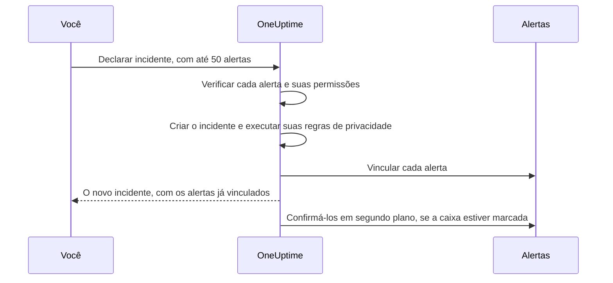

# Alertas vinculados

Uma interrupção raramente gera um só alerta. Quando o banco de dados principal cai, o monitor de atraso de replicação dispara, o monitor de taxa de erros da API dispara, e o SLO de latência do checkout começa a consumir seu orçamento — três alertas, um problema. Vincular esses alertas ao incidente diz exatamente isso: o incidente é onde a resposta acontece, e cada alerta mostra qual incidente o explica.

Um vínculo é só um vínculo. O alerta mantém seu próprio estado, seus proprietários, suas políticas de plantão, suas notas e seu feed; o incidente mantém os dele. Vincular não mescla nem copia nada, e por si só nunca confirma, resolve ou silencia um alerta. (Declarar um incidente novo a partir de alertas é diferente: o novo incidente é preenchido a partir deles, como [descrito abaixo](#declarar-um-incidente-a-partir-de-alertas), e a menos que você desmarque a caixa no formulário, os alertas são confirmados quando você o declara, o que interrompe o escalonamento deles — veja [Confirmar os alertas ao declarar](#confirmar-os-alertas-ao-declarar).) Dois interruptores do projeto, ativados em projetos novos, levam os alertas vinculados junto com o incidente quando ele é confirmado e resolvido — veja [mais abaixo](#manter-os-estados-dos-alertas-em-sincronia-com-o-incidente).

:::cards
- [Vincular alertas a um incidente](#vincular-alertas-a-partir-de-um-incidente): A partir do incidente, de um alerta, ou muitos de uma vez.
- [Declarar um incidente a partir de alertas](#declarar-um-incidente-a-partir-de-alertas): Um incidente novo, preenchido e vinculado de uma só vez.
- [Manter os estados dos alertas em sincronia](#manter-os-estados-dos-alertas-em-sincronia-com-o-incidente): Confirmar e resolver os alertas junto com o incidente.
- [Permissões](#permissões): Quem pode vincular, e o que vincular permite fazer.
:::

> [!TIP]
> Se você está vindo do Opsgenie, esta é a versão do OneUptime de associar alertas a um incidente.

## Visão rápida

- **Muitos para muitos** — um incidente pode ter qualquer número de alertas vinculados, e um alerta pode ser vinculado a vários incidentes.
- **Três lugares para vincular** — a página **Alertas vinculados** do incidente, a página **Incidentes vinculados** do alerta, e a ação em massa **Vincular a incidente** nas listas principais de alertas, para até **50** alertas de uma vez.
- **Declarar um incidente a partir de alertas** — **Declarar incidente** em uma lista de alertas, no cabeçalho de um alerta ou na página **Incidentes vinculados** dele preenche um incidente novo a partir dos alertas e os vincula enquanto ele é criado. Uma caixa no formulário, marcada por padrão, também os confirma, o que interrompe o próprio escalonamento de plantão deles.
- **Registrado dos dois lados** — cada vínculo e desvínculo grava uma entrada de feed no incidente e no alerta, exceto que um incidente declarado a partir de alertas recebe uma única entrada que lista todos. Só as entradas do incidente são publicadas no Slack e no Microsoft Teams, e o título de um alerta ou de um incidente privado nunca é escrito do outro lado.
- **Os estados dos alertas acompanham o incidente** — dois interruptores do projeto, ambos ativados em projetos novos, confirmam e resolvem os alertas vinculados quando o incidente é confirmado e resolvido. Desative qualquer um deles em **Incidentes → Configurações → Alertas vinculados**.
- **Automatizável** — os vínculos são um recurso comum da API, `/api/incident-alert`.

## Como funciona

Os alertas são sinais: os critérios de um monitor corresponderam, um SLO começou a consumir seu orçamento, uma regra de segurança disparou. Um incidente é a resposta coordenada a um problema (veja [Visão geral dos incidentes](/docs/incidents/index)). A maioria dos problemas produz vários sinais, e sem vínculos a única coisa que os liga à resposta é a memória de alguém.

```mermaid title="Três alertas, um incidente, e os interruptores que os movem"
flowchart TB
    subgraph signals["Alertas"]
        direction LR
        lag["Atraso de replicação"]
        errors["Taxa de erros da API"]
        latency["Latência do checkout"]
    end
    signals -->|"vinculados a"| incident["Incidente"]
    incident -->|"confirmado"| ack["Alertas vinculados confirmados"]
    incident -->|"resolvido"| res["Alertas vinculados resolvidos"]
```

Com os alertas vinculados:

- Os respondedores do incidente veem, em uma lista, quais alertas fazem parte dele e em que estado cada um está.
- Quem abre um desses alertas vê que ele já está sendo tratado, e sob qual incidente, em vez de declarar um segundo incidente para a mesma interrupção.
- O feed do incidente registra quando cada alerta foi vinculado e por quem, então a linha do tempo mostra como o quadro foi se formando.
- Com os interruptores ativados, confirmar o incidente interrompe os escalonamentos de plantão dos alertas, para que quem está trabalhando no incidente não seja acionado de novo pelos sintomas dele.

## Como os vínculos funcionam

Um vínculo liga um alerta a um incidente. Os vínculos valem nos dois sentidos — o mesmo vínculo aparece na página **Alertas vinculados** do incidente e na página **Incidentes vinculados** do alerta.

- **Um alerta pode ser vinculado a vários incidentes.** A falha de uma dependência compartilhada pode ser sintoma de dois incidentes separados. Cada incidente lista o alerta, e o alerta lista os dois incidentes.
- **Cada par é vinculado uma vez.** Vincular um alerta a um incidente ao qual ele já está vinculado é rejeitado com «This alert is already linked to this incident.» — mesmo quando duas pessoas vinculam o mesmo par no mesmo instante.
- **Os vínculos são criados ou removidos, nunca editados.** Um vínculo não tem campos próprios além do incidente, do alerta, de quando foi feito e de quem o fez. Para mover um alerta para outro incidente, vincule-o ao novo e desvincule-o do antigo.
- **Os vínculos ficam dentro de um projeto.** O alerta e o incidente precisam pertencer ao mesmo projeto.

## Vincular alertas a partir de um incidente

:::steps
### Abrir a página Alertas vinculados do incidente

Abra o incidente e escolha **Alertas vinculados** na seção **Investigação** do menu lateral dele. A tabela lista cada alerta já vinculado a ele.

### Escolher o alerta

Clique em **Vincular alerta** e escolha-o na lista suspensa **Alerta**. A lista suspensa mostra primeiro os alertas mais recentes, cada um com seu número — como `ALT-63: Checkout API is offline` — para que alertas com o mesmo título, como os alertas repetidos de um monitor, possam ser diferenciados. Para encontrar um alerta mais antigo, digite: a lista suspensa busca em todos os alertas pelo título.

### Salvar o vínculo

Clique em **Vincular alerta** na caixa de diálogo. O alerta aparece na tabela, e os dois feeds registram o vínculo. Se o vínculo for recusado, por exemplo porque o alerta já está vinculado, a caixa de diálogo continua aberta e diz por quê.
:::

| Coluna             | O que mostra                                     |
| ------------------ | ------------------------------------------------ |
| **Alerta nº**      | O número do alerta, como `#17` ou `ALT-17`.      |
| **Título**         | O título do alerta, com link para o alerta.      |
| **Estado atual**   | O próprio estado do alerta, como **Confirmado**. |
| **Vinculado Em**   | Quando o alerta foi vinculado.                   |
| **Vinculado por**  | Quem o vinculou.                                 |

Cada linha tem **Ver alerta** para abrir o alerta e **Desvincular** para remover o vínculo.

## Vincular incidentes a partir de um alerta

O lado do alerta espelha o do incidente. Abra um alerta e escolha **Incidentes vinculados** na seção **Básico** do menu lateral dele. A tabela lista cada incidente a que o alerta está vinculado, com o número, o título e o estado atual do incidente, e quando e por quem ele foi vinculado.

- **Vincular incidente** vincula este alerta a um incidente existente. A lista suspensa dele funciona como a do lado do incidente: primeiro os incidentes mais recentes, cada um com seu número — como `INC-42: Checkout is down` — e digitar busca em todos os incidentes pelo título.
- **Ver incidente** abre um incidente vinculado.
- **Desvincular** remove um vínculo.
- **Declarar incidente** inicia um incidente novo a partir deste alerta. O mesmo botão fica no cabeçalho do alerta, ao lado de **Confirmar** e **Resolver**. Veja [Declarar um incidente a partir de alertas](#declarar-um-incidente-a-partir-de-alertas).

## Vincular muitos alertas de uma vez

As listas principais de alertas têm duas ações em massa para isso: **Todos os alertas** e **Alertas ativos**, os alertas ativos da página inicial, e a página **Alertas** de um monitor, de um serviço, de um host, de um cluster Kubernetes, de um SLO ou de qualquer outro recurso que tenha uma. A lista **Alertas de membros** de um episódio de alertas não as tem — selecione os alertas em uma das listas principais. Selecione os alertas e escolha:

- **Vincular a incidente** — escolha o incidente na lista suspensa **Incidente** e clique em **Vincular alertas**. Os incidentes mais recentes aparecem primeiro, com seus números, e digitar busca em todos os incidentes pelo título. O OneUptime vincula cada alerta selecionado, mostrando o progresso enquanto avança. Um alerta que já está vinculado àquele incidente conta como feito, e não como falha, então executar a ação duas vezes não causa problema.
- **Declarar incidente** — abre o formulário de declaração de um incidente novo preenchido a partir dos alertas selecionados. Veja a próxima seção.

As duas ações aceitam até **50** alertas de uma vez. Selecione mais e elas ficam desativadas, com uma dica dizendo por quê. O limite existe porque cada vínculo grava nos dois feeds, e cada vínculo feito com **Vincular a incidente** também é publicado nos canais do Slack e do Microsoft Teams do incidente — uma seleção de mil alertas os inundaria.

## Declarar um incidente a partir de alertas

Quando uma rajada de alertas acaba sendo um incidente que ninguém declarou ainda, declare-o a partir dos alertas. Há três formas de entrar:

- Selecione os alertas em uma das listas principais de alertas e escolha **Declarar incidente**.
- Abra um alerta e clique em **Declarar incidente** no cabeçalho dele, ao lado de **Confirmar** e **Resolver**. O botão continua ali depois que o alerta é confirmado ou resolvido, então você ainda pode declarar um incidente para um alerta depois do fato — para fazer um post-mortem sobre ele, por exemplo.
- Abra a página **Incidentes vinculados** de um alerta e clique em **Declarar incidente**.

As três exigem permissão para criar incidentes e para vincular alertas a eles. Sem ela, o botão fica bloqueado, e a dica dele nomeia a permissão que falta.

Seja qual for o caminho, você cai no formulário de costume **Declarar novo incidente**, com os alertas listados como os que serão vinculados e estes campos preenchidos:

| Campo                        | Preenchido com                                                                                                                                                                                                                                                                         |
| ---------------------------- | -------------------------------------------------------------------------------------------------------------------------------------------------------------------------------------------------------------------------------------------------------------------------------------- |
| **Título**                   | Um alerta: o título dele. Vários: o título do alerta mais severo.                                                                                                                                                                                                                      |
| **Descrição**                | Um alerta: a descrição dele. Vários: uma lista com uma linha por alerta, com o número e o título.                                                                                                                                                                                      |
| **Severidade do incidente**  | A severidade do alerta mais severo, traduzida para uma severidade de incidente. Vence uma severidade de incidente com o mesmo nome, sem diferenciar maiúsculas e minúsculas. Caso contrário, o OneUptime usa a severidade de incidente na mesma posição da ordem de severidades, ou a última, se você tiver menos severidades de incidente. |
| **Recursos afetados**        | Todos os monitores, hosts, clusters Kubernetes, hosts Docker, hosts Podman e serviços dos alertas selecionados, combinados. Os monitores vão para **Monitores**, o resto para **Outros recursos afetados**. Outros recursos, como SLOs ou clusters VMware, Proxmox e Ceph, não são copiados — adicione-os você mesmo se o incidente os afetar. |
| **Rótulos**                  | Todo rótulo de todo alerta selecionado.                                                                                                                                                                                                                                                |
| **Incidente privado**        | Ativado se algum dos alertas for privado. O formulário diz isso, e os proprietários dos alertas se tornam proprietários do incidente — veja abaixo.                                                                                                                                     |

«Mais severo» segue a ordem das suas severidades de alerta: a primeira severidade de alerta da lista é a mais severa. Com as severidades com que todo projeto começa, um alerta **High** vira um **Critical Incident** e um alerta **Low** um **Major Incident**.

Tudo pode ser editado antes do envio. **Rótulos** e **Incidente privado** ficam em **Mais campos** na primeira etapa do formulário, cujo cabeçalho recolhido mostra qualquer um dos dois enquanto estiver definido.

**Um alerta que já tem um incidente é sinalizado.** Com **Declarar incidente** na página de cada alerta, duas pessoas acionadas pela mesma interrupção podem cada uma declará-la. Por isso, o quadro que lista os alertas marca cada alerta que já está vinculado a um incidente — «(already linked to Incident INC-42)», com link para esse incidente — e acrescenta uma observação, escrita conforme quantos alertas estão vinculados:

- Todos os alertas, e é um só: «This alert is already linked to an incident. If it is the same problem, update that incident instead of declaring another one.»
- Todos os alertas, e são vários: «These alerts are already linked to incidents. If it is the same problem, update that incident instead of declaring another one.»
- Só alguns deles: «Some of these alerts are already linked to an incident. If it is the same problem, link the other alerts to that incident from the alerts list instead of declaring another one.»

Os links dos incidentes abrem em uma nova aba, para que você possa conferir o incidente existente sem perder o que já preencheu no formulário. A observação é um lembrete, não um bloqueio, e só são nomeados incidentes que você tem permissão para ver.

**As políticas de plantão não são copiadas.** Os alertas executaram suas próprias políticas de plantão quando foram criados, então copiá-las para o incidente acionaria as mesmas pessoas uma segunda vez. As políticas de plantão do incidente são as que você escolher na etapa **Plantão e funções** mais as que suas regras de plantão de incidentes adicionarem — exatamente como em qualquer outro incidente.

**Os monitores dos alertas são preenchidos como monitores afetados.** Como em qualquer incidente declarado manualmente, o monitoramento ativo dos monitores do incidente fica pausado até que o incidente seja resolvido. Remova um monitor de **Monitores** na etapa **Recursos afetados** antes de enviar se ele deve continuar sendo verificado.

**Um alerta privado gera um incidente privado.** Se algum dos alertas for privado, **Incidente privado** começa ativado, e o quadro que lista os alertas diz isso. Um incidente privado só é visível para seus proprietários, Project Owners e Project Admins, então o OneUptime garante que quem podia ver os alertas possa ver o incidente: depois que ele é declarado, os proprietários de cada alerta declarado — usuários e equipes — são adicionados como proprietários do incidente, sem serem notificados. Eles são adicionados logo depois que os canais do Slack e do Microsoft Teams do incidente são criados, então são convidados para esses canais como qualquer outro proprietário. Você também é proprietário, como em qualquer incidente que declara. O mesmo acontece quando uma regra de privacidade de incidentes torna o novo incidente privado. Se você desativar **Incidente privado** antes de enviar e nenhuma regra de privacidade se aplicar, o incidente não é privado e nenhum proprietário é copiado.



Quando você envia, o servidor verifica os alertas antes de criar qualquer coisa: no máximo 50, cada um um alerta deste projeto que você tem permissão para ver, e você precisa ter permissão para vincular alertas a incidentes. Se alguma verificação falhar, a requisição é rejeitada e nenhum incidente é criado — então um id de alerta errado nunca consome um número de incidente. Depois que o incidente existe — e depois que suas regras de privacidade rodaram, para que os vínculos saibam se ele é privado — cada alerta é vinculado antes de a requisição responder, então a página **Alertas vinculados** do incidente já os lista. Se um único vínculo falhar — porque o alerta foi excluído um instante antes, por exemplo — o incidente ainda é declarado e os outros alertas ainda são vinculados.

O feed do incidente recebe uma única entrada **Alerta vinculado** listando os alertas, gravada depois de **Incidente criado**, em vez de uma por alerta — veja [O feed, o Slack e o Microsoft Teams](#o-feed-o-slack-e-o-microsoft-teams).

### Confirmar os alertas ao declarar

Declarar um incidente não interrompe, por si só, o acionamento dos alertas dele: o escalonamento de plantão de um alerta só para quando o próprio alerta é confirmado. Então, quando algum dos alertas ainda não está confirmado, o quadro do formulário tem uma caixa de seleção, marcada por padrão — **Acknowledge this alert to stop its escalation** para um alerta, **Acknowledge these 3 alerts to stop their escalation** para vários. Se alguns deles já estiverem confirmados, ela nomeia só os outros e diz que o resto fica como está.

Deixe-a marcada e, depois que o incidente for declarado e os alertas vinculados:

- **Os alertas são confirmados em seu nome.** Cada um passa para o seu estado de alerta **Confirmado** como se você mesmo tivesse clicado em **Confirmar** nele: a **Linha do tempo de estado** e o feed do alerta nomeiam você, os proprietários do alerta são notificados, e a mudança é publicada nos canais do Slack e do Microsoft Teams do alerta como qualquer outra mudança de estado de alerta. A causa diz «Acknowledged because Incident INC-42 was declared from this alert.» — ou, para um incidente privado, «Acknowledged because a private incident was declared from this alert.», para que um incidente privado nunca seja nomeado onde o público do alerta possa lê-lo.
- **O próprio escalonamento de plantão deles para em cerca de um minuto.** A próxima etapa de escalonamento vê um alerta confirmado e para. Acionamentos que já saíram não são recolhidos.
- **Os lembretes só param se a regra de lembrete disser isso.** Os lembretes de um alerta só param na confirmação quando a regra de lembrete dele tem **Stop Reminders When** definido como **Confirmado**; caso contrário, continuam até o alerta ser resolvido.
- **Um episódio de alertas continua escalando.** Se um alerta pertence a um episódio que aciona pela própria política de plantão, o episódio continua escalando até que o próprio episódio seja confirmado.
- **Alertas já confirmados ou resolvidos ficam como estão.** Como em todo lugar, os estados são comparados pela ordem, então um alerta em um estado personalizado depois de **Confirmado** conta como confirmado, e nada é movido para trás.

Desmarque a caixa para declarar sem confirmar. Sempre que alertas forem ficar sem confirmação — a caixa está desmarcada ou bloqueada — o formulário diz isso: «Declaring the incident does not acknowledge the alert: it keeps escalating until it is acknowledged.» E se você confirmar os alertas sem escolher uma política de plantão para o incidente, o resumo da etapa **Plantão e funções** aponta isso: «The alerts it is declared from are acknowledged too, so their own escalation stops. An alert episode they belong to keeps escalating until the episode is acknowledged, and an incident on-call rule, if any, may still page.»

**Você precisa de permissão para confirmar os alertas.** Confirmá-los ao declarar exige **Create Alert State Timeline** e **Edit Alert** (confirmar um alerta na própria página dele exige só a primeira: veja [Alterar um estado](/docs/permissions/index#alterar-um-estado)): Project Owner, Project Admin, Project Member, Alert Admin e Alert Member têm as duas, enquanto Incident Admin e Incident Member, que podem declarar incidentes a partir de alertas, não têm nenhuma. Seu escopo de rótulos e de proprietários nos alertas também precisa incluir cada alerta que será confirmado — só os que ainda não foram confirmados são verificados. Alertas já confirmados ou resolvidos não exigem permissão nenhuma e nunca bloqueiam a declaração. Sem as permissões, a caixa fica bloqueada, com uma dica nomeando a que falta, e você ainda pode declarar o incidente. O servidor verifica de novo antes de criar qualquer coisa, para cada alerta que vai confirmar: se você não puder confirmar algum deles, nenhum incidente é criado e o formulário diz por quê — desmarque a caixa e envie de novo.

**O projeto precisa de um estado de alerta Confirmado.** Todo projeto começa com um. Se o seu não tiver, a caixa não é oferecida.

Os alertas são confirmados em segundo plano, logo depois de serem vinculados, alguns de cada vez — até 5 ao mesmo tempo — para que a página do incidente possa abrir um instante antes, e declarar a partir de muitos alertas não deixe os últimos esperando atrás de todos os outros. Um alerta que não pode ser confirmado — porque foi excluído nesse meio-tempo, por exemplo — é registrado em log e nunca interrompe os outros nem o incidente, e um alerta que outra pessoa confirma ou resolve nesse meio-tempo fica como ela o deixou.

**Com os interruptores de alertas vinculados do projeto ativados, podem ser os interruptores que movem os alertas.** Se o incidente for declarado direto em um estado confirmado ou resolvido e um dos [interruptores de alertas vinculados](#manter-os-estados-dos-alertas-em-sincronia-com-o-incidente) agir sobre esse estado, o interruptor move os alertas vinculados enquanto eles são vinculados, e a caixa deixa esses alertas para ele, para que cada alerta tenha um só autor de mudanças. Eles são confirmados ou resolvidos do jeito que o interruptor faz — com a causa do interruptor, como «Acknowledged because linked Incident INC-42 was acknowledged.», que nomeia o incidente pelo número mesmo quando ele é privado — não são atribuídos a você, e os proprietários deles não são notificados. Declarar no seu primeiro estado de incidente, como de costume, ou com os interruptores desativados, deixa todo alerta para a caixa.

### Declarar pela API

`POST /api/incident` aceita os ids dos alertas a vincular em `miscDataProps`, em `alertIdsToLink`, e se esses alertas devem ser confirmados em `acknowledgeAlertsToLink`:

```bash
curl -X POST https://oneuptime.com/api/incident \
  -H "apikey: $ONEUPTIME_API_KEY" \
  -H "Content-Type: application/json" \
  -d '{
    "data": {
      "title": "Primary database unavailable",
      "incidentSeverityId": "<incident-severity-id>"
    },
    "miscDataProps": {
      "alertIdsToLink": ["<alert-id>", "<another-alert-id>"],
      "acknowledgeAlertsToLink": true
    }
  }'
```

`alertIdsToLink` é um array de 1 a 50 ids de alerta. Duplicatas são ignoradas, e as mesmas verificações do painel se aplicam, antes de o incidente ser criado. Nada é preenchido pela API — envie o título, a severidade e os recursos que você quiser. A chave de API precisa de permissão para criar incidentes e vincular alertas a eles, e precisa conseguir ler os alertas. Uma chave de API não é um usuário, então vínculos feitos com ela não têm **Vinculado por**. Para o resto do corpo da requisição, veja [Declarar um incidente](/docs/incidents/declaring-incidents).

`acknowledgeAlertsToLink` é opcional, e fica desativado a menos que você o envie. Defina-o como `true` para confirmar os alertas depois que forem vinculados, como faz a caixa do formulário — alertas já confirmados ou resolvidos ficam como estão e não exigem permissão. Omita-o, ou envie `false`, para declarar sem confirmá-los. Ele é verificado junto com os ids dos alertas, antes de o incidente ser criado, e a requisição é rejeitada com um 400 quando:

- ele é qualquer coisa diferente de `true` ou `false`;
- ele é enviado sem `alertIdsToLink`;
- o projeto não tem um estado de alerta Confirmado;
- a chave de API não pode confirmar todo alerta que ainda não está confirmado — isso exige **Create Alert State Timeline** e **Edit Alert**, com um escopo de rótulos que inclua cada um desses alertas.

Uma chave de API não é um usuário, então alertas confirmados com ela não são atribuídos a ninguém, assim como os vínculos dela não têm **Vinculado por**.

## Vincular e desvincular pela API

Os vínculos são um recurso CRUD padrão em `/api/incident-alert`. Para vincular um alerta a um incidente, crie um:

```bash
curl -X POST https://oneuptime.com/api/incident-alert \
  -H "apikey: $ONEUPTIME_API_KEY" \
  -H "Content-Type: application/json" \
  -d '{
    "data": {
      "incidentId": "<incident-id>",
      "alertId": "<alert-id>"
    }
  }'
```

Para listar os alertas vinculados de um incidente, consulte por `incidentId`. Consulte por `alertId` para encontrar os incidentes a que um alerta está vinculado:

```bash
curl -X POST https://oneuptime.com/api/incident-alert/get-list \
  -H "apikey: $ONEUPTIME_API_KEY" \
  -H "Content-Type: application/json" \
  -d '{
    "query": { "incidentId": "<incident-id>" },
    "select": { "_id": true, "alertId": true, "createdAt": true },
    "limit": 50,
    "skip": 0
  }'
```

Para desvincular, exclua o vínculo pelo próprio id dele — o `_id` do vínculo, não o do alerta nem o do incidente:

```bash
curl -X DELETE https://oneuptime.com/api/incident-alert/<link-id> \
  -H "apikey: $ONEUPTIME_API_KEY"
```

Os dois ids são obrigatórios. Uma requisição de vínculo também é rejeitada quando o alerta ou o incidente pertence a outro projeto ou é um que você não pode ver. O erro é o mesmo, quer o alerta ou o incidente não exista, quer só esteja oculto para você, então ele nunca revela que existe um privado.

O mesmo recurso alimenta os componentes de workflow gerados — **On Create Incident Alert** dispara quando um alerta é vinculado e **On Delete Incident Alert** quando ele é desvinculado — e as ferramentas Incident Alert do servidor MCP. A [referência da API](/reference) tem os formatos completos de requisição e resposta.

## Desvincular

Desvincule de qualquer um dos lados: **Desvincular** em uma linha da página **Alertas vinculados** do incidente ou da página **Incidentes vinculados** do alerta, e depois confirme. Para desvincular vários de uma vez, selecione as linhas e escolha a ação em massa **Desvincular**. Ela remove só os vínculos — os alertas e os incidentes em si não são excluídos.

Desvincular remove o vínculo e nada mais. O alerta e o incidente mantêm seus estados, e um alerta que foi confirmado ou resolvido por causa do incidente continua assim — os estados dos alertas nunca voltam. Os dois feeds registram o desvínculo.

## Permissões

A vinculação tem quatro permissões granulares próprias, no grupo **Incident** da [Referência de permissões](/docs/permissions/reference):

| Permissão                 | O que permite                                                                                                          | Funções que a incluem                                                                                    |
| ------------------------- | ---------------------------------------------------------------------------------------------------------------------- | -------------------------------------------------------------------------------------------------------- |
| **Create Incident Alert** | Vincular um alerta a um incidente, inclusive ao declarar um incidente a partir de alertas. Você também precisa conseguir ler os dois. | Project Owner, Project Admin, Project Member, Incident Admin, Incident Member, Alert Admin, Alert Member |
| **Delete Incident Alert** | Desvincular.                                                                                                           | Project Owner, Project Admin, Project Member, Incident Admin, Incident Member, Alert Admin, Alert Member |
| **Read Incident Alert**   | Ver as listas **Alertas vinculados** e **Incidentes vinculados**.                                                      | Todas as acima, mais Viewer, Incident Viewer e Alert Viewer                                              |
| **Edit Incident Alert**   | Nada na prática — um vínculo não tem campos que você possa mudar.                                                      | Project Owner, Project Admin, Project Member, Incident Admin, Incident Member, Alert Admin, Alert Member |

As funções de alerta estão incluídas para que quem trabalha com alertas possa vinculá-los, e as funções de incidente para que quem trabalha com incidentes também possa. Nenhuma basta sozinha, porque um vínculo só é criado quando você pode ler os dois lados:

- **Uma função de alerta também precisa de acesso de leitura a incidentes** — adicione Viewer, Incident Viewer ou Read Incident.
- **Uma função de incidente também precisa de acesso de leitura a alertas** — adicione Viewer, Alert Viewer ou Read Alert.

Mais três regras se aplicam por cima:

- **Você precisa conseguir ver os dois lados.** Um vínculo só é criado quando você pode ler tanto o alerta quanto o incidente. Alertas e incidentes privados, e restrições por rótulos, se aplicam como de costume.
- **Um vínculo pertence ao seu incidente.** Se você pode ver um vínculo depende do seu acesso ao incidente dele: as restrições por rótulos e o escopo de proprietários nos incidentes também se aplicam ao vínculo.
- **Vincular exige acesso de leitura a um alerta, não de edição.** Com os interruptores de alertas vinculados do projeto ativados, como ficam em projetos novos, isso basta para que um vínculo confirme ou resolva o alerta — veja [Quem move um alerta vinculado](#quem-move-um-alerta-vinculado).

Declarar um incidente a partir de alertas também exige permissão para criar incidentes, e confirmar os alertas ao declarar exige **Create Alert State Timeline** e **Edit Alert** em cada um que ainda não está confirmado — veja [Confirmar os alertas ao declarar](#confirmar-os-alertas-ao-declarar). No painel, uma ação para a qual falta uma permissão fica bloqueada, e a dica dela nomeia a permissão que falta. Isso inclui o acesso de leitura ao outro lado: **Vincular alerta** fica bloqueado se você não pode ler alertas, e **Vincular incidente** e **Vincular a incidente** se você não pode ler incidentes. Para saber como funções, permissões granulares, rótulos e escopo de proprietários se combinam, veja [Usuários, equipes e permissões](/docs/permissions/index).

## O feed, o Slack e o Microsoft Teams

Cada vínculo e desvínculo é gravado nos dois feeds, atribuído a quem fez a mudança:

| Mudança       | Feed do incidente                          | Feed do alerta                                        |
| ------------- | ------------------------------------------ | ----------------------------------------------------- |
| Vincular      | **Alerta vinculado** (`AlertLinked`)       | **Vinculado a incidente** (`LinkedToIncident`)        |
| Desvincular   | **Alerta desvinculado** (`AlertUnlinked`)  | **Desvinculado de incidente** (`UnlinkedFromIncident`) |

Cada entrada nomeia o outro lado pelo número e leva até ele, então você pode pular do feed do incidente para o alerta e voltar. Ela também traz o título do outro lado, a menos que esse lado seja privado:

- **O título de um alerta privado fica fora da entrada do incidente**, e portanto fora do Slack e do Microsoft Teams. A entrada diz, por exemplo, «Linked Alert #12 (private alert) to Incident #5».
- **O título de um incidente privado fica fora da entrada do alerta**, que diz «Linked to Incident #5 (private incident)».

Isso vale mesmo quando os dois são privados, porque um alerta privado e um incidente privado podem ter proprietários diferentes. Abrir o alerta ou o incidente vinculado está sujeito à privacidade dele, como de costume.

**Só as entradas do incidente chegam ao Slack e ao Microsoft Teams.** **Alerta vinculado** e **Alerta desvinculado** são publicadas onde quer que as outras atualizações do feed do incidente vão. As entradas do lado do alerta ficam no painel, então um vínculo gera uma mensagem em vez de duas. Veja [Integração com Slack](/docs/workspace-connections/slack) e [Integração com Microsoft Teams](/docs/workspace-connections/microsoft-teams) para configurar esses canais.

**Declarar um incidente a partir de alertas grava uma entrada, não uma por alerta.** Os vínculos feitos enquanto o incidente é declarado não gravam entradas **Alerta vinculado** próprias. Em vez disso, depois que a entrada **Incidente criado** do incidente sai — e os próprios canais do Slack e do Microsoft Teams do incidente, se você os usa, foram criados — o incidente recebe uma única entrada **Alerta vinculado**: «Declared from 3 alerts:», seguida de uma linha por alerta com o número e o título (um alerta privado sem o título). Essa é a única mensagem publicada no Slack e no Microsoft Teams. Cada alerta continua recebendo sua própria entrada **Vinculado a incidente**.

As caixas de diálogo **Filtrar por tipo de evento** dos dois feeds, no menu **⋯** de cada feed, listam esses tipos de evento, então você pode mostrar ou ocultar a atividade de vínculos como qualquer outro tipo de entrada. Mais sobre o feed do incidente em [Notas, responsáveis e feed de incidentes](/docs/incidents/notes-owners-and-feed).

## Manter os estados dos alertas em sincronia com o incidente

Dois interruptores do projeto permitem que o incidente leve consigo seus alertas vinculados. Os dois vêm ativados em projetos novos. Um projeto criado antes de eles virem ativados por padrão mantém a configuração que tinha, que é desativada a menos que alguém os tenha ativado. Eles têm uma página de configurações própria, **Incidentes → Configurações → Alertas vinculados**, onde cada um é um interruptor no cartão **Alertas vinculados** que é salvo assim que você o altera. Só Project Owners e Project Admins podem alterá-los; para todos os outros, os interruptores ficam bloqueados e dizem qual permissão é necessária:

- **Confirmar alertas vinculados quando o incidente for confirmado** — quando o incidente chega ao seu estado confirmado, cada alerta vinculado que ainda não está confirmado passa para o seu estado de alerta **Confirmado**. É isso que interrompe os escalonamentos de plantão desses alertas: a próxima etapa de escalonamento vê um alerta confirmado e para, em cerca de um minuto. Acionamentos que já saíram não são recolhidos. Os lembretes de alerta também param quando a regra de lembrete do alerta tem **Stop Reminders When** definido como **Confirmado**; caso contrário, continuam até o alerta ser resolvido.
- **Resolver alertas vinculados quando o incidente for resolvido** — quando o incidente chega ao seu estado resolvido, cada alerta vinculado que ainda não está resolvido passa para o seu estado de alerta **Resolvido**, exceto um alerta que ainda esteja vinculado a outro incidente não resolvido. Esse alerta fica aberto para o outro incidente — confirmado, se o interruptor de confirmação também estiver ativado — e é resolvido quando o último dos incidentes dele for resolvido.

Com os dois interruptores desativados, vincular não muda nada no estado de um alerta. Um alerta vinculado fica onde está até alguém movê-lo, sua política de plantão continua escalando e seus lembretes continuam chegando. A única exceção é declarar um incidente a partir de alertas com a caixa do formulário marcada, o que os confirma ao declarar — veja [Confirmar os alertas ao declarar](#confirmar-os-alertas-ao-declarar).

### Como os interruptores se comportam

- **Ordem, não nomes.** «Chega» significa que o estado atual do incidente está no estado confirmado ou resolvido, ou além dele, na ordem dos seus estados. Um estado personalizado entre Confirmado e Resolvido, como um estado **Monitoramento**, conta como confirmado. Os alertas são comparados do mesmo jeito, então um alerta em um estado personalizado depois de **Confirmado** já conta como confirmado.
- **Nunca para trás.** Só os alertas atrás do estado de destino se movem. Um alerta que já está confirmado não é tocado pelo interruptor de confirmação, e um alerta resolvido nunca é tocado.
- **Resolver com só o interruptor de confirmação ativado** confirma os alertas vinculados, porque resolvido vem depois de confirmado.
- **Vincular a um incidente que já está confirmado ou resolvido** aplica os interruptores ao novo alerta na hora, como se o incidente tivesse acabado de mudar de estado.
- **Reabrir um incidente não reabre os alertas dele.** Os alertas não podem passar para um estado anterior.
- **Só o estado atual conta.** Adicionar uma entrada passada à **Linha do tempo de estado** do incidente — uma com **Termina em** — não move nenhum alerta.
- **Vincular sozinho nunca muda o estado de um alerta.** Com os dois interruptores desativados, o incidente nunca move os alertas dele.

Os alertas mudam de estado em segundo plano, logo depois do incidente. Cada mudança passa pela linha do tempo de estados do próprio alerta com uma causa como «Acknowledged because linked Incident INC-42 was acknowledged.», então a **Linha do tempo de estado** e o feed do alerta mostram por que ele se moveu. Os proprietários do alerta não recebem uma notificação de mudança de estado por isso, mas a mudança de estado é publicada no Slack e no Microsoft Teams como qualquer outra mudança de estado de alerta. Um alerta que não consegue se mover não interrompe os outros.

### Quem move um alerta vinculado

Ativar um interruptor entrega os estados dos alertas vinculados ao incidente, de propósito: o incidente é onde a resposta é conduzida, então quem conduz o incidente conduz também os alertas dele. A partir daí:

- **Quem pode mudar o estado de um incidente move os alertas vinculados dele.** Confirmar ou resolver o incidente os confirma ou resolve.
- **Quem pode vincular um alerta pode movê-lo.** Vincular um alerta a um incidente que já está confirmado ou resolvido move o alerta enquanto ele é vinculado.

Nenhuma das duas coisas exige permissão para editar os alertas. O próprio OneUptime os move, e vincular exige só acesso de leitura a um alerta. Então, com o interruptor de confirmação ativado, qualquer pessoa que possa vincular alertas ou mudar estados de incidentes pode confirmar — e interromper o escalonamento de plantão de — qualquer alerta que consiga ver; com o interruptor de resolução ativado, pode resolvê-lo. É por isso que só Project Owners e Project Admins podem alterar os interruptores. Eles vêm ativados em um projeto novo, então desative-os se os estados dos alertas só devem ser alterados por quem pode editar alertas.

### Resolver alertas que vêm de monitores

Confirmar é sempre seguro para o alerta de um monitor: um alerta confirmado continua contando como aberto, então o monitor continua usando-o em vez de abrir outro.

> [!WARNING]
> Resolver é diferente. Se o monitor ainda estiver falhando quando seu alerta for resolvido, a próxima verificação do monitor abre um alerta novo — e o alerta novo não está vinculado ao incidente. Se seus incidentes costumam ser resolvidos antes de os monitores se recuperarem, desative o interruptor de resolução e mantenha só o de confirmação, ou resolva os incidentes só quando os monitores deles estiverem saudáveis.

## Excluir alertas e incidentes

- **Excluir um alerta** o remove de todo incidente a que ele estava vinculado. Fora isso, os incidentes não mudam.
- **Excluir um incidente** remove os vínculos dele. Fora isso, os alertas não mudam e mantêm seus estados.
- **Excluir um projeto** remove todos os vínculos dele junto com todo o resto.

Nenhuma dessas ações grava entradas de feed **Alerta desvinculado** ou **Desvinculado de incidente** — só um desvínculo explícito faz isso.

## Próximos passos

:::cards
- [Declarar um incidente](/docs/incidents/declaring-incidents): O formulário de declaração, os modelos, os critérios de monitor e a API.
- [Estados e severidades de incidentes](/docs/incidents/states-and-severities): A ordem de estados com que os interruptores comparam.
- [Configurações e automação de incidentes](/docs/incidents/settings): As páginas de configurações de incidentes, entre elas Alertas vinculados.
- [Usuários, equipes e permissões](/docs/permissions/index): Funções, permissões granulares e escopo.
:::
