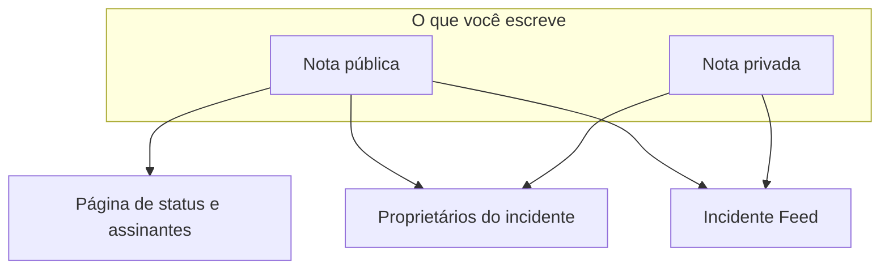

# Notas, responsáveis e feed de incidentes

Todo incidente acumula um registro escrito enquanto você trabalha nele: atualizações para seus clientes, notas de trabalho para sua equipe e um feed de atividades de tudo o que aconteceu. Esta página trata de escrever notas públicas e privadas, de quem cada uma alcança, do feed do incidente e dos proprietários que são avisados de cada mudança.

:::cards
- [Publicar uma nota pública](#publicar-uma-nota-pública): Conte aos clientes o que você sabe, na página de status e por notificação.
- [Quando os assinantes são notificados](#quando-uma-nota-pública-realmente-chega-aos-assinantes): As verificações por que uma nota pública passa, e seu selo.
- [O feed do incidente](#o-feed-do-incidente): A linha do tempo de tudo o que aconteceu.
- [Proprietários](#proprietários): Quem é responsável, e o que lhes é dito.
:::

## Como funciona

Parte do que você escreve é para seus clientes — a atualização que sai na página de status às 02:14 dizendo que você encontrou o deploy com problema. O resto é para sua equipe — o stack trace que alguém colou, o gráfico que finalmente fez sentido, a decisão de fazer failover. O OneUptime mantém esses dois públicos separados, e registra os dois no incidente.



As **Notas públicas** são publicadas na sua página de status e podem notificar os assinantes. As **Notas privadas** (o modelo `IncidentInternalNote`) ficam dentro do painel. Por baixo das duas estão o **Incidente Feed**, uma linha do tempo somente de acréscimo que registra tudo o que aconteceu com o incidente, e a lista de **Proprietários**, que decide quem é avisado.

Tudo isso fica no menu lateral do incidente: **Notas → Notas públicas**, **Notas → Notas privadas** e **Equipe → Proprietários**. O feed fica na página **Visão geral** do incidente.

## Notas públicas versus notas privadas

Os dois tipos de nota parecem parecidos no painel e se comportam de forma muito diferente.

|                                | Nota pública                                                        | Nota privada                                                    |
| ------------------------------ | ------------------------------------------------------------------- | --------------------------------------------------------------- |
| Modelo                         | `IncidentPublicNote`                                                | `IncidentInternalNote`                                          |
| Aparece nas páginas de status  | Sim, como parte da linha do tempo do incidente                      | Nunca — nada no aplicativo de páginas de status as lê           |
| Horário de publicação          | `postedAt`, que você pode definir                                   | Nenhum: carimbada e ordenada por `createdAt`                    |
| Notifica os assinantes         | Quando **Notify status page subscribers** está marcada              | Nunca: ela não tem nenhum campo de assinante                    |
| Anexos acessíveis por          | Visitantes da página de status, por uma rota da página de status    | Só a API autenticada do painel                                  |
| Notifica os proprietários      | Sim                                                                 | Sim                                                             |

**O que «privada» realmente significa.** Significa «não publicada na página de status» — não «restrita a um grupo menor de pessoas». As funções integradas que podem ler um incidente leem os dois tipos de nota, então quem pode ler o incidente geralmente pode ler suas notas privadas; em uma função personalizada, são permissões separadas, **Read Incident Status Page Note** e **Read Incident Internal Note**. Se você precisa restringir quem pode ver um incidente de modo geral, use o indicador **Incidente privado** (`isPrivate`) no próprio incidente, que o oculta de todas as páginas de status e o limita aos usuários proprietários do incidente, aos membros das suas equipes proprietárias e aos administradores e proprietários do projeto.

**Os proprietários veem as duas.** A tarefa de notificação dos proprietários consulta as notas públicas e privadas juntas. Uma nota privada é privada para seus assinantes, não para as pessoas que estão respondendo.

| Se você quer…                                                    | Escolha          |
| ---------------------------------------------------------------- | ---------------- |
| Contar aos clientes o que você sabe e quando saberá mais         | **Nota pública** |
| Retroagir uma atualização que você já enviou em outro lugar      | **Nota pública** |
| Registrar uma hipótese, um comando que você executou ou um beco sem saída | **Nota privada** |
| Anexar um heap dump ou uma captura de um painel interno          | **Nota privada** |

## Publicar uma nota pública

:::steps
### Abrir as notas públicas

Abra o incidente e escolha **Notas → Notas públicas** no menu lateral dele. O editor acima das notas diz quem lerá a nota antes de você publicá-la: **Public · Visible on your status page**.

### Escrever a atualização

Escreva a nota em Markdown, ou comece a partir de um dos seus **Modelos** ou de **Draft with AI**. Adicione arquivos com **Attach** se os assinantes precisarem vê-los.

### Decidir quem é avisado

Deixe **Notify status page subscribers** marcada para notificar os assinantes, ou desmarque-a para publicar em silêncio. **Will notify**, abaixo dela, mostra quais páginas de status a nota alcançará, e **Pré-visualização** mostra o e-mail que elas receberão.

### Publicá-la

Clique em **Post update**, ou pressione Ctrl+Enter (⌘+Enter no Mac). A nota aparece no topo da lista, com um selo que acompanha a notificação dela.
:::

O mesmo editor abre em uma caixa de diálogo a partir de **Add Public Note** no menu **Ações** do feed do incidente (veja [O feed do incidente](#o-feed-do-incidente)), então uma nota é escrita do mesmo jeito de qualquer um dos dois lugares.

| Controle                           | Propósito                                                                                                                                     |
| ---------------------------------- | --------------------------------------------------------------------------------------------------------------------------------------------- |
| A nota                             | O corpo, em Markdown. Obrigatório.                                                                                                            |
| **Modelos**                        | Insere um dos seus modelos de nota na nota, depois do que você já digitou. Veja [Modelos de notas](#modelos-de-notas).                          |
| **Draft with AI**                  | Redige a nota a partir do incidente, para você editar. Veja [Gerar uma nota com IA](#gerar-uma-nota-com-ia).                              |
| **Attach**                         | Arquivos compartilhados com os assinantes na página de status. Opcional.                                                                      |
| **Posted now**                     | Quando a nota diz que foi publicada: o momento em que você a publica, a menos que você escolha aqui um horário anterior, no seu fuso horário atual. |
| **Notify status page subscribers** | Caixa de seleção. Marcada por padrão, a menos que o incidente tenha sido declarado sem notificar os assinantes — aí ela começa desmarcada. Desmarque-a para publicar em silêncio. |

**Incidentes silenciosos continuam silenciosos.** Se um incidente foi declarado com **Notificar assinantes da página de status** desativado (ou como incidente privado), seus assinantes nunca souberam dele, então uma nota pública não deveria ser a primeira coisa que eles ouvem. Em um incidente assim, a caixa começa desmarcada, com uma linha abaixo explicando por quê. Você ainda pode marcá-la para notificar os assinantes sobre aquela nota. As notas publicadas sem uma escolha explícita seguem a mesma regra: notas do Slack e do Microsoft Teams, workflows e requisições à API que omitem `shouldStatusPageSubscribersBeNotifiedOnNoteCreated`. Um `true` ou um `false` explícitos são sempre mantidos. As notas públicas de [eventos de manutenção programada](/docs/status-pages/subscribers#eventos-de-manutenção-programada) e de [episódios de incidente](/docs/status-pages/subscribers) seguem uma regra parecida, conforme o próprio evento ou episódio tenha notificado os assinantes ao ser criado; tornar um episódio privado não interfere nisso.

**Veja quem a nota alcançará.** Enquanto **Notify status page subscribers** estiver marcada, uma linha **Will notify** abaixo dela lista as páginas de status para onde a nota irá, com uma contagem de assinantes «até» por canal, e as páginas que listam os monitores do incidente mas não serão avisadas, com o motivo. Quando ninguém será avisado, ela não mostra nada, a menos que o incidente esteja oculto das páginas de status ou que o motivo seja seu escopo de páginas de status. Ela segue o escopo de páginas de status do incidente, então uma nota em um incidente limitado a duas páginas de unidades diz que alcançará essas duas. Veja [Uma página de status por público](/docs/status-pages/one-status-page-per-audience).

**Veja o que eles receberão.** Ao lado da mesma caixa, **Pré-visualização** mostra o e-mail que os assinantes de cada uma dessas páginas de status receberão pela nota que você está escrevendo, e qual modelo ele usa e por quê. Ela fica cinza até a nota ter algum texto. **Enviar teste para mim** envia esse e-mail para o e-mail da sua própria conta, e para mais ninguém. Veja [Assinantes e comunicados](/docs/status-pages/subscribers#incidentes).

> [!TIP]
> **O horário de publicação é o carimbo de tempo real da nota.** As páginas de status ordenam e exibem as notas públicas por `postedAt`, não por quando você as digitou — então, se você está atualizando a página de status com algo que enviou há 40 minutos, escolha **Posted now** e defina quando realmente aconteceu. Se uma nota chegar pela API (`/api/incident-public-note`) sem horário, o OneUptime coloca o horário atual.

Cada nota mostra quem a escreveu, seu horário de publicação, o Markdown renderizado com os anexos e, no cabeçalho, em que ponto está a notificação aos assinantes. **Search notes…** encontra notas pelo que elas dizem, e o feed pode ser lido do mais recente ou do mais antigo primeiro.

## Publicar uma nota privada

**Notas → Notas privadas** é deliberadamente mais simples. É o mesmo editor, dizendo **Private · Only your team can see this**, com a nota, **Modelos**, **Draft with AI** e **Attach** para arquivos destinados à equipe de resposta ao incidente. **Adicionar nota privada** no menu **Ações** do feed do incidente o abre em uma caixa de diálogo. Pela API, as notas privadas são `/api/incident-internal-note`.

Sem horário de publicação, sem caixa de assinantes — a nota é carimbada quando é criada.

Os dois tipos de nota são escritos no editor Markdown, que aninha itens de lista com **Aumentar recuo** e **Diminuir recuo** — ou Tab e Shift+Tab — e mantém as listas, os links e a formatação do que você cola do Word, do Google Docs ou de outra página do OneUptime. Ctrl+Z desfaz um recuo aumentado ou diminuído, e no modo visual também os blocos e as colagens que o editor inseriu, na ordem da sua digitação. Um bloco de código copiado de uma nota volta a ser colado como bloco de código, e uma palavra copiada de um deles, como código em linha. Veja [Declarar um incidente](/docs/incidents/declaring-incidents#etapa-1-detalhes-do-incidente).

## Anexos nas notas

Os dois tipos de nota aceitam anexos pelo botão **Attach** do editor, e os dois mostram uma lista de anexos abaixo do corpo da nota com um link **Download attachment** por arquivo.

Onde eles divergem é em quem pode buscar o arquivo:

- **Os anexos de notas públicas** podem ser baixados por visitantes da página de status, por uma rota da página de status, junto com a própria nota.
- **Os anexos de notas privadas** só são acessíveis pela API autenticada do painel. Não há rota de página de status para eles.

Isso faz dos anexos a mesma decisão público/privado do texto da nota. Uma imagem de linha do tempo voltada aos clientes vai em uma nota pública; um dump de configuração, em uma privada.

As imagens seguem a mesma decisão. Uma imagem que você cola ou solta em uma nota, ou adiciona com **Enviar imagem**, é guardada no projeto do incidente e mostrada dentro da nota, e quem pode vê-la segue a nota:

- **Em uma nota privada** — ou em uma nota pública antes de ser publicada — uma imagem só é mostrada aos membros do projeto, conectados da forma que o projeto exige. Qualquer outra pessoa que abra o endereço dela não vê nada, como se não houvesse imagem ali.
- **Em uma nota pública**, uma imagem é mostrada a todos que podem ver a nota: na página de status, e nos e-mails que os assinantes dela recebem. Uma nota pública é mostrada com seu incidente, nunca sem ele: enquanto o incidente está oculto das páginas de status ou é privado, as imagens das notas dele também só são mostradas aos membros do projeto.

Todo envio começa privado, tanto pelo painel quanto pela API. Uma imagem só fica visível para todos enquanto algo que suas páginas de status mostram a contém: uma nota pública enquanto seu incidente, episódio ou evento de manutenção programada é mostrado nas páginas de status, um comunicado a partir do momento em que começa a aparecer, a descrição do incidente enquanto o incidente está **Visível na página de status** e não é privado, seu post-mortem depois de publicado lá também, a descrição de um episódio ou de um evento de manutenção programada enquanto é mostrado nas páginas de status (nunca enquanto o episódio é privado), e as descrições de visão geral, de grupo e de recurso da própria página de status. Quando isso deixa de valer — o incidente é ocultado ou tornado privado, a imagem é retirada do texto, a nota ou o incidente é excluído — a imagem volta a ser privada, a menos que outra coisa que suas páginas de status mostram ainda a contenha. A descrição e a mensagem de agradecimento de um formulário mostram suas imagens a todos do mesmo jeito, enquanto o formulário estiver aceitando envios.

Ler uma nota pela API, pelo Terraform ou por um workflow lista só os anexos que o leitor pode abrir: arquivos do projeto da nota e arquivos públicos. Um anexo que uma nota aponta de outro projeto é deixado fora da lista, como se a nota não o tivesse.

## Gerar uma nota com IA

O editor tem um botão **Draft with AI**, nas duas páginas de notas e nas caixas de diálogo **Add Public Note** e **Adicionar nota privada** do feed. Ele envia o incidente ao provedor de IA do seu projeto e coloca o Markdown gerado na nota, onde você o edita antes de publicar — nada é publicado automaticamente.

| Caixa de diálogo                       | O que ela escreve                                                    | Modelos                                                           |
| -------------------------------------- | -------------------------------------------------------------------- | ----------------------------------------------------------------- |
| **Generate Public Note with AI**       | Uma nota voltada aos clientes, a partir de uma análise dos dados do incidente. | **Status Update**, **Resolution Notice**, **Maintenance Update** |
| **Generate Private Note with AI**      | Uma nota técnica interna.                                            | **Investigation Update**, **Technical Analysis**, **Shift Handoff** |

Por trás do botão, o painel faz uma requisição para `/incident/generate-note-from-ai/{incidentId}` com o modelo escolhido e um tipo de nota `public` ou `internal`.

O que é enviado é o texto do incidente. Uma imagem ou um arquivo incorporado nele — uma captura de tela colada na descrição, por exemplo — é substituído por uma breve indicação como `[image omitted: PNG, 340 KB]`, e cada campo de texto é cortado em 16.000 caracteres, para que uma única colagem grande nunca empurre o resto para fora. O próprio incidente mantém suas imagens.

## Modelos de notas

Se sua equipe escreve as mesmas três atualizações a cada interrupção, salve-as uma vez. O menu **Modelos** do editor as lista, nas duas páginas de notas e nas caixas de diálogo de notas do feed, e escolher um o insere na nota.

Os modelos são compartilhados entre notas públicas e privadas: uma única lista de modelos atende às duas, e o mesmo modelo pode ser inserido em qualquer um dos dois tipos de nota.

Os marcadores de um modelo — `{{incident.title}}`, `{{incident.state}}`, `{{incident.customFields.impact}}` e os outros listados em [Modelos de notas](/docs/incidents/settings#modelos-de-notas) — são preenchidos com os valores atuais do incidente quando você o escolhe, tanto nas páginas de notas quanto nas caixas de diálogo **Confirmar** e **Resolver**. O que você já tinha digitado nunca muda, e um marcador sem valor fica como escrito.

> [!IMPORTANT]
> Leia a nota preenchida antes de publicar uma pública: `{{incident.affectedStatusPages}}` nomeia cada página de status que o incidente alcança, e os assinantes de todas elas a leem.

Você os gerencia em **Incidentes → Configurações → Modelos de notas** — o cartão se chama **Modelos de nota pública ou privada para incidentes** e seu formulário tem uma única página: **Nome do modelo** e **Descrição do modelo**, ambos obrigatórios, e depois o corpo. Antes de você ter algum, o menu **Modelos** diz isso e leva até lá.

## Publicar notas pelo Slack ou pelo Microsoft Teams

Se você conectou um espaço de trabalho, os respondedores nunca precisam sair do canal. O Slack e o Microsoft Teams oferecem uma ação de adicionar nota que abre uma caixa de diálogo com uma lista suspensa **Note Type** — **Public Note** (publicada na página de status) ou **Private Note** (visível só para os membros da equipe) — e uma caixa de texto **Note**, e grava o resultado direto no incidente.

Três detalhes que vale conhecer:

- **Proteção contra duplicatas** — cada nota registra a mensagem do Slack de onde veio (`postedFromSlackMessageId`, no formato `channel_id:message_ts`), então várias pessoas reagindo à mesma mensagem geram uma nota, não cinco.
- **As notas ecoam** — publicar qualquer um dos dois tipos de nota também envia uma mensagem para o canal do incidente conectado, porque o item de feed da nota é criado com a notificação do espaço de trabalho ativada.
- **Publicada como a pessoa que pediu** — uma nota da caixa de diálogo ou de uma reação é publicada com as permissões do OneUptime dessa pessoa, então ela precisa da permissão para publicar esse tipo de nota no incidente. Quando é recusada, a pessoa é informada do motivo — em uma mensagem direta no Slack, e na conversa no Microsoft Teams (na thread da mensagem, para uma reação) — e nada é publicado.

## Quando uma nota pública realmente chega aos assinantes

Criar uma nota pública com **Notificar assinantes da página de status** ativado não garante, por si só, que um e-mail saia. A nota precisa passar por uma cadeia de verificações, e cada falha registra um motivo específico em vez de gerar erro:

```mermaid title="As verificações por que uma nota pública passa antes de os assinantes ficarem sabendo"
flowchart TB
    note["Nota pública publicada"] --> box{"Caixa Notificar marcada?"}
    box -->|Não| skipped["Assinantes não notificados"]
    box -->|Sim| incident{"Incidente nas páginas de status?"}
    incident -->|Não| skipped
    incident -->|Sim| pages{"Página no escopo?"}
    pages -->|Não| skipped
    pages -->|Sim| prefs{"Assinante inscrito?"}
    prefs -->|Sim| sent["Mensagem enviada"]
```

1. **Notificar assinantes da página de status** precisa estar ativado. Se não estiver, a nota é marcada como ignorada no momento em que é criada. Ele começa desativado em incidentes declarados sem notificar os assinantes.
2. A nota precisa pertencer a um incidente que ainda existe.
3. O incidente precisa ter pelo menos um monitor anexado — sem monitores, não há recurso de página de status para onde encaminhar a nota.
4. O indicador **Visível na página de status** (`isVisibleOnStatusPage`) do incidente precisa ser true, e o incidente não pode ser privado (`isPrivate`). Um incidente privado fica oculto de todas as páginas de status, diga o que disser o indicador — veja [Manter um incidente fora da página de status](/docs/incidents/states-and-severities#manter-um-incidente-fora-da-página-de-status).
5. Cada página de status que o incidente alcança precisa ter **Mostrar incidentes** (`showIncidentsOnStatusPage`) ativado. As páginas que ele alcança são as que listam seus monitores, estreitadas para as páginas às quais o incidente está limitado, se houver. Um incidente que não está limitado a nenhuma página pula as páginas que só mostram incidentes limitados a elas. Veja [Uma página de status por público](/docs/status-pages/one-status-page-per-audience).
6. Cada assinante precisa passar pelas próprias preferências — não ter cancelado a assinatura, e estar inscrito neste recurso e no tipo de evento `Incident` onde a página deixa os assinantes escolherem.

> [!NOTE]
> **As notificações não são instantâneas.** A tarefa que as envia roda uma vez por minuto, então espere até cerca de um minuto entre salvar a nota e o e-mail sair. É isso que **Notifying subscribers soon** significa em uma nota, e **Sending Soon** nas notificações do próprio incidente.

O cabeçalho de uma nota pública acompanha todo o percurso com um selo. Clique nele para ver a mensagem de status da notificação, que diz o que aconteceu:

| Selo                           | O que significa                                                                                                                                   |
| ------------------------------ | ------------------------------------------------------------------------------------------------------------------------------------------------- |
| **Subscribers not notified**   | Nada foi enviado: a nota foi publicada com **Notificar assinantes da página de status** desmarcado, ou uma das barreiras acima se fechou. O motivo é registrado. |
| **Notifying subscribers soon** | Na fila, aguardando a próxima execução da tarefa de envio.                                                                                        |
| **Notifying subscribers**      | A tarefa está percorrendo a lista de assinantes.                                                                                                  |
| **Subscribers notified**       | A mensagem de cada assinante foi enviada. A mensagem de status lista, por página de status, quantas saíram em cada canal.                         |
| **Notification failed**        | Nem todos os assinantes receberam, ou a tarefa parou com um erro. A mensagem de status diz qual dos dois.                                          |

**Enviado significa enviado.** A tarefa espera cada mensagem: um e-mail ou uma mensagem de texto conta como enviado assim que o servidor de e-mail ou o provedor de SMS o aceitou, e uma mensagem do Slack, do Microsoft Teams ou de webhook assim que a outra ponta respondeu. Uma mensagem recusada, com erro ou sem resposta em 4 minutos conta como falha, e uma única falha muda o selo para **Notification failed**; os outros assinantes continuam recebendo. A mensagem de status fica então parecida com `Not every subscriber was sent this notification: 2 of 61 messages failed. Site 03: 41 email sent. Site 07: 16 email, 2 SMS sent; 2 email failed.` «Enviado» vai até onde o OneUptime consegue ver: um servidor de e-mail ainda pode devolver um e-mail depois.

:::details Páginas grandes e envios longos
Os assinantes de uma página de status são lidos de 10.000 em 10.000 até que todos tenham sido alcançados, e há 20 mensagens em andamento ao mesmo tempo. Uma notificação para de iniciar novas mensagens depois de 20 minutos: o que ela não alcançou até ali é listado, e ela é marcada como **Notification failed**. Um envio interrompido no meio — o servidor dele reiniciou ou parou de responder — também é marcado como **Notification failed**, com uma mensagem que começa com `Interrupted:`, depois de ficar 40 minutos em **Notifying subscribers**, para que nunca fique ali para sempre. Veja [Assinantes e comunicados](/docs/status-pages/subscribers).
:::

### Enviar de novo a notificação de uma nota

Clique no selo de notificação de uma nota para ver o que aconteceu. Uma nota cuja notificação falhou oferece **Tentar notificação novamente**, e uma cuja notificação saiu oferece **Reenviar notificação**. As duas perguntam antes: a confirmação lista as páginas de status que a nota alcançaria agora, com uma contagem «até» por canal, ou diz que ela não alcançaria ninguém, e explica o que acontece. Qualquer uma delas devolve a nota ao estado pendente para que a próxima execução a pegue, e a envia a todas as páginas de status que o incidente alcança agora, incluindo os assinantes que já a receberam. Se você mudou as páginas às quais o incidente está limitado desde que a nota foi publicada, ela vai para as páginas às quais ele está limitado agora. Uma nota publicada com **Notificar assinantes da página de status** desmarcado não oferece nenhuma das duas, porque nunca foi feita para ser enviada, e nenhuma é oferecida enquanto uma notificação ainda está na fila ou sendo enviada. As notas públicas de eventos de manutenção programada e de episódios de incidente mantêm **Tentar notificação novamente** só depois de uma falha.

Enviar de novo a notificação de uma nota diz a todos os assinantes o que a nota diz, exatamente como publicá-la, então isso exige a permissão para publicar notas públicas que notificam os assinantes, além da permissão para editar notas públicas. Pela API, é a mesma atualização que o painel faz, voltando `subscriberNotificationStatusOnNoteCreated` para `Pending`; ela é recusada para quem chama sem essas permissões, para uma nota publicada sem notificar os assinantes, e enquanto a notificação da nota está sendo enviada.

:::details Como a notificação de «criado» do incidente é retomada
Só a notificação de «criado» do incidente é retomada de onde parou: ela guarda um registro das páginas de status para as quais enviou por completo, e **Tentar novamente** na **Visão geral** do incidente as pula. O registro é mantido por página de status, não por assinante, então uma página em que ela parou no meio recebe o envio completo de novo, incluindo os assinantes dessa página que já o receberam. A confirmação de **Tentar novamente** oferece **Enviá-la novamente a todas as páginas de status, incluindo as já alcançadas**, o que a transforma em **Reenviar para todas as páginas**, e **Reenviar** depois de um sucesso a envia de novo a todas as páginas. Veja [Uma página de status por público](/docs/status-pages/one-status-page-per-audience#adding-status-pages).
:::

### Editar uma nota pública

**Editar uma nota pública é silencioso, a menos que você peça.** O formulário de edição da nota tem uma caixa **Notificar os assinantes sobre esta atualização**, desmarcada toda vez. Marque-a para uma mudança que os assinantes precisam conhecer e eles recebem a nota editada, marcada como atualização; a nota mostra então um segundo selo para a atualização ao lado do original, com seu próprio **Tentar notificação novamente** depois de uma falha:

| Selo da atualização           | O que significa                                     |
| ----------------------------- | --------------------------------------------------- |
| **Atualização na fila**       | Aguardando a próxima execução da tarefa de envio.   |
| **Enviando atualização**      | A tarefa está percorrendo a lista de assinantes.    |
| **Atualização enviada**       | Todos os assinantes receberam a nota editada.       |
| **Falha na atualização**      | Nem todos os assinantes a receberam.                |
| **Atualização não enviada**   | Uma das barreiras acima a impediu.                  |

Uma atualização enviada não é oferecida de novo: edite a nota com a caixa marcada para enviar o texto mais recente, ou reenvie a própria nota. Se a notificação original ainda não foi enviada, nenhuma atualização separada sai — a original leva a edição. Se ela estiver sendo enviada naquele momento, a atualização espera que termine e então sai. A caixa e o **Tentar notificação novamente** da atualização exigem as mesmas permissões que enviar de novo a notificação da nota; sem elas, você ainda pode editar a nota, sem notificar ninguém. Veja [Assinantes e comunicados](/docs/status-pages/subscribers).

A mensagem que os assinantes realmente recebem vem de um modelo por página de status e por canal — e-mail, SMS, Slack e Microsoft Teams têm cada um seu próprio modelo para o evento **Subscriber Incident Note Created**, com variáveis para o nome e a URL da página de status, o link de detalhes, os recursos afetados, a severidade e o título do incidente, o corpo da nota, os rótulos do incidente, suas páginas de status afetadas e seus campos personalizados, e um link de cancelamento da assinatura por assinante. As mensagens padrão de e-mail, Slack e Microsoft Teams também listam os campos personalizados do incidente marcados com **Incluir nas notificações aos assinantes**, com seus valores atuais. Veja [Assinantes e comunicados](/docs/status-pages/subscribers) para saber como esses modelos e canais são configurados.

## O feed do incidente

O cartão **Incidente Feed** fica no fim da coluna esquerda da página **Visão geral** do incidente. É a história do incidente em ordem: cada item é um ícone, o avatar e o nome de quem o causou, um horário relativo com o horário local exato ao passar o mouse, e um corpo em Markdown. Por padrão, os itens mais recentes ficam no topo.

Alguns itens trazem detalhes extras — uma notificação aos proprietários lista todos para quem foi enviada, por exemplo, e uma notificação aos assinantes lista cada página de status para onde foi, com o número de mensagens enviadas e com falha em cada canal e o assunto com que seu e-mail saiu, seguido, quando enviou alguma, dos valores de campos personalizados que ela colocou em uma mensagem, em **Custom fields sent**. Esses mostram um botão **More Information** que abre um painel **More Information**.

O cabeçalho do cartão também tem um menu **Ações** para você agir sem sair da linha do tempo:

- **Execute Runbook** — inicia um [runbook](/docs/runbooks/index) neste incidente.
- **Executar política de plantão** — aciona uma política sob demanda. Uma política arquivada não aciona ninguém: seu log de execução no incidente diz que ela não foi executada porque a política está arquivada.
- **Add Public Note** — o editor da página **Notas públicas**, em uma caixa de diálogo: escreva a nota e depois **Post update**. Os modelos, **Draft with AI**, os anexos, **Notify status page subscribers** com quem ela alcançará, e **Pré-visualização** estão todos ali. A nota é publicada agora; para retroagi-la, escolha **Posted now**.
- **Adicionar nota privada** — o editor da página **Notas privadas**, em uma caixa de diálogo: escreva a nota e depois **Add note**.

As duas ações de nota ficam bloqueadas, nomeando a permissão que falta, para quem não pode escrever notas. Depois que uma nota é publicada, a caixa de diálogo se fecha e o feed a mostra.

Todo o resto fica atrás do botão **⋯** ao lado, o mesmo botão **Mais opções** que o cabeçalho do cartão de uma tabela tem, para que o cabeçalho mostre o menor número possível de botões:

- **Mais recentes primeiro** / **Mais antigos primeiro** — a ordem em que o feed é lido. Uma marca indica a que está em uso, e seu navegador lembra a escolha para o feed de cada incidente.
- **Filtrar por tipo de evento** — uma caixa de diálogo que lista os tipos de evento do feed, cada um com o ícone que seus itens levam, e uma caixa de busca quando a lista é longa. Marque os que quer mostrar e escolha **Aplicar filtros**; sem nada marcado, todos os tipos de evento são mostrados. Enquanto o feed está filtrado, um quadro acima dele diz quantos tipos de evento ele mostra, com uma etiqueta para cada um, **Editar filtros** e **Limpar filtros**. O filtro não é salvo: saia do incidente e o feed dele volta a mostrar tudo.
- **Atualizar** — busca o feed de novo.

> [!NOTE]
> **O feed é somente de acréscimo, e não é o seu log de auditoria.** A API permite criar e ler itens do feed, mas não alterá-los nem excluí-los, então ninguém pode reescrever silenciosamente a história de um incidente. Ele também não é permanente: em instalações cobradas, as linhas do feed com mais de três anos são removidas. Para um registro duradouro de quem mudou o quê, use **Avançado → Registros de auditoria** no menu lateral do incidente.

## O que o feed registra

Os itens do feed são gravados pelo próprio serviço de incidentes, pelos dois serviços de notas, pela linha do tempo de estados, por mudanças de proprietários e membros, pela vinculação e desvinculação de alertas, pelos mecanismos de regras, pela execução de plantão, pelas execuções de investigação e de post-mortem da IA, e pelas tarefas agendadas de notificação. Os tipos de evento cobrem:

- **O próprio incidente** — `IncidentCreated`, `IncidentUpdated`, `IncidentStateChanged`. Uma entrada `IncidentUpdated` registra o que uma edição mudou: o título, a descrição, a causa raiz, as notas de remediação, os rótulos, a severidade, os monitores e o status colocado neles, e as páginas de status adicionadas ao escopo do incidente ou removidas dele. Ela tem uma linha para cada valor que mudou e nenhuma para um valor salvo como estava, então salvar um cartão sem mudar nada, ou um cliente da API ou um workflow regravando o incidente como ele está, não adiciona entrada nenhuma. Um texto que se lê igual é o mesmo (deixando de lado quebras de linha e os espaços ao redor), e os rótulos são os mesmos se formam o mesmo conjunto, em qualquer ordem; um valor que foi apagado se lê como removido, e tirar todos os rótulos como «All labels removed.». As entradas **Alert updated** de um alerta funcionam do mesmo jeito.
- **Notas e relatórios** — `PublicNote`, `PrivateNote`, `RootCause`, `RemediationNotes`, `PostmortemNote`. Um item `PostmortemNote` é gravado quando a nota do post-mortem muda, não toda vez que o post-mortem é salvo.
- **Pessoas** — `OwnerUserAdded`, `OwnerTeamAdded`, `OwnerUserRemoved`, `OwnerTeamRemoved`, `IncidentMemberAdded`, `IncidentMemberRemoved`.
- **Alertas vinculados** — `AlertLinked` e `AlertUnlinked`, mostrados como **Alerta vinculado** e **Alerta desvinculado**.
- **Notificações** — `OwnerNotificationSent`, `SubscriberNotificationSent`, `OnCallPolicy`, `OnCallNotification`.
- **Automação** — `LabelRuleExecuted`, `OwnerRuleExecuted`, `PrivacyRuleExecuted`, `OnCallRuleExecuted`, `AutoRemediation`.
- **Videochamadas** — `VideoCallStarted` e `VideoCallFailed`: uma chamada iniciada para o incidente, com seu link de acesso, ou o motivo pelo qual um provedor não conseguiu iniciar uma. Veja [Videochamadas](/docs/workspace-connections/video-calls).

Cada tipo tem seu próprio ícone, então você pode percorrer um feed longo e distinguir as mudanças de estado da conversa. A análise de causa raiz gerada por IA é marcada de forma distinta e renderizada em um modo Markdown restrito. O item **Incidente criado**, o item que registra um título novo e os itens de entrada ou saída de um episódio mostram um título exatamente como foi digitado: eles escapam `\`, `[`, `]`, `*`, `_`, `~`, crases e \< nele, então um título não pode virar uma imagem, HTML bruto, uma menção do Slack como \<!here\>, um link cujo texto esconde para onde ele vai, nem negrito, itálico ou código. Um endereço em um título continua aparecendo como um link para esse mesmo endereço.

A vinculação de um alerta também é registrada no alerta. Os alertas têm um feed próprio, onde a mesma mudança aparece como **Vinculado a incidente** (`LinkedToIncident`) ou **Desvinculado de incidente** (`UnlinkedFromIncident`), nomeando o incidente. Só as entradas **Alerta vinculado** e **Alerta desvinculado** do incidente são publicadas no Slack e no Microsoft Teams, então cada vínculo é anunciado uma vez. Um incidente declarado a partir de alertas recebe uma única entrada **Alerta vinculado** que lista todos, em vez de uma por alerta, e o título de um alerta ou de um incidente privado fica de fora da entrada do outro lado. Veja [Alertas vinculados](/docs/incidents/linked-alerts).

Os feeds respeitam a privacidade dos incidentes: para incidentes privados, as leituras do feed são filtradas da mesma forma que o incidente.

## Proprietários

Os proprietários são as pessoas e equipes responsáveis por um incidente. Eles são o alvo das notificações de tudo o que acontece com ele — e são o motivo de um incidente não passar despercebido enquanto todos acham que outra pessoa está cuidando dele.

Abra **Equipe → Proprietários** no menu lateral do incidente. O cartão **Proprietários** mostra um selo de contagem e descreve os proprietários como as pessoas e equipes responsáveis por este incidente que são notificadas sobre mudanças, com uma contagem como «2 people · 1 team». Os proprietários aparecem como avatares sobrepostos; passar o mouse sobre um mostra o e-mail da pessoa ou indica que a entrada é uma **Equipe**.

- Clique em **Adicionar proprietário** para abrir um seletor com uma caixa de busca de pessoas ou equipes.
- Clique no controle de remoção de um avatar para abrir a confirmação **Remover proprietário**, e depois em **Remover**.
- Quando ainda não há proprietários, o cartão diz isso e convida você a adicionar um colega ou uma equipe para que sejam notificados das mudanças.

Usuários proprietários e equipes proprietárias são registros separados — adicionar uma equipe torna cada membro dela proprietário para fins de notificação, sem listá-los individualmente. Pela API, eles são `/api/incident-owner-user` e `/api/incident-owner-team`.

Só as equipes e os membros do seu próprio projeto podem ser proprietários. O seletor oferece só eles, e os proprietários adicionados pela API, pelo Terraform ou por um workflow seguem a mesma regra: uma equipe de outro projeto, ou alguém que não é membro do projeto, é recusado.

## Como os proprietários são atribuídos

Há quatro caminhos para a lista de proprietários:

- **A partir de um modelo de incidente** — os modelos têm um campo **Proprietários**: as pessoas e equipes proprietárias do incidente, que serão notificadas quando ele for criado ou atualizado, escolhidas da mesma lista de **Adicionar proprietário**. Criar um incidente a partir do modelo as preenche, e elas são adicionadas depois que os canais do Slack e do Microsoft Teams do incidente existem, então uma regra de notificação que convida os proprietários do incidente para um canal novo também as convida. O painel, e a etapa **Create One Incident** de um workflow com um **Incident Template** escolhido, as adicionam sem a notificação «você foi adicionado»; um [formulário](/docs/forms/on-submit) com um modelo as notifica, e segura a notificação **Incidente criado** do incidente até que elas sejam adicionadas. Veja [Declarar um incidente](/docs/incidents/declaring-incidents).
- **A partir das regras de proprietário de incidentes** — as regras correspondentes adicionam proprietários automaticamente no momento da criação.
- **Na criação pela API** — os usuários e equipes proprietários passados com a chamada de criação são adicionados do mesmo jeito, depois que os canais existem, e sem a notificação «você foi adicionado».
- **Manualmente** — o controle **Adicionar proprietário** na página **Proprietários**, a qualquer momento do incidente.

Adicionar a mesma pessoa duas vezes é seguro; proprietários já atribuídos não são duplicados.

## Regras de proprietário de incidentes

As **Regras de proprietário de incidentes** atribuem automaticamente usuários e equipes proprietários quando incidentes correspondentes são criados — a camada de roteamento que faz um incidente de banco de dados cair na equipe de banco de dados sem que ninguém precise pensar nisso. Você as encontra em **Incidentes → Regras → Regras de proprietário**, com o resto da automação de incidentes tratada em [Configurações e automação de incidentes](/docs/incidents/settings).

O formulário da regra tem duas etapas — **Corresponder**, as condições que um incidente precisa atender, e depois **Proprietários**, o que a regra adiciona:

- **Proprietários** — **Adicionar proprietário** abre uma única lista de pessoas e equipes; clique em cada uma para adicioná-la, e remova uma escolha com o **×** da etiqueta dela. Quando a regra corresponde, cada pessoa e equipe escolhida é adicionada como proprietária, e proprietários já atribuídos não são duplicados.
- **Herdar Proprietários**, recolhido em **Proprietários** — atribui proprietários a partir de entidades relacionadas em vez de nomeá-los. **Herdar Proprietários dos Monitores** torna cada proprietário dos monitores do incidente um proprietário do incidente, e **Herdar Proprietários dos Hosts**, **Herdar Proprietários dos Clusters Kubernetes**, **Herdar Proprietários dos Hosts Docker**, **Inherit Owners From Podman Hosts** e **Herdar Proprietários dos Serviços** fazem o mesmo para esses recursos.

Uma regra nova precisa adicionar alguém: escolha pelo menos um proprietário, ou ative um interruptor de **Herdar Proprietários**. A API e o Terraform também recusam uma regra nova que não adiciona ninguém. Seu **Nome** é preenchido a partir dos proprietários que você escolhe — ou, em uma regra que só herda, a partir dos interruptores dela (_Inherit owners from monitors_) — até que você digite um nome próprio. Editar uma regra nunca exige proprietários, então uma regra antiga que não adiciona nada ainda pode ser renomeada ou desativada; a lista a marca com **Não adiciona nada**. Veja [Regras de rótulos e proprietários](/docs/configuration/label-and-owner-rules).

**Notificar proprietários**, em **Mais campos**, controla se as pessoas ficam sabendo. Deixe-o ativado para um roteamento de verdade; desative-o para adicionar proprietários em silêncio — útil quando uma regra é uma conveniência de registro, e não um acionamento.

Toda execução de regra é gravada no feed do incidente, então você sempre pode saber se uma pessoa foi adicionada por uma regra ou por um humano.

## Sobre o que os proprietários são notificados

Cinco tarefas notificam os proprietários, cada uma rodando uma vez por minuto:

| Notificação                       | Quando                                                       | Assunto do e-mail                                              |
| --------------------------------- | ------------------------------------------------------------ | -------------------------------------------------------------- |
| **Incidente criado**              | O incidente é declarado.                                     | `[New Incident {number}] - {title}`                            |
| **Uma nota foi publicada**        | Uma nota pública *ou* privada é publicada.                   | `[Update Incident {number}] - {title}`                         |
| **O estado mudou**                | O incidente passa para outro estado.                         | `[{State} Incident {number}] - {title}`                        |
| **Você foi adicionado**           | Você é adicionado como proprietário.                         | `You have been added as the owner of Incident {number} - {title}` |
| **Ainda não resolvido**           | Um lembrete, guiado pelo horário do próximo lembrete do incidente. | `[Reminder] Incident {number} is still {state} - {title}` |

Cada notificação sai pelos canais que a pessoa ativou em **Configurações do usuário → Configurações de notificação** — e-mail, SMS, chamada de voz, push, WhatsApp, Telegram, Slack, Microsoft Teams ou webhook — que decidem o que é realmente enviado. Cada destinatário pode desativar cada uma individualmente — as configurações por usuário são formuladas como o envio das notificações de incidente criado, nota publicada, estado alterado, proprietário adicionado, membro atribuído e lembrete de incidente ainda aberto. Quem só quer uma ligação para mudanças de estado pode ter exatamente isso. Veja [Estados e severidades de incidentes](/docs/incidents/states-and-severities) para o que uma mudança de estado significa.

**Incidentes sem proprietário não ficam em silêncio.** Se um incidente não tem nenhum proprietário, as tarefas de notificação recorrem aos proprietários do projeto, para que nada se perca. A notificação **Incidente criado** de um incidente relatado por um formulário cujo modelo tem proprietários espera por esses proprietários. Cada pessoa notificada também é acrescentada ao item de feed correspondente, então depois você pode ver exatamente quem foi avisado e em qual endereço.

## Próximos passos

:::cards
- [Configurações e automação de incidentes](/docs/incidents/settings): Regras de proprietário, modelos de notas e o resto da automação.
- [Assinantes e comunicados](/docs/status-pages/subscribers): Para onde vão as notas públicas e quem as recebe.
- [Uma página de status por público](/docs/status-pages/one-status-page-per-audience): Quais páginas de status as notas de um incidente alcançam.
- [Estados e severidades de incidentes](/docs/incidents/states-and-severities): A máquina de estados que alimenta metade do feed.
:::
