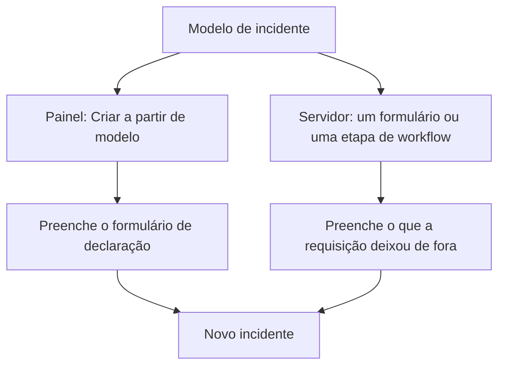
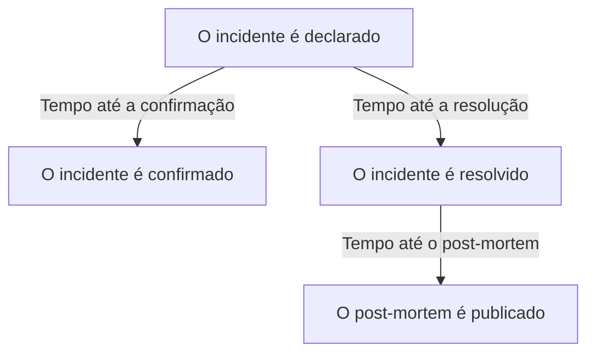
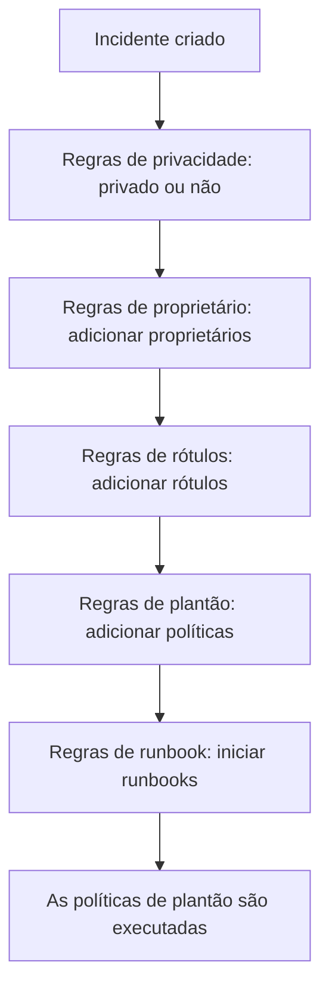

# Configurações e automação de incidentes

A configuração de incidentes fica em **Incidentes**, não em **Configurações do projeto**: os estados e as severidades, os modelos, os campos personalizados, as funções, as medições e os prefixos de número, e as regras que agem sobre cada incidente novo. Esta página é a referência de cada uma dessas páginas, e do que é executado por conta própria no momento em que um incidente é declarado.

:::cards
- [Modelos de incidentes](#modelos-de-incidentes): Declare o mesmo tipo de incidente, preenchido, toda vez.
- [Campos personalizados](#campos-personalizados): Seus próprios campos em todo incidente, perguntados quando ele é declarado.
- [Medições](#medições): O tempo até confirmar, resolver ou mitigar, calculado para cada incidente.
- [Regras](#regras-executadas-quando-um-incidente-é-criado): Proprietários, rótulos, acionamentos e episódios, definidos automaticamente.
:::

## Onde ficam as configurações de incidentes

Abra **Incidentes** no menu **Produtos** da barra superior e expanda **Configurações** no fim do menu lateral dele. **Regras** e **Configurações** começam recolhidas, então expanda-as antes que as páginas abaixo apareçam. Tudo aqui é do projeto: modelos, funções, campos personalizados e regras pertencem a um projeto e se aplicam a todo incidente declarado nele, em rotas que começam com `/dashboard/{projectId}/incidents/settings/`.

| Página                          | O que você faz ali                                                                                 |
| ------------------------------- | -------------------------------------------------------------------------------------------------- |
| **Estado do incidente**         | Adicionar, renomear, recolorir e reordenar os estados por que um incidente passa.                  |
| **Severidade do incidente**     | Adicionar, renomear, recolorir e reordenar os níveis de severidade.                                |
| **Modelos de incidentes**       | Preencher um incidente inteiro — título, descrição, recursos, políticas de plantão, proprietários, rótulos. |
| **Modelos de notas**            | Texto reutilizável para notas públicas e privadas.                                                 |
| **Modelos de post-mortem**      | Estruturas de post-mortem reutilizáveis.                                                           |
| **Campos personalizados**       | Definir campos extras que aparecem em todo incidente.                                              |
| **Funções de incidente**        | Definir as funções a que você atribui os respondedores, como Comandante do incidente.              |
| **Medições**                    | Medir quanto tempo as coisas levam, como o tempo até a confirmação ou até a resolução, em todo incidente. |
| **Alertas vinculados**          | Escolher se os alertas vinculados a um incidente são confirmados e resolvidos junto com ele. Os dois vêm ativados em projetos novos. |
| **Prefixo do número**           | O texto antes dos números de incidente e de episódio, como `INC-` em `INC-42`.                     |

O que o OneUptime AI faz por conta própria não é configurado aqui: ele tem uma seção própria, **Incidentes → IA**, em rotas que começam com `/dashboard/{projectId}/incidents/ai/`. A página **Configurações** dela ativa ou desativa a investigação de incidentes novos, a correção automática deles (desativada até você ativá-la) — com os pull requests de correção e de telemetria ausente, que fazem parte da correção, agrupados abaixo dela — e os rascunhos de post-mortem, e cada um é salvo assim que você o altera; as regras de investigação e as regras de remediação automática que restringem quais incidentes são investigados e corrigidos, e os limites opcionais sob os quais a IA trabalha, ficam recolhidos em **Mais configurações**, e nenhum se aplica até você defini-lo. **Insights** e **Registros** ficam ao lado: o que a IA aprendeu com seus incidentes, e tudo o que ela fez. Veja [AI SRE](/docs/ai/ai-sre).

**Estado do incidente** e **Severidade do incidente** são tratados a fundo em [Estados e severidades de incidentes](/docs/incidents/states-and-severities) — o resto desta página começa em **Modelos de incidentes**. Os formulários que deixam pessoas de fora da sua equipe relatar incidentes são um produto próprio: veja [Formulários](/docs/forms/index). Ferramentas que abrem incidentes por conta própria, como o [Huntress](/docs/integrations/huntress), são configuradas em **Incidentes → Integrações**.

Expanda **Regras** e você ganha mais oito páginas: **Regras de agrupamento**, **Regras de Plantão**, **Regras de proprietário**, **Regras de runbook**, **Regras de privacidade**, **Regras de Rótulos**, **Regras de SLA** e **Reminder Rules**. Elas são tratadas mais abaixo.

## Modelos de incidentes

Um modelo de incidente é o esqueleto salvo de um incidente. Em vez de digitar de novo o mesmo título, a mesma lista de monitores e a mesma política de plantão toda vez que o cluster de pagamentos oscila, você o salva uma vez e declara a partir dele.

:::steps
1. Vá em **Incidentes → Configurações → Modelos de incidentes** (`/dashboard/{projectId}/incidents/settings/templates`). O cartão se chama **Modelos de incidentes**.
2. Clique em **Criar: Incidente Modelo**. Dê um nome ao modelo em **Informações do modelo** e depois preencha em **Detalhes do incidente** o incidente que ele declara: um **Título**, uma **Severidade do incidente** e uma **Descrição**.
3. Pressione **Próximo** para percorrer as etapas opcionais — os recursos que ele afeta, seus campos personalizados e suas políticas de plantão — preenchendo o que todo incidente desse tipo tem em comum.
4. Clique em **Criar: Incidente Modelo** na última etapa. A partir de agora, o modelo é oferecido por **Criar a partir de modelo** na lista de incidentes.
:::

A criação leva você por um assistente de quatro etapas, com mais duas etapas quando seu projeto tem campos personalizados de incidente. Só as duas primeiras pedem algo que você precisa responder: **Próximo** percorre as etapas opcionais depois delas, e **Criar: Incidente Modelo** fica na última etapa.

- **Informações do modelo** — **Nome do modelo** e **Descrição do modelo**. Eles nomeiam o próprio modelo; nunca aparecem no incidente.
- **Detalhes do incidente** — **Título**, **Descrição** (Markdown) e **Severidade do incidente**. Em **Mais campos**, cujo cabeçalho recolhido nomeia os três e mostra cada um que estiver definido:
  - **Estado Inicial do Incidente** — o estado em que os incidentes declarados a partir do modelo começam. Ele começa vazio, como no formulário de declaração, e suas opções são listadas na ordem dos estados. Deixado vazio, como diz o texto de exemplo, eles começam no estado inicial de costume: o estado de criação do projeto, aquele em que todo incidente novo começa. Um modelo salvo com um estado o mantém.
  - **Proprietários** — as pessoas e equipes proprietárias dos incidentes declarados a partir do modelo. **Adicionar proprietário** abre uma única lista de ambos, a mesma lista da página **Proprietários** de um incidente; cada escolha aparece como uma etiqueta que você pode remover. Um modelo existente os mostra em um cartão **Proprietários**.
  - **Rótulos** — os rótulos com que os incidentes declarados a partir do modelo começam.
- **Recursos afetados** — como no formulário de declaração: **Monitores**, depois **Alterar status do monitor para**, depois **Outros recursos afetados** para hosts, clusters e serviços, com **Limitar a estas páginas de status** em **Mais campos**. Um modelo sempre pergunta **Alterar status do monitor para**, haja monitores escolhidos ou não: isso também se aplica aos monitores escolhidos quando um incidente é declarado a partir do modelo, onde o formulário de declaração o mostra assim que o primeiro monitor é escolhido. O cartão **Recursos afetados** de um modelo existente pergunta do mesmo jeito, e mostra o status que o modelo escolhe, ou **Os monitores mantêm seu status.** quando ele não escolhe nenhum. **Limitar a estas páginas de status** limita os incidentes declarados a partir do modelo a algumas das páginas de status que listam seus monitores — um modelo `Region East outage` pode levar as páginas da unidade Leste. Um modelo existente mostra isso em um cartão **Escopo de páginas de status**, com **Editar escopo de páginas de status**. Veja [Uma página de status por público](/docs/status-pages/one-status-page-per-audience).
- **Campos personalizados** — só quando seu projeto tem campos personalizados de incidente: os valores com que os incidentes declarados a partir deste modelo começam. Todo campo é oferecido aqui, não só os que a etapa **Detalhes** pede, e nenhum é obrigatório. Um modelo existente tem um cartão **Campos personalizados** para alterá-los.
- **Campos personalizados na criação** — também só quando seu projeto tem campos personalizados de incidente: quais deles a etapa **Detalhes** pede quando um incidente é declarado a partir deste modelo, e quais precisam ser preenchidos. Um modelo existente tem um cartão **Campos personalizados na criação** para alterá-los. Veja [Campos personalizados na criação](#campos-personalizados-na-criação).
- **Plantão** — **Política de plantão**, as políticas a executar quando um incidente criado a partir deste modelo é declarado.

Algumas regras rápidas:

- A lista de modelos mostra só **Nome** e **Descrição**. As linhas não podem ser editadas nem excluídas pela lista — abra um modelo (`/dashboard/{projectId}/incidents/settings/templates/{modelId}`) para alterá-lo.
- Quem pode editar um modelo pode alterar seus detalhes e seus recursos afetados, incluindo **Estado Inicial do Incidente** e **Alterar status do monitor para**: Project Owners, Project Admins e Project Members, Incident Admins e Incident Members, e uma função com **Edit Incident Template**.
- Os modelos aceitam importação e exportação em JSON, então você pode levar um de um projeto para outro.
- Sem modelos, a lista diz **Nenhum modelo de incidente encontrado** com **Criar: Incidente Modelo** logo abaixo.
- Sem modelos também, **Criar a partir de modelo** na lista de incidentes abre uma caixa de diálogo **No Incident Templates** que diz onde os modelos são criados, e seu botão **Create Template** abre **Incidentes → Configurações → Modelos de incidentes**.

### Como um modelo é aplicado

Há dois caminhos, e eles mesclam os dados do mesmo jeito.



- **No painel** — o botão **Criar a partir de modelo** na lista de incidentes abre um seletor **Selecionar Modelo de Incidente**, e a página de declaração lê o modelo do parâmetro de consulta `incidentTemplateId` e depois preenche o formulário com o modelo, mais suas equipes proprietárias e seus usuários proprietários. Sua etapa **Detalhes** segue os [campos personalizados na criação](#campos-personalizados-na-criação) do modelo. Os proprietários viram proprietários do incidente sem ser notificados, depois que os canais do Slack e do Microsoft Teams do incidente existem, então uma regra de notificação que convida os proprietários do incidente para um canal novo também os convida.
- **No servidor** — um [formulário](/docs/forms/on-submit#the-incident-template) que tem um **Incidente Modelo**, e a etapa **Create One Incident** de um workflow com uma configuração **Incident Template** escolhida, declaram o incidente a partir do modelo no servidor. A etapa lê o modelo como Project Admin do projeto do workflow, então um modelo de outro projeto, ou um que foi excluído, é recusado, e em um plano que não inclui modelos de incidente a etapa é recusada com o plano de que precisa. Os proprietários do modelo viram proprietários do incidente, como no painel. Veja [Componentes de workflow](/docs/workflows/components).

Um incidente declarado no servidor registra o modelo em `createdIncidentTemplateId`. Só o OneUptime define essa coluna, para um formulário ou uma etapa de workflow que nomeia um modelo: uma chave de API ou um usuário conectado não pode, e uma requisição que envia `createdIncidentTemplateId` é recusada. Para declarar a partir de um modelo pela API, leia-o em `/api/incident-templates` e envie os valores dele na requisição.

> [!IMPORTANT]
> O importante é a regra de mesclagem: **um modelo só preenche um campo que você deixou indefinido**. Título, descrição, severidade do incidente, estado inicial do incidente, o status de monitor por trás de **Alterar status do monitor para**, monitores, hosts, clusters Kubernetes, hosts Docker, hosts Podman, serviços, políticas de plantão, rótulos e páginas de status só são copiados do modelo quando quem chamou ou o formulário não forneceu nada. O que você define explicitamente sempre vence, inclusive um estado: um incidente que nomeia seu estado começa nele e ainda pega todo o resto do modelo, como no painel. Os valores dos campos personalizados são mesclados campo a campo: o modelo preenche os campos com os quais o incidente foi declarado sem valor, e um valor que você define — `0`, `false` e `null` incluídos — vence o do modelo.

### Campos personalizados na criação

As configurações do projeto decidem o que a etapa **Detalhes** pergunta quando um incidente é declarado: **Mostrar na criação** pede um campo, e **Obrigatório na criação** o torna obrigatório. Um modelo pode mudar as duas coisas para os incidentes declarados a partir dele. Seu cartão **Campos personalizados na criação** — e a etapa do assistente com o mesmo nome — lista cada campo personalizado de incidente na **Ordem** dele, com uma configuração cada:

| Configuração      | Quando um incidente é declarado a partir deste modelo                                                                               |
| ----------------- | ----------------------------------------------------------------------------------------------------------------------------------- |
| **Padrão**        | O campo segue seus próprios **Mostrar na criação** e **Obrigatório na criação**. A opção diz qual, como **Padrão (Obrigatório)**.  |
| **Obrigatório**   | A etapa **Detalhes** pede o campo, e ele precisa ser preenchido. Um campo sim/não precisa estar ativado.                            |
| **Opcional**      | A etapa pede o campo, e ele pode ficar vazio — mesmo quando o projeto o exige.                                                      |
| **Oculto**        | A etapa não pede o campo, mesmo quando o projeto o mostra ou o exige. O valor do próprio modelo para ele ainda é aplicado.          |

No cartão, um campo que o modelo define como **Obrigatório**, **Opcional** ou **Oculto** também mostra, abaixo do tipo, o que o projeto faz com ele: **Padrão do projeto: Obrigatório**, **Padrão do projeto: Opcional** ou **Padrão do projeto: Não exibido**. Todos que podem ver o modelo veem isso.

Use isso quando os incidentes de um modelo precisarem de uma resposta que outros não precisam — um nível de cliente em um modelo `Customer data exposure`, por exemplo — ou para tirar de um modelo em que não cabe uma pergunta que o projeto faz em todo lugar.

- **Indexadas pela variável de modelo.** Cada configuração é guardada sob a **Variável de modelo** do campo, que nunca muda, então renomear um campo mantém a configuração dele. Um campo excluído e recriado com o mesmo nome recupera sua configuração — ao contrário das perguntas de um formulário, que nomeiam um campo pelo ID, de modo que um campo excluído e recriado não é perguntado até ser adicionado de novo.
- **Editar e Salvar as leem de novo.** **Editar** no cartão lê de novo os campos e as configurações do modelo, com um indicador de carregamento na caixa de diálogo enquanto isso, e **Salvar** as lê mais uma vez e grava só os campos que você mudou nela. Assim, uma mudança que outro administrador fez nesse meio-tempo em outros campos é mantida — inclusive uma configuração dada a um campo criado enquanto sua caixa de diálogo estava aberta — e uma mudança que você fez em um campo excluído nesse meio-tempo não é gravada. O cartão então lista os campos como eles estão. Se eles não puderem ser lidos quando você pressionar **Editar**, a caixa de diálogo diz por quê e oferece **Tentar novamente** em vez de **Salvar**; quando você pressiona **Salvar**, ela diz por quê, não salva nada e mantém suas escolhas.
- **Só o painel as aplica.** Como **Obrigatório na criação**, as configurações moldam o formulário **Declarar incidente** e nada mais. Incidentes declarados pela API, por um workflow, por um monitor, pelo Slack, pelo Microsoft Teams ou pela IA não estão sujeitos a elas, e os [formulários](/docs/forms/building) fazem as próprias perguntas. Veja [Obrigatório na criação só é verificado pelo painel](#obrigatório-na-criação-só-é-verificado-pelo-painel).
- **Um campo copiado de um campo personalizado de monitor** continua não sendo perguntado depois que o incidente tem um monitor, diga o que disser o modelo.
- **Quem pode editar modelos de incidente pode alterá-las** — Project Members e Incident Members incluídos — mesmo para um campo que um Project Admin tornou **Obrigatório na criação** para o projeto inteiro. As configurações do projeto inteiro em si exigem um Project Owner, um Project Admin ou a permissão **Edit Incident Custom Field**.
- **Elas viajam com o modelo.** A exportação JSON de um modelo as inclui, e no projeto para onde você o importa elas se aplicam aos campos com a mesma **Variável de modelo**.

Pela API, elas são os `customFieldSettings` do modelo: um objeto indexado pela **Variável de modelo** de cada campo, com `Required`, `Optional`, `Hidden` ou `Default` para cada campo.

```json title="customFieldSettings"
{
  "customFieldSettings": {
    "impact": "Required",
    "affected_location": "Optional",
    "additional_information": "Hidden"
  }
}
```

Um campo que não está listado segue suas próprias configurações, como com `Default`. Uma requisição é recusada com um erro `400` quando uma chave não é uma **Variável de modelo** válida — letras minúsculas, dígitos e sublinhados — ou um valor não é um dos quatro. Uma chave que não corresponde a nenhum campo é mantida, e ignorada.

## Modelos de notas

Os modelos de notas dão aos respondedores texto pronto para as atualizações do incidente, para que uma atualização da página de status às 3 da manhã não seja escrita do zero por alguém meio dormindo.

:::steps
1. Vá em **Incidentes → Configurações → Modelos de notas** (`/dashboard/{projectId}/incidents/settings/note-templates`). O cartão se chama **Modelos de nota pública ou privada para incidentes** — uma única biblioteca atende aos dois tipos de nota.
2. Clique em **Criar: Incidente Nota Modelo** e preencha sua única página: **Nome do modelo** e **Descrição do modelo**, ambos obrigatórios, e depois a própria **Nota**, em Markdown, obrigatória: o texto com que uma nota começa quando o modelo é escolhido.
3. Salve-o. O modelo é oferecido por **Modelos** nas duas páginas de notas, e por **Selecionar Modelo de Nota** nas caixas de diálogo **Confirmar incidente** e **Resolver incidente**.
:::

Como nos modelos de incidente, as linhas são criadas e visualizadas em vez de editadas na lista; abra um modelo para alterá-lo.

**Variáveis.** Um modelo de nota pode trazer variáveis que são preenchidas com os valores do incidente quando o modelo é escolhido, para que o autor veja — e ainda possa mudar — o texto pronto antes de publicá-lo:

| Variável                            | Preenchida com                                                     |
| ----------------------------------- | ------------------------------------------------------------------ |
| `{{incident.title}}`                | O título do incidente.                                             |
| `{{incident.number}}`               | O número dele, por exemplo `INC-42` ou `#42`.                      |
| `{{incident.severity}}`             | A severidade dele.                                                 |
| `{{incident.state}}`                | O estado atual dele.                                               |
| `{{incident.startedAt}}`            | Quando ele foi declarado, no fuso horário do autor, com o fuso indicado. |
| `{{incident.labels}}`               | Os rótulos dele, separados por vírgulas.                           |
| `{{incident.affectedStatusPages}}`  | As páginas de status em que ele aparece e que ele notifica, que o autor pode ver. |
| `{{incident.customFields.<key>}}`   | O valor de um campo personalizado, pela **Variável de modelo** do campo, que o editor **Nota** lista em **Variáveis de modelo** pelo nome do campo. |

Os campos personalizados eram escritos antes como `{{customFields.<key>}}`; os modelos que ainda usam isso são preenchidos do mesmo jeito. Uma variável sem valor, ou que não está na lista, fica exatamente como escrita, para o autor preencher. Os valores são inseridos como texto: o título de um incidente não pode virar uma imagem, HTML ou um link cujo texto esconde para onde ele vai na nota publicada, embora um endereço dentro dele continue aparecendo como link para esse endereço. Um campo personalizado **Texto formatado (Markdown)** é inserido como o Markdown que ele é.

> [!IMPORTANT]
> As variáveis de campos personalizados, de rótulos e de páginas de status preenchem os próprios registros da sua equipe, todo campo personalizado, esteja ele marcado com **Incluir nas notificações aos assinantes** ou não, e uma única biblioteca atende também às notas públicas, que são mostradas nas páginas de status do incidente e enviadas por e-mail aos assinantes delas. Leia o texto preenchido antes de publicar uma nota pública.

**Inserir uma variável.** Você nunca precisa digitar o nome de uma variável. O editor **Nota** oferece as variáveis de três formas, e cada uma insere a variável onde o cursor está:

- **Variáveis de modelo**, recolhido abaixo do editor: abra-o para ver cada variável com aquilo com que ela é preenchida — os campos personalizados de incidente do projeto, pelo nome — e clique em uma.
- **Inserir variável**, no fim da barra de ferramentas do editor: a mesma lista, com uma caixa de busca.
- Digitar `{{` na nota abre a lista abaixo do cursor. Continue digitando para filtrá-la, escolha com as setas e pressione Enter ou Tab para inserir a variável; Esc fecha a lista.

A mesma lista, o mesmo botão e o mesmo `{{` vêm com os outros modelos que têm variáveis: os lembretes de nota de uma regra de SLA, o título e a descrição do episódio de uma regra de agrupamento de incidentes ou de alertas, a descrição de incidente e de alerta e as notas de remediação de uma regra de monitor, os modelos de uma regra de taxa de consumo de SLO e os modelos personalizados de notificação aos assinantes de uma página de status.

Os modelos de notas aparecem onde você realmente precisa deles: as caixas de diálogo de confirmação **Confirmar incidente** e **Resolver incidente** oferecem **Selecionar Modelo de Nota** acima do campo **Nota pública**, recolhido em **Adicionar uma nota pública**. Veja [Notas, responsáveis e feed de incidentes](/docs/incidents/notes-owners-and-feed) para a diferença entre notas públicas e privadas.

## Modelos de post-mortem

Um modelo de post-mortem é o esqueleto do relatório que você produz depois de um incidente — seus títulos, suas provocações, suas perguntas de sempre — para que toda revisão do projeto siga a mesma forma.

:::steps
1. Vá em **Incidentes → Configurações → Modelos de post-mortem** (`/dashboard/{projectId}/incidents/settings/postmortem-templates`). O cartão se chama **Modelos de post-mortem**.
2. Clique em **Criar: Incidente Postmortem Modelo** e preencha sua única página: **Nome do modelo** e **Descrição do modelo**, ambos obrigatórios, e depois **Modelo de análise pós-incidente**, o próprio corpo, em Markdown, obrigatório.
3. Salve-o. A página **Post-mortem** de cada incidente agora oferece **Aplicar modelo**.
:::

Você aplica um a partir do incidente, não das configurações. Abra um incidente, escolha **Post-mortem** no menu lateral dele (`/dashboard/{projectId}/incidents/{incidentId}/postmortem`), e use **Aplicar modelo**. Isso abre uma caixa de diálogo **Aplicar modelo de post-mortem** com uma lista suspensa **Selecionar Modelo**; escolher um carrega o corpo do modelo no editor **Nota da análise pós-incidente**, onde você o edita antes de salvar. Os episódios de incidente têm a mesma página **Post-mortem** e usam a mesma biblioteca de modelos. **Aplicar modelo** só aparece quando o projeto tem um modelo de post-mortem; se houver só um, ele já vem escolhido. O editor abre no post-mortem do incidente como ele está, com o modelo como nota, então se ele está na página de status, quando foi publicado e seus anexos continuam como estavam.

## Campos personalizados

Os campos personalizados deixam você levar seus próprios metadados em todo incidente — o nome de um serviço interno, a referência de um ticket de mudança, um nível de cliente — e fazer as mesmas perguntas toda vez que um incidente é declarado, como o impacto dele e quando se espera resolvê-lo.

:::steps
1. Vá em **Incidentes → Configurações → Campos personalizados** (`/dashboard/{projectId}/incidents/settings/custom-fields`). A página se chama **Campos personalizados do incidente** e lista os campos na **Ordem** deles, cada um só com seu **Nome do campo** e seu **Tipo do campo**.
2. Clique em **Criar: Incidente Personalizado Campo** e preencha o **Nome do campo**, a **Descrição do campo** e o **Tipo do campo** — e, para um tipo lista suspensa, as opções dele, logo abaixo do tipo.
3. Para perguntar o campo sempre que um incidente for declarado, abra **Mais campos** e ative **Mostrar na criação**, e **Obrigatório na criação** se ele precisar ser respondido.
4. Salve-o e depois arraste a linha pela alça até onde o campo deve ser listado. **Editar** na linha de um campo abre o resto das configurações dele.
:::

Criar um campo pede seu **Nome do campo**, sua **Descrição do campo** e seu **Tipo do campo** em uma única página — e, para um tipo lista suspensa, as opções dele, logo abaixo do tipo. Os valores de um campo novo são digitados. Todo o resto fica em **Mais campos**, que começa recolhido quer você crie um campo, quer o edite; recolhido, o cabeçalho dele nomeia o que há dentro e mostra o que está definido. Para criar um campo que copie seu valor de um campo personalizado de monitor, abra o menu **Mais** (**⋯**) ao lado de **Criar: Incidente Personalizado Campo** e escolha **Criar campo personalizado mapeado** — veja [Campos copiados de um monitor](#campos-copiados-de-um-monitor).

Cada definição tem:

- **Nome do campo** — obrigatório, com pelo menos dois caracteres. O texto de exemplo sugere um nome em formato de identificador, como `internal-service`.
- **Descrição do campo** — opcional.
- **Tipo do campo** — obrigatório. Escolhe como os dados são informados; os tipos são listados abaixo. Os tipos lista suspensa também precisam das suas opções.
- **Opções do menu suspenso** — os valores que aparecem na lista suspensa, cada um com uma cor opcional: o pequeno botão ao lado de uma opção mostra a cor dela e abre as mesmas cores com nome de todo outro campo de cor, com **Sem cor** primeiro e **Cor personalizada** para um código exato. Arraste uma opção pela alça no começo da linha dela para mudar onde ela é listada. As opções podem ser adicionadas, renomeadas e retiradas depois que os incidentes já têm valores; veja [Alterar as opções de uma lista suspensa](#alterar-as-opções-de-uma-lista-suspensa).
- **Ordem** — onde o campo aparece entre os campos personalizados do incidente: na página **Campos personalizados** do incidente, na etapa **Detalhes** e nas mensagens aos assinantes. Não há número para digitar: arraste um campo pela alça no começo da linha dele para subi-lo ou descê-lo, e um campo novo é adicionado no fim. O arrasto fica desativado enquanto um filtro ou uma busca restringe a lista.
- **Mostrar na criação** — em **Mais campos**. Pede o campo na etapa **Detalhes** quando um incidente é declarado pelo painel (veja [Declarar um incidente](/docs/incidents/declaring-incidents)). Um modelo de incidente pode dar a qualquer campo um valor inicial, mostrado na criação ou não, e pode pedir um campo ou deixá-lo de fora para os incidentes declarados a partir dele — veja [Campos personalizados na criação](#campos-personalizados-na-criação). Os [formulários](/docs/forms/building#custom-fields) não o seguem: um formulário pergunta só os campos adicionados a ele.
- **Obrigatório na criação** — em **Mais campos**, oferecido assim que **Mostrar na criação** está ativado. A etapa **Detalhes** não deixa você declarar o incidente até o campo ser preenchido, e um campo **Booleano** precisa estar ativado. O painel é o único lugar em que isso é verificado; veja [Obrigatório na criação só é verificado pelo painel](#obrigatório-na-criação-só-é-verificado-pelo-painel).
- **Incluir nas notificações aos assinantes** — em **Mais campos**. Envia o campo e o valor dele aos assinantes da página de status com as mensagens do incidente: o e-mail, as mensagens do Slack e do Microsoft Teams e os webhooks padrão, mas não o SMS. Os assinantes geralmente são de fora da sua equipe, então só ative isso para campos que podem ser compartilhados com segurança. Veja [Assinantes e comunicados](/docs/status-pages/subscribers#incidentes).
- **Variável de modelo** — a chave pela qual um modelo chega ao campo, `{{incident.customFields.<key>}}`, nos modelos de notas e nos modelos personalizados de notificação aos assinantes. Ela é formada a partir do nome do campo quando o campo é criado — letras minúsculas, dígitos e sublinhados, então `Expected Resolution` vira `expected_resolution`, com `_2`, `_3` e assim por diante acrescentados quando outro campo já tem a chave — e não muda quando o campo é renomeado. Ninguém a define manualmente: a API ignora um valor enviado para ela. Os modelos escritos com o antigo `{{customFields.<key>}}` continuam funcionando. Você nunca precisa procurá-la: os editores que a inserem — a **Nota** de um modelo de nota e os modelos personalizados de notificação aos assinantes de uma página de status para eventos de incidente — listam a variável de cada campo em **Variáveis de modelo**, pelo nome do campo. O formulário **Editar** de um campo também a mostra, somente leitura, no fim de **Mais campos**, com um botão que a copia.

**Ordem**, **Mostrar na criação**, **Obrigatório na criação**, **Incluir nas notificações aos assinantes** e **Variável de modelo** só existem nos campos personalizados de incidente. Os campos personalizados de monitores, alertas, eventos de manutenção programada e dos demais recursos não os têm.

As definições ficam em um modelo próprio; os valores ficam no próprio incidente, na coluna `customFields`. Em um incidente específico, você os preenche em **Campos personalizados** no menu lateral do incidente (`/dashboard/{projectId}/incidents/{incidentId}/custom-fields`), onde os campos são listados na **Ordem** deles. Os modelos de incidente guardam valores para os mesmos campos nos seus próprios `customFields`.

**Uma lacuna que vale conhecer.** As definições de campos personalizados de incidente são a única parte da família de incidentes sem gatilhos de workflow — veja a seção de workflows abaixo.

### Tipos de campo

| Tipo do campo                              | Informado como                                        | Bom para                                           |
| ------------------------------------------ | ----------------------------------------------------- | -------------------------------------------------- |
| **Texto**                                  | Uma linha de texto                                    | A referência de um ticket de mudança, o nome de um serviço interno |
| **Número**                                 | Um número                                             | Duração estimada em minutos, usuários afetados     |
| **Booleano**                               | Um interruptor sim/não                                | Uma confirmação, «voltado ao cliente»              |
| **Lista suspensa (seleção única)**         | Uma opção de uma lista                                | Impacto, região                                    |
| **Lista suspensa (seleção múltipla)**      | Várias opções de uma lista                            | Sistemas afetados                                  |
| **Data**                                   | Uma data                                              | Uma data de renovação de contrato                  |
| **Data e hora**                            | Uma data e uma hora do dia                            | Resolução prevista                                 |
| **Texto longo**                            | Várias linhas de texto simples                        | Usuários ou sistemas afetados, informações adicionais |
| **Texto formatado (Markdown)**             | Texto formatado, no editor Markdown com seu modo visual | Uma solução alternativa com links e listas       |

**Texto longo** e **Texto formatado (Markdown)** estão disponíveis para os campos personalizados de todo recurso, não só de incidentes. Um valor de texto formatado é guardado como o Markdown em que foi escrito. Não há tipo de botões de opção nem de grupo de caixas de seleção: use uma **Lista suspensa (seleção única)**, uma **Lista suspensa (seleção múltipla)** ou um **Booleano**.

### Obrigatório na criação só é verificado pelo painel

**Obrigatório na criação** segura o formulário **Declarar incidente**, e nada mais. Incidentes que um monitor, a API, o Slack, o Microsoft Teams ou a IA abrem não podem preencher um formulário, então são criados com o campo vazio. Depois que um incidente existe, todo campo continua opcional na página **Campos personalizados** dele, então um respondedor que corrige um valor no meio de uma interrupção nunca é obrigado a preencher todos os outros. Encare isso como um lembrete para quem declara incidentes, não como a promessa de que todo incidente tem um valor.

Os [campos personalizados na criação](#campos-personalizados-na-criação) de um modelo são iguais: eles moldam o formulário **Declarar incidente** e nada mais. Os [formulários](/docs/forms/building#required-questions) são a exceção, porque o servidor verifica as perguntas **Obrigatório** de um formulário quando ele é enviado.

### Campos copiados de um monitor

Um campo personalizado pode pegar seu valor de um campo personalizado dos monitores do incidente, em vez de ser digitado — uma região ou um nível de cliente que seus monitores já registram, por exemplo. Para criar um, abra o menu **Mais** (**⋯**) ao lado de **Criar: Incidente Personalizado Campo** e escolha **Criar campo personalizado mapeado**. Ele pede três coisas:

- **Campo do monitor** — o campo personalizado de monitor a copiar. Todos são oferecidos, cada um com o tipo abaixo do nome. O novo campo recebe esse tipo, e as opções de uma lista suspensa, para que os dois sempre combinem.
- **Nome do campo** — começa com o nome do campo do monitor, até você digitar outro.
- **Descrição do campo** — opcional.

O valor é preenchido quando um incidente é criado com um monitor, e mantido atualizado quando o valor do monitor muda. Quando os monitores de um incidente têm valores diferentes, um campo de valor único fica como está e um campo de seleção múltipla recebe todos. Copiar nunca apaga um valor: um incidente sem monitor mantém o que foi digitado nele, e apagar o valor do monitor não mexe nas cópias. A etapa **Detalhes** não pergunta um campo copiado depois que o incidente tem um monitor.

Para copiar de um monitor o valor de um campo existente, mudar qual campo de monitor ele copia, ou voltar a digitá-lo, abra **Editar** na linha do campo e use **Obter o valor de** em **Mais campos**. Os campos personalizados de alertas e de manutenções programadas podem copiar dos seus monitores do mesmo jeito.

### Valores de campos personalizados pela API

Em `POST /api/incident` e nas atualizações de um incidente, `customFields` é um objeto indexado pelo **Nome do campo** de cada campo:

```json title="customFields"
{
  "customFields": {
    "Impact": "Major",
    "Estimated Duration": 90,
    "Acknowledgement": true,
    "Expected Resolution": "2026-10-01T14:30:00.000Z"
  }
}
```

Quando um usuário ou uma chave de API cria ou atualiza um incidente, cada valor que a requisição define ou muda precisa caber no seu campo, senão a requisição é recusada com um erro `400` que nomeia o campo e o valor enviado:

| Tipo do campo                                                      | Aceita                                                         |
| ------------------------------------------------------------------ | -------------------------------------------------------------- |
| **Texto**, **Texto longo**, **Texto formatado (Markdown)**         | Texto. Um número, `true` ou `false` é guardado como enviado.   |
| **Número**                                                         | Um número, ou um texto que seja um, como `"42"`.               |
| **Booleano**                                                       | `true` ou `false`, ou o texto `"true"` ou `"false"`.           |
| **Data**, **Data e hora**                                          | Uma data, de preferência como texto ISO 8601.                  |
| **Lista suspensa (seleção única)**                                 | Uma das opções dele.                                           |
| **Lista suspensa (seleção múltipla)**                              | Uma lista das opções dele, ou uma única opção sozinha.         |

Para uma **Lista suspensa (seleção múltipla)**, a recusa nomeia as primeiras 10 entradas que não estão entre as opções dela, e depois quantas mais existem.

O que não é verificado, para que as integrações existentes continuem funcionando:

- **Valores que a requisição deixa como estão.** O cartão **Campos personalizados** envia todos os valores de volta quando você salva um deles, então um valor guardado antes de essas verificações existirem, ou uma opção de lista suspensa removida desde então, nunca impede você de salvar os outros. Uma seleção múltipla mantém as entradas que já tinha.
- **Chaves que não são o nome de um campo personalizado de incidente**, como o `jiraIssueKey` que a [integração com o Jira](/docs/integrations/jira) grava.
- **Valores vazios.** `null` ou uma string vazia limpa um campo.
- **Valores copiados de um campo personalizado de monitor**, e gravações que o próprio OneUptime faz.
- **Obrigatório na criação.** A API nunca pede um campo.

Um incidente que um formulário ou a etapa **Create One Incident** de um workflow declara a partir de um modelo (`createdIncidentTemplateId`) começa com os valores dos campos personalizados do modelo, mesclados campo a campo sob os que ele envia (veja [Como um modelo é aplicado](#como-um-modelo-é-aplicado)). Uma chave de API não pode declarar a partir de um modelo: uma requisição que envia `createdIncidentTemplateId` é recusada.

### Renomear um campo

Os valores são guardados sob o nome do campo, então renomear um campo precisa movê-los. Quando você salva um novo **Nome do campo**, o OneUptime move o valor do campo para o novo nome em todo incidente e em todo modelo de incidente do projeto, e atualiza as visualizações salvas da lista de incidentes que mostram o campo ou filtram por ele. A movimentação não inicia nenhum workflow **On Update Incident**, e não muda o horário da última atualização de nenhum incidente. A **Variável de modelo** do campo fica como estava, então os modelos de notas, os modelos personalizados de notificação aos assinantes e as integrações por webhook que a usam continuam funcionando.

Duas renomeações são recusadas: uma para um nome que outro campo personalizado de incidente já tem (comparado sem diferenciar maiúsculas e minúsculas), e uma requisição à API que renomearia vários campos de uma vez. Workflows e clientes da API que leem ou gravam um valor pelo nome antigo do campo precisam passar a usar o novo.

Depois de uma renomeação, o campo contém só os próprios valores. Excluir um campo deixa os valores dele nos incidentes que os tinham, então os incidentes ainda podem ter, sob o novo nome, valores de um campo que foi excluído; a renomeação os limpa, em vez de mostrá-los como respostas deste campo ou enviá-los aos assinantes. Todo incidente e todo modelo se movem juntos: se a movimentação falhar, nenhum deles muda, o campo mantém o nome antigo e o salvamento informa um erro, então você pode simplesmente tentar de novo. Um campo **criado** com o nome de um campo excluído é diferente: ele mostra os valores que aquele campo deixou para trás, e os envia aos assinantes assim que **Incluir nas notificações aos assinantes** estiver ativado.

Excluir um campo deixa as perguntas que o pedem em todo [formulário](/docs/forms/building#custom-fields) do projeto, mas elas não são mais feitas: o construtor de formulários marca cada uma para você excluir. Um campo recriado com o mesmo nome é um campo novo, e não é perguntado em um formulário até alguém adicioná-lo ali. Os modelos de incidente mantêm a configuração **Campos personalizados na criação** deles para esse campo.

### Alterar as opções de uma lista suspensa

As opções de um campo **Lista suspensa (seleção única)** ou **Lista suspensa (seleção múltipla)** podem ser alteradas a qualquer momento: abra **Editar** na linha do campo. Um incidente guarda o texto da opção que recebeu, então o que uma mudança faz com os incidentes que têm uma opção depende da mudança:

| O que você faz com uma opção             | O que acontece com os incidentes que a têm                                                                         |
| ---------------------------------------- | ------------------------------------------------------------------------------------------------------------------ |
| **Adicionar** uma                        | Nada. Ela passa a ser oferecida.                                                                                   |
| **Renomeá-la** (mudar o texto)           | Eles mostram o novo nome. Abaixo da opção, o formulário diz quantos incidentes o farão.                            |
| **Retirá-la** (a lixeira ao lado)        | Eles a mantêm, mostrada como _já não é uma opção_, a menos que você escolha outra opção para eles em **Já não são opções**. |
| **Arrastá-la** pela alça                 | Nada. Só muda a ordem em que as opções são listadas.                                                               |

Quando o formulário abre, ele conta quantos incidentes têm cada valor. **Já não são opções** lista cada opção que você retira e que um incidente ainda tem, e cada valor que os incidentes têm e que nunca foi uma opção (um gravado pela API, por exemplo), cada um com quantos incidentes o têm. Para cada um, mantenha-o como está ou escolha a opção que esses incidentes devem ter no lugar. **Desfazer** traz de volta uma opção retirada por engano.

Quando você salva, uma opção renomeada e um valor para o qual você escolhe uma opção são movidos: em todo incidente e em todo modelo de incidente do projeto, nas visualizações salvas da lista de incidentes que filtram por eles, e nas respostas que os [modelos de formulário](/docs/forms/building) dão para o campo. Como em um campo renomeado, a movimentação não inicia nenhum workflow **On Update Incident** e não muda o horário da última atualização de nenhum incidente; se falhar, nada se move e o campo mantém as opções antigas. Workflows, clientes da API e configurações do Terraform que gravam uma opção pelo texto antigo precisam do texto novo.

Um incidente cujo valor o campo dele não oferece mais mostra o valor, marcado como _já não é uma opção_, na página **Campos personalizados** dele e na lista de incidentes. Editar os outros campos dele mantém o valor; escolha outra opção para mudá-lo.

Os campos personalizados de todos os outros recursos funcionam do mesmo jeito: monitores, alertas, eventos de manutenção programada, páginas de status, políticas de plantão, equipes, membros de equipe e itens de inventário. Renomear uma opção de um campo de monitor, ou adicionar uma, faz o mesmo nos campos de incidente, de alerta e de manutenção programada que o copiam (veja [Campos copiados de um monitor](#campos-copiados-de-um-monitor)), para que eles continuem oferecendo todo valor que copiam.

Pela API, envie a nova lista como `dropdownOptions`, e as renomeações em `miscDataProps`:

```json
{
  "data": { "dropdownOptions": "Facility Alpha\nFacility B" },
  "miscDataProps": {
    "renamedDropdownOptions": [{ "from": "Facility A", "to": "Facility Alpha" }]
  }
}
```

Cada `to` precisa ser uma das opções do campo depois de salvo, e cada `from` só pode ser renomeado uma vez. Sem `renamedDropdownOptions`, a lista muda e todo valor guardado fica como está, que é também o que acontece ao mudar `dropdown_options` no Terraform.

### Terraform

As configurações ficam no recurso `oneuptime_incident_custom_field` como `sort_order`, `show_on_create`, `is_required_on_create` e `include_in_subscriber_notifications`. `variable_key` é somente leitura: a chave que o OneUptime formou quando o campo foi criado.

Omita `sort_order` e um campo novo vai para o fim da lista. Dê a ele o número que outro campo já tem e ele ocupa esse lugar, enquanto os campos no caminho avançam uma posição. Um número que nenhum outro campo tem é mantido como você o escreveu.

## Medições

Uma medição é o tempo entre dois momentos de um incidente. O **tempo até a confirmação** é o tempo desde que um incidente é declarado até alguém confirmá-lo; o **tempo até a resolução** vai de quando ele é declarado até ser resolvido. Você configura uma medição uma vez, e o OneUptime a calcula para todo incidente, incluindo os passados, e a coloca em um gráfico, para você ver se sua equipe está ficando mais rápida.

Vá em **Incidentes → Configurações → Medições** (`/dashboard/{projectId}/incidents/settings/measurements`) e escolha **Criar: Incident Measurement**. Cada definição tem um **nome**, um **ponto de início** e um **ponto de fim**. A **chave** permanente dela é formada a partir do nome enquanto você digita — «Time to Detect» gera `time-to-detect` — então não há nada a preencher. Para escolher uma chave própria, escolha **Editar** ao lado dela antes de criar a medição.



Alertas e eventos de manutenção programada têm o mesmo recurso, em **Alertas → Configurações → Medições** e **Manutenção programada → Configurações → Medições**. Tudo o que vem abaixo vale para os três, cada um com seus próprios momentos.

### Medições prontas

O formulário abre em **O que você quer medir?**. Escolha uma destas e o nome, a descrição e os dois momentos dela são preenchidos: **Próximo** mostra os momentos, e a medição é criada a partir dessa última etapa.

| Onde                      | Medição                                | Começa quando                                     | Termina quando                         |
| ------------------------- | -------------------------------------- | ------------------------------------------------- | -------------------------------------- |
| Incidentes                | **Tempo até a confirmação**            | O incidente é declarado                           | O incidente é confirmado               |
| Incidentes                | **Tempo até a resolução**              | O incidente é declarado                           | O incidente é resolvido                |
| Incidentes                | **Tempo até o post-mortem**            | O incidente é resolvido                           | O post-mortem é publicado              |
| Alertas                   | **Tempo até a confirmação**            | O alerta é criado                                 | O alerta é confirmado                  |
| Alertas                   | **Tempo até a resolução**              | O alerta é criado                                 | O alerta é resolvido                   |
| Manutenção programada     | **Atraso no início**                   | A manutenção deve começar conforme o programado   | A manutenção começa                    |
| Manutenção programada     | **Excesso de tempo**                   | A manutenção deve terminar conforme o programado  | A manutenção termina                   |
| Manutenção programada     | **Duração da manutenção**              | A manutenção começa                               | A manutenção termina                   |

Escolha **Outra coisa** para escolher você mesmo os dois momentos. Um nome que você digitou é mantido quando você escolhe uma destas.

### Escolher os dois momentos

A segunda etapa, **Início e fim**, tem **Começa quando** e **Termina quando**. Cada um lista, em palavras simples, os momentos em que uma medição pode começar ou terminar. Uma medição nova começa quando o incidente é declarado, então na maioria das vezes você só escolhe onde ela termina.

| Momento                                            | Quando acontece                                                              | Guardado na API como                                  |
| -------------------------------------------------- | ---------------------------------------------------------------------------- | ----------------------------------------------------- |
| **O incidente é declarado**                        | Quando o incidente começou no OneUptime: quando foi criado, a menos que alguém tenha definido um horário anterior. | `Declared At` (`Timeline Start` é o mesmo instante) |
| **O incidente é confirmado**                       | Quando ele chega ao seu estado confirmado, ou a qualquer estado posterior (uma resolução direta desde o início também conta). | `State Role Entered`, função `Acknowledged` |
| **O incidente é resolvido**                        | Quando ele chega ao seu estado resolvido.                                    | `State Role Entered`, função `Resolved`               |
| **O post-mortem é publicado**                      | Quando o post-mortem do incidente é publicado.                               | `Postmortem Posted At`                                |
| **O incidente entra em um estado que você escolher** | Qualquer um dos seus estados de incidente. O formulário então pergunta qual. | `State Entered`, com o estado                       |
| **O impacto começa**                               | Quando os clientes foram afetados pela primeira vez — veja abaixo.           | `Impact Started At`                                   |
| **O incidente entra em seu primeiro estado**       | Quando ele chega ao estado em que os incidentes novos começam, como Identified. | `State Role Entered`, função `Created`             |
| **O incidente é criado no OneUptime**              | Geralmente o mesmo momento em que é declarado.                               | `Created At`                                          |

Os alertas começam em **O alerta é criado** e não têm post-mortem; a manutenção programada acrescenta **A manutenção deve começar conforme o programado** e **A manutenção deve terminar conforme o programado**, a janela prevista, ao lado de **A manutenção começa**, **A manutenção termina** e **A manutenção é concluída**.

Chegar a **confirmado** ou **resolvido** segue o estado que cumpre esse papel, então continua funcionando se você renomear ou substituir o estado. **Um estado que você escolher** fica preso a esse único estado.

### Mais campos

Algumas opções que a maioria das medições nunca muda ficam recolhidas em **Mais campos** no fim da etapa **Início e fim**, definidas com os padrões que a API também usa. Recolhido, o cabeçalho dele as nomeia e mostra as que foram alteradas.

- **Se o início acontecer mais de uma vez** e **Se o fim acontecer mais de uma vez** aparecem para um momento que chega a um estado. Um incidente reaberto pode chegar de novo ao mesmo estado. **Usar a primeira vez** é o padrão e corresponde aos tempos integrados de incidentes; **Usar a última vez** acompanha um incidente reaberto até sua última passagem.
- **Mostrar durações em** é a unidade que os gráficos da medição usam. **Automático** é o padrão: ele registra segundos, que os gráficos mostram como segundos, minutos, horas ou dias à medida que os números crescem. **Minutos**, **Horas** ou **Dias** mantêm um gráfico em uma só unidade. Cada ponto é gravado na unidade que você escolher, e mudá-la regrava os pontos da medição na nova unidade.
- **Resumo do gráfico** é como **Ver gráfico** resume muitos incidentes: **Média** por padrão, ou **Mediana**, o percentil 90, 95 ou 99, **A mais longa** ou **A mais curta**.
- **Mostrar nas páginas de incidentes** coloca a medição no cartão **Medições** da página de cada incidente (veja abaixo). Vem ativado por padrão; desative-o para uma medição que você só quer em gráfico. Alertas e manutenção programada o chamam de **Mostrar nas páginas de alertas** e **Mostrar nas páginas de eventos de manutenção**.

Editar uma medição acrescenta um interruptor **Habilitado**: desative-o para parar de medir incidentes. Os números já registrados são mantidos.

### O que uma medição informa

| Status             | Significado                                                                                |
| ------------------ | ------------------------------------------------------------------------------------------ |
| **Recorded**       | Os dois momentos aconteceram. A duração está no incidente e no gráfico.                    |
| **Pendente**       | Um momento ainda não aconteceu, mas ainda pode acontecer — o incidente continua aberto.    |
| **Not Applicable** | Um momento nunca pode acontecer — o estado foi pulado, ou o horário nunca foi registrado.  |
| **Invalid**        | Os dois momentos aconteceram, mas o fim é anterior ao início. Seus horários registrados se contradizem. |

Só os valores **Recorded** viram pontos do gráfico. Um momento pulado não grava nada em vez de um zero, então não pode puxar uma média na direção dele.

**Invalid** é o status que vale vigiar. É o que uma medição diz quando a linha do tempo a partir da qual foi calculada está errada — por exemplo, um fim 17 minutos antes do início. Isso é deliberadamente mais chamativo do que um número de aparência plausível que ninguém questiona.

### Na página de cada incidente

A página de cada incidente mostra as próprias medições em um cartão **Medições**, logo abaixo de **Detalhes do incidente**, na ordem da lista desta página de configurações. Cada uma diz o que mede — **Declarado → Confirmado** — e o que mostra para este incidente:

| Ela mostra                            | Quando                                                                                                                           |
| ------------------------------------- | -------------------------------------------------------------------------------------------------------------------------------- |
| Uma duração, como **4 minutos**       | Os dois momentos aconteceram (**Recorded**). Ela fica na unidade da medição: **Automático** se lê como os outros tempos da página, **1 hora e 5 minutos**, e **Horas** se lê **1,5 hora**. |
| **Em andamento há 12 minutos**        | O relógio começou e o fim ainda não aconteceu. Ele vai contando enquanto a página está aberta.                                   |
| **Ainda não começou**                 | O início ainda não aconteceu, ou é um horário que ainda vai chegar, como o início programado de um evento de manutenção.          |
| **Não alcançado**                     | O incidente está resolvido, e o momento que a medição esperava nunca chegou — um incidente resolvido sem ser confirmado.         |
| **Não medido**                        | Um momento nunca pode acontecer (**Not Applicable**), com o motivo, como um estado pulado.                                        |
| **Termina antes de começar**          | Os horários registrados se contradizem (**Invalid**), com a distância entre eles.                                                 |
| **Ainda não calculado**               | O OneUptime ainda não a calculou para este incidente, como logo depois de a medição ser criada.                                   |

Uma medição cujo início ou fim você muda continua mostrando o valor antigo em cada incidente até o OneUptime recalculá-la, assim como o gráfico dela. Logo depois de uma mudança de estado pelo cabeçalho do incidente, o cartão mostra os novos valores assim que o OneUptime os calcula, geralmente na hora.

Alertas e eventos de manutenção programada têm o mesmo cartão nas páginas deles. Para um evento de manutenção, **Não alcançado** aparece depois que o evento termina. O cartão fica de fora quando nenhuma medição habilitada tem **Mostrar nas páginas de incidentes** ativado, e para quem não pode ler medições.

### Início do impacto, e por que ele fica vazio

**Início do impacto** é um campo do incidente, e do alerta. Ele fica vazio por padrão e o OneUptime nunca o preenche. Ele é registrado por um formulário de incidente que pergunta quando o impacto começou (veja [Formulários](/docs/forms/index)), ou pela API. Até ser registrado, uma medição que começa ou termina em **O impacto começa** não tem número para aquele incidente.

É exatamente essa a ideia. `Declared At` registra quando o OneUptime ficou sabendo, o que, para um incidente disparado por um monitor, é quando os critérios foram processados — não quando o impacto começou. Se «Time to Detect» usasse por padrão como início o mesmo horário que seu fim usa, todo incidente informaria zero e o gráfico diria «detectamos instantaneamente». Um campo vazio e uma medição **Not Applicable** dizem a verdade: ninguém registrou quando isso começou.

### Corrigir um horário errado

Toda medição é recalculada do zero sempre que os dados por baixo dela mudam — uma entrada da linha do tempo de estados criada, editada ou excluída, ou `Impact Started At`, `Declared At` ou `Postmortem Posted At` corrigido no incidente. Nada é remendado aos poucos, então não há valor desatualizado para consertar.

O campo **Começa em** de uma entrada da linha do tempo de estados é editável. Se um incidente foi confirmado às 09:12, mas a entrada diz 09:29, corrija a entrada e toda medição derivada dela se move junto.

### Gráficos, API e Terraform

Escolha **Ver gráfico** em uma medição para abrir o gráfico dela no explorador de métricas, no último mês, resumido do jeito dela. Cada medição habilitada grava uma métrica chamada `oneuptime.incident.measurement.<key>`, que você também pode adicionar a qualquer painel. Os alertas usam `oneuptime.alert.measurement.<key>` e a manutenção programada usa `oneuptime.scheduled-maintenance.measurement.<key>`. A coluna **Chave** da lista, oculta por padrão, mostra a chave de cada medição.

As definições são recursos comuns da API, então o provedor do Terraform as gerencia como `oneuptime_incident_measurement`, `oneuptime_alert_measurement` e `oneuptime_scheduled_maintenance_measurement`. Os valores calculados são somente leitura e aparecem como fontes de dados. Omitidas, as opções em **Mais campos** assumem os mesmos padrões do painel: `unit` é `seconds` (ou `minutes`, `hours`, `days`), `aggregation_type` é `Avg` (ou `P50`, `P90`, `P95`, `P99`, `Max`, `Min`), e `start_state_occurrence` e `end_state_occurrence` são `First` (ou `Last`). `show_on_incident_view` (`show_on_alert_view`, `show_on_scheduled_maintenance_view`) é `true`.

A **chave** é permanente porque faz parte do nome da métrica — mudá-la deixaria a série órfã. Renomeie a medição à vontade; a chave fica.

Pela API e no Terraform, a chave também pode ser omitida: ela é formada a partir do nome, com `-2`, `-3` e assim por diante acrescentados quando outra medição do projeto já a tem. Uma chave que você envia é mantida como você a escreveu. Ela precisa ter letras minúsculas, números e hifens, começar com uma letra ou um número, ter no máximo 50 caracteres, e nenhuma outra medição do projeto pode tê-la.

### Migrar de outra plataforma de incidentes

Se você vem de uma ferramenta com definições declarativas de medições, elas se traduzem diretamente:

| A medição deles         | Configure aqui como                                                                                 |
| ----------------------- | --------------------------------------------------------------------------------------------------- |
| Time to Detect          | **Outra coisa**: **O impacto começa** → **O incidente é declarado**                                 |
| Time to Acknowledge     | O **Tempo até a confirmação** pronto                                                                |
| Time to Mitigate        | **Outra coisa**: **O incidente é declarado** → **O incidente entra em um estado que você escolher**, um estado **Mitigado** que você adiciona entre Confirmado e Resolvido |
| Time to Resolve         | O **Tempo até a resolução** pronto                                                                  |

Time to Mitigate precisa de um estado que não existe por padrão. Adicione-o em **Incidentes → Configurações → Estado do incidente** — um estado novo é adicionado logo acima do estado resolvido, e você pode arrastá-lo para qualquer lugar entre os outros.

> [!NOTE]
> **Uma coisa a saber sobre o histórico.** Uma medição que você cria hoje também é calculada para os incidentes passados, em segundo plano: o valor em cada incidente e o ponto dele no gráfico. Mudar onde uma medição começa ou termina, ou a unidade dela, a recalcula para todo incidente. Para manter os números antigos, crie uma medição nova em vez disso.

## Funções de incidente

As funções de incidente são os papéis com nome a que você atribui pessoas durante uma resposta. Defina-as em **Incidentes → Configurações → Funções de incidente** (`/dashboard/{projectId}/incidents/settings/roles`). A tabela lista o nome e a descrição de cada função.

Um projeto novo começa com uma função, **Comandante do incidente**, a pessoa responsável pela resposta. O OneUptime a preenche para você: quando você declara um incidente pelo painel sem escolher ninguém para a função, você se torna o Comandante do incidente dele, e um incidente que ainda não tem um recebe a primeira pessoa que muda o estado dele, a menos que ela já tenha outra função nele. Comandante do incidente pode ser renomeada, mas não excluída, e é sempre ocupada por uma pessoa. O **Excluir** dela fica bloqueado, e diz por quê.

Adicione as outras funções que sua equipe usa, como Respondedor, Responsável pela comunicação ou Escriba, com **Criar: Incidente Função**. O formulário tem uma página: um nome e uma descrição, e depois **Mais campos**, recolhido, com **Permitir vários usuários**, o ícone da função e a cor dela. A cor de uma função nova já vem escolhida, uma que as funções da lista ainda não usam, e o ícone é opcional, então você só abre **Mais campos** para mudá-los. Uma função é ocupada por uma pessoa por incidente, a menos que você ative **Permitir vários usuários**. Os projetos criados por versões anteriores do OneUptime também começavam com Responder, Communications Lead e Observer. Eles as mantêm até você excluí-las.

As funções são só definições. Você atribui pessoas a elas incidente por incidente — o assistente de declaração pergunta isso na etapa **Plantão e funções**, com um campo **Atribuir funções do incidente**, e cada incidente tem uma página **Funções** no menu lateral. Os critérios de um monitor e uma regra de agrupamento de incidentes podem escolher pessoas para elas com antecedência. Cada um desses formulários pergunta com os mesmos cartões, um por função: uma função marcada como **Principal** é Comandante do incidente ou outra função principal, e uma função que aceita uma pessoa retira o seletor dela depois que tem uma. No cartão **Funções** de um incidente, uma função que aceita várias pessoas oferece **Add More**.

## Prefixos de número

Todo incidente recebe um número de um contador do projeto. Sem prefixo, ele aparece como `#42`; com um, aparece como `INC-42`. Se sua equipe diz «INC-42» em voz alta, faça o produto dizer isso também. Os projetos novos começam com `INC-` para incidentes e `IE-` para episódios de incidente.

Vá em **Incidentes → Configurações → Prefixo do número** (`/dashboard/{projectId}/incidents/settings/number-prefix`). O cartão **Prefixo do número** tem uma linha para **Incidentes** e uma para **Incidente Episódios**. Cada uma mostra o prefixo dela e um exemplo do número que ele forma: `INC-`, e depois **Exemplo:** `INC-42`. Um projeto sem prefixo mostra **Sem prefixo** e `#42`.

:::steps
1. Clique em **Atualizar**. A caixa de diálogo **Editar prefixo do número** se abre, com dois campos: **Prefixo de número de incidente** (texto de exemplo `INC-`) e **Prefixo de número de episódio de incidente** (texto de exemplo `IE-`).
2. Digite o prefixo. Abaixo de cada campo, **Pré-visualização:** mostra o número enquanto você digita, então você vê `OPS-42` antes de salvar `OPS-`. Deixe um campo vazio para voltar ao `#`.
3. Clique em **Salvar alterações**. Os incidentes e episódios criados a partir de agora recebem o novo prefixo.
:::

Um prefixo:

- tem até 20 caracteres;
- usa letras (de qualquer alfabeto), dígitos e `-` `_` `.` `/` `:` `#` — sem espaços, e nada que o Markdown, o Slack ou o HTML leriam como formatação;
- não termina com um dígito, que se juntaria ao número: `SEV1` transformaria o incidente 42 em `SEV142`.

A caixa de diálogo diz o que está errado antes de você salvar, e a API recusa os mesmos prefixos. Os espaços em volta de um prefixo são removidos.

**O que um novo prefixo muda.** Só os incidentes e episódios criados depois de você salvar recebem o novo prefixo. Cada um dos existentes mantém o número que recebeu: o valor com prefixo é guardado no incidente como `incidentNumberWithPrefix`, que é o que a lista de incidentes, o cabeçalho do incidente, as notificações e os nomes dos canais do Slack e do Microsoft Teams do incidente usam. O contador continua: se o último incidente foi `INC-41` e você muda para `OPS-`, o próximo é `OPS-42`.

Project Owners, Project Admins e qualquer pessoa com **Edit Project** podem alterar os prefixos. Todos os outros os veem com o botão **Atualizar** bloqueado.

Alertas e eventos de manutenção programada têm a mesma página: **Alertas → Configurações → Prefixo do número** para os números de alertas e de episódios de alertas (`ALT-` e `AE-` em projetos novos), e **Manutenção programada → Configurações → Prefixo do número** para os números de eventos (`SM-`). Nos três, o endereço antigo de **Mais configurações** (`…/settings/more`) continua funcionando e abre **Prefixo do número**.

## Interruptores de alertas vinculados

Vincular alertas a um incidente nunca muda o estado deles por si só. Dois interruptores do projeto, no cartão **Alertas vinculados** de **Incidentes → Configurações → Alertas vinculados** (`/dashboard/{projectId}/incidents/settings/linked-alerts`), deixam o incidente levar consigo seus alertas vinculados:

- **Confirmar alertas vinculados quando o incidente for confirmado** — confirmar o incidente confirma todo alerta vinculado que ainda não está confirmado, o que interrompe os escalonamentos de plantão desses alertas.
- **Resolver alertas vinculados quando o incidente for resolvido** — resolver o incidente resolve todo alerta vinculado que ainda não está resolvido, exceto um alerta que ainda esteja vinculado a outro incidente não resolvido.

Os dois vêm ativados em projetos novos; um projeto criado antes de eles virem ativados por padrão mantém a configuração que tinha. Cada um é um interruptor que é salvo assim que você o altera. Só Project Owners e Project Admins podem alterá-los; para todos os outros, os interruptores ficam bloqueados e dizem qual permissão é necessária. Os estados são comparados pela ordem, então os estados personalizados contam; os alertas nunca voltam, reabrir um incidente não reabre os alertas dele, e um alerta vinculado a um incidente que já está confirmado ou resolvido é alinhado enquanto é vinculado. Ativar um interruptor entrega os estados dos alertas vinculados ao incidente: quem pode mudar o estado de um incidente, ou vincular um alerta a um incidente que já está confirmado ou resolvido, também move os alertas, sem precisar de permissão para editar alertas. [Alertas vinculados](/docs/incidents/linked-alerts) tem as regras completas, incluindo por que resolver um alerta cujo monitor ainda está falhando faz o monitor gerar um novo.

## Regras executadas quando um incidente é criado

**Incidentes → Regras** contém oito mecanismos de regras, e **Incidentes → IA → Configurações** mais dois, em **Mais configurações**: **Regras de remediação automática** e **Regras de investigação**. Todos fazem o mesmo trabalho — olhar para um incidente no momento em que ele é criado, e agir se ele corresponder — mas diferem no que fazem e em como várias regras que correspondem se resolvem.



As regras de agrupamento, de SLA, de lembrete, de investigação e de remediação automática também agem sobre o novo incidente, cada uma por conta própria: veja cada regra abaixo.

- **Regras de agrupamento** — agrupam incidentes relacionados em episódios. As regras são avaliadas de cima para baixo na lista; arraste uma regra para mudar a posição dela. Tratadas em detalhe abaixo.
- **Regras de Plantão** — executam políticas de plantão para os incidentes que correspondem. Tratadas em detalhe abaixo.
- **Regras de proprietário** — atribuem proprietários automaticamente.
- **Regras de runbook** — iniciam um [runbook](/docs/runbooks/index) quando um incidente corresponde.
- **Regras de remediação automática**, em **IA** → **Configurações** — quais incidentes novos são corrigidos enquanto **Corrigir novos incidentes automaticamente** está ativado, e como: pelo OneUptime AI ou com os runbooks da regra, perguntando antes de corrigir ou não. Sem nenhuma regra, todo incidente novo é corrigido. Se uma investigação de IA estiver na fila para o incidente, elas são executadas quando ela termina, com a análise dela em mãos.
- **Regras de investigação**, em **IA** → **Configurações** — quais incidentes novos o OneUptime AI investiga. Sem nenhuma regra, todos. Veja [AI SRE](/docs/ai/ai-sre).
- **Regras de privacidade** — decidem se um incidente que corresponde é privado.
- **Regras de Rótulos** — aplicam rótulos automaticamente.
- **Regras de SLA** — acompanham os tempos de resposta e de resolução. As regras são avaliadas de cima para baixo na lista; arraste uma regra para mudar a posição dela.
- **Reminder Rules** — lembram periodicamente os proprietários de um incidente enquanto ele continua aberto. As regras são avaliadas de cima para baixo na lista e a primeira regra que corresponde vence; arraste uma regra para mudar a posição dela. A regra de um incidente é reavaliada, e a espera até o próximo lembrete dele recomeça, quando a severidade ou os rótulos dele mudam ou quando o interruptor **Enviar lembretes** dele é alterado. Salvar a severidade e os rótulos que ele já tem — todo salvamento do cartão **Detalhes do incidente** os envia — deixa o próximo lembrete dele onde estava. Os alertas funcionam do mesmo jeito.

> [!IMPORTANT]
> **A semântica de ordem não é uniforme.** As regras de agrupamento, as regras de SLA e as Reminder Rules são avaliadas em ordem, e as listas delas são ordenadas arrastando: uma regra nova é adicionada no fim. As regras de plantão não — toda regra que corresponde dispara. Não suponha que um mesmo modelo vale para as dez.

As páginas **Regras de Plantão**, **Regras de proprietário**, **Regras de Rótulos** e **Regras de privacidade** têm abas — uma aba **Incident Rules** e uma aba **Episode Rules**, cada uma com sua própria tabela. Configure a aba **Incident Rules** a menos que você esteja falando especificamente de episódios. **Regras de agrupamento**, **Regras de runbook**, **Regras de remediação automática**, **Regras de investigação**, **Regras de SLA** e **Reminder Rules** são tabelas únicas.

As regras de proprietário, de rótulos e de privacidade só agem sobre os incidentes e episódios criados depois que a regra existe. Para aplicar uma delas aos incidentes que já existem, use **Run Now** na linha da regra, na página dela ou nas ações em massa da tabela — veja [Executar regras em recursos existentes](/docs/configuration/run-rules-now). As regras de plantão, de runbook, de remediação automática, de investigação, de agrupamento, de SLA e de lembrete não podem ser executadas em incidentes existentes.

**Uma regra nova começa ativada.** Criar uma regra não pergunta se ela deve ficar habilitada: ela começa habilitada, exatamente como uma criada pela API ou pelo Terraform, e todo outro interruptor do formulário começa como a API o guardaria — **Notificar proprietários** em uma regra de proprietário vem ativado, por exemplo. Para pausar uma regra sem excluí-la, desative **Habilitado** no formulário de edição dela; a lista mostra uma etiqueta verde **Habilitado** ou vermelha **Desabilitado** para cada regra. As regras de agrupamento são a exceção: o formulário de criação delas mostra o interruptor **Habilitado**, já ativado.

**Uma regra só nomeia registros do seu projeto.** Os monitores, rótulos, severidades, políticas de plantão, funções e equipes que uma regra escolhe são os do seu projeto, e as pessoas são os membros dele — os seletores do formulário não oferecem mais nada. As regras salvas pela API, pelo Terraform ou por um workflow seguem a mesma regra: uma regra que nomeia um registro de outro projeto, um registro que não existe, ou alguém que não é membro do projeto é recusada, e o erro nomeia o campo e o id. Editar uma regra verifica só o que a edição acrescenta, então uma regra que nomeia alguém que já saiu do projeto ainda pode ser salva. Quando uma regra é executada, ela só adiciona como proprietárias as equipes do seu próprio projeto e só aciona as políticas de plantão do seu próprio projeto.

## Regras de rótulos e de proprietário de incidentes

**Incidentes → Regras → Regras de Rótulos** coloca rótulos nos incidentes novos que correspondem, e **Regras de proprietário** adiciona a eles usuários e equipes proprietários. **Alertas → Regras** e **Manutenção programada → Regras** têm as mesmas duas páginas e funcionam do mesmo jeito. Criar uma regra leva duas etapas: **Corresponder**, as condições que um incidente precisa atender, e depois **Rótulos** (ou **Proprietários**), o que a regra adiciona. O **Nome** dela é preenchido a partir do que você escolhe até você digitar um nome próprio, e a **Descrição** opcional (e o **Notificar proprietários** de uma regra de proprietário) espera em **Mais campos**.

**Uma regra pode herdar.** Em **Rótulos a Adicionar** (ou **Proprietários**), a seção recolhida **Herdar Rótulos** (ou **Herdar Proprietários**) contém seis interruptores que também repassam os rótulos (ou os proprietários) dos monitores, hosts, clusters Kubernetes, hosts Docker, hosts Podman e serviços do incidente. Uma regra que herda pode deixar **Rótulos a Adicionar** vazio, e então recebe o nome daquilo de que herda (_Inherit labels from monitors, hosts_); uma regra nova que nem nomeia nem herda nada não pode ser salva — nem pelo formulário, nem pela API ou pelo Terraform. As regras de episódio, na aba **Episode Rules**, não têm interruptores de herança.

**Regras antigas que não adicionam nada** — salvas antes de o OneUptime perguntar o que elas adicionam — ainda podem ser renomeadas, desativadas ou excluídas, e a lista marca cada uma com **Não adiciona nada**. [Regras de rótulos e proprietários](/docs/configuration/label-and-owner-rules) explica o formulário passo a passo.

## Regras de agrupamento de incidentes

**Incidentes → Regras → Regras de agrupamento** (`/dashboard/{projectId}/incidents/settings/grouping-rules`) junta incidentes relacionados em um episódio. Quando um banco de dados cai e 20 monitores abrem incidentes em cinco minutos, uma regra pode colocar os 20 em um episódio que sua equipe confirma e resolve de uma vez. **Alertas → Regras → Regras de agrupamento** faz o mesmo para alertas.

**Comece por um modelo.** Um projeto sem regras de agrupamento vê quatro regras prontas no lugar da lista vazia; depois que há regras, **Criar a partir de modelo** no cartão abre as mesmas quatro. **Adicionar regra** salva uma com um único clique — habilitada, no fim da lista e valendo para todo incidente novo. Edite-a depois como qualquer outra regra.

| Modelo                                           | Agrupa                                                       | Janela de tempo |
| ------------------------------------------------ | ------------------------------------------------------------ | --------------- |
| **Agrupar incidentes do mesmo monitor**          | Um episódio por monitor                                      | 30 minutos      |
| **Agrupar incidentes que acontecem juntos**      | Um episódio compartilhado, qualquer que seja o monitor       | 10 minutos      |
| **Agrupar incidentes por gravidade**             | Um episódio por severidade                                   | 30 minutos      |
| **Agrupar repetições do mesmo incidente**        | Um episódio por título de incidente, ignorando números e maiúsculas | 1 hora   |

**Ou responda a duas perguntas.** **Criar regra personalizada**, ou o botão de criação do cartão, abre um formulário que já começa como uma regra funcionando:

- **Agrupamento** — **Agrupar incidentes por**: **Monitor**, **Tudo junto**, **Gravidade**, **Título** ou **Personalizado**. Personalizado acrescenta uma etapa **Agrupar Por** com os cinco interruptores por trás das respostas (monitor, severidade, título do incidente, rótulos do incidente e rótulos do monitor; os rótulos agrupam pelo conjunto exato deles). **Agrupar apenas incidentes que chegam próximos** vem ativado por padrão: um incidente só entra em um episódio se chegar dentro da janela de tempo do incidente anterior do episódio. Desativado, os incidentes que correspondem continuam entrando no episódio aberto até ele ser resolvido. **Nome** acompanha a resposta até você digitar o seu, e **Habilitado** vem ativado.
- **Quais incidentes** — condições que restringem a regra. Deixe vazio para agrupar todo incidente novo.

Todo o resto que uma regra pode fazer fica recolhido em **Mais campos**, no fim da etapa **Agrupamento**, em três grupos: **Plantão e propriedade** (as políticas de plantão a executar quando a regra abre um episódio, **Proprietários do episódio**, e as atribuições de funções do episódio), **Ciclo de vida do episódio** (reabrir episódios resolvidos recentemente, esperar antes de resolver um episódio e resolver episódios quietos — cada um, um interruptor com seus minutos) e **Detalhes** (a descrição da regra, os modelos de título e de descrição do episódio, a exibição de episódios em páginas de status e os rótulos do episódio). Recolhido, o cabeçalho dele nomeia o que contém, e cada configuração que uma regra usa é uma etiqueta que diz o valor dela — "On-Call Duty Policies: 2", "Reopen recently resolved episodes: 30 minutes" — então editar uma regra nunca esconde o que ela faz. Abri-lo não acrescenta etapa nenhuma: **Criar regra de agrupamento de incidentes** fica em **Quais incidentes**, a última etapa. O formulário de alertas não tem configurações de página de status nem de funções de episódio.

A coluna **Agrupamento** da lista diz o que cada regra faz — «One episode per monitor», «New incidents join while they arrive within 30 minutes of the last one» — com uma observação para cada configuração de ciclo de vida ativada, para as políticas de plantão que ela executa e para a exibição de episódios em páginas de status. **Critérios de Correspondência** mostra a quais incidentes ela se aplica, e **Status** se ela está ativada.

**Proprietários do episódio** é um único seletor para pessoas e equipes, aberto com **Adicionar proprietário**. Cada um que você escolhe vira proprietário de todo episódio que a regra abre: listado na página **Proprietários** do episódio e notificado como qualquer outro proprietário. Só as equipes e os membros do seu projeto podem ser escolhidos, e a API recusa uma regra que nomeia uma equipe de outro projeto ou alguém que não é membro. Quem sai do projeto depois é pulado, e quem tem um convite ainda pendente vira proprietário dos episódios abertos depois que entra. Os proprietários valem para os episódios que a regra abre depois que você salva; os episódios que ela abriu antes mantêm os proprietários que têm.

:::details Regras salvas com um responsável padrão
As regras salvas antes de o formulário perguntar pelos proprietários ainda podem ter uma equipe e um usuário padrão, que o formulário antes pedia como Default Assign To Team e Default Assign To User. Nada no OneUptime mostrava esse responsável padrão, então ele não tornava ninguém responsável. Editar uma regra assim avisa isso no cabeçalho recolhido de **Mais campos** — uma etiqueta **Responsável padrão**, e uma frase abaixo pedindo que você resolva a questão — e abrir o recolhimento mostra, em **Proprietários do episódio**, uma linha **Responsável padrão** que os nomeia: **Adicionar como proprietários** os torna proprietários dos episódios que a regra abrir a partir daí, e **Remover** descarta a configuração antiga. Qualquer um dos dois vale quando você salva. Até alguém fazer isso, a regra a mantém: a API ainda a devolve como `defaultAssignToUser` e `defaultAssignToTeam`, e cada episódio novo ainda a leva como `assignedToUser` e `assignedToTeam` enquanto ela nomear um membro e uma das equipes do seu projeto, mas ela não torna ninguém proprietário nem envia notificação a ninguém.
:::

## Regras de plantão de incidente

**Incidentes → Regras → Regras de Plantão** (`/dashboard/{projectId}/incidents/settings/on-call-rules`) é onde você torna o acionamento automático. O cartão, **Regras de plantão de incidente**, descreve regras que executam automaticamente políticas de plantão quando incidentes correspondentes são criados. A página tem duas abas: **Incident Rules** e **Episode Rules**.

O formulário de criação tem três etapas:

:::steps
1. **Informações básicas** — **Nome** (o texto de exemplo sugere algo como acionar a equipe de banco de dados para qualquer incidente de BD) e **Descrição**. A regra começa habilitada; o formulário de edição dela acrescenta o interruptor **Habilitado**, e a lista mostra uma etiqueta verde **Habilitado** ou vermelha **Desabilitado** por regra.
2. **Critérios de Correspondência** — as **Condições** da regra. Cada condição escolhe um critério — **Monitores**, **Incidente Severidades**, **Rótulos de incidentes**, **Rótulos do Monitor**, **Título do Incidente**, **Descrição do incidente**, **Nome do Monitor** ou **Descrição do Monitor** — um operador e um valor, e se lê como uma frase: «Se **Título do Incidente** contém `database`», «E **Rótulos do Monitor** tem algum de _Production_».
3. **Políticas de plantão** — as políticas que esta regra executa.
:::

### Como a correspondência é resolvida

As regras que a própria página traz valem a pena ser internalizadas:

- Com duas ou mais condições, você escolhe **Corresponder a todas** (toda condição precisa ser verdadeira) ou **Corresponder a qualquer** (uma basta). Uma regra sem condições corresponde a todo incidente.
- Um critério de lista — **Monitores**, **Incidente Severidades**, **Rótulos de incidentes**, **Rótulos do Monitor** — usa **Tem algum de**, **Tem todos os** ou **Não tem nenhum de** os valores que você escolher.
- Um critério de texto — o título e a descrição do incidente, os nomes e as descrições dos monitores dele — usa **Contém**, **Não contém**, **Igual a**, **Diferente de**, **Começa com** ou **Termina com**, sem diferenciar maiúsculas e minúsculas, ou **Corresponde ao padrão** / **Não corresponde ao padrão** para uma expressão regular sem diferenciar maiúsculas e minúsculas ou um curinga `*`. Uma condição de texto nova começa em **Contém**.
- **Todas as regras que correspondem disparam.** Não há prioridade nem curto-circuito.
- O conjunto de políticas que de fato é executado é a união das políticas de toda regra que corresponde, mais qualquer política anexada ao incidente manualmente ou por um modelo, sem duplicatas, para que cada política seja executada no máximo uma vez.

> [!NOTE]
> A severidade é um critério de correspondência aqui e em nenhum outro lugar. Uma severidade de incidente não tem campo de plantão — escolher «Critical Incident» não aciona, por si só, ninguém. Se você quer que a severidade conduza o acionamento, escreva uma regra de plantão que corresponda a ela.

## Anexar políticas de plantão diretamente

As regras não são o único caminho. Todo incidente tem uma lista própria de políticas de plantão, que aparece como o campo **Política de plantão** na etapa **Plantão e funções** do assistente de declaração e na etapa **Plantão** de um modelo de incidente. A descrição do campo diz isso claramente: estas são as políticas de plantão a executar quando este incidente for criado.

Quando um incidente é criado, o OneUptime executa as regras de rótulos, depois as regras de plantão (que mesclam as políticas correspondentes delas na lista do incidente), depois as regras de runbook — e, se a lista resultante não estiver vazia, toda política nela é executada. As execuções rodam em paralelo e são concluídas de forma independente, então a falha de uma política não interrompe as outras. Cada execução é marcada com o incidente que a disparou e com o tipo de evento de notificação de incidente criado.

Para ver o que aconteceu, abra o incidente e escolha **Execuções de plantão** no menu lateral dele (`/dashboard/{projectId}/incidents/{incidentId}/on-call-policy-execution-logs`).

## Conduzir incidentes a partir de workflows

Os gatilhos de workflow para incidentes não são escritos à mão — o OneUptime os gera a partir dos modelos de dados, então todo modelo da família de incidentes recebe os componentes **On Create X**, **On Update X** e **On Delete X**, com o nome singular do modelo. Os três principais são **On Create Incident**, **On Update Incident** e **On Delete Incident**. Você os encontra no painel **Add Trigger** em `/dashboard/{projectId}/workflows`, em **OneUptime resources** → **Incident**; os dois primeiros também ficam em **Popular**.

A mesma geração dá a você gatilhos para a própria configuração: **On Create Incident State**, **On Update Incident Severity**, **On Create Incident Template**, **On Create Incident Note Template**, **On Create Incident State Timeline**, **On Create Incident Public Note**, **On Create Incident Internal Note**, **On Create Incident On-Call Rule**, **On Create Incident Role**, **On Create Incident Member** e mais. Cada modelo também recebe os componentes de ação correspondentes — **Find One Incident**, **Create One Incident**, **Update One Incident**, **Delete One Incident** e os equivalentes para muitas linhas — então um gatilho e uma ação com nomes parecidos ficam lado a lado na mesma categoria. **On Create Incident** inicia um workflow; **Create One Incident** abre um incidente.

Alguns detalhes que importam quando você os conecta:

- **On Update X** aceita um argumento opcional **Listen on** que restringe o gatilho a atualizações que mudam campos específicos, seja qual for o novo valor: um interruptor desativado ou um campo apagado também conta. Um campo salvo com o valor que já tem não é uma mudança, então um formulário de edição que o envia de volta a cada salvamento não desperta o workflow. Deixe-o vazio para disparar a cada mudança. Se uma atualização chegar sem registro de quais campos mudaram, o filtro é pulado e o workflow roda mesmo assim.
- **On Create X** e **On Update X** aceitam um argumento obrigatório **Select Fields**; **On Delete X** não aceita argumentos.
- Os três expõem uma única porta de saída **Success**, e cada um aceita um argumento de ID para que você possa executar o workflow manualmente em um registro.
- Os nomes vêm do nome singular do modelo, não do nome da tabela — é por isso que você vê **On Create Incident Team Owner** e **On Create Incident User Owner** em vez de nomes com cara de tabela.
- Não há gatilhos para as definições de campos personalizados de incidente. Esse modelo é o único membro da família de incidentes com os workflows desativados.

Para construir o resto do workflow, veja [Criar um workflow](/docs/workflows/authoring) e [Variáveis de workflow](/docs/workflows/variables).

## Onde ler em seguida

:::cards
- [Declarar um incidente](/docs/incidents/declaring-incidents): Onde modelos, campos personalizados e funções aparecem quando você declara.
- [Estados e severidades de incidentes](/docs/incidents/states-and-severities): As páginas de configurações de estados e severidades, e o que os indicadores fazem.
- [Alertas vinculados](/docs/incidents/linked-alerts): O que os interruptores de alertas vinculados fazem com os alertas de um incidente.
- [Visão geral dos workflows](/docs/workflows/index): Automatize em cima dos gatilhos de incidente.
:::
