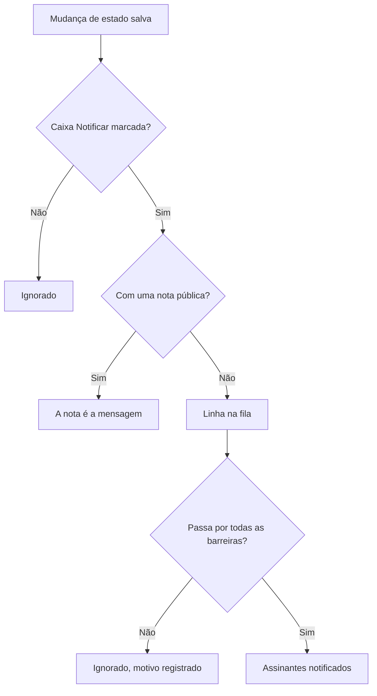

# Estados e severidades de incidentes

Todo incidente carrega duas classificações: um **estado**, que diz em que ponto está a sua resposta, e uma **severidade**, que diz quanto ele dói. Esta página explica o que cada estado faz, como adicionar os seus e como as severidades são ordenadas — para quem configura incidentes, ou quer saber por que um acionou ou não, foi resolvido ou não, ou apareceu ou não em uma página de status.

:::cards
- [Adicionar seus próprios estados](#adicionar-seus-próprios-estados): Modele sua resposta, e veja como conta cada estado.
- [O que a confirmação faz](#o-que-a-confirmação-faz): O acionamento para e o SLA é marcado como respondido.
- [O que a resolução faz](#o-que-a-resolução-faz): Os monitores são devolvidos e o SLA é encerrado.
- [Avisar os assinantes](#avisar-os-assinantes-da-página-de-status-sobre-uma-mudança-de-estado): As barreiras por que uma mudança de estado passa antes de uma página de status ficar sabendo.
:::

## Como funciona

No painel, estados e severidades parecem iguais — os dois aparecem como etiquetas coloridas na lista de incidentes e como um ponto colorido antes do nome onde quer que você escolha um, e os dois são listas do projeto que você pode renomear e recolorir. Mas eles fazem trabalhos muito diferentes.

Os estados determinam o comportamento. Três indicadores booleanos nas linhas de estado, junto com a ordem dos estados, decidem quais incidentes contam como ativos, quais botões aparecem no cabeçalho do incidente, quando o relógio do SLA para e quando o incidente sai da sua página de status. As severidades não determinam nada por si mesmas — são rótulos que descrevem o impacto, e nos quais outras regras podem se basear.

```mermaid title="Os incidentes só descem pela lista; a posição de um estado decide como ele conta"
flowchart TB
    subgraph open["Conta como não confirmado"]
        identified["Identified"]
    end
    subgraph working["Conta como confirmado"]
        acknowledged["Confirmado"]
        mitigated["Mitigated (personalizado)"]
    end
    subgraph done["Conta como resolvido"]
        resolved["Resolvido"]
        closed["Closed (personalizado)"]
    end
    identified --> acknowledged
    acknowledged --> mitigated
    mitigated --> resolved
    resolved --> closed
    identified -. "pular etapas" .-> resolved
```

O modelo `IncidentState` tem `name`, `description`, `color` e `order`, mais três booleanos: `isCreatedState`, `isAcknowledgedState` e `isResolvedState`. Tudo o que o produto faz com os estados se baseia nesses booleanos e em `order` — nunca no nome do estado. É por isso que você pode renomear **Resolvido** para «Closed» sem quebrar nada: o indicador acompanha a linha.

O modelo `IncidentSeverity` tem `name`, `description`, `color` e `order`, e nada mais. Não há indicadores. Nada no OneUptime trata por si só **Critical Incident** de forma diferente de **Minor Incident** — a severidade só importa onde você aponta algo para ela, como o critério de correspondência **Incidente Severidades** de uma regra de plantão.

Algumas regras rápidas:

- **Escolha a severidade para comunicar o impacto** — ela aparece na lista de incidentes, na **Visão geral** do incidente, e é um campo obrigatório quando você declara um incidente.
- **Escolha os estados para modelar seu processo** — as etapas de resposta que você realmente percorre, na ordem em que as percorre.
- **Não codifique urgência nos estados** — um estado chamado «Critical» não acionaria ninguém. Isso é feito pela severidade junto com uma regra de plantão.

> [!TIP]
> As duas listas são criadas junto com seu projeto, e as duas são editadas em **Incidentes → Configurações**. Essa seção do menu lateral de Incidentes vem recolhida por padrão, então expanda **Configurações** antes de procurá-las.

## Os estados iniciais

Três estados são criados com o projeto, nesta ordem. A criação é idempotente — um estado só é adicionado quando ainda não existe um com aquele nome.

| Estado            | `order` | Indicador             | Cor       | O que significa                                    |
| ----------------- | ------- | --------------------- | --------- | -------------------------------------------------- |
| **Identified**    | `1`     | `isCreatedState`      | `#fd625e` | O estado em que os novos incidentes caem.          |
| **Confirmado**    | `2`     | `isAcknowledgedState` | `#ffbf53` | Alguém assumiu o incidente.                        |
| **Resolvido**     | `3`     | `isResolvedState`     | `#2ab57d` | O incidente acabou e deixa de contar como ativo.   |

> [!NOTE]
> O primeiro estado se chama **Identified**, embora várias descrições dentro do produto ainda o chamem de estado «created». Quando uma documentação ou uma dica diz «estado de criação», ela se refere ao estado que tem `isCreatedState` — em um projeto novo, é **Identified**.

## O que cada indicador de estado realmente faz

| Indicador             | Propósito                                                                                                                                                                                            |
| --------------------- | ---------------------------------------------------------------------------------------------------------------------------------------------------------------------------------------------------- |
| `isCreatedState`      | O estado que um incidente recebe quando ninguém escolheu um. Se nenhum estado do projeto tiver esse indicador, criar um incidente falha com um erro que pede que você adicione um estado de criação de incidentes nas configurações. |
| `isAcknowledgedState` | Marca o estado confirmado do projeto: aquele para o qual **Confirmar** leva um incidente e que dá nome ao bloco de estatística de confirmação. Um incidente nele, em qualquer estado posterior, ou resolvido, está confirmado — **Confirmar** não é mais oferecido para ele, o plantão para de acionar por ele e seu SLA é marcado como respondido. |
| `isResolvedState`     | Marca o estado resolvido do projeto: aquele para o qual **Resolver** leva um incidente e que o bloco de estatística de resolução mostra. Um incidente nele, ou em qualquer estado posterior, está resolvido — ele sai de **Incidentes ativos** e da seção ativa de uma página de status, e seu SLA é marcado como resolvido. |

Espera-se que só um estado por projeto tenha cada indicador — as buscas pegam o primeiro na ordem. Os três estados marcados levam a etiqueta **Integrado** na página de configurações; passe o mouse sobre ela (ou chegue até ela com Tab) para ler o que o OneUptime faz com o estado. Eles podem ser renomeados, recoloridos e arrastados, mas:

- **Eles mantêm sua ordem.** O de criação vem antes do confirmado, e o confirmado antes do resolvido. Um arrasto que quebraria isso — **Resolvido** acima de **Confirmado**, por exemplo — é recusado, as linhas voltam ao lugar e a página diz por quê.
- **Eles não podem ser excluídos.** O **Excluir** deles continua no menu da linha, bloqueado, com o motivo. Uma exclusão em massa os pula e os lista como não excluídos. A API também se recusa a excluir o último estado de criação, confirmado ou resolvido de um projeto.

Como a interface lê os nomes dos estados de forma dinâmica, renomear um estado muda o que você vê em todo lugar — os blocos de estatísticas (**Acknowledged in** e **Resolved in** com os nomes iniciais), a confirmação **Mark Incident as …** de um estado personalizado e a etiqueta na lista de incidentes seguem o nome que você deu à linha.

## Adicionar seus próprios estados

Um estado que você adiciona é uma etapa da sua resposta que os três iniciais não nomeiam: «Investigating», «Mitigated», «Monitoring», «Closed».

:::steps
### Abrir a lista de estados

Vá em **Incidentes → Configurações → Estado do incidente**. O cartão **Incidente Estados** lista seus estados na ordem deles, uma linha cada: uma alça para arrastá-lo, sua cor e seu nome, como **Conta como** um incidente nele, e sua descrição. A frase abaixo do título diz isso claramente: os incidentes só descem por esta lista.

### Criar o estado

Clique em **Criar: Estado do incidente**, no cabeçalho do cartão, e preencha o formulário (campos abaixo). O novo estado é adicionado **logo acima do estado resolvido** — onde a maioria dos estados deve ficar, e nunca abaixo dele, onde contaria silenciosamente como resolvido.

### Arrastá-lo para o lugar

Arraste uma linha pela alça para movê-la. A nova ordem é salva quando você a solta; não há número de ordem para digitar. Pelo teclado, coloque o foco na alça, pressione Espaço, mova com as setas e pressione Espaço de novo. A coluna **Conta como** se atualiza quando você solta a linha.
:::

**Editar** abre o mesmo formulário da criação. O ID do estado fica em **Mostrar ID** no menu da linha.

| Campo           | Obrigatório | O que faz                                                                                                                                                                                                                                                          |
| --------------- | ----------- | ------------------------------------------------------------------------------------------------------------------------------------------------------------------------------------------------------------------------------------------------------------------- |
| **Nome**        | Sim         | Pelo menos dois caracteres. O texto de exemplo sugere algo como «Investigating».                                                                                                                                                                                   |
| **Descrição**   | Não         | Texto livre explicando quando um incidente fica neste estado.                                                                                                                                                                                                      |
| **Cor**         | Sim         | Já escolhida quando o formulário abre: uma cor que nenhum estado da lista usa ainda, para que um estado novo nunca saia do mesmo vermelho do de cima. Escolha outra na fileira de cores com nome (Red, Orange, Lime, Green, Teal, Blue, Indigo, Purple, Magenta, Pink), ou use **Cor personalizada** para uma cor exata da marca, como `#fd625e`. |

A cor tinge a etiqueta do estado e o ponto antes do nome dele em todo seletor de estado: os formulários de declaração e de modelo, a ação em massa **Alterar estado**, o menu de estados do cabeçalho e as condições de regras e filtros. Cada um desses seletores lista os estados na ordem em que esta página os coloca.

Você não pode definir os três indicadores por este formulário — eles pertencem às linhas iniciais. Um estado que você adiciona é, portanto, um estado sem indicador, o que tem três consequências que vale planejar:

- **A posição dele decide como ele conta.** A coluna **Conta como** mostra isso, e muda enquanto você arrasta: acima do estado confirmado, um incidente nele está **Não confirmado**; do estado confirmado para baixo, ele conta como **Confirmado**, então as políticas de plantão param de escalá-lo; do estado resolvido para baixo, ele conta como **Resolvido**, então as páginas de status param de mostrá-lo como ativo.
- **Acima do estado resolvido, ele mantém o incidente ativo.** **Incidentes ativos** contém os incidentes cujo estado atual fica acima do estado resolvido, então um estado que você adiciona ali mantém o incidente na lista ativa e na contagem da barra lateral. Um estado arrastado para baixo do estado resolvido conta como resolvido em todo lugar — nas listas ativas, nas páginas de status, nos lembretes e no SLA — e mover um incidente para ele a partir de **Resolvido** não é uma segunda resolução.
- **Você move um incidente para ele pelo menu do cabeçalho.** Os botões do cabeçalho são só **Confirmar** e **Resolver**; um estado personalizado fica em **Change state to** no menu **⋯** ao lado deles, que lista todos os estados depois do atual. A confirmação dele se chama **Mark Incident as `<state name>`**, com um botão de envio **Mark as `<state name>`**.

> [!TIP]
> Um formato comum é uma etapa de mitigação entre o estado confirmado e o resolvido — crie «Mitigated» e ele cai logo acima de **Resolvido**, depois de **Confirmado**, contando como confirmado. Para uma etapa de triagem antes que alguém tenha confirmado o incidente, arraste-o para cima de **Confirmado**.

## A ordem é uma restrição real, não uma preferência de exibição

A ordem é aplicada quando uma mudança de estado é gravada, não só quando a lista é desenhada:

- **Transições para trás são rejeitadas.** Mover um incidente para um estado que fica antes, na ordem, do seu estado atual falha com um erro que nomeia os dois estados.
- **Selecionar de novo o estado atual é rejeitado.** Colocar um incidente no estado em que ele já está falha com «Incident state cannot be same as previous state.»
- **Uma linha retroativa não pode duplicar a vizinha.** Inserir uma linha da linha do tempo cujo estado é igual ao da linha seguinte também é recusado.
- **Os botões do cabeçalho seguem a posição dos estados marcados na ordem.** **Confirmar** e **Resolver** são oferecidos conforme o lugar do estado atual na lista ordenada. Um estado personalizado colocado *depois* do estado resolvido nunca mostra um botão **Resolver**, porque um incidente nele já conta como resolvido.

Então, quando adicionar um estado, coloque-o onde um incidente realmente passaria por ele. Ordená-lo errado não só parece estranho — torna transições impossíveis. Mover um estado para mais adiante muda como contam os incidentes que já estão nele, no momento em que você o solta.

Pela API e pelo Terraform, a ordem é a coluna `order`: números menores vêm primeiro. Um estado criado sem ela vai para logo acima do estado resolvido; um criado ou atualizado com um número ocupa esse lugar, e os estados no caminho descem uma posição. Números que ninguém mais tem são mantidos como escritos, então um estado gerenciado pelo Terraform lê de volta o número que recebeu.

## As severidades iniciais

Três severidades são criadas com o projeto, nesta ordem, da mais severa para a menos:

| Severidade            | `order` | Cor       | Descrição inicial                                                                                                                                                                         |
| --------------------- | ------- | --------- | ----------------------------------------------------------------------------------------------------------------------------------------------------------------------------------------- |
| **Critical Incident** | `1`     | `#b70400` | Issues causing very high impact to customers. Immediate response is required. Examples include a full outage, or a data breach.                                                          |
| **Major Incident**    | `2`     | `#fd625e` | Issues causing significant impact. Immediate response is usually required. We might have some workarounds that mitigate the impact on customers. Examples include an important sub-system failing. |
| **Minor Incident**    | `3`     | `#ffbf53` | Issues with low impact, which can usually be handled within working hours. Most customers are unlikely to notice any problems. Examples include a slight drop in application performance. |

A severidade é obrigatória quando você declara um incidente, e é obrigatória em cada especificação de incidente nos critérios de um monitor, então todo incidente — manual ou automático — chega com uma. Veja [Declarar um incidente](/docs/incidents/declaring-incidents) para o fluxo de declaração e [Modelos de incidentes e alertas](/docs/monitor/incident-alert-templating) para o caminho guiado por monitores.

## Editar severidades

Vá em **Incidentes → Configurações → Severidade do incidente**. Mesmo formato da página de estados — uma linha por severidade, da mais severa para a menos, arraste uma linha para mudar sua posição, **Criar: Severidade do incidente** adiciona uma no final (a menos severa), com **Nome**, **Descrição** e **Cor** no formulário, e a cor já escolhida como no formulário de estados.

A posição importa onde quer que o OneUptime compare severidades: um episódio assume a severidade do seu incidente mais severo, e os valores Critical e Warning de uma recomendação de monitor correspondem à sua primeira e à sua segunda severidade.

Duas diferenças em relação aos estados:

- **Não há proteção contra exclusão.** Qualquer severidade pode ser excluída, incluindo as três iniciais.
- **Não há indicadores a herdar, nem «Conta como».** Uma severidade nova se comporta exatamente como as iniciais — é um rótulo com uma cor e uma posição.

Onde a severidade faz mais do que descrever: em **Incidentes → Regras → Regras de Plantão**, o campo **Incidente Severidades** de uma regra é um critério de correspondência. Listar **Critical Incident** ali é como se expressa «acionar a equipe de banco de dados para tudo o que for crítico» — a política de plantão fica na regra, não na severidade.

**Alterar a severidade de um incidente** — em **Editar** no cartão **Detalhes do incidente** do incidente, pela API ou pelo Terraform (`incidentSeverityId`), com um workflow ou com as ferramentas de IA — faz as mesmas quatro coisas, seja como for enviada: o feed do incidente recebe uma entrada **Incident updated** que nomeia a nova severidade, os prazos de SLA do incidente são recalculados, sua regra de lembrete é reavaliada, e as métricas de incidentes contam uma mudança de severidade. Salvar a severidade que o incidente já tem não faz nada disso, então editar só o título de um incidente deixa seus prazos de SLA, seus lembretes e sua contagem de mudanças de severidade como estavam. A severidade de um alerta funciona do mesmo jeito para a entrada de feed e os lembretes dele.

## Mover um incidente pelos seus estados

Um incidente muda de estado de quatro formas:

| Forma                     | Onde                                                                                        | O que pede                                                                                                                                                                                                   |
| ------------------------- | ------------------------------------------------------------------------------------------- | ------------------------------------------------------------------------------------------------------------------------------------------------------------------------------------------------------------ |
| **Botões do cabeçalho**   | O cabeçalho do incidente: **Confirmar** e **Resolver**, e **Change state to** no menu **⋯** dele | Uma confirmação curta — **Confirmar incidente** ou **Resolver incidente** — com **Notificar assinantes da página de status** e, recolhida em **Adicionar uma nota pública**, a **Nota pública** opcional e seu seletor **Selecionar Modelo de Nota** (quando o projeto tem modelos de notas). |
| **Linha do tempo de estado** | **Linha do tempo de estado** no menu lateral do incidente                                | Uma linha adicionada manualmente, com **Status do Incidente**, **Começa em** e **Notificar assinantes da página de status**.                                                                                |
| **Alteração em massa**    | **Alterar estado** em uma seleção na lista de incidentes                                    | Uma página com o estado, **Notificar assinantes da página de status** e o mesmo **Adicionar uma nota pública** recolhido.                                                                                   |
| **Automaticamente**       | Um critério de monitor, ou seu próprio código                                               | Um critério com **Resolver incidente automaticamente** ativado resolve seu incidente quando o critério deixa de ser atendido. A API muda o estado criando uma linha em `/api/incident-state-timeline`.       |

Se o estado atual fica antes do estado confirmado, o cabeçalho oferece **Confirmar** e **Resolver**; se fica entre os dois, só **Resolver**. Confirmar também interrompe qualquer escalonamento de plantão do incidente.

Cada uma dessas formas grava uma linha na linha do tempo. Uma mudança de estado também faz algumas coisas que você não precisa pedir: publica uma entrada no feed do incidente, atribui um Comandante do incidente se o incidente ainda não tiver um, e atualiza o relógio do SLA. Reabrir um incidente resolvido inicia um novo registro de SLA a partir do horário da reabertura.

## O que a confirmação faz

Um incidente está confirmado a partir do momento em que passa para o seu estado confirmado, para qualquer estado posterior — um estado **Mitigated** ou **Investigating** que você colocou abaixo de **Confirmado** — ou para um estado resolvido, qualquer que seja a das quatro formas acima que o mova. A coluna **Conta como** da página de configurações de estados mostra quais são esses estados. Depois de confirmado:

- **Confirmar não é mais oferecido.** Nem no cabeçalho do incidente, nem no aplicativo móvel (o botão e o gesto de deslizar), nem no Slack ou no Microsoft Teams, nem pelo `acknowledge_incident` do servidor MCP do OneUptime. Confirmá-lo mesmo assim — a partir de um acionamento de plantão, do Slack ou do Teams — é recusado com «Incident is already acknowledged.» (ou «Incident is already resolved.»), em vez de fazê-lo voltar na lista.
- **O plantão para de acionar por ele.** Um respondedor que confirma seu acionamento depois que um colega confirmou o incidente, ou o fez avançar, tem seu acionamento confirmado e o incidente fica onde está.
- **O SLA é marcado como respondido**, no primeiro movimento desse tipo; avançar depois por estados posteriores mantém esse horário.
- **O tempo até a confirmação corre até esse primeiro movimento** — o bloco de estatística da **Visão geral** do incidente, a métrica **Time to Acknowledge**, uma medição que termina quando **O incidente é confirmado**, e o MTTA nos resumos do Slack e do Microsoft Teams. Um incidente movido direto de **Identified** para **Investigating** foi confirmado naquele momento; um resolvido logo de cara foi confirmado quando foi resolvido.
- **Um filtro Confirmado** — no widget de lista de incidentes de um painel, por exemplo — mostra os incidentes no seu estado confirmado e em qualquer estado posterior, antes da resolução.

Alertas e episódios seguem a mesma regra, com seus estados de alerta.

## O que a resolução faz

Um incidente é resolvido quando passa de um estado acima do seu estado resolvido para o estado resolvido, ou para qualquer estado posterior — qualquer que seja a das quatro formas acima que o mova. Cada resolução:

- **Devolve os monitores que o incidente retém.** Um incidente declarado aberto retém seus monitores: ele os colocou no status de **Alterar status do monitor para**, quando nomeia um, e, declarado manualmente, pausou o monitoramento deles. Uma edição enquanto ele está aberto — adicionar monitores, ou mudar esse status — também faz com que ele os retenha. Resolver retoma o monitoramento deles e os devolve ao estado operacional, a menos que outro incidente aberto ainda esteja sobre eles, e a partir daí o incidente não retém mais nada. Então um incidente declarado já resolvido não devolve nada, nem uma segunda resolução depois de uma reabertura: um status que seus monitores receberam nesse meio-tempo — das sondas deles, de uma manutenção ou definido manualmente — permanece.
- **Marca o SLA como resolvido** e, quando os rascunhos de post-mortem do OneUptime AI estão ativados, redige um post-mortem.

Passar de **Resolvido** para um estado posterior — **Closed**, por exemplo — não é uma segunda resolução: nada disso é executado de novo, e nenhum SLA novo começa. Um incidente declarado antes de o OneUptime começar a registrar isso devolve seus monitores na próxima resolução, como antes.

## A linha do tempo de estados

A página **Linha do tempo de estado** no menu lateral do incidente é a trilha de auditoria de cada estado em que o incidente esteve. O cartão dessa página se chama **Linha do tempo de status**, e é ordenado do mais recente para o mais antigo.

| Coluna                                  | O que mostra                                                                                                                                                                                                                                                   |
| --------------------------------------- | -------------------------------------------------------------------------------------------------------------------------------------------------------------------------------------------------------------------------------------------------------------- |
| **Status do Incidente**                 | Uma etiqueta colorida com o nome e a cor do estado.                                                                                                                                                                                                            |
| **Começa em**                           | Quando o incidente entrou neste estado.                                                                                                                                                                                                                        |
| **Termina em**                          | Quando ele saiu. O estado atual mostra `Currently Active`.                                                                                                                                                                                                     |
| **Duração**                             | O tempo passado no estado, contado até agora para o atual.                                                                                                                                                                                                     |
| **Status de notificação do assinante**  | Se a notificação da página de status para esta mudança foi enviada, ignorada ou ainda está pendente, com um link **mais detalhes** e — quando o envio falhou — uma ação **Tentar novamente**. **Tentar novamente** envia de novo a mudança de estado a todas as páginas de status que o incidente alcança agora, incluindo os assinantes que já a receberam. |

Cada linha tem duas ações:

- **Ver causa** — abre uma caixa de diálogo **Causa raiz** que mostra o Markdown registrado com aquela mudança de estado.
- **Ver registros** — abre uma caixa de diálogo explicando por que o status mudou, com um visualizador **Registro de Estado do Incidente**.

No painel, as linhas da linha do tempo podem ser adicionadas e excluídas, mas não editadas; um incidente sempre mantém pelo menos uma linha. Pela API, o `startsAt` de uma linha pode ser corrigido, e toda medição calculada a partir da linha do tempo o acompanha.

> [!WARNING]
> Excluir a linha errada reescreve o histórico do incidente, então trate isso como uma ferramenta de correção, e não como um hábito de limpeza.

## A lista de Incidentes ativos

**Incidentes → Incidentes ativos** é a lista que você acompanha durante um plantão. Sua definição é exatamente uma condição: o estado atual do incidente fica acima do seu estado resolvido — o primeiro estado na ordem marcado com `isResolvedState`. Nada mais é considerado — nem a severidade, nem a idade, nem se alguém o confirmou.

O item do menu lateral leva um selo vermelho com uma contagem que usa a mesma consulta, então o selo e a lista sempre concordam. Quando não há nada para ver, a página diz isso.

A consequência prática: um estado personalizado que você adiciona acima do estado resolvido mantém os incidentes nesta lista — «Mitigated» não é «concluído» — e um que você coloca depois os tira dela, como faz o estado resolvido. Alertas e episódios seguem a mesma regra com seus próprios estados, e as contagens do menu lateral, os lembretes, as páginas de status e o aplicativo móvel leem todos essa regra.

## Avisar os assinantes da página de status sobre uma mudança de estado

Uma mudança de estado pode notificar os assinantes da sua página de status, mas passa por várias barreiras. Entendê-las poupa muita investigação do tipo «por que ninguém foi notificado».



A notificação é solicitada por linha da linha do tempo por **Notificar assinantes da página de status** (`shouldStatusPageSubscribersBeNotified`), a caixa de seleção da caixa de diálogo de mudança de estado e do formulário manual da linha do tempo. Na caixa de diálogo de mudança de estado, ela começa desmarcada quando o incidente foi declarado sem notificar os assinantes. A mesma caixa também decide se a nota pública da caixa de diálogo notifica alguém. Quando ela está desmarcada, a linha é gravada com um status de ignorado e uma explicação. Quando está marcada, a linha entra na fila e uma tarefa em segundo plano a pega — a tarefa roda a cada minuto, então a entrega é rápida, mas não instantânea.

**A linha na fila é então ignorada quando qualquer uma destas condições vale:**

- **O novo estado é o estado de criação.** Os assinantes já foram avisados quando o incidente foi declarado, então a primeira linha da linha do tempo deliberadamente não envia uma segunda mensagem.
- **O incidente não tem monitores anexados.** Sem recursos, não há nenhuma página de status em que colocar o incidente.
- **O incidente não está visível na página de status** (`isVisibleOnStatusPage` está desativado).
- **A página de status tem os incidentes desativados** (`showIncidentsOnStatusPage` está desativado). Isso vale por página de status — outras páginas que mostram o mesmo monitor continuam sendo notificadas.
- **A página de status está fora do escopo do incidente.** Um incidente limitado a algumas páginas de status com **Limitar a estas páginas de status** notifica só essas páginas entre as que listam seus monitores, e uma página com **Mostrar apenas incidentes limitados a esta página** ativado nunca é notificada sobre um incidente que não esteja limitado a ela. Isso também vale por página de status. Veja [Uma página de status por público](/docs/status-pages/one-status-page-per-audience).

**Mais uma coisa que muda o resultado.** Se você escrever uma **Nota pública** na caixa de diálogo de mudança de estado (em **Adicionar uma nota pública**) ou na ação em massa **Alterar estado** enquanto **Notificar assinantes da página de status** está marcada, a linha da linha do tempo é marcada como já notificada em vez de entrar na fila, e sua mensagem de status diz que a nota a levou. É a própria nota que chega aos assinantes, então eles recebem uma mensagem em vez de duas. Uma nota com nada além de espaços não é publicada, e a linha entra na fila como de costume. As mudanças de estado de manutenções programadas funcionam do mesmo jeito. O tipo de evento por trás da mensagem simples de mudança de estado é `Subscriber Incident State Changed`.

**A nota diz em que estado o incidente está agora.** Como a nota é a única mensagem, ela nomeia o novo estado em todos os canais, como a mensagem de mudança de estado teria feito: o assunto do e-mail é `[Resolved Incident] <title>` e seus detalhes mostram uma linha **Status** na cor do estado, o SMS diz `Incident <title> on <status page> is Resolved.`, as mensagens do Slack e do Microsoft Teams trazem uma linha `**Status:** Resolved`, e o payload `IncidentNoteCreated` do webhook traz `incidentState` em `data`. Uma nota publicada sozinha mantém sua mensagem de costume, assim como a notificação de atualização de uma edição.

**Publicar a nota precisa de uma permissão própria.** Mudar o estado e publicar uma nota pública são permissões separadas (**Create Incident State Timeline** e **Create Incident Status Page Note** em uma função personalizada; as funções integradas de incidente e de projeto têm as duas). Mudar o estado não exige permissão para editar o incidente: veja [Alterar um estado](/docs/permissions/index#alterar-um-estado). Quem pode mudar o estado de um incidente, mas não publicar notas públicas, não recebe a opção **Adicionar uma nota pública** na caixa de diálogo nem na ação em massa **Alterar estado**. Uma mudança de estado que essa pessoa envia com uma nota pela API é recusada por inteiro, com uma mensagem que diz que o estado não foi alterado e por quê, para que uma mudança nunca seja registrada como levada por uma nota que nunca foi publicada. Sem a nota, a mudança passa. Alertas, episódios de alertas e episódios de incidentes oferecem em vez disso uma nota privada com uma mudança de estado (**Adicionar uma nota privada**), e ela funciona do mesmo jeito: publicá-la exige a permissão própria da nota (**Create Alert Internal Note**, **Create Alert Episode Internal Note** ou **Create Incident Episode Internal Note** em uma função personalizada; as funções integradas de alerta, de incidente e de projeto as têm), e uma mudança de estado enviada com uma nota privada por alguém sem essa permissão é recusada por inteiro, então o estado não é alterado.

**Enviado significa enviado a todos os assinantes.** A tarefa espera cada mensagem e a conta como enviada ou com falha, por página de status e canal, e a mensagem de status da linha lista essas contagens. Uma única mensagem com falha, ou um envio que esgotou o tempo ou foi interrompido, deixa a linha como **Falhou**. Veja [Assinantes e comunicados](/docs/status-pages/subscribers).

Para saber quem recebe essas mensagens e como os modelos são escolhidos, veja [Assinantes e comunicados](/docs/status-pages/subscribers).

## Manter um incidente fora da página de status

Quatro coisas distintas decidem se um incidente aparece em uma página pública, e as quatro precisam ser verdadeiras:

- **Mostrar incidentes** (`showIncidentsOnStatusPage`) na própria página de status.
- **Visível na página de status** (`isVisibleOnStatusPage`) no incidente — um interruptor na página **Configurações** do incidente. Ele é true por padrão e não está no assistente de declaração; um critério de monitor pode defini-lo com **Mostrar incidente na página de status**. Um incidente declarado oculto não avisa nenhum assinante ao ser criado; quando você ativa esse interruptor depois, o formulário de edição oferece **Notificar os assinantes de que este incidente foi criado**. Veja [Declarar um incidente](/docs/incidents/declaring-incidents).
- **A página está ao alcance do incidente.** A página lista um dos monitores do incidente e, se o incidente estiver limitado a algumas páginas de status, é uma delas. Uma página com **Mostrar apenas incidentes limitados a esta página** ativado mostra só os incidentes limitados a ela. Veja [Uma página de status por público](/docs/status-pages/one-status-page-per-audience).
- **O estado atual fica acima do estado resolvido.** É isso que tira um incidente da seção ativa: a consulta da página de status busca incidentes cujo estado atual fica acima do seu estado resolvido, então o estado resolvido e qualquer estado posterior tiram o incidente. Você não arquiva nem fecha nada — você o resolve, e ele vai para o histórico.

**Incidentes privados nunca aparecem.** Ativar **Incidente privado** oculta o incidente de todas as páginas de status, independentemente dos interruptores acima, e o restringe a seus proprietários, mais os administradores e proprietários do projeto. Nada dele chega também a um assinante de página de status: nem sua criação, nem suas mudanças de estado, nem suas notas públicas, nem seu post-mortem. As imagens da sua descrição, do seu post-mortem, dos seus campos personalizados e das suas notas públicas não ficam visíveis para todos enquanto ele é privado.

Os dois interruptores são mantidos em sincronia, então a página **Configurações** do incidente sempre mostra o que as páginas de status fazem:

- Tornar um incidente privado desativa **Visível na página de status** junto.
- Ativar **Visível na página de status** enquanto o incidente continua privado o deixa desativado. Para publicar um incidente privado, desative **Incidente privado** e ative **Visível na página de status** — em um único salvamento, ou um depois do outro.

Isso vale seja qual for a forma como o incidente é gravado: o painel, a API, o Terraform, um workflow, um monitor, um modelo de incidente ou uma regra de privacidade. Um valor enviado como texto, como `"true"`, conta tanto quanto `true`. Uma gravação em muitos incidentes que ativa **Visível na página de status** — o **Update Many** de um workflow, por exemplo — mostra os que não são privados e deixa todos os privados ocultos. Cada incidente é decidido como está quando a gravação chega a ele, então uma mudança na privacidade dele que chegue no mesmo instante nunca é atropelada: um incidente nunca é salvo privado e visível ao mesmo tempo. Um incidente criado privado é criado oculto, e não avisa nenhum assinante de que foi criado.

**Os episódios seguem a mesma regra.** Um episódio de incidente privado fica oculto de todas as páginas de status, diga o que disser seu interruptor **Visível na página de status**, e seus assinantes não ficam sabendo de nada sobre ele. Na página **Configurações** do episódio, o interruptor diz isso, e fica desativado enquanto o episódio for privado. Um incidente privado nunca leva seu episódio para uma página de status: um episódio só chega a uma página por meio de incidentes que não são privados.

:::details Atualizar a partir de uma versão sem estas regras
Incidentes e episódios salvos como privados com **Visível na página de status** ainda ativado, de antes destas regras, têm o interruptor desativado quando você atualiza. Nada é enviado a ninguém. As imagens que um incidente ou episódio assim tinha tornado visíveis para todos voltam a ser privadas, a menos que algo que suas páginas de status mostram ainda as contenha. O mesmo vale para as imagens em notas públicas de incidentes, episódios e eventos de manutenção programada que suas páginas de status não mostram, que antes continuavam visíveis para todos.
:::

Quanto histórico resolvido a página mantém é uma configuração da página de status, não do incidente. Veja [Recursos e grupos da página de status](/docs/status-pages/resources-and-groups) para saber como os monitores da página decidem quais incidentes aparecem.

## Próximos passos

:::cards
- [Declarar um incidente](/docs/incidents/declaring-incidents): Escolha um estado inicial e uma severidade ao declarar.
- [Notas, responsáveis e feed de incidentes](/docs/incidents/notes-owners-and-feed): Publique a nota pública que acompanha uma mudança de estado.
- [Configurações e automação de incidentes](/docs/incidents/settings): Meça o tempo entre estados, e use as severidades nas regras.
- [Assinantes e comunicados](/docs/status-pages/subscribers): Quem recebe as mensagens que uma mudança de estado envia.
:::
