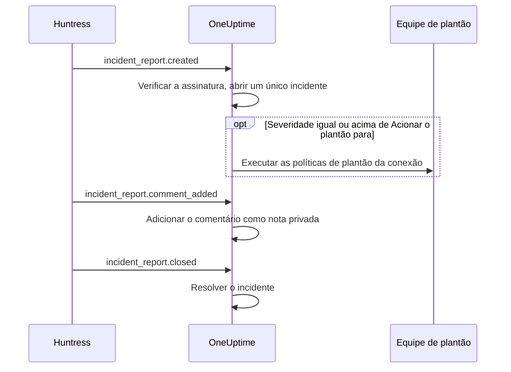

# Integração com o Huntress

Acione a sua equipe de plantão para os relatórios de incidente do Huntress. Quando o SOC do Huntress envia um relatório de incidente sobre um endpoint ou uma identidade, o OneUptime abre um único incidente para ele, com a severidade que você escolher, aciona as políticas de plantão que você indicar e resolve o incidente quando o relatório é fechado no Huntress.

Esta integração é de **entrada**: o Huntress envia cada evento de um relatório de incidente para uma URL de webhook que o OneUptime fornece, assinado com o segredo de assinatura do endpoint. O OneUptime nunca chama o Huntress, então não precisa de nenhuma chave de API do Huntress.

:::cards
- [Como funciona](#como-funciona): O que o OneUptime faz com cada evento de um relatório.
- [Configuração](#configurar-a-integração): Conectar no OneUptime, adicionar o endpoint no Huntress, salvar o segredo de assinatura, enviar um teste.
- [Configurações](#configurações): Acionamento, severidades, organizações, rótulos e resolução.
- [Solução de problemas](#solução-de-problemas): O que os erros da conexão significam e o que mudar.
:::

## Como funciona

O Huntress envia um evento sobre um relatório de incidente quando o relatório é enviado, quando alguém o comenta e quando ele é fechado. Cada evento traz o relatório inteiro.

1. **Verificar.** Uma solicitação precisa estar assinada com o segredo de assinatura do endpoint, no máximo cinco minutos antes de chegar. Todo o resto é recusado, e a página da conexão diz por quê.
2. **Abrir um único incidente.** O primeiro evento de um relatório abre um incidente com o nome do relatório, como `Huntress: Incident on DESKTOP-01 (Acme Corp)`. A descrição traz o resumo do relatório, a severidade no Huntress, a organização, o host ou a identidade afetados, os indicadores que o Huntress encontrou e um link para o relatório no Huntress. Os eventos seguintes do mesmo relatório, e as entregas que o Huntress reenvia, encontram esse incidente: um relatório nunca abre dois.
3. **Acionar.** O incidente abre com a severidade de incidente que a conexão atribui à severidade do Huntress do relatório. Quando essa severidade é igual ou acima de **Acionar o plantão para**, as **Políticas de plantão** da conexão são executadas.
4. **Acompanhar o relatório.** Um comentário adicionado no Huntress vira uma nota privada no incidente. Quando o relatório é fechado ou descartado, o incidente é resolvido.

Os incidentes abertos assim nunca aparecem em uma página de status. As suas regras de incidentes (de plantão, de responsáveis, de rótulos e de privacidade) valem para eles como para qualquer outro incidente.

## Antes de começar

- No OneUptime, a função **Project Owner** ou **Project Admin**. Membros, visualizadores e as funções de incidentes veem a conexão e os relatórios recebidos, mas não podem alterá-la.
- No Huntress, a função **Account Admin**: só administradores da conta podem adicionar webhooks.
- Uma política de plantão para acionar. Sem ela, os relatórios abrem incidentes e não acionam ninguém, a menos que uma regra de plantão de incidentes corresponda a eles.
- Em uma instalação auto-hospedada, um OneUptime que o Huntress alcance pela internet via HTTPS: o Huntress só envia webhooks para URLs `https://`.

## Configurar a integração

:::steps
### Conectar o Huntress no OneUptime

Abra **Incidentes → Integrações → Huntress** (`/dashboard/{projectId}/incidents/integrations/huntress`). A seção **Integrações** do menu lateral de incidentes vem recolhida, então expanda-a primeiro. Clique em **Conectar Huntress**.

Escolha as **Políticas de plantão** a acionar. **Acionar o plantão para** pergunta então quais relatórios as acionam, e começa em **Relatórios altos e críticos**. Todo o resto aguarda em **Mais campos** com um valor padrão (veja [Configurações](#configurações)). Clique em **Conectar Huntress**. A página da conexão se abre, com um cartão **Conectar Huntress** que guia você pelos próximos três passos.

### Adicionar um endpoint de webhook no Huntress

Na página da conexão, clique em **Copiar URL do webhook**. A URL tem a forma `https://oneuptime.com/api/huntress/webhook/<connection-id>`; em uma instalação auto-hospedada, ela começa com o seu próprio host.

No Huntress, abra o menu no canto superior direito e escolha **Integrations**. Clique em **Add an Integration**, escolha **Webhooks** e clique em **Add Endpoint**. Cole a URL, ative **Incident Reports** e salve. Deixe **Escalations**, **Platform Actions** e **Account Notices** desativados: o OneUptime aceita esses eventos e não faz nada com eles.

### Salvar o segredo de assinatura do endpoint

No Huntress, abra o menu do endpoint (⋯) e escolha **View Signing Secret**. Copie-o inteiro: ele começa com `whsec_`. Na página da conexão, clique em **Salvar segredo de assinatura**, cole-o e clique em **Salvar segredo de assinatura**. O segredo é criptografado e nunca mais é exibido.

Enquanto o segredo não for salvo, o OneUptime recusa toda solicitação para a URL. O Huntress reenvia mais tarde um evento recusado, então um evento recusado agora chega mesmo assim.

### Enviar um teste

No Huntress, abra o menu do endpoint (⋯) e escolha **Send Test**. Em poucos segundos, o cartão na página da conexão vira **Conexão**, com o estado **Recebendo relatórios**.

> [!NOTE]
> Seja qual for o conteúdo do teste, a conexão mostra que ele chegou. Um teste que traz um relatório de incidente abre um incidente como qualquer outro relatório, e aciona o plantão se for grave o bastante.
:::

## Configurações

**Conectar Huntress** pergunta apenas quem é acionado e para quais relatórios. Todo o resto aguarda em **Mais campos**, com um valor padrão que serve à maioria das equipes. Para mudar uma configuração depois, clique em **Editar definições** no cartão **Configurações** da conexão.

| Configuração | O que faz | Padrão |
| --- | --- | --- |
| **Políticas de plantão** | As políticas executadas quando um relatório é grave o bastante. Deixe em branco para abrir incidentes sem acionar ninguém. | Nenhuma |
| **Acionar o plantão para** | Quais relatórios acionam as políticas: **Somente relatórios críticos**, **Relatórios altos e críticos** ou **Todos os relatórios**. Cada relatório abre um incidente de qualquer forma. | **Relatórios altos e críticos** |
| **Nome** | Como a conexão se chama no OneUptime. | `Huntress` |
| **Severidade para relatórios críticos**, **Severidade para relatórios altos**, **Severidade para relatórios baixos** | A severidade de incidente com que cada severidade do Huntress abre. | As suas três severidades de incidente mais altas, em ordem |
| **Somente estas organizações** | As organizações do Huntress cujos relatórios abrem incidentes, um nome ou ID de organização por linha. Os nomes ignoram maiúsculas e minúsculas. | Vazio: todas as organizações |
| **Rótulos** | Rótulos adicionados a cada incidente, além do que leva o nome da organização do relatório. | Nenhum |
| **Resolver quando o Huntress fechar o relatório** | Resolver o incidente quando o relatório dele é fechado ou descartado no Huntress. Desativado, uma nota privada no incidente informa isso. | Ativado |

### Severidades

O Huntress dá a cada relatório de incidente uma de três severidades. A menos que você escolha uma severidade de incidente para alguma delas, o relatório abre pela ordem das suas severidades de incidente, como **Incidentes → Configurações → Severidade do incidente** as lista:

| Severidade no Huntress | O que o Huntress quer dizer | Severidade de incidente |
| --- | --- | --- |
| Critical | Atacantes ativos no teclado, malware perigoso ou comprometimento ativo, a conter imediatamente. | A mais alta |
| High | Malware confirmado que exige correção urgente, ou comprometimento de identidade que pede ação. | A segunda |
| Low | Programas potencialmente indesejados, restos de malware e descobertas mais antigas sobre identidades. | A terceira |

Um projeto com menos severidades usa a mais baixa para o restante. Um relatório sem severidade é tratado como alto. Se uma severidade que você escolheu for excluída, a ordem volta a decidir.

### Organizações

Cada incidente recebe um rótulo com o nome da organização do Huntress do relatório, como _Acme Corp_. Uma conexão recebe os relatórios de todas as organizações da sua conta do Huntress, e **Somente estas organizações** restringe isso.

> [!TIP]
> Para acionar a equipe de cada cliente, deixe as **Políticas de plantão** da conexão em branco e adicione uma regra de plantão de incidentes por organização, como "Se **Rótulos de incidentes** tem algum de _Acme Corp_", que execute a política desse cliente. Veja [Regras de plantão de incidente](/docs/incidents/settings#regras-de-plantão-de-incidente).

## Relatórios na página da conexão

A lista **Relatórios de incidente** da conexão mostra cada relatório que o Huntress enviou, do mais recente para o mais antigo: o host ou a identidade afetados, a severidade e o status no Huntress, e o **Resultado**.

| Resultado | O que aconteceu |
| --- | --- |
| **Incidente aberto** | O relatório abriu um incidente. **Ver incidente** o abre; **Plantão acionado** indica que a conexão acionou as políticas. |
| **Incidente resolvido** | O Huntress fechou o relatório, e o incidente dele foi resolvido. |
| **Ignorado: organização não monitorada** | A organização do relatório não está em **Somente estas organizações**. |
| **Ignorado: já fechado no Huntress** | O relatório já estava fechado quando o OneUptime soube dele pela primeira vez. |

Um relatório ignorado continua ignorado quando você muda as configurações depois. Quando **Resolver quando o Huntress fechar o relatório** está desativado, um relatório fechado mantém o resultado **Incidente aberto**.

## Segurança

- **Somente solicitações assinadas.** O OneUptime confere os cabeçalhos `svix-id`, `svix-timestamp` e `svix-signature` que o Huntress envia com o corpo da solicitação exatamente como chegou. Uma solicitação que não está assinada com o segredo salvo, ou que foi assinada mais de cinco minutos antes ou depois, é recusada.
- **O segredo continua secreto.** Ele é guardado criptografado, a API nunca o devolve e ele nunca mais é exibido. **Substituir segredo de assinatura** na página da conexão salva outro, como o segredo de um endpoint novo.
- **A URL é um endereço, não uma senha.** Ela identifica a conexão; só uma solicitação assinada com o segredo do endpoint é processada.
- **Um endpoint por conexão.** Cada conexão tem a própria URL e o próprio segredo. Para receber os relatórios de uma segunda conta do Huntress, conecte de novo.

## Usar e-mail em vez disso

O Huntress também envia os relatórios de incidente por e-mail, e um [monitor de e-mails recebidos](/docs/monitor/incoming-email-monitor) pode abrir incidentes a partir desses e-mails, por exemplo quando o assunto contém `Critical Incident Report`. Mas ele trata os e-mails como o status de um único monitor: enquanto o incidente dele está aberto, o relatório seguinte não abre nenhum, e o incidente é resolvido pelos critérios do monitor, não quando o Huntress fecha o relatório. A conexão do Huntress abre um incidente por relatório e resolve cada um junto com o relatório, então prefira-a. Assim que a conexão receber relatórios, pare de enviar os e-mails ao monitor, ou cada relatório acionará duas vezes.

## Solução de problemas

Quando o OneUptime recusa uma solicitação, a página da conexão mostra o motivo em **A última solicitação foi recusada**. No Huntress, **View Delivery Attempts** no menu do endpoint (⋯) lista cada entrega com a resposta do OneUptime.

:::details "A request arrived but was refused, because no signing secret is saved for this connection yet"
Salve o segredo de assinatura do endpoint: veja [Configurar a integração](#configurar-a-integração). O Huntress reenvia a solicitação recusada.
:::

:::details "The request's signature does not match the signing secret"
O segredo salvo não é o deste endpoint. Cada endpoint tem o seu: no Huntress, abra o menu do endpoint (⋯), escolha **View Signing Secret**, copie-o inteiro e salve-o com **Substituir segredo de assinatura**.
:::

:::details "The request was signed more than five minutes from now"
Os relógios do Huntress e do seu servidor OneUptime diferem em mais de cinco minutos, ou a solicitação é uma repetição. Em uma instalação auto-hospedada, verifique se o relógio do servidor está certo.
:::

:::details "No Huntress connection has this address."
A conexão foi excluída, ou a URL do endpoint no Huntress não é a da conexão. Clique em **Copiar URL do webhook** na página da conexão e cole a URL de novo no endpoint no Huntress.
:::

:::details "This project has no incident severities, so a Huntress report cannot open an incident"
Adicione uma em **Incidentes → Configurações → Severidade do incidente**. O Huntress reenvia o relatório.
:::

:::details Ninguém foi acionado
Um relatório abaixo de **Acionar o plantão para** abre um incidente sem acionar ninguém. Na lista **Relatórios de incidente**, **Plantão acionado** sob o resultado de um relatório indica que a conexão acionou. A página **Execuções de plantão** do incidente mostra o que cada política fez.
:::

## Próximos passos

:::cards
- [Regras de plantão de incidente](/docs/incidents/settings#regras-de-plantão-de-incidente): Acionar a equipe de cada organização, pelo rótulo dela.
- [Estados e severidades de incidentes](/docs/incidents/states-and-severities): Ordenar as severidades com que os relatórios do Huntress abrem.
- [Regras de escalonamento](/docs/on-call/escalation-rules): Decidir quem é acionado e quando o acionamento segue adiante.
- [Visão geral das integrações](/docs/integrations/index): As outras ferramentas que você pode conectar.
:::
