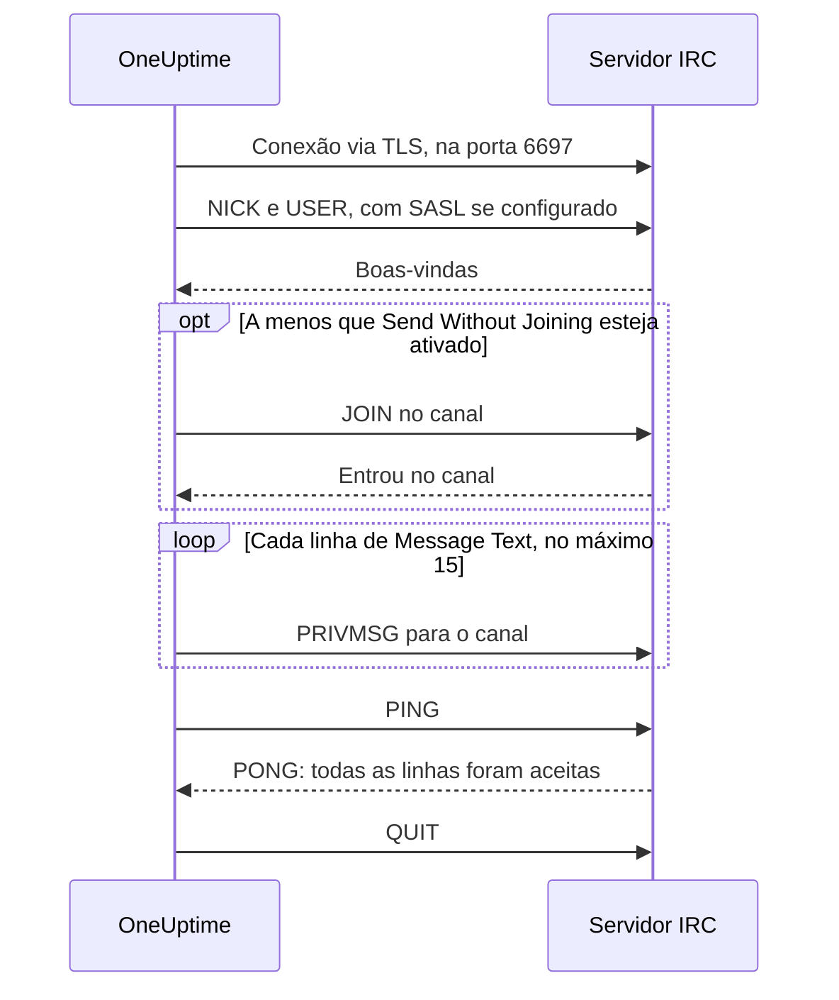

# Integração com o IRC

Publique atualizações de incidentes em um canal de qualquer rede IRC: Libera.Chat, OFTC ou um servidor próprio.

O IRC não tem webhooks, então a etapa de workflow **Send Message to IRC** do OneUptime se conecta ela mesma ao servidor, como qualquer cliente IRC. Não há nada para instalar nem app para registrar. Esta integração é de **saída**: o OneUptime publica no canal e não lê o que é dito nele.

:::cards
- [Como funciona](#como-funciona): O que uma execução da etapa diz ao servidor.
- [Configuração](#configurar-a-integração): Servidor e canal, senhas e depois o workflow: pelo modelo ou do zero.
- [Dicas](#dicas): Publicar sem entrar, SASL, mensagens longas e rajadas.
- [Solução de problemas](#solução-de-problemas): O que os erros da etapa significam e o que mudar.
:::

## Como funciona

Cada execução da etapa mantém uma conversa curta com o servidor IRC, como um cliente IRC faria, e depois desliga.

1. **Conectar.** A etapa se conecta via TLS na porta `6697` e verifica o certificado do servidor.
2. **Registrar-se.** Ela se registra como `OneUptime`, a menos que você defina outro **Nickname**, e entra com SASL quando **SASL Username** e **SASL Password** estão preenchidos.
3. **Entrar.** Ela entra no canal, a menos que **Send Without Joining** esteja ativado, com a **Channel Key** se o canal tiver uma.
4. **Enviar.** Cada linha de **Message Text** sai como uma mensagem IRC própria, um `PRIVMSG`.
5. **Confirmar.** O IRC nunca diz "entregue", então a etapa envia um `PING` e espera o `PONG` do servidor. Um servidor responde em ordem, então até lá qualquer recusa da mensagem já chegou.
6. **Sair.** Ela sai do servidor.

A etapa segue pela saída **Sucesso** assim que o servidor aceita todas as linhas. Ela segue por **Erro**, com o motivo nas palavras do próprio servidor quando ele as deu, quando o servidor não pode ser alcançado ou recusa a conexão, o apelido, uma senha, o canal ou a mensagem.

## Antes de começar

- No OneUptime Cloud, o plano **Growth** ou um superior: os workflows e suas variáveis fazem parte dele. Instalações auto-hospedadas sem cobrança não têm limites de plano.
- Uma função que cria workflows: **Project Owner**, **Project Admin** ou **Workflow Admin**.
- Uma conta na rede IRC, se ela pedir que você entre. A Libera.Chat pede isso para conexões vindas de alguns endereços de nuvem e de VPN.

## Configurar a integração

:::steps
### Escolher um servidor e um canal

Decida para onde as mensagens vão: o nome de host do servidor, por exemplo `irc.libera.chat`, e o canal, por exemplo `#your-channel`.

- **IRC Server** aceita o nome de host e nada mais: sem `ircs://` e sem porta. A etapa se conecta via TLS na porta `6697`. Se o seu servidor aceita TLS em outra porta, coloque-a em **Port**, em **Mais campos**.
- **Channel** precisa ser um canal. Um apelido digitado ali é recusado, então a etapa nunca manda uma mensagem privada a alguém por engano.

O servidor precisa ser um ao qual o OneUptime possa se conectar. Endereços de loopback (`localhost`, `127.0.0.1`), link-local e de metadados de nuvem são sempre recusados. No OneUptime Cloud, um servidor em um endereço de rede privada também é recusado. Uma instalação auto-hospedada pode alcançar um servidor IRC da própria rede, a menos que `DATA_SOURCE_BLOCK_PRIVATE_ADDRESSES` esteja definido como `true`.

### Guardar as senhas como variáveis secretas

Pule esta etapa se o seu servidor, a sua rede e o seu canal não precisam de senha. Caso contrário, guarde cada senha como uma [variável global](/docs/workflows/variables#variáveis-globais) secreta. Assim o workflow guarda o nome da variável em vez da senha, e você troca a senha em um só lugar.

| Configuração        | Preencha quando                                                                    | Variável, por exemplo |
| ------------------- | ---------------------------------------------------------------------------------- | --------------------- |
| **Server Password** | O servidor ou o seu bouncer pede uma senha ao conectar.                            | `IRC_SERVER_PASSWORD` |
| **SASL Password**   | A rede quer que você entre na sua conta. **SASL Username** recebe o nome da conta. | `IRC_SASL_PASSWORD`   |
| **Channel Key**     | O canal tem uma chave (modo `+k`).                                                 | `IRC_CHANNEL_KEY`     |

Para guardar uma, abra **Fluxos de trabalho → Variáveis globais** e clique em **Criar: Fluxo de trabalho Variável**. Digite o nome em **Nome** e clique em **Próximo**. Cole a senha em **Conteúdo**, ative **Segredo** e clique em **Criar: Fluxo de trabalho Variável**. Os logs de execução mostram `[REDACTED]` no lugar do valor de uma variável secreta.

### Criar o workflow

Comece pelo modelo, que cria o workflow inteiro para você, ou do zero.

:::tabs
@tab Pelo modelo
1. Abra **Fluxos de trabalho** e clique em **Criar fluxo de trabalho**.
2. Digite `IRC` em **Pesquisar modelos…**, clique em **Tell IRC when an incident opens** e depois em **Usar este modelo**.
3. Mantenha o nome **Notify IRC on new incident** ou mude-o, e clique em **Próximo**.
4. Informe **IRC Server** e **IRC Channel** e clique em **Criar fluxo de trabalho**.

O workflow abre no **Construtor** com três etapas: **On Create Incident**; **Send Message to IRC**, que publica o número, o título, a gravidade e o estado do incidente em duas linhas; e uma etapa **Registro** na sua saída **Erro**, que registra por que uma mensagem não foi entregue. O servidor e o canal são guardados como as variáveis `ircServer` e `ircChannel` do workflow. Se você guardou senhas na etapa anterior, clique em **Send Message to IRC**, abra **Mais campos** e escolha cada variável com o botão **{ }** da configuração.
@tab Do zero
1. Abra **Fluxos de trabalho**, clique em **Criar fluxo de trabalho**, escolha **Começar do zero**, dê um nome ao workflow e clique em **Criar fluxo de trabalho**.
2. No **Construtor**, clique em **Choose what starts this workflow** e escolha **On Create Incident** em **Popular**. Clique no gatilho e, em **Select Fields**, escolha os campos do incidente que a sua mensagem mostra, por exemplo o título.
3. Clique em **Adicionar componente**, pesquise `irc` e clique em **Send Message to IRC**. Ligue a saída **Sucesso** do gatilho a esta etapa.
4. Clique na nova etapa e preencha **IRC Server**, **Channel** e **Message Text**. O botão **{ }** de **Message Text** insere campos do incidente, por exemplo o título.
5. Se você guardou senhas na etapa anterior, abra **Mais campos**. Em **Server Password**, **SASL Password** ou **Channel Key**, clique em **{ }** e escolha a variável em **Global variables**. Coloque o nome da sua conta em **SASL Username**.
:::

### Ativar e testar

Ligue a chave **Habilitado** no topo do **Construtor**. A partir daí, cada novo incidente é publicado no canal.

Para testar sem abrir um incidente, clique em **Executar fluxo de trabalho** e coloque o ID de um incidente que você já tem em **ID do incidente**. A página do incidente mostra o ID dele. Clique em **Run Workflow Manually** e confirme com **Run**. O painel **Execução do Fluxo de Trabalho** acompanha a execução: o log da etapa de IRC diz quantas linhas ela enviou, por exemplo `Sent 2 lines to #your-channel.`, e a mensagem aparece no canal. Se a etapa seguir por **Erro**, o log dela diz por quê: veja [Solução de problemas](#solução-de-problemas).
:::

## Dicas

- **Publicar sem entrar.** A maioria dos canais só aceita mensagens dos próprios membros (modo `+n`), então a etapa entra antes de publicar e sai logo depois. Um canal em `-n` aceita mensagens de fora: ative **Send Without Joining** em **Mais campos**, e o canal não vê a etapa entrar e sair.
- **Entrar com SASL.** Em redes que usam SASL, como a Libera.Chat, preencha **SASL Username** e **SASL Password** para entrar na sua conta. A Libera.Chat exige isso para conexões vindas de alguns endereços de nuvem e de VPN. Veja [o guia de SASL da Libera.Chat](https://libera.chat/guides/sasl).
- **Respeite o limite de 15 linhas.** Cada linha de **Message Text** é uma mensagem IRC própria, uma linha longa é dividida para caber e linhas em branco são ignoradas. Uma mensagem é enviada como no máximo 15 linhas IRC: uma mais longa é cortada, e a última linha avisa isso. As quatro primeiras linhas saem de uma vez e o resto uma por segundo, o ritmo dos clientes IRC, então 15 linhas levam cerca de 11 segundos.
- **Junte rajadas em uma só mensagem.** Cada execução é uma conexão própria, e as redes IRC limitam com que frequência um mesmo endereço pode se conectar. Uma rajada de execuções pode ser recusada com um motivo como `Reconnecting too fast`, e segue por **Erro** como qualquer outra recusa. Para um workflow que pode disparar muitas vezes por minuto, junte o que ele tem a dizer em uma só mensagem ou envie por um servidor próprio.
- **Formate com os códigos do IRC.** O IRC não tem Markdown, então o texto é enviado como foi digitado. Os códigos de formatação do IRC, como negrito e cores, funcionam.
- **Um servidor sem TLS.** Ative **Disable TLS** apenas para um servidor que não oferece TLS: a etapa então se conecta na porta `6667`, e qualquer senha é enviada sem criptografia. Para confiar no certificado de um servidor emitido pela sua própria autoridade certificadora, uma instalação auto-hospedada define `NODE_EXTRA_CA_CERTS` em vez disso.
- **Outro apelido.** As mensagens vêm de `OneUptime`, a menos que você defina **Nickname**. Se o apelido estiver em uso, a etapa acrescenta um sublinhado ou um número.

## Solução de problemas

Quando a etapa segue por **Erro**, o log da execução diz por quê, em uma frase que começa como uma destas.

:::details "The IRC server refused the connection"
O servidor, ou o seu bouncer, recusou a conexão, e a mensagem termina com o motivo. Quando o servidor quer uma senha, a mensagem diz isso: preencha **Server Password** ou confira-a.
:::

:::details "SASL sign-in failed"
A rede recusou a conta ou a senha. Confira **SASL Username** e **SASL Password**.
:::

:::details "Could not join #your-channel"
O canal recusou a etapa, pelo motivo que a mensagem informa. Um canal com chave precisa dela em **Channel Key**.
:::

:::details "Could not send to #your-channel"
O servidor recusou a mensagem, pelo motivo que a mensagem de erro informa. Com **Send Without Joining** ativado, o canal pode aceitar mensagens só dos próprios membros: desative-o.
:::

:::details "The TLS certificate of the IRC server … is not trusted"
O certificado do servidor não é um em que o OneUptime confie. Uma instalação auto-hospedada pode confiar na própria autoridade certificadora com `NODE_EXTRA_CA_CERTS`. Ative **Disable TLS** apenas para um servidor que não oferece TLS.
:::

## Próximos passos

:::cards
- [Componentes → IRC](/docs/workflows/components#irc): Cada configuração da etapa e o que as saídas dela significam.
- [Variáveis](/docs/workflows/variables#variáveis-globais): As variáveis globais secretas e como as etapas as usam.
- [Execuções](/docs/workflows/runs-and-logs): Leia o que cada execução do workflow fez.
- [Visão geral das integrações](/docs/integrations/index): O padrão de saída e as outras ferramentas que você pode conectar.
:::
