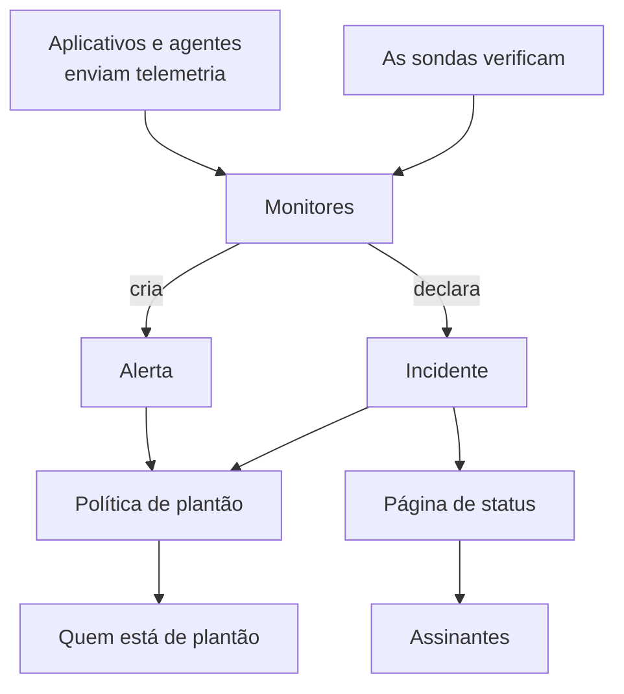

# Conceitos básicos

O OneUptime tem muitos produtos, mas eles se apoiam em um punhado de ideias: projetos, monitores, incidentes e alertas, plantão, páginas de status e telemetria. Esta página explica cada uma em poucas frases, mostra como se conectam e leva às páginas que tratam de cada uma em detalhe. Leia-a uma vez, e todas as outras páginas da documentação ficam mais fáceis de ler.

:::cards
- [Projetos e pessoas](#projetos-e-pessoas): Onde tudo fica, e quem pode fazer o quê.
- [Monitores e sondas](#monitores-e-sondas): Como o OneUptime percebe que algo está errado.
- [Incidentes e alertas](#incidentes-e-alertas): O registro com o qual sua equipe trabalha.
- [Plantão](#plantão): Quem é acionado, como, e quem vem a seguir.
:::

## Como as peças se conectam

Um problema percorre o OneUptime em uma só direção. As sondas e a sua própria telemetria alimentam os monitores. Os critérios de um monitor decidem quando algo está errado e o que abrir: um incidente, um alerta ou os dois. As políticas de plantão acionam as pessoas, e as páginas de status informam seus clientes sobre os incidentes.

## Projetos e pessoas

Um **projeto** contém tudo: monitores, incidentes, políticas de plantão, páginas de status, telemetria e configurações. A maioria das empresas precisa de um, e algumas mantêm um por ambiente ou unidade de negócio. Nada do que você cria em um projeto aparece em outro.

Sua **conta** é separada dos seus projetos. Uma conta, com um e-mail e uma senha, pode pertencer a quantos projetos você quiser; troque entre eles com o seletor de projetos no canto superior esquerdo. Veja [Sua conta](/docs/introduction/your-account).

As pessoas fazem parte de um projeto por meio de **equipes**, e as permissões de uma equipe decidem o que seus membros podem fazer. Todo projeto novo começa com três equipes: Owners, com você dentro, Admin e Members. No OneUptime Cloud, cada projeto tem o próprio plano.

:::cards
- [Usuários, equipes e permissões](/docs/permissions/index): Convidar pessoas e decidir o que elas podem fazer.
:::

## Monitores e sondas

Um **monitor** verifica algo que você executa e decide se está funcionando. A maioria dos monitores é verificada por **sondas**: máquinas que executam a verificação em uma programação, como pedir uma página, chamar uma API, fazer ping em um host ou consultar um banco de dados. O OneUptime Cloud executa sondas em várias regiões, uma instalação auto-hospedada executa as suas, e você pode adicionar sondas personalizadas dentro da sua rede. Outros monitores leem o que você envia: a telemetria dos seus aplicativos, ou os dados que um agente relata a partir dos seus servidores, clusters Kubernetes e do resto da infraestrutura.

Os **critérios** de um monitor decidem o que cada resultado significa. Eles são avaliados em ordem, e o primeiro que corresponde pode mudar o status do monitor, declarar um incidente, criar um alerta ou as três coisas. Todo projeto novo tem três status de monitor: **Operacional**, **Degradado** e **Offline**.

:::cards
- [Criar um monitor](/docs/monitor/create-monitor): Escolher um tipo, dizer o que verificar e com que frequência.
- [Sondas personalizadas](/docs/probe/custom-probe): Verificar o que só a sua própria rede alcança.
:::

## Incidentes e alertas

Os dois registram um problema, e os dois podem acionar quem está de plantão. O que os diferencia é quem o problema afeta.

| | Incidente | Alerta |
| --- | --- | --- |
| **O que é** | Um problema que afeta seus usuários, como uma queda ou uma lentidão | Um problema que sua equipe deve investigar antes que os usuários sejam afetados |
| **Nas páginas de status** | Pode aparecer, e avisa os assinantes | Nunca |
| **Estados iniciais** | **Identified**, **Confirmado**, **Resolvido** | **Identified**, **Confirmado**, **Resolvido** |
| **Severidades iniciais** | Critical Incident, Major Incident, Minor Incident | **High**, **Low** |

Confirmar indica que alguém está cuidando, e impede que as políticas de plantão acionem o próximo nível. Resolver encerra. Você pode adicionar seus próprios estados e severidades, e vincular alertas ao incidente do qual eles acabaram fazendo parte.

Um **episódio** agrupa incidentes relacionados, ou alertas relacionados, para que sua equipe trabalhe neles como um só. Regras de agrupamento decidem o que fica junto.

:::cards
- [Visão geral dos incidentes](/docs/incidents/index): Como os incidentes são declarados, tratados e resolvidos.
- [Alertas vinculados](/docs/incidents/linked-alerts): Vincular ao incidente os alertas gerados por uma queda.
:::

## Plantão

Uma **política de plantão** decide quem é acionado sobre um incidente ou alerta, e quem vem a seguir se ninguém responder. Suas **regras de escalonamento** são seus níveis: cada uma aciona suas pessoas e espera alguém confirmar antes de acionar o próximo nível. Um nível pode acionar pessoas, equipes ou uma **escala de plantão**, um rodízio que sabe a cada momento quem está de plantão.

Como cada pessoa é contatada é ela quem decide. Em **Configurações do usuário**, cada um guarda as formas pelas quais o OneUptime pode contatá-lo, como e-mail, SMS, chamadas, notificações push, Slack ou Microsoft Teams, e quais usar quando for acionado.

:::cards
- [Regras de escalonamento](/docs/on-call/escalation-rules): Acionar pessoas nível a nível até alguém responder.
- [Agendamentos de plantão](/docs/on-call/schedules): Rodízios, camadas e passagens de turno.
:::

## Páginas de status e manutenção

Uma **página de status** mostra aos seus clientes se seus serviços funcionam. Você escolhe quais monitores ela mostra, com nomes que seus clientes entendem. Enquanto um incidente em um desses monitores está ativo, a página o mostra, e seus **assinantes** são avisados por e-mail, SMS, Slack, Microsoft Teams ou webhook. Uma página de status pode ser pública, ou privada para as pessoas que você deixar entrar.

A **manutenção programada** anuncia com antecedência um trabalho planejado. Um evento passa por **Agendado**, **Em andamento**, **Encerrado** e **Concluído**, e as páginas de status em que você o mostra informam visitantes e assinantes.

:::cards
- [Visão geral das páginas de status](/docs/status-pages/index): Criar uma página de status e decidir o que ela mostra.
- [Assinantes e comunicados](/docs/status-pages/subscribers): Quem é avisado, e quando.
:::

## Telemetria

**Telemetria** é o que seus sistemas enviam ao OneUptime: logs, métricas, traces, exceções e perfis. Os aplicativos a enviam com OpenTelemetry, e os agentes do OneUptime a enviam a partir de hosts, clusters Kubernetes, hosts Docker e do resto da infraestrutura. Todo remetente usa uma **chave de ingestão**, criada em **Configurações do projeto → Telemetria e APM → Chaves de ingestão**. Você pesquisa a telemetria, a exibe em painéis e a acompanha com monitores de telemetria, que abrem incidentes e alertas como qualquer outro monitor.

:::cards
- [OpenTelemetry](/docs/telemetry/open-telemetry): Enviar logs, métricas e traces dos seus aplicativos.
- [Monitor de logs](/docs/monitor/logs-monitor): Saber quando um padrão aparece nos seus logs.
:::

## Automação e IA

- Os **Fluxos de trabalho** executam ações quando algo acontece, como publicar no Slack quando um incidente é declarado.
- Os **Runbooks** transformam um procedimento de resposta em passos que sua equipe pode executar, manualmente ou automaticamente.
- A **OneUptime AI** investiga novos incidentes e alertas e publica o que encontrou na linha do tempo deles, e **Ask AI** responde perguntas sobre o seu projeto. Um projeto novo começa com a IA ligada; o interruptor **Habilitar IA** em **Configurações do projeto → IA → AI Features** desliga tudo isso.

:::cards
- [Visão geral dos workflows](/docs/workflows/index): Automatizar ações com gatilhos e componentes.
- [AI SRE](/docs/ai/ai-sre): Como a OneUptime AI investiga incidentes e alertas.
:::

## Rótulos e proprietários

**Rótulos** são etiquetas que você coloca em monitores, incidentes, páginas de status e na maioria dos outros recursos, para filtrá-los e agrupá-los. As permissões de uma equipe podem ser limitadas aos recursos com certos rótulos. **Proprietários** são as pessoas e equipes responsáveis por um recurso: elas são avisadas quando algo acontece com ele. Regras de rótulos e de proprietários adicionam rótulos e proprietários aos recursos novos para você.

:::cards
- [Regras de rótulos e proprietários](/docs/configuration/label-and-owner-rules): Rotular recursos novos e dar proprietários a eles automaticamente.
:::

## Próximos passos

:::cards
- [Início rápido](/docs/introduction/quickstart): Colocar essas ideias em prática em quinze minutos.
- [Página inicial e atalhos](/docs/introduction/home): Encontrar cada produto no painel.
- [Criar um monitor](/docs/monitor/create-monitor): Seu primeiro monitor, campo a campo.
- [Visão geral dos incidentes](/docs/incidents/index): O que acontece depois que um monitor declara um incidente.
:::
