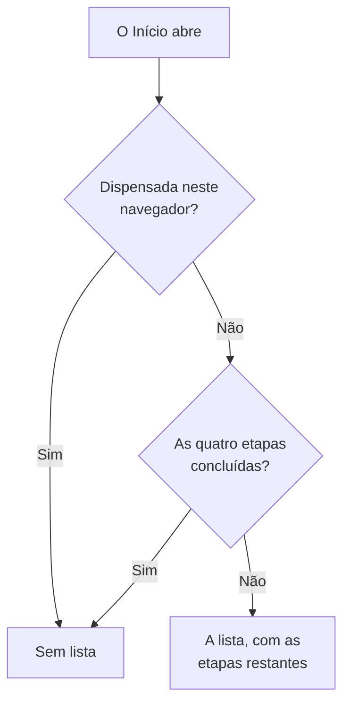

# Página inicial e atalhos

O Início é a primeira página que você vê em um projeto. Ele mostra num relance se algo precisa de você agora, e guia um projeto novo pela primeira configuração. Esta página explica o que o Início mostra, como encontrar qualquer produto, página ou ação no painel, e os atalhos de teclado que poupam idas e vindas pelos menus.

:::cards
- [O que o Início mostra](#o-que-o-início-mostra): A lista de boas-vindas, os cinco blocos e os incidentes ativos.
- [Encontrar o caminho](#encontrar-o-caminho): O menu Produtos e as barras no topo de cada página.
- [Pesquisar](#pesquisar-uma-página-uma-configuração-ou-uma-ação): Encontrar qualquer página, configuração ou ação digitando o nome.
- [Atalhos de teclado](#atalhos-de-teclado): Ir ao Início, aos Monitores ou aos Incidentes com duas teclas.
:::

## O que o Início mostra

Abra **Início** na barra do topo, ou pressione `g` e depois `h` de qualquer lugar. De cima para baixo, o Início mostra:

1. **Boas-vindas ao OneUptime 👋**, uma lista para um projeto novo, até que esteja concluída.
2. Cinco blocos que contam o que precisa de atenção.
3. **Incidentes ativos**, todos os incidentes ainda não resolvidos.

### A lista de boas-vindas

A lista guia você pelas quatro coisas de que um projeto precisa para ser útil. Cada etapa abre a página onde você a realiza, e se marca sozinha quando o projeto tem o que ela pede.

| Etapa | Concluída quando | Abre |
| --- | --- | --- |
| **Crie seu primeiro monitor** | O projeto tem um monitor. | O formulário **Criar monitor**, ou a lista **Monitores** para quem não pode criar monitores. |
| **Publique uma página de status** | O projeto tem uma página de status. | **Páginas de status** |
| **Convide sua equipe** | Alguém além de você está no projeto, ou foi convidado. | **Usuários** |
| **Configure uma política de plantão** | O projeto tem uma política de plantão. | **Plantão** |

Abaixo das etapas, **Como o OneUptime funciona** mostra os quatro produtos principais na ordem em que um problema passa por eles: **Monitores**, **Incidentes e alertas**, **Plantão** e **Páginas de status**. Clique em um para abri-lo.

A lista some quando as quatro etapas estão concluídas. Para escondê-la antes, clique em **Dispensar**. A dispensa vale para este navegador e este projeto; tudo o que as etapas abrem continua no menu **Produtos**.

### Os blocos

Cada bloco conta algo, diz se isso precisa de você e abre a lista por trás do número.

| Bloco | O que conta | Quando o número é zero |
| --- | --- | --- |
| **Incidentes ativos** | Incidentes não resolvidos | **Tudo certo** |
| **Alertas ativos** | Alertas não resolvidos | **Tudo certo** |
| **Monitores não operacionais** | Monitores cujo status não é operacional. Monitores arquivados não entram. | **Todos operacionais** |
| **Manutenção em andamento** | Eventos de manutenção programada em andamento | **Nenhuma em andamento** |
| **SLOs em risco** | SLOs ativados que estão em risco ou esgotaram o orçamento de erro | **Orçamentos saudáveis** |

Um número acima de zero mostra **Requer atenção**, ou **Em andamento** e **Orçamento se esgotando** nos blocos de manutenção e de SLO. Um projeto sem monitores vê **Nenhum monitor ainda** no bloco de monitores, e um sem SLOs vê **Nenhum SLO ainda**: um projeto vazio não é o mesmo que um projeto saudável. Esses dois blocos abrem então as listas **Monitores** e **SLOs**, onde você cria um.

### O menu lateral do Início

O menu lateral do Início tem as mesmas listas, cada uma com uma contagem:

| Seção | Páginas |
| --- | --- |
| **Incidentes** | **Incidentes ativos** e **Episódios ativos** |
| **Alertas** | **Alertas ativos** e **Episódios ativos** |
| **Monitores** | **Não operacional** |
| **Eventos programados** | **Em andamento** |

Um episódio agrupa incidentes ou alertas relacionados para você tratá-los como um só. Veja [Conceitos básicos](/docs/introduction/core-concepts#incidentes-e-alertas).

## Encontrar o caminho

Tudo no OneUptime fica em **Produtos**, na barra do topo. O menu lista seus grupos como as linhas de uma única lista, e sempre abre com o primeiro deles, os essenciais, expandido: Monitores, Incidentes, Alertas, Plantão, Páginas de status, Manutenção programada e SLOs. Cada um dos outros grupos (Observabilidade, AI, Código, Recursos, Infraestrutura, Painéis e automação e Configurações) fica recolhido em uma linha da mesma lista. Cada linha nomeia os produtos do grupo e diz quantos são. Clique em uma linha para expandi-la ou recolhê-la, ou chegue até ela com as setas e pressione **Enter**.

- **A pesquisa encontra tudo.** Digite na caixa de pesquisa do menu para encontrar qualquer produto pelo nome, pelo que ele faz ou por uma palavra conhecida como `k8s` ou `RUM`. A pesquisa procura também dentro dos grupos recolhidos.
- **Você começa onde está.** O grupo da página em que você está se expande sozinho, e os produtos que você abriu recentemente aparecem no topo.
- **Suas escolhas ficam.** O menu lembra, no seu navegador, quais dos outros grupos você expandiu ou recolheu. Os essenciais voltam a ficar expandidos cada vez que você abre o menu, mesmo que você os tenha recolhido.
- **No celular**, o botão do menu lista os produtos do mesmo jeito: os essenciais expandidos no topo, e cada um dos outros grupos como uma linha que abre com um toque.

### As barras do topo

Duas barras atravessam o topo de cada página.

| Onde | O que há |
| --- | --- |
| Canto superior esquerdo | O seletor de projetos: trocar para outro dos seus projetos, ou criar um novo. |
| Canto superior direito | **Pesquisar** e **Ask AI**, o sino de notificações com o que precisa de você agora (incidentes e alertas ativos, as políticas de plantão em que você está de turno, convites pendentes), **Ajuda**, e sua foto, que abre o menu da sua [conta](/docs/introduction/your-account). |
| Abaixo delas | **Início** e **Produtos** à esquerda, **Configurações do usuário** à direita: como o OneUptime contata você neste projeto. |

**Ajuda** abre esta documentação (**Documentação**) e a lista **Keyboard shortcuts**, e oferece suporte por e-mail e no Slack. Em uma tela estreita, como a de um celular, **Pesquisar**, **Ask AI** e **Ajuda** saem para ganhar espaço; o sino e sua foto ficam.

## Pesquisar uma página, uma configuração ou uma ação

Pressione **Cmd+K** (Mac) ou **Ctrl+K** (Windows e Linux), ou clique no ícone de pesquisa na barra do topo, e comece a digitar. A pesquisa encontra:

- **Todas as páginas dos menus**, pelo nome que o menu dá a elas: Chaves de API, Zona de perigo, Agendamentos de plantão, Severidade do incidente, seus próprios Métodos de notificação. Cada resultado diz onde fica, por exemplo *Configurações do projeto › Avançado*, para que páginas com o mesmo nome (Campos personalizados em Incidentes, Alertas e Monitores) sejam fáceis de distinguir.
- **Ações**, pelo que você quer fazer: Declarar incidente, Criar monitor ou Delete Project, que abre a Zona de perigo. Uma ação que muda algo só é oferecida a quem tem permissão para fazê-la.
- **Seus monitores, incidentes, alertas, páginas de status e políticas de plantão**, pelo nome.

A pesquisa lê o que você digita do jeito que você quer dizer:

- Maiúsculas, acentos, espaços e hífens não importam: *on-call*, *on call* e *oncall* encontram as mesmas páginas, e as palavras podem vir em qualquer ordem.
- Ela conhece outras palavras para muitas páginas, em inglês: *pager* ou *escalation* para Políticas de plantão, *rota* para Agendamentos de plantão, *2fa* para a autenticação em dois fatores, *delete project* para a Zona de perigo.
- Acrescente o nome do produto para restringir uma pesquisa: *incident custom fields* encontra a página Campos personalizados de Incidentes.
- Um pequeno erro de digitação, como *incidnet*, ainda encontra o que você queria quando nada corresponde do jeito que foi digitado.

Com a caixa de pesquisa vazia, a pesquisa lista as páginas que você abriu recentemente, as ações e os produtos.

## Atalhos de teclado

Pressione `?` em qualquer lugar do painel para ver todos os atalhos, ou abra **Ajuda** e escolha **Keyboard shortcuts**. No Mac, `Mod` é a tecla Command; no Windows e no Linux, é Ctrl.

| Teclas | O que fazem |
| --- | --- |
| `Mod` + `K` | Abrir a paleta de comandos: pesquisar qualquer página, configuração ou ação. |
| `Mod` + `I` | Perguntar à IA sobre o que você está vendo. |
| `/` | Pesquisar na lista desta página. |
| `?` | Mostrar os atalhos de teclado. |
| `Esc` | Fechar uma caixa de diálogo ou um painel. |

### Ir a um produto

Pressione `g` e depois uma letra para ir direto a um produto. Pressione a letra em até um segundo e meio depois de `g`.

| Teclas | Vai para |
| --- | --- |
| `g` depois `h` | Início |
| `g` depois `m` | Monitores |
| `g` depois `i` | Incidentes |
| `g` depois `a` | Alertas |
| `g` depois `o` | Plantão |
| `g` depois `s` | Páginas de status |
| `g` depois `e` | Manutenção programada |
| `g` depois `d` | Painéis |
| `g` depois `l` | Registros |
| `g` depois `t` | Traços |

Os atalhos não atrapalham. `?`, `/` e `g` não fazem nada enquanto você digita em um campo, e nada tira você da página enquanto uma caixa de diálogo está aberta, então uma tecla sem querer não faz você perder um formulário preenchido pela metade. Qualquer outro produto está a uma pesquisa de distância com `Mod` + `K`.

## Próximos passos

:::cards
- [Início rápido](/docs/introduction/quickstart): Seguir a lista de boas-vindas, etapa por etapa.
- [Sua conta](/docs/introduction/your-account): Seu perfil, a segurança do seu login, o idioma e o tema.
- [Pergunte à IA](/docs/ai/ask-ai): O que a IA pode responder e fazer por você.
- [Conceitos básicos](/docs/introduction/core-concepts): O que são monitores, incidentes, alertas e plantão.
:::
