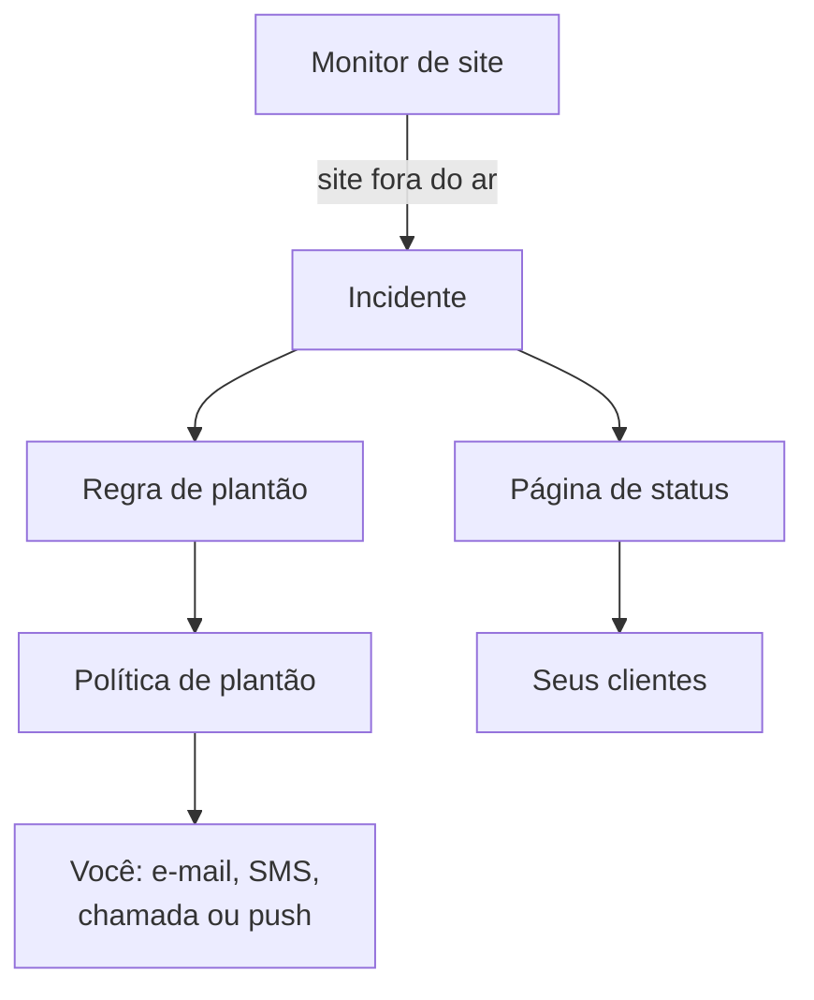

# Início rápido

Este guia leva você de uma conta nova a uma configuração funcionando em cerca de quinze minutos: um monitor que verifica seu site a cada cinco minutos, uma política de plantão que aciona você quando o site cai e uma página de status que informa seus clientes. Ele segue a lista **Boas-vindas ao OneUptime 👋** na página inicial do seu projeto.

## Antes de começar

- **Uma conta.** No OneUptime Cloud, cadastre-se em [oneuptime.com](https://oneuptime.com/accounts/register) e abra o link do e-mail que você receber. Na sua própria instalação, abra-a no navegador e cadastre-se: a primeira conta se torna o administrador principal. Para instalar uma, veja [Docker Compose](/docs/installation/docker-compose).
- **Um site para monitorar.** Qualquer endereço que responda por HTTP ou HTTPS, como a página inicial da sua empresa.

## Criar um projeto

No OneUptime, tudo fica em um projeto: seus monitores, incidentes, políticas de plantão, páginas de status e as pessoas que trabalham neles.

:::steps
### Começar um projeto novo

Na primeira vez que você entra, o OneUptime mostra **Nenhum projeto**. Clique em **Criar Novo Projeto**. Se alguém já convidou você para um projeto, aceite o convite na mesma página.

### Dar um nome

Digite um **Nome do projeto**, por exemplo o nome da sua empresa. No OneUptime Cloud, a etapa seguinte pede que você escolha um plano.

### Criar o projeto

Clique em **Criar projeto**. A página inicial do seu projeto abre, com a lista **Boas-vindas ao OneUptime 👋** no topo.
:::

## Monitorar seu site

:::steps
### Abrir a criação de monitor

Na lista, clique em **Crie seu primeiro monitor**. Você também pode abrir **Monitores** no menu **Produtos** e clicar em **Criar monitor**.

### Escolher Site

Em **Tipo de monitor**, escolha **Site**. Digite um **Nome**, por exemplo `Website`, e clique em **Próximo**.

### Digitar o endereço

Digite o endereço completo do seu site em **URL do site**, por exemplo `https://example.com`. O OneUptime adiciona os critérios para você: o monitor fica **Offline** e declara um incidente quando o site não responde, ou responde com um erro. Clique em **Próximo**.

### Criar o monitor

Mantenha as **Sondas** selecionadas e o **Intervalo de monitoramento** de **A cada 5 minutos**, e clique em **Criar monitor**. A página do monitor abre, e as sondas começam a verificar seu site.
:::

Para testar a verificação antes de salvar, clique em **Testar monitor** na segunda etapa. Todos os outros tipos de monitor estão descritos em [Criar um monitor](/docs/monitor/create-monitor).

## Ser acionado quando cair

Do jeito que está, um incidente sem proprietários é enviado por e-mail aos proprietários do projeto, e isso inclui você. Para ser acionado até que alguém responda, crie uma política de plantão e faça com que cada incidente a acione.

:::steps
### Criar uma política de plantão

Na lista, clique em **Configure uma política de plantão**, ou abra **Plantão** no menu **Produtos**. Clique em **Criar: Política de plantão** e digite um **Nome**. Em **Quem é acionado primeiro?**, clique em **Adicionar destinatário** e escolha você. Clique em **Criar: Política de plantão**.

### Acioná-la em cada incidente

Abra **Incidentes** no menu **Produtos**, expanda **Regras** no menu lateral e escolha **Regras de Plantão**. Clique em **Criar: Incident On-Call Rule**, digite um **Nome** e clique em **Próximo**. Deixe **Critérios de Correspondência** vazio, para que a regra valha para todos os incidentes, e clique em **Próximo**. Escolha sua política em **Políticas de plantão** e clique em **Criar: Incident On-Call Rule**.

### Escolher como você é contatado

Seu e-mail de login já é uma forma de contatar você. Para receber também SMS ou chamadas, abra **Configurações do usuário** na barra abaixo da barra superior, vá em **Métodos de notificação** e, na aba **Direct Contact**, adicione seu número em **Números de telefone para notificações SMS** ou **Números de telefone para notificações por chamada**. Clique em **Verificar** e digite o código que o OneUptime enviar. Um número verificado passa a ser usado nos acionamentos de plantão na hora.
:::

> [!NOTE]
> SMS e chamadas telefônicas ficam desativados em um projeto novo. Um proprietário do projeto, um Billing Admin ou alguém com Manage Billing os ativa no cartão **Canais de notificação**, em **Configurações do projeto → Notificações → Configurações de notificação**.

Para mais níveis, rodízios e quanto tempo cada nível espera, veja [Regras de escalonamento](/docs/on-call/escalation-rules) e [Agendamentos de plantão](/docs/on-call/schedules).

## Publicar uma página de status

:::steps
### Criar a página de status

Na lista, clique em **Publique uma página de status**, ou abra **Páginas de status** no menu **Produtos**. Clique em **Criar página de status**, digite um **Nome**, por exemplo `Acme Status`, e clique em **Criar página de status**.

### Adicionar seu monitor

Abra a nova página de status. No menu lateral dela, em **Recursos**, escolha **Monitores**; em projetos com grupos de monitores ativados, o item se chama **Recursos**. Clique em **Adicionar monitor**, escolha o monitor do seu site e clique em **Adicionar monitor**. A linha mostra aos visitantes o nome do monitor; mude-o em **Nome de exibição**, se quiser.

### Abrir a página

Escolha **Visão geral** no menu lateral. O cartão **Status Page Preview URL** leva à sua página de status: abra-a, e seu site aparece como operacional.
:::

Uma página de status nova é pública: qualquer pessoa com o endereço pode abri-la. Para dar a ela seu próprio domínio, seu logotipo e suas cores, veja [Marca e domínios da página de status](/docs/status-pages/branding-and-domains).

## Convidar sua equipe

Na lista, clique em **Convide sua equipe**, ou abra **Usuários** no menu **Produtos**, em **Configurações**. Clique em **Convidar Usuário**, digite o **E-mail** da pessoa e escolha uma **Equipe**: a equipe de membros vem escolhida. Clique em **Convidar**. O OneUptime envia o convite por e-mail, e a equipe decide o que a pessoa pode fazer. Veja [Usuários, equipes e permissões](/docs/permissions/index).

## Testar

Declare um incidente de teste para ver toda a cadeia funcionando.

:::steps
### Declarar um incidente de teste

Abra **Incidentes** e clique em **Declarar incidente**. Digite um **Título**, por exemplo `Test incident`, escolha uma **Severidade do incidente** e clique em **Próximo**. Em **Monitores**, escolha o monitor do seu site, para que o incidente apareça na sua página de status. Clique em **Próximo** até chegar ao resumo e depois em **Declarar incidente**.

### Ver o que acontece

Em um ou dois minutos, sua política de plantão aciona você, e o incidente aparece na sua página de status.

### Resolver

Na página do incidente, clique em **Resolver**. Os acionamentos param, e o incidente sai da sua página de status.
:::

> [!WARNING]
> Qualquer pessoa que abrir sua página de status verá o incidente de teste até você resolvê-lo. Faça o teste antes de compartilhar o endereço da página.

## Solução de problemas

:::details Não fui acionado
Abra o incidente e escolha **Execuções de plantão** no menu lateral dele: ali você vê se sua política foi executada e quem ela acionou. Se não foi executada, verifique se sua regra de plantão está ativada e indica a política. Se foi executada, verifique se seus métodos em **Configurações do usuário → Métodos de notificação** estão verificados.
:::

:::details O incidente não aparece na minha página de status
Uma página de status mostra um incidente quando um dos monitores do incidente está na página. Verifique se o incidente lista seu monitor entre os recursos afetados, e se o monitor está na página de status.
:::

:::details O monitor diz que está offline, mas meu site funciona
Abra o monitor e confira o que as sondas receberam. Veja a seção de solução de problemas de [Monitor de site](/docs/monitor/website-monitor).
:::

## Próximos passos

:::cards
- [Conceitos básicos](/docs/introduction/core-concepts): As ideias por trás do que você acabou de configurar.
- [Agendamentos de plantão](/docs/on-call/schedules): Dividir o plantão com sua equipe.
- [Marca e domínios da página de status](/docs/status-pages/branding-and-domains): Deixar a página de status com a sua cara.
- [OpenTelemetry](/docs/telemetry/open-telemetry): Enviar logs, métricas e traces dos seus aplicativos.
:::
