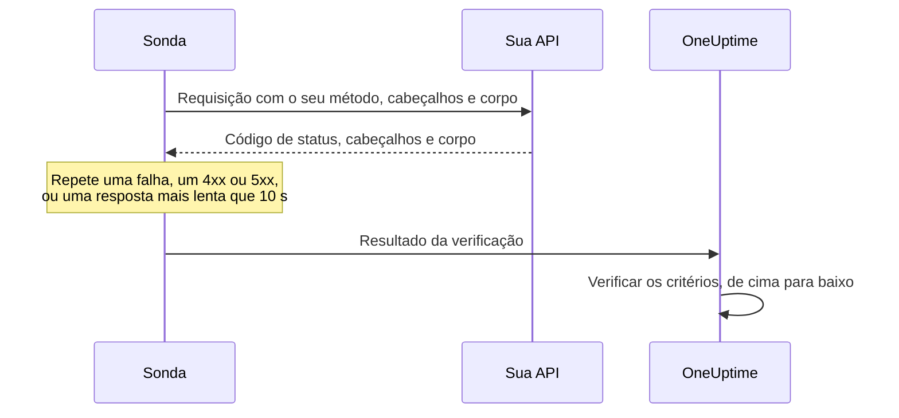

# Monitor de API

Um monitor de API chama um endpoint HTTP conforme um agendamento, com o método, os cabeçalhos e o corpo que você escolher, e verifica o que volta: o código de status, o tempo de resposta, os cabeçalhos e o corpo. Use-o para endpoints REST, JSON e GraphQL, verificações de saúde e qualquer chamada da qual os seus usuários dependam.

:::cards
- [Criar o monitor](#criar-um-monitor-de-api): Seis etapas no painel.
- [Opções de configuração](#opções-de-configuração): Método, cabeçalhos, corpo, redirecionamentos, certificados, tempos limite e novas tentativas.
- [Critérios de monitoramento](#critérios-de-monitoramento): O que conta como no ar ou fora do ar, desde o início.
- [Solução de problemas](#solução-de-problemas): Quando falha uma verificação que deveria passar.
:::

## Como funciona

A cada verificação, uma sonda envia a requisição, segue os redirecionamentos e registra o código de status, o tempo de resposta, os cabeçalhos e o corpo. Uma requisição que falha, excede o tempo limite, responde com um status `4xx` ou `5xx` ou demora mais de 10 segundos é tentada de novo, até o número de novas tentativas que você permitir. Depois, o OneUptime passa o resultado pelos critérios do monitor.



Uma sonda que perdeu a própria conexão de rede não informa nenhum resultado, então não pode marcar a sua API como offline.

## Antes de começar

- **Uma função que possa criar monitores**: Project Owner, Project Admin, Project Member, Monitor Admin ou Monitor Member, ou uma função personalizada com a permissão Create Monitor.
- **Uma sonda que alcance a API.** As sondas padrão do seu projeto são escolhidas para cada monitor novo. Se um firewall protege a API, libere os [endereços IP das sondas do OneUptime Cloud](/docs/configuration/ip-addresses). Uma API em uma rede privada precisa de uma [sonda personalizada](/docs/probe/custom-probe) dentro dessa rede, com permissão para alcançar endereços privados: veja [Acesso à rede privada](/docs/self-hosted/private-network-access).
- **Credenciais como segredos de monitor.** Se a API precisa de uma chave ou de um token, guarde-o primeiro como [segredo de monitor](/docs/monitor/monitor-secrets), para que o monitor só guarde uma referência a ele.

## Criar um monitor de API

:::steps
### Começar um monitor novo

Acesse **Monitores** e clique em **Criar monitor**. Em **Tipo de monitor**, escolha **API**.

### Dar um nome a ele

Informe um **Nome**, como `Orders API`, e clique em **Próximo**.

### Informar a requisição

Em **URL da API**, informe a URL completa do endpoint, como `https://api.example.com/health`. Escolha o **Tipo de requisição de API** (**GET**, a menos que você o altere). Para adicionar cabeçalhos ou um corpo, abra **Mais campos** e preencha **Cabeçalhos da Requisição** e **Corpo da Requisição (em JSON)**.

### Testá-lo

Clique em **Testar monitor**, escolha uma sonda em **Selecionar Sonda** e clique em **Executar teste**. **Resultado do Teste do Monitor** mostra o que a API respondeu.

### Revisar os critérios

**Critérios do monitor** começa com os [critérios padrão](#critérios-padrão): offline quando a API não responde ou responde com um erro, online com qualquer status `2xx` ou `3xx`. Para verificar também o que a API retorna, adicione um filtro e clique em **Próximo**.

### Escolher as sondas e criar

Mantenha ou altere as **Sondas** e o **Intervalo de monitoramento** (começa em **A cada 5 minutos**) e clique em **Criar monitor**. A página do monitor abre.
:::

## Opções de configuração

### URL da API

O endpoint a chamar, como URL completa com o esquema, como `https://api.example.com/v1/health`. Você pode colocar um [segredo de monitor](/docs/monitor/monitor-secrets) na URL como `{{monitorSecrets.NAME}}`.

### Marcadores dinâmicos na URL

Quando um CDN ou um proxy de cache fica na frente da API, a sonda pode receber a resposta do cache em vez do seu servidor. Para passar pelo cache, adicione um marcador à URL; a sonda o substitui por um valor novo a cada verificação.

| Marcador | Substituído por | Valor de exemplo |
| --- | --- | --- |
| `{{timestamp}}` | O horário Unix atual, em segundos | `1719500000` |
| `{{random}}` | Uma string aleatória e única de 32 caracteres hexadecimais | `3f2b8c1d9e7a4b6c8d0e1f2a3b4c5d6e` |

Uma URL com um marcador:

```text
https://api.example.com/health?cb={{timestamp}}
```

O que a sonda requisita em duas verificações com cinco minutos de intervalo:

```text
https://api.example.com/health?cb=1719500000
https://api.example.com/health?cb=1719500300
```

Use `{{random}}` da mesma forma: `https://api.example.com/health?nocache={{random}}`.

### Tipo de requisição de API

O método HTTP a enviar. **GET** é o padrão; os outros são **POST**, **PUT**, **PATCH**, **DELETE** e **HEAD**. Se uma requisição **HEAD** recebe um status `4xx` ou `5xx`, a sonda a repete como `GET`.

### Mais campos

Estas configurações ficam recolhidas em **Mais campos**. O cabeçalho recolhido as lista e mostra quais você alterou.

| Campo | Padrão | O que faz |
| --- | --- | --- |
| **Cabeçalhos da Requisição** | Nenhum | Os cabeçalhos a enviar, como pares de nome e valor. Clique em **Adicionar: Request Header** para cada um. |
| **Corpo da Requisição (em JSON)** | Nenhum | Um objeto JSON enviado como corpo, geralmente com **POST**, **PUT** ou **PATCH**. Precisa ser JSON válido. |
| **Não seguir redirecionamentos** | Desativado | Avaliar a primeira resposta em vez de seguir os redirecionamentos. Veja [abaixo](#não-seguir-redirecionamentos). |
| **Permitir certificados autoassinados** | Desativado | Pular a validação do certificado TLS para o próprio nome de host do monitor. |
| **Usar certificado de cliente (mTLS)** | Desativado | Apresentar um certificado de cliente e uma chave privada. Veja [Certificado de cliente (mTLS)](#certificado-de-cliente-mtls). |
| **Tempo Limite da Requisição (segundos)** | `60` | Quanto esperar por cada tentativa. O máximo é 60 segundos. |
| **Tentativas em caso de falha** | Padrão da sonda, geralmente `3` | Quantas vezes repetir uma tentativa que falhou. O máximo é 3. Veja [Novas tentativas e tempos limite](#novas-tentativas-e-tempos-limite). |

Os cabeçalhos e o corpo da requisição podem usar [segredos de monitor](/docs/monitor/monitor-secrets), por exemplo um cabeçalho `Authorization` com o valor `Bearer {{monitorSecrets.ApiKey}}`.

#### Não seguir redirecionamentos

Por padrão, a sonda segue os redirecionamentos (`301`, `302`, `303`, `307` e `308`), até 10, e avalia a resposta em que termina. Ative **Não seguir redirecionamentos** para avaliar a própria resposta de redirecionamento. Os [critérios padrão](#critérios-padrão) contam uma resposta de redirecionamento como online.

Quando ela segue um redirecionamento:

- Um `303`, ou um `301` ou `302` em resposta a um `POST`, transforma a requisição em um `GET` sem corpo, como fazem os navegadores.
- Os seus cabeçalhos de requisição vão apenas para a origem da própria URL (o mesmo esquema, host e porta). Um redirecionamento para outra origem é enviado sem eles.
- Um redirecionamento para outra origem faz a verificação falhar se a requisição ainda tiver um corpo, ou um método diferente de `GET` ou `HEAD`.
- **Permitir certificados autoassinados** segue os redirecionamentos que ficam no próprio nome de host do monitor. Um redirecionamento para outro nome de host é verificado normalmente.

#### Certificado de cliente (mTLS)

Se a API exige TLS mútuo, ative **Usar certificado de cliente (mTLS)** e preencha:

| Campo | O que informar |
| --- | --- |
| **Certificado do cliente (PEM)** | O certificado de cliente codificado em PEM a apresentar. |
| **Chave privada do cliente (PEM)** | A chave privada correspondente, codificada em PEM. |
| **Senha da chave privada do cliente** | Opcional. A senha, somente se a chave privada estiver criptografada. |

Equivale às opções `--cert` e `--key` do curl:

```bash
curl --cert client.crt --key client.key https://api.example.com/health
```

Para manter a chave fora das configurações do monitor, guarde o certificado e a chave como [segredos de monitor](/docs/monitor/monitor-secrets) e informe `{{monitorSecrets.NAME}}` nesses campos. Os segredos são preenchidos no servidor, e os valores deles nunca aparecem no painel.

O certificado de cliente só é apresentado enquanto a requisição permanece na origem da URL. Depois de um redirecionamento para outra origem, a sonda continua sem ele.

#### Novas tentativas e tempos limite

**Tentativas em caso de falha** conta as novas tentativas _depois_ da primeira, então `0` executa a verificação uma vez e `2` até três vezes. Em branco, usa o padrão da sonda: 3, a menos que `PROBE_MONITOR_RETRY_LIMIT` da sonda diga outra coisa. A sonda espera um segundo entre as tentativas, e cada tentativa recebe o **Tempo Limite da Requisição (segundos)** inteiro.

Estas falhas são repetidas: erros de conexão, tempos limite excedidos, respostas `4xx` e `5xx` e respostas mais lentas que 10 segundos. Estas não, porque tentar de novo não muda nada: uma URL inválida ou bloqueada, mais de 10 redirecionamentos e uma resposta maior que 512 KiB.

## Critérios de monitoramento

Os critérios decidem quando a API conta como online, degradada ou offline, e se isso declara um incidente ou cria um alerta. Cada critério verifica um ou mais filtros:

| Filtro | Condições | O que verifica |
| --- | --- | --- |
| **Is Online** | **Verdadeiro**, **Falso** | Se a API respondeu, seja qual for o código de status. |
| **Código de status da resposta** | **Equal To**, **Not Equal To**, **Greater Than**, **Less Than**, **Greater Than Or Equal To**, **Less Than Or Equal To** | O código de status HTTP. |
| **Tempo de resposta (em ms)** | **Greater Than**, **Less Than**, **Greater Than Or Equal To**, **Less Than Or Equal To** | Quanto a requisição demorou, redirecionamentos incluídos. |
| **Corpo da Resposta** | **Contém**, **Not Contains** | Texto no corpo da resposta. A comparação diferencia maiúsculas de minúsculas. |
| **Response Header** | **Contém**, **Not Contains** | Se a resposta tem um cabeçalho com este nome. Informe o nome em minúsculas, como `x-request-id`. |
| **Response Header Value** | **Contém**, **Not Contains** | Se um cabeçalho tem exatamente este valor, comparado em minúsculas, como `application/json`. |
| **JavaScript Expression** | **Evaluates To True** | Uma expressão sobre a resposta. Veja [Expressões JavaScript](/docs/monitor/javascript-expression). |
| **Is Request Timeout** | **Verdadeiro**, **Falso** | Se a requisição excedeu o tempo limite em todas as tentativas. |

Uma resposta JSON é verificada na forma compacta, sem espaços entre chaves e valores. Para encontrar `"status": "ok"` com **Corpo da Resposta**, informe `"status":"ok"`.

**Adicionar critérios** adiciona um critério que já leva o nome do filtro, por exemplo _Response Time (in ms) is above 3000_. O nome muda com os filtros até você digitar um nome seu. A descrição é opcional: para adicionar uma, abra as **Configurações** do critério.

Com dois ou mais filtros, **Condição de correspondência** decide se **Todos** precisam corresponder ou se basta **Qualquer** um. As **Ações** de um critério decidem o que ele faz: mudar o status do monitor, criar um alerta, declarar um incidente, ou várias dessas coisas.

### Critérios padrão

Um monitor de API novo começa com dois critérios, então funciona sem que você altere nada:

- **Offline** — a API não responde, ou responde com um código de status `400` ou maior (ou menor que `200`). O monitor é marcado como **Offline** e um incidente é criado. O incidente se resolve sozinho quando a API volta.
- **No ar** — a API responde com qualquer código de status `2xx` ou `3xx`, como `200`, `201`, `202` ou `204`. O monitor é marcado como **Operacional**.

Na lista de critérios, eles levam o nome do monitor: _Check if (name) is offline_ e _Check if (name) is online_.

Então um endpoint que responde `201 Created` ou `204 No Content` conta como no ar. Se para você só um código de status significa que está saudável, altere os dois critérios na página **Configuração → Critérios** do monitor: por exemplo **Código de status da resposta** / **Equal To** / `200` no critério online e **Not Equal To** / `200` no critério offline, no lugar dos dois filtros de código de status que cada um tem. Para verificar também o que a API retorna, adicione um filtro **Corpo da Resposta** ou **JavaScript Expression** ao critério offline.

Os critérios são verificados de cima para baixo, e o primeiro que corresponde decide o que acontece.

Quando nenhum corresponde, o monitor volta ao status padrão: **Operacional**, a menos que você escolha outro em **Mais campos**, abaixo dos critérios. O cabeçalho recolhido de **Mais campos** mostra qual é esse status.

Os monitores criados antes de o OneUptime mudar esses padrões mantêm os critérios com que foram criados, que contam apenas `200` como online. Os monitores criados pela API ou pelo Terraform usam os critérios que você envia.

### Avaliar durante um período de tempo

**Avaliar este critério durante um período de tempo** é uma caixa de seleção abaixo de um filtro, oferecida para **Is Online**, **Código de status da resposta** e **Tempo de resposta (em ms)**. Ative-a para avaliar uma janela de verificações anteriores em vez da última: escolha uma agregação em **Avaliar** e uma janela, de 2 a 60 minutos, em **Nos últimos (em minutos)**.

| Agregação | Corresponde quando |
| --- | --- |
| **Média**, **Soma**, **Maximum Value**, **Minimum Value** | Esse valor, na janela, atende à condição. Somente filtros numéricos. |
| **All Values** | Cada verificação na janela atende à condição. |
| **Any Value** | Pelo menos uma verificação na janela atende à condição. |

**All Values** só corresponde quando a janela está realmente coberta por dados. Um monitor recém-criado, ou um cujas verificações deixaram de ser registradas, não tem histórico suficiente para dizer algo sobre os últimos N minutos, então o critério espera em vez de corresponder com a única leitura que tem. **Any Value** é a configuração para "me avise no momento em que uma única verificação ultrapassar o limite" e continua disparando imediatamente.

**Se não houver dados** decide o que acontece enquanto a janela não consegue sustentar o critério:

| Opção | O que acontece | Use para |
| --- | --- | --- |
| **Ignore** (padrão) | O critério não corresponde. | Alertas de limite comuns. |
| **Trigger** | A falta de dados conta como o problema. | Verificações em que o silêncio é em si uma falha. |
| **Treat As Zero** | A janela é comparada como um único zero. | Contadores em que nenhum evento significa realmente zero. |

### Exemplos de critérios

| Objetivo | Filtro | Condição | Valor |
| --- | --- | --- | --- |
| Marcar a API como degradada quando estiver lenta | **Tempo de resposta (em ms)** | **Greater Than** | `1000` |
| Offline quando a verificação de saúde relata um problema | **Corpo da Resposta** | **Not Contains** | `"status":"ok"` |
| O mesmo, lido do JSON analisado | **JavaScript Expression** | **Evaluates To True** | `"{{responseBody.status}}" !== "ok"` |
| Aceitar apenas `201` de um `POST` | **Código de status da resposta** | **Equal To** | `201` |

## Solução de problemas

:::details A API responde às minhas requisições, mas o monitor está offline
A sonda recebeu uma resposta diferente da sua. A causa raiz do incidente, e **Registros de monitoramento** no monitor, mostram o que a sonda viu. Confira se a sonda envia o que a API espera: o método, o cabeçalho `Authorization`, o corpo. Um firewall ou um limitador de taxa na frente da API também pode bloquear as sondas: libere os [endereços IP das sondas do OneUptime Cloud](/docs/configuration/ip-addresses).
:::

:::details O monitor envia `{{monitorSecrets.NAME}}` literalmente
O monitor não pode usar o segredo, ou o nome não corresponde. Veja [Segredos do monitor](/docs/monitor/monitor-secrets) para saber quem pode usar um segredo.
:::

:::details A verificação falha com "unsafe cross-origin redirect"
A API redirecionou uma requisição com um corpo, ou com um método diferente de `GET` ou `HEAD`, para outra origem, e a sonda não encaminha esse tipo de requisição. Aponte o monitor para a URL para a qual a API redireciona, ou ative **Não seguir redirecionamentos** e verifique o próprio redirecionamento.
:::

:::details A verificação falha com "Remote response exceeded the allowed size."
A sonda lê no máximo 512 KiB de uma resposta, e esta é maior. Chame um endpoint que retorne menos, por exemplo com um tamanho de página menor.
:::

## Próximos passos

:::cards
- [Expressões JavaScript](/docs/monitor/javascript-expression): Verificar campos profundos de uma resposta JSON.
- [Segredos do monitor](/docs/monitor/monitor-secrets): Manter chaves de API e tokens fora das configurações do monitor.
- [Monitor de site](/docs/monitor/website-monitor): Verificar uma página web em vez de um endpoint.
- [Modelos de incidentes e alertas](/docs/monitor/incident-alert-templating): Colocar detalhes da resposta nos títulos de incidentes e alertas.
:::
