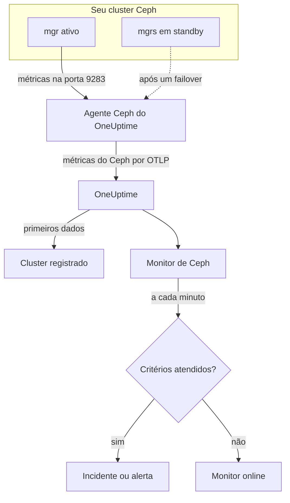

# Monitor de Ceph

Um monitor de Ceph acompanha um cluster Ceph — a saúde, os health checks, o quórum dos monitores, os OSDs, os pools e os placement groups — e avisa você no momento em que a saúde piora, um OSD cai ou a capacidade começa a faltar. Ele lê as métricas `ceph_*` que o módulo `prometheus` do mgr do Ceph exporta, coletadas pelo agente Ceph do OneUptime, então nada é sondado de fora.

:::cards
- [Criar o monitor](#criar-um-monitor-de-ceph): Seis etapas no painel.
- [Modelos](#modelos-de-alerta-prontos): 23 alertas prontos para saúde, OSDs, placement groups e capacidade.
- [Health checks](#séries-de-health-checks): Alertar sobre qualquer health check do Ceph pelo nome.
- [Métricas](#métricas-coletadas): Cada série `ceph_*` sobre a qual o monitor pode alertar.
:::

## Como funciona

O módulo `prometheus` do mgr do Ceph disponibiliza as métricas do cluster na porta 9283. O agente Ceph do OneUptime consulta cada daemon mgr a cada 30 segundos — o ativo responde, os standby não retornam nada até assumirem —, mantém os rótulos próprios do Ceph (`ceph_daemon`, `pool_id`) e envia as métricas ao OneUptime por OTLP, marcadas com o nome do cluster, `ceph.cluster.name`. Os primeiros dados registram o cluster.

Um monitor de Ceph fica vinculado a um único cluster. A cada minuto ele executa sua consulta sobre as métricas desse cluster e compara o resultado com seus critérios.



## Antes de começar

- **Ative o módulo `prometheus` do mgr** no cluster:

  ```bash
  ceph mgr module enable prometheus
  ```

- **Instale o agente Ceph** em uma máquina que alcance cada daemon mgr na porta 9283, e liste todos eles em `CEPH_MGR_ENDPOINTS`. O [guia do agente Ceph](/docs/telemetry/ceph) explica a instalação.
- **Verifique se o cluster está registrado.** Ele aparece em **Produtos → Infraestrutura → Ceph → Todos os clusters**, com o nome de `CEPH_CLUSTER_NAME` do agente, cerca de um minuto após a primeira coleta.
- **Para alertas de health checks**, use o Ceph Quincy ou posterior. Versões mais antigas não exportam `ceph_health_detail`.

## Criar um monitor de Ceph

:::steps
### Iniciar um novo monitor

Vá em **Monitores** e clique em **Criar monitor**.

### Escolher Ceph

Em **Tipo de monitor**, clique em **Mais tipos de monitor** e escolha **Ceph** em **Infraestrutura**, ou digite `ceph` na caixa de busca. Informe um **Nome** — ele é usado nos títulos de incidentes e alertas — e clique em **Próximo**.

### Escolher o cluster

Em **Ceph Monitor Configuration**, escolha o cluster em **Ceph Cluster**. Todo cluster que já enviou dados está na lista.

### Escolher o que acompanhar

Escolha uma das três abas:

- **Quick Setup** — clique em um [modelo](#modelos-de-alerta-prontos). Ele define as métricas, os filtros, a agregação, o intervalo de tempo e os limites, e substitui os critérios abaixo pelos seus. Você ainda pode mudar o **Intervalo de tempo**.
- **Custom Metric** — escolha uma métrica em **Ceph Metric** e depois defina **Agregação** e **Intervalo de tempo**. **OSD** e **Pool ID** restringem a um daemon ou a um pool.
- **Avançado** — monte você mesmo consultas e fórmulas em **Selecionar Métricas**, por exemplo uma razão de capacidade usada a partir de `ceph_cluster_total_used_bytes / ceph_cluster_total_bytes`. Use **Group by** `ceph_daemon` ou `pool_id` para avaliar cada daemon ou pool separadamente.

### Conferir os critérios

Abra cada critério em **Critérios do monitor** e confira **Métrica**, **Agregação**, **Condição** e **Threshold**. Um modelo preenche esses campos. Com **Custom Metric** ou **Avançado**, o monitor começa com os [critérios padrão](#critérios-padrão), que só percebem uma métrica caindo para zero, então defina seu próprio limite.

### Criar o monitor

Clique em **Criar monitor**. O OneUptime abre a página do monitor e o avalia a cada minuto. Os incidentes e alertas que ele gera também aparecem nas páginas **Incidentes** e **Alertas** do cluster.
:::

> [!TIP]
> Para configurar vários modelos de uma vez, abra o cluster em **Produtos → Infraestrutura → Ceph** e vá em **Recommendations**. Escolha os modelos que quiser e quem será chamado, e o OneUptime cria um monitor por modelo.

## Configurações do monitor

| Campo | Aba | O que faz |
| --- | --- | --- |
| **Ceph Cluster** | Todas | Obrigatório. Restringe cada consulta a `resource.ceph.cluster.name`. |
| **OSD** | Custom Metric, Avançado | Opcional. Correspondência exata com o rótulo `ceph_daemon`, por exemplo `osd.3`. |
| **Pool ID** | Custom Metric, Avançado | Opcional. Correspondência exata com o rótulo `pool_id`, por exemplo `2`. |
| **Ceph Metric** | Custom Metric | Uma métrica do [catálogo](#métricas-coletadas). |
| **Agregação** | Custom Metric | Como as amostras são combinadas: **Média**, **Máximo**, **Mínimo**, **Soma** ou **Contagem**. Começa pela agregação habitual da métrica. |
| **Intervalo de tempo** | Todas | A janela móvel que a consulta lê, de **Past 1 Minute** a **Past 365 Days**. Um monitor novo começa em **Past 1 Minute**; os modelos definem o próprio. |
| **Selecionar Métricas** | Avançado | O construtor de consultas: **Métrica**, **Aggregate by**, **Filter by attributes**, **Group by**, além de **Adicionar métrica** e **Adicionar fórmula** para combinar consultas. |

As séries de dados dos pools têm só o rótulo `pool_id`: o nome do pool existe apenas em `ceph_pool_metadata`. Filtre e agrupe as séries de pools por `pool_id`, e consulte o nome em `ceph_pool_metadata` quando precisar.

### Séries de health checks

`ceph_health_detail` exporta **uma série por health check ativo**, com os rótulos `name` (por exemplo `OSD_NEARFULL` ou `RECENT_CRASH`) e `severity`. Uma série só existe enquanto seu check está disparado, então nenhuma série significa que está tudo bem. Para alertar sobre qualquer health check do Ceph, filtre pelo `name` dele, dispare com **Máximo** acima de `0` e recupere em `0` com **Se não houver dados** definido como **Treat As Zero** — exatamente como os modelos de health checks são montados. `ceph_daemon_health_metrics` funciona do mesmo jeito por daemon, com um rótulo `type` (por exemplo `SLOW_OPS`) e `ceph_daemon`.

## Modelos de alerta prontos

**Quick Setup** oferece 23 modelos que cobrem a saúde do cluster, os OSDs, os placement groups e a capacidade. Cada um monta um monitor completo — consultas, filtros de rótulos, um agrupamento, um critério que dispara e outro que recupera. Os limites são pontos de partida que você pode editar.

Os modelos leem os últimos 5 minutos, a menos que a tabela diga outra coisa. Um critério só dispara quando a condição vale em todos os minutos da sua janela, e um critério com limite recupera 10% além do limite, para que um valor que oscila na linha não fique alternando. **Gravidade** é o rótulo que o seletor mostra; o incidente e o alerta criados por um modelo começam com a gravidade de incidente e de alerta mais alta do seu projeto.

### Modelos de saúde do cluster

| Modelo | Gravidade | Acompanha | Dispara quando | Recupera quando |
| --- | --- | --- | --- | --- |
| Cluster Health Error | Crítico | `ceph_health_status`, Max, último minuto | 2 ou mais: `HEALTH_ERR` | Abaixo de 1,8: `HEALTH_WARN` ou melhor |
| Cluster Health Warning | Warning | `ceph_health_status`, Max | 1 ou mais: `HEALTH_WARN` ou pior | Abaixo de 0,9: `HEALTH_OK` |
| Monitor Quorum Degraded | Crítico | `ceph_mon_quorum_status`, Min por `ceph_daemon`, último minuto | Um monitor cai abaixo de 1, fora do quórum. Um incidente por monitor | De volta a 1 |
| Slow Operations | Warning | `ceph_healthcheck_slow_ops`, Max | Acima de 0: o check `SLOW_OPS` do cluster está ativo | Em 0 |
| Daemon Slow Operations | Warning | `ceph_daemon_health_metrics` para `type = SLOW_OPS`, Max por `ceph_daemon` | Acima de 0. Um incidente por OSD ou monitor | A série desaparece |
| Daemon Crash | Crítico | `ceph_health_detail` para `name = RECENT_CRASH`, Max | O check está ativo: existem falhas de daemons não arquivadas. O mgr não tem nenhuma métrica `ceph_crash_*`, então este é o único sinal de falha | As falhas são arquivadas |
| Monitor Clock Skew | Warning | `ceph_health_detail` para `name = MON_CLOCK_SKEW`, Max | O check está ativo: os relógios dos monitores se desviam além do permitido (0,05 s por padrão) | O check desaparece |
| Monitor Disk Critically Low | Crítico | `ceph_health_detail` para `name = MON_DISK_CRIT`, Max | O check está ativo: o disco de banco de dados de um monitor tem menos de 5% livre (o padrão) | O check desaparece |
| Monitor Disk Space Low | Warning | `ceph_health_detail` para `name = MON_DISK_LOW`, Max | O check está ativo: menos de 30% livre (o padrão) | O check desaparece |

### Modelos de OSD

| Modelo | Gravidade | Acompanha | Dispara quando | Recupera quando |
| --- | --- | --- | --- | --- |
| OSD Down | Crítico | `ceph_osd_up`, Min por `ceph_daemon` | Um OSD cai abaixo de 1. Um incidente por OSD | De volta a 1 |
| OSD Out | Warning | `ceph_osd_in`, Min por `ceph_daemon` | Um OSD cai abaixo de 1: marcado como fora da distribuição de dados | De volta a 1 |
| OSD High Latency | Warning | `ceph_osd_apply_latency_ms`, Avg por `ceph_daemon` | Acima de 100 ms. Um incidente por OSD | Em 90 ms ou menos |
| OSD Slow Heartbeats | Warning | `ceph_health_detail` para `name = OSD_SLOW_PING_TIME_FRONT` e `name = OSD_SLOW_PING_TIME_BACK`, Max | Um dos checks está ativo: os heartbeats na rede pública ou na rede do cluster estão lentos. O mgr não exporta nenhuma medida de tempo de ping | Os dois checks desaparecem |

### Modelos de placement groups

| Modelo | Gravidade | Acompanha | Dispara quando | Recupera quando |
| --- | --- | --- | --- | --- |
| Inactive Placement Groups | Crítico | `ceph_pg_total` − `ceph_pg_active`, Max por `pool_id` | Acima de 0: há PGs que não conseguem atender E/S, então as requisições dos clientes a elas travam. Um incidente por pool | Em 0 |
| Degraded Placement Groups | Warning | `ceph_pg_degraded`, Max por `pool_id` | Acima de 0: há objetos com menos réplicas que o configurado | Em 0 |
| Undersized Placement Groups | Warning | `ceph_pg_undersized`, Max por `pool_id` | Acima de 0: há PGs mapeadas para menos OSDs que o número de réplicas | Em 0 |
| Damaged Placement Groups | Crítico | `ceph_health_detail` para `name = PG_DAMAGED` e `name = OSD_SCRUB_ERRORS`, Max | Um dos checks está ativo: o scrubbing encontrou danos ou erros de leitura | Os dois checks desaparecem |

### Modelos de capacidade

| Modelo | Gravidade | Acompanha | Dispara quando | Recupera quando |
| --- | --- | --- | --- | --- |
| Cluster Near Full | Warning | `ceph_cluster_total_used_bytes` ÷ `ceph_cluster_total_bytes` × 100 | Acima de 85%, a razão nearfull padrão do Ceph | Em 76,5% ou menos |
| Cluster Full | Crítico | A mesma razão | Acima de 95%, a razão full padrão do Ceph, a partir da qual as gravações param no cluster inteiro | Em 85,5% ou menos |
| Pool Near Full | Warning | `ceph_pool_stored` ÷ (`ceph_pool_stored` + `ceph_pool_max_avail`) × 100, por `pool_id` | Acima de 85% do que o pool comporta. Um incidente por pool | Em 76,5% ou menos |
| OSD Nearfull | Warning | `ceph_health_detail` para `name = OSD_NEARFULL`, Max | O check está ativo: um OSD passou do limite nearfull (85% por padrão). OSDs individuais enchem muito antes da média do cluster | O check desaparece |
| OSD Backfillfull | Warning | `ceph_health_detail` para `name = OSD_BACKFILLFULL`, Max | O check está ativo: o backfill para o OSD é recusado (90% por padrão), o que trava a recuperação | O check desaparece |
| OSD Full | Crítico | `ceph_health_detail` para `name = OSD_FULL`, Max, último minuto | O check está ativo: um OSD atingiu o limite full (95% por padrão) e as gravações são recusadas | O check desaparece |

- **Os modelos de queda e de quórum usam o mínimo**, para que um único OSD fora do ar ou um único monitor fora do quórum os dispare em vez de ficar escondido pela maioria saudável.
- **Os modelos de contagem e de health checks usam o máximo**, para que uma única coleta ruim baste.
- **As séries de PG e de pool são por pool**: não existe uma medida do cluster inteiro, então esses modelos agrupam por `pool_id` e abrem um incidente por pool.
- **As razões de capacidade** usam a **Soma** dos dois lados. Os dois vêm da mesma coleta do mgr, então o resultado é uma porcentagem real. **Inactive Placement Groups** usa **Máximo** por pool, porque uma soma acumularia coletas numa subtração.
- **Os modelos de health checks** recuperam quando o check desaparece: seus critérios de recuperação contam uma série ausente como 0.

Alguns alertas não têm modelo. O desequilíbrio de PGs exige estatísticas entre séries que os critérios não conseguem calcular. A previsão de capacidade exige um ajuste de crescimento, que o painel do cluster desenha no lugar. A previsão de falha de disco e o scrubbing atrasado não têm métrica do mgr, e NVMe-oF, o espelhamento RBD e o cephadm precisam de outros exportadores.

## Métricas coletadas

O agente consulta cada daemon mgr a cada 30 segundos e mantém os rótulos próprios do Ceph, então as séries por daemon trazem `ceph_daemon` (`osd.3`, `mon.a`) e as séries por pool trazem `pool_id`.

### Métricas de saúde do cluster

| Métrica | Unidade | Descrição |
| --- | --- | --- |
| `ceph_health_status` | — | Saúde geral: 0 = `HEALTH_OK`, 1 = `HEALTH_WARN`, 2 = `HEALTH_ERR`. |
| `ceph_health_detail` | contagem | Uma série por health check **ativo**, com os rótulos `name` e `severity`. Somente do Quincy em diante. |
| `ceph_healthcheck_slow_ops` | contagem | Operações lentas de OSDs e monitores relatadas pelo check `SLOW_OPS`. |
| `ceph_daemon_health_metrics` | contagem | Métricas de saúde por daemon, identificadas por `type` (por exemplo `SLOW_OPS`) e `ceph_daemon`. |
| `ceph_mon_quorum_status` | contagem | 1 quando o monitor está no quórum, por `ceph_daemon` (por exemplo `mon.a`). |
| `ceph_mon_metadata` | contagem | Metadados do monitor, sempre 1. Some para contar os monitores. |
| `ceph_cluster_total_bytes` | bytes | Capacidade bruta total. |
| `ceph_cluster_total_used_bytes` | bytes | Capacidade bruta em uso. |

### Métricas de OSD

| Métrica | Unidade | Descrição |
| --- | --- | --- |
| `ceph_osd_up` | contagem | 1 quando o OSD está ativo, por `ceph_daemon` (por exemplo `osd.3`). |
| `ceph_osd_in` | contagem | 1 quando o OSD faz parte da distribuição de dados. |
| `ceph_osd_apply_latency_ms` | ms | Tempo para aplicar uma operação ao armazenamento subjacente. |
| `ceph_osd_commit_latency_ms` | ms | Tempo para confirmar uma operação no journal ou no WAL. |
| `ceph_osd_stat_bytes` | bytes | Capacidade bruta do dispositivo do OSD. |
| `ceph_osd_stat_bytes_used` | bytes | Bytes brutos usados no OSD. Compare com o total para achar OSDs desbalanceados ou quase cheios. |
| `ceph_osd_numpg` | contagem | Placement groups no OSD. |
| `ceph_osd_metadata` | contagem | Metadados do OSD (nome do host, classe do dispositivo, versão), sempre 1. Some para contar os OSDs. |

### Métricas de pools

| Métrica | Unidade | Descrição |
| --- | --- | --- |
| `ceph_pool_stored` | bytes | Dados de usuário armazenados no pool. |
| `ceph_pool_max_avail` | bytes | Bytes que ainda podem ser gravados no pool, considerando o perfil de replicação ou de erasure coding. |
| `ceph_pool_objects` | contagem | Objetos no pool. |
| `ceph_pool_rd` | ops | Operações de leitura no pool. Um contador acumulado de toda a vida útil. |
| `ceph_pool_wr` | ops | Operações de gravação no pool. Um contador acumulado de toda a vida útil. |
| `ceph_pool_rd_bytes` | bytes | Bytes lidos do pool. Um contador acumulado de toda a vida útil. |
| `ceph_pool_wr_bytes` | bytes | Bytes gravados no pool. Um contador acumulado de toda a vida útil. |
| `ceph_pool_metadata` | contagem | Metadados do pool, sempre 1 — a única série que associa `pool_id` a um nome. |

### Métricas de placement groups

Toda série `ceph_pg_*` é por pool, com o rótulo `pool_id`; some entre os pools para ter uma contagem do cluster inteiro.

| Métrica | Unidade | Descrição |
| --- | --- | --- |
| `ceph_pg_total` | contagem | Placement groups no pool. |
| `ceph_pg_active` | contagem | PGs no estado `active`, capazes de atender E/S. |
| `ceph_pg_clean` | contagem | PGs no estado `clean`, totalmente replicadas. |
| `ceph_pg_degraded` | contagem | PGs no estado `degraded`. |
| `ceph_pg_undersized` | contagem | PGs no estado `undersized`. |
| `ceph_num_objects_degraded` | contagem | Objetos com menos réplicas que o configurado. |
| `ceph_num_objects_misplaced` | contagem | Objetos que não estão onde o CRUSH quer. Os dados estão seguros; só o posicionamento está errado. |

## Critérios de monitoramento

Um critério compara uma das consultas ou fórmulas do monitor com um limite. Os critérios de um monitor de Ceph não têm **Tipo de filtro**: cada regra verifica o valor da métrica, com estes campos.

| Campo | O que faz |
| --- | --- |
| **Métrica** | A consulta ou fórmula a verificar, pelo nome da variável. |
| **Agregação** | Como os valores da janela viram uma única resposta: **Média**, **Soma**, **Maximum Value**, **Minimum Value**, **All Values** (todos os valores precisam atender) ou **Any Value** (um basta). |
| **Condição** | **Greater Than**, **Less Than**, **Greater Than Or Equal To**, **Less Than Or Equal To** ou **Equal To** — ou uma condição de anomalia: **Anomalously High**, **Anomalously Low** ou **Anomalous**. |
| **Threshold** | O valor de comparação. Uma lista de unidades aparece ao lado quando a métrica tem unidade. Não aparece para condições de anomalia. |
| **Sensibilidade** | Somente condições de anomalia. **Low** (4σ), **Medium** (3σ, o padrão) ou **High** (2σ). |
| **Janela de linha de base** | Somente condições de anomalia. 14 dias (o padrão), 28, 60 ou 90 dias de histórico. |
| **Se não houver dados** | Em **Mais campos**. O que acontece quando a janela não tem amostras: **Ignore** (o padrão), **Treat As Zero** ou **Trigger**. |

As condições de anomalia comparam cada valor com a mesma hora da semana na linha de base. Elas ficam no estado "Learning", sem gerar nada, até a janela de linha de base ter histórico suficiente.

Cada critério também diz o que fazer quando é atendido: mudar o status do monitor, criar um alerta ou declarar um incidente. Os critérios são verificados de cima para baixo, e o primeiro atendido decide.

### Critérios padrão

Um monitor que você não monta a partir de um modelo começa com dois critérios:

| Ordem | Critério | Atendido quando | Então |
| --- | --- | --- | --- |
| 1 | Check if _nome do monitor_ is offline | Algum valor da primeira consulta é `0` | Marca o monitor como **Offline** e declara o incidente "_nome do monitor_ is offline", que se resolve sozinho quando o monitor se recupera. |
| 2 | Check if _nome do monitor_ is online | Algum valor está acima de `0` | Marca o monitor como **Operacional**. |

Esses padrões servem para poucas métricas do Ceph: `ceph_health_status` é 0 quando o cluster está saudável. Escolha um modelo ou defina seus próprios critérios.

> [!IMPORTANT]
> O silêncio não atende a nenhum dos dois critérios: um cluster que para de enviar dados deixa o monitor como estava. Para saber quando os dados param, defina **Se não houver dados** como **Trigger** em um critério.

## Solução de problemas

:::details O cluster não está na lista Ceph Cluster
Os clusters se registram sozinhos a partir dos dados do agente. Verifique se o agente está rodando e enviando dados (veja o [guia do agente Ceph](/docs/telemetry/ceph)) e se `CEPH_CLUSTER_NAME` está definido.
:::

:::details As métricas pararam depois de um failover do mgr
O agente precisa consultar **todos** os daemons mgr, não só o ativo: os standby não retornam nada até assumirem. Liste cada mgr em `CEPH_MGR_ENDPOINTS`.
:::

:::details ceph_health_status está em 1, mas nada dispara
Verifique se o critério usa **Greater Than Or Equal To** `1`, e não **Greater Than**, e se o **Intervalo de tempo** do monitor cobre pelo menos uma coleta de 30 segundos.
:::

:::details Os modelos de health checks nunca disparam
Os modelos que acompanham `ceph_health_detail` — Daemon Crash, Monitor Clock Skew, OSD Nearfull, OSD Backfillfull, OSD Full, os dois modelos de disco dos monitores, Damaged Placement Groups e OSD Slow Heartbeats — precisam do módulo `prometheus` do mgr do Quincy ou posterior. Enquanto um check está ativo, confirme que a série existe:

```bash
curl http://ACTIVE_MGR:9283/metrics | grep ceph_health_detail
```

As séries de health checks, incluindo `ceph_daemon_health_metrics`, só existem enquanto um check está disparado, então é esperado não encontrar nenhuma com o cluster saudável.
:::

:::details Contadores como ceph_pool_wr_bytes só crescem
As séries de E/S dos pools são contadores acumulados, e os critérios comparam valores brutos: não há operador de taxa, e **Convert to per-second rate** no construtor de consultas só muda o gráfico. Mostre-as como taxa no gráfico, ou alerte sobre o crescimento com uma fórmula, como uma consulta **Máximo** menos uma consulta **Mínimo** do mesmo contador.
:::

## Próximos passos

:::cards
- [Agente Ceph](/docs/telemetry/ceph): Instalar e atualizar o agente que este monitor lê.
- [Monitor de Proxmox](/docs/monitor/proxmox-monitor): Acompanhar o cluster Proxmox VE que usa o armazenamento.
- [Monitor de storage arrays](/docs/monitor/storage-array-monitor): O mesmo tipo de monitor para arrays da Pure Storage.
- [Incidentes](/docs/incidents/index): O que acontece depois que um critério declara um incidente.
:::
