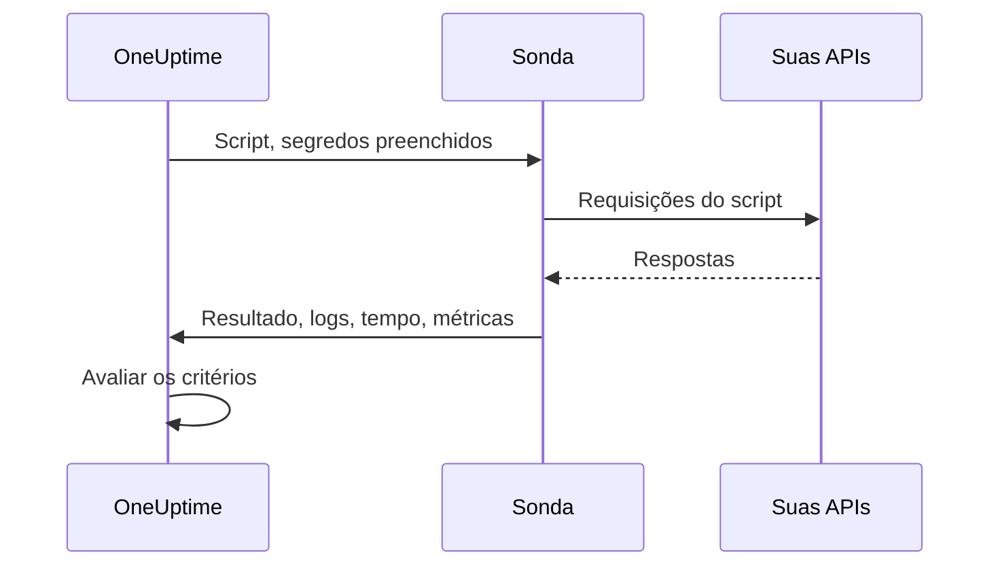

# Monitor de código personalizado

Um monitor Custom Code executa periodicamente, a partir de uma sonda, um script JavaScript que você escreve. Use-o para verificações que os outros tipos de monitor não conseguem expressar: um login seguido de uma chamada autenticada a uma API, uma transação em várias etapas ou um valor calculado a partir de várias respostas. Se o script lançar um erro, a verificação falha; o que ele retorna fica disponível para seus critérios e seus modelos de incidente.

:::cards
- [Criar o monitor](#criar-um-monitor-custom-code): Escreva um script e escolha as sondas que o executam.
- [Escrever o script](#escrever-o-script): Uma verificação de API em várias etapas, pronta para usar como ponto de partida.
- [Usar segredos](#usar-segredos-do-monitor): Mantenha senhas e tokens fora do script.
- [Capturar métricas personalizadas](#métricas-personalizadas): Coloque em gráfico qualquer número que seu script calcule.
:::

## Como funciona

A cada verificação, uma sonda executa seu script em um sandbox JavaScript isolado, com os segredos do monitor já preenchidos. O script chama o que precisar e depois retorna um resultado ou lança um erro. A sonda informa o resultado, as mensagens de log do script, quanto tempo ele levou e as métricas capturadas, e o OneUptime avalia seus critérios com base nisso.



O sandbox não é Node.js: não há `require`, `process`, `fetch` nem sistema de arquivos, apenas os [módulos listados abaixo](#módulos-disponíveis-no-script).

## Antes de começar

- Uma **sonda** que alcance todos os endpoints chamados pelo script. Use uma [sonda personalizada](/docs/probe/custom-probe) para endpoints dentro da sua rede.
- Para chamar um endereço privado (como `10.0.0.5`), a sonda precisa permitir: defina `PROBE_ALLOW_PRIVATE_NETWORK_MONITORS=true` nessa sonda. Endereços de loopback, link-local e de metadados de nuvem são sempre recusados. Veja [Acesso à rede privada](/docs/self-hosted/private-network-access).
- Toda senha, chave de API ou token de que o script precise, armazenado como [segredo do monitor](/docs/monitor/monitor-secrets).

## Criar um monitor Custom Code

:::steps
### Começar um novo monitor

Vá para **Monitores** e clique em **Criar monitor**. Em **Tipo de monitor**, clique em **Mais tipos de monitor** e escolha **Custom JavaScript Code** em **Synthetic Monitoring**, ou digite `script` na caixa de pesquisa. Digite um **Nome** e clique em **Próximo**.

### Adicionar o script

Escreva seu script no editor **Código JavaScript**. Comece pelo [exemplo abaixo](#escrever-o-script).

### Testar

Clique em **Testar monitor** para executar o script uma vez a partir de uma sonda, e confira o resultado.

### Revisar os critérios

O monitor começa com dois critérios: fica offline, e declara um incidente, quando o script falha, e online quando não falha. Altere-os ou adicione os seus (veja [Critérios](#critérios)) e clique em **Próximo**.

### Escolher as sondas e criar

Selecione as **Sondas** que alcançam seus endpoints e um **Intervalo de monitoramento** (monitores Custom Code recebem intervalos de 5 minutos ou mais) e clique em **Criar monitor**.
:::

## Escrever o script

O script é o corpo de uma função `async`: você pode usar `await` no nível mais alto, retornar um resultado com `return` e fazer a verificação falhar com `throw`. Este exemplo faz login, chama um endpoint com o token obtido e falha se a resposta não for a esperada:

```javascript title="Custom code monitor script"
// 1. Log in. axios rejects a 4xx or 5xx response, which fails the check.
const login = await axios.post("https://api.example.com/v1/login", {
  username: "monitoring@example.com",
  password: "{{monitorSecrets.ApiPassword}}",
});

// 2. Call an endpoint that needs the token.
const orders = await axios.get("https://api.example.com/v1/orders?limit=10", {
  headers: { Authorization: `Bearer ${login.data.token}` },
  timeout: 10000,
});

// 3. Fail the check when the data is wrong, not only when the request fails.
if (!Array.isArray(orders.data.items)) {
  throw new Error("The orders endpoint returned no items");
}

console.log(`Fetched ${orders.data.items.length} orders`);

// 4. Return what the criteria and incident templates should see.
return {
  data: orders.data.items.length,
};
```

| Para | Faça isto | O que o OneUptime registra |
| --- | --- | --- |
| Informar um resultado | `return { data: ... }` com qualquer valor JSON | O **Resultado**. Só a propriedade `data` é mantida: `return 5` não registra resultado. |
| Fazer a verificação falhar | `throw new Error("...")` | O **Erro de script**, que os critérios padrão transformam em incidente. |
| Deixar um rastro | `console.log(...)` | As **Mensagens de Registro**, até 1.000 por execução. |

Para ver uma execução, abra a **Visão geral** do monitor: o cartão **Resumo do monitor** mostra a sonda, o tempo de execução e o erro, e **Mostrar mais detalhes** mostra o resultado, o erro de script e as mensagens de log. **Registros de monitoramento** tem o mesmo resumo para as verificações anteriores.

> [!NOTE]
> Neste sandbox, o `axios` não segue redirecionamentos, e suas requisições não passam por um proxy configurado na sonda. Solicite a URL final.

## Usar segredos do monitor

Faça referência a um segredo com `{{monitorSecrets.NAME}}` em qualquer ponto do script. O OneUptime substitui a referência pelo valor do segredo, como texto simples, antes de o script chegar à sonda. Então coloque o segredo entre aspas para usá-lo como string, e deixe-o sem aspas para usá-lo como número ou booleano:

```javascript
// Used as a string: wrap it in quotes.
const apiKey = "{{monitorSecrets.ApiKey}}";

// Used as a number or a boolean: leave it bare.
const retryLimit = {{monitorSecrets.RetryLimit}};
const verbose = {{monitorSecrets.Verbose}};

// Check the secret was filled in without logging the secret itself.
console.log(apiKey.length > 0);
```

Um valor de segredo que contém aspas quebra a string ao redor. Uma referência que o monitor não pode usar fica no script exatamente como foi escrita. Para criar um segredo e escolher quais monitores podem usá-lo, veja [Segredos do monitor](/docs/monitor/monitor-secrets).

## Métricas personalizadas

Você pode capturar métricas personalizadas a partir do script com a função `oneuptime.captureMetric()`. Essas métricas são armazenadas no OneUptime e podem ser colocadas em gráficos nos dashboards com o explorador de métricas.

```javascript
oneuptime.captureMetric(name, value, attributes);
```

| Parâmetro | Tipo | Descrição |
| --- | --- | --- |
| `name` | string, obrigatório | O nome da métrica (por exemplo, `"api.response.time"`). Ele é armazenado automaticamente com o prefixo `custom.monitor.`. |
| `value` | number, obrigatório | O valor numérico da métrica. Um valor que não é número é ignorado. |
| `attributes` | object, opcional | Pares chave-valor para dar contexto. Valores de string, número e booleano são registrados (números e booleanos como texto, porque atributos de métricas são dimensões e não medições). Valores de qualquer outro tipo são ignorados. |

### Exemplo

```javascript
const response = await axios.get("https://api.example.com/health");

// Capture a simple metric
oneuptime.captureMetric("api.response.time", response.data.latency);

// Capture a metric with attributes
oneuptime.captureMetric("api.queue.depth", response.data.queueDepth, {
  region: "us-east-1",
  environment: "production",
});

return {
  data: response.data,
};
```

Depois de capturadas, essas métricas aparecem no explorador de métricas com nomes como `custom.monitor.api.response.time`, e na página **Métricas** do monitor, em **Métricas personalizadas**. O OneUptime adiciona o monitor e a sonda a cada ponto de dados, para que você possa colocá-las em gráficos, criar alertas e filtrar por monitor, por sonda ou por qualquer atributo personalizado que tenha informado.

### Limites

| Limite | Valor | Além do limite |
| --- | --- | --- |
| Métricas por execução do script | 100 | Chamadas adicionais são ignoradas. |
| Tamanho do nome da métrica | 200 caracteres | O nome é cortado. |
| Atributos por métrica | 50 | Atributos adicionais são descartados. |
| Tamanho da chave de um atributo | 200 caracteres | A chave é cortada. |
| Tamanho do valor de um atributo | 1000 caracteres | O valor é cortado. |

### Chaves de atributo reservadas

Alguns nomes de atributo pertencem ao OneUptime, e um script não pode escrevê-los. Se o seu script definir um deles, o atributo é descartado (a métrica em si continua registrada) e um aviso com o nome da chave é gravado nos logs do servidor OneUptime. São eles:

- A identidade do monitor: `monitorId`, `projectId`, `monitorName`, `probeName`, `probeId`, `isCustomMetric`.
- Qualquer coisa nos namespaces `oneuptime.` ou `resource.`: eles carregam os identificadores que o OneUptime aplica na ingestão.
- Atributos de identidade de recursos: `service.name`, `host.name`, `k8s.cluster.name`, `iot.fleet.name`, `proxmox.cluster.name`, `vmware.vcenter.name`, `ceph.cluster.name`, `storage.array.name` e `docker.swarm.cluster.name`.

Esses nomes não são só rótulos: o OneUptime os lê como a afirmação de a qual recurso um ponto de dados pertence. Uma métrica marcada com `service.name: payments-api` apareceria na aba Métricas desse serviço, e se você criasse depois um monitor de métricas agrupado por `service.name`, os alertas dele seriam vinculados a esse serviço, acionariam os responsáveis por esse serviço e ficariam em silêncio durante uma janela de manutenção nele. Para associar um monitor a um serviço ou a um host, use os rótulos do próprio monitor.

## Critérios

Os critérios de um monitor Custom Code podem verificar:

| Tipo de filtro | O que verifica | Condições do filtro |
| --- | --- | --- |
| **Erro** | O erro que o script lançou, se houver. | Contém, Not Contains, Equal To, Not Equal To, Is Empty, Is Not Empty |
| **Result Value** | Os `data` que o script retornou. Comparados como número quando forem um. | As mesmas, mais Greater Than, Less Than, Greater Than Or Equal To, Less Than Or Equal To, Verdadeiro e Falso |
| **Tempo de execução (em ms)** | Quanto tempo o script levou. | Comparações numéricas |

Os critérios padrão marcam o monitor como online quando **Erro** está vazio, e offline (com um incidente que se resolve sozinho quando o script volta a funcionar) quando não está. Nos modelos de incidente e de alerta, a execução está disponível como `{{result}}`, `{{scriptError}}`, `{{logMessages}}` e `{{executionTimeInMs}}`: veja [Modelos de incidentes e alertas](/docs/monitor/incident-alert-templating).

### Alertar sobre os dados retornados

O que o script retorna como `data` é o **Result Value** do monitor, e um critério pode compará-lo: por exemplo, _Result Value é Equal To `UP`_.

Quando `data` é um objeto ou um array, preencha **Caminho do campo (opcional)** no filtro Result Value para comparar um campo dele em vez do valor inteiro. Use pontos para campos aninhados e `[n]` para itens de array:

```javascript
const response = await axios.get("https://api.example.com/health");

return {
  data: {
    status: response.data.status, // "UP"
    cpu_busy_percent: response.data.cpu, // 42
    healthy: response.data.healthy, // true
    checks: response.data.checks, // [{ name: "db", latency: 12 }]
  },
};
```

| Caminho do campo | Compara | Condição de exemplo |
| --- | --- | --- |
| `status` | `"UP"` | Not Equal To `UP` |
| `cpu_busy_percent` | `42` | Greater Than `90` |
| `healthy` | `true` | Falso |
| `checks[0].latency` | `12` | Greater Than `500` |

Adicione um filtro por campo que queira verificar; cada um pode ter sua própria condição e seu próprio valor.

- Deixe o caminho do campo vazio para comparar o valor inteiro, como em um script que retorna um único número ou string.
- Greater Than, Less Than e as outras condições numéricas só correspondem a um número, então retorne um campo como `42`, não como `"42"`. Verdadeiro e Falso só correspondem a um booleano.
- Um campo que não está nos dados retornados (uma chave ausente, ou um índice de array além do fim) é comparado como vazio: **Is Empty** corresponde a ele, e nenhuma outra condição.
- Um campo cujo nome contém um ponto não pode ser acessado por um caminho.
- No Terraform, o `custom_code_monitor_options` do filtro define o caminho do campo: veja [Etapas do monitor](/docs/terraform/monitor-steps#comparing-one-field-of-a-scripts-result).

## Módulos disponíveis no script

| Nome | O que é |
| --- | --- |
| `axios` | Um cliente HTTP baseado em promises: chame `axios(...)`, ou `axios.get`, `post`, `put`, `patch`, `delete`, `head`, `options`, `request` e `create`. O tamanho de requisições e respostas é limitado (10 MB cada), redirecionamentos não são seguidos e o proxy de uma sonda não é usado. |
| `crypto` | `createHash` e `createHmac` (chame `update()` uma vez e depois `digest()`), `randomBytes`, `randomInt` e `randomUUID`. Não é o módulo `crypto` do Node.js: não há cifras nem assinaturas. |
| `http`, `https` | Apenas a classe `Agent` deles, para passar ao `axios`: por exemplo, `httpsAgent: new https.Agent({ rejectUnauthorized: false })`. Não há `request` nem `get`. |
| `console.log` | Registra dados para depuração. Só existe `console.log`; `console.error` e os outros não existem. |
| `oneuptime.captureMetric` | Captura uma métrica personalizada. Veja [Métricas personalizadas](#métricas-personalizadas). |
| `setTimeout`, `clearTimeout`, `sleep(ms)` | Esperar dentro do script. Uma espera nunca passa do tempo limite do script. |

## Pontos a considerar

- **Tempo limite.** Um script que roda por mais de 60 segundos é interrompido e a verificação falha com "Script execution timed out". Em uma sonda auto-hospedada, `PROBE_CUSTOM_CODE_MONITOR_SCRIPT_TIMEOUT_IN_MS` muda o limite.
- **Memória.** Cada execução tem seu próprio sandbox, com limite de memória de 128 MB.
- **Redirecionamentos.** O `axios` não os segue, então uma URL que redireciona faz a requisição falhar. Use a URL final.

## Solução de problemas

:::details A verificação falha com "Script execution timed out"
O script passou do tempo limite. Dê a cada requisição seu próprio `timeout` (em milissegundos), para que um endpoint lento falhe rápido, com um erro que o identifique.
:::

:::details Uma requisição falha com status 301 ou 302
Aqui, o `axios` não segue redirecionamentos. Troque a URL pelo endereço para o qual ela redireciona.
:::

:::details Uma requisição para um endereço interno é recusada
A sonda não permite endereços de rede privada. Defina `PROBE_ALLOW_PRIVATE_NETWORK_MONITORS=true` em uma sonda dentro da sua rede e execute o monitor a partir dela: veja [Acesso à rede privada](/docs/self-hosted/private-network-access).
:::

:::details Um segredo não é preenchido
O monitor não pode usar o segredo, ou o nome na referência não corresponde exatamente ao nome do segredo. Veja [Segredos do monitor](/docs/monitor/monitor-secrets).
:::

## Próximos passos

:::cards
- [Monitor sintético](/docs/monitor/synthetic-monitor): Controle um navegador de verdade em vez de chamar APIs.
- [Segredos do monitor](/docs/monitor/monitor-secrets): Armazene as credenciais que seu script usa.
- [Modelos de incidentes e alertas](/docs/monitor/incident-alert-templating): Coloque o resultado e os logs do script nos incidentes.
:::
