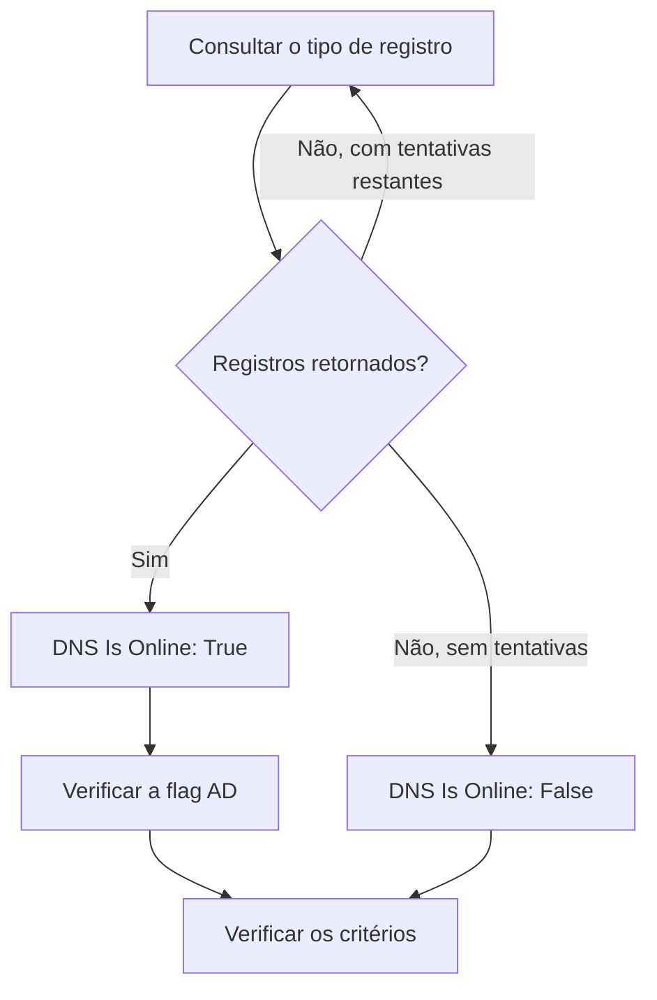

# Monitor de DNS

Um monitor de DNS consulta um registro DNS periodicamente e verifica a resposta: se o nome resolve, com que rapidez e o que os registros dizem. Use-o para perceber uma falha de DNS, um registro que mudou ou sumiu, ou um resolvedor lento, antes que seus usuários percebam.

:::cards
- [Criar o monitor](#criar-um-monitor-de-dns): Seis passos no painel.
- [Opções de configuração](#opções-de-configuração): O nome, o tipo de registro e o servidor DNS.
- [Critérios de monitoramento](#critérios-de-monitoramento): Resolução, registros, tempo de resposta e DNSSEC.
- [Solução de problemas](#solução-de-problemas): Quando o monitor e o `dig` discordam.
:::

## Como funciona

A cada verificação, uma sonda pede a um servidor DNS um tipo de registro de um nome, como os registros `A` de `example.com`. O nome está no ar quando o servidor responde com pelo menos um registro desse tipo. Uma consulta que falha, esgota o tempo limite ou não retorna nenhum registro é repetida um segundo depois, até o número de tentativas que você definir. Depois, a sonda pergunta a um resolvedor validador se a resposta traz a flag authenticated-data (AD) do DNSSEC, e o OneUptime avalia o resultado com os critérios do monitor.



Uma sonda que perdeu a própria conexão de rede não informa nenhum resultado, então não consegue marcar seu DNS como offline.

## Antes de começar

- **Uma função que possa criar monitores**: Project Owner, Project Admin, Project Member, Monitor Admin ou Monitor Member, ou uma função personalizada com a permissão Create Monitor.
- **Uma sonda que alcance o servidor DNS.** As sondas padrão do seu projeto são escolhidas para cada monitor novo. Para consultar um servidor DNS em uma rede privada, como um resolvedor interno, use uma [sonda personalizada](/docs/probe/custom-probe) dentro dessa rede.

## Criar um monitor de DNS

:::steps
### Começar um monitor novo

Vá em **Monitores** e clique em **Criar monitor**. Em **Tipo de monitor**, clique em **Mais tipos de monitor** e escolha **DNS** em **DNS Monitoring**.

### Dar um nome a ele

Digite um **Nome**, como `example.com A records`, e clique em **Próximo**.

### Informar a consulta

Digite o **Nome de domínio** a consultar, como `example.com`, e escolha o **Tipo de Registro**. Para consultar um servidor específico, informe-o em **Servidor DNS (Opcional)**; deixe vazio para usar o resolvedor da própria sonda.

### Testá-lo

Clique em **Testar monitor**, escolha uma sonda em **Selecionar Sonda** e clique em **Executar teste**. **Resultado do Teste do Monitor** mostra os registros que a sonda recebeu.

### Revisar os critérios

**Critérios do monitor** começa com os [critérios padrão](#critérios-padrão): offline quando o nome não resolve, no ar quando resolve. Para verificar o que os registros dizem, adicione um filtro **DNS Record Value** e clique em **Próximo**.

### Escolher as sondas e criar

Mantenha ou altere as **Sondas** e o **Intervalo de monitoramento** (começa em **A cada 5 minutos**) e clique em **Criar monitor**. A página do monitor se abre.
:::

## Opções de configuração

| Campo | Padrão | O que informar |
| --- | --- | --- |
| **Nome de domínio** | Nenhum | O nome a consultar, como `example.com` ou `_sip._tcp.example.com`. Para um registro `PTR`, o nome reverso, como `34.216.184.93.in-addr.arpa`. |
| **Tipo de Registro** | `A` | O tipo de registro a consultar. Veja [Tipos de registro](#tipos-de-registro). |
| **Servidor DNS (Opcional)** | O resolvedor da sonda | Um servidor DNS a consultar no lugar, como `8.8.8.8` ou `ns1.example.com`. Todos os tipos de registro, inclusive `CAA`, são perguntados a ele. |
| **Porta** (em **Mais campos**) | `53` | A porta do servidor em **Servidor DNS (Opcional)**. A verificação de DNSSEC consulta a mesma porta. |
| **Tempo limite (ms)** (em **Mais campos**) | `5000` | Quanto tempo esperar por uma resposta, em milissegundos. |
| **Tentativas** (em **Mais campos**) | `3` | Novas tentativas depois que a primeira falha. `0` significa uma única tentativa. |

### Tipos de registro

Um critério **DNS Record Value** compara o seu texto com cada registro do jeito que a sonda o escreve, então siga este formato:

| Tipo de registro | O que contém | Formato do valor, para os critérios |
| --- | --- | --- |
| `A` | Endereços IPv4 | `93.184.216.34` |
| `AAAA` | Endereços IPv6 | `2606:2800:220:1:248:1893:25c8:1946` |
| `CNAME` | O nome do qual este é um alias | `example.net` |
| `MX` | Servidores de e-mail | `10 mail.example.com` (prioridade, depois o servidor) |
| `NS` | Servidores de nomes | `ns1.example.com` |
| `TXT` | Texto, como registros SPF e de verificação | `v=spf1 include:_spf.example.com ~all` |
| `SOA` | O início de autoridade da zona | `ns1.example.com hostmaster.example.com 2024010101 7200 3600 1209600 3600` (servidor, contato, número de série, refresh, retry, expire, TTL mínimo) |
| `PTR` | O nome para o qual um endereço aponta de volta (DNS reverso) | `server1.example.com` |
| `SRV` | Serviços | `10 5 5060 sip.example.com` (prioridade, peso, porta, destino) |
| `CAA` | As autoridades certificadoras que podem emitir para o nome | `0 letsencrypt.org` (flag, depois a autoridade) |

Um registro `TXT` dividido em várias strings é unido em um único valor.

## Critérios de monitoramento

Os critérios decidem quando o nome conta como no ar, degradado ou offline, e se isso declara um incidente ou cria um alerta. Cada critério verifica um ou mais filtros:

| Filtro | Condições | O que verifica |
| --- | --- | --- |
| **DNS Is Online** | **Verdadeiro**, **Falso** | Se a consulta retornou pelo menos um registro do tipo. |
| **DNS Response Time (in ms)** | **Greater Than**, **Less Than**, **Greater Than Or Equal To**, **Less Than Or Equal To** | Quanto tempo a consulta levou. |
| **DNS Record Exists** | **Verdadeiro**, **Falso** | Se voltou algum registro do tipo. |
| **DNS Record Value** | **Contém**, **Not Contains**, **Starts With**, **Ends With**, **Equal To**, **Not Equal To** | Os valores dos registros. O filtro corresponde quando um único registro corresponde. |
| **DNSSEC Is Valid** | **Verdadeiro**, **Falso** | Se um resolvedor validador coloca a flag AD na resposta. |

**DNS Record Value** corresponde quando _qualquer_ um dos registros corresponde. Com vários registros `A`, **Equal To** `93.184.216.34` corresponde quando um deles é esse endereço, e **Not Equal To** corresponde quando um deles não é.

**DNSSEC Is Valid** pergunta ao servidor em **Servidor DNS (Opcional)**, na **Porta** dele, ou ao Google Public DNS (`8.8.8.8`) quando o campo está vazio, então o servidor que você informar deve validar DNSSEC. O filtro não tem valor, e não corresponde em nenhum sentido, quando a sonda não consegue fazer essa verificação. Para uma verificação completa de uma zona assinada, use um [monitor de DNSSEC](/docs/monitor/dnssec-monitor).

Com dois ou mais filtros, **Condição de correspondência** decide se **Todos** precisam corresponder ou se basta **Qualquer** um. As **Ações** de um critério decidem o que ele faz: mudar o status do monitor, criar um alerta, declarar um incidente, ou várias dessas coisas.

### Critérios padrão

Um monitor de DNS novo começa com dois critérios:

- **Offline** — o nome não resolve, ou não tem nenhum registro do tipo, depois de todas as novas tentativas. O monitor é marcado como **Offline** e um incidente chamado "_monitor name_ is offline" é criado. O incidente se resolve sozinho quando o nome volta a resolver.
- **No ar** — o nome resolve. O monitor é marcado como **Operacional**.

Os critérios são verificados de cima para baixo, e o primeiro que corresponde decide o que acontece. Quando nenhum corresponde, o monitor mostra o seu status padrão: **Operacional**, a menos que você escolha outro em **Mais campos**, abaixo dos critérios.

### Avaliar durante um período de tempo

**Avaliar este critério durante um período de tempo** é uma caixa de seleção sob um filtro, oferecida para **DNS Is Online** e **DNS Response Time (in ms)**. Ative-a para julgar uma janela de verificações passadas em vez da última: escolha uma agregação em **Avaliar** e uma janela, de 2 a 60 minutos, em **Nos últimos (em minutos)**.

| Agregação | Corresponde quando |
| --- | --- |
| **Média**, **Soma**, **Maximum Value**, **Minimum Value** | Esse valor, na janela, atende à condição. Só **DNS Response Time (in ms)**. |
| **All Values** | Toda verificação da janela atende à condição. |
| **Any Value** | Pelo menos uma verificação da janela atende à condição. |

**All Values** só corresponde quando a janela está de fato coberta por dados. Um monitor recém-criado, ou um cujas verificações deixaram de ser registradas, não tem histórico suficiente para dizer algo sobre os últimos N minutos, então o critério espera em vez de corresponder com a única leitura que tem. **Any Value** é a configuração para "me avise assim que uma única verificação ultrapassar o limite" e continua disparando na hora.

**Se não houver dados** decide o que acontece enquanto a janela não consegue sustentar o critério:

| Opção | O que acontece | Use para |
| --- | --- | --- |
| **Ignore** (padrão) | O critério não corresponde. | Alertas de limite comuns. |
| **Trigger** | A falta de dados conta como o problema. | Verificações em que o silêncio é, por si só, uma falha. |
| **Treat As Zero** | A janela é comparada como um único zero. | Contadores em que nenhum evento significa de fato zero. |

### Exemplos de critérios

| Objetivo | Filtro | Condição | Valor |
| --- | --- | --- | --- |
| Offline quando o nome deixa de resolver | **DNS Is Online** | **Falso** | — |
| Alertar quando o único registro `A` de um nome muda | **DNS Record Value** | **Not Equal To** | `93.184.216.34` |
| Alertar quando um registro `MX` aponta para fora do seu domínio | **DNS Record Value** | **Not Contains** | `example.com` |
| Marcar o DNS como degradado quando está lento | **DNS Response Time (in ms)** | **Greater Than** | `500` |
| Alertar quando a validação de DNSSEC falha | **DNSSEC Is Valid** | **Falso** | — |

## Solução de problemas

:::details O monitor diz offline, mas o nome resolve para mim
A sonda perguntou a outro servidor, ou por outro tipo de registro. Confira o **Tipo de Registro**: um nome que só tem um `CNAME`, ou só registros `AAAA`, não tem registro `A`. Compare com o `dig` no mesmo servidor:

```bash
dig @8.8.8.8 example.com A
```
:::

:::details Um critério Not Equal To dispara mesmo com o endereço certo presente
**DNS Record Value** corresponde quando um único registro corresponde. Com vários registros, **Not Equal To** dispara assim que um deles é diferente. Para verificar que um valor específico está entre os registros, apoie-se na ordem dos critérios, já que o primeiro que corresponde vence:

1. Mantenha no topo o critério offline padrão: **DNS Is Online** / **Falso**.
2. Abaixo dele, adicione um critério com **DNS Record Value** / **Equal To** / o valor esperado, que marque o monitor como **Operacional**.
3. Abaixo desse, adicione um critério com **DNS Is Online** / **Verdadeiro**, que marque o monitor como **Offline** e declare um incidente. Ele só corresponde a respostas que não têm o valor.
:::

:::details DNSSEC Is Valid nunca corresponde
O servidor em **Servidor DNS (Opcional)** não valida DNSSEC, então nunca coloca a flag AD, ou a sonda não conseguiu fazer a verificação. Deixe o campo vazio para validar com `8.8.8.8`, ou use um [monitor de DNSSEC](/docs/monitor/dnssec-monitor).
:::

## Próximos passos

:::cards
- [Monitor de DNSSEC](/docs/monitor/dnssec-monitor): Validar a cadeia de confiança de uma zona assinada.
- [Monitor de domínio](/docs/monitor/domain-monitor): Acompanhar o registro e o vencimento do domínio.
- [Sondas personalizadas](/docs/probe/custom-probe): Consultar servidores DNS internos a partir da sua própria rede.
- [Visão geral dos incidentes](/docs/incidents/index): O que acontece depois que o monitor declara um.
:::
