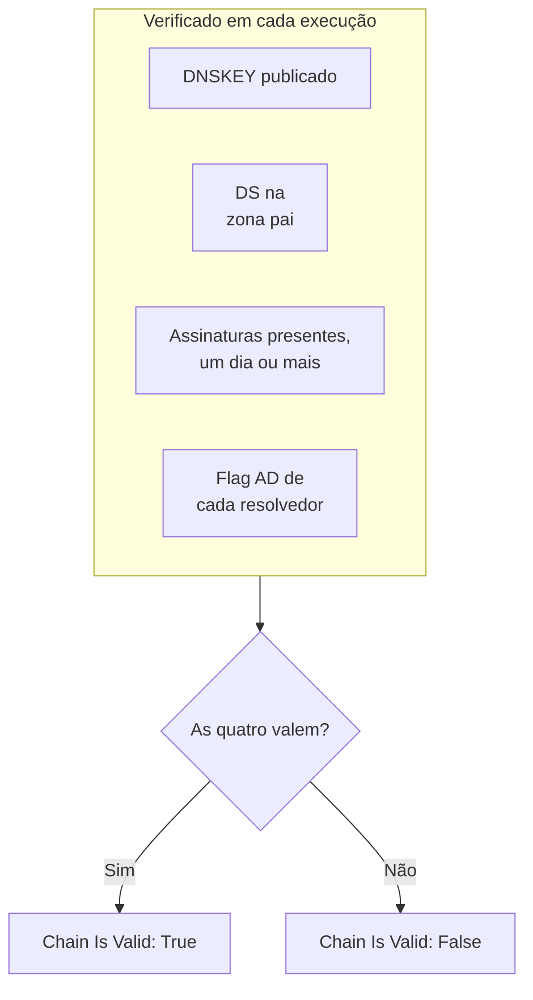

# Monitor de DNSSEC

Um monitor de DNSSEC verifica se uma zona DNS assinada ainda valida: se publica as suas chaves, se a zona pai responde por ela, se as suas assinaturas não venceram e se os resolvedores validadores a aceitam. Use-o para perceber uma cadeia de confiança quebrada antes que os resolvedores comecem a responder `SERVFAIL` para o seu domínio.

:::cards
- [Criar o monitor](#criar-um-monitor-de-dnssec): Seis passos no painel.
- [O que é verificado](#como-funciona): As verificações por trás de uma cadeia válida.
- [Critérios de monitoramento](#critérios-de-monitoramento): Validade da cadeia, chaves, registros DS, assinaturas, resolvedores e servidores de nomes.
- [Boas práticas](#boas-práticas): Limites e resolvedores que funcionam.
:::

## Como funciona

A cada verificação, uma sonda executa um conjunto de consultas DNS na zona:

| Consulta | A quem se pergunta | O que diz |
| --- | --- | --- |
| `DNSKEY` | Ao primeiro resolvedor de **Resolvedores** | Se a zona publica as suas chaves de assinatura. |
| `DS` | Ao primeiro resolvedor de **Resolvedores** | Se a zona pai publica um registro de signatário de delegação para a zona. |
| `SOA`, com registros DNSSEC | Ao primeiro resolvedor de **Resolvedores** | Se os registros da zona são assinados (o `RRSIG` que assina o registro `SOA` dela) e quando vence a assinatura mais próxima do vencimento. |
| `A`, com validação DNSSEC | A cada resolvedor de **Resolvedores** | Se cada resolvedor validador aceita a zona, o que ele mostra com a flag authenticated-data (AD). |
| `NS`, depois `SOA` | Ao primeiro resolvedor, depois a cada servidor de nomes autoritativo que ele indica | Se cada servidor de nomes serve o mesmo número de série SOA. Só quando **Verificar consistência do servidor de nomes** está ativado. |

Os resolvedores validadores verificam a cadeia de confiança a partir da raiz, então a flag AD diz que a cadeia inteira se sustenta. A cadeia conta como válida quando tudo isto vale:

Uma assinatura com menos de um dia restante já conta como quebrada, então você fica sabendo até um dia antes de os resolvedores começarem a rejeitar a zona. Uma verificação que encontra a cadeia quebrada, ou os servidores de nomes fora de sincronia, é executada de novo um segundo depois, até o número de tentativas que você definir, antes que o OneUptime avalie o resultado com os critérios do monitor. Todas as consultas de uma tentativa compartilham um prazo de três vezes o **Tempo limite (ms)**; uma tentativa que fica sem tempo informa um tempo limite esgotado, não um veredito sobre a zona.

## Antes de começar

- **Uma função que possa criar monitores**: Project Owner, Project Admin, Project Member, Monitor Admin ou Monitor Member, ou uma função personalizada com a permissão Create Monitor.
- **Uma zona assinada.** A zona precisa estar assinada, e o seu registro DS publicado na zona pai através do seu registrador.
- **DNS de saída a partir da sonda** para os resolvedores que você informar e, para a verificação de consistência dos servidores de nomes, para os servidores de nomes autoritativos da zona. As sondas padrão do seu projeto são escolhidas para cada monitor novo.

## Criar um monitor de DNSSEC

:::steps
### Começar um monitor novo

Vá em **Monitores** e clique em **Criar monitor**. Em **Tipo de monitor**, clique em **Mais tipos de monitor** e escolha **DNSSEC** em **DNS Monitoring**.

### Dar um nome a ele

Digite um **Nome**, como `example.com DNSSEC`, e clique em **Próximo**.

### Informar a zona

Em **Zona (Nome de Domínio)**, digite a zona a validar, como `example.com`. Mantenha os **Resolvedores** padrão, ou informe os seus, separados por vírgulas. Deixe **Verificar consistência do servidor de nomes** ativado, a menos que a sua rede bloqueie DNS para servidores arbitrários.

### Testá-lo

Clique em **Testar monitor**, escolha uma sonda em **Selecionar Sonda** e clique em **Executar teste**. **Resultado do Teste do Monitor** mostra o que cada verificação encontrou.

### Revisar os critérios

**Critérios do monitor** começa com os [critérios padrão](#critérios-padrão): offline quando a cadeia está quebrada, no ar quando é válida. Para ser avisado antes de as assinaturas vencerem, adicione um critério (veja [Boas práticas](#boas-práticas)) e clique em **Próximo**.

### Escolher as sondas e criar

Mantenha ou altere as **Sondas** e o **Intervalo de monitoramento** (começa em **A cada 5 minutos**) e clique em **Criar monitor**. A página do monitor se abre.
:::

## Opções de configuração

| Campo | Padrão | O que informar |
| --- | --- | --- |
| **Zona (Nome de Domínio)** | Nenhum | A zona a validar, como `example.com`. |
| **Resolvedores** | `1.1.1.1, 8.8.8.8, 9.9.9.9` | Resolvedores validadores a consultar, separados por vírgulas. Cada um precisa retornar a flag AD para que a cadeia conte como válida. |
| **Verificar consistência do servidor de nomes** | Ativado | Consultar diretamente cada servidor de nomes autoritativo e comparar os números de série SOA deles. Desative se a sua rede bloquear DNS de saída para servidores arbitrários. |
| **Aviso de expiração da assinatura (dias)** (em **Mais campos**) | `7` | Salvo com o monitor. O filtro **DNSSEC Signature Expires In Days** usa o valor que você der a ele no critério, então defina o seu limite lá. |
| **Tempo limite (ms)** (em **Mais campos**) | `10000` | Quanto tempo esperar por cada consulta DNS, em milissegundos. Uma tentativa pode levar até três vezes isso no total. |
| **Tentativas** (em **Mais campos**) | `3` | Novas tentativas depois que a primeira falha. `0` significa uma única tentativa. |

## Critérios de monitoramento

Os critérios decidem quando a zona conta como no ar, degradada ou offline, e se isso declara um incidente ou cria um alerta. Cada critério verifica um ou mais filtros:

| Filtro | Condições | O que verifica |
| --- | --- | --- |
| **DNSSEC Chain Is Valid** | **Verdadeiro**, **Falso** | As quatro verificações acima valem: chaves publicadas, DS na zona pai, assinaturas presentes com um dia ou mais pela frente, e a flag AD de cada resolvedor. |
| **DNSSEC DNSKEY Record Exists** | **Verdadeiro**, **Falso** | A zona publica pelo menos um registro DNSKEY. |
| **DNSSEC DS Record Exists At Parent** | **Verdadeiro**, **Falso** | A zona pai publica um registro DS para a zona. |
| **DNSSEC Signature Expires In Days** | **Greater Than**, **Less Than**, **Greater Than Or Equal To**, **Less Than Or Equal To** | Os dias inteiros até vencer a assinatura (RRSIG) mais próxima do vencimento. |
| **DNSSEC Resolver Consensus (AD Flag)** | **Verdadeiro**, **Falso** | Cada resolvedor de **Resolvedores** retorna a flag AD. |
| **DNSSEC Nameservers Are Consistent** | **Verdadeiro**, **Falso** | Cada servidor de nomes autoritativo responde com o mesmo número de série SOA. Sempre **Verdadeiro** enquanto **Verificar consistência do servidor de nomes** estiver desativado. |

Com dois ou mais filtros, **Condição de correspondência** decide se **Todos** precisam corresponder ou se basta **Qualquer** um. As **Ações** de um critério decidem o que ele faz: mudar o status do monitor, criar um alerta, declarar um incidente, ou várias dessas coisas.

### Critérios padrão

Um monitor de DNSSEC novo começa com dois critérios:

- **Cadeia quebrada** — **DNSSEC Chain Is Valid** é **Falso**. O monitor é marcado como **Offline** e um incidente chamado "_monitor name_ DNSSEC chain is broken" é criado. O incidente se resolve sozinho assim que a cadeia volta a ser válida.
- **Cadeia válida** — o monitor é marcado como **Operacional**.

Os critérios são verificados de cima para baixo, e o primeiro que corresponde decide o que acontece. Quando nenhum corresponde, o monitor mostra o seu status padrão: **Operacional**, a menos que você escolha outro em **Mais campos**, abaixo dos critérios.

Os critérios padrão não acompanham sozinhos o vencimento das assinaturas nem a consistência dos servidores de nomes. Adicione critérios para isso, como abaixo.

### Exemplos de critérios

| Objetivo | Filtro | Condição | Valor |
| --- | --- | --- | --- |
| Offline quando a cadeia está quebrada (um padrão) | **DNSSEC Chain Is Valid** | **Falso** | — |
| Avisar antes de as assinaturas vencerem | **DNSSEC Signature Expires In Days** | **Less Than** | `7` |
| Perceber uma delegação que perdeu o registro DS | **DNSSEC DS Record Exists At Parent** | **Falso** | — |
| Perceber resolvedores que discordam | **DNSSEC Resolver Consensus (AD Flag)** | **Falso** | — |
| Perceber servidores de nomes fora de sincronia | **DNSSEC Nameservers Are Consistent** | **Falso** | — |

## Boas práticas

1. **Escolha resolvedores sempre alcançáveis.** Cada resolvedor precisa retornar a flag AD para que a cadeia conte como válida, então um resolvedor que a sonda não alcança faz a verificação falhar quando as tentativas acabam. Os padrão, `1.1.1.1`, `8.8.8.8` e `9.9.9.9`, são operados por três operadores diferentes, o que também pega uma zona que valida em um resolvedor mas não em outro.
2. **Seja avisado antes de as assinaturas vencerem.** Os assinantes reassinam uma zona antes de as assinaturas vencerem, então uma assinatura perto do vencimento significa que a reassinatura parou. Adicione um critério com **DNSSEC Signature Expires In Days** / **Less Than** / `7` que crie um alerta, e um segundo em `2` que declare um incidente. Arraste os dois para cima do critério que marca a cadeia como válida, o de `2` dias primeiro, porque o primeiro critério que corresponde vence. Escolha limites menores do que o tempo que o seu assinante costuma deixar numa assinatura antes de reassinar, para que fiquem quietos enquanto a reassinatura funciona.
3. **Monitore cada zona assinada.** Inclua o domínio raiz, os subdomínios assinados e qualquer zona delegada a outro operador.
4. **Mantenha a verificação de consistência dos servidores de nomes ativada,** e adicione um critério para ela. Ela pega um secundário que parou de receber transferências do primário, algo que a validação DNSSEC sozinha pode deixar passar.

## Solução de problemas

:::details A cadeia aparece como quebrada, mas a zona valida com o `dig`
Um dos resolvedores de **Resolvedores** não retornou a flag AD: ele não estava alcançável a partir da sonda, ou não valida DNSSEC. A tabela **Resolver Checks**, em **Resultado do Teste do Monitor** e no resumo de cada verificação, mostra a resposta e o erro de cada resolvedor. Remova os resolvedores que a sonda não alcança, e informe só resolvedores validadores.
:::

:::details Os servidores de nomes aparecem como inconsistentes logo depois de uma mudança
Os secundários podem ficar atrás do primário por um tempo depois que a zona muda. A tabela **Nameserver Consistency** no resumo da verificação mostra o número de série SOA de cada servidor de nomes. Se um continua atrás, esse secundário parou de receber transferências. Se todos os servidores de nomes mostram um erro, a sonda pode estar impedida de consultá-los diretamente: desative **Verificar consistência do servidor de nomes**.
:::

:::details A verificação informa um tempo limite esgotado
Todas as consultas de uma tentativa compartilham três vezes o **Tempo limite (ms)**. Um resolvedor lento ou inalcançável consome esse tempo; remova-o de **Resolvedores**, ou aumente o tempo limite.
:::

## Próximos passos

:::cards
- [Monitor de DNS](/docs/monitor/dns-monitor): Verificar se um nome resolve, e o que os registros dele dizem.
- [Monitor de domínio](/docs/monitor/domain-monitor): Acompanhar o registro e o vencimento do domínio.
- [Monitor de certificado SSL](/docs/monitor/ssl-certificate-monitor): Acompanhar os certificados servidos no domínio.
- [Visão geral dos incidentes](/docs/incidents/index): O que acontece depois que o monitor declara um.
:::
