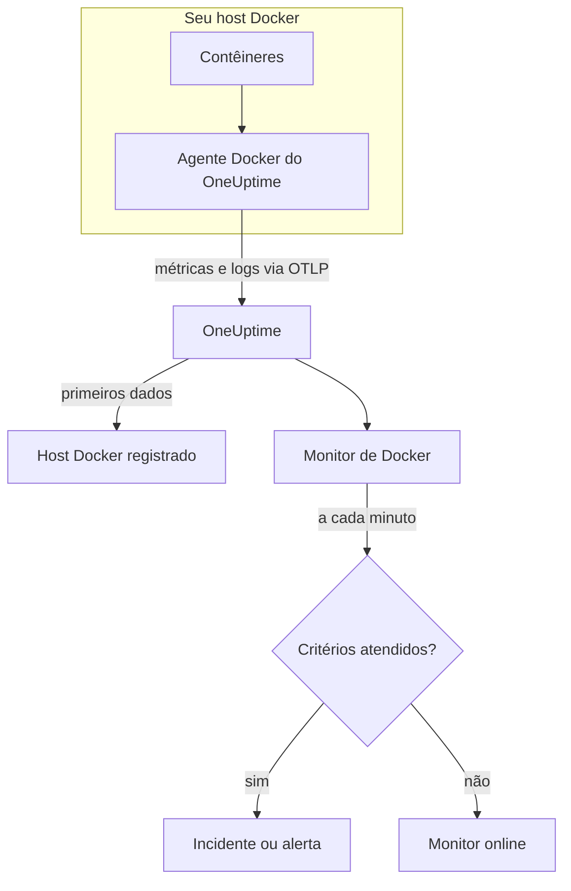

# Monitor de Docker

Um monitor de Docker acompanha os contêineres de um host Docker e avisa você quando um contêiner esquenta demais, fica sem memória ou entra em loop de reinícios. Ele lê as métricas que o agente Docker do OneUptime envia do host, então nada é sondado de fora: instale o agente e depois crie o monitor a partir de um modelo ou da sua própria consulta.

:::cards
- [Criar o monitor](#criar-um-monitor-de-docker): Seis passos no painel.
- [Modelos](#modelos-de-alerta-prontos): Seis alertas prontos, um incidente por contêiner.
- [Métricas](#métricas-coletadas): O que o agente coleta e o que cada métrica significa.
- [Logs](#logs-coletados): Os logs dos contêineres e o driver de log de que eles precisam.
:::

## Como funciona

O agente Docker do OneUptime é executado como contêiner no host. A cada 30 segundos, ele lê as estatísticas dos contêineres pela API do Docker Engine, acompanha os arquivos de log dos contêineres e envia os dois para o OneUptime via OTLP. Os primeiros dados de um host o registram no OneUptime.

Um monitor de Docker está vinculado a um host. A cada minuto, ele executa sua consulta sobre as métricas dos contêineres desse host e compara o resultado com seus critérios.



## Antes de começar

- **Instale o agente Docker** no host. O [guia do agente Docker](/docs/telemetry/docker-host) cobre a instalação, a atualização e a verificação.
- **Verifique se o host está registrado.** Ele aparece em **Produtos → Infraestrutura → Docker → Todos os hosts**, com o nome do `DOCKER_HOST_NAME` do agente, assim que chegam os primeiros dados.
- **Para os logs dos contêineres**, execute os contêineres com o driver de log `json-file` do Docker. Consulte [Requisito do driver de log](#requisito-do-driver-de-log).

## Criar um monitor de Docker

:::steps
### Começar um monitor novo

Acesse **Monitores** e clique em **Criar monitor**.

### Escolher Docker Container

Em **Tipo de monitor**, clique em **Mais tipos de monitor** e escolha **Docker Container** em **Infraestrutura**, ou digite `docker` na caixa de busca. Informe um **Nome** – ele é usado nos títulos de incidentes e alertas – e clique em **Próximo**.

### Escolher o host

Em **Configuração do monitor Docker**, escolha o host em **Host Docker**. Todo host que enviou dados está na lista.

### Escolher o que monitorar

Escolha uma das três abas:

- **Quick Setup** – clique em um [modelo](#modelos-de-alerta-prontos). Ele define a métrica, a agregação, o intervalo de tempo e os limites, e substitui os critérios abaixo pelos dele. Você ainda pode mudar o **Intervalo de tempo**.
- **Custom Metric** – escolha uma métrica em **Métrica do Docker** e depois defina **Agregação** e **Intervalo de tempo**. **Nome do contêiner** e **Imagem do contêiner** a restringem a alguns contêineres.
- **Avançado** – monte você mesmo consultas e fórmulas em **Selecionar Métricas**. Use **Group by** `resource.container.name` para avaliar cada contêiner separadamente.

### Revisar os critérios

Abra cada critério em **Critérios do monitor** e confira sua **Métrica**, **Agregação**, **Condição** e **Threshold**. Um modelo os preenche. Com **Custom Metric** ou **Avançado**, o monitor começa com os [critérios padrão](#critérios-padrão), que só percebem uma métrica caindo para zero, então defina o seu próprio limite.

### Criar o monitor

Clique em **Criar monitor**. O OneUptime abre a página do monitor e o avalia a cada minuto. Os incidentes e alertas que ele gera também aparecem nas páginas **Incidentes** e **Alertas** do host.
:::

> [!TIP]
> Para configurar vários modelos de uma vez, abra o host em **Produtos → Infraestrutura → Docker** e vá para **Recommendations**. Escolha os modelos que quiser, escolha quem é acionado, e o OneUptime cria um monitor por modelo.

## Configurações do monitor

| Campo | Aba | O que faz |
| --- | --- | --- |
| **Host Docker** | Todas | Obrigatório. Restringe cada consulta ao `resource.host.name` do host. O OneUptime também adiciona `resource.container.runtime = docker` a cada consulta. |
| **Métrica do Docker** | Custom Metric | Uma métrica do catálogo do agente, agrupada em CPU, memória, rede, E/S de bloco e contêiner. |
| **Nome do contêiner** | Custom Metric, Avançado | Opcional. Correspondência exata com `resource.container.name`, por exemplo `my-container`. |
| **Imagem do contêiner** | Custom Metric, Avançado | Opcional. Correspondência exata com `resource.container.image.name`, por exemplo `nginx:latest`. |
| **Agregação** | Custom Metric | Como as amostras são combinadas: **Média**, **Máximo**, **Mínimo**, **Soma** ou **Contagem**. Começa na agregação usual da métrica. |
| **Intervalo de tempo** | Todas | A janela móvel que a consulta lê, de **Past 1 Minute** a **Past 365 Days**. Um monitor novo começa em **Past 1 Minute**; os modelos definem a sua. |
| **Selecionar Métricas** | Avançado | O construtor de consultas: **Métrica**, **Aggregate by**, **Filter by attributes**, **Group by**, além de **Adicionar métrica** e **Adicionar fórmula** para combinar consultas. |

## Modelos de alerta prontos

**Quick Setup** oferece seis modelos. Cada um monta um monitor completo: uma consulta agrupada por `resource.container.name`, um critério que dispara e outro que se recupera. Cada contêiner é avaliado separadamente, então um contêiner ocupado não esconde outro, e cada contêiner que ultrapassa o limite recebe seu próprio incidente e seu próprio alerta. Os limites são pontos de partida que você pode editar.

Salvo indicação contrária na tabela, um critério só dispara quando a condição vale em todos os minutos da sua janela, e se recupera 10% além do limite para que um valor oscilando na linha não fique mudando de estado.

| Modelo | Gravidade | Monitora | Dispara quando | Recupera quando |
| --- | --- | --- | --- | --- |
| High Container CPU Usage | Warning | `container.cpu.utilization`, Max por contêiner, últimos 5 minutos | Acima de 80 (% de um núcleo) | Em 72 ou menos |
| High Container Memory Usage | Warning | `container.memory.percent`, Max por contêiner, últimos 5 minutos | Acima de 85% | Em 76,5% ou menos |
| Container Restart Loop | Crítico | Crescimento de `container.restarts` por contêiner, últimos 15 minutos | Mais de 3 reinícios na janela (Soma) | 2,7 ou menos |
| Container CPU Throttling | Warning | Crescimento de `container.cpu.throttling_data.throttled_time` em ms por contêiner, últimos 5 minutos | Mais de 1000 ms na janela (Soma) | 900 ms ou menos |
| High Container Process Count | Warning | `container.pids.count`, Max por contêiner, últimos 5 minutos | Acima de 2000 | Em 1800 ou menos |
| Container Down (Low Uptime) | Crítico | `container.uptime`, Min por contêiner, último 1 minuto | Igual a 0 | Acima de 0 |

**Gravidade** é o rótulo que o seletor mostra. O incidente e o alerta que um modelo cria começam com a gravidade de incidente e de alerta mais alta do seu projeto; altere-as nos critérios.

> [!NOTE]
> `container.cpu.utilization` é o número que o `docker stats` imprime: 100% é um núcleo de CPU inteiro, não o host inteiro, então um contêiner usando dois núcleos marca 200. Em um host com vários núcleos, o limite de 80 é um orçamento de CPU, não uma fatia da máquina.

> [!NOTE]
> `container.memory.percent` divide pelo limite de memória do contêiner quando há um definido e, caso contrário, pela memória total **do host**. Verifique se o contêiner foi iniciado com `--memory` antes de tratar uma violação como um encerramento iminente por falta de memória.

> [!WARNING]
> `container.restarts` e `container.cpu.throttling_data.throttled_time` só crescem, então esses dois modelos alertam com base em quanto eles cresceram na janela: uma consulta de Máximo e uma de Mínimo por minuto, subtraídas por uma fórmula e somadas. Com a coleta do agente a cada 30 segundos, isso enxerga cerca de metade da atividade real, e os limites já levam isso em conta. Se você aumentar o `collection_interval` do agente para 60 segundos ou mais, cada minuto terá uma única amostra e os dois modelos deixarão de alertar.

> [!CAUTION]
> **Container Down (Low Uptime)** não consegue pegar um contêiner que para e continua parado. O agente só informa contêineres em execução, então um contêiner parado não envia dado algum e seu tempo de atividade nunca marca 0. Para um serviço que precisa ficar no ar, monitore também o que ele serve – por exemplo, com um [monitor de API](/docs/monitor/api-monitor).

## Métricas coletadas

O agente usa o receptor `docker_stats` do OpenTelemetry no socket do Docker, a cada 30 segundos. As métricas de cada contêiner trazem sua identidade como atributos de recurso: `resource.container.name`, `resource.container.image.name`, `resource.container.id`, `resource.container.runtime` (`docker`) e `resource.host.name`.

### CPU

| Métrica | Descrição |
| --- | --- |
| `container.cpu.utilization` | Uso de CPU, em que 100% é um núcleo de CPU inteiro (a coluna CPU% do `docker stats`). |
| `container.cpu.usage.total` | Tempo de CPU usado desde que o contêiner iniciou, em nanossegundos. Um contador de toda a vida útil. |
| `container.cpu.throttling_data.throttled_time` | Nanossegundos em que o contêiner foi limitado pelo seu limite de CPU desde que iniciou. Um contador de toda a vida útil. |
| `container.cpu.throttling_data.throttled_periods` | Períodos de limitação desde que o contêiner iniciou. Um contador de toda a vida útil. |

### Memória

| Métrica | Descrição |
| --- | --- |
| `container.memory.usage.total` | Memória em uso, em bytes. |
| `container.memory.usage.limit` | Limite de memória, em bytes. |
| `container.memory.percent` | Uso de memória como porcentagem do limite do contêiner, ou da memória total do host quando o contêiner não tem limite. |

### Rede

| Métrica | Descrição |
| --- | --- |
| `container.network.io.usage.rx_bytes` | Bytes recebidos. Um contador de toda a vida útil. |
| `container.network.io.usage.tx_bytes` | Bytes enviados. Um contador de toda a vida útil. |

### E/S de bloco

| Métrica | Descrição |
| --- | --- |
| `container.blockio.io_service_bytes_recursive.read` | Bytes lidos de dispositivos de bloco. |
| `container.blockio.io_service_bytes_recursive.write` | Bytes gravados em dispositivos de bloco. |

### Contêiner

| Métrica | Descrição |
| --- | --- |
| `container.uptime` | Segundos desde que o contêiner iniciou. Só contêineres em execução a informam. |
| `container.restarts` | Quantas vezes o contêiner reiniciou desde que foi criado. Um contador de toda a vida útil. |
| `container.pids.count` | Tarefas no contêiner. O controlador pids do cgroup conta threads além de processos. |

A lista **Métrica do Docker** também oferece `container.cpu.usage.percpu`, `container.memory.rss`, `container.memory.cache` e os contadores de pacotes de rede. A configuração do agente distribuída não os ativa, então confira a página **Métricas** do host antes de depender deles. `container.cpu.throttling_data.throttled_periods` não está na lista; consulte-a em **Avançado**.

## Critérios de monitoramento

Um critério compara uma das consultas ou fórmulas do monitor com um limite. Os critérios de um monitor de Docker não têm **Tipo de filtro**: cada regra verifica o valor da métrica, com estes campos.

| Campo | O que faz |
| --- | --- |
| **Métrica** | A consulta ou fórmula a verificar, pelo nome da variável. |
| **Agregação** | Como os valores da janela viram uma única resposta: **Média**, **Soma**, **Maximum Value**, **Minimum Value**, **All Values** (todos os valores precisam corresponder) ou **Any Value** (basta um). |
| **Condição** | **Greater Than**, **Less Than**, **Greater Than Or Equal To**, **Less Than Or Equal To** ou **Equal To** – ou uma condição de anomalia: **Anomalously High**, **Anomalously Low** ou **Anomalous**. |
| **Threshold** | O valor com que comparar. Uma lista de unidades fica ao lado quando a métrica tem unidade. Não aparece em condições de anomalia. |
| **Sensibilidade** | Só condições de anomalia. **Baixo** (4σ), **Médio** (3σ, o padrão) ou **Alto** (2σ). |
| **Janela de linha de base** | Só condições de anomalia. 14 dias (o padrão), 28, 60 ou 90 dias de histórico. |
| **Se não houver dados** | Em **Mais campos**. O que acontece quando a janela não tem amostras: **Ignore** (o padrão), **Treat As Zero** ou **Trigger**. |

As condições de anomalia comparam cada valor com a mesma hora da semana na linha de base. Elas ficam em um estado "Learning", e não geram nada, até a janela de linha de base ter histórico suficiente.

Cada critério também diz o que fazer quando corresponde: mudar o status do monitor, criar um alerta ou declarar um incidente. Os critérios são verificados de cima para baixo, e o primeiro que corresponde decide.

### Critérios padrão

Um monitor que você não cria a partir de um modelo começa com dois critérios:

| Ordem | Critério | Corresponde quando | Então |
| --- | --- | --- | --- |
| 1 | Check if _monitor name_ is offline | Qualquer valor da primeira consulta é `0` | Marca o monitor como **Offline** e declara o incidente "_monitor name_ is offline", que se resolve sozinho quando o monitor se recupera. |
| 2 | Check if _monitor name_ is online | Qualquer valor está acima de `0` | Marca o monitor como **Operacional**. |

> [!IMPORTANT]
> O silêncio não corresponde a nenhum dos dois critérios: um host que para de enviar dados deixa o monitor como estava. Para ser avisado quando os dados param, defina **Se não houver dados** como **Trigger** em um critério. O tempo em que o próprio OneUptime não estava recebendo nunca é ausência de dados: uma verificação cuja janela contém esse tempo espera no lugar, como explica [Quando o OneUptime não recebe dados](/docs/monitor/when-oneuptime-is-not-receiving).

## Logs coletados

O agente também acompanha o arquivo `*-json.log` de cada contêiner e envia cada linha como um registro de log do OpenTelemetry com:

| Campo | Valor |
| --- | --- |
| `resource.host.name` | O host, de `DOCKER_HOST_NAME`. |
| `resource.container.id` | O ID completo do contêiner. |
| `resource.container.runtime` | Sempre `docker`. |
| `attributes["log.iostream"]` | `stdout` ou `stderr`. |
| `severityText` / `severityNumber` | Lidos de uma palavra-chave de nível onde houver um nível na linha (`[ERROR]`, `app.INFO:`, `{"level":"warn"}`, `level=error`). Uma linha sem nível recorre ao seu fluxo: `stderr` é `ERROR`, `stdout` é `INFO`. |
| `body` | A linha que o contêiner escreveu. Linhas que começam com espaço ou com um colchete de fechamento, como as linhas de um stack trace, são unidas à linha anterior. |
| `time` | O carimbo de data/hora do daemon do Docker para a linha. |

Os logs aparecem na página **Registros** do host e na página de cada contêiner.

### Requisito do driver de log

O agente só consegue ler os logs de contêineres que usam o driver de log `json-file` do Docker. Ele é o padrão do Docker, mas um contêiner ou o daemon inteiro pode usar outro:

| Driver | O que o agente vê |
| --- | --- |
| `json-file` | Todas as linhas. |
| `local` | Nada: o arquivo é binário, e o agente não consegue analisá-lo. |
| `journald`, `syslog`, `fluentd`, `gelf`, `awslogs`, `splunk`, … | Nada: os logs vão para outro lugar, então não há arquivo para acompanhar. |
| `none` | Nada: os logs são descartados. |

Verifique o driver de um contêiner e o padrão do daemon:

```bash
docker inspect <container> --format '{{.HostConfig.LogConfig.Type}}'
docker info --format '{{.LoggingDriver}}'
```

Mude para `json-file`. O Docker define o driver de log de um contêiner quando o contêiner é criado, então recrie cada contêiner depois da mudança – um reinício mantém o driver antigo.

:::tabs
@tab Docker Compose
Defina o driver em cada serviço, com rotação:

```yaml title="docker-compose.yml"
services:
  my-app:
    image: my-app:latest
    logging:
      driver: "json-file"
      options:
        max-size: "100m"
        max-file: "5"
```

Depois recrie o serviço:

```bash
docker compose up -d --force-recreate <service>
```
@tab Daemon do Docker
Torne `json-file` o padrão para todo contêiner criado depois:

```json title="/etc/docker/daemon.json"
{
  "log-driver": "json-file",
  "log-opts": {
    "max-size": "100m",
    "max-file": "5"
  }
}
```

Reinicie o daemon do Docker e depois remova e recrie cada contêiner:

```bash
docker rm -f <container>
docker run ... <image>
```
:::

## Solução de problemas

:::details O host não aparece na lista Host Docker
Os hosts se registram sozinhos a partir dos dados do agente. Verifique se o contêiner do agente está em execução e se o host aparece em **Produtos → Infraestrutura → Docker → Todos os hosts**. O [guia do agente Docker](/docs/telemetry/docker-host) traz as verificações a executar no host.
:::

:::details As métricas chegam, mas a página Registros está vazia
Quase certamente os contêineres não estão usando o driver de log `json-file`. Verifique-os com os comandos de [Requisito do driver de log](#requisito-do-driver-de-log), mude os contêineres cujos logs você quer e recrie-os.
:::

:::details O agente registra "no files match the configured criteria"
O agente procura `/var/lib/docker/containers/*/*-json.log` e não encontrou nada. Ou nenhum contêiner do host usa `json-file`, ou a montagem `/var/lib/docker/containers` do agente (`-v /var/lib/docker/containers:/var/lib/docker/containers:ro`) está faltando ou vazia, ou o agente roda no Docker Desktop para macOS, cujos arquivos de contêiner ficam dentro da VM Linux dele.
:::

:::details Os dados chegam com o nome de host errado
O OneUptime identifica um host por `resource.host.name`, que o agente obtém de `DOCKER_HOST_NAME`. Mudar `DOCKER_HOST_NAME` depois dos primeiros dados cria um segundo host em vez de renomear o primeiro, e um monitor continua vinculado ao nome com que foi criado.
:::

:::details Um alerta de CPU nunca dispara
Agrupe a consulta por `resource.container.name` e agregue com **Máximo**, como faz o modelo **High Container CPU Usage**. Uma média de todos os contêineres de um host ocupado é puxada para baixo pelos ociosos. Lembre-se de que 100% significa um núcleo inteiro, então um contêiner que pode usar vários núcleos precisa de um limite mais alto.
:::

:::details O modelo de loop de reinícios ou de limitação parou de alertar
Os dois medem quanto um contador cresceu entre duas amostras do mesmo minuto. Se o `collection_interval` do agente for de 60 segundos ou mais, cada minuto terá uma única amostra, o crescimento sempre marcará 0 e nenhum dos dois modelos disparará. Mantenha o padrão do agente, de 30 segundos.
:::

## Próximos passos

:::cards
- [Agente Docker](/docs/telemetry/docker-host): Instalar, atualizar e solucionar problemas do agente que este monitor lê.
- [Monitor de Podman](/docs/monitor/podman-monitor): O mesmo monitor para hosts Podman.
- [Monitor de Docker Swarm](/docs/monitor/docker-swarm-monitor): Monitorar as tarefas de um cluster Swarm.
- [Visão geral dos incidentes](/docs/incidents/index): O que acontece depois que um critério declara um incidente.
:::
