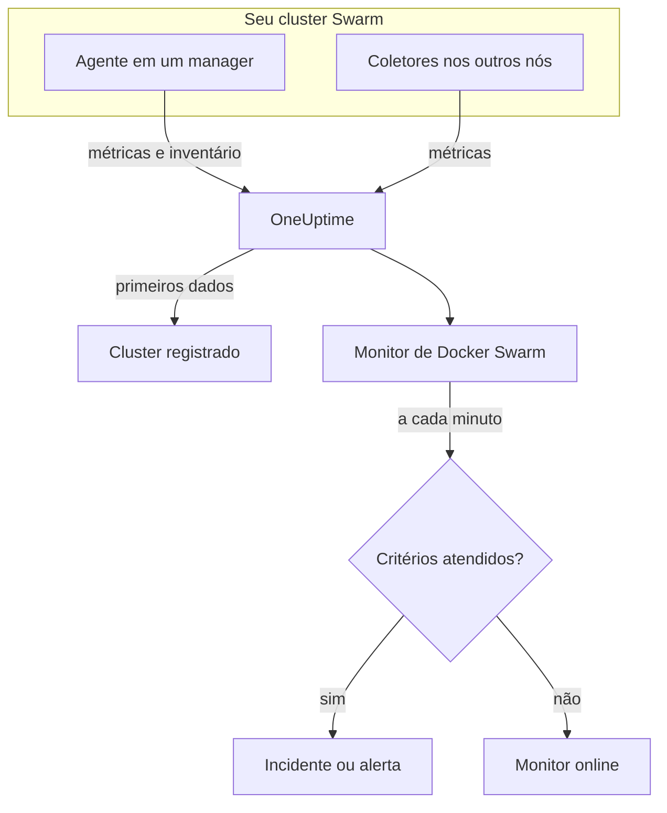

# Monitor de Docker Swarm

Um monitor de Docker Swarm acompanha os contêineres por trás das tarefas de serviço de um cluster Swarm e avisa você quando uma tarefa reinicia, esquenta demais ou fica sem memória. Ele lê as métricas de contêineres que o agente Docker Swarm do OneUptime envia, então nada é sondado de fora: instale o agente e depois crie o monitor a partir de um modelo ou da sua própria consulta.

:::cards
- [Criar o monitor](#criar-um-monitor-de-docker-swarm): Seis passos no painel.
- [Modelos](#modelos-de-alerta-prontos): Quatro alertas prontos, um incidente por tarefa.
- [Métricas](#métricas-coletadas): As métricas de contêiner com que você pode alertar.
- [Filtros](#configurações-do-monitor): Restringir um monitor a um serviço, uma tarefa ou uma imagem.
:::

## Como funciona

O agente Docker Swarm do OneUptime é executado em um nó manager. O coletor dele lê as estatísticas dos contêineres no daemon do Docker desse nó a cada 30 segundos e marca cada lote com o nome do cluster, `docker.swarm.cluster.name`. Um pequeno leitor de inventário ao lado dele lê os nós, serviços e tarefas do cluster pela API do Swarm a cada 5 minutos. Os primeiros dados registram o cluster no OneUptime.

O coletor só vê os contêineres do nó em que roda. Para ter métricas de todos os nós, execute o coletor em cada nó com o mesmo `DOCKER_SWARM_CLUSTER_NAME`.

Um monitor de Docker Swarm está vinculado a um cluster. A cada minuto, ele executa sua consulta sobre as métricas dos contêineres desse cluster e compara o resultado com seus critérios.

## Antes de começar

- **Instale o agente Docker Swarm** em um nó manager. O [guia do agente Docker Swarm](/docs/telemetry/docker-swarm) cobre a instalação e a atualização, e como executar o coletor nos outros nós.
- **Verifique se o cluster está registrado.** Ele aparece em **Produtos → Infraestrutura → Docker Swarm → Todos os clusters**, com o nome do `DOCKER_SWARM_CLUSTER_NAME` do agente, assim que chegam os primeiros dados.

## Criar um monitor de Docker Swarm

:::steps
### Começar um monitor novo

Acesse **Monitores** e clique em **Criar monitor**.

### Escolher Docker Swarm

Em **Tipo de monitor**, clique em **Mais tipos de monitor** e escolha **Docker Swarm** em **Infraestrutura**, ou digite `swarm` na caixa de busca. Informe um **Nome** – ele é usado nos títulos de incidentes e alertas – e clique em **Próximo**.

### Escolher o cluster

Em **Docker Swarm Monitor Configuration**, escolha o cluster em **Docker Swarm Cluster**. Todo cluster que enviou dados está na lista.

### Escolher o que monitorar

Escolha uma das três abas:

- **Quick Setup** – clique em um [modelo](#modelos-de-alerta-prontos). Ele define a métrica, a agregação, o intervalo de tempo e os limites, e substitui os critérios abaixo pelos dele. Você ainda pode mudar o **Intervalo de tempo**.
- **Custom Metric** – escolha uma métrica em **Docker Swarm Metric** e depois defina **Agregação** e **Intervalo de tempo**. Os [filtros](#configurações-do-monitor) a restringem a algumas tarefas.
- **Avançado** – monte você mesmo consultas e fórmulas em **Selecionar Métricas**. Use **Group by** `resource.container.name` para avaliar cada tarefa separadamente.

### Revisar os critérios

Abra cada critério em **Critérios do monitor** e confira sua **Métrica**, **Agregação**, **Condição** e **Threshold**. Um modelo os preenche. Com **Custom Metric** ou **Avançado**, o monitor começa com os [critérios padrão](#critérios-padrão), que só percebem uma métrica caindo para zero, então defina o seu próprio limite.

### Criar o monitor

Clique em **Criar monitor**. O OneUptime abre a página do monitor e o avalia a cada minuto. Os incidentes e alertas que ele gera também aparecem nas páginas **Incidentes** e **Alertas** do cluster.
:::

> [!TIP]
> Para configurar vários modelos de uma vez, abra o cluster em **Produtos → Infraestrutura → Docker Swarm** e vá para **Recommendations**. Escolha os modelos que quiser, escolha quem é acionado, e o OneUptime cria um monitor por modelo.

## Configurações do monitor

| Campo | Aba | O que faz |
| --- | --- | --- |
| **Docker Swarm Cluster** | Todas | Obrigatório. Restringe cada consulta a `resource.docker.swarm.cluster.name`. É o único atributo de recurso que o agente aplica, então o monitor não adiciona filtro de `container.runtime` nem de `host.name`. |
| **Nome do serviço** | Custom Metric, Avançado | Opcional. Correspondência exata com `docker.swarm.service.name`, por exemplo `web`. |
| **Nome do nó** | Custom Metric, Avançado | Opcional. Correspondência exata com `docker.swarm.node.name`, por exemplo `swarm-node-1`. |
| **Nome do contêiner** | Custom Metric, Avançado | Opcional. Correspondência exata com `resource.container.name`. O contêiner de uma tarefa se chama `<service>.<slot>.<taskid>`, por exemplo `web.1.abc123`. |
| **Imagem do contêiner** | Custom Metric, Avançado | Opcional. Correspondência exata com `resource.container.image.name`, por exemplo `nginx:latest`. |
| **Docker Swarm Metric** | Custom Metric | Uma métrica do [catálogo](#métricas-coletadas). |
| **Agregação** | Custom Metric | Como as amostras são combinadas: **Média**, **Máximo**, **Mínimo**, **Soma** ou **Contagem**. Começa na agregação usual da métrica. |
| **Intervalo de tempo** | Todas | A janela móvel que a consulta lê, de **Past 1 Minute** a **Past 365 Days**. Um monitor novo começa em **Past 1 Minute**; os modelos definem a sua. |
| **Selecionar Métricas** | Avançado | O construtor de consultas: **Métrica**, **Aggregate by**, **Filter by attributes**, **Group by**, além de **Adicionar métrica** e **Adicionar fórmula** para combinar consultas. |

> [!WARNING]
> O agente distribuído ainda não define `docker.swarm.service.name` nem `docker.swarm.node.name`, então um monitor com **Nome do serviço** ou **Nome do nó** preenchido não encontra dados. Restrinja por **Imagem do contêiner** no lugar, ou agrupe por `resource.container.name`.

## Modelos de alerta prontos

**Quick Setup** oferece quatro modelos. Cada um monta um monitor completo: uma consulta agrupada por `resource.container.name`, um critério que dispara e outro que se recupera. Cada tarefa é avaliada separadamente e recebe seu próprio incidente e seu próprio alerta, cuja causa raiz lista as tarefas afetadas e seus valores. Os limites são pontos de partida que você pode editar.

Salvo indicação contrária na tabela, um critério só dispara quando a condição vale em todos os minutos da sua janela, e se recupera 10% além do limite para que um valor oscilando na linha não fique mudando de estado.

| Modelo | Gravidade | Monitora | Dispara quando | Recupera quando |
| --- | --- | --- | --- | --- |
| Task Down (Low Uptime) | Crítico | `container.uptime`, Min por tarefa, último 1 minuto | Qualquer valor está abaixo de 60 segundos | Todos os valores estão em 66 segundos ou mais |
| High Task CPU Usage | Warning | `container.cpu.utilization`, Avg por tarefa, últimos 5 minutos | Acima de 80 (% de um núcleo) | Em 72 ou menos |
| High Task Memory Usage | Warning | `container.memory.percent`, Avg por tarefa, últimos 5 minutos | Acima de 85% | Em 76,5% ou menos |
| High Task Process Count | Warning | `container.pids.count`, Max por tarefa, últimos 5 minutos | Acima de 500 | Em 450 ou menos |

**Gravidade** é o rótulo que o seletor mostra. O incidente e o alerta que um modelo cria começam com a gravidade de incidente e de alerta mais alta do seu projeto; altere-as nos critérios.

> [!NOTE]
> **Task Down (Low Uptime)** dispara com uma única amostra recente porque um reinício é um evento, não um nível. O Swarm dá a uma tarefa substituta um contêiner novo, e portanto uma série nova, e é por isso que o modelo procura um tempo de atividade abaixo de um minuto, e não um 0. Uma implantação ou um aumento de escala também o disparam, e ele se resolve quando as novas tarefas passam de um minuto de atividade. Uma tarefa que morre e não é substituída não envia nada, então não é detectada.

## Métricas coletadas

O coletor do agente usa o receptor `docker_stats` do OpenTelemetry, então as métricas são as métricas de contêiner padrão, uma série por contêiner de tarefa. Não há métricas `docker_swarm_*`: nós, serviços e tarefas são acompanhados como inventário, nas páginas **Serviços**, **Tarefas**, **Nós** e relacionadas do cluster.

### CPU

| Métrica | Unidade | Descrição |
| --- | --- | --- |
| `container.cpu.utilization` | % | Uso de CPU do contêiner de uma tarefa, em que 100% é um núcleo de CPU inteiro. |

### Memória

| Métrica | Unidade | Descrição |
| --- | --- | --- |
| `container.memory.usage.total` | bytes | Memória usada pelo contêiner de uma tarefa. |
| `container.memory.percent` | % | Memória usada como porcentagem do limite do contêiner, ou da memória total do nó quando o serviço não define limite. |

### Rede

| Métrica | Unidade | Descrição |
| --- | --- | --- |
| `container.network.io.usage.rx_bytes` | bytes | Bytes recebidos pelo contêiner de uma tarefa. Um contador de toda a vida útil. |
| `container.network.io.usage.tx_bytes` | bytes | Bytes enviados pelo contêiner de uma tarefa. Um contador de toda a vida útil. |

### Contêiner

| Métrica | Unidade | Descrição |
| --- | --- | --- |
| `container.pids.count` | count | Processos dentro do contêiner de uma tarefa. Um aumento repentino pode indicar uma fork bomb ou um vazamento. |
| `container.uptime` | seconds | Há quanto tempo o contêiner de uma tarefa está em execução. Uma tarefa reagendada ou reiniciada começa um contêiner novo em 0. |

Cada série traz a identidade do contêiner como atributos de recurso: `resource.container.name` (`<service>.<slot>.<taskid>`), `resource.container.image.name` e `resource.docker.swarm.cluster.name`.

## Critérios de monitoramento

Um critério compara uma das consultas ou fórmulas do monitor com um limite. Os critérios de um monitor de Docker Swarm não têm **Tipo de filtro**: cada regra verifica o valor da métrica, com estes campos.

| Campo | O que faz |
| --- | --- |
| **Métrica** | A consulta ou fórmula a verificar, pelo nome da variável. |
| **Agregação** | Como os valores da janela viram uma única resposta: **Média**, **Soma**, **Maximum Value**, **Minimum Value**, **All Values** (todos os valores precisam corresponder) ou **Any Value** (basta um). |
| **Condição** | **Greater Than**, **Less Than**, **Greater Than Or Equal To**, **Less Than Or Equal To** ou **Equal To** – ou uma condição de anomalia: **Anomalously High**, **Anomalously Low** ou **Anomalous**. |
| **Threshold** | O valor com que comparar. Uma lista de unidades fica ao lado quando a métrica tem unidade. Não aparece em condições de anomalia. |
| **Sensibilidade** | Só condições de anomalia. **Baixo** (4σ), **Médio** (3σ, o padrão) ou **Alto** (2σ). |
| **Janela de linha de base** | Só condições de anomalia. 14 dias (o padrão), 28, 60 ou 90 dias de histórico. |
| **Se não houver dados** | Em **Mais campos**. O que acontece quando a janela não tem amostras: **Ignore** (o padrão), **Treat As Zero** ou **Trigger**. |

As condições de anomalia comparam cada valor com a mesma hora da semana na linha de base. Elas ficam em um estado "Learning", e não geram nada, até a janela de linha de base ter histórico suficiente.

Cada critério também diz o que fazer quando corresponde: mudar o status do monitor, criar um alerta ou declarar um incidente. Os critérios são verificados de cima para baixo, e o primeiro que corresponde decide.

### Critérios padrão

Um monitor que você não cria a partir de um modelo começa com dois critérios:

| Ordem | Critério | Corresponde quando | Então |
| --- | --- | --- | --- |
| 1 | Check if _monitor name_ is offline | Qualquer valor da primeira consulta é `0` | Marca o monitor como **Offline** e declara o incidente "_monitor name_ is offline", que se resolve sozinho quando o monitor se recupera. |
| 2 | Check if _monitor name_ is online | Qualquer valor está acima de `0` | Marca o monitor como **Operacional**. |

> [!IMPORTANT]
> O silêncio não corresponde a nenhum dos dois critérios: um cluster que para de enviar dados deixa o monitor como estava. Para ser avisado quando os dados param, defina **Se não houver dados** como **Trigger** em um critério. O tempo em que o próprio OneUptime não estava recebendo nunca é ausência de dados: uma verificação cuja janela contém esse tempo espera no lugar, como explica [Quando o OneUptime não recebe dados](/docs/monitor/when-oneuptime-is-not-receiving).

## Solução de problemas

:::details O cluster não aparece na lista Docker Swarm Cluster
Os clusters se registram sozinhos a partir dos dados do agente. Verifique se o agente está em execução em um nó manager, se `DOCKER_SWARM_CLUSTER_NAME` está definido e se o cluster aparece em **Produtos → Infraestrutura → Docker Swarm → Todos os clusters**. O [guia do agente Docker Swarm](/docs/telemetry/docker-swarm) traz as verificações a executar no nó.
:::

:::details Só algumas tarefas têm métricas
O coletor lê o daemon do Docker do nó em que roda, então só vê as tarefas desse nó. Execute o coletor em cada nó com o mesmo `DOCKER_SWARM_CLUSTER_NAME`.
:::

:::details Um monitor filtrado por serviço ou por nó não encontra dados
**Nome do serviço** e **Nome do nó** correspondem a `docker.swarm.service.name` e `docker.swarm.node.name`, que o agente distribuído não define. Limpe-os e restrinja por **Imagem do contêiner**, ou agrupe por `resource.container.name`.
:::

:::details Todas as tarefas aparecem como uma única série
Agrupe pelo atributo de recurso, `resource.container.name`, como fazem os modelos. O `container.name` sem prefixo não corresponde a nada, então todas as tarefas se fundem em uma única série com o nome vazio.
:::

## Próximos passos

:::cards
- [Agente Docker Swarm](/docs/telemetry/docker-swarm): Instalar e atualizar o agente que este monitor lê.
- [Monitor de Docker](/docs/monitor/docker-monitor): Monitorar os contêineres de um único host Docker.
- [Visão geral dos incidentes](/docs/incidents/index): O que acontece depois que um critério declara um incidente.
- [Agendamentos de plantão](/docs/on-call/schedules): Decidir quem é acionado quando uma tarefa falha.
:::
