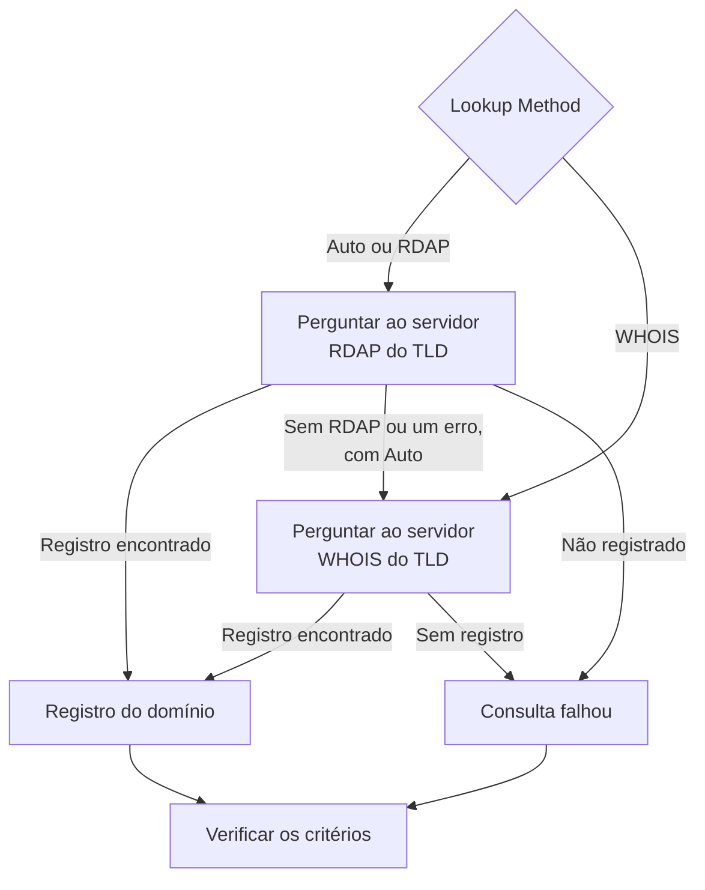

# Monitor de domínio

Um monitor de domínio lê periodicamente o registro do seu domínio, para acompanhar a data de vencimento, o registrador, os servidores de nomes e os códigos de status, e avisa você antes que ele vença. Use-o para cada domínio do qual dependem os seus sites, as suas APIs e o seu e-mail: um registro vencido derruba todos de uma vez.

:::cards
- [Criar o monitor](#criar-um-monitor-de-domínio): Seis passos no painel.
- [Métodos de consulta](#métodos-de-consulta): RDAP, WHOIS, e por que **Auto** é o padrão.
- [Critérios padrão](#critérios-padrão): Um aviso de vencimento com 30 dias de antecedência, sem configurar nada.
- [Solução de problemas](#solução-de-problemas): Servidores WHOIS desativados, proxies e datas ausentes.
:::

## Como funciona

A cada verificação, uma sonda consulta o registro do domínio por RDAP ou WHOIS, conforme o **Lookup Method**, e normaliza o que encontra: a data de vencimento, o registrador, os servidores de nomes e os códigos de status. Uma consulta que falha é tentada de novo, até o número de tentativas que você definir. Depois, o OneUptime avalia o registro com os critérios do monitor.

Se uma consulta não consegue produzir dados de registro — porque o serviço do TLD foi desativado, ou o domínio não está registrado —, o monitor é informado como **offline** com o motivo mostrado na resposta da sonda do monitor, em vez de ser informado como saudável com uma data de vencimento vazia. Um registro que responde "este domínio está disponível" (por exemplo, o `Status: free` da DENIC) é tratado como **não registrado**, não como um registro saudável.

Nomes de domínio internacionalizados são aceitos em qualquer das formas: `münchen.de` é convertido para o seu A-label (`xn--mnchen-3ya.de`) antes da consulta.

## Antes de começar

- **Uma função que possa criar monitores**: Project Owner, Project Admin, Project Member, Monitor Admin ou Monitor Member, ou uma função personalizada com a permissão Create Monitor.
- **Acesso de saída a partir da sonda** para os registros. As sondas padrão do seu projeto são escolhidas para cada monitor novo; uma [sonda personalizada](/docs/probe/custom-probe) precisa alcançar:

| Destino | Protocolo | Usado para |
| --- | --- | --- |
| `https://data.iana.org/rdap/dns.json` | HTTPS, porta 443 | O registro de bootstrap RDAP da IANA, que diz onde fica o servidor RDAP de cada TLD. Baixado uma vez e mantido em cache por 24 horas. |
| Os servidores RDAP dos registros | HTTPS, porta 443 | Consultas RDAP. |
| Servidores WHOIS | TCP, porta 43 | Consultas WHOIS. |

As requisições RDAP respeitam as configurações `HTTP_PROXY_URL` / `HTTPS_PROXY_URL` / `NO_PROXY` da sonda. O WHOIS usa um socket bruto e não as respeita. Se uma sonda não consegue alcançar `data.iana.org`, o **Auto** recorre ao WHOIS e tenta a IANA de novo depois de cinco minutos.

## Criar um monitor de domínio

:::steps
### Começar um monitor novo

Vá em **Monitores** e clique em **Criar monitor**. Em **Tipo de monitor**, clique em **Mais tipos de monitor** e escolha **Domínio** em **Basic Monitoring**.

### Dar um nome a ele

Digite um **Nome**, como `example.com registration`, e clique em **Próximo**.

### Informar o domínio

Digite o **Nome de domínio**, como `example.com`. Deixe **Lookup Method** em **Auto**, a menos que tenha um motivo para não fazer isso (veja [Métodos de consulta](#métodos-de-consulta)).

### Testá-lo

Clique em **Testar monitor**, escolha uma sonda em **Selecionar Sonda** e clique em **Executar teste**. **Resultado do Teste do Monitor** mostra o registro que a sonda leu, e se quem respondeu foi o RDAP ou o WHOIS.

### Revisar os critérios

**Critérios do monitor** começa com os [critérios padrão](#critérios-padrão): offline quando o registro venceu ou não pode ser lido, um alerta quando vence em 30 dias ou menos. Altere-os se precisar e clique em **Próximo**.

### Escolher as sondas e criar

Mantenha ou altere as **Sondas** e o **Intervalo de monitoramento** (começa em **A cada 5 minutos**) e clique em **Criar monitor**. A página do monitor se abre.
:::

## Opções de configuração

| Campo | Padrão | O que informar |
| --- | --- | --- |
| **Nome de domínio** | Nenhum | O domínio registrado, como `example.com`. Um endereço colado também funciona: `https://example.com/pricing` é lido como `example.com`. |
| **Lookup Method** | **Auto** | **Auto**, **RDAP** ou **WHOIS**. Veja [Métodos de consulta](#métodos-de-consulta). |
| **Tempo limite (ms)** (em **Mais campos**) | `10000` | Quanto tempo esperar por cada consulta de registro, em milissegundos. |
| **Tentativas** (em **Mais campos**) | `3` | Novas tentativas depois que a primeira falha. `0` significa uma única tentativa. |

Cada consulta que falha é repetida, com uma pausa de um segundo entre as tentativas. Isso inclui um registro que responde que o domínio não está registrado, ou que não tem serviço de registro, caso a resposta tenha sido uma falha passageira. Só um nome de domínio malformado é informado na hora, sem consulta.

O tempo limite vale para cada requisição, não para a verificação inteira: uma verificação com **Auto** que tenta o RDAP e depois recorre ao WHOIS pode levar o dobro do tempo, ou mais.

### Métodos de consulta

Os dados de registro podem ser lidos por dois protocolos, e qual funciona depende do TLD.

| Método | Comportamento |
| --- | --- |
| **Auto** | Padrão. Usa RDAP quando o TLD publica um serviço RDAP, e recorre ao WHOIS quando não publica, ou quando a consulta RDAP falha. |
| **RDAP** | Só RDAP. Falha com um erro claro se o TLD não publica nenhum serviço RDAP. |
| **WHOIS** | Só WHOIS. |

O **RDAP** ([RFC 9083](https://www.rfc-editor.org/rfc/rfc9083)) é o substituto do WHOIS exigido pela ICANN. O servidor autoritativo de cada TLD é descoberto a partir do [registro de bootstrap da IANA](https://www.rfc-editor.org/rfc/rfc9224), então continua correto quando os registros mudam de lugar. Todo gTLD publica um. Quando o servidor RDAP do TLD diz que o domínio não está registrado, o **Auto** toma isso como resposta e não pergunta ao WHOIS.

O **WHOIS** não tem um mecanismo de descoberta equivalente — os clientes trazem um mapa fixo de TLD para host WHOIS, e esses mapas ficam desatualizados. Todo TLD da Identity Digital (`.digital`, `.email`, `.life`, `.today`, `.zone` e cerca de outros 290) ainda está mapeado para um host desativado que agora responde a cada consulta com o texto literal `TLD is not supported.` em vez de um registro. O WHOIS continua sendo a única opção para os muitos ccTLDs que não publicam nenhum serviço RDAP, como `.io`, `.co`, `.de`, `.ch` e `.jp`.

## Critérios de monitoramento

Os critérios decidem quando o domínio conta como bom ou quebrado, e se isso declara um incidente ou cria um alerta. Cada critério verifica um ou mais filtros:

| Filtro | Condições | O que verifica |
| --- | --- | --- |
| **Is Online** | **Verdadeiro**, **Falso** | Se a própria consulta do registro deu certo. |
| **Is Request Timeout** | **Verdadeiro**, **Falso** | Se a consulta esgotou o tempo limite, em todas as tentativas. |
| **Domain Expires In Days** | **Greater Than**, **Less Than**, **Greater Than Or Equal To**, **Less Than Or Equal To** | Os dias até o registro vencer, arredondados para cima até um dia inteiro. |
| **Domain Is Expired** | **Verdadeiro**, **Falso** | Se a data de vencimento já passou. |
| **Domain Registrar** | **Contém**, **Not Contains**, **Starts With**, **Ends With**, **Equal To**, **Not Equal To** | O nome do registrador. |
| **Domain Name Server** | **Contém**, **Not Contains**, **Starts With**, **Ends With**, **Equal To**, **Not Equal To** | Os servidores de nomes do domínio. Corresponde quando qualquer um deles corresponde. |
| **Domain Status Code** | **Contém**, **Not Contains**, **Starts With**, **Ends With**, **Equal To**, **Not Equal To** | Os códigos de status EPP do domínio. Corresponde quando qualquer um deles corresponde. |

Os códigos de status são normalizados para os nomes EPP (`clientTransferProhibited`) seja qual for o protocolo que respondeu, então um critério continua correspondendo quando o **Auto** alterna entre RDAP e WHOIS. Os _nomes_ dos registradores são o que o serviço que responde publica e podem variar um pouco entre os dois protocolos, então prefira **Contém** a **Equal To** para um critério **Domain Registrar**.

As datas são normalizadas para ISO 8601. Uma data que um registro publica num formato que não dá para interpretar é omitida em vez de guardada, então um critério de vencimento não consegue decidir, e não corresponde, em vez de responder em silêncio "não vencido" para sempre.

Com dois ou mais filtros, **Condição de correspondência** decide se **Todos** precisam corresponder ou se basta **Qualquer** um. As **Ações** de um critério decidem o que ele faz: mudar o status do monitor, criar um alerta, declarar um incidente, ou várias dessas coisas.

### Critérios padrão

Um monitor de domínio novo começa com três critérios, então ele avisa você antes que um registro vença sem configurar nada:

1. **A verificação do domínio falhou** — o registro venceu, ou os dados de registro dele não puderam ser lidos. O monitor é marcado como **Offline** e um incidente chamado "_monitor name_ domain check failed" é criado. O incidente se resolve sozinho assim que o registro volta a ser lido e está em dia.
2. **O domínio vence em breve** — o registro não venceu, mas vence em 30 dias ou menos. Um **alerta** chamado "_monitor name_ domain expires soon" é criado.
3. **O domínio não venceu** — o monitor é marcado como **Operacional**.

O aviso de "vence em breve" é um alerta, não um incidente: ele não aparece nas suas páginas de status, não aciona ninguém a menos que você adicione uma política de plantão a ele, e não muda o status do monitor. Ele usa a segunda severidade de alerta do seu projeto, **Low** em um projeto novo. Assim que a renovação aparece no registro, o alerta se resolve sozinho. Um registro que não publica data de vencimento não dá nada ao aviso, então ele fica quieto.

Os critérios são verificados de cima para baixo, e o primeiro que corresponde decide o que acontece. Por isso "vence em breve" fica acima de "não venceu": um domínio prestes a vencer ainda não venceu, então corresponderia aos dois.

Para ser avisado antes, altere o valor do filtro **Domain Expires In Days** no critério "vence em breve", por exemplo para `60`. Para acionar alguém em vez disso, abra as **Ações** desse critério: ative **Quando os filtros corresponderem, declarar um incidente.**, ou mantenha o alerta e adicione a ele uma política de plantão em **Políticas de plantão**.

:::details Adicionar o aviso a um monitor criado antes de ele existir
Monitores criados antes de o OneUptime adicionar este aviso não têm um critério de "vence em breve". Para adicioná-lo:

1. No monitor, abra **Configuração → Critérios** e clique em **Editar: Critérios de Monitoramento**.
2. Clique em **Adicionar critérios**. Defina o filtro dele como **Domain Is Expired** / **Falso**, clique em **Adicionar filtro** e defina o segundo como **Domain Expires In Days** / **Less Than Or Equal To** / `30`. Deixe **Condição de correspondência** em **Todos** (ela aparece abaixo dos filtros quando há dois).
3. Em **Ações**, ative **Quando os filtros corresponderem, criar um alerta.** e deixe **Quando os filtros corresponderem, alterar o status do monitor.** desativado, para que ele crie um alerta e não mude o status do monitor.
4. Arraste o novo critério para cima do critério que marca o monitor como no ar, e salve.
:::

### Exemplos de critérios

| Objetivo | Filtro | Condição | Valor |
| --- | --- | --- | --- |
| Alertar quando o domínio vence em até 30 dias (um padrão) | **Domain Expires In Days** | **Less Than Or Equal To** | `30` |
| Offline quando o domínio venceu | **Domain Is Expired** | **Verdadeiro** | — |
| Offline quando o registro não pode ser lido | **Is Online** | **Falso** | — |
| Alertar quando os servidores de nomes mudam | **Domain Name Server** | **Not Contains** | `ns1.example.com` |
| Alertar quando o domínio é desbloqueado para transferência | **Domain Status Code** | **Not Contains** | `clientTransferProhibited` |

**Domain Name Server** e **Domain Status Code** correspondem quando _qualquer_ valor corresponde, então **Not Contains** corresponde assim que um servidor de nomes, ou um código de status, não contém o texto.

## Boas práticas

1. **Dê-se tempo para renovar** — O aviso padrão chega 30 dias antes do vencimento. Se a renovação precisa de aprovações ou de um pagamento que demora mais, aumente para 60 dias.
2. **Cubra as consultas que falham** — Inclua um filtro **Is Online** / **Falso** no seu critério offline para que um registro ilegível não seja confundido com um saudável. Monitores novos já o têm nos critérios padrão; um monitor criado antes de ele ser adicionado precisa dele à mão. Para aguentar um servidor WHOIS que limita a sonda de vez em quando, marque **Avaliar este critério durante um período de tempo** sob esse filtro e escolha **All Values**: o domínio só fica offline quando todas as consultas da janela falharam.
3. **Monitore todos os domínios críticos** — Inclua os domínios principais, os subdomínios registrados separadamente e qualquer domínio usado para e-mail ou APIs.
4. **Acompanhe as trocas de registrador** — Adicione um critério com **Domain Registrar** / **Not Contains** / o nome do seu registrador, para perceber uma transferência não autorizada.

## Solução de problemas

:::details O servidor WHOIS "answered without any registration data"
O host WHOIS do TLD foi desativado, está limitando a sonda ou está com uma falha passageira. Um host desativado, como o que ainda está mapeado para os TLDs da Identity Digital, responde `TLD is not supported.` toda vez. Se a falha persistir com **Lookup Method** em **WHOIS**, mude para **Auto**, para que a sonda leia o serviço RDAP do TLD quando houver um.
:::

:::details A verificação falha com "No RDAP service is published"
O monitor usa **RDAP**, e o TLD não publica nenhum serviço RDAP, como muitos ccTLDs. Mude **Lookup Method** para **Auto**, que recorre ao WHOIS.
:::

:::details O domínio aparece como não registrado
O registro respondeu que o domínio está disponível. Confira a grafia, e se você informou o domínio registrado, como `example.com`, e não um subdomínio.
:::

:::details As consultas falham numa sonda atrás de um proxy
O RDAP passa pelas configurações de proxy da sonda, o WHOIS não. Libere a porta TCP 43 de saída para o WHOIS, ou use **Auto** ou **RDAP** para os TLDs que publicam um serviço RDAP.
:::

:::details A data de vencimento está vazia, e os critérios de vencimento nunca disparam
O registro não publica data de vencimento, ou publica uma num formato que não dá para interpretar. Os critérios de vencimento não conseguem decidir sem uma data, então ficam quietos. **Is Online** continua dizendo se o registro pode ser lido.
:::

## Próximos passos

:::cards
- [Monitor de certificado SSL](/docs/monitor/ssl-certificate-monitor): Ser avisado antes que os certificados do domínio vençam.
- [Monitor de DNS](/docs/monitor/dns-monitor): Verificar se os registros do domínio resolvem, e o que dizem.
- [Monitor de DNSSEC](/docs/monitor/dnssec-monitor): Validar a cadeia de confiança de uma zona assinada.
- [Regras de escalonamento](/docs/on-call/escalation-rules): Decidir quem é acionado pelos alertas e incidentes.
:::
