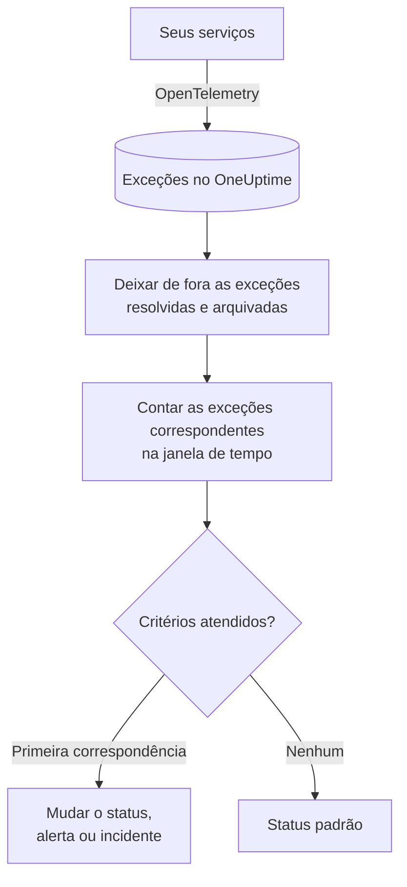

# Monitor de exceções

Um monitor de exceções conta, em uma janela de tempo, as exceções que seus serviços informam ao OneUptime e que correspondem aos seus filtros (mensagem, tipo de exceção, ambiente, serviço). Quando a contagem atende aos seus critérios, ele muda o status do monitor, cria um alerta ou declara um incidente. Use-o para alertar sobre qualquer nova falha em produção, sobre um tipo de exceção específico ou sobre um aumento repentino de erros.

:::cards
- [Criar o monitor](#criar-um-monitor-de-exceções): Escolha quais exceções contar e quando alertar.
- [Ambientes](#ambientes): Limite o monitor a `production`.
- [Como ele é avaliado](#como-ele-é-avaliado): O que é contado e o que resolver uma exceção faz.
- [Critérios](#critérios): As condições e os valores padrão.
:::

## Como funciona



A cada minuto, o OneUptime conta as exceções que correspondem aos filtros do monitor e ocorreram dentro da sua janela de tempo, deixando de fora as exceções que você marcou como resolvidas ou arquivou. Ele compara essa contagem com os critérios do monitor de cima para baixo, e o primeiro critério que corresponde decide o que acontece. Quando nenhum corresponde, o monitor volta ao seu status padrão.

## Antes de começar

- Seus serviços enviam exceções ao OneUptime pelo OpenTelemetry. Veja [OpenTelemetry](/docs/telemetry/open-telemetry).
- Para limitar um monitor a um ambiente, seus serviços precisam definir o atributo de recurso `deployment.environment`.

## Criar um monitor de exceções

:::steps
### Começar um novo monitor

Vá para **Monitores** e clique em **Criar monitor**.

### Escolher Exceptions

Em **Tipo de monitor**, clique em **Mais tipos de monitor** e escolha **Exceções** em **Telemetria**, ou digite `exceptions` na caixa de pesquisa. Digite um **Nome** e clique em **Próximo**.

### Escolher as exceções a contar

Em **Configuração do monitor de exceções**, defina **Filtrar mensagem de exceção**, **Tipos de exceção**, **Environments** e **Monitorar exceções por (tempo)**. Um filtro deixado vazio corresponde a todas as exceções. **Pré-visualização de exceções**, abaixo dos filtros, mostra as exceções a que eles correspondem agora.

### Refinar (opcional)

Abra **Mais campos** para filtrar por serviço de telemetria ou entidade de infraestrutura, ou para contar também as exceções resolvidas e arquivadas.

### Definir os critérios

O cartão **Critérios do monitor** começa com dois critérios: offline, com um incidente, quando alguma exceção corresponde; online quando nenhuma corresponde. Altere-os para o que você quer alertar (veja [Critérios](#critérios)).

### Criar o monitor

Clique em **Criar monitor**. O monitor abre na sua página **Visão geral**, e sua primeira avaliação acontece em até um minuto.
:::

## O que ele consulta

| Campo | Com o que corresponde | Padrão |
| --- | --- | --- |
| **Filtrar mensagem de exceção** | Exceções cuja mensagem contém este texto, sem diferenciar maiúsculas de minúsculas. | Vazio: todas as exceções |
| **Tipos de exceção** | Exceções de qualquer um destes tipos, separados por vírgulas, como `TypeError, NullReferenceException`. O nome do tipo precisa corresponder exatamente. | Vazio: todos os tipos |
| **Environments** | Exceções de qualquer um destes ambientes, separados por vírgulas (veja [Ambientes](#ambientes)). | Vazio: todos os ambientes |
| **Monitorar exceções por (tempo)** | Exceções dos últimos 5 segundos até as últimas 24 horas. | **Último 1 minuto** |
| **Filtrar por serviço de telemetria** (em **Mais campos**) | Exceções de qualquer um dos serviços escolhidos. | Vazio: todos os serviços |
| **Filter by Infrastructure Entity** (em **Mais campos**) | Exceções de qualquer um dos hosts, pods, contêineres e outras entidades escolhidos. | Vazio: todas as entidades |
| **Incluir Exceções Resolvidas** (em **Mais campos**) | Contar também as exceções marcadas como resolvidas. | Desativado |
| **Incluir Exceções Arquivadas** (em **Mais campos**) | Contar também as exceções arquivadas. | Desativado |

Todos os filtros que você definir precisam corresponder para que uma exceção seja contada.

### Ambientes

Os ambientes vêm do atributo de recurso do OpenTelemetry `deployment.environment` de cada exceção, o mesmo valor que o explorador de exceções filtra com `env:production`. Digite um ambiente, ou vários separados por vírgulas; uma exceção é contada quando seu ambiente corresponde a qualquer um deles.

A correspondência é exata e diferencia maiúsculas de minúsculas: `production` não corresponde a `Production` nem a `prod`. Exceções sem ambiente não são contadas quando este filtro está definido. Deixe-o vazio para contar as exceções de todos os ambientes, inclusive as que não têm ambiente.

O filtro de ambiente se combina com todos os outros filtros, então um monitor limitado a um serviço de telemetria e a `production` só conta as exceções de produção desse serviço.

Ao criar o monitor pela API, defina `environments` no `exceptionMonitor` da etapa como uma lista de nomes de ambiente:

```json
{
  "exceptionMonitor": {
    "telemetryServiceIds": [],
    "environments": ["production"],
    "exceptionTypes": [],
    "message": "",
    "includeResolved": false,
    "includeArchived": false,
    "lastXSecondsOfExceptions": 300
  }
}
```

## Como ele é avaliado

- **A cada minuto.** Um monitor de exceções não é verificado por sondas, por isso não tem intervalo para configurar nem página **Sondas e intervalo**.
- **Ocorrências, não tipos de exceção.** O monitor conta cada vez que uma exceção correspondente ocorreu dentro de **Monitorar exceções por (tempo)**. Uma exceção lançada 40 vezes conta 40.
- **Exceções resolvidas e arquivadas ficam de fora.** A menos que você ative **Incluir Exceções Resolvidas** ou **Incluir Exceções Arquivadas**, as ocorrências de uma exceção que você marcou como resolvida ou arquivou não contam. Por isso, marcar uma exceção como resolvida pode fechar o incidente que ela abriu. Quando uma exceção resolvida volta a ocorrer, ela deixa de estar resolvida automaticamente e volta a ser contada.
- **Nenhuma exceção é uma contagem de 0.**
- **A indisponibilidade do próprio OneUptime não é silêncio.** Enquanto a janela de tempo contiver um período em que o próprio OneUptime não estava recebendo dados (estava reiniciando, sendo atualizado ou recuperando um atraso), a verificação espera: o status não muda, e nenhum incidente ou alerta é aberto ou resolvido. Veja [Quando o OneUptime não recebe dados](/docs/monitor/when-oneuptime-is-not-receiving).
- **Critérios de cima para baixo.** O primeiro critério que corresponde decide, então coloque o mais grave primeiro.

Cada mudança de status, com o motivo, fica registrada na **Linha do tempo de status** do monitor.

## Critérios

Os critérios de um monitor de exceções têm um único **Tipo de filtro**: **Exception Count**, o número de exceções que corresponderam na janela. Escolha uma **Condição do filtro** e um **Valor**.

| Condição do filtro | Corresponde quando a contagem de exceções está… |
| --- | --- |
| **Greater Than** | acima do valor |
| **Greater Than Or Equal To** | no valor ou acima |
| **Less Than** | abaixo do valor |
| **Less Than Or Equal To** | no valor ou abaixo |
| **Equal To** | exatamente no valor |
| **Not Equal To** | em qualquer valor, menos esse |

As contagens de exceções não têm condições de anomalia: não há uma linha de base com que compará-las.

Um novo monitor de exceções começa com estes critérios:

| Critério | Filtro | Efeito |
| --- | --- | --- |
| Check if … has exceptions | **Exception Count** **Greater Than** `0` | Coloca o monitor offline e declara um incidente, resolvido automaticamente |
| Check if … has no exceptions | **Exception Count** **Equal To** `0` | Coloca o monitor online |

## Exemplo prático: só as exceções de produção

Você quer um incidente sempre que a API lançar uma exceção em produção, e nada para o staging. Você define **Environments** como `production` e **Monitorar exceções por (tempo)** como **Últimos 5 minutos**, e mantém os critérios padrão. Nos últimos cinco minutos:

| Exceções | Ambiente | Estado | Contadas? |
| --- | --- | --- | --- |
| `TypeError` × 3 | `production` | Ativa | Sim: 3 |
| `TypeError` × 40 | `staging` | Ativa | Não: outro ambiente |
| `TimeoutError` × 2 | nenhum | Ativa | Não: sem ambiente |
| `NullReferenceException` × 4 | `production` | Resolvida depois de ocorrer | Não: resolvida |

O **Exception Count** é 3, então **Greater Than** `0` corresponde: o monitor fica offline e um incidente é declarado. Depois que passam cinco minutos sem nenhuma exceção de produção ativa, o critério online corresponde e o incidente se resolve sozinho.

## Solução de problemas

:::details As exceções aparecem no explorador, mas o monitor conta 0
Compare o valor de **Environments** com o filtro `env:` do explorador: a correspondência é exata e diferencia maiúsculas de minúsculas, e as exceções sem ambiente ficam de fora quando o filtro está definido. Depois verifique se essas exceções estão resolvidas ou arquivadas. Abra a página **Critérios** do monitor (em **Configuração**) e clique em **Edit Monitoring Criteria**: **Pré-visualização de exceções** mostra a que os filtros correspondem.
:::

:::details O incidente se resolveu quando resolvi a exceção
É o esperado. As exceções resolvidas não são contadas, então a contagem caiu e o critério deixou de corresponder. Se a exceção voltar a ocorrer, ela deixa de estar resolvida e volta a ser contada. Ative **Incluir Exceções Resolvidas** para contá-las mesmo assim.
:::

:::details Um filtro de tipo de exceção não corresponde a nada
Os **Tipos de exceção** são comparados exatamente com o nome do tipo com que a exceção foi informada, como `TypeError`. Copie o tipo do explorador de exceções.
:::

## Próximos passos

:::cards
- [Monitor de traces](/docs/monitor/traces-monitor): Alerte sobre spans e endpoints com falha.
- [Monitor de logs](/docs/monitor/logs-monitor): Alerte sobre o volume e o conteúdo dos logs.
- [Modelos de incidentes e alertas](/docs/monitor/incident-alert-templating): Escreva títulos e descrições de alertas úteis.
- [OpenTelemetry](/docs/telemetry/open-telemetry): Envie exceções ao OneUptime.
:::
