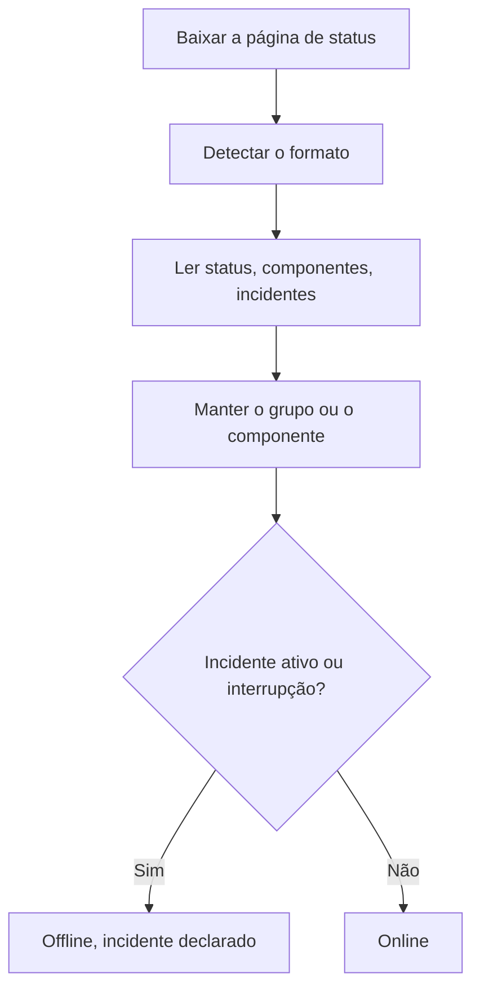

# Monitor de página de status externa

Um monitor de página de status externa acompanha a página de status pública de um serviço do qual você depende (AWS, GCP, Azure, GitHub, OpenAI, Anthropic e muitos outros) e alerta você quando esse provedor informa uma interrupção ou desempenho degradado. Use-o para saber de problemas nos seus provedores assim que eles os informam, e para separá-los dos seus.

:::cards
- [Criar o monitor](#criar-um-monitor-de-página-de-status-externa): Cole a URL de uma página de status e escolha o que acompanhar.
- [Delimitar o escopo](#opções-de-configuração): Acompanhe um grupo de componentes ou um componente.
- [Critérios](#critérios-de-monitoramento): O que conta como fora do ar, logo de saída.
- [Páginas de status populares](#urls-de-páginas-de-status-populares): URLs dos serviços dos quais a maioria das equipes depende.
:::

## Como funciona

A cada verificação, uma sonda baixa a página de status, descobre o formato dela e lê o status geral, os componentes e os incidentes ativos. Se você limitou o monitor a um grupo de componentes ou a um componente, só eles contam. Depois, os critérios decidem se o monitor está online ou offline.

Você pode usá-lo para:

- Monitorar a disponibilidade dos serviços de terceiros dos quais seu aplicativo depende
- Ser alertado quando provedores externos sofrem interrupções
- Acompanhar o status de cada componente
- Limitar o monitoramento a um único grupo de componentes (por exemplo, só as "APIs" da OpenAI), para que incidentes sem relação em outras partes da página não disparem seu monitor
- Detectar desempenho degradado antes que ele afete seus usuários
- Relacionar seus próprios incidentes com problemas dos provedores externos

## Provedores compatíveis

| Provedor | Descrição |
| ------------------------ | ---------------------------------------------------------------------- |
| **Auto** (padrão) | Detecta automaticamente o formato da página de status |
| **Atlassian Statuspage** | Páginas de status baseadas no Atlassian Statuspage (API JSON) |
| **incident.io** | Páginas de status baseadas no incident.io (por exemplo, `https://status.openai.com`) |
| **RSS** | Páginas de status que oferecem um feed RSS |
| **Atom** | Páginas de status que oferecem um feed Atom |

### Detecção automática

Com **Auto**, o OneUptime detecta automaticamente o formato da página de status, nesta ordem:

1. Primeiro, tenta a API de páginas de status do incident.io (`/proxy/<host>`).
2. Depois, tenta a API JSON do Atlassian Statuspage (`/api/v2/status.json`, `/api/v2/components.json` e `/api/v2/incidents/unresolved.json`).
3. Se essas falharem, tenta ler a página como um feed RSS ou Atom.
4. Como último recurso, faz uma verificação básica de acessibilidade HTTP.

> [!NOTE]
> O incident.io é verificado primeiro porque algumas páginas de status do incident.io (como `https://status.openai.com`) também expõem um endpoint limitado compatível com o Atlassian, que omite os grupos de componentes e os incidentes ativos. Verificar o incident.io primeiro garante que sejam usados os dados mais completos, que conhecem os grupos.

A verificação de acessibilidade também é o último recurso quando um provedor escolhido explicitamente falha. Ela só diz se a página responde (online com uma resposta `2xx` ou `3xx`) e não informa componentes nem incidentes.

## Criar um monitor de página de status externa

:::steps
### Começar um novo monitor

Vá para **Monitores** e clique em **Criar monitor**. Em **Tipo de monitor**, clique em **Mais tipos de monitor** e escolha **External Status Page** em **Basic Monitoring**, ou digite `statuspage` na caixa de pesquisa. Digite um **Nome** e clique em **Próximo**.

### Informar a URL da página de status

Informe a **URL da Página de Status**. Deixe o **Provedor** em **Auto**, a menos que você conheça o formato.

### Delimitar o escopo, se precisar

Abra **Mais campos** para informar um **Component Group Filter (Optional)**, como `APIs`, e um **Filtro de nome de componente (opcional)** para acompanhar um único componente (dentro do grupo, se houver um grupo definido).

### Testar

Clique em **Testar monitor** para baixar a página uma vez, e confira o provedor, os componentes e os incidentes encontrados.

### Revisar os critérios

A etapa de critérios começa com [os critérios padrão](#critérios-padrão), que marcam o monitor como offline quando o provedor informa um incidente ativo ou uma interrupção dentro do escopo. Altere-os se precisar e clique em **Próximo**.

### Escolher as sondas e criar

Selecione as **Sondas** e um **Intervalo de monitoramento** (começa em **A cada 5 minutos**) e clique em **Criar monitor**.
:::

## Opções de configuração

| Opção | O que informar | Padrão |
| --- | --- | --- |
| **URL da Página de Status** | A URL da página de status. Em sites baseados no Atlassian Statuspage e no incident.io, costuma ser a URL raiz (por exemplo, `https://status.example.com`). Para feeds RSS/Atom, informe diretamente a URL do feed. | — |
| **Provedor** | **Auto** para detectar o formato, ou **Atlassian Statuspage**, **incident.io**, **RSS** ou **Atom** se você souber. | **Auto** |
| **Component Group Filter (Optional)** | O grupo ao qual limitar o monitor. Em **Mais campos**. | Todos os grupos |
| **Filtro de nome de componente (opcional)** | O componente a acompanhar. Em **Mais campos**. | Todos os componentes do escopo |
| **Tempo limite (ms)** | O tempo máximo de espera pela página de status. Em **Mais campos**. | `10000` (10 segundos) |
| **Tentativas** | Quantas vezes tentar de novo, com um segundo de intervalo, depois que a primeira tentativa falha; `0` significa uma única tentativa. Em **Mais campos**. | `3` (até 4 tentativas) |

### Component Group Filter

Se a página de status organiza seus componentes em grupos, você pode limitar o monitor a um único grupo. Por exemplo, em `https://status.openai.com`, informar `APIs` limita o monitor aos serviços de API da OpenAI.

Quando um grupo de componentes está definido, o **número de incidentes ativos** e o **status geral** são calculados só com os componentes desse grupo: um incidente que afeta um grupo sem relação (por exemplo, o ChatGPT) não vai disparar um monitor limitado ao grupo "APIs".

A filtragem por grupo de componentes é compatível com os provedores **Atlassian Statuspage** e **incident.io**. Feeds RSS e Atom não expõem grupos de componentes.

### Filtro de nome de componente

Se a página de status informa vários componentes, você pode indicar o nome de um componente para monitorar só ele. O filtro corresponde a qualquer componente cujo nome contenha o que você digitar, sem diferenciar maiúsculas de minúsculas: `actions` corresponde a um componente chamado "Actions".

Quando um grupo de componentes também está definido, o filtro de nome de componente é aplicado **dentro** desse grupo, permitindo mirar em um único componente dentro de um grupo maior. Quando nenhum filtro é informado, todos os componentes do escopo são monitorados. Em um feed RSS ou Atom, o filtro de nome é comparado com os títulos dos itens do feed.

> [!WARNING]
> Um filtro que não corresponde a nada parece saudável: sem componentes no escopo, não há nada que possa informar uma interrupção. Confira a grafia na página de status, e use **Testar monitor** para ver o que o filtro mantém.

## Critérios de monitoramento

Você pode configurar critérios para decidir quando o serviço externo é considerado online ou offline, com base em:

| Tipo de filtro | O que verifica | Condições do filtro |
| --- | --- | --- |
| **External Status Page Is Online** | Se a página de status está acessível e retornando dados de status | Verdadeiro ou Falso |
| **External Status Page Overall Status** | O status geral que a página informa | Equal To, Not Equal To, Contém, Not Contains, Starts With, Ends With |
| **External Status Page Component Status** | O status dos componentes do escopo (respeitando os filtros de grupo e de nome de componente): Operacional, Under Maintenance, Degraded Performance, Partial Outage, Major Outage ou Full Outage | Equal To, Not Equal To, Contém, Not Contains, Starts With, Ends With |
| **External Status Page Active Incidents** | O número de incidentes ativos no momento informados na página de status (limitado ao grupo ou componente quando há um filtro) | Equal To, Not Equal To e as comparações numéricas |
| **External Status Page Response Time (in ms)** | Quanto tempo leva para baixar os dados da página de status | Greater Than, Less Than, Greater Than Or Equal To, Less Than Or Equal To |

O status geral é o que a página diz, então os valores dele variam conforme o provedor: uma Atlassian Statuspage informa a própria descrição, como `All Systems Operational`; um feed informa `operational` ou `degraded_performance`; a verificação de acessibilidade informa `reachable` ou `unreachable`. Essas comparações diferenciam maiúsculas de minúsculas. Para alertar sobre interrupções, **External Status Page Active Incidents** e **External Status Page Component Status** costumam ser mais confiáveis.

Em um feed RSS ou Atom, os itens das últimas 24 horas contam como incidentes ativos: um item RSS pela data de publicação, uma entrada Atom pela data de atualização.

### Critérios padrão

Por padrão, o OneUptime cria critérios baseados no que realmente importa em uma página de status (os incidentes ativos e a saúde dos componentes) e não na simples acessibilidade:

| Critério | Filtros | Efeito |
| --- | --- | --- |
| Offline | **Qualquer** um de: a página não está online; há pelo menos um incidente ativo no escopo; um componente do escopo informa Degraded Performance, Partial Outage, Major Outage ou Full Outage | Marca o monitor como offline e declara um incidente, que se resolve sozinho quando o critério deixa de corresponder |
| Online | **Todos** de: a página está online; não há incidentes ativos no escopo | Marca o monitor como online |

Como o número de incidentes ativos e os status dos componentes respeitam os filtros de grupo e de nome de componente, esses critérios padrão miram automaticamente só nos componentes que interessam a você.

## Variáveis de modelo

Ao criar incidentes ou alertas a partir de monitores de página de status externa, você pode usar estas variáveis em títulos, descrições e notas de correção (veja [Modelos de incidentes e alertas](/docs/monitor/incident-alert-templating)):

| Variável | Descrição |
| ------------------------- | ------------------------------------------------------------------------------- |
| `{{isOnline}}`            | Se a página de status está online (true/false) |
| `{{responseTimeInMs}}`    | Tempo de resposta em milissegundos |
| `{{failureCause}}`        | Motivo da falha, se houver |
| `{{overallStatus}}`       | O valor do indicador de status geral |
| `{{activeIncidentCount}}` | Número de incidentes ativos (limitado pelo filtro, se houver) |
| `{{componentStatuses}}`   | Array JSON de status de componentes (`name`, `status`, `description`, `groupName`) |
| `{{provider}}`            | Provedor detectado (Atlassian Statuspage, incident.io, RSS, Atom); vazio após uma verificação de acessibilidade |
| `{{componentGroup}}`      | Grupo de componentes ao qual o monitor está limitado, se houver |
| `{{componentName}}`       | Componente ao qual o monitor está limitado, se houver |

## URLs de páginas de status populares

Aqui está uma lista de páginas de status de serviços populares. Muitas usam o Atlassian Statuspage ou o incident.io, então o provedor **Auto** as detecta automaticamente. Uma página que não é baseada em nenhum dos dois, e que não é um feed, só recebe a verificação de acessibilidade: nesses casos, monitore o feed RSS ou Atom do provedor, se ele publicar um.

| Serviço | URL da página de status |
| ---------------------------- | --------------------------------------------- |
| AWS                          | `https://health.aws.amazon.com/health/status` |
| Google Cloud Platform        | `https://status.cloud.google.com`             |
| Microsoft Azure              | `https://status.azure.com`                    |
| GitHub                       | `https://www.githubstatus.com`                |
| OpenAI                       | `https://status.openai.com`                   |
| Anthropic                    | `https://status.anthropic.com`                |
| Cloudflare                   | `https://www.cloudflarestatus.com`            |
| Datadog                      | `https://status.datadoghq.com`                |
| PagerDuty                    | `https://status.pagerduty.com`                |
| Twilio                       | `https://status.twilio.com`                   |
| Stripe                       | `https://status.stripe.com`                   |
| Slack                        | `https://status.slack.com`                    |
| Atlassian (Jira, Confluence) | `https://status.atlassian.com`                |
| Vercel                       | `https://www.vercel-status.com`               |
| Netlify                      | `https://www.netlifystatus.com`               |
| DigitalOcean                 | `https://status.digitalocean.com`             |
| Heroku                       | `https://status.heroku.com`                   |
| MongoDB Atlas                | `https://status.cloud.mongodb.com`            |
| Fastly                       | `https://status.fastly.com`                   |
| New Relic                    | `https://status.newrelic.com`                 |
| Sentry                       | `https://status.sentry.io`                    |
| CircleCI                     | `https://status.circleci.com`                 |

## Boas práticas

- **Use o provedor Auto**, a menos que você saiba o formato exato: a detecção automática funciona bem na maioria das páginas de status.
- **Limite a um grupo de componentes** se você só depende de uma parte de um provedor (por exemplo, só das "APIs" da OpenAI), para que incidentes sem relação não façam barulho.
- **Monitore componentes específicos** se você só depende de certos serviços.
- **Combine com seus próprios monitores**: junte os monitores de página de status externa aos seus monitores de API e de site. Quando os dois caem ao mesmo tempo, a página de status do provedor leva você mais rápido à causa raiz.

## Solução de problemas

:::details O monitor está offline, mas o incidente é de uma parte do serviço que eu não uso
Limite o monitor com um **Component Group Filter**, um **Filtro de nome de componente** ou os dois. Assim, o número de incidentes ativos e os status dos componentes só contam o que está no escopo.
:::

:::details O monitor nunca fica offline, nem durante uma interrupção
Os filtros podem não corresponder a nada, o que parece saudável, ou a página pode estar recebendo só a verificação de acessibilidade. Execute **Testar monitor** e confira o provedor e os componentes encontrados.
:::

:::details O Auto escolhe o formato errado, ou não encontra componentes
Defina o **Provedor** que você sabe que a página usa. Para um feed RSS ou Atom, informe a URL do próprio feed em vez da URL da página de status.
:::

:::details Uma página de status interna não pode ser acessada
Uma sonda recusa endereços de rede privada, a menos que tenha permissão para alcançá-los. Defina `PROBE_ALLOW_PRIVATE_NETWORK_MONITORS=true` em uma sonda dentro da sua rede: veja [Acesso à rede privada](/docs/self-hosted/private-network-access).
:::

## Próximos passos

:::cards
- [Modelos de incidentes e alertas](/docs/monitor/incident-alert-templating): Coloque o status do provedor nos títulos dos seus incidentes.
- [Monitor de API](/docs/monitor/api-monitor): Verifique seus próprios endpoints ao lado do status do seu provedor.
- [Criar um monitor](/docs/monitor/create-monitor): Os passos que todos os tipos de monitor compartilham.
:::
