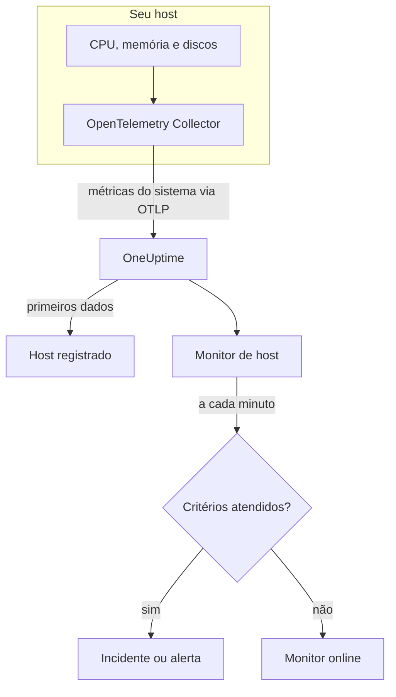

# Monitor de hosts

Um monitor de host acompanha uma máquina – CPU, memória, discos, carga e processos – e avisa você quando ela está saturada ou enchendo. Ele lê as métricas `system.*` do OpenTelemetry que um OpenTelemetry Collector envia do host, os mesmos dados que o produto **Hosts** mostra, então nada é sondado de fora.

:::cards
- [Criar o monitor](#criar-um-monitor-de-host): Seis passos no painel.
- [Modelos](#modelos-de-alerta-prontos): Cinco alertas prontos para CPU, memória, disco, carga e processos.
- [Métricas](#métricas-coletadas): As métricas de host com que você pode alertar, e suas unidades.
- [Host ou servidor / VM?](#monitor-de-host-ou-monitor-de-servidor-vm): Qual dos dois monitores de máquinas usar.
:::

## Como funciona

Um OpenTelemetry Collector é executado no host com o receptor `hostmetrics`. A cada 30 segundos, ele lê os números de CPU, memória, disco, rede, carga e processos do host e os envia para o OneUptime via OTLP. Os primeiros dados de um host o registram em **Hosts**.

Um monitor de host está vinculado a um host. A cada minuto, ele executa sua consulta sobre as métricas desse host e compara o resultado com seus critérios.

### Monitor de host ou monitor de servidor / VM?

O OneUptime tem dois monitores para máquinas. Eles podem rodar no mesmo host.

| | Monitor de host | Monitor de servidor / VM |
| --- | --- | --- |
| **Agente** | Um OpenTelemetry Collector com o receptor `hostmetrics` | O agente de infraestrutura do OneUptime |
| **Dados** | Métricas `system.*` e `process.*` do OpenTelemetry, as mesmas que as páginas de **Hosts** mostram em gráficos | Um relatório de status que o agente envia para o monitor |
| **Critérios** | Limites ou detecção de anomalias sobre qualquer consulta de métricas ou fórmula | Verificações integradas, como uso de CPU, memória e disco |
| **Configuração** | Instalar o coletor; o host se registra sozinho | Criar o monitor e depois passar a chave secreta dele para o agente |

Use o monitor de host quando o host já envia dados do OpenTelemetry, ou quando você quer logs e métricas mais ricas do mesmo coletor. Consulte [Monitor de servidor / VM](/docs/monitor/server-monitor) para o outro.

## Antes de começar

- **Execute um OpenTelemetry Collector no host** com o receptor `hostmetrics`. [Coletor OpenTelemetry no host](/docs/telemetry/host-otel-collector) cobre Linux, macOS e Windows, e **Produtos → Infraestrutura → Hosts → Documentação** traz uma configuração pronta.
- **Ative as métricas de utilização.** `system.cpu.utilization`, `system.memory.utilization` e `system.filesystem.utilization` são opcionais no receptor, e os modelos de CPU, memória e sistema de arquivos precisam delas. A configuração do painel as ativa.
- **Verifique se o host está registrado.** Ele aparece em **Produtos → Infraestrutura → Hosts → Todos os hosts**, com o nome do seu `host.name`, assim que chegam os primeiros dados.

## Criar um monitor de host

:::steps
### Começar um monitor novo

Acesse **Monitores** e clique em **Criar monitor**.

### Escolher Host

Em **Tipo de monitor**, clique em **Mais tipos de monitor** e escolha **Host** em **Infraestrutura**. Informe um **Nome** – ele é usado nos títulos de incidentes e alertas – e clique em **Próximo**.

### Escolher a máquina

Em **Host Monitor Configuration**, escolha a máquina em **Host**. Todo host que enviou dados está na lista.

### Escolher o que monitorar

Escolha uma das três abas:

- **Quick Setup** – clique em um [modelo](#modelos-de-alerta-prontos). Ele define a métrica, a agregação, o intervalo de tempo e os limites, e substitui os critérios abaixo pelos dele. Você ainda pode mudar o **Intervalo de tempo**.
- **Custom Metric** – escolha uma métrica em **Host Metric** e depois defina **Agregação** e **Intervalo de tempo**.
- **Avançado** – monte você mesmo consultas e fórmulas em **Selecionar Métricas**, por exemplo um filtro em `state` ou um agrupamento por `mountpoint`.

### Revisar os critérios

Abra cada critério em **Critérios do monitor** e confira sua **Métrica**, **Agregação**, **Condição** e **Threshold**. Um modelo os preenche. Com **Custom Metric** ou **Avançado**, o monitor começa com os [critérios padrão](#critérios-padrão), que só percebem uma métrica caindo para zero, então defina o seu próprio limite.

### Criar o monitor

Clique em **Criar monitor**. O OneUptime abre a página do monitor e o avalia a cada minuto. Os incidentes e alertas que ele gera também aparecem nas páginas **Incidentes** e **Alertas** do host.
:::

> [!TIP]
> Para configurar vários modelos de uma vez, abra o host em **Produtos → Infraestrutura → Hosts** e vá para **Recommendations**. Escolha os modelos que quiser, escolha quem é acionado, e o OneUptime cria um monitor por modelo.

## Configurações do monitor

| Campo | Aba | O que faz |
| --- | --- | --- |
| **Host** | Todas | Obrigatório. Restringe cada consulta ao `resource.host.name` do host. |
| **Host Metric** | Custom Metric | Uma métrica do [catálogo](#métricas-coletadas), agrupada em CPU, memória, disco, rede, carga e processos. |
| **Agregação** | Custom Metric | Como as amostras são combinadas: **Média**, **Máximo**, **Mínimo**, **Soma** ou **Contagem**. Começa na agregação usual da métrica. |
| **Intervalo de tempo** | Todas | A janela móvel que a consulta lê, de **Past 1 Minute** a **Past 365 Days**. Um monitor novo começa em **Past 1 Minute**; os modelos definem a sua. |
| **Selecionar Métricas** | Avançado | O construtor de consultas: **Métrica**, **Aggregate by**, **Filter by attributes**, **Group by**, além de **Adicionar métrica** e **Adicionar fórmula** para combinar consultas. |

## Modelos de alerta prontos

**Quick Setup** oferece cinco modelos. Cada um monta um monitor completo: uma consulta, um critério que dispara e outro que se recupera. Os limites são pontos de partida que você pode editar.

Um critério só dispara quando a condição vale em todos os minutos da sua janela, e se recupera 10% além do limite para que um valor oscilando na linha não fique mudando de estado.

| Modelo | Gravidade | Monitora | Dispara quando | Recupera quando |
| --- | --- | --- | --- | --- |
| High CPU Utilization | Warning | `system.cpu.utilization` para os estados `user` e `system`, somados e mostrados como porcentagem, últimos 5 minutos | Acima de 80% | Em 72% ou menos |
| High Memory Utilization | Warning | `system.memory.utilization` para o estado `used`, como porcentagem, últimos 5 minutos | Acima de 85% | Em 76,5% ou menos |
| High Filesystem Usage | Crítico | `system.filesystem.utilization`, Max por `mountpoint` e `device`, como porcentagem, últimos 5 minutos | Acima de 90% | Em 81% ou menos |
| High Load Average (1m) | Warning | `system.cpu.load_average.1m`, Avg, últimos 5 minutos | Acima de 4 | Em 3,6 ou menos |
| High Process Count | Warning | `system.processes.count`, Max, últimos 5 minutos | Acima de 2000 | Em 1800 ou menos |

**Gravidade** é o rótulo que o seletor mostra. O incidente e o alerta que um modelo cria começam com a gravidade de incidente e de alerta mais alta do seu projeto; altere-as nos critérios.

- **CPU** é o tempo ocupado (`user` mais `system`), o mesmo número que a **Visão geral** do host mostra em gráfico. Espera de E/S e steal ficam de fora.
- **Memória** exclui buffers e cache de páginas, então um host ocupado principalmente por cache não o dispara.
- **Sistema de arquivos** abre um incidente por montagem. Pseudo sistemas de arquivos somente leitura, como montagens snap `squashfs` ou `devfs` do macOS, estão sempre 100% cheios; exclua-os no scraper `filesystem` do coletor.
- **Média de carga** é um tamanho bruto da fila de execução, não dividido pelo número de núcleos: 4 é saturação em um host de 2 núcleos e rotina em um de 32, então aumente-o em hosts grandes.
- **Contagem de processos** compara o maior estado de processo individual (`running`, `sleeping`, …), não o total do host, então não vai bater com uma listagem de processos. O scraper de processos só informa no Linux.

## Métricas coletadas

A lista **Host Metric** oferece estas métricas. Cada uma traz `resource.host.name`, que é como o monitor restringe suas consultas a um host.

> [!IMPORTANT]
> As métricas de utilização são uma razão de 0 a 1, não uma porcentagem: use `0.8` para 80% em um limite sobre a métrica bruta. Os modelos convertem para porcentagem com uma fórmula, então os limites deles são 80, 85 e 90.

### CPU

| Métrica | Unidade | Descrição |
| --- | --- | --- |
| `system.cpu.utilization` | ratio | Parcela do tempo de CPU em cada `state` (`user`, `system`, `idle`, …). Filtre por `state`: uma média de todos os estados nunca atinge um limite útil. |
| `process.cpu.utilization` | ratio | Uso de CPU de cada processo do host. |

### Memória

| Métrica | Unidade | Descrição |
| --- | --- | --- |
| `system.memory.utilization` | ratio | Parcela da memória física em cada `state` (`used`, `free`, `cached`, …). Filtre por `state = used` para a memória em uso. |
| `system.memory.usage` | bytes | Uso de memória em bytes. |

### Disco

| Métrica | Unidade | Descrição |
| --- | --- | --- |
| `system.filesystem.utilization` | ratio | Parcela da capacidade de cada sistema de arquivos em uso, por `mountpoint` e `device`. |
| `system.filesystem.usage` | bytes | Uso do sistema de arquivos em bytes. |

### Rede

| Métrica | Unidade | Descrição |
| --- | --- | --- |
| `system.network.io` | bytes | Bytes recebidos e enviados. Um contador de toda a vida útil. |

### Carga

| Métrica | Unidade | Descrição |
| --- | --- | --- |
| `system.cpu.load_average.1m` | count | Média de carga do último minuto. |
| `system.cpu.load_average.5m` | count | Média de carga dos últimos 5 minutos. |
| `system.cpu.load_average.15m` | count | Média de carga dos últimos 15 minutos. |

### Processos

| Métrica | Unidade | Descrição |
| --- | --- | --- |
| `system.processes.count` | count | Processos do host, uma série por `status` de processo. |

O construtor de consultas em **Avançado** lista todas as métricas que o host envia, não só estas.

## Critérios de monitoramento

Um critério compara uma das consultas ou fórmulas do monitor com um limite. Os critérios de um monitor de host não têm **Tipo de filtro**: cada regra verifica o valor da métrica, com estes campos.

| Campo | O que faz |
| --- | --- |
| **Métrica** | A consulta ou fórmula a verificar, pelo nome da variável. |
| **Agregação** | Como os valores da janela viram uma única resposta: **Média**, **Soma**, **Maximum Value**, **Minimum Value**, **All Values** (todos os valores precisam corresponder) ou **Any Value** (basta um). |
| **Condição** | **Greater Than**, **Less Than**, **Greater Than Or Equal To**, **Less Than Or Equal To** ou **Equal To** – ou uma condição de anomalia: **Anomalously High**, **Anomalously Low** ou **Anomalous**. |
| **Threshold** | O valor com que comparar. Uma lista de unidades fica ao lado quando a métrica tem unidade. Não aparece em condições de anomalia. |
| **Sensibilidade** | Só condições de anomalia. **Baixo** (4σ), **Médio** (3σ, o padrão) ou **Alto** (2σ). |
| **Janela de linha de base** | Só condições de anomalia. 14 dias (o padrão), 28, 60 ou 90 dias de histórico. |
| **Se não houver dados** | Em **Mais campos**. O que acontece quando a janela não tem amostras: **Ignore** (o padrão), **Treat As Zero** ou **Trigger**. |

As condições de anomalia comparam cada valor com a mesma hora da semana na linha de base. Elas ficam em um estado "Learning", e não geram nada, até a janela de linha de base ter histórico suficiente.

Cada critério também diz o que fazer quando corresponde: mudar o status do monitor, criar um alerta ou declarar um incidente. Os critérios são verificados de cima para baixo, e o primeiro que corresponde decide.

### Critérios padrão

Um monitor que você não cria a partir de um modelo começa com dois critérios:

| Ordem | Critério | Corresponde quando | Então |
| --- | --- | --- | --- |
| 1 | Check if _monitor name_ is offline | Qualquer valor da primeira consulta é `0` | Marca o monitor como **Offline** e declara o incidente "_monitor name_ is offline", que se resolve sozinho quando o monitor se recupera. |
| 2 | Check if _monitor name_ is online | Qualquer valor está acima de `0` | Marca o monitor como **Operacional**. |

> [!IMPORTANT]
> O silêncio não corresponde a nenhum dos dois critérios: um host que para de enviar dados deixa o monitor como estava. Para ser avisado quando o host fica em silêncio, defina **Se não houver dados** como **Trigger** em um critério. O tempo em que o próprio OneUptime não estava recebendo nunca é ausência de dados: uma verificação cuja janela contém esse tempo espera no lugar, como explica [Quando o OneUptime não recebe dados](/docs/monitor/when-oneuptime-is-not-receiving).

## Solução de problemas

:::details O host não aparece na lista Host
Os hosts se registram sozinhos a partir dos dados do coletor, que precisam de um `host.name` e do tipo de sistema operacional do host – os dois vêm do processador `resourcedetection` do coletor. Verifique se o coletor está em execução e se o host aparece em **Produtos → Infraestrutura → Hosts → Todos os hosts**. [Coletor OpenTelemetry no host](/docs/telemetry/host-otel-collector) cobre a configuração.
:::

:::details Um limite de CPU ou de memória nunca dispara
As métricas de utilização são razões que chegam no máximo a `1.0`, então um limite digitado à mão de `80` nunca é cruzado: use `0.8`, ou comece por um modelo, que converte para porcentagem. Filtre também por `state` – `user` e `system` para a CPU, `used` para a memória. Uma média de todos os estados fica perto de 1 dividido pelo número de estados.
:::

:::details Os incidentes disparam para o host errado
O monitor restringe cada consulta a `resource.host.name` igual ao host que você escolheu. Hosts que informam o mesmo `host.name` se fundem em uma única série, então dê a cada host um nome único.
:::

:::details High Filesystem Usage dispara para uma montagem que está sempre cheia
Pseudo sistemas de arquivos somente leitura, como montagens loop snap `squashfs` em `/snap` ou `devfs` do macOS, estão 100% cheios por design e nunca se recuperam. Exclua-os do scraper `filesystem` do coletor.
:::

## Próximos passos

:::cards
- [Coletor OpenTelemetry no host](/docs/telemetry/host-otel-collector): Instalar e configurar o coletor que este monitor lê.
- [Monitor de servidor / VM](/docs/monitor/server-monitor): O monitor de máquinas para o qual um agente envia relatórios.
- [Monitor de métricas](/docs/monitor/metrics-monitor): Alertar com base em qualquer métrica, entre hosts e serviços.
- [Visão geral dos incidentes](/docs/incidents/index): O que acontece depois que um critério declara um incidente.
:::
