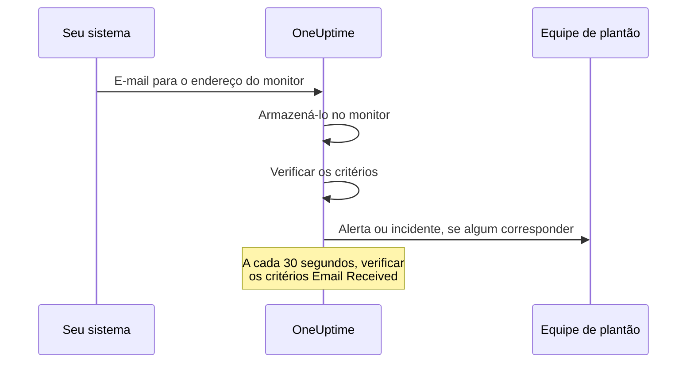

# Monitor de e-mails recebidos

Um monitor de e-mails recebidos dá a você um endereço de e-mail que pertence a um único monitor. Qualquer coisa que envie e-mail (um job de backup, um sistema legado, os alertas de um provedor de nuvem) manda seus resultados para ele, e o OneUptime verifica cada e-mail com base nos seus critérios para marcar o monitor como fora do ar, abrir um incidente ou criar um alerta, e para resolvê-los quando chega o aviso de normalização.

:::cards
- [Criar o monitor](#criar-um-monitor-de-e-mails-recebidos): Obtenha um endereço e aponte seu remetente para ele.
- [Verificar o endereço](#verificar-o-endereço-com-o-remetente): Leia no monitor o e-mail de confirmação de um remetente.
- [Escrever critérios](#tipos-de-filtro-disponíveis): Compare assunto, remetente ou corpo, ou alerte quando os e-mails param.
- [Usar o e-mail nos alertas](#variáveis-de-modelo): Coloque o assunto e o corpo em títulos e descrições.
:::

## Como funciona

O e-mail é um modelo push: seu sistema envia e o OneUptime escuta. Cada e-mail é verificado com base nos critérios do monitor assim que chega. Os critérios que procuram um e-mail que *deveria* ter chegado também são verificados periodicamente, a cada 30 segundos.



1. Quando você cria um monitor de e-mails recebidos, o OneUptime dá a ele um endereço de e-mail único.
2. Cada e-mail enviado a esse endereço é armazenado no monitor e avaliado com base nos critérios dele, de cima para baixo; o primeiro critério que corresponde decide.
3. Um critério que corresponde pode mudar o status do monitor, criar um alerta e declarar um incidente. Um incidente com **Resolver incidente automaticamente** ligado, ou um alerta com **Resolver alerta automaticamente** ligado, é resolvido quando outro critério corresponde mais tarde: por exemplo, o que marca o monitor como online.

## Criar um monitor de e-mails recebidos

:::steps
### Começar um novo monitor

Vá para **Monitores** e clique em **Criar monitor**.

### Escolher Incoming Email

Em **Tipo de monitor**, clique em **Mais tipos de monitor** e escolha **Incoming Email** em **Inbound Monitoring**, ou digite `email` na caixa de pesquisa. Digite um **Nome** e clique em **Próximo**.

### Revisar os critérios

A etapa **Critérios** começa com [os critérios padrão](#o-que-você-recebe-de-saída), que marcam o monitor como offline quando um e-mail menciona `error`. Clique em um critério para alterá-lo, ou em **Adicionar critérios** para adicionar um. Veja [Configurações de exemplo](#configurações-de-exemplo) para configurações comuns.

### Criar o monitor

Clique em **Criar monitor**. O monitor abre na página **Visão geral**, onde o cartão **Incoming Email Address** mostra o endereço com um botão de copiar até chegar o primeiro e-mail.

### Enviar e-mail para o endereço

Configure seu sistema para enviar as notificações dele para o endereço. Se o remetente pedir que você confirme o endereço primeiro, veja [Verificar o endereço com o remetente](#verificar-o-endereço-com-o-remetente).
:::

> [!NOTE]
> O endereço contém a chave secreta do monitor, então só as pessoas que podem editar monitores conseguem vê-lo. Os demais veem que os detalhes de configuração estão ocultos.

## Formato do endereço de e-mail

Cada monitor de e-mails recebidos ganha um endereço único neste formato:

```text
monitor-{secret-key}@{inbound-domain}
```

A chave secreta é um UUID, por exemplo `monitor-3f2b8c1e-5d4a-4f6b-9a7c-2e1d0b9f8a6c@inbound.yourdomain.com`. Depois que o primeiro e-mail chega, o endereço continua na página **Visão geral** do monitor, no cartão **Inbound email address**, ao lado da hora do último e-mail. A página **Documentação** do monitor também o mostra.

## Redefinir ou personalizar o endereço de e-mail

Vá para a aba **Configurações** do monitor. O cartão **Incoming Email Address** mostra o endereço atual e oferece duas formas de substituí-lo:

| Ação | O que faz | Quando usar |
| --- | --- | --- |
| **Reset Address** | Dá ao monitor um novo endereço `monitor-{secret-key}@{inbound-domain}` gerado aleatoriamente. Se o monitor tiver um endereço personalizado, a redefinição o remove. Pede confirmação antes. | O endereço vazou, ou você quer cortar o que estiver enviando para ele. |
| **Customize Address** | Permite escolher a parte antes do @, por exemplo `nightly-backups@{inbound-domain}`. Digite-a em **Address name** (você pode digitar o nome ou colar o endereço inteiro) e clique em **Save Address**. | Você quer um endereço que as pessoas reconheçam. |

As duas ações terminam mostrando o novo endereço com um botão de copiar.

> [!WARNING]
> **O endereço antigo para de funcionar na hora**: os e-mails enviados a ele são ignorados, então atualize todos os sistemas que enviam e-mail para este monitor.

Regras para endereços personalizados:

- De 3 a 64 caracteres: letras minúsculas, números, pontos (`.`), hifens (`-`) e sublinhados (`_`), sem dois pontos seguidos. Ele precisa começar e terminar com uma letra ou um número. Letras maiúsculas digitadas são convertidas em minúsculas para você.
- O domínio é sempre o domínio de e-mail de entrada do servidor.
- O nome não pode já estar em uso por outro monitor. Todos os projetos do servidor compartilham o domínio de entrada, então o nome precisa ser único entre todos eles.
- Nomes no formato `monitor-{id}` e `workflow-{id}` são reservados para endereços gerados. Nomes de caixa de correio que pertencem ao próprio domínio também são reservados: `abuse`, `admin`, `administrator`, `hostmaster`, `mailer-daemon`, `noc`, `postmaster`, `root`, `security` e `webmaster`.

Um endereço personalizado é uma credencial tanto quanto um gerado: qualquer pessoa que o conheça pode enviar e-mails que este monitor avalia. Endereços gerados são praticamente impossíveis de adivinhar, mas um nome curto e óbvio não é. Escolha algo difícil de adivinhar se isso for importante para você.

Usuários da API podem fazer o mesmo pela API de monitores, em um monitor existente: defina `incomingEmailCustomLocalPart` com o nome para usar um endereço personalizado, ou com `null` para voltar ao gerado. Redefinir significa gravar um novo `incomingEmailSecretKey` e definir `incomingEmailCustomLocalPart` como `null` na mesma atualização.

## Verificar o endereço com o remetente

Alguns serviços não enviam alertas para um endereço novo até que alguém prove que consegue ler os e-mails que chegam lá. Eles enviam primeiro um e-mail de verificação, que chega ao monitor como qualquer outro e-mail. Para lê-lo:

:::steps
### Adicionar o endereço ao serviço

Adicione o endereço do monitor ao serviço e salve. O serviço envia o e-mail de verificação.

### Abrir o e-mail mais recente

No OneUptime, abra o monitor. Na página **Visão geral**, o cartão **Resumo do monitor** mostra o e-mail mais recente. Confira se **De** e **Assunto** são do e-mail de verificação e clique em **Mostrar mais detalhes**.

### Copiar o código ou o link

O código ou o link está em **Corpo do e-mail (Texto)**. **Corpo do e-mail (HTML)** mostra o código-fonte HTML, então, se você copiar um link de lá, troque cada `&amp;` por `&`.

### Concluir a verificação

Conclua a verificação como o e-mail indicar.
:::

Se outro e-mail chegou desde então, o cartão não mostra mais o e-mail de verificação. Abra **Registros de monitoramento**, encontre o e-mail de verificação pelo assunto na coluna **E-mail** e clique em **Ver resumo** nessa linha.

> [!IMPORTANT]
> **Seus critérios também o veem.** O e-mail de verificação é avaliado como qualquer outro e-mail. Uma frase como "if you received this in error" corresponde ao critério padrão `error` e marca o monitor como offline. Para evitar isso, desligue **Verificar este monitor** no cartão **Monitoramento** da página **Configurações** do monitor enquanto verifica (ele pede confirmação). Um monitor com o monitoramento desligado continua registrando o e-mail, e o cartão **Resumo do monitor** continua mostrando-o. Mas ele não avalia nada, então o e-mail não ganha uma linha em **Registros de monitoramento**: leia-o antes que chegue outro e-mail. Ao terminar, clique em **Ligar o monitoramento** no banner no topo das páginas do monitor, ou ligue o interruptor de novo.

**A verificação pertence ao endereço.** Se você [redefinir ou personalizar o endereço](#redefinir-ou-personalizar-o-endereço-de-e-mail), o serviço vê um novo destinatário, e você precisa verificar de novo.

### Grupos de ações do Azure Monitor

Desde julho de 2026, o Azure vem implantando a exigência de que todo novo destinatário **Email** de um grupo de ações seja verificado com um código de uso único. Enquanto isso não acontece, o grupo de ações não envia a esse endereço nem alertas nem notificações de teste.

:::steps
1. Adicione ao grupo de ações uma notificação **Email** com o endereço do monitor, e salve o grupo de ações. O Azure envia o e-mail de verificação de um endereço da Microsoft como `azure-noreply@microsoft.com`.
2. Leia-o no monitor como descrito acima, e siga as instruções dele em até 30 minutos depois de salvar o grupo de ações. Se o código expirar, abra o grupo de ações e selecione **Resend**.
3. Abra o grupo de ações e selecione **Test** para enviar uma notificação de teste. Ela chega ao monitor como um alerta de verdade, então também mostra se seus critérios correspondem aos e-mails do Azure.
:::

A verificação vale para todos os grupos de ações do mesmo locatário do Azure, então cada endereço só precisa ser verificado uma vez.

### Amazon SNS

Uma assinatura de e-mail de um tópico do SNS não recebe nada até ser confirmada. Quando você cria a assinatura, o Amazon SNS envia um e-mail de confirmação para o endereço. Leia-o no monitor como descrito acima, e abra o link **Confirm subscription** dele no navegador. O SNS exclui uma assinatura que não é confirmada em 48 horas; se isso acontecer, crie a assinatura de novo.

## O que você recebe de saída

Um novo monitor de e-mails recebidos é criado com dois critérios que leem o corpo do e-mail:

| Critério | Tipo de filtro | Condição do filtro | Valor | Efeito |
| -------- | ----------- | ---------------- | ------- | -------------------------------------------- |
| Offline  | Email Body  | Contém | `error` | Marca o monitor como offline, abre um incidente |
| Online   | Email Body  | Not Contains | `error` | Marca o monitor como online |

Isso atende ao caso comum em que um job ou uma ferramenta de terceiros envia o próprio resultado por e-mail: uma mensagem cujo corpo menciona `error` deixa o monitor offline, e a próxima mensagem sem essa palavra o traz de volta e resolve o incidente. A comparação no corpo não diferencia maiúsculas de minúsculas, então `Error` e `ERROR` também correspondem.

Troque o valor pelo que seu remetente realmente escreve (`FAILED`, `exit code 1` e assim por diante).

> [!NOTE]
> Esses critérios padrão **não** são um interruptor de homem morto: nada aqui dispara quando os e-mails param de chegar. Critérios que só leem o assunto, o remetente, o corpo ou o destinatário são avaliados quando um e-mail chega e em nenhum outro momento. Para ser alertado sobre o silêncio, adicione um critério **Email Received** / **Not Recieved In Minutes**: veja o [Exemplo 3](#exemplo-3-monitor-de-heartbeat-sem-e-mail-alerta).

## Tipos de filtro disponíveis

Você pode criar critérios com base nestes campos do e-mail:

| Tipo de filtro | Descrição |
| ------------------------- | ----------------------------------------------------------------------------------- |
| **Assunto do e-mail** | A linha de assunto do e-mail recebido |
| **Email From Address** | O endereço do remetente: só o endereço, em minúsculas, sem nome de exibição |
| **Email Body** | A parte de texto simples do corpo do e-mail |
| **Email To Address** | O endereço de e-mail do destinatário |
| **Email Received** | Critérios de tempo sobre quando os e-mails são recebidos |
| **JavaScript Expression** | Uma expressão JavaScript personalizada que precisa resultar em verdadeiro |

O endereço do próprio monitor é mascarado antes de qualquer critério ler o e-mail, então em **Email To Address**, **Assunto do e-mail** e **Email Body** ele aparece como `[REDACTED]`.

## Condições do filtro

### Filtros de string (assunto, remetente, corpo, destinatário)

| Condição do filtro | Descrição | Exemplo |
| ---------------- | ----------------------------------------- | ---------------------------------- |
| **Contém** | O campo contém o texto informado | O assunto contém "CRITICAL" |
| **Not Contains** | O campo não contém o texto informado | O assunto não contém "TEST" |
| **Equal To** | O campo corresponde exatamente ao texto informado | O remetente é igual a "alerts@service.com" |
| **Not Equal To** | O campo não corresponde ao texto informado | O assunto é diferente de "OK" |
| **Starts With** | O campo começa com o texto informado | O assunto começa com "[ALERT]" |
| **Ends With** | O campo termina com o texto informado | O assunto termina com "- Production" |
| **Is Empty** | O campo está vazio ou em branco | O corpo está vazio |
| **Is Not Empty** | O campo tem conteúdo | O assunto não está vazio |

Todas essas comparações não diferenciam maiúsculas de minúsculas. Um filtro com valor vazio nunca corresponde.

### Filtros de tempo (Email Received)

O dashboard escreve essas condições "Recieved".

| Condição do filtro | Descrição | Exemplo |
| --------------------------- | ----------------------------------- | -------------------------------- |
| **Recieved In Minutes** | Um e-mail foi recebido em até X minutos | E-mail recebido em 30 minutos |
| **Not Recieved In Minutes** | Nenhum e-mail recebido em X minutos | Nenhum e-mail recebido em 60 minutos |

Um monitor que nunca recebeu um e-mail conta a hora de criação como o último e-mail.

### JavaScript Expression

| Condição do filtro | Descrição |
| --------------------- | ------------------------------------- |
| **Evaluates To True** | A expressão retorna um valor verdadeiro |

A expressão roda em um sandbox sem campos de e-mail vinculados, então não consegue ler o assunto, o remetente, o corpo nem o destinatário da mensagem que disparou a verificação. Use os tipos de filtro **Assunto do e-mail**, **Email From Address**, **Email Body** e **Email To Address** para comparar o conteúdo do e-mail.

## Configurações de exemplo

Cada exemplo é um par de critérios. Um critério tem filtros, uma **Condição de correspondência** (**Todos** ou **Qualquer** dos seus filtros) e ações: mudar o status do monitor, criar um alerta, declarar um incidente. Ligue **Resolver alerta automaticamente** (ou **Resolver incidente automaticamente**) em **Mais campos** no alerta ou no incidente, para que o segundo critério resolva o que o primeiro abriu.

### Exemplo 1: criar um alerta com e-mails críticos

| Critério | Filtros | Condição de correspondência | Ações |
| --- | --- | --- | --- |
| E-mail crítico | **Assunto do e-mail** Contém `CRITICAL`; **Assunto do e-mail** Contém `ALERT`; **Assunto do e-mail** Contém `ERROR` | **Qualquer** | Mudar o status para offline; criar um alerta |
| E-mail de recuperação | **Assunto do e-mail** Contém `RESOLVED`; **Assunto do e-mail** Contém `RECOVERED` | **Qualquer** | Mudar o status para online |

Coloque o critério crítico primeiro: os critérios são verificados de cima para baixo, e o primeiro que corresponde decide.

### Exemplo 2: monitorar um remetente específico

| Critério | Filtros | Condição de correspondência | Ações |
| --- | --- | --- | --- |
| Job com falha | **Email From Address** Equal To `monitoring@legacy-system.com`; **Assunto do e-mail** Contém `Failed` | **Todos** | Mudar o status para offline; declarar um incidente |
| Job bem-sucedido | **Email From Address** Equal To `monitoring@legacy-system.com`; **Assunto do e-mail** Contém `Success` | **Todos** | Mudar o status para online |

### Exemplo 3: monitor de heartbeat (sem e-mail = alerta)

| Critério | Filtros | Ações |
| --- | --- | --- |
| O e-mail está atrasado | **Email Received** Not Recieved In Minutes `60` | Mudar o status para offline; criar um alerta |
| O e-mail chegou | **Email Received** Recieved In Minutes `60` | Mudar o status para online |

O primeiro critério dispara quando nenhum e-mail chegou por 60 minutos: útil para jobs agendados ou processos em lote que enviam um e-mail ao terminar. O segundo resolve o alerta assim que um chega. Os minutos em que o próprio OneUptime não estava recebendo e-mail não contam para os 60, como explica [Quando o OneUptime não recebe dados](/docs/monitor/when-oneuptime-is-not-receiving).

## Casos de uso

| Caso de uso | O que o monitor faz |
| --- | --- |
| Integração de sistemas legados | Transforma em incidentes do OneUptime os alertas só por e-mail de sistemas antigos, e os resolve quando chega o e-mail de recuperação. |
| Serviços de terceiros | Recebe notificações de provedores de nuvem (AWS, GCP, Azure), scanners de segurança, ferramentas de backup e avisos de expiração de certificados. |
| Jobs agendados | Alerta quando um e-mail de conclusão está atrasado, ou quando um job informa uma falha por e-mail. |
| Agregação de alertas | Reúne os alertas por e-mail do Nagios, do Zabbix ou de outras ferramentas, para que o OneUptime seja o único lugar onde você os gerencia. |

## Variáveis de modelo

Os títulos, as descrições e as notas de correção dos alertas e incidentes que este monitor cria podem usar estas variáveis. Os formulários de alerta e de incidente do critério as listam em **Variáveis de modelo**, e [Modelos de incidentes e alertas](/docs/monitor/incident-alert-templating) explica a sintaxe.

| Variável | Descrição |
| --------------------- | ----------------------------------------------------------------- |
| `{{emailSubject}}`    | O assunto do e-mail recebido |
| `{{emailFrom}}`       | O endereço de e-mail do remetente |
| `{{emailTo}}`         | Para quem o e-mail foi enviado, com o endereço deste monitor mascarado |
| `{{emailBody}}`       | O corpo do e-mail em texto simples |
| `{{emailReceivedAt}}` | Quando o e-mail foi recebido, como carimbo de data/hora ISO 8601 em UTC |

- **Um título recebe uma linha de cada.** Em um título, cada variável é cortada em uma linha de no máximo 150 caracteres, terminando em `...` quando era mais longa. Um título não pode passar de 500 caracteres, e um alerta ou incidente com título longo demais nem chega a ser criado, então citar um e-mail inteiro impediria o monitor de alertar sobre e-mails longos. Descrições e notas de correção recebem o valor completo.
- **O endereço deste monitor é mascarado.** O endereço funciona como uma senha, então é mascarado antes de o e-mail ser armazenado, e `{{emailTo}}` aparece como `monitor-[REDACTED]@{inbound-domain}` (ou `[REDACTED]@{inbound-domain}` para um endereço personalizado).
- **Uma verificação de e-mail ausente usa o último e-mail.** Quando um critério **Email Received** abre um alerta porque nenhum e-mail chegou a tempo, as variáveis descrevem o último e-mail que o monitor recebeu. Elas ficam vazias se nenhum chegou ainda.

## Visão Resumo do monitor

Depois que o monitor recebe um e-mail, o cartão **Resumo do monitor** na página **Visão geral** mostra o mais recente:

- **Último E-mail Recebido Em**: quando o e-mail mais recente foi recebido
- **De**: o remetente do último e-mail
- **Assunto**: a linha de assunto do último e-mail

Clique em **Mostrar mais detalhes** para ver o resto:

- **Cabeçalhos do e-mail**: os cabeçalhos completos do último e-mail
- **Corpo do e-mail (Texto)**: o corpo em texto simples
- **Corpo do e-mail (HTML)**: o corpo HTML, mostrado como código-fonte HTML em vez de renderizado

### E-mails anteriores

O cartão só mostra o e-mail mais recente. Cada e-mail que o monitor avalia também é gravado em **Registros de monitoramento**: a coluna **E-mail** mostra o assunto e o remetente dele, e **Ver resumo** na linha dele mostra o e-mail inteiro do mesmo jeito que o cartão. Um monitor com o monitoramento desligado não avalia nada, então os e-mails que ele recebe não ganham linhas. Se um dos seus critérios verificar **Email Received**, o monitor também grava uma linha a cada verificação de e-mail ausente. A coluna **E-mail** mostra "Scheduled check" nessas linhas, e o **Ver resumo** delas mostra o e-mail mais recente no momento da verificação, ou "No email yet" se nenhum tinha chegado. Os registros de monitoramento são mantidos por um dia por padrão. Em um servidor auto-hospedado, um administrador pode mudar isso com **Retenção de Registros do Monitor (Dias)** nas configurações do Admin Dashboard.

## Configuração auto-hospedada

Se você auto-hospeda o OneUptime, precisa configurar um provedor de e-mail de entrada. Atualmente há suporte para:

- **SendGrid Inbound Parse** - Veja [E-mail recebido SendGrid](/docs/self-hosted/sendgrid-inbound-email) para as instruções de configuração

Enquanto ele não estiver configurado, o cartão de endereço do monitor diz que o e-mail de entrada não está configurado.

## Pontos a considerar

- **Segurança do endereço de e-mail**: o endereço de e-mail do monitor funciona como uma senha: qualquer pessoa que o conheça pode enviar e-mails ao monitor. Não o compartilhe publicamente, e redefina-o na aba **Configurações** do monitor se ele vazar.
- **Tamanho do e-mail**: o OneUptime aceita um e-mail recebido de até 50 MB, anexos incluídos. Os anexos não são armazenados, só os nomes, tipos e tamanhos deles.
- **Tempo de processamento**: os e-mails são processados de forma assíncrona. Pode haver alguns segundos entre o envio de um e-mail e a criação do alerta.
- **Sem diferenciar maiúsculas de minúsculas**: todas as comparações de strings (Contém, Equal To etc.) não diferenciam maiúsculas de minúsculas.
- **Texto simples**: os critérios sobre o corpo leem a parte de texto simples do e-mail. Um e-mail enviado só em HTML tem o corpo vazio para os critérios, então não contém `error`, e os critérios padrão marcam o monitor como online.

## Solução de problemas

### Os e-mails não estão chegando

1. Confira se o endereço de e-mail está correto (procure erros de digitação).
2. Confira se o remetente está esperando que você verifique o endereço. Os grupos de ações do Azure Monitor e o Amazon SNS não enviam nada para um endereço novo até que ele seja verificado. Veja [Verificar o endereço com o remetente](#verificar-o-endereço-com-o-remetente).
3. Confira se o e-mail está sendo bloqueado por filtros de spam.
4. Confira se o seu provedor de e-mail de entrada está configurado corretamente.
5. Procure mensagens de erro nos logs do OneUptime.

### Os alertas não estão sendo criados

1. Confira se seus critérios correspondem ao conteúdo do e-mail. Lembre-se de que o endereço do próprio monitor aparece como `[REDACTED]`, e que um e-mail só em HTML tem o corpo vazio.
2. Confira se o monitoramento está ligado: página **Configurações** do monitor, cartão **Monitoramento**.
3. Abra **Registros de monitoramento** e clique em **Ver resumo** na linha do e-mail para ver o que os critérios leram.
4. Confira a ordem dos seus critérios: o primeiro que corresponde decide.

### Os alertas não estão sendo resolvidos

1. Confira se os seus critérios de resolução correspondem ao e-mail de recuperação.
2. Confira se **Resolver alerta automaticamente** (ou **Resolver incidente automaticamente**) está ligado no critério que o abriu.
3. Confira se o e-mail de resolução é enviado para o mesmo endereço do monitor.

## Próximos passos

:::cards
- [Modelos de incidentes e alertas](/docs/monitor/incident-alert-templating): Coloque o assunto e o corpo do e-mail nos alertas.
- [Monitor de requisições recebidas](/docs/monitor/incoming-request-monitor): Receba heartbeats e webhooks por HTTP em vez disso.
- [E-mail recebido SendGrid](/docs/self-hosted/sendgrid-inbound-email): Configure o e-mail de entrada em um servidor auto-hospedado.
:::
