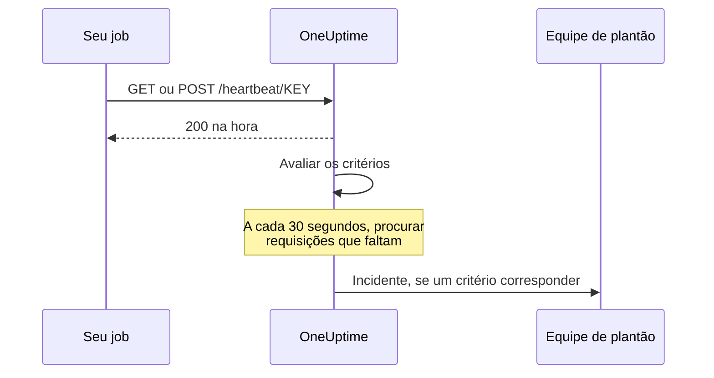

# Monitor de requisições recebidas

Um monitor de requisições recebidas dá a você uma URL para a qual outros sistemas enviam requisições HTTP. O OneUptime avalia cada requisição com base nos seus critérios e pode mudar o status do monitor, declarar incidentes e acionar sua escala de plantão.

Ele cobre dois trabalhos diferentes:

- **Monitoramento por heartbeat** — um cron job, um worker ou um dispositivo chama a URL periodicamente, e o OneUptime abre um incidente quando as chamadas param de chegar.
- **Receber alertas de outro sistema** — Prometheus Alertmanager, Grafana ou qualquer coisa capaz de enviar JSON por POST envia seus alertas, e o OneUptime transforma cada um em um incidente com escalonamento de plantão e resolução automática na recuperação.

Os dois usam o mesmo tipo de monitor. O que os separa são os critérios que você configura.

:::cards
- [Criar o monitor](#criar-um-monitor-de-requisições-recebidas): Obtenha uma URL de heartbeat em poucos passos.
- [Enviar um heartbeat](#enviar-um-heartbeat): Pelo curl, cron, Node.js, Python ou Go.
- [Alertar quando as chamadas param](#marcar-como-offline-se-não-houver-heartbeat-em-10-minutos-um-interruptor-de-homem-morto): Transforme o monitor em um interruptor de homem morto.
- [Receber alertas](#receber-alertas-de-outro-sistema): Um incidente por alerta do Alertmanager ou do Grafana.
:::

## Como funciona

Nada verifica seu sistema de fora: seu sistema chama a URL do monitor, o OneUptime responde na hora e depois avalia a requisição com base nos critérios do monitor. Um critério que procura requisições que *pararam* de chegar também é reavaliado em segundo plano a cada 30 segundos, para que o silêncio também possa abrir um incidente.



Use-o para:

- Monitorar cron jobs e tarefas agendadas
- Verificar se os workers em segundo plano estão rodando
- Monitorar serviços atrás de firewalls que não podem ser alcançados de fora
- Receber alertas do Prometheus Alertmanager, do Grafana e de outros sistemas de alerta
- Acompanhar sinais de heartbeat de qualquer sistema capaz de usar HTTP

## Criar um monitor de requisições recebidas

:::steps
### Começar um novo monitor

Vá para **Monitores** e clique em **Criar monitor**.

### Escolher Incoming Request

Em **Tipo de monitor**, escolha **Incoming Request**: ele é um dos tipos comuns no topo. Digite um **Nome** e clique em **Próximo**.

### Revisar os critérios

A etapa **Critérios** começa com [os critérios padrão](#o-que-você-recebe-de-saída). Para um heartbeat, clique em **Adicionar critérios** e dê ao novo critério um filtro **Incoming Request** / **Not Recieved In Minutes** que mude o status para offline e declare um incidente, com **Resolver incidente automaticamente** ligado. Depois arraste-o para o topo da lista: veja [Critérios de exemplo](#critérios-de-exemplo) para entender por quê.

### Criar o monitor

Clique em **Criar monitor**. O monitor abre na página **Visão geral**, onde o cartão **Send the first heartbeat** mostra a **Heartbeat URL** com um botão de copiar e um comando `curl` de exemplo.

### Enviar a primeira requisição

Configure seu serviço para enviar requisições a essa URL (veja [Enviar um heartbeat](#enviar-um-heartbeat)). Quando a primeira requisição chega, o cartão dá lugar ao histórico do monitor, e um cartão **Heartbeat URL** mostra a URL e quando chegou a última requisição.
:::

> [!NOTE]
> A URL contém a chave secreta do monitor, então só as pessoas que podem editar monitores conseguem vê-la. Você pode encontrá-la de novo a qualquer momento na página **Documentação** do monitor, na seção **Configuração** do menu lateral.

## A URL de requisição

Seu monitor tem uma URL única neste formato:

```text
https://oneuptime.com/heartbeat/YOUR_SECRET_KEY
```

Substitua `https://oneuptime.com` pela URL da sua instância do OneUptime se ela for auto-hospedada.

Envie requisições **GET** ou **POST** para essa URL. HEAD é aceito e tratado como GET; PUT, PATCH e DELETE retornam 404. A chave secreta no caminho é a única credencial: não é preciso cabeçalho nem token. Query strings são ignoradas: envie o que os critérios devem ler no corpo ou nos cabeçalhos.

> [!WARNING]
> Qualquer pessoa que conheça essa URL pode marcar o monitor como saudável, então trate-a como um segredo. Se ela vazar, abra a página **Configurações** do monitor e clique em **Redefinir chave secreta de requisição recebida**, depois atualize cada remetente. Todo cabeçalho que você envia é armazenado no monitor e fica visível para quem pode lê-lo: não envie chaves de API nem tokens em cabeçalhos para esse endpoint.

> [!IMPORTANT]
> O OneUptime responde `200` com um objeto JSON vazio (`{}`) na hora e processa a requisição em uma fila. Essa resposta é escrita antes de qualquer validação, então um `200` **não** confirma que a requisição foi aceita: uma chave secreta errada, um monitor excluído e um monitor desativado também retornam `200`. Confira a linha do tempo do monitor para confirmar que as requisições estão chegando.

### Enviar um corpo de requisição

Se você quiser acessar campos dentro do corpo (`{{requestBody.status}}` em um título de incidente, um caminho JSON no agrupamento de incidentes ou um critério de expressão JavaScript), envie `Content-Type: application/json`. É o formato que esta documentação pressupõe o tempo todo. O corpo precisa ser um objeto ou um array JSON: um JSON malformado, ou um valor solto como `"error"`, é recusado com um `500`.

| Tipo de conteúdo | O que critérios e modelos veem |
| --- | --- |
| `application/json` | O JSON analisado. |
| `application/x-www-form-urlencoded` | O formulário analisado. Chaves entre colchetes são aninhadas (`alerts[0][status]=firing`), e cada valor é uma string. |
| Qualquer outro, ou nenhum | Um corpo vazio (`{}`), então toda referência a `requestBody` não resolve nada. |

Corpos de até 50 MB são aceitos; um maior é recusado com um `413`. Não comprima o corpo com `Content-Encoding: gzip`: ele não é armazenado como JSON, e os caminhos dentro dele não serão resolvidos.

### Enviar um heartbeat

Cada exemplo envia uma requisição. Substitua `YOUR_SECRET_KEY` pela chave da URL do seu monitor.

:::tabs
@tab curl
```bash
# Simple GET request
curl https://oneuptime.com/heartbeat/YOUR_SECRET_KEY

# POST request with a JSON body
curl -X POST https://oneuptime.com/heartbeat/YOUR_SECRET_KEY \
  -H "Content-Type: application/json" \
  -d '{"status": "healthy", "version": "1.2.3"}'
```
@tab Cron
```bash
# Send a heartbeat every 5 minutes
*/5 * * * * curl -fsS https://oneuptime.com/heartbeat/YOUR_SECRET_KEY > /dev/null

# Or ping only when the job succeeds, so a failed run counts as a missed heartbeat
0 2 * * * /usr/local/bin/backup.sh && curl -fsS https://oneuptime.com/heartbeat/YOUR_SECRET_KEY > /dev/null
```
@tab Node.js
```javascript title="heartbeat.mjs"
// Node.js 18 or later: fetch is built in. Run with `node heartbeat.mjs`.
const response = await fetch(
  "https://oneuptime.com/heartbeat/YOUR_SECRET_KEY",
  {
    method: "POST",
    headers: { "Content-Type": "application/json" },
    body: JSON.stringify({ status: "healthy", version: "1.2.3" }),
  },
);

console.log(response.status); // 200
```
@tab Python
```python title="heartbeat.py"
# Python 3, standard library only. Run with `python3 heartbeat.py`.
import json
import urllib.request

request = urllib.request.Request(
    "https://oneuptime.com/heartbeat/YOUR_SECRET_KEY",
    data=json.dumps({"status": "healthy", "version": "1.2.3"}).encode(),
    headers={"Content-Type": "application/json"},
    method="POST",
)

with urllib.request.urlopen(request, timeout=10) as response:
    print(response.status)  # 200
```
@tab Go
```go title="heartbeat.go"
// Run with `go run heartbeat.go`.
package main

import (
	"bytes"
	"fmt"
	"net/http"
)

func main() {
	body := []byte(`{"status": "healthy", "version": "1.2.3"}`)

	resp, err := http.Post(
		"https://oneuptime.com/heartbeat/YOUR_SECRET_KEY",
		"application/json",
		bytes.NewReader(body),
	)
	if err != nil {
		panic(err)
	}
	defer resp.Body.Close()

	fmt.Println(resp.StatusCode) // 200
}
```
@tab PowerShell
```powershell
# Windows PowerShell 5.1 or PowerShell 7
Invoke-RestMethod -Method Post `
  -Uri "https://oneuptime.com/heartbeat/YOUR_SECRET_KEY" `
  -ContentType "application/json" `
  -Body '{"status": "healthy", "version": "1.2.3"}'
```
:::

## Critérios de monitoramento

Você pode configurar critérios para determinar quando seu serviço é considerado online, degradado ou offline. Cada filtro de critério tem um **Tipo de filtro** (o que olhar), uma **Condição do filtro** (como comparar) e um **Valor**.

### O que você recebe de saída

Um novo monitor de requisições recebidas é criado com dois critérios que leem o corpo da requisição:

| Critério | Tipo de filtro | Condição do filtro | Valor | Efeito |
| -------- | ------------ | ---------------- | ------- | -------------------------------------------- |
| Offline  | Corpo da Requisição | Contém | `error` | Marca o monitor como offline, abre um incidente |
| Online   | Corpo da Requisição | Not Contains | `error` | Marca o monitor como online |

Isso atende ao caso comum em que o remetente informa a própria saúde no payload: uma requisição cujo corpo menciona `error` deixa o monitor offline, e a próxima requisição sem essa palavra o traz de volta e resolve o incidente. Uma requisição sem corpo nenhum conta como "não contém `error`", então uma simples chamada de heartbeat mantém o monitor online.

Troque o valor pelo que seu remetente realmente emite (`"status":"firing"`, `FAILED` e assim por diante): a correspondência é uma busca de substring que diferencia maiúsculas de minúsculas em todo o corpo, chaves incluídas, então `{"error":null}` também corresponde a `error`.

> [!NOTE]
> Esses critérios padrão **não** são um interruptor de homem morto: nada aqui dispara quando as requisições param de chegar. Se você quiser ser alertado sobre o silêncio, adicione um critério **Incoming Request** / **Not Recieved In Minutes** como descrito abaixo.

### Tipos de filtro disponíveis

| Tipo de filtro | Verifica | Observações |
| --------------------- | ------------------------------------------------------ | -------------------------------------------------------------------------------------------- |
| Incoming Request | Se uma requisição foi recebida dentro de uma janela de tempo | A única verificação que pode disparar quando nada chega |
| Corpo da Requisição | O corpo da requisição | Busca de substring. Corpos de objeto são comparados como JSON compacto |
| Request Header | Os nomes dos cabeçalhos da requisição | Correspondência exata com um nome de cabeçalho inteiro, sem diferenciar maiúsculas de minúsculas |
| Request Header Value | Os valores dos cabeçalhos da requisição | Correspondência exata com um valor de cabeçalho inteiro, sem diferenciar maiúsculas de minúsculas |
| JavaScript Expression | Qualquer expressão sobre `requestBody` e `requestHeaders` | A opção mais flexível: veja [Expressões JavaScript](/docs/monitor/javascript-expression) |

### Condições do filtro

Cada tipo de filtro oferece suas próprias condições:

| Tipo de filtro | Condições |
| --- | --- |
| **Incoming Request** | **Recieved In Minutes**: uma requisição foi recebida dentro do número de minutos informado. **Not Recieved In Minutes**: nenhuma requisição foi recebida dentro do número de minutos informado. (O dashboard as escreve assim.) |
| **Corpo da Requisição**, **Request Header**, **Request Header Value** | **Contém** e **Not Contains** |
| **JavaScript Expression** | **Evaluates To True** |

> [!NOTE]
> Nomes e valores de cabeçalhos são comparados em minúsculas, com o nome ou o valor inteiro, não com uma substring: `application/json` não corresponde a `application/json; charset=utf-8`. Só **Corpo da Requisição** faz busca de substring. Os cabeçalhos que seu proxy ou o balanceador de carga do OneUptime adicionam (`x-forwarded-for`, `x-real-ip`) também são armazenados.

Corpos de objeto são comparados como JSON compacto sem espaços, então um filtro **Corpo da Requisição** / **Contém** precisa ser escrito `"status":"firing"`: copiar `"status": "firing"` de um payload formatado nunca vai corresponder.

### Critérios de exemplo

#### Marcar como offline se não houver heartbeat em 10 minutos (um interruptor de homem morto)

| Campo | Valor |
| --- | --- |
| **Tipo de filtro** | Incoming Request |
| **Condição do filtro** | Not Recieved In Minutes |
| **Valor** | `10` |

#### Marcar como degradado com base no conteúdo do corpo da requisição

| Campo | Valor |
| --- | --- |
| **Tipo de filtro** | Corpo da Requisição |
| **Condição do filtro** | Contém |
| **Valor** | `"status":"degraded"` |

> [!IMPORTANT]
> Coloque o interruptor de homem morto **acima** dos critérios padrão. Os critérios são verificados de cima para baixo, e o primeiro que corresponde decide. A verificação em segundo plano relê a última requisição, então o critério online padrão ("Request Body Not Contains `error`") continua correspondendo a ela, e um critério abaixo dele nunca tem sua vez. **Adicionar critérios** adiciona um critério no final: arraste-o para cima.

> [!WARNING]
> Um monitor só é reavaliado em segundo plano se pelo menos um dos seus critérios verificar **Incoming Request**. Um monitor cujos critérios só verificam o corpo da requisição, Request Header ou uma expressão JavaScript é avaliado quando uma requisição chega e em nenhum outro momento, então nunca pode ficar offline sozinho. Se você quer um alarme de heartbeat ausente, precisa de um critério **Incoming Request**.

A verificação em segundo plano conta minutos inteiros e dispara quando passou *mais* que o valor: "Not Recieved In Minutes: 10" dispara cerca de 11 minutos depois da última requisição (a verificação roda a cada 30 segundos). Um monitor que nunca recebeu uma requisição é tratado como se a hora de criação fosse a última requisição, então o mesmo critério em um monitor recém-criado dispara cerca de 11 minutos depois da criação, mesmo que o remetente nunca tenha sido configurado. Só contam os minutos em que o OneUptime estava recebendo: os minutos em que o próprio OneUptime reinicia, é atualizado ou se recupera de atrasos não contam, como explica [Quando o OneUptime não recebe dados](/docs/monitor/when-oneuptime-is-not-receiving).

## Receber alertas de outro sistema

Alertmanager, Grafana e ferramentas parecidas enviam por POST um documento JSON que descreve um ou mais alertas. Por padrão, um critério abre **um** incidente, então um payload com cinco alertas geraria um único incidente. O agrupamento de incidentes muda isso: ele extrai um valor do payload e abre um **incidente separado para cada valor distinto**, todos podendo estar abertos ao mesmo tempo.

```mermaid title="Agrupamento de incidentes: um incidente por alerta do payload"
flowchart TB
    payload["Payload do webhook"] --> keys["Uma chave por alerta"]
    keys --> state{"Alerta resolvido?"}
    state -->|Não| open["Abrir ou manter o incidente dele"]
    state -->|Sim| resolve["Resolver o incidente dele"]
```

### Ligar o agrupamento de incidentes

:::steps
1. Abra o critério e expanda **Configurações**.
2. Ligue **Group incidents and alerts by a payload field**.
3. Preencha **Open a separate incident for each…**. Para que cada incidente se resolva sozinho, preencha também o campo e o valor em **Auto-resolve each incident when…** (abaixo). Depois, salve o monitor.
:::

| Campo | Exemplo | O que faz |
| ---------------------------------- | ---------------------------------------- | ---------------------------------------------------------------------- |
| Open a separate incident for each… | `requestBody.alerts[*].labels.alertname` | O caminho cujos valores distintos separam os incidentes |
| Field that signals recovery | `requestBody.alerts[*].status` | O caminho verificado para decidir que um alerta se recuperou |
| Value that means recovered | `resolved` | O valor exato que marca a recuperação |
| Max incidents per request | `100` (padrão) | Limite de segurança para que um campo com muitos valores não abra incidentes sem limite |

### Sintaxe dos caminhos

Os caminhos precisam começar com o prefixo literal `requestBody.`. Um caminho sem ele, como `alerts[*].labels.alertname`, não corresponde a nada, sem avisar. O invólucro `{{ }}` é opcional: `requestBody.status` e `{{requestBody.status}}` se comportam igual.

- `[*]` se expande sobre um array: um incidente por valor **distinto**. Dois elementos que dão o mesmo valor se fundem em um único incidente, e o estado dele (disparado/resolvido) vem do **primeiro** elemento correspondente. **Só o primeiro `[*]` de um caminho é um curinga**; `requestBody.groups[*].alerts[*].name` não corresponde a nada.
- `[0]` e `[last]` selecionam um único elemento, e podem vir depois de um `[*]`.
- Valores de objeto e de array, strings vazias e valores nulos são ignorados. `0` e `false` são chaves válidas.
- O corpo precisa ser um objeto JSON; um payload cujo nível superior é um array não é agrupado.

### A resolução é orientada a eventos

Um webhook descreve apenas o que está naquele payload, então o OneUptime nunca resolve um incidente porque a chave dele deixou de aparecer. Um incidente só é resolvido quando um payload diz explicitamente que aquela chave se recuperou. As duas coisas precisam ser verdadeiras:

1. **Field that signals recovery** e **Value that means recovered** estão definidos e correspondem ao payload. A comparação é exata e diferencia maiúsculas de minúsculas: `Resolved` não corresponde a `resolved`.
2. O incidente do critério tem **Resolver incidente automaticamente** ligado, em **Mais campos** no formulário do incidente. Sem isso, os eventos de recuperação correspondentes são ignorados e os incidentes ficam abertos. (O mesmo vale para alertas e **Resolver alerta automaticamente**.) O critério offline padrão já começa com isso ligado; um incidente que você mesmo adiciona a um critério começa com a opção desligada.

**Max incidents per request** limita a extração, não só a criação. As chaves além do limite também ficam invisíveis para a recuperação, então, em um payload com mais chaves distintas que o limite, um alerta que informe `resolved` além dele não vai fechar o incidente dele.

> [!NOTE]
> Quando um monitor recebe requisições mais rápido do que o OneUptime consegue avaliá-las, ele avalia a mais recente e pula as intermediárias, então uma rajada de webhooks pode deixar sem avaliação um alerta disparado ou um resolvido. Em um servidor auto-hospedado, definir `INCOMING_REQUEST_INGEST_COALESCE_ENABLED=false` no ambiente do app OneUptime avalia cada requisição separadamente.

> [!WARNING]
> Se **Field that signals recovery** contém `[*]` mas **Open a separate incident for each…** não, nada nunca será resolvido. Use `[*]` nos dois, ou em nenhum. Um caminho de recuperação sem `[*]` é avaliado no payload inteiro, então um `status: resolved` no nível do payload resolve todas as chaves daquele payload, inclusive alertas cujo próprio status ainda está disparado.

### Dar nome aos incidentes

A chave de agrupamento fica disponível para os modelos de incidente e de alerta como uma variável com o nome do **último segmento do caminho**:

| Caminho | Variável |
| ---------------------------------------- | ----------------- |
| `requestBody.alerts[*].labels.alertname` | `{{alertname}}`   |
| `requestBody.alerts[*].fingerprint`      | `{{fingerprint}}` |
| `requestBody.commonLabels.severity`      | `{{severity}}`    |

O payload completo fica disponível ao lado dela, então funcionam tanto um título de incidente `{{alertname}}` quanto uma descrição que faça referência a `{{requestBody.commonAnnotations.summary}}`. Veja [Modelos de incidentes e alertas](/docs/monitor/incident-alert-templating).

> [!WARNING]
> O nome da variável faz parte da identidade que o OneUptime usa para associar um evento de recuperação a um incidente aberto. Trocar o caminho de agrupamento por um com outro último segmento deixa órfãos todos os incidentes abertos com o caminho antigo: eles não podem mais ser resolvidos automaticamente e precisam ser fechados à mão.

`[*]` funciona **só** nos dois campos de caminho de agrupamento. Em qualquer outro lugar ele não é resolvido, e um placeholder não resolvido é impresso **literalmente** em vez de ficar vazio: um título `{{requestBody.alerts[*].labels.alertname}}` aparece com as chaves. Um título `{{requestBody.alerts[0].annotations.summary}}` é resolvido, mas sempre lê o primeiro alerta do payload, não aquele para o qual este incidente foi aberto. Prefira a variável de agrupamento mais os campos compartilhados `commonAnnotations` do payload.

### Exemplo completo

Para uma configuração completa do Alertmanager, veja [Prometheus Alertmanager](/docs/integrations/prometheus-alertmanager). Para o Grafana, veja [Grafana](/docs/integrations/grafana).

## Boas práticas

1. **Defina bem a janela de tempo**: se seu cron job roda a cada 5 minutos, defina o limite "Not Recieved In Minutes" em 10–15 minutos para acomodar atrasos ocasionais, e coloque esse critério em primeiro lugar.
2. **Inclua dados úteis**: envie informações de status no corpo da requisição para poder montar critérios detalhados.
3. **Use POST com `Content-Type: application/json`**: tudo o que lê dentro do corpo depende disso.
4. **Não misture os dois trabalhos em um monitor**: um monitor que recebe alertas orientados a eventos não tem uma cadência regular, então um critério "Not Recieved In Minutes" nele ficaria oscilando. Use um monitor separado para o interruptor de homem morto.
5. **Monitore o monitor**: garanta que o serviço que envia as requisições trate bem os erros, para que requisições que falharam não passem despercebidas.

## Solução de problemas

:::details Meu remetente recebe 200, mas nada aparece no monitor
O `200` é enviado antes de a requisição ser validada, então não prova que ela foi aceita. Confira se a chave secreta da URL corresponde à **Heartbeat URL** do monitor, e se o monitor não está desativado. Depois, olhe a linha do tempo do monitor para ver se as requisições estão chegando.
:::

:::details O monitor nunca fica offline quando os heartbeats param
Só um critério **Incoming Request** (**Not Recieved In Minutes**) consegue perceber o silêncio. Adicione um, se não houver, e arraste-o para cima dos critérios padrão: o critério online padrão corresponde à última requisição a cada verificação em segundo plano, e o primeiro critério que corresponde decide.
:::

:::details Um filtro Corpo da Requisição nunca corresponde
Envie `Content-Type: application/json`, e escreva o valor como JSON compacto: `"status":"firing"`, sem espaço depois dos dois-pontos. Sem um tipo de conteúdo JSON ou de formulário, o corpo não é analisado.
:::

:::details Um filtro Request Header nunca corresponde
Nomes e valores de cabeçalhos são comparados inteiros. Informe o valor completo, como `application/json; charset=utf-8`, em vez de parte dele.
:::

:::details O remetente recebe 500
A requisição diz `Content-Type: application/json`, mas o corpo dela não é um objeto nem um array JSON. Envie um JSON válido, ou um tipo de conteúdo diferente.
:::

## Próximos passos

:::cards
- [Prometheus Alertmanager](/docs/integrations/prometheus-alertmanager): Uma configuração completa de alertas recebidos.
- [Grafana](/docs/integrations/grafana): O mesmo, para os alertas do Grafana.
- [Modelos de incidentes e alertas](/docs/monitor/incident-alert-templating): Todas as variáveis disponíveis em títulos e descrições.
- [Expressões JavaScript](/docs/monitor/javascript-expression): Sintaxe das expressões e regras de aspas.
:::
