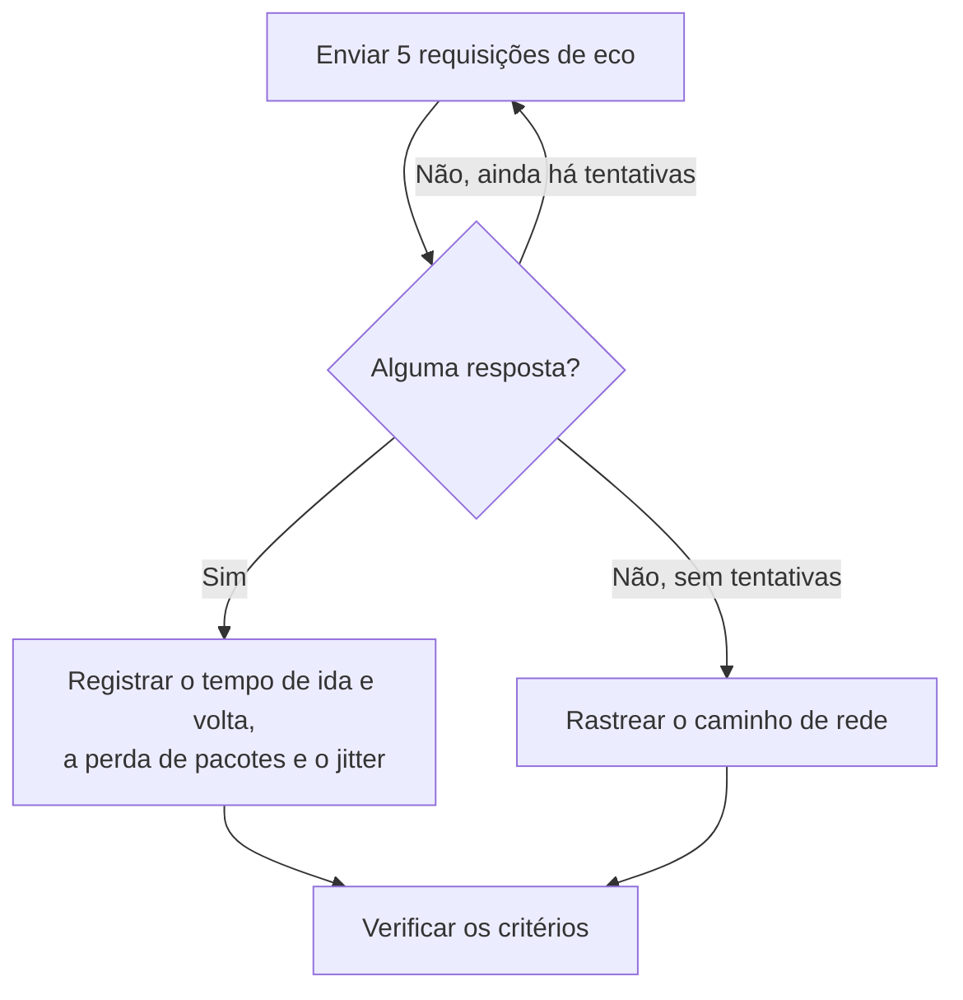

# Monitor de IP

Um monitor de IP verifica se um endereço IPv4 ou IPv6 responde ao ping (requisições de eco ICMP) e mede o tempo de ida e volta, a perda de pacotes e o jitter. Use-o para a infraestrutura que você conhece pelo endereço, como um gateway, o IP virtual de um balanceador de carga ou um servidor com endereço fixo.

:::cards
- [Criar o monitor](#criar-um-monitor-de-ip): Seis etapas no painel.
- [Opções de configuração](#opções-de-configuração): O endereço, o tempo limite e as novas tentativas.
- [Critérios de monitoramento](#critérios-de-monitoramento): Alcançabilidade, latência, perda de pacotes e jitter.
- [Solução de problemas](#solução-de-problemas): Quando o endereço está no ar mas o monitor diz que está offline.
:::

## Como funciona

Um monitor de IP executa a mesma verificação que um [monitor de ping](/docs/monitor/ping-monitor). A cada verificação, uma sonda envia cinco requisições de eco ao endereço. Se pelo menos uma resposta voltar, o endereço está online, e a sonda registra o tempo médio de ida e volta como tempo de resposta, junto com a perda de pacotes, o jitter e as respostas mais rápida e mais lenta. Se nenhuma resposta voltar, a sonda tenta de novo, até o número de novas tentativas que você permitir. Depois, o OneUptime passa o resultado pelos critérios do monitor.

Quando uma verificação falha, a sonda também rastreia a rota até o endereço, e anexa o que encontrou ao resultado como **Network Path at Time of Failure**, para você ver onde a rota se interrompeu.

Qual usar:

| Monitor | Aceita | Use quando |
| --- | --- | --- |
| **IP** | Somente um endereço IP | O próprio endereço é o que você vigia, e ele não muda. |
| [Ping](/docs/monitor/ping-monitor) | Um nome de host ou um endereço IP | Você conhece o host pelo nome; o nome é resolvido a cada verificação, então o monitor acompanha as mudanças de DNS. |

> [!NOTE]
> Alguns provedores de hospedagem bloqueiam ICMP nas máquinas em que uma sonda roda. Uma sonda que não consegue enviar pings de forma alguma verifica a porta TCP `80` do endereço, para que o monitor ainda diga se ele está acessível. A perda de pacotes e o jitter não são medidos nesse caso.

Uma sonda que perdeu a própria conexão de rede não informa nenhum resultado, então não pode marcar o seu endereço como offline.

## Antes de começar

- **Uma função que possa criar monitores**: Project Owner, Project Admin, Project Member, Monitor Admin ou Monitor Member, ou uma função personalizada com a permissão Create Monitor.
- **Uma sonda que alcance o endereço**, com ICMP permitido no caminho. As sondas padrão do seu projeto são escolhidas para cada monitor novo. Se um firewall o protege, libere as requisições de eco ICMP dos [endereços IP das sondas do OneUptime Cloud](/docs/configuration/ip-addresses). Um endereço privado precisa de uma [sonda personalizada](/docs/probe/custom-probe) nessa rede, e um endereço IPv6 precisa de uma sonda com conectividade IPv6.

## Criar um monitor de IP

:::steps
### Começar um monitor novo

Acesse **Monitores** e clique em **Criar monitor**. Em **Tipo de monitor**, clique em **Mais tipos de monitor** e escolha **IP** em **Basic Monitoring**.

### Dar um nome a ele

Informe um **Nome**, como `Office gateway`, e clique em **Próximo**.

### Informar o endereço

Em **Endereço IP**, informe o endereço IPv4 ou IPv6 a verificar, como `192.168.1.1` ou `2001:db8::1`. Um nome de host não é aceito: o campo mostra um erro. Para pingar um host pelo nome, use um [monitor de ping](/docs/monitor/ping-monitor).

### Testá-lo

Clique em **Testar monitor**, escolha uma sonda em **Selecionar Sonda** e clique em **Executar teste**. **Resultado do Teste do Monitor** mostra os tempos de ida e volta e a perda de pacotes que a sonda viu.

### Revisar os critérios

**Critérios do monitor** começa com os [critérios padrão](#critérios-padrão): offline quando o endereço não responde, online quando responde. Altere-os se precisar e clique em **Próximo**.

### Escolher as sondas e criar

Mantenha ou altere as **Sondas** e o **Intervalo de monitoramento** (começa em **A cada 5 minutos**) e clique em **Criar monitor**. A página do monitor abre.
:::

## Opções de configuração

| Campo | Padrão | O que informar |
| --- | --- | --- |
| **Endereço IP** | Nenhum | Um endereço IPv4, como `192.168.1.1`, ou um endereço IPv6, como `2001:db8::1`. Os colchetes em volta de um endereço IPv6 são removidos. |
| **Tempo Limite da Requisição (segundos)** (em **Mais campos**) | `60` | Quanto esperar por uma resposta a cada tentativa. O máximo é 60 segundos. |
| **Tentativas em caso de falha** (em **Mais campos**) | Padrão da sonda, geralmente `3` | Quantas vezes repetir uma tentativa que falhou. O máximo é 3. |

**Tentativas em caso de falha** conta as novas tentativas _depois_ da primeira, então `0` executa a verificação uma vez e `2` até três vezes. Em branco, usa o padrão da sonda: 3, a menos que `PROBE_MONITOR_RETRY_LIMIT` da sonda diga outra coisa. Toda falha é repetida, tempos limite incluídos, com uma pausa de um segundo entre as tentativas. Uma verificação bem-sucedida cujas respostas demoraram mais de 10 segundos também é verificada de novo.

## Critérios de monitoramento

Os critérios decidem quando o endereço conta como online, degradado ou offline, e se isso declara um incidente ou cria um alerta. Cada critério verifica um ou mais filtros:

| Filtro | Condições | O que verifica |
| --- | --- | --- |
| **Is Online** | **Verdadeiro**, **Falso** | Se pelo menos uma requisição de eco recebeu resposta. |
| **Tempo de resposta (em ms)** | **Greater Than**, **Less Than**, **Greater Than Or Equal To**, **Less Than Or Equal To** | O tempo médio de ida e volta das respostas. |
| **Packet Loss (in %)** | **Greater Than**, **Less Than**, **Greater Than Or Equal To**, **Less Than Or Equal To** | A parcela das cinco requisições de eco que ficaram sem resposta. |
| **Jitter (in ms)** | **Greater Than**, **Less Than**, **Greater Than Or Equal To**, **Less Than Or Equal To** | O desvio padrão dos tempos de ida e volta entre os pacotes enviados em uma verificação. |
| **Is Request Timeout** | **Verdadeiro**, **Falso** | Se o ping excedeu o tempo limite em todas as tentativas. |

Com dois ou mais filtros, **Condição de correspondência** decide se **Todos** precisam corresponder ou se basta **Qualquer** um. As **Ações** de um critério decidem o que ele faz: mudar o status do monitor, criar um alerta, declarar um incidente, ou várias dessas coisas.

### Critérios padrão

Um monitor de IP novo começa com dois critérios:

- **Offline** — o endereço não responde a nenhuma das requisições de eco, ou não pode ser alcançado de forma alguma, depois de todas as novas tentativas. O monitor é marcado como **Offline** e um incidente chamado "_monitor name_ is offline" é criado. O incidente se resolve sozinho quando o endereço volta a responder.
- **No ar** — o endereço responde. O monitor é marcado como **Operacional**.

Os critérios são verificados de cima para baixo, e o primeiro que corresponde decide o que acontece. Quando nenhum corresponde, o monitor mostra o status padrão: **Operacional**, a menos que você escolha outro em **Mais campos**, abaixo dos critérios.

### Avaliar durante um período de tempo

**Avaliar este critério durante um período de tempo** é uma caixa de seleção abaixo de um filtro, oferecida para **Is Online**, **Tempo de resposta (em ms)**, **Packet Loss (in %)** e **Jitter (in ms)**. Ative-a para avaliar uma janela de verificações anteriores em vez da última: escolha uma agregação em **Avaliar** e uma janela, de 2 a 60 minutos, em **Nos últimos (em minutos)**.

| Agregação | Corresponde quando |
| --- | --- |
| **Média**, **Soma**, **Maximum Value**, **Minimum Value** | Esse valor, na janela, atende à condição. Somente filtros numéricos. |
| **All Values** | Cada verificação na janela atende à condição. |
| **Any Value** | Pelo menos uma verificação na janela atende à condição. |

**All Values** só corresponde quando a janela está realmente coberta por dados. Um monitor recém-criado, ou um cujas verificações deixaram de ser registradas, não tem histórico suficiente para dizer algo sobre os últimos N minutos, então o critério espera em vez de corresponder com a única leitura que tem. **Any Value** é a configuração para "me avise no momento em que uma única verificação ultrapassar o limite" e continua disparando imediatamente.

**Se não houver dados** decide o que acontece enquanto a janela não consegue sustentar o critério:

| Opção | O que acontece | Use para |
| --- | --- | --- |
| **Ignore** (padrão) | O critério não corresponde. | Alertas de limite comuns. |
| **Trigger** | A falta de dados conta como o problema. | Verificações em que o silêncio é em si uma falha. |
| **Treat As Zero** | A janela é comparada como um único zero. | Contadores em que nenhum evento significa realmente zero. |

### Exemplos de critérios

| Objetivo | Filtro | Condição | Valor |
| --- | --- | --- | --- |
| Offline quando o endereço está inacessível | **Is Online** | **Falso** | — |
| Alertar quando a latência está alta | **Tempo de resposta (em ms)** | **Greater Than** | `100` |
| Marcar o endereço como degradado em um enlace com perdas | **Packet Loss (in %)** | **Greater Than** | `20` |
| Alertar sobre uma conexão instável | **Jitter (in ms)** | **Greater Than** | `30` |

## Solução de problemas

:::details O endereço está no ar, mas o monitor diz que está offline
O endereço, ou um firewall na frente dele, não responde às requisições de eco ICMP da sonda. Libere as requisições de eco ICMP das sondas, ou vigie um serviço nesse endereço com um [monitor de porta](/docs/monitor/port-monitor). **Network Path at Time of Failure**, na verificação que falhou, mostra até onde a rota chegou.
:::

:::details Um endereço IPv6 sempre falha
A sonda que executou a verificação não tem conectividade IPv6; a falha diz isso. Execute o monitor em uma sonda com IPv6: veja [Sondas personalizadas](/docs/probe/custom-probe).
:::

:::details A perda de pacotes e o jitter estão vazios
A sonda que executou a verificação não consegue enviar pings, então verificou a porta TCP `80`, que não mede nenhum dos dois. Execute o monitor em uma sonda com permissão para enviar ICMP.
:::

## Próximos passos

:::cards
- [Monitor de ping](/docs/monitor/ping-monitor): Pingar um host pelo nome, acompanhando as mudanças de DNS.
- [Monitor de porta](/docs/monitor/port-monitor): Verificar um serviço no endereço, não só o endereço.
- [Sondas personalizadas](/docs/probe/custom-probe): Verificar endereços privados e IPv6 a partir da sua própria rede.
- [Incidentes](/docs/incidents/index): O que acontece depois que o monitor declara um.
:::
