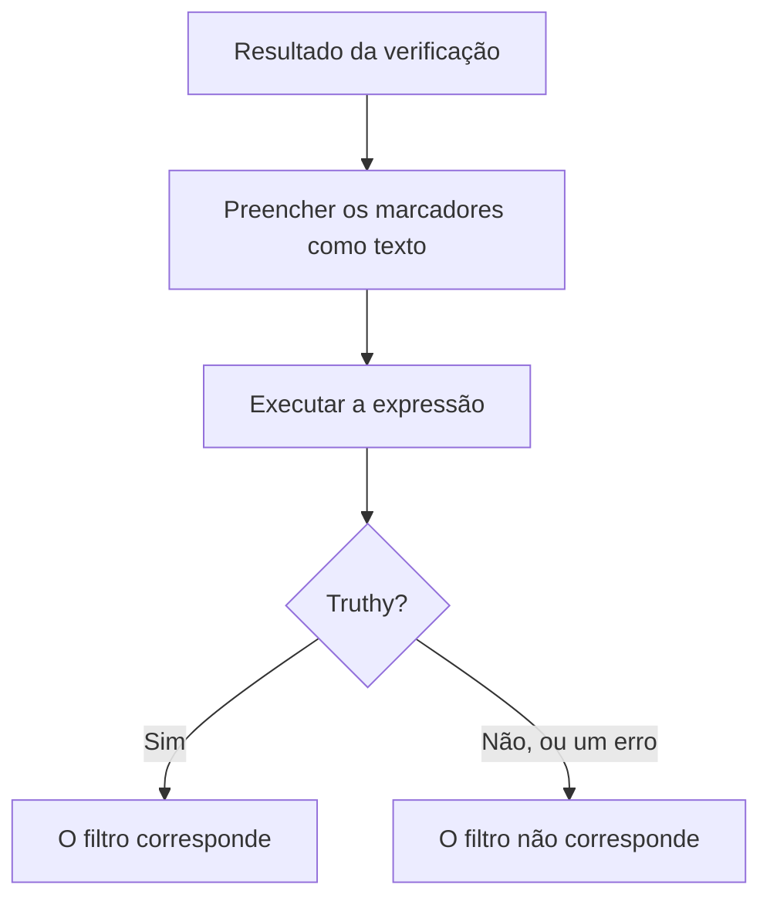

# Expressões JavaScript

Um filtro de critério **JavaScript Expression** decide se o critério de um monitor é atendido com uma linha de JavaScript em vez de uma comparação fixa. Use-o quando os filtros prontos não conseguem expressar a condição — um campo dentro de uma resposta JSON, dois valores comparados entre si, ou várias verificações combinadas com `&&` e `||`.

:::cards
- [Como funciona](#como-funciona): Os marcadores são preenchidos e depois a expressão é executada.
- [Variáveis](#variáveis-por-tipo-de-monitor): O que cada tipo de monitor oferece.
- [Exemplos](#exemplos): Expressões para APIs, requisições recebidas e bancos de dados.
- [Regras de aspas](#regras-de-aspas): O erro que quase todo mundo comete.
:::

## Como funciona

Antes de a expressão ser executada, cada marcador `{{variable}}` dentro dela é substituído pelo valor da última verificação do monitor — como texto puro. O resultado é então executado como JavaScript. Se resultar num valor verdadeiro (truthy), o filtro corresponde; qualquer outra coisa, incluindo um erro, significa que ele não corresponde.



Como os marcadores são substituídos como texto, `{{responseBody.item}}` vira o valor bruto. Uma string precisa estar entre aspas para ser uma string JavaScript; um número ou um booleano não — veja [Regras de aspas](#regras-de-aspas). As expressões são executadas no servidor do OneUptime, num sandbox isolado.

## Adicionar um filtro JavaScript Expression

:::steps
### Abrir os critérios

No monitor, abra **Configuração → Critérios** e clique em **Editar: Critérios de Monitoramento**, ou use o passo **Critérios** de **Criar monitor**. Trabalhe no critério que você quer mudar, ou clique em **Adicionar critérios** para um novo.

### Adicionar um filtro

Em **Filtros**, clique em **Adicionar filtro** e defina o **Tipo de filtro** dele como **JavaScript Expression**. A **Condição do filtro** é **Evaluates To True**.

### Escrever a expressão

Digite a expressão em **Valor**, usando as [variáveis do tipo de monitor](#variáveis-por-tipo-de-monitor). O link abaixo do filtro, **Read documentation for using JavaScript expressions here.**, abre esta página.

### Salvar

Salve o monitor. O filtro é avaliado na próxima verificação do monitor.
:::

## Variáveis por tipo de monitor

As expressões JavaScript são oferecidas para monitores do tipo Site, API, Incoming Request, Incoming Email, SQL Query e Database Health.

### Monitores de site e de API

| Variável | Descrição | Tipo |
| --- | --- | --- |
| `responseBody` | O corpo da resposta. Se o corpo da resposta for JSON, ele é analisado; caso contrário, como em HTML ou XML, é uma string. | `string` ou `JSON` |
| `responseHeaders` | Os cabeçalhos da resposta, com os nomes em minúsculas. | `Dictionary<string>` |
| `responseStatusCode` | O código de status da resposta. | `number` |
| `responseTimeInMs` | O tempo de resposta em milissegundos. | `number` |
| `isOnline` | Se o monitor conta a resposta como no ar. | `boolean` |

### Monitores de requisições recebidas

| Variável | Descrição | Tipo |
| --- | --- | --- |
| `requestBody` | O corpo da requisição. | `string` ou `JSON` |
| `requestHeaders` | Os cabeçalhos da requisição, com os nomes em minúsculas. | `Dictionary<string>` |

### Monitores de consultas SQL

| Variável | Descrição | Tipo |
| --- | --- | --- |
| `rowCount` | O número de linhas que a consulta retornou. | `number` |
| `scalarValue` | A primeira coluna da primeira linha. | qualquer |
| `firstRow` | A primeira linha, como pares coluna/valor. | `JSON` |
| `executionTimeInMs` | Quanto tempo a consulta levou, em milissegundos. | `number` |
| `queryError` | O erro da consulta, se houve um. | `string` |
| `isOnline` | Se o banco de dados estava alcançável e a consulta deu certo. | `boolean` |

### Monitores de saúde de banco de dados

`isOnline`, `engineVersion`, `connectionError`, `collectedGroups`, `unavailableGroups` e `metrics`. Veja [Variáveis de expressão JavaScript](/docs/monitor/database-health-monitor#variáveis-das-expressões-javascript) na página do monitor de saúde de banco de dados.

### Monitores de e-mails recebidos

O filtro é oferecido, mas nenhum campo de e-mail está ligado a ele: uma expressão não consegue ler o assunto, o remetente, o corpo nem o destinatário. Use os tipos de filtro de e-mail em vez disso — veja [Monitor de e-mails recebidos](/docs/monitor/incoming-email-monitor#tipos-de-filtro-disponíveis).

## Exemplos

Cada linha abaixo é uma expressão completa. Para um corpo de resposta JSON como este:

```json
{
  "item": "hello",
  "count": 3,
  "items": [{ "name": "hello" }]
}
```

| Expressão | Corresponde quando |
| --- | --- |
| `"{{responseBody.item}}" === "hello"` | O campo `item` é `hello`. |
| `{{responseBody.count}} > 2` | O campo `count` é maior que 2. |
| `"{{responseBody.items[0].name}}" === "hello"` | O primeiro elemento de `items` tem o nome `hello`. |
| `{{responseStatusCode}} === 200 && {{responseTimeInMs}} < 500` | O status é 200 e a resposta levou menos de meio segundo. |
| `/hel+o/.test("{{responseBody.item}}")` | O campo `item` corresponde a uma expressão regular. |
| `"{{responseHeaders.content-type}}".startsWith("application/json")` | A resposta é JSON. Os nomes dos cabeçalhos ficam em minúsculas. |

Combine condições com `&&` e `||`, e agrupe-as com parênteses:

```javascript
({{responseStatusCode}} === 200 || {{responseStatusCode}} === 204) && {{responseTimeInMs}} < 1000
```

Para um monitor de requisições recebidas que recebe `{"status": "degraded", "region": "eu"}` como `Content-Type: application/json`:

```javascript
"{{requestBody.status}}" === "degraded" && "{{requestBody.region}}" === "eu"
```

Para um monitor de consultas SQL cuja consulta retorna uma contagem, alertar quando a contagem é alta ou a consulta é lenta:

```javascript
{{scalarValue}} > 50 || {{executionTimeInMs}} > 2000
```

Para um monitor de saúde de banco de dados, leia uma métrica indexando o objeto `metrics` inteiro — os nomes das séries contêm pontos, então não podem ir dentro das chaves:

```javascript
{{metrics}}['oneuptime.monitor.database.connections.used.percent'] > 90
```

## Regras de aspas

`{{var}}` é substituído pelo valor, como texto. Para comparar uma string, coloque-a entre aspas, como em `"{{responseBody.item}}" === "hello"`; para comparar um número, deixe-o sem aspas, como em `{{responseStatusCode}} === 200`.

| Tipo de valor | Como escrever | Exemplo |
| --- | --- | --- |
| String | Entre aspas | `"{{responseBody.status}}" === "ok"` |
| Número | Sem aspas | `{{responseTimeInMs}} < 500` |
| Booleano | Sem aspas | `{{isOnline}} === true` |
| Objeto ou array | Sem aspas, depois indexado | `{{responseHeaders}}['content-type']` |

Três coisas para observar:

- **Um marcador sozinho entre aspas é sempre verdadeiro.** `"{{responseBody.healthy}}"` é a string não vazia `"false"` quando o campo é `false`. Compare-o: `"{{responseBody.healthy}}" === "true"`, ou deixe-o sem aspas: `{{responseBody.healthy}} === true`.
- **Os valores não são escapados.** Um valor que contém aspas duplas ou uma quebra de linha termina a string antes da hora, e a expressão falha. Para procurar texto numa página HTML, use o filtro **Corpo da Resposta** em vez disso.
- **Um caminho que não existe fica como está escrito.** Se a verificação não tiver esse campo, `{{responseBody.item}}` fica como está na expressão, o que normalmente é um erro de sintaxe — então o filtro não corresponde.

## Limites

Uma expressão tem 5 segundos para ser executada. Uma que leva mais tempo, ou que lança um erro, não corresponde, e o erro é escrito no log do servidor do OneUptime.

## Solução de problemas

:::details A expressão nunca corresponde
Confira primeiro as aspas: um marcador de string sem aspas vira uma palavra solta, o que é um erro de sintaxe, e um erro nunca corresponde. Depois, confira se o caminho existe no resultado da verificação — um marcador de um caminho que não existe não é preenchido.
:::

:::details A expressão sempre corresponde
Um marcador sozinho entre aspas é uma string não vazia, que é sempre truthy. Compare-o com um valor.
:::

## Próximos passos

:::cards
- [Modelos de incidentes e alertas](/docs/monitor/incident-alert-templating): Usar os mesmos marcadores nos títulos e descrições dos incidentes.
- [Monitor de API](/docs/monitor/api-monitor): Verificar um endpoint HTTP e a resposta dele.
- [Monitor de requisições recebidas](/docs/monitor/incoming-request-monitor): Avaliar as requisições que outros sistemas enviam para você.
:::
