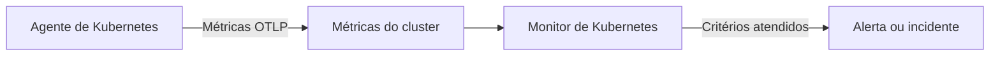

# Monitor de Kubernetes

Um monitor de Kubernetes alerta com base nas métricas que o agente de Kubernetes do OneUptime envia de um cluster: nós, pods, contêineres, cargas de trabalho, autoescaladores e o plano de controle. Comece por um modelo de alerta pronto, escolha uma única métrica ou escreva sua própria consulta e depois defina o limite que abre um alerta ou um incidente.

:::cards
- [Instalar o agente](/docs/monitor/kubernetes-agent): Um único comando do Helm coloca o cluster no OneUptime.
- [Criar o monitor](#criar-um-monitor-de-kubernetes): Escolher o cluster e depois um modelo, uma métrica ou uma consulta.
- [Modelos de alerta](#modelos-de-alerta-prontos): Dezessete alertas prontos, de CrashLoopBackOff a etcd.
- [Critérios](#critérios-de-monitoramento): Limites estáticos e detecção de anomalias.
:::

## Como funciona

O agente envia as métricas do cluster para o OneUptime via OTLP, cada uma marcada com o nome do cluster (`k8s.cluster.name`, o `clusterName` do chart). Os primeiros dados de um nome novo registram o cluster em **Kubernetes**, e a partir daí o cluster pode ser escolhido em um monitor de Kubernetes. A cada minuto, o monitor consulta essas métricas no seu **Intervalo de tempo**, agrega os valores e compara o resultado com seus critérios.

## Antes de começar

- O agente de Kubernetes do OneUptime em execução no cluster. Consulte [Agente Kubernetes (instalação via Helm)](/docs/monitor/kubernetes-agent); o cluster aparece em **Kubernetes** alguns minutos depois da instalação.
- Para os modelos do plano de controle (**etcd No Leader**, **API Server Request Saturation**, **Scheduler Backlog**): a coleta do plano de controle pelo agente, `controlPlane.enabled`. Clusters gerenciados (EKS, GKE, AKS) não expõem esses endpoints, então esses monitores nunca recebem dados neles.

## Criar um monitor de Kubernetes

:::steps
### Começar um monitor novo

Acesse **Monitores** e clique em **Criar monitor**. Em **Mais tipos de monitor**, escolha **Kubernetes** – ou digite `k8s` na caixa de busca.

### Escolher o cluster

Selecione-o em **Cluster Kubernetes**. A lista contém todo cluster a partir do qual o agente informou.

### Escolher o que monitorar

Use uma das três abas:

| Aba | O que você escolhe |
| --- | --- |
| **Quick Setup** | Um [modelo de alerta pronto](#modelos-de-alerta-prontos). Ele preenche a métrica, o escopo, o intervalo de tempo e os critérios; você ainda pode mudar o **Intervalo de tempo**. |
| **Custom Metric** | Uma métrica do [catálogo de métricas](#catálogo-de-métricas) e depois seu **Escopo do recurso**, filtros, **Agregação** (Média, Máximo, Mínimo, Soma ou Contagem) e **Intervalo de tempo**. |
| **Avançado** | O **Escopo do recurso**, os filtros e o **Intervalo de tempo**, além das suas próprias consultas de métricas e fórmulas em **Selecionar Métricas**, com um gráfico ao vivo do resultado. |

### Definir os critérios

Defina quando o monitor muda de status e quando abre um alerta ou um incidente – consulte [Critérios de monitoramento](#critérios-de-monitoramento). Um modelo já os preencheu: revise os limites, as gravidades e as políticas de plantão.

### Salvar o monitor

Conclua o formulário e salve. O monitor aparece em **Monitores**, e seu status segue os seus critérios desde a primeira avaliação.
:::

## Opções de configuração

### Escopo do recurso e filtros

**Escopo do recurso** define o nível em que a métrica é avaliada e decide quais filtros o formulário mostra. Todos os filtros são opcionais.

| Escopo | Monitora | Filtros |
| --- | --- | --- |
| Cluster | O cluster inteiro | — |
| Namespace | Os recursos de um namespace | **Namespace** |
| Carga de trabalho | Um deployment, statefulset, daemonset, job ou cronjob | **Namespace**, **Nome da Carga de Trabalho** |
| Nó | Um nó do cluster | **Nome do nó** |
| Pod | Um pod | **Namespace**, **Nome do Pod** |

### Intervalo de tempo

**Intervalo de tempo** é a janela que a consulta de métricas cobre a cada avaliação do monitor, de **Past 1 Minute** a **Past 365 Days**. Janelas curtas (de 1 a 15 minutos) servem para alertas; as mais longas suavizam métricas ruidosas.

### Consultas de métricas e fórmulas

Na aba **Avançado**, cada consulta indica uma métrica, como seus valores são agregados e filtros de atributos opcionais. Uma **fórmula** combina consultas com aritmética – os modelos de utilização de nós, por exemplo, dividem o uso pela capacidade alocável.

## Catálogo de métricas

A aba **Custom Metric** oferece estas métricas, agrupadas por tipo de recurso:

| Categoria | Métricas |
| --- | --- |
| Pod | Pod CPU Usage, Pod Memory Usage, Pod Phase (Code), Pod Filesystem Usage, Pod Memory Limit Utilization, Pod CPU Limit Utilization, Pod Network I/O (Cumulative, Both Directions) |
| Nó | Node CPU Usage, Node Allocatable CPU, Node Memory Usage, Node Filesystem Usage, Node Allocatable Memory, Node Ready Condition, Node Filesystem Available |
| Contêiner | Container Restarts, Container CPU Limit, Container CPU Request, Container Memory Limit, Container Memory Request, Container Ready |
| Carga de trabalho | Deployment Available Replicas, Deployment Desired Replicas, DaemonSet Misscheduled Nodes, DaemonSet Ready Nodes, StatefulSet Ready Replicas, Job Failed Pods, Job Successful Pods |
| HPA | HPA Current Replicas, HPA Desired Replicas, HPA Max Replicas, HPA Min Replicas |
| Plano de controle | etcd Has Leader, API Server In-Flight Requests, Scheduler Pending Pods |

> [!NOTE]
> **Pod CPU Usage** e **Node CPU Usage** estão em núcleos, não em porcentagem: `0.18` é 0,18 de um núcleo. **Pod Phase (Code)** é um código (1 Pending, 2 Running, 3 Succeeded, 4 Failed, 5 Unknown) – agregue-o com Máximo ou Mínimo, nunca com Soma. As métricas do plano de controle só chegam quando a coleta do plano de controle pelo agente está ativada.

## Critérios de monitoramento

### O que é avaliado

Esses monitores sempre avaliam o **Metric Value** – o valor da consulta de métricas ou da fórmula configurada. O formulário de critérios não tem seletor de tipo de filtro; ele mostra **Métrica**, **Agregação**, **Condição** e **Threshold**.

### Tipos de agregação

| Agregação | Descrição |
| --- | --- |
| Média | Valor médio na janela de tempo |
| Soma | Soma de todos os valores |
| Maximum Value | Valor mais alto na janela de tempo |
| Minimum Value | Valor mais baixo na janela de tempo |
| All Values | Todos os valores precisam atender ao critério |
| Any Value | Pelo menos um valor precisa corresponder |

### Condições

Limites estáticos são comparados com o **Threshold** que você informa: **Greater Than**, **Less Than**, **Greater Than Or Equal To**, **Less Than Or Equal To** e **Equal To**.

A detecção de anomalias por linha de base não precisa de limite. Escolha uma destas condições, e o formulário mostra **Sensibilidade** e **Janela de linha de base** no lugar:

| Condição | Corresponde quando o valor |
| --- | --- |
| **Anomalously High** | Sobe acima da faixa esperada |
| **Anomalously Low** | Cai abaixo da faixa esperada |
| **Anomalous** | Sai da faixa esperada em qualquer direção |

Cada amostra é comparada com uma linha de base da mesma hora da semana construída a partir da **Janela de linha de base** (14 dias por padrão; 28, 60 ou 90 dias). **Sensibilidade** define a largura da faixa esperada: **Baixo (4σ — apenas desvios graves)**, **Médio (3σ — recomendado)**, o padrão, ou **Alto (2σ — mais ruidoso, serviços muito estáveis)**. As condições de anomalia ficam em um estado "Learning" e não produzem alertas até existir pelo menos a janela de linha de base escolhida de histórico da métrica.

**Se não houver dados**, em **Mais campos**, decide o que acontece quando a consulta não retorna nada na janela: **Ignore** (o padrão) não corresponde, **Trigger** trata o silêncio como o problema e **Treat As Zero** compara um zero. O tempo em que o próprio OneUptime não estava recebendo nunca é ausência de dados: uma verificação cuja janela contém esse tempo espera no lugar, como explica [Quando o OneUptime não recebe dados](/docs/monitor/when-oneuptime-is-not-receiving).

## Modelos de alerta prontos

A aba **Quick Setup** lista estes modelos, agrupados por categoria. Cada um preenche dois critérios: um que marca o monitor como offline e abre um incidente e um alerta enquanto a condição vale, e outro que o traz de volta para online quando ela deixa de valer.

| Modelo | Categoria | Dispara quando | Gravidade |
| --- | --- | --- | --- |
| CrashLoopBackOff Detection | Carga de trabalho | Um contêiner reiniciou mais de 5 vezes desde que seu pod foi criado | Crítico |
| Pod Stuck in Pending | Agendamento | Algum pod está na fase Pending em todas as amostras de uma janela de 15 minutos | Warning |
| Node Not Ready | Nó | Um nó informa NotReady | Crítico |
| High Node CPU Utilization | Nó | O uso médio de CPU de um nó passa de 90% da CPU alocável | Warning |
| High Node Memory Utilization | Nó | O uso médio de memória de um nó passa de 85% da memória alocável | Warning |
| Deployment Replica Mismatch | Carga de trabalho | Um deployment tem menos réplicas disponíveis do que o desejado por 15 minutos | Warning |
| Job Failures | Carga de trabalho | Um job tem pods com falha | Warning |
| etcd No Leader | Plano de controle | O etcd não tem líder eleito | Crítico |
| API Server Request Saturation | Plano de controle | O servidor de API mantém 200 ou mais requisições em andamento durante toda a janela | Crítico |
| Scheduler Backlog | Agendamento | A fila de pods pendentes do scheduler não fica vazia por 5 minutos | Warning |
| High Node Disk Usage | Armazenamento | O sistema de arquivos de um nó está mais de 90% cheio | Warning |
| DaemonSet Misscheduled Nodes | Carga de trabalho | Um DaemonSet executa pods em nós que não correspondem mais ao seu seletor de nós, afinidade ou tolerâncias | Warning |
| High Node CPU Request Commitment | Nó | A soma das requisições de CPU dos contêineres de um nó passa de 90% da CPU alocável | Warning |
| High Node Memory Request Commitment | Nó | A soma das requisições de memória dos contêineres de um nó passa de 90% da memória alocável | Warning |
| HPA Saturated at Max Replicas | Carga de trabalho | Um HPA opera em 90% ou mais do seu `maxReplicas` | Crítico |
| Pod Memory Saturating Container Limit | Carga de trabalho | Um pod usa mais de 90% do limite de memória dos seus contêineres | Crítico |
| Pod CPU Saturating Container Limit | Carga de trabalho | Um pod usa mais de 90% do limite de CPU dos seus contêineres | Warning |

Os modelos baseados em métricas por objeto avaliam cada nó, pod, deployment, job, DaemonSet ou HPA separadamente, então um cluster com vários pods com problema recebe um incidente por pod em vez de um único para o cluster inteiro.

> [!NOTE]
> **CrashLoopBackOff Detection** lê a contagem de reinícios do contêiner ao longo da vida do pod atual, não uma taxa. Um contêiner que entrou em loop de falhas e depois se recuperou mantém o alerta aberto até que o pod seja substituído.

### Pegar as causas, não só os sintomas

Os modelos de nível de nó (High Node CPU Utilization, High Node Memory Utilization, Node Not Ready, Pod Stuck in Pending) disparam no *fim* de uma cadeia de esgotamento de recursos, quando o cluster já está degradado. Três modelos disparam no *início* dela, que costuma ser onde está a correção:

- **Pod Memory Saturating Container Limit** e **Pod CPU Saturating Container Limit** pegam uma carga de trabalho encostada nos próprios limites. Passar de um limite de memória causa um OOMKill imediato; passar de um limite de CPU faz o kernel limitar o pod, que fica mais lento sem nunca dar erro. Os dois são a causa habitual por trás de CrashLoopBackOff e de latência sem explicação.
- **HPA Saturated at Max Replicas** pega um autoescalador sem folga. Uma carga de trabalho com limites por pod baixos demais é limitada ou encerrada, o que infla justamente a métrica em que o HPA se baseia para escalar – então o autoescalador continua adicionando réplicas igualmente sem recursos, até chegar ao teto. Aumentar os limites é a correção; aumentar `maxReplicas` piora a situação.

Ative-os juntos em todo namespace que executa uma carga de trabalho com autoescalonamento: a combinação separa "precisa mesmo de mais capacidade" de "tem poucos recursos por pod".

> [!NOTE]
> Os dois modelos de limite de pod dividem o uso do pod pela **soma** dos limites dos seus contêineres, então pods com sidecars são medidos corretamente. O valor de memória de pod do kubelet inclui cache de páginas recuperável, então uma carga de trabalho que usa muitos arquivos pode ficar alta no modelo de memória sem nunca sofrer OOMKill: leia como "chegando perto do limite", e não como "prestes a ser encerrado".

## Solução de problemas

:::details O cluster não aparece na lista Cluster Kubernetes
Os clusters se registram sozinhos a partir dos dados do agente, com o `clusterName` com que o agente foi instalado. Verifique se os pods do agente estão em execução e se o cluster aparece em **Produtos → Infraestrutura → Kubernetes → Todos os clusters**. [Agente Kubernetes (instalação via Helm)](/docs/monitor/kubernetes-agent) cobre a instalação e o que verificar quando nenhum dado chega.
:::

:::details Um modelo do plano de controle nunca dispara
**etcd No Leader**, **API Server Request Saturation** e **Scheduler Backlog** leem métricas que só a coleta do plano de controle pelo agente obtém. Ative `controlPlane.enabled` nos valores do Helm do agente; ela vem desativada por padrão. Clusters gerenciados (EKS, GKE, AKS) não expõem esses endpoints, então neles esses monitores nunca recebem dados.
:::

:::details Um limite de CPU nunca dispara
**Pod CPU Usage** e **Node CPU Usage** estão em núcleos, não em porcentagem, então um limite de `80` significa 80 núcleos. Defina o limite em núcleos, ou comece por **High Node CPU Utilization** ou **Pod CPU Saturating Container Limit**, que comparam uma porcentagem.
:::

:::details CrashLoopBackOff Detection continua aberto depois que o pod se recuperou
O modelo lê a contagem de reinícios do contêiner ao longo da vida do pod atual, então a contagem não volta a cair depois de passar de 5. O alerta é resolvido quando o pod é substituído, por exemplo por uma nova implantação, uma remoção do pod ou o esvaziamento de um nó.
:::

## Próximos passos

:::cards
- [Agente Kubernetes (instalação via Helm)](/docs/monitor/kubernetes-agent): Instalar, atualizar e ajustar o agente com o Helm.
- [Agente Kubernetes](/docs/telemetry/kubernetes-agent): Filtros de namespace, métricas do plano de controle, filtros de gravidade de logs e o agente de IA.
- [Monitor de métricas](/docs/monitor/metrics-monitor): Alertar com base em qualquer métrica, incluindo as métricas personalizadas e eBPF do agente.
- [Modelos de incidentes e alertas](/docs/monitor/incident-alert-templating): Colocar o pod ou o nó que violou o limite nos títulos dos incidentes.
:::
