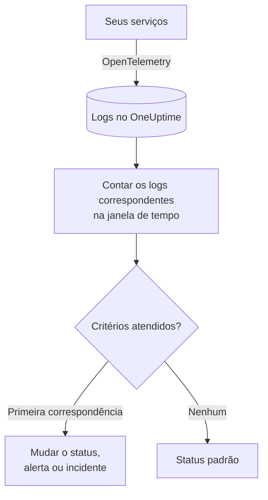
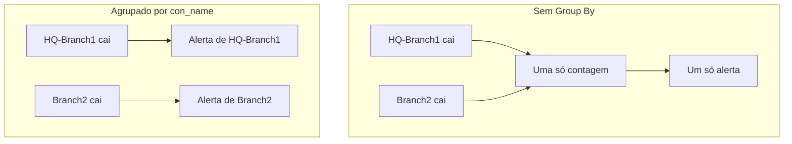

# Monitor de logs

Um monitor de logs conta, em uma janela de tempo, os logs que seus serviços enviam ao OneUptime e que correspondem aos seus filtros (texto, severidade, serviço, atributos). Quando a contagem atende aos seus critérios, ele muda o status do monitor, cria um alerta ou declara um incidente. Use-o para perceber picos de erros, uma mensagem de falha específica ou um serviço que parou de registrar logs.

:::cards
- [Criar o monitor](#criar-um-monitor-de-logs): Escolha quais logs contar e quando alertar.
- [Como ele é avaliado](#como-ele-é-avaliado): A janela de tempo, a contagem e o ciclo de um minuto.
- [Critérios](#critérios): Limites, detecção de anomalias e os valores padrão.
- [Alertas por grupo](#alertas-por-grupo-group-by): Um alerta por túnel, usuário ou interface.
:::

## Como funciona



A cada minuto, o OneUptime conta os logs que correspondem aos filtros do monitor e chegaram dentro da sua janela de tempo. Ele compara essa contagem com os critérios do monitor de cima para baixo, e o primeiro critério que corresponde decide o que acontece. Quando nenhum corresponde, o monitor volta ao seu status padrão.

## Antes de começar

- Seus serviços enviam logs ao OneUptime pelo OpenTelemetry (ou por outra fonte de logs que o OneUptime ingere). Veja [OpenTelemetry](/docs/telemetry/open-telemetry).
- Para filtrar ou agrupar por um valor dentro da linha de log, como o nome de um túnel ou de um usuário, transforme-o primeiro em um atributo com um [pipeline de registros](/docs/telemetry/log-pipelines).

## Criar um monitor de logs

:::steps
### Começar um novo monitor

Vá para **Monitores** e clique em **Criar monitor**.

### Escolher Logs

Em **Tipo de monitor**, clique em **Mais tipos de monitor** e escolha **Registros** em **Telemetria**, ou digite `logs` na caixa de pesquisa. Digite um **Nome** e clique em **Próximo**.

### Escolher os logs a contar

Em **Configuração do monitor de logs**, defina **Monitorar Registros que incluem este texto**, **Monitorar Registros por (tempo)** e **Severidade do Registro**. Um filtro deixado vazio corresponde a todos os logs. **Pré-visualização dos Registros**, abaixo dos filtros, mostra os logs a que eles correspondem agora.

### Refinar (opcional)

Abra **Mais campos** para filtrar por serviço de telemetria, entidade de infraestrutura ou atributo. Para receber um alerta por túnel, usuário ou interface em vez de um para o monitor inteiro, adicione o atributo em **Group by Attributes** (veja [Alertas por grupo](#alertas-por-grupo-group-by)).

### Definir os critérios

O cartão **Critérios do monitor** começa com dois critérios: offline, com um incidente, quando nenhum log corresponde; online quando pelo menos um corresponde. Altere-os para o que você quer alertar (veja [Critérios](#critérios)).

### Criar o monitor

Clique em **Criar monitor**. O monitor abre na sua página **Visão geral**, e sua primeira avaliação acontece em até um minuto.
:::

## O que ele consulta

| Campo | Com o que corresponde | Padrão |
| --- | --- | --- |
| **Monitorar Registros que incluem este texto** | Logs cujo corpo contém este texto, sem diferenciar maiúsculas de minúsculas. | Vazio: todos os logs |
| **Monitorar Registros por (tempo)** | Logs dos últimos 5 segundos até as últimas 24 horas. | **Último 1 minuto** |
| **Severidade do Registro** | Logs com qualquer uma das severidades escolhidas. | Vazio: todas as severidades |
| **Group by Attributes** | Não é um filtro: conta separadamente cada combinação de valores desses atributos. | Vazio: uma só contagem |
| **Filtrar por serviço de telemetria** (em **Mais campos**) | Logs de qualquer um dos serviços escolhidos. | Vazio: todos os serviços |
| **Filter by Infrastructure Entity** (em **Mais campos**) | Logs de qualquer um dos hosts, pods, contêineres e outras entidades escolhidos. | Vazio: todas as entidades |
| **Filtrar por atributos** (em **Mais campos**) | Logs cujos atributos atendem a todas as condições. Cada condição tem seu próprio operador, como "igual a" ou "contém". | Vazio: nenhuma condição |

Todos os filtros que você definir precisam corresponder para que um log seja contado.

### Severidade dos logs

Cada log é armazenado com uma de sete severidades. Para logs do OpenTelemetry, ela vem do número de severidade do log; então escolha a severidade, não o texto que seu logger imprimiu:

| Severidade | Números de severidade do OpenTelemetry |
| --- | --- |
| **Traço** | 1–4 |
| **Debug** | 5–8 |
| **Information** | 9–12 |
| **Warning** | 13–16 |
| **Erro** | 17–20 |
| **Fatal** | 21–24 |
| **Não especificado** | Qualquer outro |

## Como ele é avaliado

- **A cada minuto.** Um monitor de logs não é verificado por sondas, por isso não tem intervalo para configurar nem página **Sondas e intervalo**.
- **Um número por avaliação.** O monitor conta os logs que correspondem a todos os filtros e chegaram dentro de **Monitorar Registros por (tempo)** antes da avaliação. Com **Últimos 5 minutos**, cada avaliação olha cinco minutos para trás, então as janelas de avaliações consecutivas se sobrepõem.
- **Nenhum log é uma contagem de 0.** Um serviço que para de registrar logs produz 0, que é o que o critério offline padrão procura.
- **A indisponibilidade do próprio OneUptime não é silêncio.** Enquanto a janela de tempo contiver um período em que o próprio OneUptime não estava recebendo dados (estava reiniciando, sendo atualizado ou recuperando um atraso), a verificação espera: o status não muda, e nenhum incidente ou alerta é aberto ou resolvido. Veja [Quando o OneUptime não recebe dados](/docs/monitor/when-oneuptime-is-not-receiving).
- **Critérios de cima para baixo.** O primeiro critério que corresponde decide, então coloque o mais grave primeiro. Um monitor agrupado funciona de outro jeito: verifica todos os critérios para cada grupo (veja [A avaliação dos critérios é diferente](#a-avaliação-dos-critérios-é-diferente)).

Cada mudança de status, com o motivo, fica registrada na **Linha do tempo de status** do monitor.

## Critérios

Os critérios de um monitor de logs têm um único **Tipo de filtro**: **Log Count**, o número de logs que corresponderam na janela. Escolha uma **Condição do filtro** e, para uma condição de limite, um **Valor**.

| Condição do filtro | Corresponde quando a contagem de logs está… |
| --- | --- |
| **Greater Than** | acima do valor |
| **Greater Than Or Equal To** | no valor ou acima |
| **Less Than** | abaixo do valor |
| **Less Than Or Equal To** | no valor ou abaixo |
| **Equal To** | exatamente no valor |
| **Anomalously High** | acima da faixa esperada para esta hora da semana |
| **Anomalously Low** | abaixo dessa faixa |
| **Anomalous** | fora dessa faixa, em qualquer direção |

As condições de anomalia não têm **Valor**. Escolha uma **Sensibilidade** (Low, Medium, a padrão, ou High) e uma **Janela de linha de base** de 14 (a padrão), 28, 60 ou 90 dias. O OneUptime transforma a contagem em uma taxa por minuto e a compara com a mesma hora da semana ao longo dessa janela. A linha de base cobre apenas os serviços e as severidades do monitor: seus filtros de texto e de atributos não fazem parte dela. Até que essa hora da semana tenha histórico suficiente, o critério ainda está aprendendo e não dispara.

Um novo monitor de logs começa com estes critérios:

| Critério | Filtro | Efeito |
| --- | --- | --- |
| Check if … is offline | **Log Count** **Equal To** `0` | Coloca o monitor offline e declara um incidente, resolvido automaticamente |
| Check if … is online | **Log Count** **Greater Than** `0` | Coloca o monitor online |

> [!TIP]
> Para alertar sobre erros em vez de silêncio, defina **Severidade do Registro** como **Erro** e mude o critério offline para **Log Count** **Greater Than** o número de erros que você tolera na janela.

## Exemplo prático: um pico de erros

Você quer um incidente quando o serviço de checkout registra mais de 50 erros em cinco minutos:

- **Severidade do Registro**: **Erro**
- **Monitorar Registros por (tempo)**: **Últimos 5 minutos**
- **Filtrar por serviço de telemetria**: `checkout`
- Critério 1: **Log Count** **Greater Than** `50`: colocar o monitor offline e declarar um incidente
- Critério 2: **Log Count** **Less Than Or Equal To** `50`: colocar o monitor online

Quatro avaliações consecutivas:

| Hora | Logs de erro nos últimos 5 minutos | Critério que corresponde | O que acontece |
| --- | --- | --- | --- |
| 10:00 | 12 | 2 | O monitor está online. |
| 10:01 | 64 | 1 | O monitor fica offline e um incidente é declarado. |
| 10:02 | 81 | 1 | Continua offline. O incidente já está aberto, então nenhum segundo é declarado. |
| 10:06 | 9 | 2 | O monitor volta a ficar online, e o incidente se resolve sozinho porque **Resolver incidente automaticamente** está ativado. |

Como as janelas se sobrepõem, uma única rajada de erros mantém a contagem alta por até cinco minutos depois que termina. Use uma janela menor para um monitor que deve se recuperar mais rápido.

## Alertas por grupo (Group By)

**Group by Attributes** divide a contagem de um monitor de logs em uma contagem por combinação distinta de valores de atributos (uma por túnel IPsec, por usuário de VPN, por interface de firewall) e avalia os critérios em cada grupo separadamente. É o equivalente, para logs, do [Group By](/docs/monitor/metrics-monitor#alertas-por-série-group-by) de um monitor de métricas.

### Um alerta por grupo

Sem Group By, um monitor que observa túneis IPsec encerrados é uma única contagem para o monitor inteiro e gera **um único alerta para o monitor inteiro**. Enquanto esse alerta está aberto, a queda de um segundo túnel não produz nada de novo: o monitor já está alertando.

Com Group By no nome do túnel, o encerramento do túnel `HQ-Branch1` abre seu próprio alerta, e o encerramento do túnel `Branch2` dez minutos depois abre um **segundo alerta, separado**, ao lado dele.



### Resolução independente

O alerta ou o incidente de cada grupo se resolve por conta própria. Assim que um grupo deixa de atender aos critérios (`HQ-Branch1` não registra mais encerramentos dentro da janela de tempo), seu alerta se resolve, enquanto o de `Branch2` continua aberto até que `Branch2` também pare. A recuperação de um grupo nunca fecha o alerta de outro.

Um monitor de logs vê eventos, não estados: o alerta de um grupo se resolve assim que esse grupo não registrou nada que atenda aos critérios durante uma janela de tempo inteira, tenha o túnel voltado ou não.

### Exemplo: um alerta por túnel IPsec da Sophos

Isto pressupõe que as linhas de syslog do firewall são divididas em atributos com um [analisador Key=Value](/docs/telemetry/log-pipelines#keyvalue-parser), sem prefixo de destino, de modo que o nome do túnel é o atributo `con_name`:

```text
log_component="IPSec" con_name="HQ-Branch1" status="Terminated" message="IPSec Connection HQ-Branch1 between 10.171.4.117 and 10.171.4.118 for Child HQ-Branch1 terminated."
```

:::steps
1. Crie um monitor de **Registros**.
2. Defina **Monitorar Registros que incluem este texto** como `terminated` e **Monitorar Registros por (tempo)** como **Últimos 5 minutos**.
3. Em **Mais campos**, adicione o filtro de atributo `log_component` = `IPSec`.
4. Em **Group by Attributes**, adicione `con_name`.
5. Adicione um critério com o filtro **Log Count** **Greater Than** `0` que crie um alerta ou um incidente com o título `IPsec tunnel {{con_name}} terminated`.
:::

Cada túnel que registra um encerramento agora recebe seu próprio alerta (`IPsec tunnel HQ-Branch1 terminated`, `IPsec tunnel Branch2 terminated`), e cada um se resolve por conta própria.

### Valores do grupo em títulos e descrições

O valor de cada atributo de Group By é uma [variável de modelo](/docs/monitor/incident-alert-templating) no título, na descrição e nas notas de remediação do alerta ou do incidente, assim como os rótulos de uma série de métricas: agrupar por `con_name` dá a você `{{con_name}}`. Uma chave com pontos é lida como um caminho, então `sophos.con_name` é `{{sophos.con_name}}`. Quando o título ainda não nomeia o grupo, o grupo é acrescentado a ele (`IPsec tunnel terminated - Con Name: HQ-Branch1`), e `{{seriesResourceSuffix}}` e `{{seriesResourceSummary}}` funcionam como nos monitores de métricas.

### Como os grupos são contados

- Até 10 atributos. Cada combinação distinta de seus valores é um grupo.
- Um log que não tem um atributo de Group By é contado com um **valor vazio** para ele, então os logs sem o atributo formam um grupo próprio, cujo alerta não nomeia nenhum valor para ele. Se todos os alertas chegarem sem valor de grupo, verifique a chave do atributo: um pipeline de registros com prefixo de destino armazena `con_name` como `sophos.con_name`.
- Valores de grupo com mais de 256 caracteres são cortados em 256.
- No máximo **100 grupos** são avaliados por verificação: os 100 com mais logs. Quando mais grupos correspondem, os demais são ignorados naquela verificação e um aviso é registrado; restrinja os filtros do monitor para cobri-los.

### A avaliação dos critérios é diferente

- **Todos os critérios são avaliados**, como em um monitor de métricas agrupado, então grupos diferentes podem atender a critérios diferentes ao mesmo tempo. Um grupo que atende a dois critérios ainda recebe um só alerta, o do primeiro; por isso, ordene os critérios do mais grave para o menos grave.
- **Um grupo só existe se registrou algo na janela de tempo.** Por isso, os critérios **Equal To 0** e **Less Than** só disparam para grupos que registraram pelo menos uma vez; para alertar quando os logs param de chegar por completo, use um monitor sem Group By.
- **A detecção de anomalias** (**Anomalously High**, **Anomalously Low**, **Anomalous**) não é avaliada por grupo (sua linha de base cobre o monitor inteiro), então esses filtros nunca correspondem em um monitor agrupado.
- O status do monitor segue o primeiro critério que qualquer grupo atende. Quando nenhum grupo atende a nenhum critério, o monitor volta ao seu status padrão.

## Solução de problemas

:::details O monitor está offline, mas meu serviço está registrando logs
A contagem foi 0, então os filtros não correspondem a nenhum dos logs que o serviço envia. Abra a página **Critérios** do monitor (em **Configuração**) e clique em **Edit Monitoring Criteria**: **Pré-visualização dos Registros** mostra o que os filtros selecionam agora. As causas mais comuns são uma severidade escolhida pelo texto que o logger imprime em vez do seu número de severidade (veja [Severidade dos logs](#severidade-dos-logs)), um filtro de serviço ou de atributo que não corresponde, e uma janela de tempo menor que o intervalo entre os logs do serviço.
:::

:::details Houve um pico, mas nada alertou
Os critérios são verificados de cima para baixo e a primeira correspondência decide. Um critério amplo acima do que você esperava, como **Log Count** **Greater Than** `0`, corresponde primeiro e interrompe o resto. Coloque o critério mais grave no topo.
:::

:::details Um critério de anomalia nunca dispara
Ele ainda está aprendendo: a hora da semana com que compara ainda não tem histórico suficiente. Em um monitor com **Group by Attributes**, as condições de anomalia nunca correspondem; use um limite ali.
:::

:::details Os alertas de grupo chegam sem valor de grupo
Os logs que não têm o atributo de Group By são contados com um valor vazio. Verifique o nome exato da chave no explorador de logs: um pipeline de registros com prefixo de destino armazena `con_name` como `sophos.con_name`.
:::

## Próximos passos

:::cards
- [Pipelines de registros](/docs/telemetry/log-pipelines): Divida linhas de log em atributos para filtrar e agrupar.
- [Modelos de incidentes e alertas](/docs/monitor/incident-alert-templating): Coloque valores de grupo e contagens em títulos e descrições.
- [Monitor de métricas](/docs/monitor/metrics-monitor): Alerte sobre uma métrica, por host ou por contêiner.
- [Monitor de traces](/docs/monitor/traces-monitor): Alerte da mesma forma sobre spans com falha.
:::
