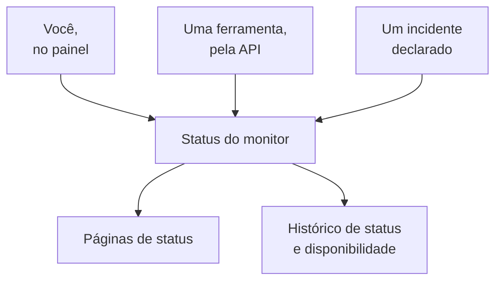

# Monitor manual

Um monitor manual não tem verificações automáticas: o status dele é o que você definir, no painel ou pela API. Use-o para representar algo que o OneUptime não consegue verificar sozinho — uma dependência de terceiros, um sistema físico, um processo de negócio — nas suas páginas de status e nos seus incidentes.

:::cards
- [Criar um](#criar-um-monitor-manual): Um passo no painel.
- [Mudar o status dele](#atualizar-o-status): No painel, ou a partir das suas próprias ferramentas pela API.
- [Incidentes e alertas](#incidentes-e-alertas): Declarar um incidente e definir o status no mesmo passo.
:::

## Quando usar um monitor manual

| Caso de uso | Descrição |
| --- | --- |
| Serviços de terceiros | Acompanhar o status de serviços externos dos quais você depende, mas que não consegue monitorar diretamente. |
| Infraestrutura física | Representar hardware ou sistemas físicos sem monitoramento de rede. |
| Processos de negócio | Acompanhar processos não técnicos que afetam o status do serviço. |
| Status pela API | Deixar que as suas próprias ferramentas definam o status pela API do OneUptime. |
| Espaços reservados em páginas de status | Mostrar na sua página de status componentes gerenciados fora do OneUptime. |

Um provedor que publica uma página de status não precisa de um: um [monitor de página de status externa](/docs/monitor/external-status-page-monitor) acompanha essa página por você.

## Como funciona

Um monitor manual não tem intervalo de monitoramento, sondas nem critérios. O status dele fica como você definiu até que você, uma ferramenta pela API ou um incidente que você declarar o mude — e o novo status aparece em todo lugar onde o monitor aparece.



Cada mudança é uma entrada na **Linha do tempo de status** do monitor, então a disponibilidade e o histórico de status dele são mantidos como os de qualquer outro monitor. Um monitor manual não é um monitor ativo, então no OneUptime Cloud ele não acrescenta nada à sua fatura.

## Criar um monitor manual

:::steps
### Começar um monitor novo

Vá em **Monitores** e clique em **Criar monitor**.

### Escolher Manual

Em **Tipo de monitor**, clique em **Mais tipos de monitor** e escolha **Manual** em **Outro**.

### Dar um nome e criar

Digite um **Nome** — e uma **Descrição** em **Mais campos**, se quiser — e clique em **Criar monitor**. Um monitor manual não precisa de mais nada, então ele é criado a partir deste primeiro passo.
:::

## Atualizar o status

### No painel

:::steps
1. Abra o monitor e clique em **Linha do tempo de status** no menu lateral dele.
2. Clique em **Criar: Monitor Status Evento**.
3. Escolha o **Status do monitor**. **Começa em** é agora; defina um horário anterior se a mudança aconteceu antes.
4. Clique em **Criar: Monitor Status Evento**. O novo status aparece na hora no monitor, e em cada página de status que o lista.
:::

### Pela API

Envie o novo status como um evento de status do monitor, com uma [chave de API](/docs/api-reference/api-reference) do seu projeto no cabeçalho `ApiKey`:

```bash
curl -X POST https://oneuptime.com/api/monitor-status-timeline \
  -H "ApiKey: $ONEUPTIME_API_KEY" \
  -H "Content-Type: application/json" \
  -d '{"data": {"monitorId": "<monitor id>", "monitorStatusId": "<monitor status id>"}}'
```

- `monitorId` é o ID do monitor: clique na linha **ID** da página dele para copiá-lo.
- `monitorStatusId` é o status a definir: em **Monitores → Configurações → Status do monitor**, escolha **Mostrar ID** na linha desse status.
- `startsAt` é opcional. Se for omitido, a mudança começa agora.
- Numa instalação auto-hospedada, envie a requisição para o seu próprio host em vez de `oneuptime.com`.

Enviar o status que o monitor já tem é recusado com `Monitor Status cannot be same as previous status.` e não registra nada, então uma ferramenta que informa a cada execução pode ignorar essa resposta.

## Incidentes e alertas

Um monitor manual é escolhido como qualquer outro em todo lugar onde se escolhem monitores:

- Declare um incidente e escolha o monitor em **Monitores**. Com **Alterar status do monitor para**, declarar o incidente também define o status do monitor, e resolvê-lo devolve o monitor ao status operacional, a menos que outro incidente nele ainda esteja aberto. Veja [Declarar um incidente](/docs/incidents/declaring-incidents#etapa-2-recursos-afetados).
- Crie um alerta sobre ele, para um problema que a sua equipe deve tratar sem avisar os seus clientes.
- Adicione-o a uma página de status, para mostrar aos clientes uma dependência que você acompanha à mão.

## Próximos passos

:::cards
- [Criar um monitor](/docs/monitor/create-monitor): Os tipos de monitor que verificam as coisas por você.
- [Monitor de página de status externa](/docs/monitor/external-status-page-monitor): Acompanhar automaticamente a página de status de um provedor em vez disso.
- [Visão geral das páginas de status](/docs/status-pages/index): Mostrar o status do monitor aos seus clientes.
:::
